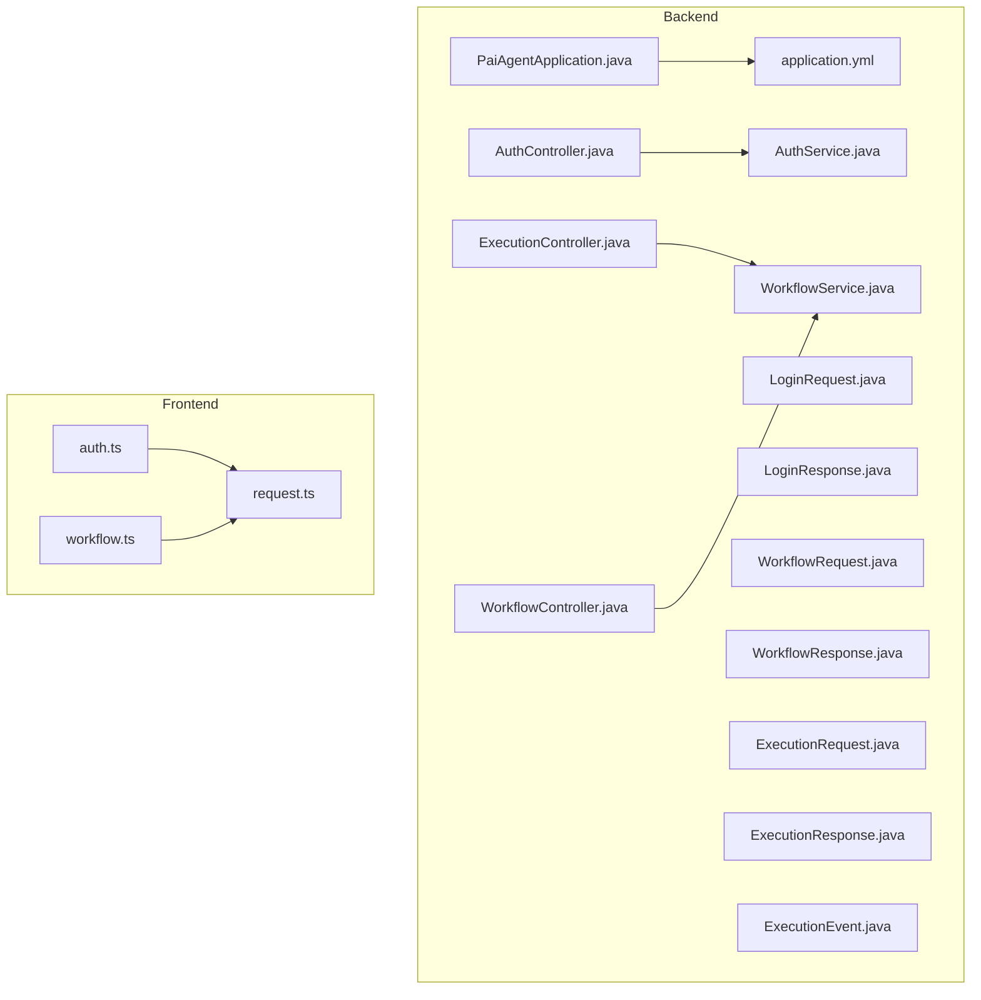
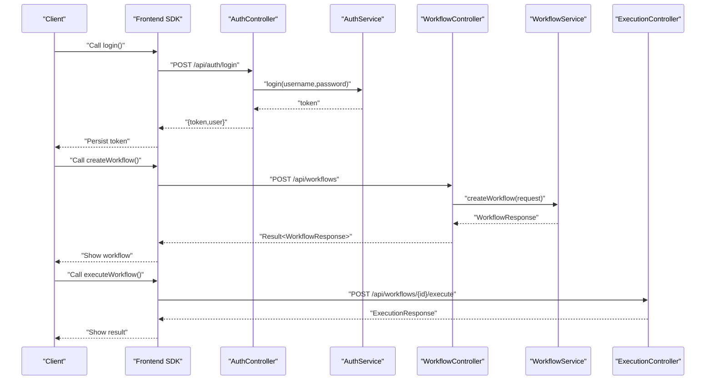
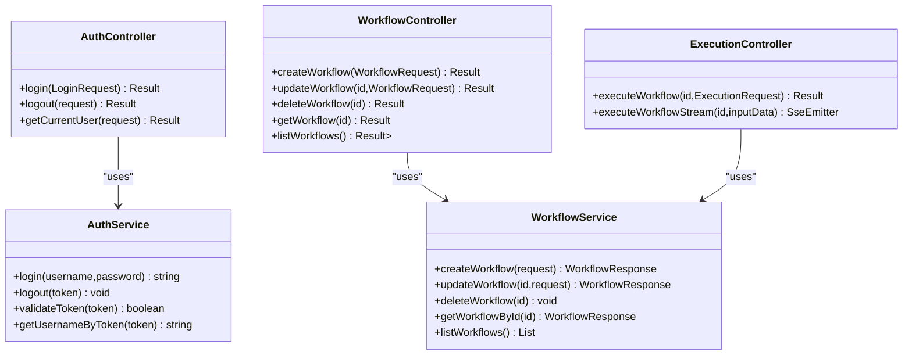

# API Reference

<cite>
**Referenced Files in This Document**
- [PaiAgentApplication.java](file://backend/src/main/java/com/paiagent/PaiAgentApplication.java)
- [application.yml](file://backend/src/main/resources/application.yml)
- [AuthController.java](file://backend/src/main/java/com/paiagent/controller/AuthController.java)
- [ExecutionController.java](file://backend/src/main/java/com/paiagent/controller/ExecutionController.java)
- [WorkflowController.java](file://backend/src/main/java/com/paiagent/controller/WorkflowController.java)
- [AuthService.java](file://backend/src/main/java/com/paiagent/service/AuthService.java)
- [WorkflowService.java](file://backend/src/main/java/com/paiagent/service/WorkflowService.java)
- [LoginRequest.java](file://backend/src/main/java/com/paiagent/dto/LoginRequest.java)
- [LoginResponse.java](file://backend/src/main/java/com/paiagent/dto/LoginResponse.java)
- [WorkflowRequest.java](file://backend/src/main/java/com/paiagent/dto/WorkflowRequest.java)
- [WorkflowResponse.java](file://backend/src/main/java/com/paiagent/dto/WorkflowResponse.java)
- [ExecutionRequest.java](file://backend/src/main/java/com/paiagent/dto/ExecutionRequest.java)
- [ExecutionResponse.java](file://backend/src/main/java/com/paiagent/dto/ExecutionResponse.java)
- [ExecutionEvent.java](file://backend/src/main/java/com/paiagent/dto/ExecutionEvent.java)
- [auth.ts](file://frontend/src/api/auth.ts)
- [workflow.ts](file://frontend/src/api/workflow.ts)
- [request.ts](file://frontend/src/utils/request.ts)
</cite>

## Table of Contents
1. [Introduction](#introduction)
2. [Project Structure](#project-structure)
3. [Core Components](#core-components)
4. [Architecture Overview](#architecture-overview)
5. [Detailed Component Analysis](#detailed-component-analysis)
6. [Dependency Analysis](#dependency-analysis)
7. [Performance Considerations](#performance-considerations)
8. [Troubleshooting Guide](#troubleshooting-guide)
9. [Conclusion](#conclusion)
10. [Appendices](#appendices)

## Introduction
This document provides comprehensive API documentation for the backend REST endpoints exposed by the application. It covers:
- Workflow Management APIs: CRUD operations for workflows with request/response schemas and authentication requirements
- Execution APIs: Initiating workflow execution, real-time status monitoring via Server-Sent Events (SSE), and result retrieval
- Authentication APIs: Login/logout and current user information endpoints
It also includes HTTP methods, URL patterns, request/response formats, error codes, authentication mechanisms, practical examples with curl commands and SDK usage patterns, rate limiting considerations, security considerations, and API versioning strategies.

## Project Structure
The backend is a Spring Boot application with controllers exposing REST endpoints under the /api path. Controllers delegate to services, which interact with data mappers and entities. OpenAPI/Swagger is enabled for API documentation discovery.

**Diagram sources**
- [PaiAgentApplication.java:1-16](file://backend/src/main/java/com/paiagent/PaiAgentApplication.java#L1-L16)
- [application.yml:1-55](file://backend/src/main/resources/application.yml#L1-L55)
- [AuthController.java:1-62](file://backend/src/main/java/com/paiagent/controller/AuthController.java#L1-L62)
- [ExecutionController.java:1-109](file://backend/src/main/java/com/paiagent/controller/ExecutionController.java#L1-L109)
- [WorkflowController.java:1-61](file://backend/src/main/java/com/paiagent/controller/WorkflowController.java#L1-L61)
- [AuthService.java:1-63](file://backend/src/main/java/com/paiagent/service/AuthService.java#L1-L63)
- [WorkflowService.java:1-95](file://backend/src/main/java/com/paiagent/service/WorkflowService.java#L1-L95)
- [LoginRequest.java:1-18](file://backend/src/main/java/com/paiagent/dto/LoginRequest.java#L1-L18)
- [LoginResponse.java:1-29](file://backend/src/main/java/com/paiagent/dto/LoginResponse.java#L1-L29)
- [WorkflowRequest.java:1-22](file://backend/src/main/java/com/paiagent/dto/WorkflowRequest.java#L1-L22)
- [WorkflowResponse.java:1-20](file://backend/src/main/java/com/paiagent/dto/WorkflowResponse.java#L1-L20)
- [ExecutionRequest.java:1-15](file://backend/src/main/java/com/paiagent/dto/ExecutionRequest.java#L1-L15)
- [ExecutionResponse.java:1-29](file://backend/src/main/java/com/paiagent/dto/ExecutionResponse.java#L1-L29)
- [ExecutionEvent.java:1-79](file://backend/src/main/java/com/paiagent/dto/ExecutionEvent.java#L1-L79)
- [auth.ts:1-41](file://frontend/src/api/auth.ts#L1-L41)
- [workflow.ts:1-177](file://frontend/src/api/workflow.ts#L1-L177)
- [request.ts:1-49](file://frontend/src/utils/request.ts#L1-L49)

**Section sources**
- [PaiAgentApplication.java:1-16](file://backend/src/main/java/com/paiagent/PaiAgentApplication.java#L1-L16)
- [application.yml:1-55](file://backend/src/main/resources/application.yml#L1-L55)

## Core Components
- Authentication APIs: Exposed under /api/auth
- Workflow Management APIs: Exposed under /api/workflows
- Execution APIs: Exposed under /api/workflows with additional /execute and /execute/stream endpoints

Authentication:
- Bearer token scheme is used. Tokens are validated against an in-memory store.
- Frontend automatically attaches Authorization: Bearer <token> to requests and handles 401 responses.

OpenAPI/Swagger:
- Enabled and available at /v3/api-docs and /swagger-ui.html with version 1.0.0.

**Section sources**
- [AuthController.java:17-62](file://backend/src/main/java/com/paiagent/controller/AuthController.java#L17-L62)
- [WorkflowController.java:18-61](file://backend/src/main/java/com/paiagent/controller/WorkflowController.java#L18-L61)
- [ExecutionController.java:26-109](file://backend/src/main/java/com/paiagent/controller/ExecutionController.java#L26-L109)
- [application.yml:36-47](file://backend/src/main/resources/application.yml#L36-L47)

## Architecture Overview
The API follows a layered architecture:
- Controllers handle HTTP requests and responses
- Services encapsulate business logic
- DTOs define request/response schemas
- Frontend SDKs consume the API via Axios with interceptors for authentication

**Diagram sources**
- [AuthController.java:25-35](file://backend/src/main/java/com/paiagent/controller/AuthController.java#L25-L35)
- [AuthService.java:33-40](file://backend/src/main/java/com/paiagent/service/AuthService.java#L33-L40)
- [WorkflowController.java:26-31](file://backend/src/main/java/com/paiagent/controller/WorkflowController.java#L26-L31)
- [WorkflowService.java:24-34](file://backend/src/main/java/com/paiagent/service/WorkflowService.java#L24-L34)
- [ExecutionController.java:39-55](file://backend/src/main/java/com/paiagent/controller/ExecutionController.java#L39-L55)

## Detailed Component Analysis

### Authentication APIs
- Base Path: /api/auth
- Content-Type: application/json

Endpoints:
- POST /api/auth/login
  - Purpose: Authenticate user and return a Bearer token
  - Request Schema: LoginRequest
    - username: string (required)
    - password: string (required)
  - Response Schema: LoginResponse
    - token: string
    - user: { username: string }
  - Success: 200 OK
  - Errors: 400 Bad Request (validation), 401 Unauthorized (invalid credentials)

- POST /api/auth/logout
  - Purpose: Invalidate current session/token
  - Headers: Authorization: Bearer <token>
  - Success: 200 OK
  - Errors: 400 Bad Request (missing/invalid token)

- GET /api/auth/current
  - Purpose: Get currently authenticated user
  - Headers: Authorization: Bearer <token>
  - Response: { username: string, authenticated: boolean }
  - Success: 200 OK
  - Errors: 401 Unauthorized (not authenticated)

curl Examples:
- Login:
  - curl -X POST http://localhost:8080/api/auth/login -H "Content-Type: application/json" -d '{"username":"admin","password":"123"}'
- Logout:
  - curl -X POST http://localhost:8080/api/auth/logout -H "Authorization: Bearer YOUR_TOKEN"
- Current User:
  - curl -X GET http://localhost:8080/api/auth/current -H "Authorization: Bearer YOUR_TOKEN"

SDK Usage Patterns:
- Frontend auth.ts exports login, logout, getCurrentUser methods that wrap /api/auth endpoints.

Security Considerations:
- Token storage: Frontend stores token in localStorage; ensure HTTPS and secure cookies in production.
- Default credentials: admin/123 are used for demo; change immediately in production.
- Token validation: In-memory store; consider database-backed tokens and refresh tokens.

**Section sources**
- [AuthController.java:17-62](file://backend/src/main/java/com/paiagent/controller/AuthController.java#L17-L62)
- [AuthService.java:12-63](file://backend/src/main/java/com/paiagent/service/AuthService.java#L12-L63)
- [LoginRequest.java:1-18](file://backend/src/main/java/com/paiagent/dto/LoginRequest.java#L1-L18)
- [LoginResponse.java:1-29](file://backend/src/main/java/com/paiagent/dto/LoginResponse.java#L1-L29)
- [auth.ts:1-41](file://frontend/src/api/auth.ts#L1-L41)
- [request.ts:17-46](file://frontend/src/utils/request.ts#L17-L46)

### Workflow Management APIs
- Base Path: /api/workflows
- Content-Type: application/json

Endpoints:
- POST /api/workflows
  - Purpose: Create a new workflow
  - Request Schema: WorkflowRequest
    - name: string (required)
    - description: string (optional)
    - flowData: string (required)
    - engineType: string (optional)
  - Response Schema: WorkflowResponse
    - id: integer
    - name: string
    - description: string
    - flowData: string
    - engineType: string
    - createdAt: datetime
    - updatedAt: datetime
  - Success: 200 OK
  - Errors: 400 Bad Request (validation)

- PUT /api/workflows/{id}
  - Purpose: Update an existing workflow
  - Path Params: id: integer (required)
  - Request Schema: WorkflowRequest
  - Response Schema: WorkflowResponse
  - Success: 200 OK
  - Errors: 400 Bad Request (validation), 404 Not Found (workflow not found)

- DELETE /api/workflows/{id}
  - Purpose: Delete a workflow
  - Path Params: id: integer (required)
  - Success: 200 OK
  - Errors: 404 Not Found (workflow not found)

- GET /api/workflows/{id}
  - Purpose: Retrieve workflow details
  - Path Params: id: integer (required)
  - Response Schema: WorkflowResponse
  - Success: 200 OK
  - Errors: 404 Not Found (workflow not found)

- GET /api/workflows
  - Purpose: List workflows ordered by last updated
  - Response Schema: array of WorkflowResponse
  - Success: 200 OK

curl Examples:
- Create:
  - curl -X POST http://localhost:8080/api/workflows -H "Content-Type: application/json" -d '{"name":"My WF","flowData":"{}","engineType":"langgraph"}' -H "Authorization: Bearer YOUR_TOKEN"
- Update:
  - curl -X PUT http://localhost:8080/api/workflows/1 -H "Content-Type: application/json" -d '{"name":"Updated WF","flowData":"{}"}' -H "Authorization: Bearer YOUR_TOKEN"
- Delete:
  - curl -X DELETE http://localhost:8080/api/workflows/1 -H "Authorization: Bearer YOUR_TOKEN"
- Get One:
  - curl -X GET http://localhost:8080/api/workflows/1 -H "Authorization: Bearer YOUR_TOKEN"
- List:
  - curl -X GET http://localhost:8080/api/workflows -H "Authorization: Bearer YOUR_TOKEN"

SDK Usage Patterns:
- Frontend workflow.ts exports createWorkflow, getWorkflows, getWorkflow, updateWorkflow, deleteWorkflow methods.

**Section sources**
- [WorkflowController.java:18-61](file://backend/src/main/java/com/paiagent/controller/WorkflowController.java#L18-L61)
- [WorkflowService.java:18-95](file://backend/src/main/java/com/paiagent/service/WorkflowService.java#L18-L95)
- [WorkflowRequest.java:1-22](file://backend/src/main/java/com/paiagent/dto/WorkflowRequest.java#L1-L22)
- [WorkflowResponse.java:1-20](file://backend/src/main/java/com/paiagent/dto/WorkflowResponse.java#L1-L20)
- [workflow.ts:47-77](file://frontend/src/api/workflow.ts#L47-L77)

### Execution APIs
- Base Path: /api/workflows
- Content-Type: application/json unless otherwise noted

Endpoints:
- POST /api/workflows/{id}/execute
  - Purpose: Execute a workflow synchronously
  - Path Params: id: integer (required)
  - Request Schema: ExecutionRequest
    - inputData: string (required)
  - Response Schema: ExecutionResponse
    - executionId: integer
    - status: string
    - nodeResults: array of NodeResult
      - nodeId: string
      - nodeName: string
      - status: string
      - input: string
      - output: string
      - duration: integer
      - error: string
    - outputData: string
    - duration: integer
  - Success: 200 OK
  - Errors: 404 Not Found (workflow not found), 500 Internal Server Error (execution failure)

- GET /api/workflows/{id}/execute/stream
  - Purpose: Execute a workflow asynchronously via Server-Sent Events (SSE)
  - Path Params: id: integer (required)
  - Query Params:
    - inputData: string (required)
    - token: string (required; frontend appends token to URL)
  - Event Types:
    - WORKFLOW_START: Initial event indicating execution start
    - NODE_START: Node execution started
    - NODE_PROGRESS: Node progress updates
    - NODE_SUCCESS: Node completed successfully
    - NODE_ERROR: Node failed with error
    - WORKFLOW_COMPLETE: Final event with status and output
    - ERROR: Error events during execution
  - Success: 201 Created (SSE connection)
  - Errors: 401 Unauthorized (invalid token), 404 Not Found (workflow not found), 500 Internal Server Error

curl Examples:
- Execute (sync):
  - curl -X POST http://localhost:8080/api/workflows/1/execute -H "Content-Type: application/json" -d '{"inputData":"{\"key\":\"value\"}"}' -H "Authorization: Bearer YOUR_TOKEN"
- Execute (stream):
  - curl -N -X GET "http://localhost:8080/api/workflows/1/execute/stream?inputData=%7B%22key%22:%22value%22%7D&token=YOUR_TOKEN"

SDK Usage Patterns:
- Frontend workflow.ts exports executeWorkflow and executeWorkflowStream with EventSource handling for SSE.

**Section sources**
- [ExecutionController.java:26-109](file://backend/src/main/java/com/paiagent/controller/ExecutionController.java#L26-L109)
- [ExecutionRequest.java:1-15](file://backend/src/main/java/com/paiagent/dto/ExecutionRequest.java#L1-L15)
- [ExecutionResponse.java:1-29](file://backend/src/main/java/com/paiagent/dto/ExecutionResponse.java#L1-L29)
- [ExecutionEvent.java:1-79](file://backend/src/main/java/com/paiagent/dto/ExecutionEvent.java#L1-L79)
- [workflow.ts:82-177](file://frontend/src/api/workflow.ts#L82-L177)

## Dependency Analysis
- Controllers depend on services for business logic
- Services use MyBatis-Plus for persistence
- Frontend SDKs depend on Axios interceptors for authentication

**Diagram sources**
- [AuthController.java:17-62](file://backend/src/main/java/com/paiagent/controller/AuthController.java#L17-L62)
- [AuthService.java:12-63](file://backend/src/main/java/com/paiagent/service/AuthService.java#L12-L63)
- [WorkflowController.java:18-61](file://backend/src/main/java/com/paiagent/controller/WorkflowController.java#L18-L61)
- [WorkflowService.java:18-95](file://backend/src/main/java/com/paiagent/service/WorkflowService.java#L18-L95)
- [ExecutionController.java:26-109](file://backend/src/main/java/com/paiagent/controller/ExecutionController.java#L26-L109)

**Section sources**
- [AuthController.java:17-62](file://backend/src/main/java/com/paiagent/controller/AuthController.java#L17-L62)
- [WorkflowController.java:18-61](file://backend/src/main/java/com/paiagent/controller/WorkflowController.java#L18-L61)
- [ExecutionController.java:26-109](file://backend/src/main/java/com/paiagent/controller/ExecutionController.java#L26-L109)
- [WorkflowService.java:18-95](file://backend/src/main/java/com/paiagent/service/WorkflowService.java#L18-L95)
- [AuthService.java:12-63](file://backend/src/main/java/com/paiagent/service/AuthService.java#L12-L63)

## Performance Considerations
- SSE Timeout: The server sets a 300000ms (5 minutes) timeout for SSE connections. Ensure clients handle reconnection gracefully.
- Concurrency: SSE emitters are stored in a concurrent map keyed by emitterId. Avoid excessive simultaneous streams.
- Validation: DTOs enforce non-blank fields; invalid payloads return 400 errors promptly.
- Database: MyBatis-Plus is configured with camelCase mapping and logging enabled for development.

[No sources needed since this section provides general guidance]

## Troubleshooting Guide
Common Issues and Resolutions:
- 401 Unauthorized
  - Cause: Missing or invalid Bearer token
  - Resolution: Re-authenticate via /api/auth/login and ensure token is attached to Authorization header
- 404 Not Found
  - Cause: Non-existent workflow ID
  - Resolution: Verify workflow exists before executing or updating
- 400 Bad Request
  - Cause: Validation errors in request body (e.g., blank fields)
  - Resolution: Ensure required fields are present per DTO schemas
- SSE Connection Errors
  - Cause: Token missing or expired, or server-side exceptions
  - Resolution: Re-login to obtain a new token; check server logs for execution errors

**Section sources**
- [AuthController.java:39-60](file://backend/src/main/java/com/paiagent/controller/AuthController.java#L39-L60)
- [ExecutionController.java:58-108](file://backend/src/main/java/com/paiagent/controller/ExecutionController.java#L58-L108)
- [request.ts:34-46](file://frontend/src/utils/request.ts#L34-L46)

## Conclusion
The API provides a clear set of endpoints for managing workflows and executing them either synchronously or via SSE. Authentication is handled via Bearer tokens, and Swagger/OpenAPI documentation is available. For production, strengthen security (HTTPS, token storage, strong credentials), implement rate limiting, and consider API versioning strategies.

[No sources needed since this section summarizes without analyzing specific files]

## Appendices

### HTTP Status Codes
- 200 OK: Successful operation
- 201 Created: SSE stream established
- 400 Bad Request: Validation errors
- 401 Unauthorized: Authentication required or invalid token
- 404 Not Found: Resource does not exist
- 500 Internal Server Error: Server-side execution failures

### Authentication Mechanism
- Scheme: Bearer token
- Storage: Frontend persists token in localStorage; backend validates via in-memory store
- Interceptor: Frontend adds Authorization header automatically; 401 triggers redirect to login

### Rate Limiting
- Not implemented in the current codebase. Recommended approaches:
  - IP-based limits using Spring Cloud Gateway or filters
  - Per-user quotas for execution endpoints
  - Circuit breakers for downstream LLM calls

### Security Considerations
- Transport: Use HTTPS in production
- Credentials: Change default admin/123 immediately
- Tokens: Consider short-lived access tokens with refresh tokens
- CORS: Configure allowed origins and headers appropriately
- Input Sanitization: Validate and sanitize flowData and inputData

### API Versioning Strategy
- Current version: 1.0.0 (from OpenAPI info)
- Suggested strategies:
  - URL path versioning: /api/v1/workflows
  - Accept header versioning: Accept: application/vnd.company.v1+json
  - Deprecation policy: Announce deprecations with migration timelines

**Section sources**
- [application.yml:44-47](file://backend/src/main/resources/application.yml#L44-L47)
- [request.ts:17-46](file://frontend/src/utils/request.ts#L17-L46)
- [AuthService.java:33-61](file://backend/src/main/java/com/paiagent/service/AuthService.java#L33-L61)