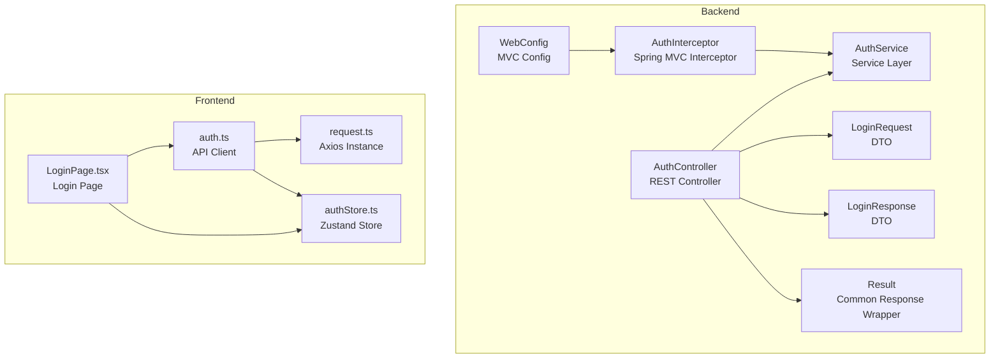
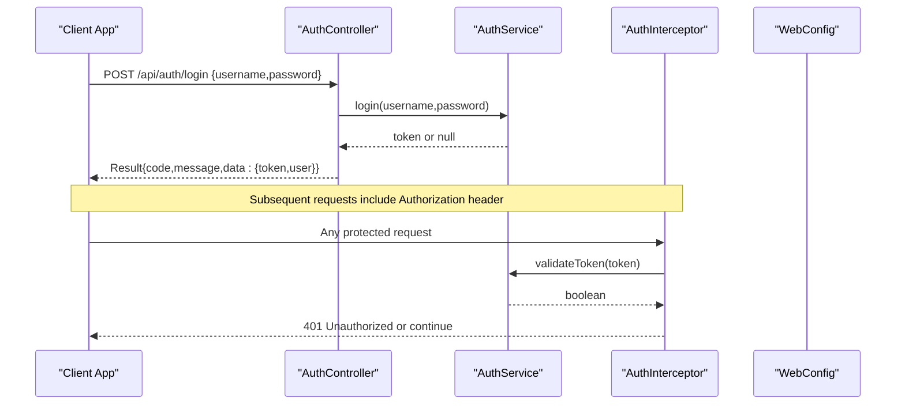
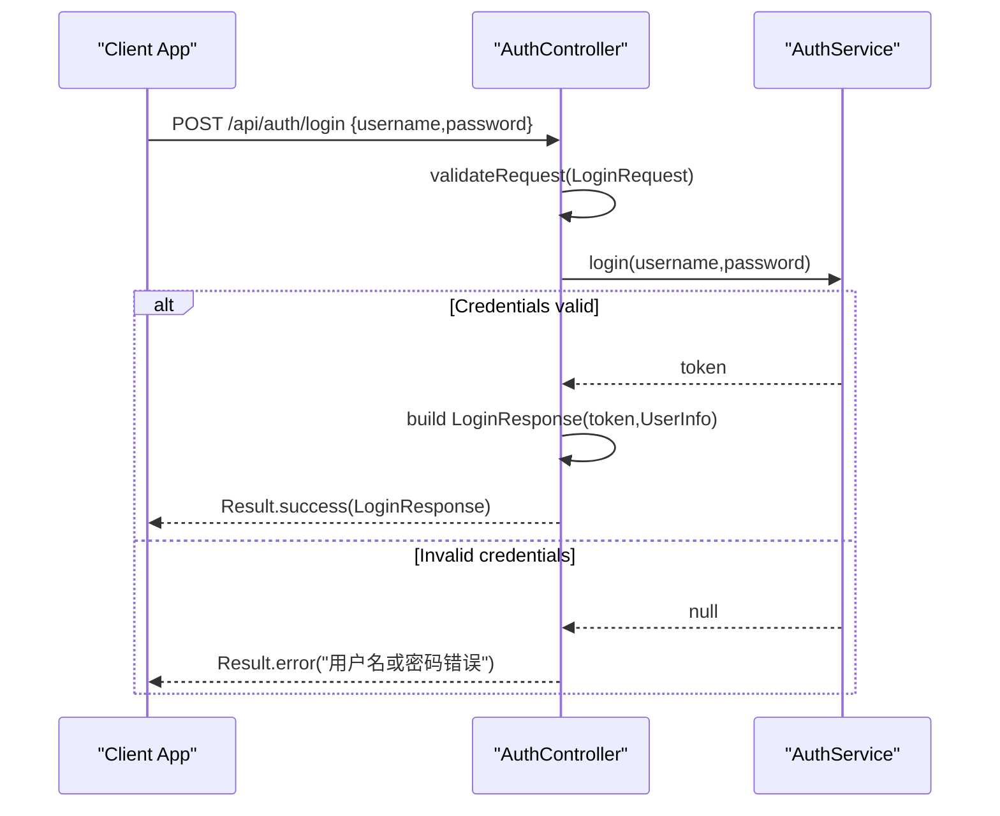
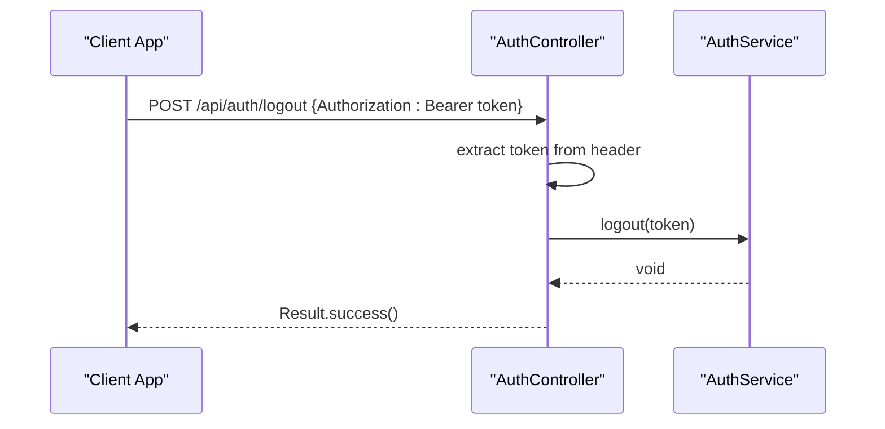
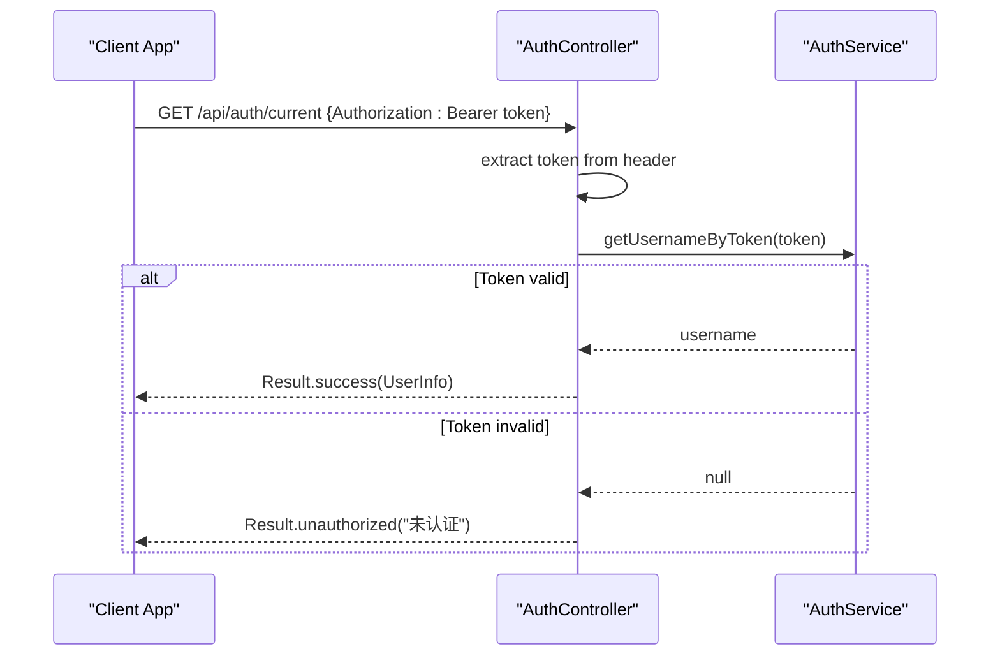
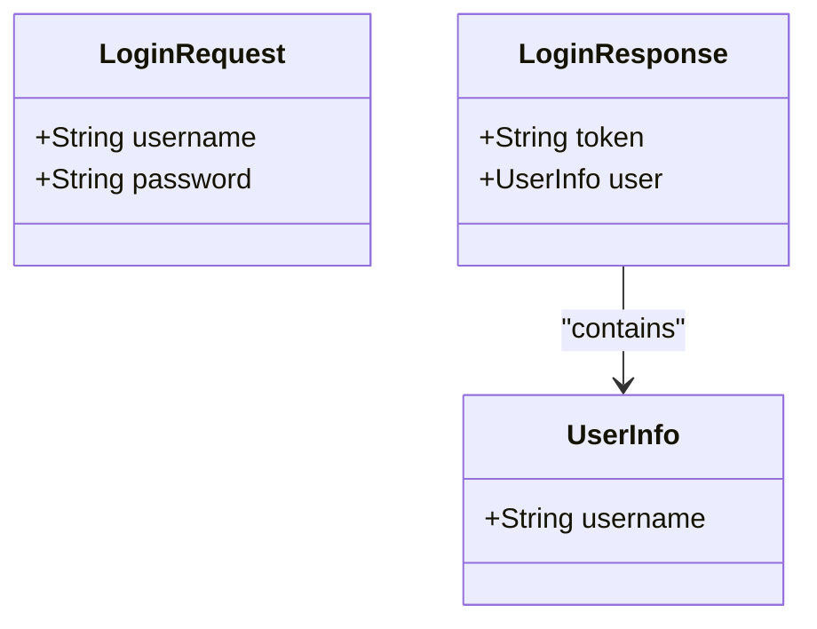
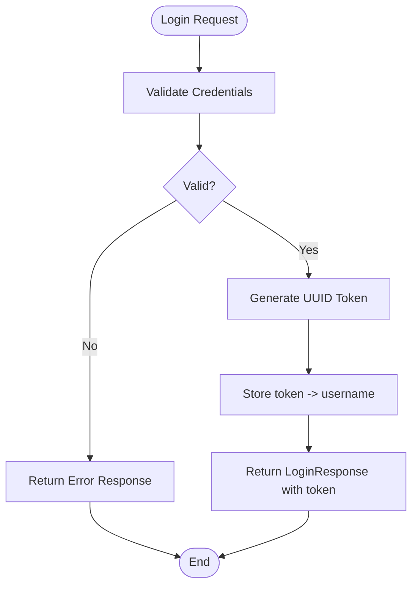
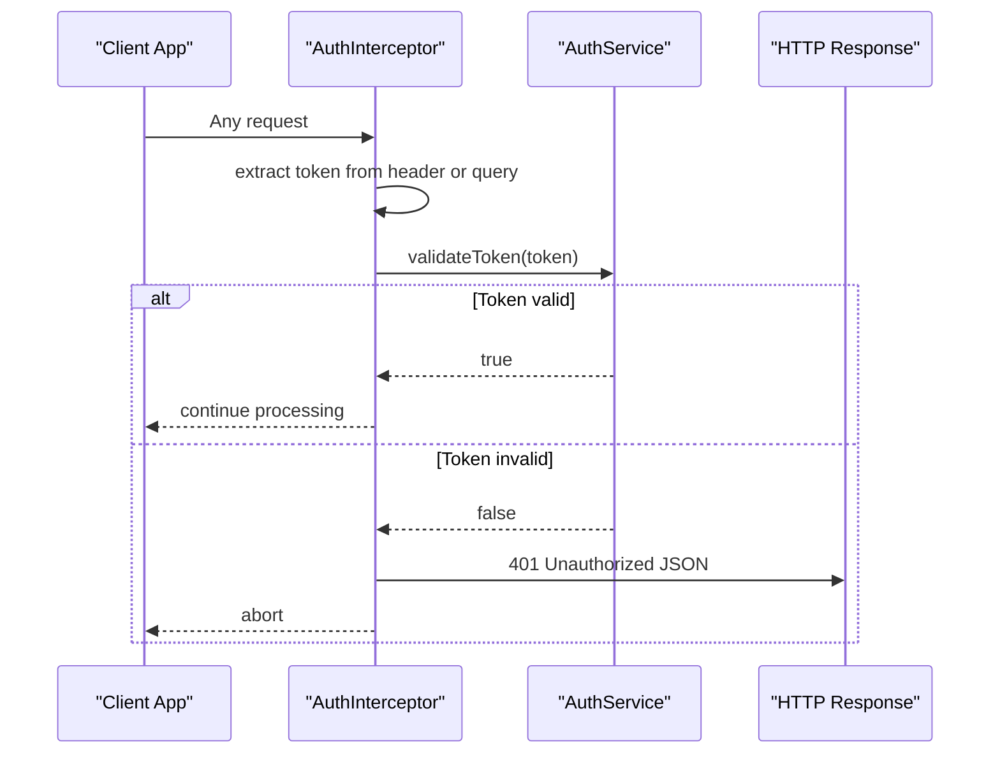
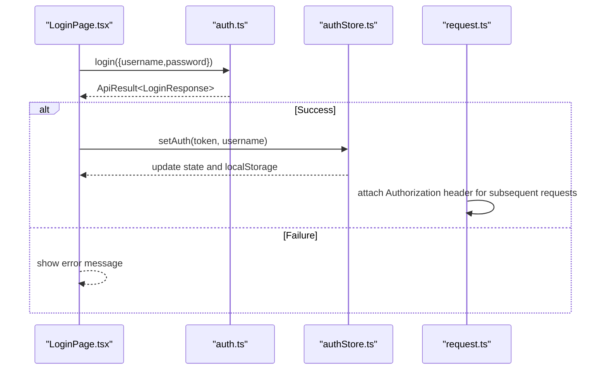
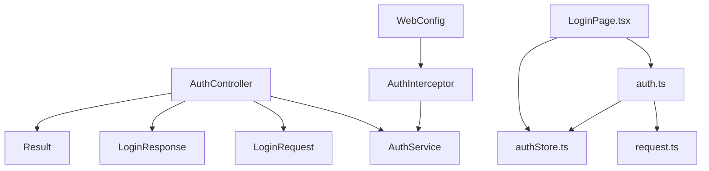

# Authentication APIs

<cite>
**Referenced Files in This Document**
- [AuthController.java](file://backend/src/main/java/com/paiagent/controller/AuthController.java)
- [AuthService.java](file://backend/src/main/java/com/paiagent/service/AuthService.java)
- [AuthInterceptor.java](file://backend/src/main/java/com/paiagent/interceptor/AuthInterceptor.java)
- [WebConfig.java](file://backend/src/main/java/com/paiagent/config/WebConfig.java)
- [LoginRequest.java](file://backend/src/main/java/com/paiagent/dto/LoginRequest.java)
- [LoginResponse.java](file://backend/src/main/java/com/paiagent/dto/LoginResponse.java)
- [Result.java](file://backend/src/main/java/com/paiagent/common/Result.java)
- [auth.ts](file://frontend/src/api/auth.ts)
- [authStore.ts](file://frontend/src/store/authStore.ts)
- [request.ts](file://frontend/src/utils/request.ts)
- [LoginPage.tsx](file://frontend/src/pages/LoginPage.tsx)
- [application.yml](file://backend/src/main/resources/application.yml)
</cite>

## Table of Contents
1. [Introduction](#introduction)
2. [Project Structure](#project-structure)
3. [Core Components](#core-components)
4. [Architecture Overview](#architecture-overview)
5. [Detailed Component Analysis](#detailed-component-analysis)
6. [Dependency Analysis](#dependency-analysis)
7. [Performance Considerations](#performance-considerations)
8. [Troubleshooting Guide](#troubleshooting-guide)
9. [Conclusion](#conclusion)

## Introduction
This document provides comprehensive API documentation for the Authentication endpoints in the PaiAgent system. It focuses on the user login endpoint POST /api/auth/login, covering the LoginRequest and LoginResponse DTO structures, authentication flow, token generation, session management, and security considerations. It also documents logout functionality and token usage patterns, along with best practices for CSRF protection and authentication middleware integration.

## Project Structure
The authentication system spans both backend and frontend layers:
- Backend: Spring Boot REST controllers, services, interceptors, DTOs, and configuration
- Frontend: API client, authentication store, and request/response interceptors

**Diagram sources**
- [AuthController.java:17-61](file://backend/src/main/java/com/paiagent/controller/AuthController.java#L17-L61)
- [AuthService.java:12-62](file://backend/src/main/java/com/paiagent/service/AuthService.java#L12-L62)
- [AuthInterceptor.java:13-45](file://backend/src/main/java/com/paiagent/interceptor/AuthInterceptor.java#L13-L45)
- [WebConfig.java:13-34](file://backend/src/main/java/com/paiagent/config/WebConfig.java#L13-L34)
- [LoginRequest.java:9-17](file://backend/src/main/java/com/paiagent/dto/LoginRequest.java#L9-L17)
- [LoginResponse.java:9-28](file://backend/src/main/java/com/paiagent/dto/LoginResponse.java#L9-L28)
- [Result.java:8-78](file://backend/src/main/java/com/paiagent/common/Result.java#L8-L78)
- [auth.ts:1-41](file://frontend/src/api/auth.ts#L1-L41)
- [authStore.ts:1-31](file://frontend/src/store/authStore.ts#L1-L31)
- [request.ts:1-49](file://frontend/src/utils/request.ts#L1-L49)
- [LoginPage.tsx:1-89](file://frontend/src/pages/LoginPage.tsx#L1-L89)

**Section sources**
- [AuthController.java:17-61](file://backend/src/main/java/com/paiagent/controller/AuthController.java#L17-L61)
- [WebConfig.java:13-34](file://backend/src/main/java/com/paiagent/config/WebConfig.java#L13-L34)
- [auth.ts:1-41](file://frontend/src/api/auth.ts#L1-L41)
- [authStore.ts:1-31](file://frontend/src/store/authStore.ts#L1-L31)
- [request.ts:1-49](file://frontend/src/utils/request.ts#L1-L49)
- [LoginPage.tsx:1-89](file://frontend/src/pages/LoginPage.tsx#L1-L89)

## Core Components
This section documents the key authentication components and their roles in the system.

- AuthController: Exposes REST endpoints for login, logout, and retrieving current user information. It validates requests using DTOs and returns unified responses via the Result wrapper.
- AuthService: Implements authentication logic, including token generation, validation, and logout. Uses an in-memory ConcurrentHashMap for token storage.
- AuthInterceptor: Enforces authentication by checking Authorization headers and query parameters, validating tokens against the service, and setting request attributes.
- WebConfig: Registers CORS and the authentication interceptor, configuring path patterns and exclusions.
- DTOs: LoginRequest and LoginResponse define the payload structures for authentication operations.
- Result: Provides a standardized response envelope with success, error, and unauthorized variants.
- Frontend API: auth.ts defines typed interfaces and HTTP calls for authentication operations.
- Frontend Store: authStore.ts manages authentication state persisted in localStorage.
- Frontend Request: request.ts attaches Authorization headers automatically and handles 401 responses.

**Section sources**
- [AuthController.java:25-60](file://backend/src/main/java/com/paiagent/controller/AuthController.java#L25-L60)
- [AuthService.java:33-61](file://backend/src/main/java/com/paiagent/service/AuthService.java#L33-L61)
- [AuthInterceptor.java:19-45](file://backend/src/main/java/com/paiagent/interceptor/AuthInterceptor.java#L19-L45)
- [WebConfig.java:29-34](file://backend/src/main/java/com/paiagent/config/WebConfig.java#L29-L34)
- [LoginRequest.java:9-17](file://backend/src/main/java/com/paiagent/dto/LoginRequest.java#L9-L17)
- [LoginResponse.java:9-28](file://backend/src/main/java/com/paiagent/dto/LoginResponse.java#L9-L28)
- [Result.java:44-77](file://backend/src/main/java/com/paiagent/common/Result.java#L44-L77)
- [auth.ts:3-40](file://frontend/src/api/auth.ts#L3-L40)
- [authStore.ts:14-30](file://frontend/src/store/authStore.ts#L14-L30)
- [request.ts:17-46](file://frontend/src/utils/request.ts#L17-L46)

## Architecture Overview
The authentication architecture integrates REST endpoints, service logic, and middleware to enforce secure access to protected resources.

**Diagram sources**
- [AuthController.java:25-35](file://backend/src/main/java/com/paiagent/controller/AuthController.java#L25-L35)
- [AuthService.java:33-47](file://backend/src/main/java/com/paiagent/service/AuthService.java#L33-L47)
- [AuthInterceptor.java:19-45](file://backend/src/main/java/com/paiagent/interceptor/AuthInterceptor.java#L19-L45)
- [WebConfig.java:29-34](file://backend/src/main/java/com/paiagent/config/WebConfig.java#L29-L34)

## Detailed Component Analysis

### Login Endpoint: POST /api/auth/login
The login endpoint authenticates users and returns an authentication token.

- Endpoint: POST /api/auth/login
- Request Body: LoginRequest (username, password)
- Response: Result<LoginResponse> with token and user info
- Validation: @NotBlank constraints on username and password
- Success Path: On valid credentials, generates a UUID-based token and stores it in memory
- Failure Path: Returns error result for invalid credentials

**Diagram sources**
- [AuthController.java:25-35](file://backend/src/main/java/com/paiagent/controller/AuthController.java#L25-L35)
- [AuthService.java:33-40](file://backend/src/main/java/com/paiagent/service/AuthService.java#L33-L40)
- [LoginRequest.java:12-16](file://backend/src/main/java/com/paiagent/dto/LoginRequest.java#L12-L16)
- [LoginResponse.java:13-21](file://backend/src/main/java/com/paiagent/dto/LoginResponse.java#L13-L21)

**Section sources**
- [AuthController.java:25-35](file://backend/src/main/java/com/paiagent/controller/AuthController.java#L25-L35)
- [LoginRequest.java:12-16](file://backend/src/main/java/com/paiagent/dto/LoginRequest.java#L12-L16)
- [LoginResponse.java:13-21](file://backend/src/main/java/com/paiagent/dto/LoginResponse.java#L13-L21)
- [Result.java:44-77](file://backend/src/main/java/com/paiagent/common/Result.java#L44-L77)

### Logout Endpoint: POST /api/auth/logout
The logout endpoint invalidates the current token by removing it from the in-memory store.

- Endpoint: POST /api/auth/logout
- Header: Authorization Bearer token
- Behavior: Extracts token from Authorization header, removes it from store, returns success

**Diagram sources**
- [AuthController.java:37-46](file://backend/src/main/java/com/paiagent/controller/AuthController.java#L37-L46)
- [AuthService.java:45-47](file://backend/src/main/java/com/paiagent/service/AuthService.java#L45-L47)

**Section sources**
- [AuthController.java:37-46](file://backend/src/main/java/com/paiagent/controller/AuthController.java#L37-L46)
- [AuthService.java:45-47](file://backend/src/main/java/com/paiagent/service/AuthService.java#L45-L47)

### Current User Endpoint: GET /api/auth/current
Retrieves the currently authenticated user based on the provided token.

- Endpoint: GET /api/auth/current
- Header: Authorization Bearer token
- Behavior: Validates token, extracts username, returns user info or 401 unauthorized

**Diagram sources**
- [AuthController.java:48-60](file://backend/src/main/java/com/paiagent/controller/AuthController.java#L48-L60)
- [AuthService.java:59-61](file://backend/src/main/java/com/paiagent/service/AuthService.java#L59-L61)

**Section sources**
- [AuthController.java:48-60](file://backend/src/main/java/com/paiagent/controller/AuthController.java#L48-L60)
- [AuthService.java:59-61](file://backend/src/main/java/com/paiagent/service/AuthService.java#L59-L61)

### DTO Structures and Validation
- LoginRequest
  - Fields: username (not blank), password (not blank)
  - Validation: @NotBlank ensures non-empty values
- LoginResponse
  - Fields: token (string), user (UserInfo)
  - UserInfo: username (string)

**Diagram sources**
- [LoginRequest.java:9-17](file://backend/src/main/java/com/paiagent/dto/LoginRequest.java#L9-L17)
- [LoginResponse.java:9-28](file://backend/src/main/java/com/paiagent/dto/LoginResponse.java#L9-L28)

**Section sources**
- [LoginRequest.java:9-17](file://backend/src/main/java/com/paiagent/dto/LoginRequest.java#L9-L17)
- [LoginResponse.java:9-28](file://backend/src/main/java/com/paiagent/dto/LoginResponse.java#L9-L28)

### Token Generation and Session Management
- Token Generation: UUID-based random token generated upon successful authentication
- Storage: In-memory ConcurrentHashMap keyed by token to username
- Validation: Checks presence of token in store
- Logout: Removes token from store
- Session Scope: No server-side session; token-based stateless authentication

**Diagram sources**
- [AuthService.java:33-47](file://backend/src/main/java/com/paiagent/service/AuthService.java#L33-L47)

**Section sources**
- [AuthService.java:33-47](file://backend/src/main/java/com/paiagent/service/AuthService.java#L33-L47)

### Authentication Middleware Integration
- Interceptor: AuthInterceptor checks Authorization header or query parameter "token"
- Validation: Calls AuthService.validateToken(token)
- Unauthorized Response: Returns 401 with JSON body
- Request Attribute: Sets username attribute for downstream handlers
- Registration: WebConfig registers interceptor for /api/** excluding specific paths

**Diagram sources**
- [AuthInterceptor.java:19-45](file://backend/src/main/java/com/paiagent/interceptor/AuthInterceptor.java#L19-L45)
- [AuthService.java:52-54](file://backend/src/main/java/com/paiagent/service/AuthService.java#L52-L54)
- [WebConfig.java:29-34](file://backend/src/main/java/com/paiagent/config/WebConfig.java#L29-L34)

**Section sources**
- [AuthInterceptor.java:19-45](file://backend/src/main/java/com/paiagent/interceptor/AuthInterceptor.java#L19-L45)
- [WebConfig.java:29-34](file://backend/src/main/java/com/paiagent/config/WebConfig.java#L29-L34)

### Frontend Authentication Integration
- API Client: auth.ts defines login, logout, and getCurrentUser functions
- Store: authStore.ts persists token and username in localStorage and exposes state
- Request Interceptor: request.ts automatically attaches Authorization header and handles 401
- Login Page: LoginPage.tsx submits LoginRequest and updates auth state on success

**Diagram sources**
- [auth.ts:24-40](file://frontend/src/api/auth.ts#L24-L40)
- [authStore.ts:19-29](file://frontend/src/store/authStore.ts#L19-L29)
- [request.ts:17-29](file://frontend/src/utils/request.ts#L17-L29)
- [LoginPage.tsx:16-32](file://frontend/src/pages/LoginPage.tsx#L16-L32)

**Section sources**
- [auth.ts:24-40](file://frontend/src/api/auth.ts#L24-L40)
- [authStore.ts:19-29](file://frontend/src/store/authStore.ts#L19-L29)
- [request.ts:17-29](file://frontend/src/utils/request.ts#L17-L29)
- [LoginPage.tsx:16-32](file://frontend/src/pages/LoginPage.tsx#L16-L32)

## Dependency Analysis
The authentication system exhibits clear separation of concerns with minimal coupling between layers.

**Diagram sources**
- [AuthController.java:22-35](file://backend/src/main/java/com/paiagent/controller/AuthController.java#L22-L35)
- [AuthService.java:12-47](file://backend/src/main/java/com/paiagent/service/AuthService.java#L12-L47)
- [AuthInterceptor.java:14-45](file://backend/src/main/java/com/paiagent/interceptor/AuthInterceptor.java#L14-L45)
- [WebConfig.java:14-34](file://backend/src/main/java/com/paiagent/config/WebConfig.java#L14-L34)
- [auth.ts:1-41](file://frontend/src/api/auth.ts#L1-L41)
- [authStore.ts:1-31](file://frontend/src/store/authStore.ts#L1-L31)
- [request.ts:1-49](file://frontend/src/utils/request.ts#L1-L49)
- [LoginPage.tsx:1-89](file://frontend/src/pages/LoginPage.tsx#L1-L89)

**Section sources**
- [AuthController.java:22-35](file://backend/src/main/java/com/paiagent/controller/AuthController.java#L22-L35)
- [AuthService.java:12-47](file://backend/src/main/java/com/paiagent/service/AuthService.java#L12-L47)
- [AuthInterceptor.java:14-45](file://backend/src/main/java/com/paiagent/interceptor/AuthInterceptor.java#L14-L45)
- [WebConfig.java:14-34](file://backend/src/main/java/com/paiagent/config/WebConfig.java#L14-L34)
- [auth.ts:1-41](file://frontend/src/api/auth.ts#L1-L41)
- [authStore.ts:1-31](file://frontend/src/store/authStore.ts#L1-L31)
- [request.ts:1-49](file://frontend/src/utils/request.ts#L1-L49)
- [LoginPage.tsx:1-89](file://frontend/src/pages/LoginPage.tsx#L1-L89)

## Performance Considerations
- Token Storage: ConcurrentHashMap offers O(1) average-time operations for token validation and removal, suitable for moderate loads
- Stateless Design: No server-side session overhead; token validation is CPU-bound but lightweight
- CORS Configuration: Broad CORS settings enable development flexibility; restrict origins in production environments
- Frontend Caching: localStorage avoids repeated network calls for authentication state; ensure consistent state updates

[No sources needed since this section provides general guidance]

## Troubleshooting Guide
Common issues and resolutions:

- Invalid Credentials
  - Symptom: Login returns error result with message indicating invalid username or password
  - Resolution: Verify default credentials (admin/123) and ensure request body contains non-blank username and password
  - Reference: [AuthController.java](file://backend/src/main/java/com/paiagent/controller/AuthController.java#L34), [LoginRequest.java:12-16](file://backend/src/main/java/com/paiagent/dto/LoginRequest.java#L12-L16)

- Unauthorized Access
  - Symptom: 401 Unauthorized responses for protected endpoints
  - Causes:
    - Missing or malformed Authorization header (Bearer token)
    - Expired or invalid token
    - Token not present in in-memory store
  - Resolution: Ensure Authorization header is included; re-authenticate if necessary; verify interceptor configuration
  - References: [AuthInterceptor.java:30-39](file://backend/src/main/java/com/paiagent/interceptor/AuthInterceptor.java#L30-L39), [WebConfig.java:30-34](file://backend/src/main/java/com/paiagent/config/WebConfig.java#L30-L34)

- Frontend Token Handling
  - Symptom: 401 errors despite successful login
  - Causes:
    - Missing Authorization header in requests
    - Token cleared or expired
  - Resolution: Confirm request.ts attaches Authorization header; verify authStore state and localStorage persistence
  - References: [request.ts:17-29](file://frontend/src/utils/request.ts#L17-L29), [authStore.ts:14-30](file://frontend/src/store/authStore.ts#L14-L30)

- Logout Not Effective
  - Symptom: Requests still succeed after logout
  - Cause: Token removed from store but client retains Authorization header
  - Resolution: Clear token from localStorage and redirect to login page
  - References: [AuthController.java:39-46](file://backend/src/main/java/com/paiagent/controller/AuthController.java#L39-L46), [authStore.ts:25-29](file://frontend/src/store/authStore.ts#L25-L29)

**Section sources**
- [AuthController.java:34-46](file://backend/src/main/java/com/paiagent/controller/AuthController.java#L34-L46)
- [LoginRequest.java:12-16](file://backend/src/main/java/com/paiagent/dto/LoginRequest.java#L12-L16)
- [AuthInterceptor.java:30-39](file://backend/src/main/java/com/paiagent/interceptor/AuthInterceptor.java#L30-L39)
- [WebConfig.java:30-34](file://backend/src/main/java/com/paiagent/config/WebConfig.java#L30-L34)
- [request.ts:17-29](file://frontend/src/utils/request.ts#L17-L29)
- [authStore.ts:25-29](file://frontend/src/store/authStore.ts#L25-L29)

## Conclusion
The authentication system provides a straightforward, stateless token-based mechanism for securing API endpoints. It leverages Spring Boot’s validation and interceptor infrastructure alongside a simple in-memory token store. The frontend integrates seamlessly with the backend through typed API clients, centralized state management, and automatic request/response handling. While the current implementation uses default credentials and broad CORS settings suitable for development, production deployments should enforce stricter security measures, including HTTPS, restricted CORS policies, and robust credential management.