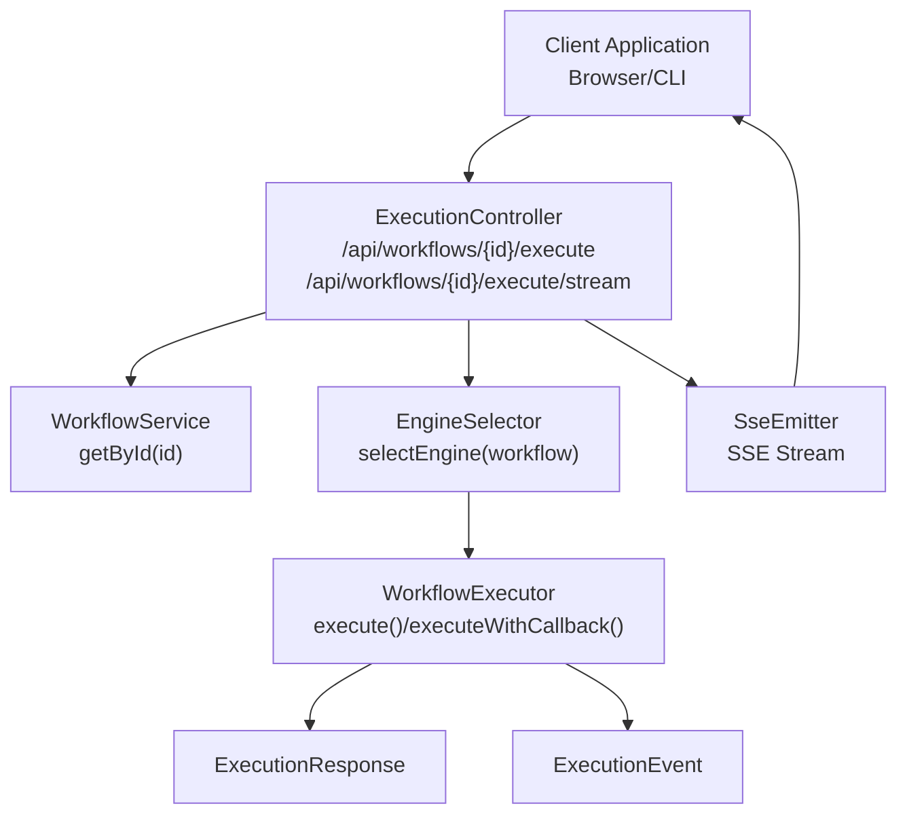
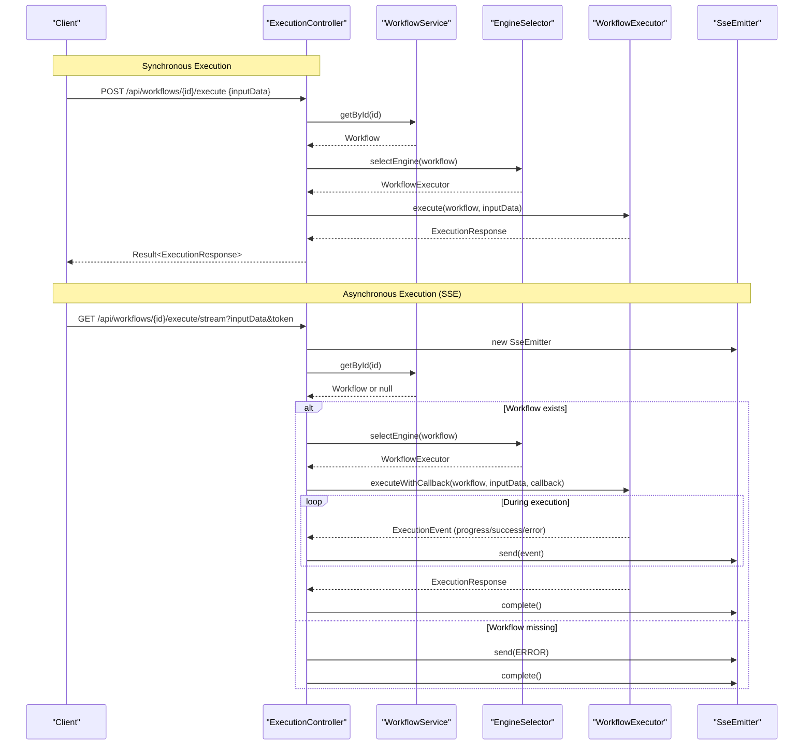
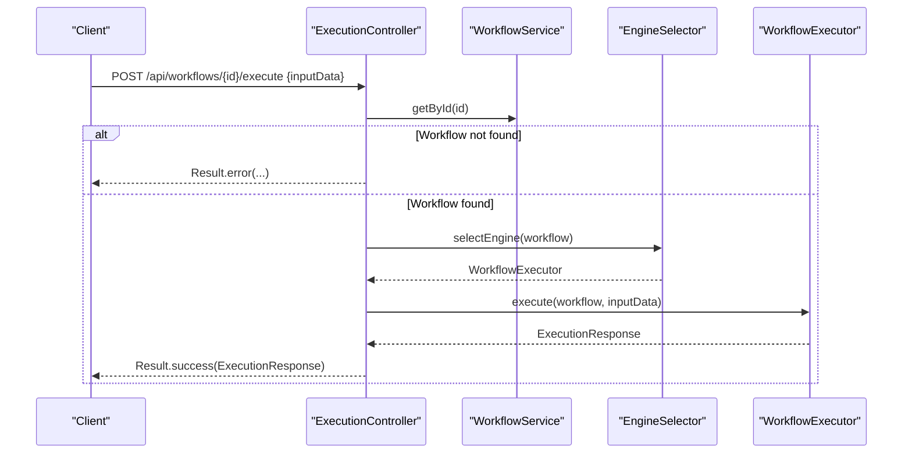
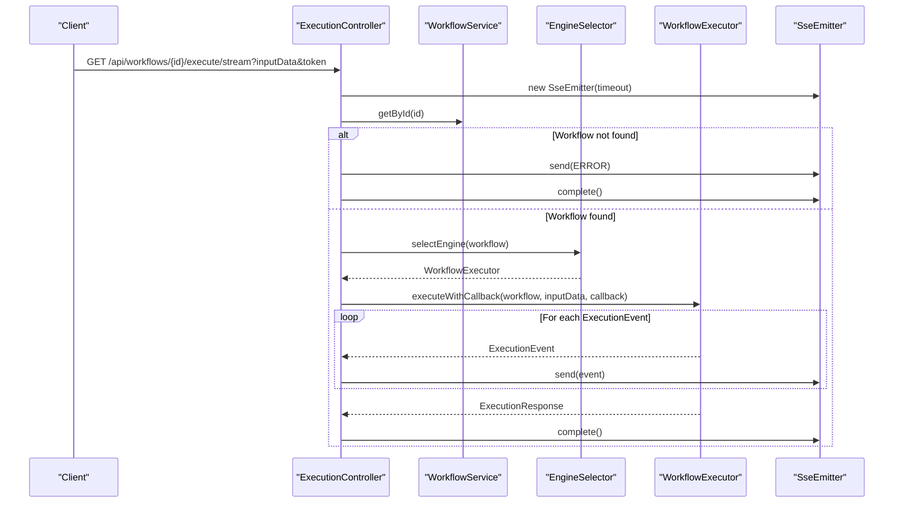
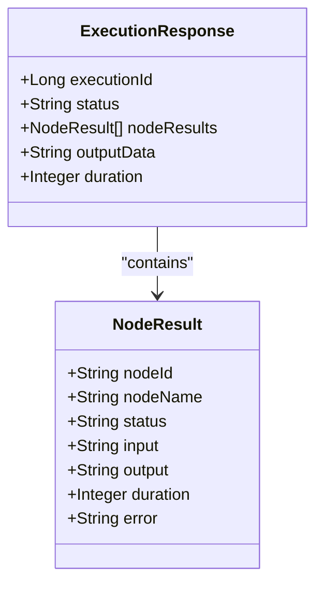
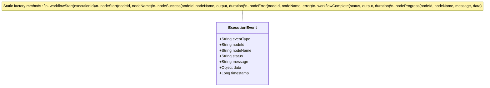
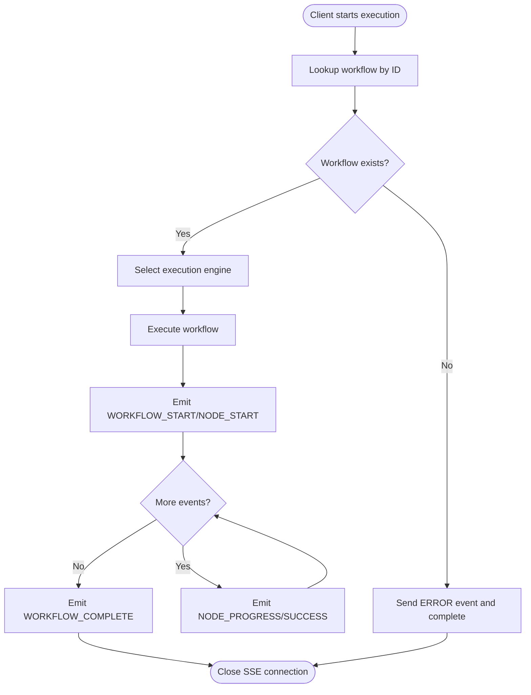
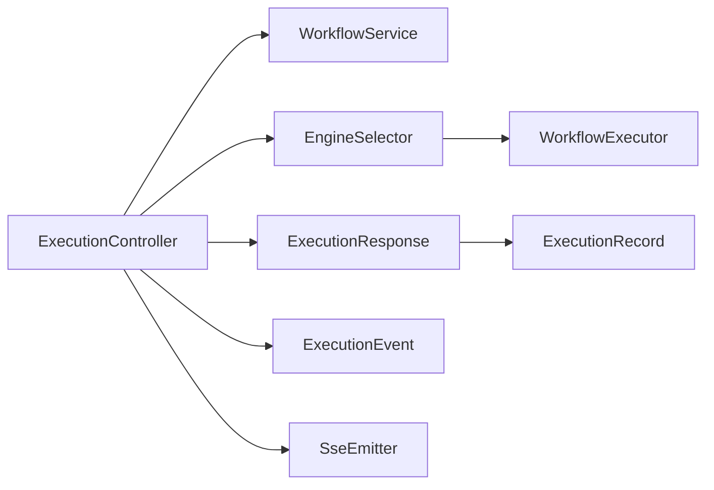

# Execution APIs

<cite>
**Referenced Files in This Document**
- [ExecutionController.java](file://backend/src/main/java/com/paiagent/controller/ExecutionController.java)
- [ExecutionRequest.java](file://backend/src/main/java/com/paiagent/dto/ExecutionRequest.java)
- [ExecutionResponse.java](file://backend/src/main/java/com/paiagent/dto/ExecutionResponse.java)
- [ExecutionEvent.java](file://backend/src/main/java/com/paiagent/dto/ExecutionEvent.java)
- [WorkflowExecutor.java](file://backend/src/main/java/com/paiagent/engine/WorkflowExecutor.java)
- [EngineSelector.java](file://backend/src/main/java/com/paiagent/engine/EngineSelector.java)
- [WorkflowService.java](file://backend/src/main/java/com/paiagent/service/WorkflowService.java)
- [ExecutionRecord.java](file://backend/src/main/java/com/paiagent/entity/ExecutionRecord.java)
- [ExecutionRecordMapper.java](file://backend/src/main/java/com/paiagent/mapper/ExecutionRecordMapper.java)
- [AuthInterceptor.java](file://backend/src/main/java/com/paiagent/interceptor/AuthInterceptor.java)
- [AuthController.java](file://backend/src/main/java/com/paiagent/controller/AuthController.java)
- [Result.java](file://backend/src/main/java/com/paiagent/common/Result.java)
- [workflow.ts](file://frontend/src/api/workflow.ts)
- [application.yml](file://backend/src/main/resources/application.yml)
</cite>

## Table of Contents
1. [Introduction](#introduction)
2. [Project Structure](#project-structure)
3. [Core Components](#core-components)
4. [Architecture Overview](#architecture-overview)
5. [Detailed Component Analysis](#detailed-component-analysis)
6. [Dependency Analysis](#dependency-analysis)
7. [Performance Considerations](#performance-considerations)
8. [Troubleshooting Guide](#troubleshooting-guide)
9. [Conclusion](#conclusion)
10. [Appendices](#appendices)

## Introduction
This document provides detailed API documentation for Execution Management endpoints. It covers:
- Execution initiation via POST /api/workflows/{id}/execute returning ExecutionResponse
- Real-time execution monitoring via GET /api/workflows/{id}/execute/stream using Server-Sent Events (SSE)
- ExecutionResponse structure including executionId, status, nodeResults, outputData, and duration
- ExecutionEvent system for streaming progress and debug information
- Examples of execution lifecycle, error handling, and best practices for long-running executions
- Authentication requirements and considerations for rate limiting

## Project Structure
Execution APIs are implemented in the backend Java module under the controller package. The execution flow integrates with:
- ExecutionController for HTTP endpoints
- WorkflowExecutor interface and EngineSelector for dispatching to appropriate execution engines
- ExecutionEvent and ExecutionResponse DTOs for event and response modeling
- WorkflowService for retrieving workflow metadata
- AuthInterceptor for enforcing authentication

**Diagram sources**
- [ExecutionController.java:28-108](file://backend/src/main/java/com/paiagent/controller/ExecutionController.java#L28-L108)
- [EngineSelector.java:29-49](file://backend/src/main/java/com/paiagent/engine/EngineSelector.java#L29-L49)
- [WorkflowExecutor.java:15-38](file://backend/src/main/java/com/paiagent/engine/WorkflowExecutor.java#L15-L38)
- [ExecutionResponse.java:10-28](file://backend/src/main/java/com/paiagent/dto/ExecutionResponse.java#L10-L28)
- [ExecutionEvent.java:6-79](file://backend/src/main/java/com/paiagent/dto/ExecutionEvent.java#L6-L79)
- [WorkflowService.java:65-71](file://backend/src/main/java/com/paiagent/service/WorkflowService.java#L65-L71)

**Section sources**
- [ExecutionController.java:28-108](file://backend/src/main/java/com/paiagent/controller/ExecutionController.java#L28-L108)
- [EngineSelector.java:29-49](file://backend/src/main/java/com/paiagent/engine/EngineSelector.java#L29-L49)
- [WorkflowExecutor.java:15-38](file://backend/src/main/java/com/paiagent/engine/WorkflowExecutor.java#L15-L38)
- [ExecutionResponse.java:10-28](file://backend/src/main/java/com/paiagent/dto/ExecutionResponse.java#L10-L28)
- [ExecutionEvent.java:6-79](file://backend/src/main/java/com/paiagent/dto/ExecutionEvent.java#L6-L79)
- [WorkflowService.java:65-71](file://backend/src/main/java/com/paiagent/service/WorkflowService.java#L65-L71)

## Core Components
- ExecutionController: Exposes two endpoints:
  - POST /api/workflows/{id}/execute: Initiates synchronous execution and returns ExecutionResponse
  - GET /api/workflows/{id}/execute/stream: Starts asynchronous execution and streams ExecutionEvent events via SSE
- ExecutionRequest: Payload for execution requests with required field inputData
- ExecutionResponse: Response structure for execution results
- ExecutionEvent: Event model for streaming progress and completion
- WorkflowExecutor: Interface defining execute and executeWithCallback methods
- EngineSelector: Selects the appropriate WorkflowExecutor based on workflow engineType
- WorkflowService: Retrieves workflow metadata by ID
- ExecutionRecord and ExecutionRecordMapper: Persistence model and mapper for execution records

**Section sources**
- [ExecutionController.java:39-108](file://backend/src/main/java/com/paiagent/controller/ExecutionController.java#L39-L108)
- [ExecutionRequest.java:10-14](file://backend/src/main/java/com/paiagent/dto/ExecutionRequest.java#L10-L14)
- [ExecutionResponse.java:10-28](file://backend/src/main/java/com/paiagent/dto/ExecutionResponse.java#L10-L28)
- [ExecutionEvent.java:6-79](file://backend/src/main/java/com/paiagent/dto/ExecutionEvent.java#L6-L79)
- [WorkflowExecutor.java:15-38](file://backend/src/main/java/com/paiagent/engine/WorkflowExecutor.java#L15-L38)
- [EngineSelector.java:29-49](file://backend/src/main/java/com/paiagent/engine/EngineSelector.java#L29-L49)
- [WorkflowService.java:65-71](file://backend/src/main/java/com/paiagent/service/WorkflowService.java#L65-L71)
- [ExecutionRecord.java:12-66](file://backend/src/main/java/com/paiagent/entity/ExecutionRecord.java#L12-L66)
- [ExecutionRecordMapper.java:11-12](file://backend/src/main/java/com/paiagent/mapper/ExecutionRecordMapper.java#L11-L12)

## Architecture Overview
The execution pipeline consists of:
- Request validation and workflow lookup
- Engine selection based on workflow engineType
- Execution with optional callback for SSE streaming
- Event emission and response construction

**Diagram sources**
- [ExecutionController.java:41-108](file://backend/src/main/java/com/paiagent/controller/ExecutionController.java#L41-L108)
- [WorkflowService.java:65-71](file://backend/src/main/java/com/paiagent/service/WorkflowService.java#L65-L71)
- [EngineSelector.java:29-49](file://backend/src/main/java/com/paiagent/engine/EngineSelector.java#L29-L49)
- [WorkflowExecutor.java:34-38](file://backend/src/main/java/com/paiagent/engine/WorkflowExecutor.java#L34-L38)
- [ExecutionEvent.java:15-78](file://backend/src/main/java/com/paiagent/dto/ExecutionEvent.java#L15-L78)

## Detailed Component Analysis

### Endpoint: POST /api/workflows/{id}/execute
- Purpose: Initiate synchronous execution of a workflow by ID with input parameters
- Path: /api/workflows/{id}/execute
- Method: POST
- Authentication: Required via Authorization header (Bearer token)
- Request Body: ExecutionRequest
  - inputData: string (required)
- Response: Result<ExecutionResponse>
  - executionId: number
  - status: string
  - nodeResults: array of node-level results
  - outputData: string
  - duration: number (milliseconds)
- Error Handling:
  - Returns error Result when workflow not found or execution fails

**Diagram sources**
- [ExecutionController.java:41-55](file://backend/src/main/java/com/paiagent/controller/ExecutionController.java#L41-L55)
- [WorkflowService.java:65-71](file://backend/src/main/java/com/paiagent/service/WorkflowService.java#L65-L71)
- [EngineSelector.java:29-49](file://backend/src/main/java/com/paiagent/engine/EngineSelector.java#L29-L49)
- [WorkflowExecutor.java:24-24](file://backend/src/main/java/com/paiagent/engine/WorkflowExecutor.java#L24-L24)

**Section sources**
- [ExecutionController.java:39-55](file://backend/src/main/java/com/paiagent/controller/ExecutionController.java#L39-L55)
- [ExecutionRequest.java:10-14](file://backend/src/main/java/com/paiagent/dto/ExecutionRequest.java#L10-L14)
- [ExecutionResponse.java:10-28](file://backend/src/main/java/com/paiagent/dto/ExecutionResponse.java#L10-L28)
- [Result.java:44-77](file://backend/src/main/java/com/paiagent/common/Result.java#L44-L77)

### Endpoint: GET /api/workflows/{id}/execute/stream
- Purpose: Start asynchronous execution and stream ExecutionEvent events via SSE
- Path: /api/workflows/{id}/execute/stream
- Method: GET
- Media Type: text/event-stream
- Query Parameters:
  - inputData: string (required)
  - token: string (optional, supported by client-side but not validated server-side)
- Authentication: Required via Authorization header (Bearer token)
- Streaming Events:
  - WORKFLOW_START: Indicates execution start
  - NODE_START: Node execution start
  - NODE_PROGRESS: Node progress updates
  - NODE_SUCCESS: Node success with output
  - NODE_ERROR: Node failure with error message
  - WORKFLOW_COMPLETE: Final completion with status and output
  - ERROR: Execution error during streaming

**Diagram sources**
- [ExecutionController.java:57-108](file://backend/src/main/java/com/paiagent/controller/ExecutionController.java#L57-L108)
- [WorkflowService.java:65-71](file://backend/src/main/java/com/paiagent/service/WorkflowService.java#L65-L71)
- [EngineSelector.java:29-49](file://backend/src/main/java/com/paiagent/engine/EngineSelector.java#L29-L49)
- [WorkflowExecutor.java:34-38](file://backend/src/main/java/com/paiagent/engine/WorkflowExecutor.java#L34-L38)
- [ExecutionEvent.java:15-78](file://backend/src/main/java/com/paiagent/dto/ExecutionEvent.java#L15-L78)

**Section sources**
- [ExecutionController.java:57-108](file://backend/src/main/java/com/paiagent/controller/ExecutionController.java#L57-L108)
- [ExecutionEvent.java:6-79](file://backend/src/main/java/com/paiagent/dto/ExecutionEvent.java#L6-L79)

### ExecutionResponse Structure
- executionId: Unique identifier for the execution run
- status: Overall execution status (e.g., SUCCESS, FAILED)
- nodeResults: Array of NodeResult entries
  - nodeId: Node identifier
  - nodeName: Node display name
  - status: Node execution status
  - input: Node input data
  - output: Node output data
  - duration: Node execution time (ms)
  - error: Error message if failed
- outputData: Aggregated output data after execution
- duration: Total execution time (ms)

**Diagram sources**
- [ExecutionResponse.java:10-28](file://backend/src/main/java/com/paiagent/dto/ExecutionResponse.java#L10-L28)

**Section sources**
- [ExecutionResponse.java:10-28](file://backend/src/main/java/com/paiagent/dto/ExecutionResponse.java#L10-L28)

### ExecutionEvent System
ExecutionEvent carries real-time progress and debug information:
- eventType: One of WORKFLOW_START, NODE_START, NODE_PROGRESS, NODE_SUCCESS, NODE_ERROR, WORKFLOW_COMPLETE, ERROR
- nodeId, nodeName: Identifies the node emitting the event
- status: RUNNING, SUCCESS, FAILED
- message: Human-readable message
- data: Event-specific data (e.g., node output, error message)
- timestamp: Milliseconds since epoch

**Diagram sources**
- [ExecutionEvent.java:6-79](file://backend/src/main/java/com/paiagent/dto/ExecutionEvent.java#L6-L79)

**Section sources**
- [ExecutionEvent.java:6-79](file://backend/src/main/java/com/paiagent/dto/ExecutionEvent.java#L6-L79)

### Execution Lifecycle Example
- Start: Client sends POST to initiate synchronous execution or GET to start streaming
- Progress: Server emits NODE_START, NODE_PROGRESS, NODE_SUCCESS events
- Completion: Server emits WORKFLOW_COMPLETE with final status and output
- Error: Server emits NODE_ERROR or ERROR events and closes the stream

**Diagram sources**
- [ExecutionController.java:79-105](file://backend/src/main/java/com/paiagent/controller/ExecutionController.java#L79-L105)
- [ExecutionEvent.java:15-78](file://backend/src/main/java/com/paiagent/dto/ExecutionEvent.java#L15-L78)

**Section sources**
- [ExecutionController.java:79-105](file://backend/src/main/java/com/paiagent/controller/ExecutionController.java#L79-L105)
- [ExecutionEvent.java:15-78](file://backend/src/main/java/com/paiagent/dto/ExecutionEvent.java#L15-L78)

### Error Handling Scenarios
- Workflow Not Found:
  - Synchronous: ExecutionController returns error Result
  - Streaming: Emits ERROR event and completes SSE
- Execution Failure:
  - Synchronous: ExecutionController wraps exception in error Result
  - Streaming: Emits ERROR event with failure message and completes SSE
- SSE Delivery Failure:
  - Controller logs error and removes emitter from registry

**Section sources**
- [ExecutionController.java:43-54](file://backend/src/main/java/com/paiagent/controller/ExecutionController.java#L43-L54)
- [ExecutionController.java:82-104](file://backend/src/main/java/com/paiagent/controller/ExecutionController.java#L82-L104)
- [ExecutionController.java:73-76](file://backend/src/main/java/com/paiagent/controller/ExecutionController.java#L73-L76)

### Best Practices for Monitoring Long-Running Executions
- Use streaming endpoint for real-time feedback and progress updates
- Implement robust client-side event handling for all event types
- Track executionId for correlation across events
- Respect SSE timeout and reconnect logic on network interruptions
- Log timestamps for performance analysis and debugging

**Section sources**
- [ExecutionController.java:57-108](file://backend/src/main/java/com/paiagent/controller/ExecutionController.java#L57-L108)
- [workflow.ts:96-177](file://frontend/src/api/workflow.ts#L96-L177)

### Authentication Requirements
- All execution endpoints require Authorization: Bearer <token>
- AuthInterceptor validates tokens and rejects unauthenticated requests
- Token can be passed via Authorization header or query parameter (client supports both)
- Logout clears session and invalidates token

**Section sources**
- [AuthInterceptor.java:19-45](file://backend/src/main/java/com/paiagent/interceptor/AuthInterceptor.java#L19-L45)
- [AuthController.java:26-60](file://backend/src/main/java/com/paiagent/controller/AuthController.java#L26-L60)
- [workflow.ts:103-112](file://frontend/src/api/workflow.ts#L103-L112)

### Rate Limiting Considerations
- No explicit rate limiting is implemented in the execution endpoints
- Consider implementing per-user or per-token limits at the gateway or controller level
- Monitor SSE connections and enforce connection caps to prevent resource exhaustion
- Apply circuit breakers for downstream LLM or external service calls

[No sources needed since this section provides general guidance]

## Dependency Analysis
ExecutionController depends on WorkflowService and EngineSelector. EngineSelector selects among multiple WorkflowExecutor implementations. ExecutionResponse and ExecutionEvent are DTOs consumed by clients. ExecutionRecord persists execution outcomes.

**Diagram sources**
- [ExecutionController.java:31-37](file://backend/src/main/java/com/paiagent/controller/ExecutionController.java#L31-L37)
- [WorkflowService.java:19-20](file://backend/src/main/java/com/paiagent/service/WorkflowService.java#L19-L20)
- [EngineSelector.java:21-21](file://backend/src/main/java/com/paiagent/engine/EngineSelector.java#L21-L21)
- [WorkflowExecutor.java:15-15](file://backend/src/main/java/com/paiagent/engine/WorkflowExecutor.java#L15-L15)
- [ExecutionResponse.java:10-10](file://backend/src/main/java/com/paiagent/dto/ExecutionResponse.java#L10-L10)
- [ExecutionEvent.java:6-6](file://backend/src/main/java/com/paiagent/dto/ExecutionEvent.java#L6-L6)
- [ExecutionRecord.java:12-12](file://backend/src/main/java/com/paiagent/entity/ExecutionRecord.java#L12-L12)

**Section sources**
- [ExecutionController.java:31-37](file://backend/src/main/java/com/paiagent/controller/ExecutionController.java#L31-L37)
- [EngineSelector.java:21-21](file://backend/src/main/java/com/paiagent/engine/EngineSelector.java#L21-L21)
- [WorkflowExecutor.java:15-15](file://backend/src/main/java/com/paiagent/engine/WorkflowExecutor.java#L15-L15)
- [ExecutionResponse.java:10-10](file://backend/src/main/java/com/paiagent/dto/ExecutionResponse.java#L10-L10)
- [ExecutionEvent.java:6-6](file://backend/src/main/java/com/paiagent/dto/ExecutionEvent.java#L6-L6)
- [ExecutionRecord.java:12-12](file://backend/src/main/java/com/paiagent/entity/ExecutionRecord.java#L12-L12)

## Performance Considerations
- SSE connections persist; monitor memory usage and close idle connections
- Prefer streaming for long-running executions to avoid timeouts
- Batch node-level events to reduce overhead
- Cache workflow metadata where appropriate to minimize database lookups

[No sources needed since this section provides general guidance]

## Troubleshooting Guide
- 401 Unauthorized:
  - Verify Authorization header with valid Bearer token
  - Ensure token is not expired and matches server configuration
- Workflow Not Found:
  - Confirm workflow ID exists and is accessible
- Execution Failures:
  - Inspect ERROR events emitted during streaming
  - Review nodeResults for specific node errors
- SSE Issues:
  - Check network connectivity and CORS configuration
  - Reconnect on timeout or error and resume from last known state

**Section sources**
- [AuthInterceptor.java:34-39](file://backend/src/main/java/com/paiagent/interceptor/AuthInterceptor.java#L34-L39)
- [ExecutionController.java:82-104](file://backend/src/main/java/com/paiagent/controller/ExecutionController.java#L82-L104)
- [workflow.ts:164-174](file://frontend/src/api/workflow.ts#L164-L174)

## Conclusion
The Execution Management API provides both synchronous and asynchronous execution modes. The synchronous endpoint returns a comprehensive ExecutionResponse, while the streaming endpoint delivers granular ExecutionEvent updates for real-time monitoring. Robust authentication and error handling ensure secure and reliable operation. Adopt the best practices outlined to manage long-running executions effectively.

## Appendices

### API Definitions

- POST /api/workflows/{id}/execute
  - Description: Initiate synchronous workflow execution
  - Request: ExecutionRequest.inputData
  - Response: Result<ExecutionResponse>

- GET /api/workflows/{id}/execute/stream
  - Description: Start streaming execution events
  - Query: inputData, token
  - Response: text/event-stream with ExecutionEvent messages

**Section sources**
- [ExecutionController.java:39-108](file://backend/src/main/java/com/paiagent/controller/ExecutionController.java#L39-L108)
- [ExecutionRequest.java:10-14](file://backend/src/main/java/com/paiagent/dto/ExecutionRequest.java#L10-L14)
- [Result.java:44-77](file://backend/src/main/java/com/paiagent/common/Result.java#L44-L77)

### Client-Side Usage Notes
- Frontend workflow.ts demonstrates:
  - Synchronous execution via POST
  - Streaming via EventSource with handlers for all event types
  - Token handling and automatic redirect on authentication failure

**Section sources**
- [workflow.ts:82-177](file://frontend/src/api/workflow.ts#L82-L177)