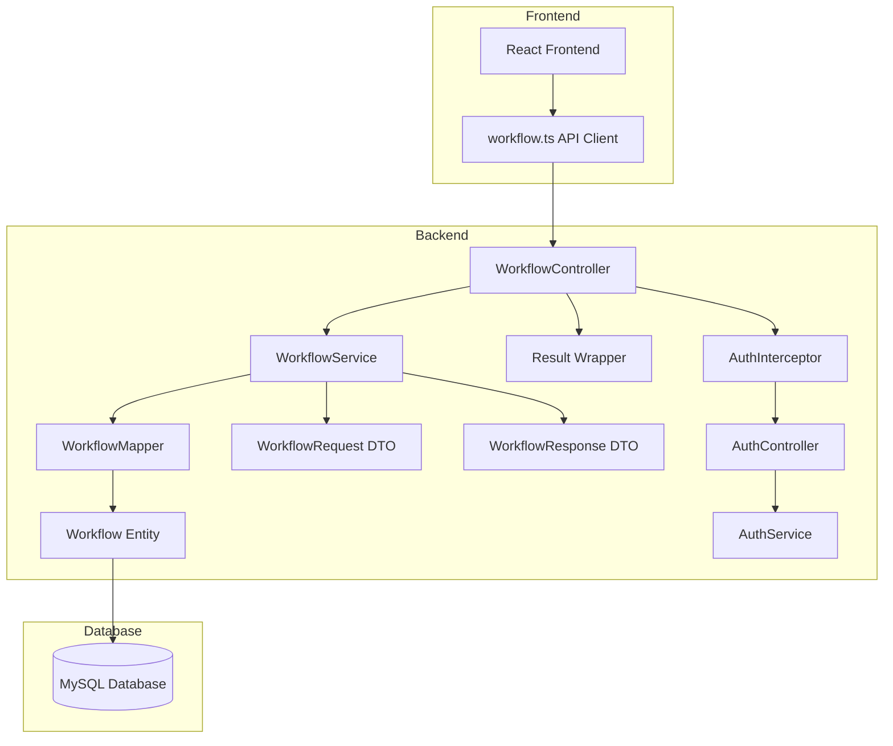
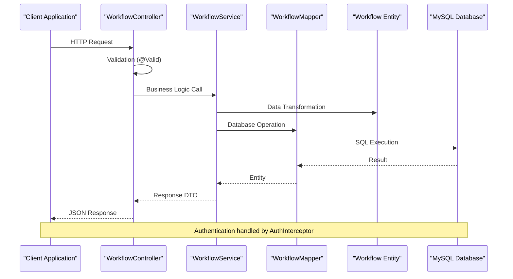
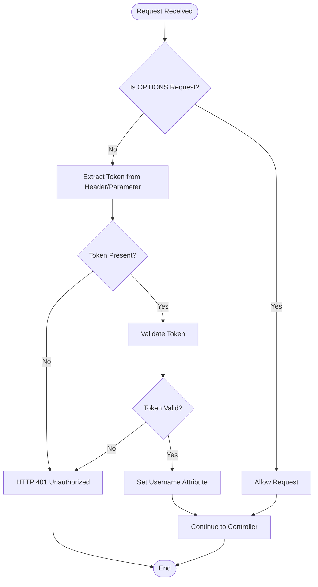
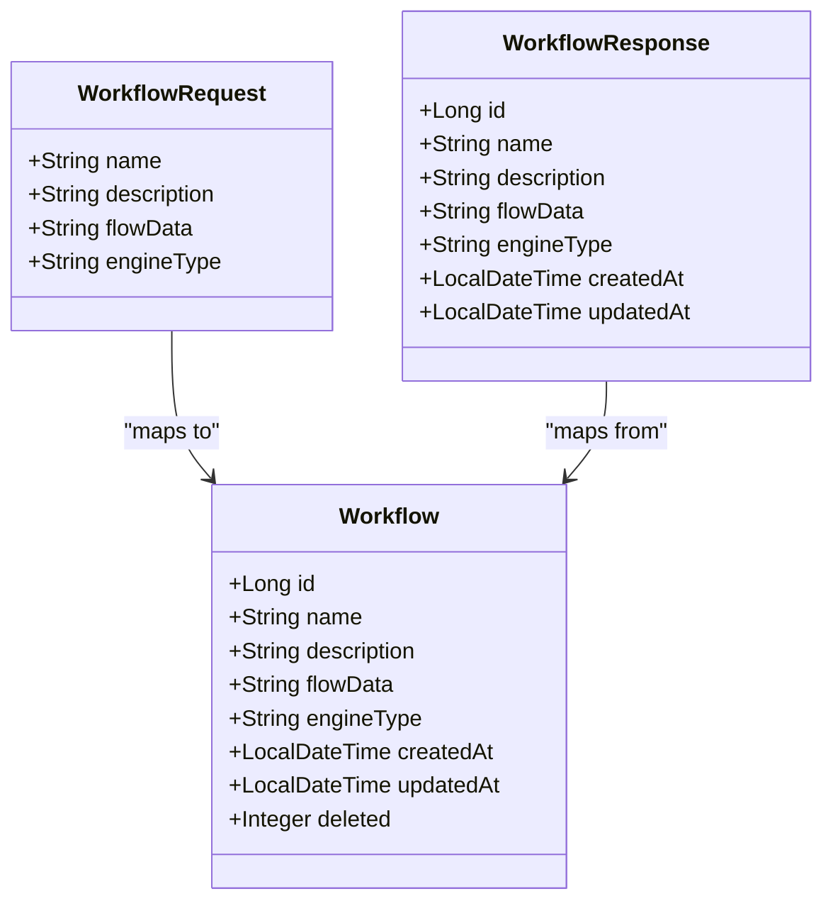
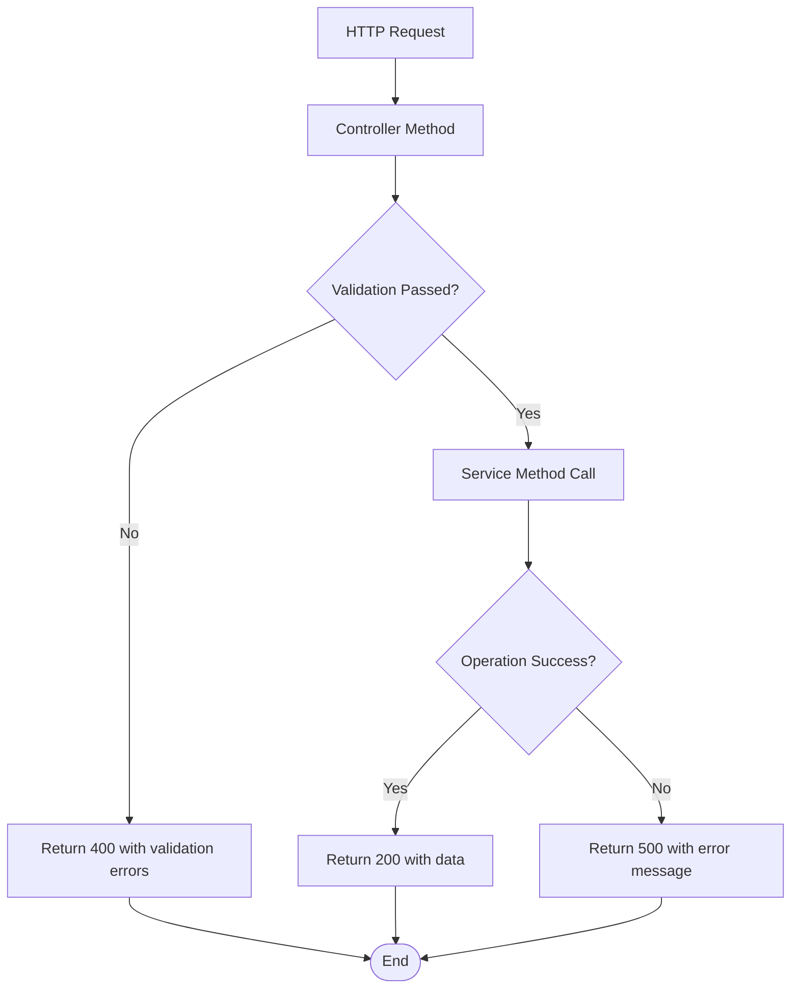
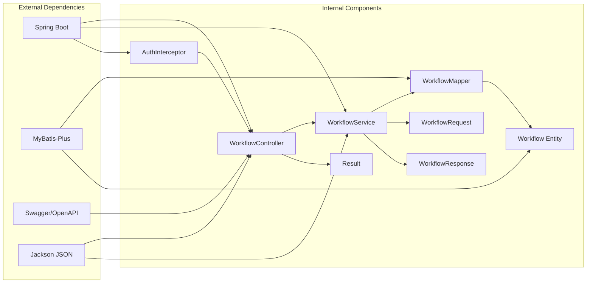

# Workflow Management APIs

<cite>
**Referenced Files in This Document**
- [WorkflowController.java](file://backend/src/main/java/com/paiagent/controller/WorkflowController.java)
- [WorkflowService.java](file://backend/src/main/java/com/paiagent/service/WorkflowService.java)
- [WorkflowRequest.java](file://backend/src/main/java/com/paiagent/dto/WorkflowRequest.java)
- [WorkflowResponse.java](file://backend/src/main/java/com/paiagent/dto/WorkflowResponse.java)
- [Workflow.java](file://backend/src/main/java/com/paiagent/entity/Workflow.java)
- [WorkflowMapper.java](file://backend/src/main/java/com/paiagent/mapper/WorkflowMapper.java)
- [Result.java](file://backend/src/main/java/com/paiagent/common/Result.java)
- [WebConfig.java](file://backend/src/main/java/com/paiagent/config/WebConfig.java)
- [AuthInterceptor.java](file://backend/src/main/java/com/paiagent/interceptor/AuthInterceptor.java)
- [AuthController.java](file://backend/src/main/java/com/paiagent/controller/AuthController.java)
- [AuthService.java](file://backend/src/main/java/com/paiagent/service/AuthService.java)
- [application.yml](file://backend/src/main/resources/application.yml)
- [schema.sql](file://backend/src/main/resources/schema.sql)
- [workflow.ts](file://frontend/src/api/workflow.ts)
</cite>

## Table of Contents
1. [Introduction](#introduction)
2. [Project Structure](#project-structure)
3. [Core Components](#core-components)
4. [Architecture Overview](#architecture-overview)
5. [Detailed Component Analysis](#detailed-component-analysis)
6. [Dependency Analysis](#dependency-analysis)
7. [Performance Considerations](#performance-considerations)
8. [Troubleshooting Guide](#troubleshooting-guide)
9. [Conclusion](#conclusion)
10. [Appendices](#appendices)

## Introduction
This document provides comprehensive API documentation for Workflow Management endpoints in the PaiAgent system. It covers CRUD operations for workflows including creation, updates, deletion, retrieval, and listing. The documentation includes request/response schemas, validation rules, authentication requirements, error handling, and practical examples with sample JSON payloads.

## Project Structure
The workflow management functionality is implemented in the backend Java application using Spring Boot with MyBatis-Plus. The key components include:
- Controller layer for HTTP endpoints
- Service layer for business logic
- DTOs for request/response data transfer
- Entity mapping for database persistence
- Authentication and authorization middleware



**Diagram sources**
- [WorkflowController.java:1-61](file://backend/src/main/java/com/paiagent/controller/WorkflowController.java#L1-L61)
- [WorkflowService.java:1-95](file://backend/src/main/java/com/paiagent/service/WorkflowService.java#L1-L95)
- [WorkflowMapper.java:1-13](file://backend/src/main/java/com/paiagent/mapper/WorkflowMapper.java#L1-L13)
- [Workflow.java:1-58](file://backend/src/main/java/com/paiagent/entity/Workflow.java#L1-L58)
- [AuthInterceptor.java:1-46](file://backend/src/main/java/com/paiagent/interceptor/AuthInterceptor.java#L1-L46)
- [AuthController.java:1-61](file://backend/src/main/java/com/paiagent/controller/AuthController.java#L1-L61)

**Section sources**
- [WorkflowController.java:1-61](file://backend/src/main/java/com/paiagent/controller/WorkflowController.java#L1-L61)
- [application.yml:1-55](file://backend/src/main/resources/application.yml#L1-L55)

## Core Components
The workflow management system consists of several core components that handle different aspects of workflow operations:

### Controller Layer
The WorkflowController exposes REST endpoints for workflow management operations with Swagger documentation annotations.

### Service Layer
The WorkflowService handles business logic including validation, data transformation, and database operations.

### Data Transfer Objects
DTOs define the structure for request and response data with validation constraints.

### Entity Mapping
The Workflow entity maps to the database table with MyBatis-Plus annotations for automatic field mapping.

**Section sources**
- [WorkflowController.java:15-61](file://backend/src/main/java/com/paiagent/controller/WorkflowController.java#L15-L61)
- [WorkflowService.java:15-95](file://backend/src/main/java/com/paiagent/service/WorkflowService.java#L15-L95)
- [WorkflowRequest.java:1-22](file://backend/src/main/java/com/paiagent/dto/WorkflowRequest.java#L1-L22)
- [WorkflowResponse.java:1-20](file://backend/src/main/java/com/paiagent/dto/WorkflowResponse.java#L1-L20)
- [Workflow.java:1-58](file://backend/src/main/java/com/paiagent/entity/Workflow.java#L1-L58)

## Architecture Overview
The workflow management architecture follows a layered approach with clear separation of concerns:



**Diagram sources**
- [WorkflowController.java:26-59](file://backend/src/main/java/com/paiagent/controller/WorkflowController.java#L26-L59)
- [WorkflowService.java:24-93](file://backend/src/main/java/com/paiagent/service/WorkflowService.java#L24-L93)
- [WorkflowMapper.java:10-12](file://backend/src/main/java/com/paiagent/mapper/WorkflowMapper.java#L10-L12)
- [AuthInterceptor.java:19-45](file://backend/src/main/java/com/paiagent/interceptor/AuthInterceptor.java#L19-L45)

## Detailed Component Analysis

### Authentication and Authorization
The system implements token-based authentication with a custom interceptor that validates tokens for protected endpoints.



**Diagram sources**
- [AuthInterceptor.java:19-45](file://backend/src/main/java/com/paiagent/interceptor/AuthInterceptor.java#L19-L45)
- [WebConfig.java:29-34](file://backend/src/main/java/com/paiagent/config/WebConfig.java#L29-L34)

**Section sources**
- [AuthInterceptor.java:1-46](file://backend/src/main/java/com/paiagent/interceptor/AuthInterceptor.java#L1-L46)
- [WebConfig.java:1-35](file://backend/src/main/java/com/paiagent/config/WebConfig.java#L1-L35)
- [AuthController.java:1-61](file://backend/src/main/java/com/paiagent/controller/AuthController.java#L1-L61)
- [AuthService.java:1-62](file://backend/src/main/java/com/paiagent/service/AuthService.java#L1-L62)

### WorkflowRequest DTO
The WorkflowRequest DTO defines the structure for creating and updating workflows with validation constraints.

| Field | Type | Required | Description | Validation |
|-------|------|----------|-------------|------------|
| name | String | Yes | Workflow name | NotBlank, min length 1 |
| description | String | No | Workflow description | Optional |
| flowData | String | Yes | Workflow configuration data (JSON) | NotBlank, min length 1 |
| engineType | String | No | Workflow engine type | Optional, defaults to 'dag' |

**Section sources**
- [WorkflowRequest.java:10-21](file://backend/src/main/java/com/paiagent/dto/WorkflowRequest.java#L10-L21)

### WorkflowResponse DTO
The WorkflowResponse DTO represents the complete workflow information returned to clients.

| Field | Type | Description | Example |
|-------|------|-------------|---------|
| id | Long | Unique identifier | 123 |
| name | String | Workflow name | "Customer Onboarding" |
| description | String | Workflow description | "Handles customer registration process" |
| flowData | String | JSON configuration data | "{...}" |
| engineType | String | Engine type ('dag' or 'langgraph') | "dag" |
| createdAt | LocalDateTime | Creation timestamp | "2024-01-15T10:30:00" |
| updatedAt | LocalDateTime | Last update timestamp | "2024-01-15T14:45:00" |

**Section sources**
- [WorkflowResponse.java:10-19](file://backend/src/main/java/com/paiagent/dto/WorkflowResponse.java#L10-L19)

### Workflow Entity
The Workflow entity maps to the database table with MyBatis-Plus annotations for automatic field handling.



**Diagram sources**
- [Workflow.java:12-57](file://backend/src/main/java/com/paiagent/entity/Workflow.java#L12-L57)
- [WorkflowRequest.java:10-21](file://backend/src/main/java/com/paiagent/dto/WorkflowRequest.java#L10-L21)
- [WorkflowResponse.java:10-19](file://backend/src/main/java/com/paiagent/dto/WorkflowResponse.java#L10-L19)

**Section sources**
- [Workflow.java:1-58](file://backend/src/main/java/com/paiagent/entity/Workflow.java#L1-L58)

### API Endpoints

#### POST /api/workflows - Create Workflow
Creates a new workflow with the provided configuration.

**Request Body:**
```json
{
  "name": "Customer Onboarding",
  "description": "Handles customer registration process",
  "flowData": "{\"nodes\":[],\"edges\":[]}",
  "engineType": "dag"
}
```

**Response:**
```json
{
  "code": 200,
  "message": "Operation successful",
  "data": {
    "id": 123,
    "name": "Customer Onboarding",
    "description": "Handles customer registration process",
    "flowData": "{\"nodes\":[],\"edges\":[]}",
    "engineType": "dag",
    "createdAt": "2024-01-15T10:30:00",
    "updatedAt": "2024-01-15T10:30:00"
  }
}
```

**Validation Rules:**
- `name`: Required, cannot be blank
- `flowData`: Required, cannot be blank
- `engineType`: Optional, defaults to 'dag'

#### PUT /api/workflows/{id} - Update Workflow
Updates an existing workflow identified by ID.

**Path Parameters:**
- `id` (Long): Workflow identifier (required)

**Request Body:**
```json
{
  "name": "Updated Workflow Name",
  "description": "Updated description",
  "flowData": "{\"nodes\":[{\"id\":\"node1\"}],\"edges\":[]}",
  "engineType": "langgraph"
}
```

**Response:**
```json
{
  "code": 200,
  "message": "Operation successful",
  "data": {
    "id": 123,
    "name": "Updated Workflow Name",
    "description": "Updated description",
    "flowData": "{\"nodes\":[{\"id\":\"node1\"}],\"edges\":[]}",
    "engineType": "langgraph",
    "createdAt": "2024-01-15T10:30:00",
    "updatedAt": "2024-01-15T14:45:00"
  }
}
```

**Validation Rules:**
- Same as create operation
- Workflow must exist in database

#### DELETE /api/workflows/{id} - Delete Workflow
Deletes a workflow by ID.

**Path Parameters:**
- `id` (Long): Workflow identifier (required)

**Response:**
```json
{
  "code": 200,
  "message": "Operation successful",
  "data": null
}
```

**Behavior:**
- Performs soft delete using logical deletion field
- Workflow becomes inaccessible but remains in database

#### GET /api/workflows/{id} - Get Workflow Details
Retrieves a specific workflow by ID.

**Path Parameters:**
- `id` (Long): Workflow identifier (required)

**Response:**
```json
{
  "code": 200,
  "message": "Operation successful",
  "data": {
    "id": 123,
    "name": "Customer Onboarding",
    "description": "Handles customer registration process",
    "flowData": "{\"nodes\":[],\"edges\":[]}",
    "engineType": "dag",
    "createdAt": "2024-01-15T10:30:00",
    "updatedAt": "2024-01-15T14:45:00"
  }
}
```

#### GET /api/workflows - List Workflows
Retrieves all workflows ordered by last update time.

**Response:**
```json
{
  "code": 200,
  "message": "Operation successful",
  "data": [
    {
      "id": 123,
      "name": "Customer Onboarding",
      "description": "Handles customer registration process",
      "flowData": "{\"nodes\":[],\"edges\":[]}",
      "engineType": "dag",
      "createdAt": "2024-01-15T10:30:00",
      "updatedAt": "2024-01-15T14:45:00"
    },
    {
      "id": 124,
      "name": "Order Processing",
      "description": "Processes customer orders",
      "flowData": "{\"nodes\":[],\"edges\":[]}",
      "engineType": "dag",
      "createdAt": "2024-01-15T09:15:00",
      "updatedAt": "2024-01-15T12:30:00"
    }
  ]
}
```

**Section sources**
- [WorkflowController.java:26-59](file://backend/src/main/java/com/paiagent/controller/WorkflowController.java#L26-L59)
- [WorkflowService.java:24-84](file://backend/src/main/java/com/paiagent/service/WorkflowService.java#L24-L84)

### Error Handling
The system uses a unified Result wrapper for consistent error handling:



**Diagram sources**
- [Result.java:44-77](file://backend/src/main/java/com/paiagent/common/Result.java#L44-L77)

**Section sources**
- [Result.java:1-79](file://backend/src/main/java/com/paiagent/common/Result.java#L1-L79)
- [WorkflowService.java:42-69](file://backend/src/main/java/com/paiagent/service/WorkflowService.java#L42-L69)

## Dependency Analysis



**Diagram sources**
- [WorkflowController.java:1-13](file://backend/src/main/java/com/paiagent/controller/WorkflowController.java#L1-L13)
- [WorkflowService.java:1-13](file://backend/src/main/java/com/paiagent/service/WorkflowService.java#L1-L13)
- [WorkflowMapper.java:1-13](file://backend/src/main/java/com/paiagent/mapper/WorkflowMapper.java#L1-L13)
- [application.yml:36-47](file://backend/src/main/resources/application.yml#L36-L47)

**Section sources**
- [application.yml:1-55](file://backend/src/main/resources/application.yml#L1-L55)

## Performance Considerations
- **Database Indexes**: The workflow table includes indexes on created_at and updated_at timestamps for efficient sorting and filtering
- **Soft Deletion**: Logical deletion reduces the need for complex cascade operations while maintaining data integrity
- **Connection Pooling**: Spring Boot automatically manages database connections through the configured datasource
- **CORS Configuration**: Cross-origin requests are properly configured for development environments
- **Response Caching**: Consider implementing caching strategies for frequently accessed workflow lists

## Troubleshooting Guide

### Common Issues and Solutions

**Authentication Failures:**
- Verify token format: "Bearer {token}"
- Check token validity through AuthService
- Ensure Authorization header is properly set

**Validation Errors:**
- Required fields: name and flowData cannot be empty
- JSON parsing errors in flowData field
- Engine type validation (only 'dag' or 'langgraph' supported)

**Database Issues:**
- Connection string verification in application.yml
- MySQL server availability
- Table existence and schema compliance

**Section sources**
- [AuthInterceptor.java:25-39](file://backend/src/main/java/com/paiagent/interceptor/AuthInterceptor.java#L25-L39)
- [WorkflowRequest.java:12-18](file://backend/src/main/java/com/paiagent/dto/WorkflowRequest.java#L12-L18)
- [schema.sql:6-18](file://backend/src/main/resources/schema.sql#L6-L18)

## Conclusion
The Workflow Management API provides a comprehensive REST interface for managing workflows with proper validation, authentication, and consistent error handling. The architecture follows best practices with clear separation of concerns and supports both basic DAG workflows and advanced LangGraph workflows through the engineType field.

## Appendices

### Database Schema Reference
The workflow table structure supports flexible workflow definitions with JSON storage for dynamic configurations.

**Section sources**
- [schema.sql:6-18](file://backend/src/main/resources/schema.sql#L6-L18)

### Frontend Integration
The React frontend provides TypeScript interfaces for seamless integration with the workflow API endpoints.

**Section sources**
- [workflow.ts:14-29](file://frontend/src/api/workflow.ts#L14-L29)
- [workflow.ts:47-77](file://frontend/src/api/workflow.ts#L47-L77)