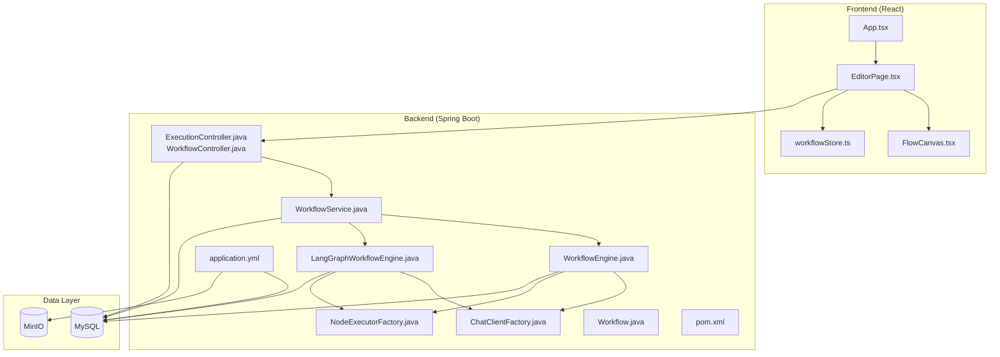
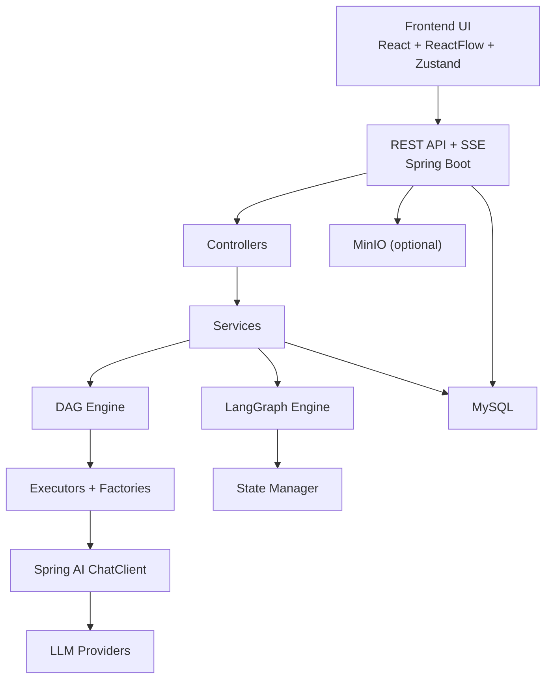
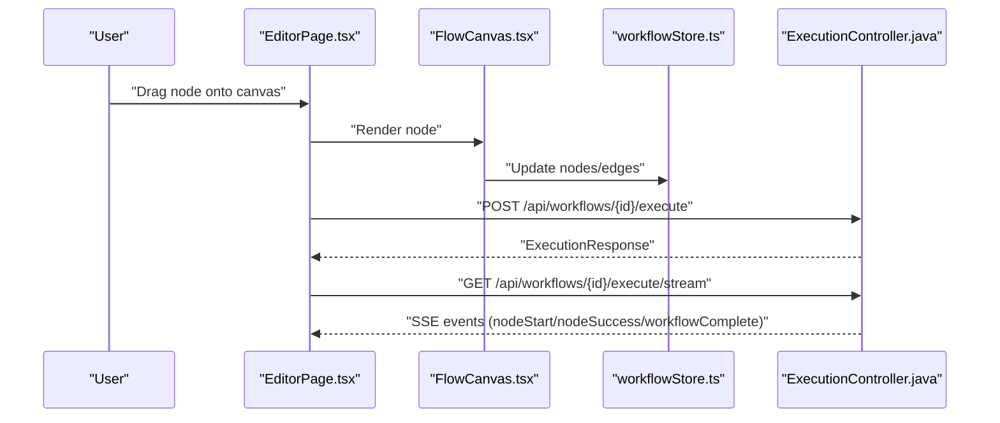
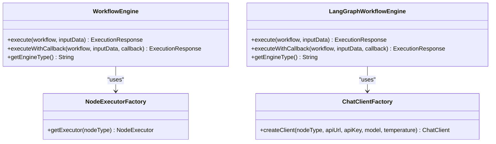
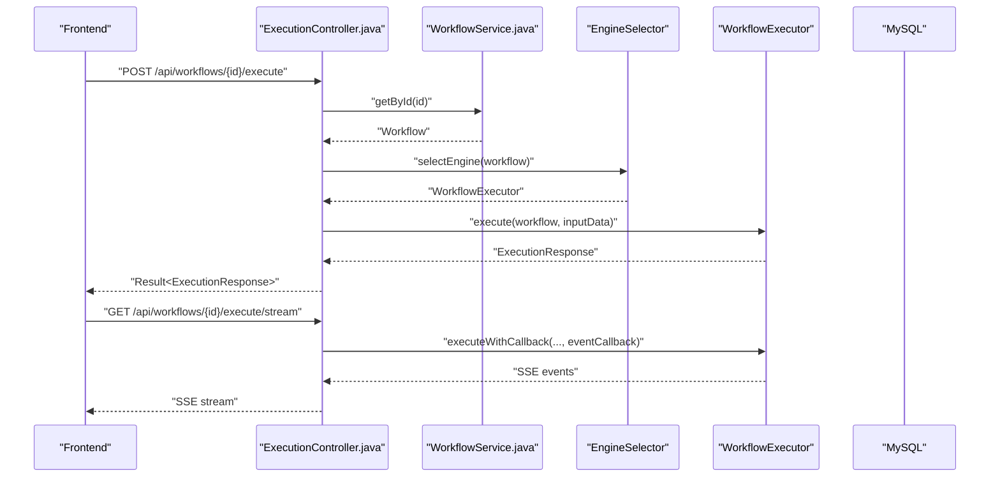
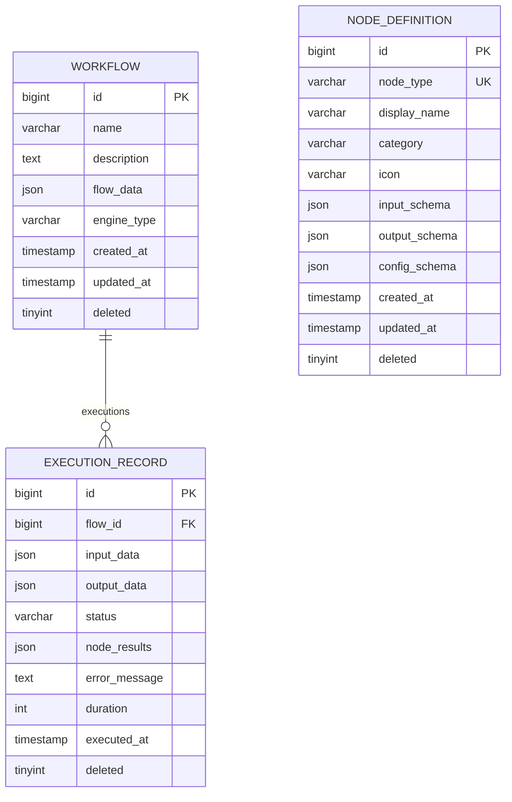
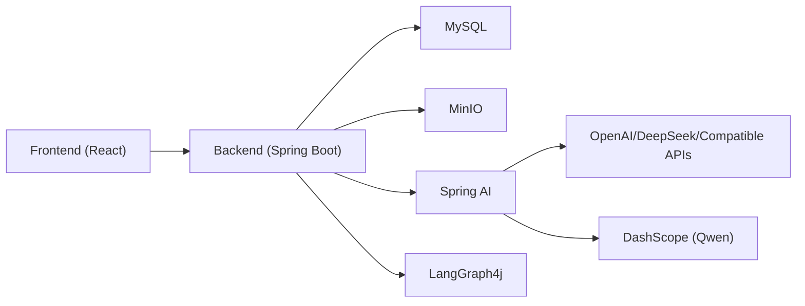

# Architecture Overview

<cite>
**Referenced Files in This Document**
- [README.md](file://README.md)
- [PaiAgentApplication.java](file://backend/src/main/java/com/paiagent/PaiAgentApplication.java)
- [application.yml](file://backend/src/main/resources/application.yml)
- [pom.xml](file://backend/pom.xml)
- [package.json](file://frontend/package.json)
- [App.tsx](file://frontend/src/App.tsx)
- [WorkflowEngine.java](file://backend/src/main/java/com/paiagent/engine/WorkflowEngine.java)
- [LangGraphWorkflowEngine.java](file://backend/src/main/java/com/paiagent/engine/langgraph/LangGraphWorkflowEngine.java)
- [ExecutionController.java](file://backend/src/main/java/com/paiagent/controller/ExecutionController.java)
- [WorkflowController.java](file://backend/src/main/java/com/paiagent/controller/WorkflowController.java)
- [ChatClientFactory.java](file://backend/src/main/java/com/paiagent/engine/llm/ChatClientFactory.java)
- [NodeExecutorFactory.java](file://backend/src/main/java/com/paiagent/engine/executor/NodeExecutorFactory.java)
- [WorkflowService.java](file://backend/src/main/java/com/paiagent/service/WorkflowService.java)
- [Workflow.java](file://backend/src/main/java/com/paiagent/entity/Workflow.java)
- [schema.sql](file://backend/src/main/resources/schema.sql)
- [FlowCanvas.tsx](file://frontend/src/components/FlowCanvas.tsx)
- [EditorPage.tsx](file://frontend/src/pages/EditorPage.tsx)
- [workflowStore.ts](file://frontend/src/store/workflowStore.ts)
</cite>

## Table of Contents
1. [Introduction](#introduction)
2. [Project Structure](#project-structure)
3. [Core Components](#core-components)
4. [Architecture Overview](#architecture-overview)
5. [Detailed Component Analysis](#detailed-component-analysis)
6. [Dependency Analysis](#dependency-analysis)
7. [Performance Considerations](#performance-considerations)
8. [Troubleshooting Guide](#troubleshooting-guide)
9. [Conclusion](#conclusion)

## Introduction
This document presents the architectural blueprint of the PaiAgent system, a visual AI workflow orchestration platform. The system is organized into distinct layers:
- Frontend React layer for visualization and authoring
- Backend Spring Boot application exposing REST APIs and streaming events
- Workflow engine layer supporting both a lightweight DAG engine and a stateful LangGraph engine
- AI model integration layer leveraging Spring AI for unified LLM access
- Data storage layer backed by MySQL with optional MinIO for artifacts

The architecture emphasizes modularity, extensibility, and real-time observability via server-sent events (SSE). It supports two execution engines to accommodate simple linear flows and advanced stateful workflows with branching and loops.

## Project Structure
The repository follows a clear separation of concerns:
- backend: Spring Boot application with layered architecture (controllers, services, mappers, engines, models)
- frontend: React application with TypeScript, Zustand for state, and ReactFlow for visualization
- docs/image: documentation and images
- Root-level configuration files for project metadata and deployment guidance

**Diagram sources**
- [App.tsx:1-24](file://frontend/src/App.tsx#L1-L24)
- [EditorPage.tsx:1-120](file://frontend/src/pages/EditorPage.tsx#L1-L120)
- [FlowCanvas.tsx:1-165](file://frontend/src/components/FlowCanvas.tsx#L1-L165)
- [workflowStore.ts:1-70](file://frontend/src/store/workflowStore.ts#L1-L70)
- [ExecutionController.java:1-109](file://backend/src/main/java/com/paiagent/controller/ExecutionController.java#L1-L109)
- [WorkflowController.java:1-61](file://backend/src/main/java/com/paiagent/controller/WorkflowController.java#L1-L61)
- [WorkflowService.java:1-95](file://backend/src/main/java/com/paiagent/service/WorkflowService.java#L1-L95)
- [WorkflowEngine.java:1-164](file://backend/src/main/java/com/paiagent/engine/WorkflowEngine.java#L1-L164)
- [LangGraphWorkflowEngine.java:1-192](file://backend/src/main/java/com/paiagent/engine/langgraph/LangGraphWorkflowEngine.java#L1-L192)
- [ChatClientFactory.java:1-60](file://backend/src/main/java/com/paiagent/engine/llm/ChatClientFactory.java#L1-L60)
- [NodeExecutorFactory.java:1-36](file://backend/src/main/java/com/paiagent/engine/executor/NodeExecutorFactory.java#L1-L36)
- [Workflow.java:1-58](file://backend/src/main/java/com/paiagent/entity/Workflow.java#L1-L58)
- [application.yml:1-55](file://backend/src/main/resources/application.yml#L1-L55)
- [pom.xml:1-163](file://backend/pom.xml#L1-L163)

**Section sources**
- [README.md:220-282](file://README.md#L220-L282)
- [PaiAgentApplication.java:1-16](file://backend/src/main/java/com/paiagent/PaiAgentApplication.java#L1-L16)
- [application.yml:1-55](file://backend/src/main/resources/application.yml#L1-L55)
- [pom.xml:1-163](file://backend/pom.xml#L1-L163)
- [package.json:1-40](file://frontend/package.json#L1-L40)

## Core Components
- Frontend React layer
  - Routing and layout managed by App.tsx
  - EditorPage.tsx orchestrates workflow editing, node configuration, and execution triggers
  - FlowCanvas.tsx integrates ReactFlow for drag-and-drop, connecting nodes, and rendering edges
  - workflowStore.ts manages local state for nodes, edges, selection, and current workflow ID
- Backend Spring Boot application
  - Controllers expose REST endpoints for workflow CRUD and execution (blocking and streaming)
  - Services encapsulate business logic and coordinate with engines
  - Engines implement execution strategies:
    - WorkflowEngine.java: DAG-based execution with topological sorting and cycle detection
    - LangGraphWorkflowEngine.java: Stateful execution powered by LangGraph4j
  - AI integration via ChatClientFactory.java for unified access to OpenAI-compatible providers
  - Factories and executors enable extensible node execution
  - Entities and persistence via MyBatis-Plus and MySQL schema
- Data layer
  - MySQL stores workflow definitions, execution records, and node definitions
  - Optional MinIO integration for artifact storage

**Section sources**
- [App.tsx:1-24](file://frontend/src/App.tsx#L1-L24)
- [EditorPage.tsx:1-120](file://frontend/src/pages/EditorPage.tsx#L1-L120)
- [FlowCanvas.tsx:1-165](file://frontend/src/components/FlowCanvas.tsx#L1-L165)
- [workflowStore.ts:1-70](file://frontend/src/store/workflowStore.ts#L1-L70)
- [ExecutionController.java:1-109](file://backend/src/main/java/com/paiagent/controller/ExecutionController.java#L1-L109)
- [WorkflowController.java:1-61](file://backend/src/main/java/com/paiagent/controller/WorkflowController.java#L1-L61)
- [WorkflowEngine.java:1-164](file://backend/src/main/java/com/paiagent/engine/WorkflowEngine.java#L1-L164)
- [LangGraphWorkflowEngine.java:1-192](file://backend/src/main/java/com/paiagent/engine/langgraph/LangGraphWorkflowEngine.java#L1-L192)
- [ChatClientFactory.java:1-60](file://backend/src/main/java/com/paiagent/engine/llm/ChatClientFactory.java#L1-L60)
- [NodeExecutorFactory.java:1-36](file://backend/src/main/java/com/paiagent/engine/executor/NodeExecutorFactory.java#L1-L36)
- [WorkflowService.java:1-95](file://backend/src/main/java/com/paiagent/service/WorkflowService.java#L1-L95)
- [Workflow.java:1-58](file://backend/src/main/java/com/paiagent/entity/Workflow.java#L1-L58)
- [schema.sql:1-84](file://backend/src/main/resources/schema.sql#L1-L84)

## Architecture Overview
The system employs a layered architecture with clear component boundaries and unidirectional data flow:
- Frontend layer handles UI composition, user interactions, and emits requests to backend
- Backend layer exposes REST APIs and SSE streams, coordinates engines, and persists state
- Engine layer executes workflows either as deterministic DAG sequences or as stateful graphs
- AI integration layer abstracts provider differences behind a unified interface
- Data layer persists configuration, runtime state, and artifacts

**Diagram sources**
- [App.tsx:1-24](file://frontend/src/App.tsx#L1-L24)
- [EditorPage.tsx:1-120](file://frontend/src/pages/EditorPage.tsx#L1-L120)
- [FlowCanvas.tsx:1-165](file://frontend/src/components/FlowCanvas.tsx#L1-L165)
- [workflowStore.ts:1-70](file://frontend/src/store/workflowStore.ts#L1-L70)
- [ExecutionController.java:1-109](file://backend/src/main/java/com/paiagent/controller/ExecutionController.java#L1-L109)
- [WorkflowController.java:1-61](file://backend/src/main/java/com/paiagent/controller/WorkflowController.java#L1-L61)
- [WorkflowEngine.java:1-164](file://backend/src/main/java/com/paiagent/engine/WorkflowEngine.java#L1-L164)
- [LangGraphWorkflowEngine.java:1-192](file://backend/src/main/java/com/paiagent/engine/langgraph/LangGraphWorkflowEngine.java#L1-L192)
- [ChatClientFactory.java:1-60](file://backend/src/main/java/com/paiagent/engine/llm/ChatClientFactory.java#L1-L60)
- [NodeExecutorFactory.java:1-36](file://backend/src/main/java/com/paiagent/engine/executor/NodeExecutorFactory.java#L1-L36)
- [application.yml:1-55](file://backend/src/main/resources/application.yml#L1-L55)

## Detailed Component Analysis

### Frontend: React Flow Editor
- Responsibilities
  - Render the flow canvas and node palette
  - Manage drag-and-drop creation of nodes and edges
  - Persist workflow definition to backend
  - Trigger execution and stream results via SSE
- Key interactions
  - FlowCanvas.tsx binds ReactFlow state to Zustand workflowStore.ts
  - EditorPage.tsx orchestrates saving, loading, and execution
  - App.tsx sets up routing and localization

**Diagram sources**
- [EditorPage.tsx:1-120](file://frontend/src/pages/EditorPage.tsx#L1-L120)
- [FlowCanvas.tsx:1-165](file://frontend/src/components/FlowCanvas.tsx#L1-L165)
- [workflowStore.ts:1-70](file://frontend/src/store/workflowStore.ts#L1-L70)
- [ExecutionController.java:1-109](file://backend/src/main/java/com/paiagent/controller/ExecutionController.java#L1-L109)

**Section sources**
- [App.tsx:1-24](file://frontend/src/App.tsx#L1-L24)
- [EditorPage.tsx:1-120](file://frontend/src/pages/EditorPage.tsx#L1-L120)
- [FlowCanvas.tsx:1-165](file://frontend/src/components/FlowCanvas.tsx#L1-L165)
- [workflowStore.ts:1-70](file://frontend/src/store/workflowStore.ts#L1-L70)

### Backend: Workflow Execution Engines
- DAG Engine (WorkflowEngine.java)
  - Parses workflow configuration and performs topological sort
  - Iteratively executes nodes via NodeExecutorFactory
  - Emits structured execution events and persists results
- LangGraph Engine (LangGraphWorkflowEngine.java)
  - Builds a CompiledGraph from workflow config
  - Initializes AgentState and invokes execution
  - Extracts final state, node results, and error conditions
  - Persists execution metrics and outcomes

**Diagram sources**
- [WorkflowEngine.java:1-164](file://backend/src/main/java/com/paiagent/engine/WorkflowEngine.java#L1-L164)
- [LangGraphWorkflowEngine.java:1-192](file://backend/src/main/java/com/paiagent/engine/langgraph/LangGraphWorkflowEngine.java#L1-L192)
- [NodeExecutorFactory.java:1-36](file://backend/src/main/java/com/paiagent/engine/executor/NodeExecutorFactory.java#L1-L36)
- [ChatClientFactory.java:1-60](file://backend/src/main/java/com/paiagent/engine/llm/ChatClientFactory.java#L1-L60)

**Section sources**
- [WorkflowEngine.java:1-164](file://backend/src/main/java/com/paiagent/engine/WorkflowEngine.java#L1-L164)
- [LangGraphWorkflowEngine.java:1-192](file://backend/src/main/java/com/paiagent/engine/langgraph/LangGraphWorkflowEngine.java#L1-L192)
- [NodeExecutorFactory.java:1-36](file://backend/src/main/java/com/paiagent/engine/executor/NodeExecutorFactory.java#L1-L36)
- [ChatClientFactory.java:1-60](file://backend/src/main/java/com/paiagent/engine/llm/ChatClientFactory.java#L1-L60)

### Backend: REST and Streaming Execution
- ExecutionController.java
  - Blocking execution: POST /api/workflows/{id}/execute
  - Streaming execution: GET /api/workflows/{id}/execute/stream (SSE)
  - Manages SSE emitters and forwards ExecutionEvents to clients
- WorkflowController.java
  - CRUD endpoints for workflows with Swagger annotations

**Diagram sources**
- [ExecutionController.java:1-109](file://backend/src/main/java/com/paiagent/controller/ExecutionController.java#L1-L109)
- [WorkflowController.java:1-61](file://backend/src/main/java/com/paiagent/controller/WorkflowController.java#L1-L61)
- [WorkflowService.java:1-95](file://backend/src/main/java/com/paiagent/service/WorkflowService.java#L1-L95)

**Section sources**
- [ExecutionController.java:1-109](file://backend/src/main/java/com/paiagent/controller/ExecutionController.java#L1-L109)
- [WorkflowController.java:1-61](file://backend/src/main/java/com/paiagent/controller/WorkflowController.java#L1-L61)
- [WorkflowService.java:1-95](file://backend/src/main/java/com/paiagent/service/WorkflowService.java#L1-L95)

### Data Model and Persistence
- Entities and tables
  - Workflow.java maps to workflow table with JSON flowData and engineType
  - execution_record table captures execution results, statuses, and timing
  - node_definition table defines supported node types and schemas
- Schema initialization and pre-defined nodes are defined in schema.sql

**Diagram sources**
- [Workflow.java:1-58](file://backend/src/main/java/com/paiagent/entity/Workflow.java#L1-L58)
- [schema.sql:6-51](file://backend/src/main/resources/schema.sql#L6-L51)

**Section sources**
- [Workflow.java:1-58](file://backend/src/main/java/com/paiagent/entity/Workflow.java#L1-L58)
- [schema.sql:1-84](file://backend/src/main/resources/schema.sql#L1-L84)

## Dependency Analysis
- Technology stack rationale
  - Frontend: React 18 with TypeScript, ReactFlow for visualization, Ant Design/Tailwind for UI, Zustand for lightweight state
  - Backend: Spring Boot 3.4.1 with Java 21, MyBatis-Plus for persistence, Spring AI for LLM abstraction, LangGraph4j for stateful workflows
  - Data: MySQL for relational data, optional MinIO for artifacts
- External integrations
  - Spring AI OpenAI starter and DashScope SDK for provider support
  - LangGraph4j core and Spring AI integration for stateful graph execution
  - FastJSON2 for efficient JSON processing

**Diagram sources**
- [package.json:1-40](file://frontend/package.json#L1-L40)
- [pom.xml:1-163](file://backend/pom.xml#L1-L163)
- [application.yml:1-55](file://backend/src/main/resources/application.yml#L1-L55)

**Section sources**
- [pom.xml:1-163](file://backend/pom.xml#L1-L163)
- [application.yml:1-55](file://backend/src/main/resources/application.yml#L1-L55)
- [README.md:111-218](file://README.md#L111-L218)

## Performance Considerations
- Execution engines
  - DAG engine: Lightweight, suitable for linear flows; topological sorting ensures deterministic order
  - LangGraph engine: Supports branching and loops; stateful execution enables richer control flow
- Streaming execution
  - SSE provides real-time feedback during execution, improving UX and debugging
- Caching and concurrency
  - Consider caching frequently accessed node definitions and provider configurations
  - Use thread pools judiciously for long-running LLM calls
- Observability
  - Execution metrics (duration, per-node timings) are persisted for monitoring and tuning

[No sources needed since this section provides general guidance]

## Troubleshooting Guide
- Authentication and routing
  - Ensure routes are configured correctly in App.tsx and protected by interceptors as needed
- Execution failures
  - ExecutionController.java logs errors and sends ERROR events via SSE; check backend logs for stack traces
  - Verify engine selection and node executor availability
- LLM connectivity
  - Confirm ChatClientFactory receives valid API keys and endpoints; validate provider compatibility
- Database connectivity
  - Validate datasource configuration in application.yml and confirm schema initialization

**Section sources**
- [ExecutionController.java:1-109](file://backend/src/main/java/com/paiagent/controller/ExecutionController.java#L1-L109)
- [ChatClientFactory.java:1-60](file://backend/src/main/java/com/paiagent/engine/llm/ChatClientFactory.java#L1-L60)
- [application.yml:1-55](file://backend/src/main/resources/application.yml#L1-L55)

## Conclusion
PaiAgent’s layered architecture balances simplicity and power. The React-based editor provides an intuitive authoring experience, while the Spring Boot backend offers flexible execution engines and robust streaming capabilities. The unified AI integration via Spring AI and the stateful LangGraph engine enable both straightforward and sophisticated AI workflows. The modular design supports future enhancements such as conditional branches, loops, and plugin ecosystems.