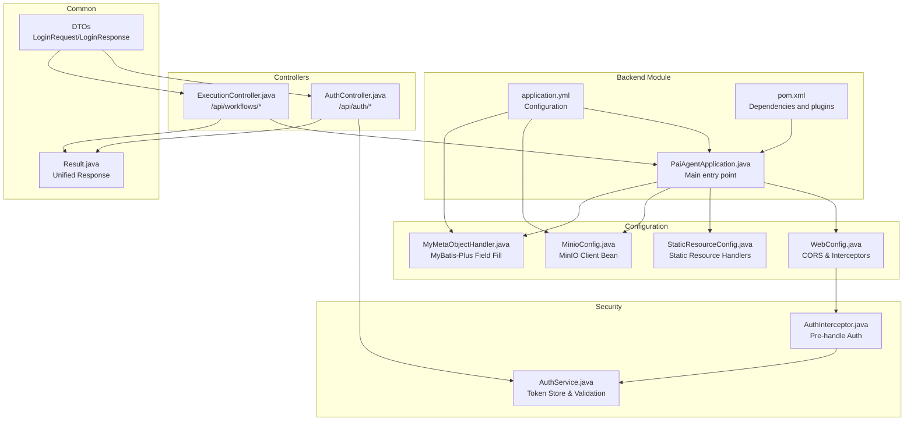
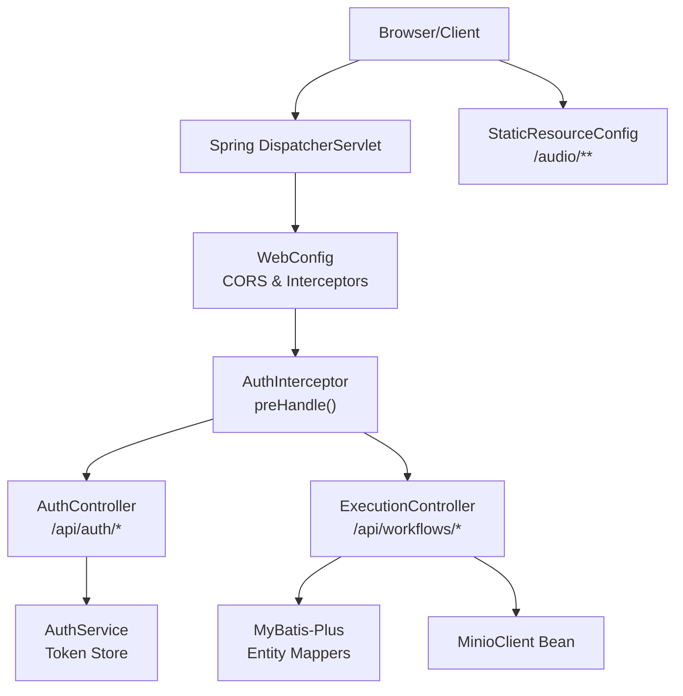
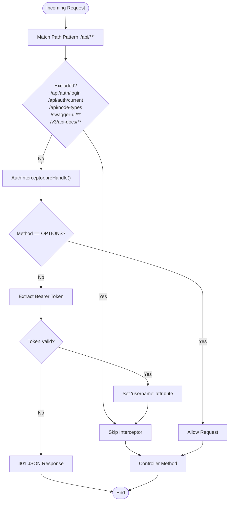
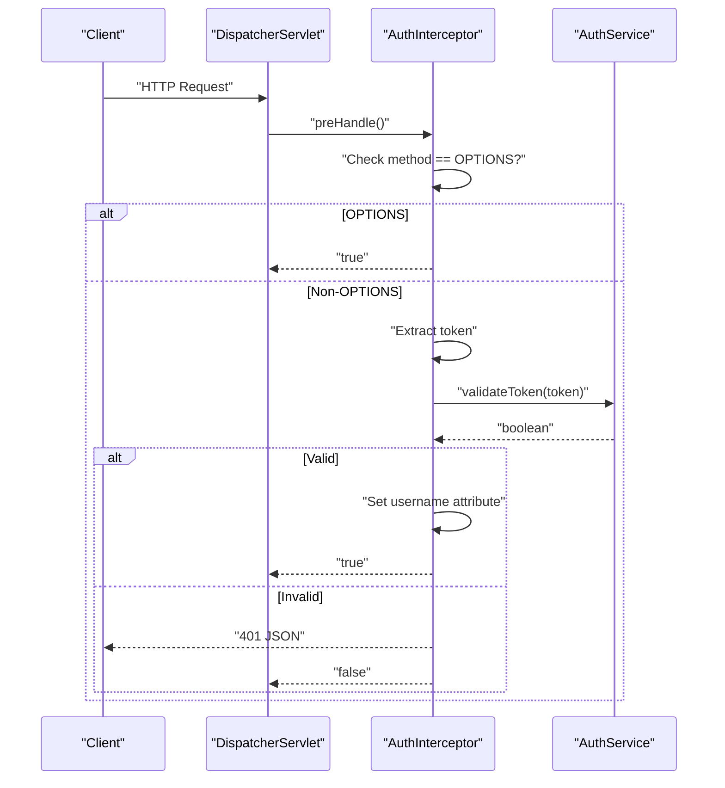
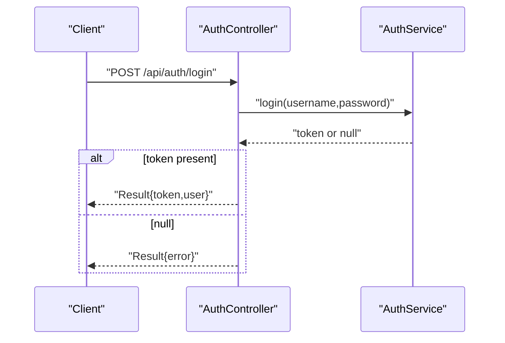
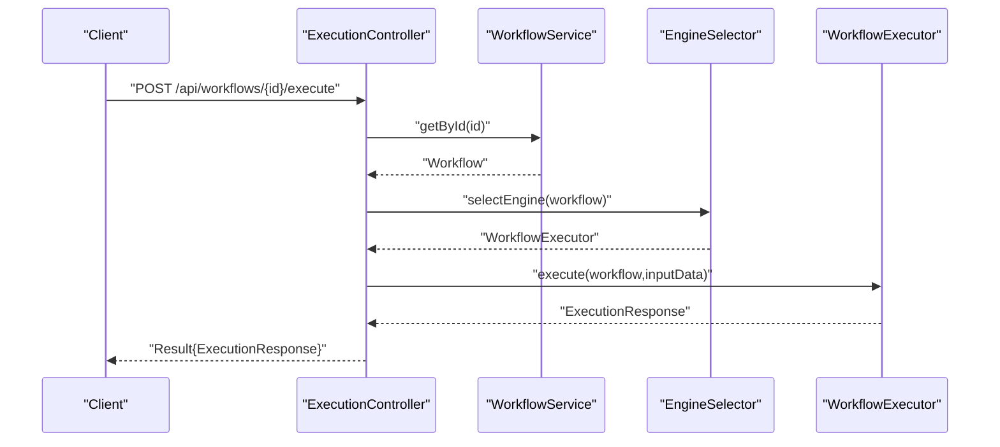
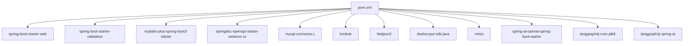

# Application Structure

<cite>
**Referenced Files in This Document**
- [PaiAgentApplication.java](file://backend/src/main/java/com/paiagent/PaiAgentApplication.java)
- [WebConfig.java](file://backend/src/main/java/com/paiagent/config/WebConfig.java)
- [StaticResourceConfig.java](file://backend/src/main/java/com/paiagent/config/StaticResourceConfig.java)
- [MinioConfig.java](file://backend/src/main/java/com/paiagent/config/MinioConfig.java)
- [MyMetaObjectHandler.java](file://backend/src/main/java/com/paiagent/config/MyMetaObjectHandler.java)
- [AuthInterceptor.java](file://backend/src/main/java/com/paiagent/interceptor/AuthInterceptor.java)
- [AuthService.java](file://backend/src/main/java/com/paiagent/service/AuthService.java)
- [AuthController.java](file://backend/src/main/java/com/paiagent/controller/AuthController.java)
- [ExecutionController.java](file://backend/src/main/java/com/paiagent/controller/ExecutionController.java)
- [Result.java](file://backend/src/main/java/com/paiagent/common/Result.java)
- [LoginRequest.java](file://backend/src/main/java/com/paiagent/dto/LoginRequest.java)
- [LoginResponse.java](file://backend/src/main/java/com/paiagent/dto/LoginResponse.java)
- [application.yml](file://backend/src/main/resources/application.yml)
- [pom.xml](file://backend/pom.xml)
</cite>

## Table of Contents
1. [Introduction](#introduction)
2. [Project Structure](#project-structure)
3. [Core Components](#core-components)
4. [Architecture Overview](#architecture-overview)
5. [Detailed Component Analysis](#detailed-component-analysis)
6. [Dependency Analysis](#dependency-analysis)
7. [Performance Considerations](#performance-considerations)
8. [Troubleshooting Guide](#troubleshooting-guide)
9. [Conclusion](#conclusion)

## Introduction
This document explains the Spring Boot application structure and configuration for the backend module. It covers the main application entry point, package organization, component scanning, web configuration (CORS, static resources, interceptors), startup and bean initialization, configuration loading, security interceptors, request processing pipeline, and middleware integration patterns. The goal is to help developers understand how the system boots, how requests flow through the application, and how cross-cutting concerns like authentication and resource serving are integrated.

## Project Structure
The backend follows a conventional Maven layout with Java source under src/main/java and resources under src/main/resources. The primary package com.paiagent contains subpackages for common utilities, configuration, controllers, DTOs, engines, entities, interceptors, mappers, services, and the main application class. Configuration is centralized in application.yml, while Maven coordinates dependencies and build plugins.

**Diagram sources**
- [PaiAgentApplication.java:1-16](file://backend/src/main/java/com/paiagent/PaiAgentApplication.java#L1-L16)
- [WebConfig.java:1-35](file://backend/src/main/java/com/paiagent/config/WebConfig.java#L1-L35)
- [StaticResourceConfig.java:1-25](file://backend/src/main/java/com/paiagent/config/StaticResourceConfig.java#L1-L25)
- [MinioConfig.java:1-28](file://backend/src/main/java/com/paiagent/config/MinioConfig.java#L1-L28)
- [MyMetaObjectHandler.java:1-27](file://backend/src/main/java/com/paiagent/config/MyMetaObjectHandler.java#L1-L27)
- [AuthInterceptor.java:1-46](file://backend/src/main/java/com/paiagent/interceptor/AuthInterceptor.java#L1-L46)
- [AuthService.java:1-63](file://backend/src/main/java/com/paiagent/service/AuthService.java#L1-L63)
- [AuthController.java:1-62](file://backend/src/main/java/com/paiagent/controller/AuthController.java#L1-L62)
- [ExecutionController.java:1-109](file://backend/src/main/java/com/paiagent/controller/ExecutionController.java#L1-L109)
- [Result.java:1-79](file://backend/src/main/java/com/paiagent/common/Result.java#L1-L79)
- [LoginRequest.java:1-18](file://backend/src/main/java/com/paiagent/dto/LoginRequest.java#L1-L18)
- [LoginResponse.java:1-29](file://backend/src/main/java/com/paiagent/dto/LoginResponse.java#L1-L29)
- [application.yml:1-55](file://backend/src/main/resources/application.yml#L1-L55)
- [pom.xml:1-163](file://backend/pom.xml#L1-L163)

**Section sources**
- [PaiAgentApplication.java:1-16](file://backend/src/main/java/com/paiagent/PaiAgentApplication.java#L1-L16)
- [application.yml:1-55](file://backend/src/main/resources/application.yml#L1-L55)
- [pom.xml:1-163](file://backend/pom.xml#L1-L163)

## Core Components
- Main application entry point: The @SpringBootApplication annotated class enables auto-configuration, component scanning, and MyBatis-Plus mapper scanning. It launches the embedded server and initializes the Spring context.
- Configuration beans:
  - WebConfig: Registers CORS and registers AuthInterceptor for protected paths.
  - StaticResourceConfig: Exposes audio files via a file-based resource handler.
  - MinioConfig: Creates a MinioClient bean from application.yml minio properties.
  - MyMetaObjectHandler: Provides automatic field filling for entity creation/update.
- Security:
  - AuthInterceptor validates tokens from Authorization header or query parameter and sets username attribute on successful validation.
  - AuthService maintains an in-memory token store and exposes login/logout/validation/getUsernameByToken.
- Controllers:
  - AuthController handles login/logout/current endpoints under /api/auth.
  - ExecutionController executes workflows synchronously and asynchronously via Server-Sent Events.
- Common utilities:
  - Result encapsulates standardized response envelopes with convenience factory methods.
  - DTOs define request/response shapes for authentication.

**Section sources**
- [PaiAgentApplication.java:7-9](file://backend/src/main/java/com/paiagent/PaiAgentApplication.java#L7-L9)
- [WebConfig.java:13-35](file://backend/src/main/java/com/paiagent/config/WebConfig.java#L13-L35)
- [StaticResourceConfig.java:13-25](file://backend/src/main/java/com/paiagent/config/StaticResourceConfig.java#L13-L25)
- [MinioConfig.java:9-27](file://backend/src/main/java/com/paiagent/config/MinioConfig.java#L9-L27)
- [MyMetaObjectHandler.java:12-27](file://backend/src/main/java/com/paiagent/config/MyMetaObjectHandler.java#L12-L27)
- [AuthInterceptor.java:13-46](file://backend/src/main/java/com/paiagent/interceptor/AuthInterceptor.java#L13-L46)
- [AuthService.java:12-63](file://backend/src/main/java/com/paiagent/service/AuthService.java#L12-L63)
- [AuthController.java:17-62](file://backend/src/main/java/com/paiagent/controller/AuthController.java#L17-L62)
- [ExecutionController.java:25-109](file://backend/src/main/java/com/paiagent/controller/ExecutionController.java#L25-L109)
- [Result.java:8-79](file://backend/src/main/java/com/paiagent/common/Result.java#L8-L79)
- [LoginRequest.java:9-18](file://backend/src/main/java/com/paiagent/dto/LoginRequest.java#L9-L18)
- [LoginResponse.java:9-29](file://backend/src/main/java/com/paiagent/dto/LoginResponse.java#L9-L29)

## Architecture Overview
The application uses Spring MVC with explicit WebMvcConfigurer customization for CORS and interceptors. Authentication is enforced globally via a servlet interceptor that inspects incoming requests for a bearer token. Static audio assets are served from a local directory. Configuration is loaded from application.yml and injected into beans via @ConfigurationProperties and @Value. The execution pipeline routes requests through controllers to services and engines, returning unified responses.

**Diagram sources**
- [WebConfig.java:19-34](file://backend/src/main/java/com/paiagent/config/WebConfig.java#L19-L34)
- [AuthInterceptor.java:19-45](file://backend/src/main/java/com/paiagent/interceptor/AuthInterceptor.java#L19-L45)
- [AuthController.java:19-62](file://backend/src/main/java/com/paiagent/controller/AuthController.java#L19-L62)
- [ExecutionController.java:28-109](file://backend/src/main/java/com/paiagent/controller/ExecutionController.java#L28-L109)
- [AuthService.java:28-61](file://backend/src/main/java/com/paiagent/service/AuthService.java#L28-L61)
- [StaticResourceConfig.java:17-24](file://backend/src/main/java/com/paiagent/config/StaticResourceConfig.java#L17-L24)
- [MinioConfig.java:20-26](file://backend/src/main/java/com/paiagent/config/MinioConfig.java#L20-L26)

## Detailed Component Analysis

### Main Application Entry Point
- Purpose: Bootstrap the Spring Boot application, enable component scanning, and configure MyBatis-Plus mapper scanning.
- Behavior: SpringApplication.run launches the embedded server and loads configuration from application.yml.

**Section sources**
- [PaiAgentApplication.java:11-13](file://backend/src/main/java/com/paiagent/PaiAgentApplication.java#L11-L13)
- [PaiAgentApplication.java:7-9](file://backend/src/main/java/com/paiagent/PaiAgentApplication.java#L7-L9)

### Web Configuration: CORS, Static Resources, and Interceptors
- CORS: Allows cross-origin requests from http://localhost:* with credentials, specific methods, and headers, with a max age.
- Static Resource Serving: Maps /audio/** to a file-based location pointing to a local audio_output directory.
- Interceptor Registration: Registers AuthInterceptor for /api/** excluding specific paths (login/current and Swagger UI).

**Diagram sources**
- [WebConfig.java:20-34](file://backend/src/main/java/com/paiagent/config/WebConfig.java#L20-L34)
- [AuthInterceptor.java:19-45](file://backend/src/main/java/com/paiagent/interceptor/AuthInterceptor.java#L19-L45)

**Section sources**
- [WebConfig.java:19-34](file://backend/src/main/java/com/paiagent/config/WebConfig.java#L19-L34)
- [StaticResourceConfig.java:17-24](file://backend/src/main/java/com/paiagent/config/StaticResourceConfig.java#L17-L24)

### Security Interceptor: AuthInterceptor
- Responsibilities:
  - Skip preHandle for OPTIONS requests.
  - Extract token from Authorization header (Bearer) or query parameter.
  - Validate token via AuthService; respond with 401 JSON if invalid.
  - On success, set username attribute on the request for downstream use.

**Diagram sources**
- [AuthInterceptor.java:19-45](file://backend/src/main/java/com/paiagent/interceptor/AuthInterceptor.java#L19-L45)
- [AuthService.java:52-54](file://backend/src/main/java/com/paiagent/service/AuthService.java#L52-L54)

**Section sources**
- [AuthInterceptor.java:19-45](file://backend/src/main/java/com/paiagent/interceptor/AuthInterceptor.java#L19-L45)
- [AuthService.java:28-61](file://backend/src/main/java/com/paiagent/service/AuthService.java#L28-L61)

### Authentication Controller and Service
- AuthController:
  - POST /api/auth/login: Validates credentials and returns a token with user info.
  - POST /api/auth/logout: Invalidates token.
  - GET /api/auth/current: Returns current user info using token.
- AuthService:
  - Maintains an in-memory token-to-username map.
  - Provides login, logout, validateToken, and getUsernameByToken.

**Diagram sources**
- [AuthController.java:27-35](file://backend/src/main/java/com/paiagent/controller/AuthController.java#L27-L35)
- [AuthService.java:33-40](file://backend/src/main/java/com/paiagent/service/AuthService.java#L33-L40)

**Section sources**
- [AuthController.java:25-60](file://backend/src/main/java/com/paiagent/controller/AuthController.java#L25-L60)
- [AuthService.java:33-61](file://backend/src/main/java/com/paiagent/service/AuthService.java#L33-L61)

### Execution Controller: Synchronous and Asynchronous Workflows
- Synchronous execution:
  - POST /api/workflows/{id}/execute: Selects appropriate engine via EngineSelector and executes workflow, returning unified Result.
- Asynchronous execution (SSE):
  - GET /api/workflows/{id}/execute/stream: Creates SseEmitter, streams events via callbacks, and completes on finish or error.

**Diagram sources**
- [ExecutionController.java:41-55](file://backend/src/main/java/com/paiagent/controller/ExecutionController.java#L41-L55)

**Section sources**
- [ExecutionController.java:39-109](file://backend/src/main/java/com/paiagent/controller/ExecutionController.java#L39-L109)

### Configuration Loading and Beans
- application.yml:
  - Server port, datasource, Jackson timezone/date format, Spring AI OpenAI placeholder, MyBatis-Plus mapper locations and global config, SpringDoc OpenAPI endpoints, and MinIO endpoint/keys/bucket/publicUrl.
- MinioConfig:
  - @ConfigurationProperties(prefix = "minio") binds yml minio.* to fields and exposes a MinioClient bean.
- MyMetaObjectHandler:
  - Auto-fills createdAt/updatedAt/executedAt on insert and updatedAt on update.

**Section sources**
- [application.yml:1-55](file://backend/src/main/resources/application.yml#L1-L55)
- [MinioConfig.java:10-26](file://backend/src/main/java/com/paiagent/config/MinioConfig.java#L10-L26)
- [MyMetaObjectHandler.java:15-25](file://backend/src/main/java/com/paiagent/config/MyMetaObjectHandler.java#L15-L25)

### Unified Response Model
- Result<T> provides standardized success/error/unauthorized responses with convenience factory methods and constant codes.

**Section sources**
- [Result.java:29-77](file://backend/src/main/java/com/paiagent/common/Result.java#L29-L77)

## Dependency Analysis
The backend leverages Spring Boot starters, MyBatis-Plus, SpringDoc OpenAPI, MySQL connector, Lombok, FastJSON2, DashScope SDK, MinIO client, Spring AI OpenAI starter, and LangGraph4j integrations. The POM defines dependency management for Spring AI BOM and plugin configurations for annotation processing and packaging.

**Diagram sources**
- [pom.xml:60-131](file://backend/pom.xml#L60-L131)

**Section sources**
- [pom.xml:37-47](file://backend/pom.xml#L37-L47)
- [pom.xml:60-131](file://backend/pom.xml#L60-L131)

## Performance Considerations
- Interceptor overhead: AuthInterceptor performs a quick token lookup; keep token storage efficient and avoid heavy operations in preHandle.
- SSE streaming: ExecutionController spawns a thread per stream; monitor concurrency and resource limits. Consider connection pooling and timeouts.
- Static resource serving: File-based handlers are simple but not optimized for production; prefer CDN or reverse proxy for scale.
- Database I/O: MyBatis-Plus configuration disables caches and enables logging; tune for production with proper caching and connection pools.
- OpenAPI/Swagger: Keep docs enabled only during development; disable in production to reduce overhead.

## Troubleshooting Guide
- Authentication failures:
  - Verify Authorization header format (Bearer token) or presence of token query parameter.
  - Confirm token exists in AuthService store and is not expired.
- CORS errors:
  - Ensure origin pattern matches http://localhost:* and credentials are allowed.
- Static audio not accessible:
  - Confirm audio_output directory exists and is readable; verify mapped path /audio/**.
- Database connectivity:
  - Check JDBC URL, credentials, and timezone settings in application.yml.
- OpenAPI/Swagger:
  - Confirm springdoc endpoints are enabled and accessible under configured paths.

**Section sources**
- [AuthInterceptor.java:25-42](file://backend/src/main/java/com/paiagent/interceptor/AuthInterceptor.java#L25-L42)
- [WebConfig.java:20-27](file://backend/src/main/java/com/paiagent/config/WebConfig.java#L20-L27)
- [StaticResourceConfig.java:17-24](file://backend/src/main/java/com/paiagent/config/StaticResourceConfig.java#L17-L24)
- [application.yml:7-11](file://backend/src/main/resources/application.yml#L7-L11)
- [application.yml:36-47](file://backend/src/main/resources/application.yml#L36-L47)

## Conclusion
The backend employs a clean, layered Spring Boot architecture with explicit MVC configuration, centralized CORS and interceptor setup, and a unified response model. Authentication is enforced at the servlet level, while controllers orchestrate workflow execution and expose REST endpoints. Configuration is externalized via application.yml and injected into beans, enabling straightforward deployment and maintenance. For production, consider optimizing static resource serving, managing SSE connections, and tuning database and logging configurations.