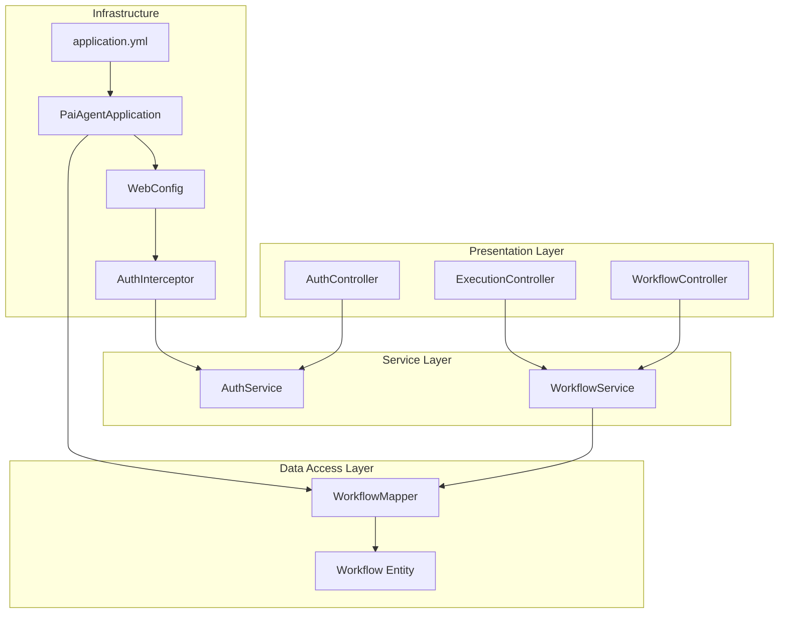
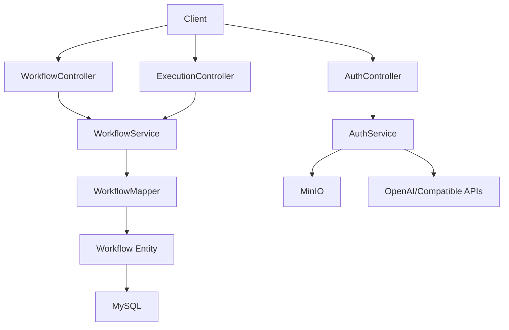
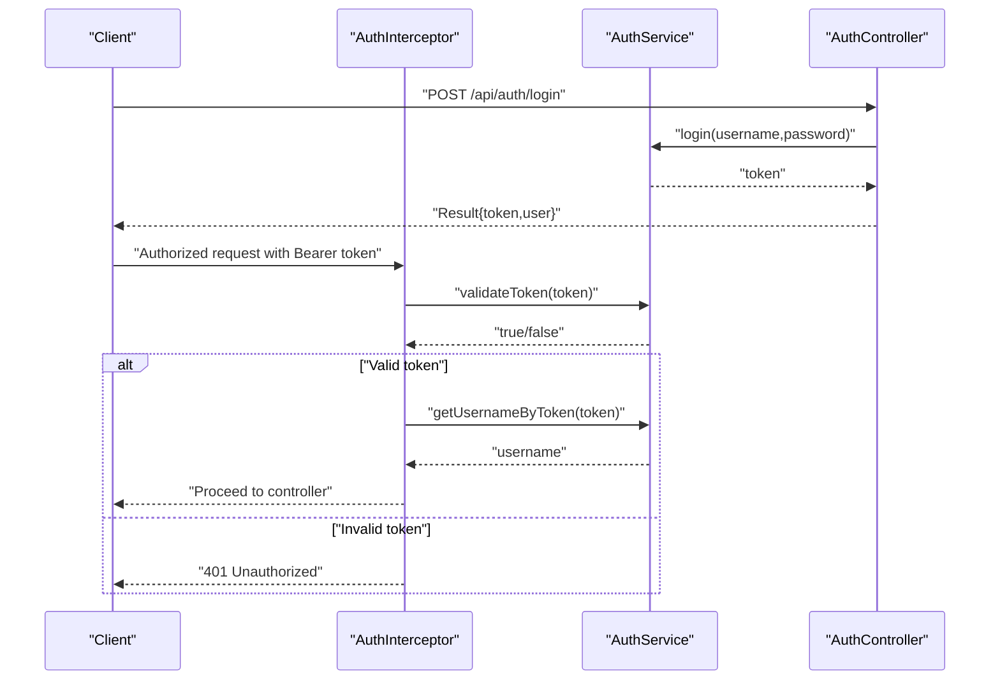
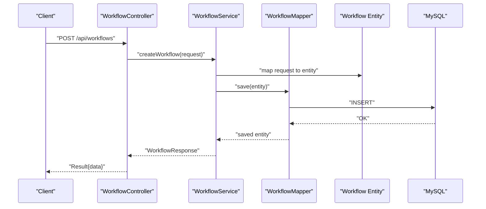
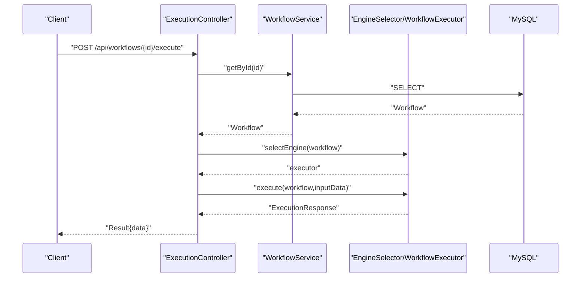
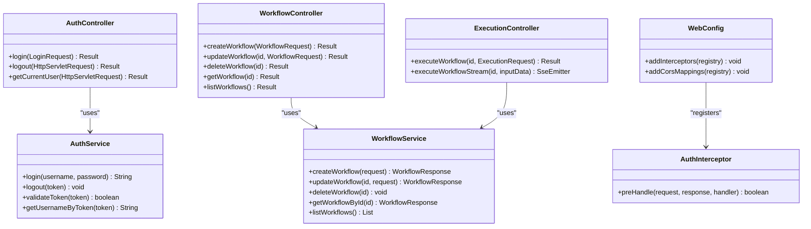
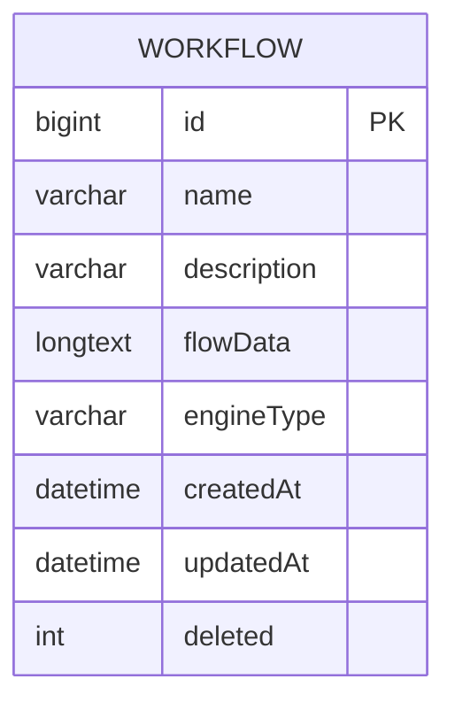
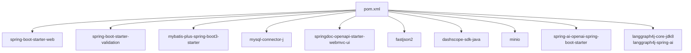

# Backend Application

<cite>
**Referenced Files in This Document**
- [PaiAgentApplication.java](file://backend/src/main/java/com/paiagent/PaiAgentApplication.java)
- [application.yml](file://backend/src/main/resources/application.yml)
- [pom.xml](file://backend/pom.xml)
- [README.md](file://backend/README.md)
- [Result.java](file://backend/src/main/java/com/paiagent/common/Result.java)
- [WebConfig.java](file://backend/src/main/java/com/paiagent/config/WebConfig.java)
- [AuthInterceptor.java](file://backend/src/main/java/com/paiagent/interceptor/AuthInterceptor.java)
- [AuthController.java](file://backend/src/main/java/com/paiagent/controller/AuthController.java)
- [WorkflowController.java](file://backend/src/main/java/com/paiagent/controller/WorkflowController.java)
- [ExecutionController.java](file://backend/src/main/java/com/paiagent/controller/ExecutionController.java)
- [AuthService.java](file://backend/src/main/java/com/paiagent/service/AuthService.java)
- [WorkflowService.java](file://backend/src/main/java/com/paiagent/service/WorkflowService.java)
- [WorkflowMapper.java](file://backend/src/main/java/com/paiagent/mapper/WorkflowMapper.java)
- [Workflow.java](file://backend/src/main/java/com/paiagent/entity/Workflow.java)
- [LoginRequest.java](file://backend/src/main/java/com/paiagent/dto/LoginRequest.java)
- [WorkflowRequest.java](file://backend/src/main/java/com/paiagent/dto/WorkflowRequest.java)
</cite>

## Table of Contents
1. [Introduction](#introduction)
2. [Project Structure](#project-structure)
3. [Core Components](#core-components)
4. [Architecture Overview](#architecture-overview)
5. [Detailed Component Analysis](#detailed-component-analysis)
6. [Dependency Analysis](#dependency-analysis)
7. [Performance Considerations](#performance-considerations)
8. [Troubleshooting Guide](#troubleshooting-guide)
9. [Conclusion](#conclusion)
10. [Appendices](#appendices)

## Introduction
This document describes the backend architecture of the AI Agent Workflow Platform built with Spring Boot. It covers the layered architecture (controllers, services, data access), the MVC pattern implementation, dependency injection, CORS and interceptor configuration for authentication, REST API endpoints for workflow management and execution control, configuration management, database integration via MyBatis-Plus, and security implementation. It also outlines error handling strategies, logging patterns, and performance optimization techniques.

## Project Structure
The backend follows a conventional Spring Boot layout with clear separation of concerns:
- Root application class initializes the Spring context and enables MyBatis-Plus mappers.
- Configuration is centralized in application YAML.
- Controllers expose REST endpoints under /api.
- Services encapsulate business logic and coordinate with data access.
- Data access uses MyBatis-Plus with annotated mappers and entities.
- Interceptors enforce authentication for protected routes.
- DTOs define request/response contracts.
- Common utilities standardize API responses.

**Diagram sources**
- [PaiAgentApplication.java:1-16](file://backend/src/main/java/com/paiagent/PaiAgentApplication.java#L1-L16)
- [WebConfig.java:1-35](file://backend/src/main/java/com/paiagent/config/WebConfig.java#L1-L35)
- [AuthInterceptor.java:1-46](file://backend/src/main/java/com/paiagent/interceptor/AuthInterceptor.java#L1-L46)
- [AuthController.java:1-62](file://backend/src/main/java/com/paiagent/controller/AuthController.java#L1-L62)
- [WorkflowController.java:1-61](file://backend/src/main/java/com/paiagent/controller/WorkflowController.java#L1-L61)
- [ExecutionController.java:1-109](file://backend/src/main/java/com/paiagent/controller/ExecutionController.java#L1-L109)
- [AuthService.java:1-63](file://backend/src/main/java/com/paiagent/service/AuthService.java#L1-L63)
- [WorkflowService.java:1-95](file://backend/src/main/java/com/paiagent/service/WorkflowService.java#L1-L95)
- [WorkflowMapper.java:1-13](file://backend/src/main/java/com/paiagent/mapper/WorkflowMapper.java#L1-L13)
- [Workflow.java:1-58](file://backend/src/main/java/com/paiagent/entity/Workflow.java#L1-L58)
- [application.yml:1-55](file://backend/src/main/resources/application.yml#L1-L55)

**Section sources**
- [PaiAgentApplication.java:1-16](file://backend/src/main/java/com/paiagent/PaiAgentApplication.java#L1-L16)
- [application.yml:1-55](file://backend/src/main/resources/application.yml#L1-L55)
- [pom.xml:1-163](file://backend/pom.xml#L1-L163)
- [README.md:1-75](file://backend/README.md#L1-L75)

## Core Components
- Unified response envelope: Standardized HTTP responses with code, message, and data.
- Authentication service: In-memory token store with basic credentials for demo purposes.
- Web MVC configuration: CORS setup and interceptor registration for authentication.
- Interceptor: Validates Authorization header/token and sets username attribute.
- Controllers:
  - AuthController: Login, logout, current user.
  - WorkflowController: CRUD for workflows.
  - ExecutionController: Execute workflow synchronously and via Server-Sent Events.
- Services:
  - AuthService: Token lifecycle and validation.
  - WorkflowService: CRUD operations leveraging MyBatis-Plus service implementation.
- Data access:
  - WorkflowMapper: MyBatis-Plus mapper interface.
  - Workflow entity: MyBatis-Plus annotations for table mapping and auto-fill.

**Section sources**
- [Result.java:1-79](file://backend/src/main/java/com/paiagent/common/Result.java#L1-L79)
- [AuthService.java:1-63](file://backend/src/main/java/com/paiagent/service/AuthService.java#L1-L63)
- [WebConfig.java:1-35](file://backend/src/main/java/com/paiagent/config/WebConfig.java#L1-L35)
- [AuthInterceptor.java:1-46](file://backend/src/main/java/com/paiagent/interceptor/AuthInterceptor.java#L1-L46)
- [AuthController.java:1-62](file://backend/src/main/java/com/paiagent/controller/AuthController.java#L1-L62)
- [WorkflowController.java:1-61](file://backend/src/main/java/com/paiagent/controller/WorkflowController.java#L1-L61)
- [ExecutionController.java:1-109](file://backend/src/main/java/com/paiagent/controller/ExecutionController.java#L1-L109)
- [WorkflowService.java:1-95](file://backend/src/main/java/com/paiagent/service/WorkflowService.java#L1-L95)
- [WorkflowMapper.java:1-13](file://backend/src/main/java/com/paiagent/mapper/WorkflowMapper.java#L1-L13)
- [Workflow.java:1-58](file://backend/src/main/java/com/paiagent/entity/Workflow.java#L1-L58)

## Architecture Overview
The backend implements a layered architecture aligned with Spring Boot conventions:
- Presentation layer: REST controllers handle HTTP requests and responses.
- Service layer: Business logic orchestration, validation, and coordination.
- Data access layer: MyBatis-Plus provides ORM capabilities with automatic CRUD support.
- Infrastructure: Configuration for web MVC, interceptors, and external integrations.

**Diagram sources**
- [AuthController.java:1-62](file://backend/src/main/java/com/paiagent/controller/AuthController.java#L1-L62)
- [WorkflowController.java:1-61](file://backend/src/main/java/com/paiagent/controller/WorkflowController.java#L1-L61)
- [ExecutionController.java:1-109](file://backend/src/main/java/com/paiagent/controller/ExecutionController.java#L1-L109)
- [AuthService.java:1-63](file://backend/src/main/java/com/paiagent/service/AuthService.java#L1-L63)
- [WorkflowService.java:1-95](file://backend/src/main/java/com/paiagent/service/WorkflowService.java#L1-L95)
- [WorkflowMapper.java:1-13](file://backend/src/main/java/com/paiagent/mapper/WorkflowMapper.java#L1-L13)
- [Workflow.java:1-58](file://backend/src/main/java/com/paiagent/entity/Workflow.java#L1-L58)
- [application.yml:49-55](file://backend/src/main/resources/application.yml#L49-L55)
- [application.yml:15-20](file://backend/src/main/resources/application.yml#L15-L20)

## Detailed Component Analysis

### Authentication Flow
The authentication flow integrates a custom interceptor with the authentication service to validate tokens and attach user context to requests.

**Diagram sources**
- [AuthInterceptor.java:19-45](file://backend/src/main/java/com/paiagent/interceptor/AuthInterceptor.java#L19-L45)
- [AuthService.java:33-61](file://backend/src/main/java/com/paiagent/service/AuthService.java#L33-L61)
- [AuthController.java:25-35](file://backend/src/main/java/com/paiagent/controller/AuthController.java#L25-L35)

**Section sources**
- [AuthInterceptor.java:1-46](file://backend/src/main/java/com/paiagent/interceptor/AuthInterceptor.java#L1-L46)
- [AuthService.java:1-63](file://backend/src/main/java/com/paiagent/service/AuthService.java#L1-L63)
- [AuthController.java:1-62](file://backend/src/main/java/com/paiagent/controller/AuthController.java#L1-L62)

### Workflow Management Endpoints
Controllers expose endpoints for creating, updating, deleting, retrieving, and listing workflows.

**Diagram sources**
- [WorkflowController.java:26-31](file://backend/src/main/java/com/paiagent/controller/WorkflowController.java#L26-L31)
- [WorkflowService.java:24-34](file://backend/src/main/java/com/paiagent/service/WorkflowService.java#L24-L34)
- [WorkflowMapper.java:10-12](file://backend/src/main/java/com/paiagent/mapper/WorkflowMapper.java#L10-L12)
- [Workflow.java:10-58](file://backend/src/main/java/com/paiagent/entity/Workflow.java#L10-L58)

**Section sources**
- [WorkflowController.java:1-61](file://backend/src/main/java/com/paiagent/controller/WorkflowController.java#L1-L61)
- [WorkflowService.java:1-95](file://backend/src/main/java/com/paiagent/service/WorkflowService.java#L1-L95)
- [WorkflowMapper.java:1-13](file://backend/src/main/java/com/paiagent/mapper/WorkflowMapper.java#L1-L13)
- [Workflow.java:1-58](file://backend/src/main/java/com/paiagent/entity/Workflow.java#L1-L58)

### Execution Control Endpoints
Execution supports synchronous execution and streaming via Server-Sent Events with progress callbacks.

**Diagram sources**
- [ExecutionController.java:40-55](file://backend/src/main/java/com/paiagent/controller/ExecutionController.java#L40-L55)
- [WorkflowService.java:65-71](file://backend/src/main/java/com/paiagent/service/WorkflowService.java#L65-L71)

**Section sources**
- [ExecutionController.java:1-109](file://backend/src/main/java/com/paiagent/controller/ExecutionController.java#L1-L109)
- [WorkflowService.java:1-95](file://backend/src/main/java/com/paiagent/service/WorkflowService.java#L1-L95)

### MVC Pattern and Dependency Injection
- Controllers are Spring-managed beans injected with services.
- Services are annotated and leverage constructor/field injection via @Autowired.
- Configuration classes register interceptors and enable CORS.
- Application class scans for mappers and bootstraps the context.

**Diagram sources**
- [AuthController.java:17-62](file://backend/src/main/java/com/paiagent/controller/AuthController.java#L17-L62)
- [WorkflowController.java:18-61](file://backend/src/main/java/com/paiagent/controller/WorkflowController.java#L18-L61)
- [ExecutionController.java:25-109](file://backend/src/main/java/com/paiagent/controller/ExecutionController.java#L25-L109)
- [AuthService.java:12-63](file://backend/src/main/java/com/paiagent/service/AuthService.java#L12-L63)
- [WorkflowService.java:18-95](file://backend/src/main/java/com/paiagent/service/WorkflowService.java#L18-L95)
- [WebConfig.java:13-35](file://backend/src/main/java/com/paiagent/config/WebConfig.java#L13-L35)
- [AuthInterceptor.java:13-46](file://backend/src/main/java/com/paiagent/interceptor/AuthInterceptor.java#L13-L46)

**Section sources**
- [AuthController.java:1-62](file://backend/src/main/java/com/paiagent/controller/AuthController.java#L1-L62)
- [WorkflowController.java:1-61](file://backend/src/main/java/com/paiagent/controller/WorkflowController.java#L1-L61)
- [ExecutionController.java:1-109](file://backend/src/main/java/com/paiagent/controller/ExecutionController.java#L1-L109)
- [AuthService.java:1-63](file://backend/src/main/java/com/paiagent/service/AuthService.java#L1-L63)
- [WorkflowService.java:1-95](file://backend/src/main/java/com/paiagent/service/WorkflowService.java#L1-L95)
- [WebConfig.java:1-35](file://backend/src/main/java/com/paiagent/config/WebConfig.java#L1-L35)
- [AuthInterceptor.java:1-46](file://backend/src/main/java/com/paiagent/interceptor/AuthInterceptor.java#L1-L46)

### Data Model and Persistence
The workflow entity maps to the workflow table with auto-increment ID, timestamps, and logical deletion.

**Diagram sources**
- [Workflow.java:10-58](file://backend/src/main/java/com/paiagent/entity/Workflow.java#L10-L58)

**Section sources**
- [Workflow.java:1-58](file://backend/src/main/java/com/paiagent/entity/Workflow.java#L1-L58)
- [WorkflowMapper.java:1-13](file://backend/src/main/java/com/paiagent/mapper/WorkflowMapper.java#L1-L13)
- [application.yml:21-35](file://backend/src/main/resources/application.yml#L21-L35)

### Request/Response Contracts
- LoginRequest: Validates non-blank username and password.
- WorkflowRequest: Validates non-blank name and flowData; optional description and engineType.
- Result: Standardized response envelope with constants for success, error, and unauthorized.

**Section sources**
- [LoginRequest.java:1-18](file://backend/src/main/java/com/paiagent/dto/LoginRequest.java#L1-L18)
- [WorkflowRequest.java:1-22](file://backend/src/main/java/com/paiagent/dto/WorkflowRequest.java#L1-L22)
- [Result.java:1-79](file://backend/src/main/java/com/paiagent/common/Result.java#L1-L79)

## Dependency Analysis
External libraries and their roles:
- Spring Boot starters for web and validation.
- MyBatis-Plus for ORM and automatic CRUD.
- MySQL connector for database connectivity.
- SpringDoc OpenAPI for API documentation.
- FastJSON2 for JSON processing.
- DashScope SDK and MinIO client for third-party integrations.
- Spring AI OpenAI starter for LLM integrations.
- LangGraph4j for workflow graph execution.

**Diagram sources**
- [pom.xml:60-131](file://backend/pom.xml#L60-L131)

**Section sources**
- [pom.xml:1-163](file://backend/pom.xml#L1-L163)

## Performance Considerations
- Asynchronous execution: SSE streaming avoids blocking threads during long-running executions.
- Concurrency: In-memory token store uses concurrent hash map for thread-safe operations.
- Logging: SLF4J logging is used in controllers for error reporting and diagnostics.
- Database tuning: MyBatis-Plus configuration includes underscore-to-camel mapping and explicit mapper locations for predictable performance.
- Resource limits: SSE emitter timeouts and completion hooks prevent resource leaks.

[No sources needed since this section provides general guidance]

## Troubleshooting Guide
Common issues and resolutions:
- Authentication failures: Verify Authorization header format and token validity. Check interceptor logs for unauthorized responses.
- Database connectivity: Confirm JDBC URL, credentials, and MySQL availability. Validate MyBatis-Plus mapper locations and type aliases.
- CORS errors: Ensure frontend origin matches configured allowed origins and credentials are enabled.
- SSE connection problems: Confirm emitter timeout settings and network stability; check for exceptions in execution callbacks.
- API documentation: Access Swagger UI at the configured path after startup.

**Section sources**
- [AuthInterceptor.java:19-45](file://backend/src/main/java/com/paiagent/interceptor/AuthInterceptor.java#L19-L45)
- [application.yml:1-55](file://backend/src/main/resources/application.yml#L1-L55)
- [ExecutionController.java:68-105](file://backend/src/main/java/com/paiagent/controller/ExecutionController.java#L68-L105)

## Conclusion
The backend implements a clean, layered Spring Boot architecture with clear separation between presentation, service, and persistence concerns. It leverages MyBatis-Plus for efficient data access, provides robust authentication via interceptors, and exposes REST endpoints for workflow management and execution control. The modular design, standardized response envelopes, and documented configuration facilitate maintainability and extensibility.

## Appendices
- Default credentials for testing are provided in the project documentation.
- API documentation is exposed via SpringDoc OpenAPI.

**Section sources**
- [README.md:49-53](file://backend/README.md#L49-L53)
- [README.md:45-48](file://backend/README.md#L45-L48)