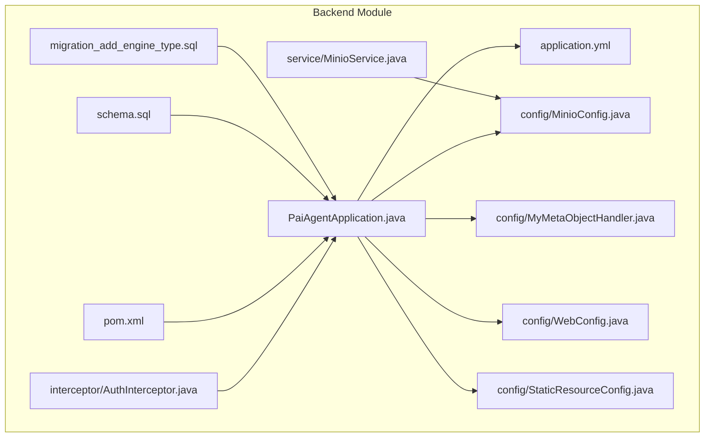
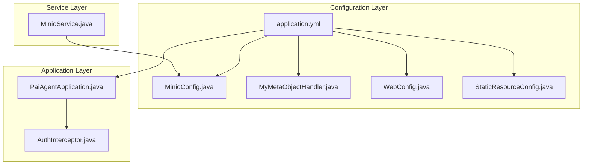
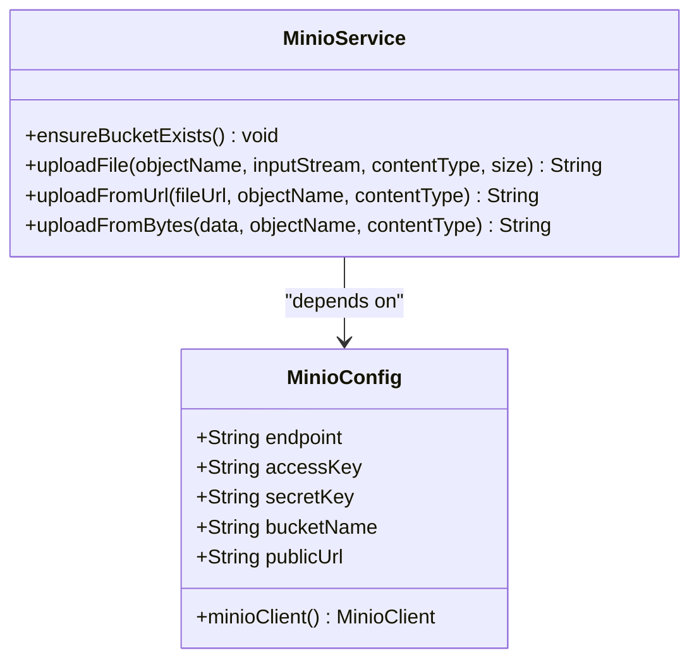
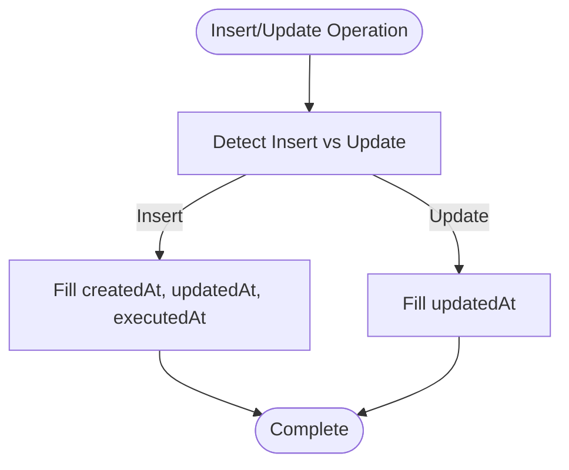
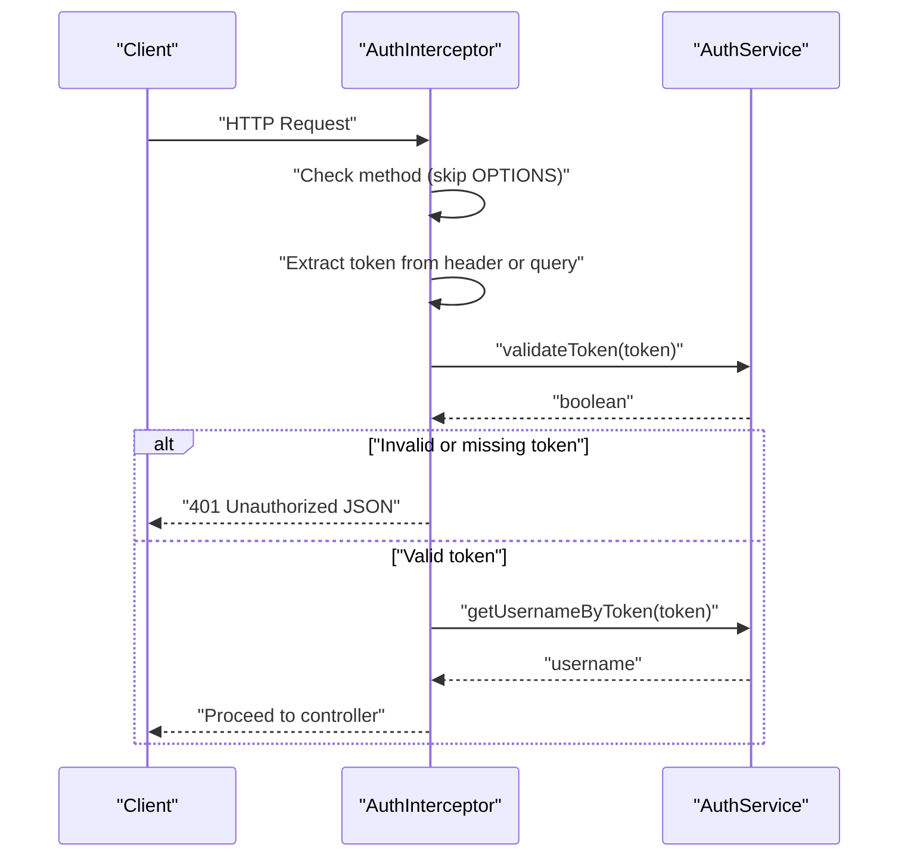
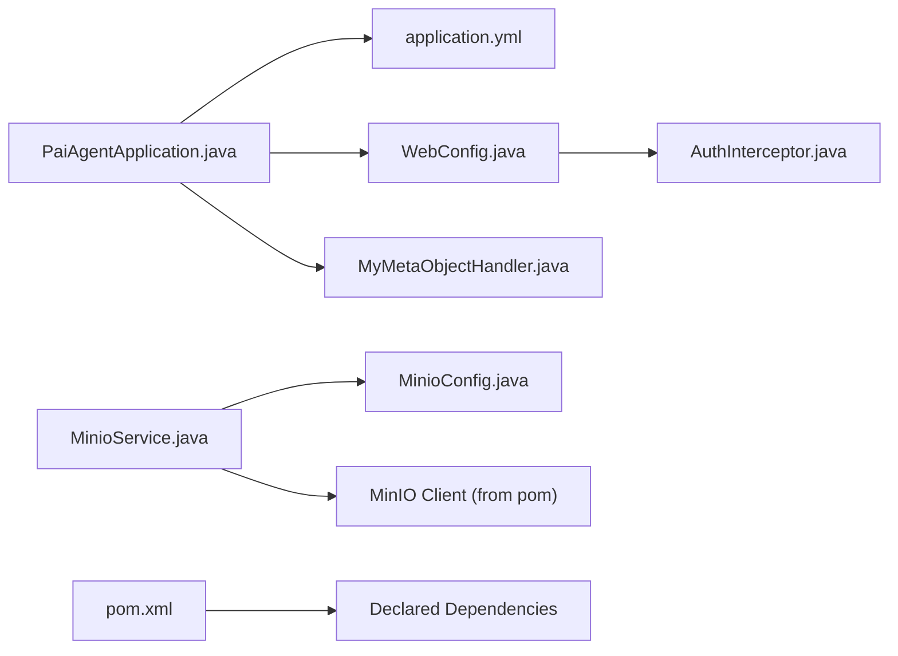

# Configuration Management

<cite>
**Referenced Files in This Document**
- [PaiAgentApplication.java](file://backend/src/main/java/com/paiagent/PaiAgentApplication.java)
- [application.yml](file://backend/src/main/resources/application.yml)
- [MinioConfig.java](file://backend/src/main/java/com/paiagent/config/MinioConfig.java)
- [MyMetaObjectHandler.java](file://backend/src/main/java/com/paiagent/config/MyMetaObjectHandler.java)
- [WebConfig.java](file://backend/src/main/java/com/paiagent/config/WebConfig.java)
- [StaticResourceConfig.java](file://backend/src/main/java/com/paiagent/config/StaticResourceConfig.java)
- [MinioService.java](file://backend/src/main/java/com/paiagent/service/MinioService.java)
- [AuthInterceptor.java](file://backend/src/main/java/com/paiagent/interceptor/AuthInterceptor.java)
- [pom.xml](file://backend/pom.xml)
- [schema.sql](file://backend/src/main/resources/schema.sql)
- [migration_add_engine_type.sql](file://backend/src/main/resources/migration_add_engine_type.sql)
</cite>

## Table of Contents
1. [Introduction](#introduction)
2. [Project Structure](#project-structure)
3. [Core Components](#core-components)
4. [Architecture Overview](#architecture-overview)
5. [Detailed Component Analysis](#detailed-component-analysis)
6. [Dependency Analysis](#dependency-analysis)
7. [Performance Considerations](#performance-considerations)
8. [Troubleshooting Guide](#troubleshooting-guide)
9. [Conclusion](#conclusion)

## Introduction
This document explains the application configuration and management system for the backend service. It covers Spring Boot configuration via application.yml, environment-specific configuration patterns, externalized configuration (including environment variable substitution), MinIO object storage configuration and integration, MyBatis-Plus meta object handler for automatic field filling, custom configuration beans, property binding, configuration validation, logging configuration, database connection settings, and third-party service integrations such as Spring AI OpenAI and OpenAPI/Swagger.

## Project Structure
The backend module follows a standard Spring Boot layout with Java source under main/java and resources under main/resources. Configuration is primarily centralized in application.yml, while custom configuration beans reside in the config package. Third-party integrations are declared in the Maven build file.

**Diagram sources**
- [PaiAgentApplication.java:1-16](file://backend/src/main/java/com/paiagent/PaiAgentApplication.java#L1-L16)
- [application.yml:1-55](file://backend/src/main/resources/application.yml#L1-L55)
- [MinioConfig.java:1-28](file://backend/src/main/java/com/paiagent/config/MinioConfig.java#L1-L28)
- [MyMetaObjectHandler.java:1-27](file://backend/src/main/java/com/paiagent/config/MyMetaObjectHandler.java#L1-L27)
- [WebConfig.java:1-35](file://backend/src/main/java/com/paiagent/config/WebConfig.java#L1-L35)
- [StaticResourceConfig.java:1-25](file://backend/src/main/java/com/paiagent/config/StaticResourceConfig.java#L1-L25)
- [MinioService.java:1-102](file://backend/src/main/java/com/paiagent/service/MinioService.java#L1-L102)
- [AuthInterceptor.java:1-46](file://backend/src/main/java/com/paiagent/interceptor/AuthInterceptor.java#L1-L46)
- [pom.xml:1-163](file://backend/pom.xml#L1-L163)
- [schema.sql:1-84](file://backend/src/main/resources/schema.sql#L1-L84)
- [migration_add_engine_type.sql:1-17](file://backend/src/main/resources/migration_add_engine_type.sql#L1-L17)

**Section sources**
- [PaiAgentApplication.java:1-16](file://backend/src/main/java/com/paiagent/PaiAgentApplication.java#L1-L16)
- [application.yml:1-55](file://backend/src/main/resources/application.yml#L1-L55)
- [pom.xml:1-163](file://backend/pom.xml#L1-L163)

## Core Components
- Application bootstrap and mapper scanning are configured in the main application class.
- Centralized configuration is defined in application.yml, including server, Spring datasource, Jackson, SpringDoc OpenAPI, MyBatis-Plus, and MinIO settings.
- Property binding is implemented via a dedicated configuration bean for MinIO.
- Automatic field filling for entity creation/update is handled by a MyBatis-Plus meta object handler.
- Web configuration includes CORS and interceptors for authentication.
- Static resource serving is configured for audio output files.
- MinIO service encapsulates bucket existence checks, uploads from streams, URLs, and byte arrays.
- Maven coordinates define third-party dependencies including Spring Boot starters, MyBatis-Plus, MySQL connector, SpringDoc OpenAPI, MinIO client, Spring AI OpenAI starter, and LangGraph4j integrations.

**Section sources**
- [PaiAgentApplication.java:7-9](file://backend/src/main/java/com/paiagent/PaiAgentApplication.java#L7-L9)
- [application.yml:1-55](file://backend/src/main/resources/application.yml#L1-L55)
- [MinioConfig.java:9-27](file://backend/src/main/java/com/paiagent/config/MinioConfig.java#L9-L27)
- [MyMetaObjectHandler.java:9-26](file://backend/src/main/java/com/paiagent/config/MyMetaObjectHandler.java#L9-L26)
- [WebConfig.java:10-35](file://backend/src/main/java/com/paiagent/config/WebConfig.java#L10-L35)
- [StaticResourceConfig.java:9-25](file://backend/src/main/java/com/paiagent/config/StaticResourceConfig.java#L9-L25)
- [MinioService.java:16-102](file://backend/src/main/java/com/paiagent/service/MinioService.java#L16-L102)
- [pom.xml:60-131](file://backend/pom.xml#L60-L131)

## Architecture Overview
The configuration architecture integrates Spring Boot’s externalized configuration with custom beans and service components. Environment variables are used for sensitive values like API keys, while YAML defines defaults and structural settings. MyBatis-Plus handles persistence with automatic timestamp filling. MinIO integration is encapsulated behind a service that depends on a configuration bean bound from YAML.

**Diagram sources**
- [application.yml:1-55](file://backend/src/main/resources/application.yml#L1-L55)
- [MinioConfig.java:9-27](file://backend/src/main/java/com/paiagent/config/MinioConfig.java#L9-L27)
- [MyMetaObjectHandler.java:9-26](file://backend/src/main/java/com/paiagent/config/MyMetaObjectHandler.java#L9-L26)
- [WebConfig.java:10-35](file://backend/src/main/java/com/paiagent/config/WebConfig.java#L10-L35)
- [StaticResourceConfig.java:9-25](file://backend/src/main/java/com/paiagent/config/StaticResourceConfig.java#L9-L25)
- [PaiAgentApplication.java:7-9](file://backend/src/main/java/com/paiagent/PaiAgentApplication.java#L7-L9)
- [AuthInterceptor.java:10-46](file://backend/src/main/java/com/paiagent/interceptor/AuthInterceptor.java#L10-L46)
- [MinioService.java:16-24](file://backend/src/main/java/com/paiagent/service/MinioService.java#L16-L24)

## Detailed Component Analysis

### Spring Boot Configuration and Externalization
- Server and application metadata are defined at the top level.
- Database connection settings include driver, URL, username, and password.
- Jackson settings configure timezone and date format globally.
- Spring AI OpenAI settings include a placeholder API key with environment variable substitution and a base URL.
- MyBatis-Plus configuration includes mapper locations, type aliases package, underscore-to-camel mapping, logging, and global DB config with logic delete fields.
- SpringDoc OpenAPI enables API docs and Swagger UI with custom paths and info.
- MinIO configuration defines endpoint, credentials, bucket name, and public URL.

Environment variable substitution:
- The OpenAI API key uses environment variable substitution with a fallback value embedded in the YAML.

Property binding:
- The MinIO configuration bean binds to the “minio” namespace and exposes a MinIO client bean.

Logging configuration:
- MyBatis logging is enabled via a standard output implementation in MyBatis-Plus configuration.

Validation and environment-specific configuration:
- Validation starter is included in dependencies, enabling Bean Validation support.
- Environment-specific overrides can be applied via Spring profiles and external property sources.

**Section sources**
- [application.yml:1-55](file://backend/src/main/resources/application.yml#L1-L55)
- [MinioConfig.java:9-27](file://backend/src/main/java/com/paiagent/config/MinioConfig.java#L9-L27)
- [pom.xml:60-131](file://backend/pom.xml#L60-L131)

### MinIO Configuration and Integration
- The MinIO configuration bean binds to the “minio” prefix and constructs a MinIO client using endpoint and credentials.
- The MinIO service ensures the bucket exists, uploads files from streams, URLs, and byte arrays, and returns a public URL composed from the configured public URL and bucket name.

**Diagram sources**
- [MinioConfig.java:12-27](file://backend/src/main/java/com/paiagent/config/MinioConfig.java#L12-L27)
- [MinioService.java:18-102](file://backend/src/main/java/com/paiagent/service/MinioService.java#L18-L102)

**Section sources**
- [MinioConfig.java:9-27](file://backend/src/main/java/com/paiagent/config/MinioConfig.java#L9-L27)
- [MinioService.java:16-102](file://backend/src/main/java/com/paiagent/service/MinioService.java#L16-L102)
- [application.yml:49-55](file://backend/src/main/resources/application.yml#L49-L55)

### MyBatis-Plus Meta Object Handler
- Implements automatic insertion and update of timestamps for createdAt, updatedAt, and executedAt fields.
- Uses strict fill semantics to ensure consistent behavior during inserts and updates.

**Diagram sources**
- [MyMetaObjectHandler.java:15-25](file://backend/src/main/java/com/paiagent/config/MyMetaObjectHandler.java#L15-L25)

**Section sources**
- [MyMetaObjectHandler.java:9-26](file://backend/src/main/java/com/paiagent/config/MyMetaObjectHandler.java#L9-L26)

### Web Configuration and Interceptors
- CORS is configured to allow local origins, common HTTP methods, headers, credentials, and a max age.
- An authentication interceptor validates tokens from Authorization header or query parameter, rejects unauthorized requests, and attaches the username to the request.

**Diagram sources**
- [WebConfig.java:19-34](file://backend/src/main/java/com/paiagent/config/WebConfig.java#L19-L34)
- [AuthInterceptor.java:19-45](file://backend/src/main/java/com/paiagent/interceptor/AuthInterceptor.java#L19-L45)

**Section sources**
- [WebConfig.java:10-35](file://backend/src/main/java/com/paiagent/config/WebConfig.java#L10-L35)
- [AuthInterceptor.java:10-46](file://backend/src/main/java/com/paiagent/interceptor/AuthInterceptor.java#L10-L46)

### Static Resource Serving
- Configured to serve audio files from a local directory using a file resource handler.

**Section sources**
- [StaticResourceConfig.java:9-25](file://backend/src/main/java/com/paiagent/config/StaticResourceConfig.java#L9-L25)

### Database and Schema Management
- Database connection settings are defined in YAML.
- SQL scripts initialize the database, tables, and seed initial node definitions.
- A migration script adds the engine_type column to the workflow table for future engine selection.

**Section sources**
- [application.yml:7-11](file://backend/src/main/resources/application.yml#L7-L11)
- [schema.sql:1-84](file://backend/src/main/resources/schema.sql#L1-L84)
- [migration_add_engine_type.sql:1-17](file://backend/src/main/resources/migration_add_engine_type.sql#L1-L17)

### Third-Party Integrations
- Spring AI OpenAI starter is included for OpenAI-compatible providers.
- SpringDoc OpenAPI is included for API documentation.
- LangGraph4j core and Spring AI integration are included for workflow engine capabilities.
- MinIO client is included for object storage operations.

**Section sources**
- [pom.xml:105-124](file://backend/pom.xml#L105-L124)

## Dependency Analysis
The configuration system relies on the following dependency relationships:
- The application class scans mappers and bootstraps the Spring context.
- The MinIO service depends on the MinIO configuration bean and client.
- The web configuration registers interceptors and CORS mappings.
- The MinIO service uses the MinIO client to manage buckets and objects.
- Maven coordinates declare all required dependencies for the platform.

**Diagram sources**
- [PaiAgentApplication.java:7-9](file://backend/src/main/java/com/paiagent/PaiAgentApplication.java#L7-L9)
- [application.yml:1-55](file://backend/src/main/resources/application.yml#L1-L55)
- [WebConfig.java:13-35](file://backend/src/main/java/com/paiagent/config/WebConfig.java#L13-L35)
- [MyMetaObjectHandler.java:9-26](file://backend/src/main/java/com/paiagent/config/MyMetaObjectHandler.java#L9-L26)
- [MinioService.java:16-24](file://backend/src/main/java/com/paiagent/service/MinioService.java#L16-L24)
- [MinioConfig.java:9-27](file://backend/src/main/java/com/paiagent/config/MinioConfig.java#L9-L27)
- [AuthInterceptor.java:10-46](file://backend/src/main/java/com/paiagent/interceptor/AuthInterceptor.java#L10-L46)
- [pom.xml:60-131](file://backend/pom.xml#L60-L131)

**Section sources**
- [pom.xml:60-131](file://backend/pom.xml#L60-L131)
- [application.yml:1-55](file://backend/src/main/resources/application.yml#L1-L55)

## Performance Considerations
- Centralize configuration in YAML to minimize runtime property resolution overhead.
- Use environment variable substitution for secrets to avoid embedding sensitive data in code.
- Keep MyBatis logging enabled only in development or debug environments to reduce I/O overhead.
- Ensure bucket existence checks are performed once per deployment lifecycle rather than on every write operation.
- Configure CORS and interceptors to limit unnecessary processing for preflight and unauthenticated requests.

## Troubleshooting Guide
- OpenAI API key not set: If the environment variable is not present, the placeholder value will be used. Set the OPENAI_API_KEY environment variable to enable OpenAI integration.
- Database connectivity: Verify JDBC URL, username, and password match the target database configuration.
- MinIO connectivity: Confirm endpoint, accessKey, secretKey, and bucketName are correct and the bucket exists.
- CORS issues: Adjust allowed origin patterns and methods in the web configuration if cross-origin requests fail.
- Authentication failures: Ensure tokens are provided in the Authorization header or query parameter and that the token validation service is reachable.
- MyBatis logging: If logs are too verbose, disable the logging implementation in MyBatis-Plus configuration.

**Section sources**
- [application.yml:15-20](file://backend/src/main/resources/application.yml#L15-L20)
- [application.yml:7-11](file://backend/src/main/resources/application.yml#L7-L11)
- [application.yml:49-55](file://backend/src/main/resources/application.yml#L49-L55)
- [WebConfig.java:19-27](file://backend/src/main/java/com/paiagent/config/WebConfig.java#L19-L27)
- [AuthInterceptor.java:19-45](file://backend/src/main/java/com/paiagent/interceptor/AuthInterceptor.java#L19-L45)
- [MyMetaObjectHandler.java:15-25](file://backend/src/main/java/com/paiagent/config/MyMetaObjectHandler.java#L15-L25)

## Conclusion
The configuration system leverages Spring Boot’s externalized configuration and property binding to centralize settings, while custom beans encapsulate MinIO integration and automatic field filling. Environment variable substitution secures sensitive values, and third-party integrations are cleanly declared in the build configuration. Together, these components provide a robust foundation for application configuration and management.