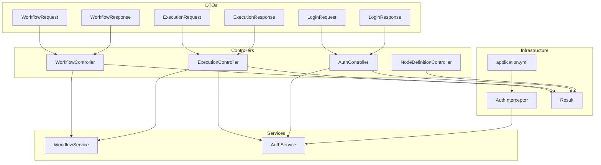
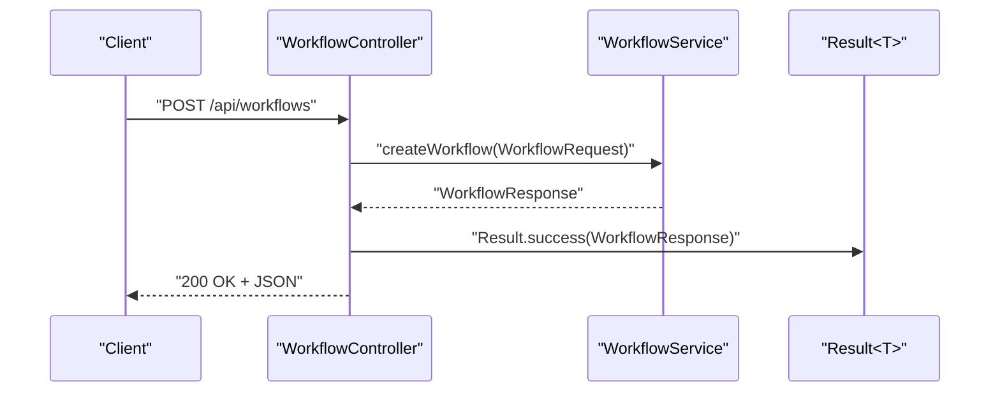
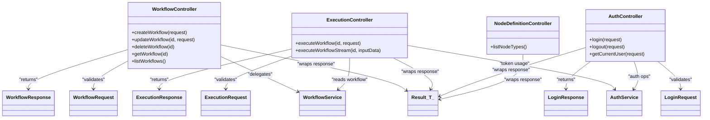

# Controller Layer

<cite>
**Referenced Files in This Document**
- [WorkflowController.java](file://backend/src/main/java/com/paiagent/controller/WorkflowController.java)
- [ExecutionController.java](file://backend/src/main/java/com/paiagent/controller/ExecutionController.java)
- [AuthController.java](file://backend/src/main/java/com/paiagent/controller/AuthController.java)
- [NodeDefinitionController.java](file://backend/src/main/java/com/paiagent/controller/NodeDefinitionController.java)
- [WorkflowRequest.java](file://backend/src/main/java/com/paiagent/dto/WorkflowRequest.java)
- [WorkflowResponse.java](file://backend/src/main/java/com/paiagent/dto/WorkflowResponse.java)
- [ExecutionRequest.java](file://backend/src/main/java/com/paiagent/dto/ExecutionRequest.java)
- [ExecutionResponse.java](file://backend/src/main/java/com/paiagent/dto/ExecutionResponse.java)
- [LoginRequest.java](file://backend/src/main/java/com/paiagent/dto/LoginRequest.java)
- [LoginResponse.java](file://backend/src/main/java/com/paiagent/dto/LoginResponse.java)
- [Result.java](file://backend/src/main/java/com/paiagent/common/Result.java)
- [WorkflowService.java](file://backend/src/main/java/com/paiagent/service/WorkflowService.java)
- [AuthService.java](file://backend/src/main/java/com/paiagent/service/AuthService.java)
- [AuthInterceptor.java](file://backend/src/main/java/com/paiagent/interceptor/AuthInterceptor.java)
- [application.yml](file://backend/src/main/resources/application.yml)
</cite>

## Table of Contents
1. [Introduction](#introduction)
2. [Project Structure](#project-structure)
3. [Core Components](#core-components)
4. [Architecture Overview](#architecture-overview)
5. [Detailed Component Analysis](#detailed-component-analysis)
6. [Dependency Analysis](#dependency-analysis)
7. [Performance Considerations](#performance-considerations)
8. [Troubleshooting Guide](#troubleshooting-guide)
9. [Conclusion](#conclusion)

## Introduction
This document describes the REST API controller layer implementing the Model-View-Controller (MVC) pattern. It covers four primary controllers:
- WorkflowController: CRUD operations for workflows
- ExecutionController: workflow execution and streaming execution via Server-Sent Events (SSE)
- AuthController: authentication endpoints for login/logout/current user
- NodeDefinitionController: node type enumeration for node configuration management

It explains request mapping annotations, parameter binding, response handling, exception management, HTTP status codes, error response formats, API versioning strategies, authentication decorators, request validation, and security considerations.

## Project Structure
The controller layer resides under backend/src/main/java/com/paiagent/controller and is supported by DTOs, services, interceptors, and a unified response wrapper.

**Diagram sources**
- [WorkflowController.java:1-61](file://backend/src/main/java/com/paiagent/controller/WorkflowController.java#L1-L61)
- [ExecutionController.java:1-109](file://backend/src/main/java/com/paiagent/controller/ExecutionController.java#L1-L109)
- [AuthController.java:1-62](file://backend/src/main/java/com/paiagent/controller/AuthController.java#L1-L62)
- [NodeDefinitionController.java:1-33](file://backend/src/main/java/com/paiagent/controller/NodeDefinitionController.java#L1-L33)
- [WorkflowRequest.java:1-22](file://backend/src/main/java/com/paiagent/dto/WorkflowRequest.java#L1-L22)
- [WorkflowResponse.java:1-20](file://backend/src/main/java/com/paiagent/dto/WorkflowResponse.java#L1-L20)
- [ExecutionRequest.java:1-15](file://backend/src/main/java/com/paiagent/dto/ExecutionRequest.java#L1-L15)
- [ExecutionResponse.java:1-29](file://backend/src/main/java/com/paiagent/dto/ExecutionResponse.java#L1-L29)
- [LoginRequest.java:1-18](file://backend/src/main/java/com/paiagent/dto/LoginRequest.java#L1-L18)
- [LoginResponse.java:1-29](file://backend/src/main/java/com/paiagent/dto/LoginResponse.java#L1-L29)
- [Result.java:1-79](file://backend/src/main/java/com/paiagent/common/Result.java#L1-L79)
- [WorkflowService.java:1-95](file://backend/src/main/java/com/paiagent/service/WorkflowService.java#L1-L95)
- [AuthService.java:1-63](file://backend/src/main/java/com/paiagent/service/AuthService.java#L1-L63)
- [AuthInterceptor.java:1-46](file://backend/src/main/java/com/paiagent/interceptor/AuthInterceptor.java#L1-L46)
- [application.yml:1-55](file://backend/src/main/resources/application.yml#L1-L55)

**Section sources**
- [WorkflowController.java:1-61](file://backend/src/main/java/com/paiagent/controller/WorkflowController.java#L1-L61)
- [ExecutionController.java:1-109](file://backend/src/main/java/com/paiagent/controller/ExecutionController.java#L1-L109)
- [AuthController.java:1-62](file://backend/src/main/java/com/paiagent/controller/AuthController.java#L1-L62)
- [NodeDefinitionController.java:1-33](file://backend/src/main/java/com/paiagent/controller/NodeDefinitionController.java#L1-L33)
- [application.yml:36-47](file://backend/src/main/resources/application.yml#L36-L47)

## Core Components
- Unified response envelope: Result<T> standardizes success, error, and unauthorized responses with consistent fields and status codes.
- Validation: Controllers use @Valid with Jakarta Bean Validation constraints on DTOs to enforce request shape and content.
- Interceptor-driven authentication: AuthInterceptor enforces bearer token validation for protected endpoints.
- Service delegation: Controllers delegate business logic to service classes, keeping controllers thin and focused on HTTP concerns.

HTTP status code semantics used:
- 200 OK: Successful operations returning data or empty body
- 401 Unauthorized: Missing or invalid token
- 500 Internal Server Error: Unexpected failures during processing

Error response format:
- JSON with fields code, message, and optional data (data is omitted for error/unauthorized responses)

API versioning:
- OpenAPI/Swagger metadata indicates version 1.0.0; no explicit URL-based versioning is present in controller mappings.

**Section sources**
- [Result.java:26-77](file://backend/src/main/java/com/paiagent/common/Result.java#L26-L77)
- [application.yml:44-47](file://backend/src/main/resources/application.yml#L44-L47)

## Architecture Overview
The controller layer follows a layered MVC architecture:
- Controllers handle HTTP requests and responses
- Services encapsulate business logic
- DTOs define request/response contracts
- Interceptor validates tokens centrally
- Result<T> ensures consistent response envelopes

**Diagram sources**
- [WorkflowController.java:26-31](file://backend/src/main/java/com/paiagent/controller/WorkflowController.java#L26-L31)
- [WorkflowService.java:24-34](file://backend/src/main/java/com/paiagent/service/WorkflowService.java#L24-L34)
- [Result.java:44-57](file://backend/src/main/java/com/paiagent/common/Result.java#L44-L57)

## Detailed Component Analysis

### WorkflowController
Responsibilities:
- Create, update, delete, retrieve, and list workflows
- Delegates to WorkflowService for persistence and transformation
- Returns Result<T>-wrapped responses

Endpoints:
- POST /api/workflows
  - Request: WorkflowRequest (validated)
  - Response: WorkflowResponse
  - Status: 200
- PUT /api/workflows/{id}
  - Path variable: id (Long)
  - Request: WorkflowRequest (validated)
  - Response: WorkflowResponse
  - Status: 200
- DELETE /api/workflows/{id}
  - Path variable: id (Long)
  - Response: Void
  - Status: 200
- GET /api/workflows/{id}
  - Path variable: id (Long)
  - Response: WorkflowResponse
  - Status: 200
- GET /api/workflows
  - Response: List<WorkflowResponse>
  - Status: 200

Validation and binding:
- @Valid on @RequestBody binds and validates WorkflowRequest
- @PathVariable binds Long id

Security:
- Protected by AuthInterceptor; requires a valid bearer token

Error handling:
- Throws runtime exceptions for missing workflows in update/getById
- Controller catches and converts to Result.error via service exceptions

Response format:
- Uses Result.success(...) for successful outcomes

**Section sources**
- [WorkflowController.java:26-59](file://backend/src/main/java/com/paiagent/controller/WorkflowController.java#L26-L59)
- [WorkflowRequest.java:10-21](file://backend/src/main/java/com/paiagent/dto/WorkflowRequest.java#L10-L21)
- [WorkflowResponse.java:9-19](file://backend/src/main/java/com/paiagent/dto/WorkflowResponse.java#L9-L19)
- [WorkflowService.java:24-93](file://backend/src/main/java/com/paiagent/service/WorkflowService.java#L24-L93)
- [Result.java:44-57](file://backend/src/main/java/com/paiagent/common/Result.java#L44-L57)

### ExecutionController
Responsibilities:
- Execute workflows synchronously and asynchronously via SSE
- Select appropriate engine via EngineSelector and delegate to WorkflowExecutor
- Manage SSE emitters and send events to clients

Endpoints:
- POST /api/workflows/{id}/execute
  - Path variable: id (Long)
  - Request: ExecutionRequest (validated)
  - Response: ExecutionResponse
  - Status: 200 or 500 on failure
- GET /api/workflows/{id}/execute/stream
  - Path variable: id (Long)
  - Query param: inputData (String)
  - Response: SseEmitter (SSE stream)
  - Status: 200 with text/event-stream

Validation and binding:
- @Valid on @RequestBody binds and validates ExecutionRequest
- @PathVariable binds Long id
- @RequestParam binds inputData

Security:
- Protected by AuthInterceptor; requires a valid bearer token

Error handling:
- Missing workflow returns Result.error
- Exceptions during execution return Result.error or emit ERROR events via SSE
- Emitters clean up on completion, timeout, or error

SSE behavior:
- Emitters stored in-memory with unique keys
- Emits events named by event type; terminates on completion or error

**Section sources**
- [ExecutionController.java:39-108](file://backend/src/main/java/com/paiagent/controller/ExecutionController.java#L39-L108)
- [ExecutionRequest.java:9-14](file://backend/src/main/java/com/paiagent/dto/ExecutionRequest.java#L9-L14)
- [ExecutionResponse.java:9-28](file://backend/src/main/java/com/paiagent/dto/ExecutionResponse.java#L9-L28)
- [AuthInterceptor.java:19-45](file://backend/src/main/java/com/paiagent/interceptor/AuthInterceptor.java#L19-L45)

### AuthController
Responsibilities:
- Authenticate users and issue tokens
- Invalidate tokens on logout
- Retrieve current user based on token

Endpoints:
- POST /api/auth/login
  - Request: LoginRequest (validated)
  - Response: LoginResponse (token + user info)
  - Status: 200 or 400-like semantic via Result.error
- POST /api/auth/logout
  - Extracts Authorization header, strips "Bearer ", invokes AuthService.logout
  - Response: Void
  - Status: 200
- GET /api/auth/current
  - Extracts Authorization header, strips "Bearer ", resolves username
  - Response: LoginResponse.UserInfo
  - Status: 200 or 401

Validation and binding:
- @Valid on @RequestBody binds and validates LoginRequest
- HttpServletRequest used to extract Authorization header

Security:
- AuthInterceptor enforces bearer token validation for protected routes
- Token storage is in-memory (ConcurrentHashMap)

Error handling:
- Invalid credentials return Result.error
- Missing/invalid token returns Result.unauthorized

**Section sources**
- [AuthController.java:25-60](file://backend/src/main/java/com/paiagent/controller/AuthController.java#L25-L60)
- [LoginRequest.java:9-17](file://backend/src/main/java/com/paiagent/dto/LoginRequest.java#L9-L17)
- [LoginResponse.java:11-27](file://backend/src/main/java/com/paiagent/dto/LoginResponse.java#L11-L27)
- [AuthService.java:33-61](file://backend/src/main/java/com/paiagent/service/AuthService.java#L33-L61)
- [AuthInterceptor.java:19-45](file://backend/src/main/java/com/paiagent/interceptor/AuthInterceptor.java#L19-L45)

### NodeDefinitionController
Responsibilities:
- Enumerate available node types for configuration

Endpoints:
- GET /api/node-types
  - Response: List<NodeDefinition>
  - Status: 200

Security:
- Protected by AuthInterceptor; requires a valid bearer token

Notes:
- No request body or path/query parameters
- Delegates to NodeDefinitionService for listing

**Section sources**
- [NodeDefinitionController.java:26-31](file://backend/src/main/java/com/paiagent/controller/NodeDefinitionController.java#L26-L31)

## Dependency Analysis
Controllers depend on:
- Services for business logic
- DTOs for request/response contracts
- Result<T> for uniform responses
- Interceptor for authentication enforcement

**Diagram sources**
- [WorkflowController.java:21-60](file://backend/src/main/java/com/paiagent/controller/WorkflowController.java#L21-L60)
- [ExecutionController.java:29-108](file://backend/src/main/java/com/paiagent/controller/ExecutionController.java#L29-L108)
- [AuthController.java:20-61](file://backend/src/main/java/com/paiagent/controller/AuthController.java#L20-L61)
- [NodeDefinitionController.java:21-32](file://backend/src/main/java/com/paiagent/controller/NodeDefinitionController.java#L21-L32)
- [WorkflowService.java:18-94](file://backend/src/main/java/com/paiagent/service/WorkflowService.java#L18-L94)
- [AuthService.java:12-62](file://backend/src/main/java/com/paiagent/service/AuthService.java#L12-L62)
- [Result.java:8-79](file://backend/src/main/java/com/paiagent/common/Result.java#L8-L79)
- [WorkflowRequest.java:9-21](file://backend/src/main/java/com/paiagent/dto/WorkflowRequest.java#L9-L21)
- [WorkflowResponse.java:9-19](file://backend/src/main/java/com/paiagent/dto/WorkflowResponse.java#L9-L19)
- [ExecutionRequest.java:9-14](file://backend/src/main/java/com/paiagent/dto/ExecutionRequest.java#L9-L14)
- [ExecutionResponse.java:9-28](file://backend/src/main/java/com/paiagent/dto/ExecutionResponse.java#L9-L28)
- [LoginRequest.java:9-17](file://backend/src/main/java/com/paiagent/dto/LoginRequest.java#L9-L17)
- [LoginResponse.java:11-27](file://backend/src/main/java/com/paiagent/dto/LoginResponse.java#L11-L27)

**Section sources**
- [WorkflowController.java:21-60](file://backend/src/main/java/com/paiagent/controller/WorkflowController.java#L21-L60)
- [ExecutionController.java:29-108](file://backend/src/main/java/com/paiagent/controller/ExecutionController.java#L29-L108)
- [AuthController.java:20-61](file://backend/src/main/java/com/paiagent/controller/AuthController.java#L20-L61)
- [NodeDefinitionController.java:21-32](file://backend/src/main/java/com/paiagent/controller/NodeDefinitionController.java#L21-L32)

## Performance Considerations
- SSE scalability: In-memory emitter map can grow; consider backing store and TTL eviction for production workloads.
- Synchronous execution: Long-running workflows block threads; prefer asynchronous execution with bounded thread pools or reactive streams.
- Validation overhead: DTO validation occurs per request; keep constraints minimal and targeted.
- Interceptor checks: Header parsing and token lookup occur per request; caching token-to-user mapping can reduce contention.

[No sources needed since this section provides general guidance]

## Troubleshooting Guide
Common issues and resolutions:
- Unauthorized responses (401):
  - Verify Authorization header format: "Bearer <token>"
  - Confirm token exists in AuthService store
  - Check interceptor logic for header extraction precedence
- Missing workflow errors:
  - Ensure workflow ID exists before invoking execution endpoints
  - Controller returns error when workflow not found
- SSE connection problems:
  - Confirm client supports text/event-stream
  - Validate emitter lifecycle and cleanup on completion/timeout/error
- Validation failures:
  - Ensure required fields are present in request bodies
  - Review DTO constraints for specific messages

**Section sources**
- [AuthInterceptor.java:19-45](file://backend/src/main/java/com/paiagent/interceptor/AuthInterceptor.java#L19-L45)
- [AuthService.java:33-61](file://backend/src/main/java/com/paiagent/service/AuthService.java#L33-L61)
- [ExecutionController.java:79-105](file://backend/src/main/java/com/paiagent/controller/ExecutionController.java#L79-L105)
- [Result.java:62-77](file://backend/src/main/java/com/paiagent/common/Result.java#L62-L77)

## Conclusion
The controller layer implements a clean MVC separation with consistent response envelopes, centralized validation via DTOs, and robust authentication enforcement through an interceptor. WorkflowController and ExecutionController provide comprehensive CRUD and execution capabilities, while AuthController manages session lifecycle. NodeDefinitionController exposes node type metadata. The design leverages Result<T> for predictable responses and Swagger metadata for API discoverability, with room for enhancements around SSE scaling and async execution.