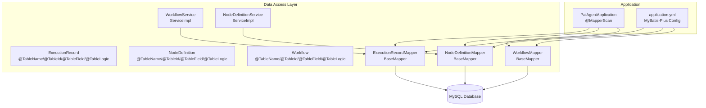
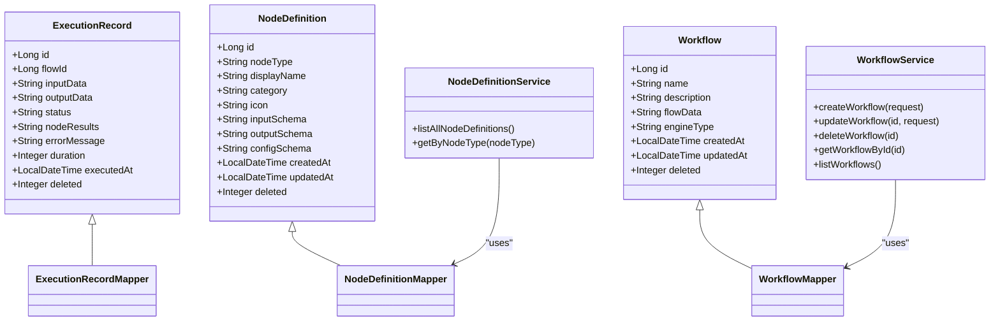
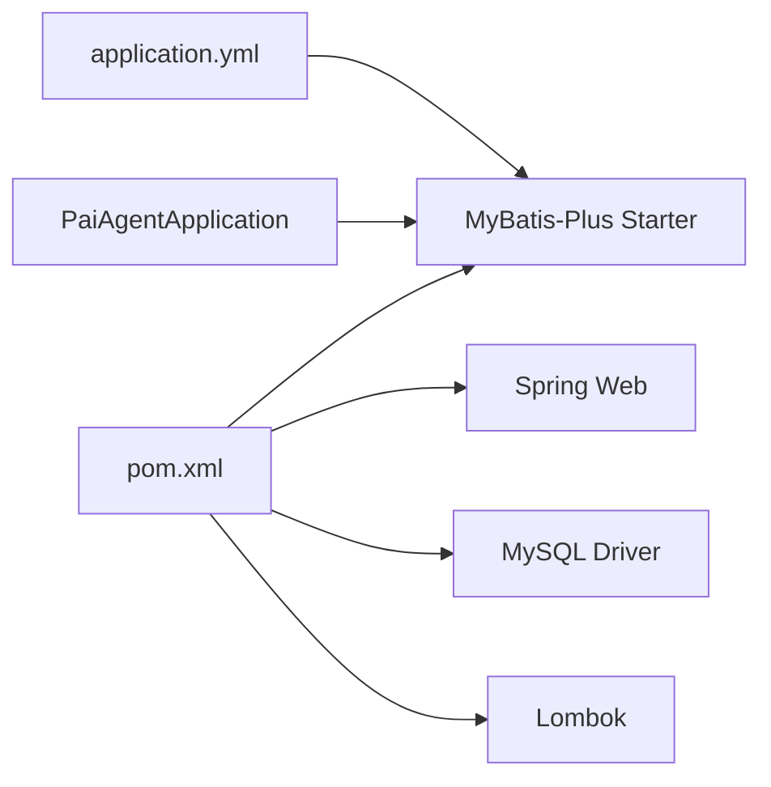

# Data Access Layer

<cite>
**Referenced Files in This Document**
- [PaiAgentApplication.java](file://backend/src/main/java/com/paiagent/PaiAgentApplication.java)
- [application.yml](file://backend/src/main/resources/application.yml)
- [ExecutionRecordMapper.java](file://backend/src/main/java/com/paiagent/mapper/ExecutionRecordMapper.java)
- [NodeDefinitionMapper.java](file://backend/src/main/java/com/paiagent/mapper/NodeDefinitionMapper.java)
- [WorkflowMapper.java](file://backend/src/main/java/com/paiagent/mapper/WorkflowMapper.java)
- [ExecutionRecord.java](file://backend/src/main/java/com/paiagent/entity/ExecutionRecord.java)
- [NodeDefinition.java](file://backend/src/main/java/com/paiagent/entity/NodeDefinition.java)
- [Workflow.java](file://backend/src/main/java/com/paiagent/entity/Workflow.java)
- [WorkflowService.java](file://backend/src/main/java/com/paiagent/service/WorkflowService.java)
- [NodeDefinitionService.java](file://backend/src/main/java/com/paiagent/service/NodeDefinitionService.java)
- [schema.sql](file://backend/src/main/resources/schema.sql)
- [migration_add_engine_type.sql](file://backend/src/main/resources/migration_add_engine_type.sql)
- [pom.xml](file://backend/pom.xml)
</cite>

## Table of Contents
1. [Introduction](#introduction)
2. [Project Structure](#project-structure)
3. [Core Components](#core-components)
4. [Architecture Overview](#architecture-overview)
5. [Detailed Component Analysis](#detailed-component-analysis)
6. [Dependency Analysis](#dependency-analysis)
7. [Performance Considerations](#performance-considerations)
8. [Troubleshooting Guide](#troubleshooting-guide)
9. [Conclusion](#conclusion)

## Introduction
This document describes the data access layer built with the MyBatis-Plus framework. It explains the mapper interfaces, entity classes, and database interaction patterns used across the application. It also documents the repository pattern implementation via MyBatis-Plus ServiceImpl, dynamic SQL generation through lambda conditions, and annotation-driven mapping. Additional topics include database configuration, logical deletion, and performance optimization techniques.

## Project Structure
The data access layer follows a clean separation of concerns:
- Entities define domain models with MyBatis-Plus annotations for table/column mapping and metadata.
- Mappers extend BaseMapper to inherit CRUD operations.
- Services encapsulate business logic and orchestrate data access using MyBatis-Plus features.
- Application configuration defines database connectivity and MyBatis-Plus settings.

**Diagram sources**
- [PaiAgentApplication.java:8](file://backend/src/main/java/com/paiagent/PaiAgentApplication.java#L8)
- [application.yml:21-35](file://backend/src/main/resources/application.yml#L21-L35)
- [ExecutionRecord.java:11-66](file://backend/src/main/java/com/paiagent/entity/ExecutionRecord.java#L11-L66)
- [NodeDefinition.java:11-72](file://backend/src/main/java/com/paiagent/entity/NodeDefinition.java#L11-L72)
- [Workflow.java:11-57](file://backend/src/main/java/com/paiagent/entity/Workflow.java#L11-L57)
- [ExecutionRecordMapper.java:10](file://backend/src/main/java/com/paiagent/mapper/ExecutionRecordMapper.java#L10)
- [NodeDefinitionMapper.java:10](file://backend/src/main/java/com/paiagent/mapper/NodeDefinitionMapper.java#L10)
- [WorkflowMapper.java:10](file://backend/src/main/java/com/paiagent/mapper/WorkflowMapper.java#L10)
- [WorkflowService.java:19](file://backend/src/main/java/com/paiagent/service/WorkflowService.java#L19)
- [NodeDefinitionService.java:14](file://backend/src/main/java/com/paiagent/service/NodeDefinitionService.java#L14)

**Section sources**
- [PaiAgentApplication.java:8](file://backend/src/main/java/com/paiagent/PaiAgentApplication.java#L8)
- [application.yml:21-35](file://backend/src/main/resources/application.yml#L21-L35)

## Core Components
- Entity classes annotate table names, primary keys, field mappings, and logical deletion.
- Mapper interfaces extend BaseMapper to inherit standard CRUD and query methods.
- Services extend ServiceImpl to gain access to MyBatis-Plus convenience methods and lambda query wrappers.
- Application bootstrap enables automatic mapper scanning.

Key responsibilities:
- Entities: Define persistent schema mapping and metadata.
- Mappers: Provide generic DAO-like capabilities.
- Services: Encapsulate business logic and compose queries using lambda conditions.

**Section sources**
- [ExecutionRecord.java:11-66](file://backend/src/main/java/com/paiagent/entity/ExecutionRecord.java#L11-L66)
- [NodeDefinition.java:11-72](file://backend/src/main/java/com/paiagent/entity/NodeDefinition.java#L11-L72)
- [Workflow.java:11-57](file://backend/src/main/java/com/paiagent/entity/Workflow.java#L11-L57)
- [ExecutionRecordMapper.java:10](file://backend/src/main/java/com/paiagent/mapper/ExecutionRecordMapper.java#L10)
- [NodeDefinitionMapper.java:10](file://backend/src/main/java/com/paiagent/mapper/NodeDefinitionMapper.java#L10)
- [WorkflowMapper.java:10](file://backend/src/main/java/com/paiagent/mapper/WorkflowMapper.java#L10)
- [WorkflowService.java:19](file://backend/src/main/java/com/paiagent/service/WorkflowService.java#L19)
- [NodeDefinitionService.java:14](file://backend/src/main/java/com/paiagent/service/NodeDefinitionService.java#L14)

## Architecture Overview
The data access architecture leverages MyBatis-Plus to minimize boilerplate while enabling expressive querying and automatic SQL generation.

**Diagram sources**
- [ExecutionRecord.java:11-66](file://backend/src/main/java/com/paiagent/entity/ExecutionRecord.java#L11-L66)
- [NodeDefinition.java:11-72](file://backend/src/main/java/com/paiagent/entity/NodeDefinition.java#L11-L72)
- [Workflow.java:11-57](file://backend/src/main/java/com/paiagent/entity/Workflow.java#L11-L57)
- [ExecutionRecordMapper.java:10](file://backend/src/main/java/com/paiagent/mapper/ExecutionRecordMapper.java#L10)
- [NodeDefinitionMapper.java:10](file://backend/src/main/java/com/paiagent/mapper/NodeDefinitionMapper.java#L10)
- [WorkflowMapper.java:10](file://backend/src/main/java/com/paiagent/mapper/WorkflowMapper.java#L10)
- [WorkflowService.java:19](file://backend/src/main/java/com/paiagent/service/WorkflowService.java#L19)
- [NodeDefinitionService.java:14](file://backend/src/main/java/com/paiagent/service/NodeDefinitionService.java#L14)

## Detailed Component Analysis

### Entity Annotations and Field Mapping
- @TableName: Maps classes to database tables.
- @TableId: Declares primary keys and identity strategies.
- @TableField: Controls column mapping and metadata (insert/update timestamps, fill strategies).
- @TableLogic: Enables logical deletion with configured delete values.

Examples:
- ExecutionRecord: Logical deletion on deleted, insert-time executedAt, JSON fields for structured data.
- NodeDefinition: Timestamps with insert/update fill, unique nodeType, JSON schemas.
- Workflow: Timestamps with insert/update fill, optional engineType for engine selection.

**Section sources**
- [ExecutionRecord.java:11-66](file://backend/src/main/java/com/paiagent/entity/ExecutionRecord.java#L11-L66)
- [NodeDefinition.java:11-72](file://backend/src/main/java/com/paiagent/entity/NodeDefinition.java#L11-L72)
- [Workflow.java:11-57](file://backend/src/main/java/com/paiagent/entity/Workflow.java#L11-L57)

### Mapper Interfaces and Repository Pattern
- Each mapper extends BaseMapper<Entity>, inheriting:
  - save/remove/update/getById/list/query by wrapper
  - count, exists, selectOne, selectBatchIds, etc.
- Services extend ServiceImpl<Mapper, Entity>, gaining:
  - save/update/remove plus page, list, and lambda query helpers
  - Seamless integration with MyBatis-Plus query DSL

Usage patterns:
- WorkflowService uses LambdaQueryWrapper for ordering and projections.
- NodeDefinitionService uses lambdaQuery().eq(...) for equality filtering.

**Section sources**
- [WorkflowService.java:77-84](file://backend/src/main/java/com/paiagent/service/WorkflowService.java#L77-L84)
- [NodeDefinitionService.java:27-30](file://backend/src/main/java/com/paiagent/service/NodeDefinitionService.java#L27-L30)
- [WorkflowMapper.java:10](file://backend/src/main/java/com/paiagent/mapper/WorkflowMapper.java#L10)
- [NodeDefinitionMapper.java:10](file://backend/src/main/java/com/paiagent/mapper/NodeDefinitionMapper.java#L10)
- [ExecutionRecordMapper.java:10](file://backend/src/main/java/com/paiagent/mapper/ExecutionRecordMapper.java#L10)

### Dynamic SQL Generation and Query Methods
- LambdaQueryWrapper: Type-safe dynamic conditions, ordering, and projections.
- lambdaQuery(): Fluent API for building predicates (e.g., eq, ne, in, orderByDesc).
- Automatic SQL generation from method calls and lambda expressions.

Example flows:
- Listing workflows ordered by updatedAt descending.
- Filtering node definitions by nodeType.

**Section sources**
- [WorkflowService.java:77-84](file://backend/src/main/java/com/paiagent/service/WorkflowService.java#L77-L84)
- [NodeDefinitionService.java:27-30](file://backend/src/main/java/com/paiagent/service/NodeDefinitionService.java#L27-L30)

### Database Schema and Indexes
- workflow: engine_type column added via migration script; indexes on created_at, updated_at.
- node_definition: unique node_type; indexes on category.
- execution_record: indexes on flow_id, executed_at, status; JSON fields for structured data.

These indexes support common queries and improve performance for time-series and foreign-key lookups.

**Section sources**
- [schema.sql:7-18](file://backend/src/main/resources/schema.sql#L7-L18)
- [schema.sql:21-34](file://backend/src/main/resources/schema.sql#L21-L34)
- [schema.sql:37-51](file://backend/src/main/resources/schema.sql#L37-L51)
- [migration_add_engine_type.sql:8-13](file://backend/src/main/resources/migration_add_engine_type.sql#L8-L13)

### Transaction Management
- No explicit @Transactional annotations are present in the data access layer.
- Spring Boot and MyBatis-Plus rely on default transaction boundaries per operation.
- For multi-step operations requiring atomicity, wrap service methods with @Transactional at the service boundary.

[No sources needed since this section provides general guidance]

### Pagination Support
- MyBatis-Plus provides Page<T> for pagination.
- To add pagination:
  - Accept Page<SomeEntity> in service methods.
  - Call IPage<SomeEntity> pageResult = this.page(page, wrapper) in ServiceImpl.
  - Return the paginated result to controllers.

[No sources needed since this section provides general guidance]

### Custom Queries and XML-Free Design
- All queries are generated dynamically via lambda conditions and MyBatis-Plus query wrappers.
- No XML mapper files are present; configuration relies on application.yml and annotations.

**Section sources**
- [application.yml:23-28](file://backend/src/main/resources/application.yml#L23-L28)

### Performance Optimization Techniques
- Enable MyBatis logging during development to inspect generated SQL.
- Use appropriate indexes on frequently filtered/sorted columns (as seen in schema.sql).
- Prefer selective projections and limit returned fields when possible.
- Use lambdaQuery for efficient, type-safe predicate composition.
- Avoid N+1 selects by fetching related data in single queries or using joins where necessary.

**Section sources**
- [application.yml:28](file://backend/src/main/resources/application.yml#L28)
- [schema.sql:16](file://backend/src/main/resources/schema.sql#L16)
- [schema.sql:33](file://backend/src/main/resources/schema.sql#L33)
- [schema.sql:49](file://backend/src/main/resources/schema.sql#L49)

## Dependency Analysis
The data access layer depends on:
- Spring Boot Starter Web and Validation for web infrastructure.
- MyBatis-Plus Spring Boot 3 Starter for ORM and query DSL.
- MySQL Connector/J for JDBC connectivity.
- Lombok for concise entity definitions.
- Optional: Spring AI OpenAI starter and LangGraph4j integrations for runtime features.

**Diagram sources**
- [pom.xml:60-110](file://backend/pom.xml#L60-L110)
- [application.yml:7-11](file://backend/src/main/resources/application.yml#L7-L11)
- [PaiAgentApplication.java:8](file://backend/src/main/java/com/paiagent/PaiAgentApplication.java#L8)

**Section sources**
- [pom.xml:60-110](file://backend/pom.xml#L60-L110)
- [application.yml:7-11](file://backend/src/main/resources/application.yml#L7-L11)

## Performance Considerations
- Logging: StdOutImpl is enabled for SQL inspection; disable in production.
- Naming: map-underscore-to-camel-case reduces mapping overhead.
- Caching: Cache is disabled globally; enable cautiously if needed.
- Indexes: Ensure proper indexing on frequently queried columns (already defined in schema.sql).

**Section sources**
- [application.yml:25-28](file://backend/src/main/resources/application.yml#L25-L28)
- [schema.sql:16](file://backend/src/main/resources/schema.sql#L16)
- [schema.sql:33](file://backend/src/main/resources/schema.sql#L33)
- [schema.sql:49](file://backend/src/main/resources/schema.sql#L49)

## Troubleshooting Guide
Common issues and resolutions:
- Mapper not scanned: Ensure @MapperScan is present and points to the correct package.
- Logical deletion not applied: Verify global-config logic-delete settings match entity annotations.
- Column name mismatches: Confirm @TableField fill and column names align with schema.
- Missing indexes: Add indexes for frequent filters/order-by columns as needed.

**Section sources**
- [PaiAgentApplication.java:8](file://backend/src/main/java/com/paiagent/PaiAgentApplication.java#L8)
- [application.yml:29-34](file://backend/src/main/resources/application.yml#L29-L34)
- [schema.sql:16](file://backend/src/main/resources/schema.sql#L16)
- [schema.sql:33](file://backend/src/main/resources/schema.sql#L33)
- [schema.sql:49](file://backend/src/main/resources/schema.sql#L49)

## Conclusion
The data access layer leverages MyBatis-Plus to deliver a concise, maintainable, and powerful persistence layer. Entities are annotated for precise mapping, mappers inherit robust CRUD capabilities, and services utilize lambda-based query DSL for dynamic SQL generation. With proper indexing and configuration, the layer supports scalable operations and clear separation of concerns.