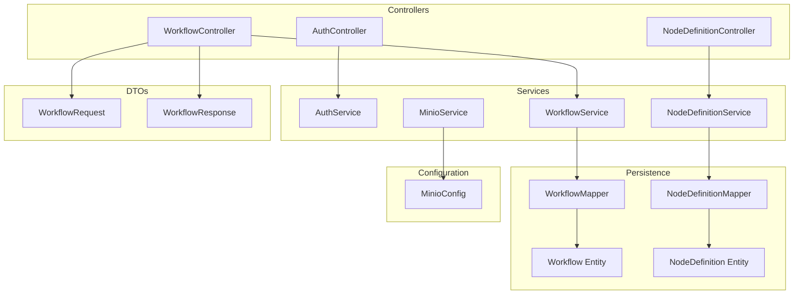
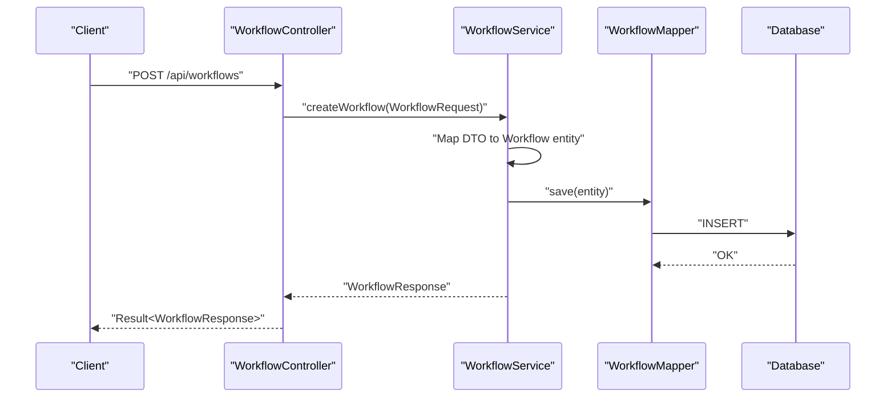
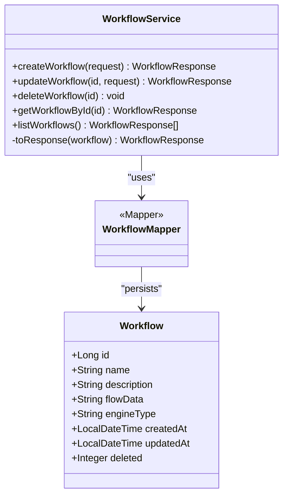
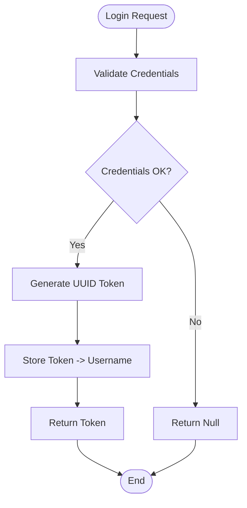
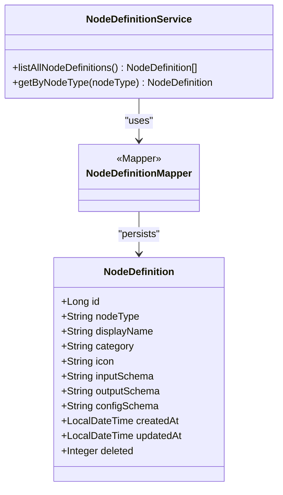
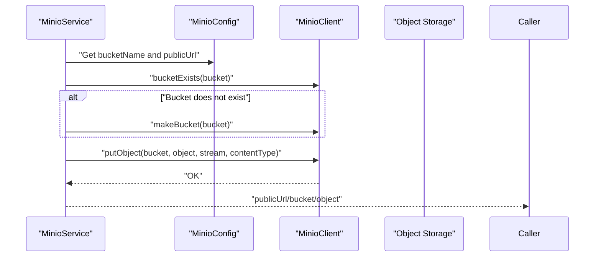
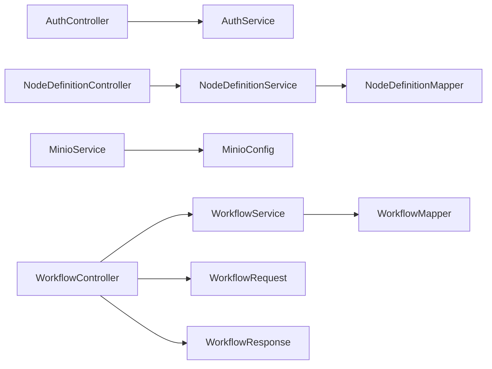

# Service Layer

<cite>
**Referenced Files in This Document**
- [WorkflowService.java](file://backend/src/main/java/com/paiagent/service/WorkflowService.java)
- [AuthService.java](file://backend/src/main/java/com/paiagent/service/AuthService.java)
- [NodeDefinitionService.java](file://backend/src/main/java/com/paiagent/service/NodeDefinitionService.java)
- [MinioService.java](file://backend/src/main/java/com/paiagent/service/MinioService.java)
- [MinioConfig.java](file://backend/src/main/java/com/paiagent/config/MinioConfig.java)
- [AuthController.java](file://backend/src/main/java/com/paiagent/controller/AuthController.java)
- [WorkflowController.java](file://backend/src/main/java/com/paiagent/controller/WorkflowController.java)
- [NodeDefinitionController.java](file://backend/src/main/java/com/paiagent/controller/NodeDefinitionController.java)
- [Result.java](file://backend/src/main/java/com/paiagent/common/Result.java)
- [Workflow.java](file://backend/src/main/java/com/paiagent/entity/Workflow.java)
- [NodeDefinition.java](file://backend/src/main/java/com/paiagent/entity/NodeDefinition.java)
- [WorkflowRequest.java](file://backend/src/main/java/com/paiagent/dto/WorkflowRequest.java)
- [WorkflowResponse.java](file://backend/src/main/java/com/paiagent/dto/WorkflowResponse.java)
- [WorkflowMapper.java](file://backend/src/main/java/com/paiagent/mapper/WorkflowMapper.java)
- [NodeDefinitionMapper.java](file://backend/src/main/java/com/paiagent/mapper/NodeDefinitionMapper.java)
</cite>

## Table of Contents
1. [Introduction](#introduction)
2. [Project Structure](#project-structure)
3. [Core Components](#core-components)
4. [Architecture Overview](#architecture-overview)
5. [Detailed Component Analysis](#detailed-component-analysis)
6. [Dependency Analysis](#dependency-analysis)
7. [Performance Considerations](#performance-considerations)
8. [Troubleshooting Guide](#troubleshooting-guide)
9. [Conclusion](#conclusion)

## Introduction
This document describes the service layer of the backend system, focusing on business logic services and their integration with controllers and persistence. It covers:
- Service interfaces and implementations for workflow orchestration, authentication/authorization, node definition management, and object storage
- Transaction management, business rule enforcement, and service composition patterns
- Dependency injection, testing strategies, and error handling approaches
- Method signatures, parameter validation, and return value handling

## Project Structure
The service layer resides under the Java package com.paiagent.service and is composed of:
- Services: WorkflowService, AuthService, NodeDefinitionService, MinioService
- Controllers: AuthController, WorkflowController, NodeDefinitionController
- Entities and Mappers: Workflow, NodeDefinition, WorkflowMapper, NodeDefinitionMapper
- DTOs: WorkflowRequest, WorkflowResponse
- Common utilities: Result (standardized HTTP responses)
- Configuration: MinioConfig (MinIO client bean and properties)

**Diagram sources**
- [AuthController.java:1-62](file://backend/src/main/java/com/paiagent/controller/AuthController.java#L1-62)
- [WorkflowController.java:1-61](file://backend/src/main/java/com/paiagent/controller/WorkflowController.java#L1-61)
- [NodeDefinitionController.java:1-33](file://backend/src/main/java/com/paiagent/controller/NodeDefinitionController.java#L1-33)
- [AuthService.java:1-63](file://backend/src/main/java/com/paiagent/service/AuthService.java#L1-63)
- [WorkflowService.java:1-95](file://backend/src/main/java/com/paiagent/service/WorkflowService.java#L1-95)
- [NodeDefinitionService.java:1-32](file://backend/src/main/java/com/paiagent/service/NodeDefinitionService.java#L1-32)
- [MinioService.java:1-102](file://backend/src/main/java/com/paiagent/service/MinioService.java#L1-102)
- [MinioConfig.java:1-28](file://backend/src/main/java/com/paiagent/config/MinioConfig.java#L1-28)
- [WorkflowMapper.java:1-13](file://backend/src/main/java/com/paiagent/mapper/WorkflowMapper.java#L1-13)
- [NodeDefinitionMapper.java:1-13](file://backend/src/main/java/com/paiagent/mapper/NodeDefinitionMapper.java#L1-13)
- [Workflow.java:1-58](file://backend/src/main/java/com/paiagent/entity/Workflow.java#L1-58)
- [NodeDefinition.java:1-73](file://backend/src/main/java/com/paiagent/entity/NodeDefinition.java#L1-73)
- [WorkflowRequest.java:1-22](file://backend/src/main/java/com/paiagent/dto/WorkflowRequest.java#L1-22)
- [WorkflowResponse.java:1-20](file://backend/src/main/java/com/paiagent/dto/WorkflowResponse.java#L1-20)

**Section sources**
- [AuthController.java:1-62](file://backend/src/main/java/com/paiagent/controller/AuthController.java#L1-62)
- [WorkflowController.java:1-61](file://backend/src/main/java/com/paiagent/controller/WorkflowController.java#L1-61)
- [NodeDefinitionController.java:1-33](file://backend/src/main/java/com/paiagent/controller/NodeDefinitionController.java#L1-33)
- [AuthService.java:1-63](file://backend/src/main/java/com/paiagent/service/AuthService.java#L1-63)
- [WorkflowService.java:1-95](file://backend/src/main/java/com/paiagent/service/WorkflowService.java#L1-95)
- [NodeDefinitionService.java:1-32](file://backend/src/main/java/com/paiagent/service/NodeDefinitionService.java#L1-32)
- [MinioService.java:1-102](file://backend/src/main/java/com/paiagent/service/MinioService.java#L1-102)
- [MinioConfig.java:1-28](file://backend/src/main/java/com/paiagent/config/MinioConfig.java#L1-28)
- [WorkflowMapper.java:1-13](file://backend/src/main/java/com/paiagent/mapper/WorkflowMapper.java#L1-13)
- [NodeDefinitionMapper.java:1-13](file://backend/src/main/java/com/paiagent/mapper/NodeDefinitionMapper.java#L1-13)
- [Workflow.java:1-58](file://backend/src/main/java/com/paiagent/entity/Workflow.java#L1-58)
- [NodeDefinition.java:1-73](file://backend/src/main/java/com/paiagent/entity/NodeDefinition.java#L1-73)
- [WorkflowRequest.java:1-22](file://backend/src/main/java/com/paiagent/dto/WorkflowRequest.java#L1-22)
- [WorkflowResponse.java:1-20](file://backend/src/main/java/com/paiagent/dto/WorkflowResponse.java#L1-20)

## Core Components
This section outlines the primary service interfaces and implementations, their responsibilities, and how they integrate with controllers and persistence.

- WorkflowService
  - Responsibilities: CRUD operations for workflows, conversion between entity and DTO, list queries with ordering
  - Key methods: createWorkflow, updateWorkflow, deleteWorkflow, getWorkflowById, listWorkflows
  - Business rules: throws runtime exception for missing workflow during update/get; orders list by updated time descending
  - Persistence: extends MyBatis-Plus ServiceImpl with WorkflowMapper
  - Validation: relies on WorkflowRequest DTO constraints enforced by controllers

- AuthService
  - Responsibilities: in-memory token management for demo purposes, login/logout/validation, username lookup by token
  - Security note: credentials are hardcoded defaults; token store is concurrent map
  - Integration: used by AuthController for login/logout/current endpoints

- NodeDefinitionService
  - Responsibilities: list all node definitions, fetch by node type
  - Persistence: MyBatis-Plus ServiceImpl with NodeDefinitionMapper

- MinioService
  - Responsibilities: ensure bucket existence, upload from stream/URL/bytes, return public URL
  - Configuration: injected MinioClient and MinioConfig
  - Error handling: propagates exceptions from MinIO operations

**Section sources**
- [WorkflowService.java:1-95](file://backend/src/main/java/com/paiagent/service/WorkflowService.java#L1-95)
- [AuthService.java:1-63](file://backend/src/main/java/com/paiagent/service/AuthService.java#L1-63)
- [NodeDefinitionService.java:1-32](file://backend/src/main/java/com/paiagent/service/NodeDefinitionService.java#L1-32)
- [MinioService.java:1-102](file://backend/src/main/java/com/paiagent/service/MinioService.java#L1-102)

## Architecture Overview
The service layer follows a layered architecture:
- Controllers expose REST endpoints and delegate to services
- Services encapsulate business logic and coordinate persistence
- Mappers and entities handle database operations via MyBatis-Plus
- MinIO integration is centralized in MinioService with configuration managed by MinioConfig
- Standardized responses are returned via Result<T>

**Diagram sources**
- [WorkflowController.java:26-31](file://backend/src/main/java/com/paiagent/controller/WorkflowController.java#L26-L31)
- [WorkflowService.java:24-34](file://backend/src/main/java/com/paiagent/service/WorkflowService.java#L24-L34)
- [WorkflowMapper.java:10-12](file://backend/src/main/java/com/paiagent/mapper/WorkflowMapper.java#L10-L12)

## Detailed Component Analysis

### WorkflowService Analysis
- Implementation pattern: MyBatis-Plus ServiceImpl simplifies CRUD; manual mapping to DTO
- Data structures: Workflow entity mapped to WorkflowResponse DTO
- Complexity:
  - save/update/remove: O(1) database operations
  - list with ordering: O(n) retrieval plus O(n log n) sort by field (MyBatis-Plus ordering)
- Business rules:
  - Throws runtime exception when updating/fetching non-existent workflow
  - Orders list by updatedAt descending
- Error handling: exceptions thrown for invalid state; controllers wrap successful outcomes in Result

**Diagram sources**
- [WorkflowService.java:19-94](file://backend/src/main/java/com/paiagent/service/WorkflowService.java#L19-L94)
- [WorkflowMapper.java:10-12](file://backend/src/main/java/com/paiagent/mapper/WorkflowMapper.java#L10-L12)
- [Workflow.java:12-57](file://backend/src/main/java/com/paiagent/entity/Workflow.java#L12-L57)

**Section sources**
- [WorkflowService.java:1-95](file://backend/src/main/java/com/paiagent/service/WorkflowService.java#L1-95)
- [Workflow.java:1-58](file://backend/src/main/java/com/paiagent/entity/Workflow.java#L1-58)
- [WorkflowMapper.java:1-13](file://backend/src/main/java/com/paiagent/mapper/WorkflowMapper.java#L1-13)

### AuthService Analysis
- Implementation pattern: in-memory token store with concurrent map
- Authentication flow: validates default credentials, generates UUID token, stores mapping
- Authorization flow: validates token presence and checks token store
- Error handling: returns null on failed login; unauthorized responses handled by controllers

**Diagram sources**
- [AuthService.java:33-40](file://backend/src/main/java/com/paiagent/service/AuthService.java#L33-L40)

**Section sources**
- [AuthService.java:1-63](file://backend/src/main/java/com/paiagent/service/AuthService.java#L1-63)
- [AuthController.java:27-35](file://backend/src/main/java/com/paiagent/controller/AuthController.java#L27-L35)

### NodeDefinitionService Analysis
- Implementation pattern: MyBatis-Plus ServiceImpl
- Queries: list all definitions, filter by nodeType
- Complexity: O(n) for list; O(1) for single-item query with proper indexing

**Diagram sources**
- [NodeDefinitionService.java:14-31](file://backend/src/main/java/com/paiagent/service/NodeDefinitionService.java#L14-L31)
- [NodeDefinitionMapper.java:10-12](file://backend/src/main/java/com/paiagent/mapper/NodeDefinitionMapper.java#L10-L12)
- [NodeDefinition.java:12-72](file://backend/src/main/java/com/paiagent/entity/NodeDefinition.java#L12-L72)

**Section sources**
- [NodeDefinitionService.java:1-32](file://backend/src/main/java/com/paiagent/service/NodeDefinitionService.java#L1-32)
- [NodeDefinition.java:1-73](file://backend/src/main/java/com/paiagent/entity/NodeDefinition.java#L1-73)
- [NodeDefinitionMapper.java:1-13](file://backend/src/main/java/com/paiagent/mapper/NodeDefinitionMapper.java#L1-13)

### MinioService Analysis
- Implementation pattern: centralized MinIO operations with bucket lifecycle management
- Methods:
  - ensureBucketExists: checks and creates bucket if missing
  - uploadFile: streams input to MinIO, logs success, returns public URL
  - uploadFromUrl: downloads from URL and uploads to MinIO
  - uploadFromBytes: converts byte array to stream and uploads
- Configuration: MinioConfig provides MinioClient bean and properties (endpoint, keys, bucket, publicUrl)

**Diagram sources**
- [MinioService.java:29-69](file://backend/src/main/java/com/paiagent/service/MinioService.java#L29-L69)
- [MinioConfig.java:12-26](file://backend/src/main/java/com/paiagent/config/MinioConfig.java#L12-L26)

**Section sources**
- [MinioService.java:1-102](file://backend/src/main/java/com/paiagent/service/MinioService.java#L1-102)
- [MinioConfig.java:1-28](file://backend/src/main/java/com/paiagent/config/MinioConfig.java#L1-28)

## Dependency Analysis
- Controllers depend on services via Spring @Autowired
- Services depend on mappers for persistence
- MinioService depends on MinioConfig and MinioClient
- DTOs are validated by controllers before invoking services
- Result<T> standardizes HTTP responses across controllers

**Diagram sources**
- [AuthController.java:22-23](file://backend/src/main/java/com/paiagent/controller/AuthController.java#L22-L23)
- [WorkflowController.java:23-24](file://backend/src/main/java/com/paiagent/controller/WorkflowController.java#L23-L24)
- [NodeDefinitionController.java:23-24](file://backend/src/main/java/com/paiagent/controller/NodeDefinitionController.java#L23-L24)
- [AuthService.java:12-13](file://backend/src/main/java/com/paiagent/service/AuthService.java#L12-L13)
- [WorkflowService.java:18-19](file://backend/src/main/java/com/paiagent/service/WorkflowService.java#L18-L19)
- [NodeDefinitionService.java:13-14](file://backend/src/main/java/com/paiagent/service/NodeDefinitionService.java#L13-L14)
- [MinioService.java:16-24](file://backend/src/main/java/com/paiagent/service/MinioService.java#L16-L24)
- [MinioConfig.java:10-12](file://backend/src/main/java/com/paiagent/config/MinioConfig.java#L10-L12)
- [WorkflowMapper.java:10-12](file://backend/src/main/java/com/paiagent/mapper/WorkflowMapper.java#L10-L12)
- [NodeDefinitionMapper.java:10-12](file://backend/src/main/java/com/paiagent/mapper/NodeDefinitionMapper.java#L10-L12)
- [WorkflowRequest.java:10-21](file://backend/src/main/java/com/paiagent/dto/WorkflowRequest.java#L10-L21)
- [WorkflowResponse.java:10-19](file://backend/src/main/java/com/paiagent/dto/WorkflowResponse.java#L10-L19)

**Section sources**
- [AuthController.java:1-62](file://backend/src/main/java/com/paiagent/controller/AuthController.java#L1-62)
- [WorkflowController.java:1-61](file://backend/src/main/java/com/paiagent/controller/WorkflowController.java#L1-61)
- [NodeDefinitionController.java:1-33](file://backend/src/main/java/com/paiagent/controller/NodeDefinitionController.java#L1-33)
- [AuthService.java:1-63](file://backend/src/main/java/com/paiagent/service/AuthService.java#L1-63)
- [WorkflowService.java:1-95](file://backend/src/main/java/com/paiagent/service/WorkflowService.java#L1-95)
- [NodeDefinitionService.java:1-32](file://backend/src/main/java/com/paiagent/service/NodeDefinitionService.java#L1-32)
- [MinioService.java:1-102](file://backend/src/main/java/com/paiagent/service/MinioService.java#L1-102)
- [MinioConfig.java:1-28](file://backend/src/main/java/com/paiagent/config/MinioConfig.java#L1-28)
- [WorkflowMapper.java:1-13](file://backend/src/main/java/com/paiagent/mapper/WorkflowMapper.java#L1-13)
- [NodeDefinitionMapper.java:1-13](file://backend/src/main/java/com/paiagent/mapper/NodeDefinitionMapper.java#L1-13)
- [WorkflowRequest.java:1-22](file://backend/src/main/java/com/paiagent/dto/WorkflowRequest.java#L1-22)
- [WorkflowResponse.java:1-20](file://backend/src/main/java/com/paiagent/dto/WorkflowResponse.java#L1-20)

## Performance Considerations
- WorkflowService list operation sorts by updatedAt; ensure appropriate indexing on updatedAt for optimal performance
- MinioService operations involve network I/O; consider connection pooling and timeouts via MinioClient configuration
- AuthService token store is in-memory; for production, replace with secure, distributed session store
- DTO mapping in WorkflowService is lightweight but avoid unnecessary conversions in tight loops

## Troubleshooting Guide
Common issues and resolutions:
- Workflow not found errors: Verify ID correctness and soft-delete semantics; WorkflowService throws runtime exception for missing records
- MinIO upload failures: Confirm bucket exists, credentials are correct, and publicUrl is reachable; MinioService logs successful uploads
- Authentication failures: Default credentials are required; ensure Authorization header is present and formatted as Bearer token
- Controller validation errors: WorkflowRequest enforces non-blank name and flowData; ensure DTO payload complies with constraints

**Section sources**
- [WorkflowService.java:41-43](file://backend/src/main/java/com/paiagent/service/WorkflowService.java#L41-L43)
- [MinioService.java:53-69](file://backend/src/main/java/com/paiagent/service/MinioService.java#L53-L69)
- [AuthService.java:33-40](file://backend/src/main/java/com/paiagent/service/AuthService.java#L33-L40)
- [WorkflowController.java:27-31](file://backend/src/main/java/com/paiagent/controller/WorkflowController.java#L27-L31)
- [WorkflowRequest.java:12-18](file://backend/src/main/java/com/paiagent/dto/WorkflowRequest.java#L12-L18)

## Conclusion
The service layer cleanly separates business logic from presentation and persistence:
- WorkflowService orchestrates workflow operations with straightforward CRUD and DTO mapping
- AuthService provides basic authentication/authorization suitable for demos
- NodeDefinitionService exposes node metadata for UI and execution engines
- MinioService centralizes object storage operations with clear configuration
Controllers consistently return standardized Result<T> responses, and services rely on MyBatis-Plus for efficient persistence. For production, consider enhancing AuthService with secure tokens, adding transaction boundaries around multi-step operations, and introducing comprehensive unit and integration tests for service methods.