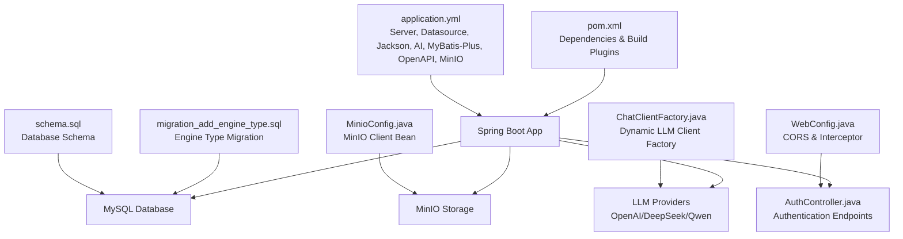
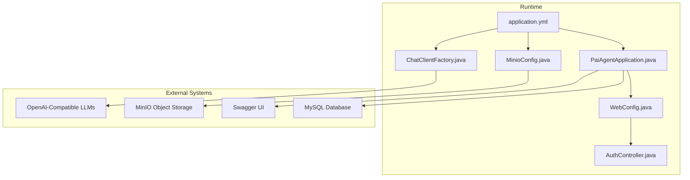
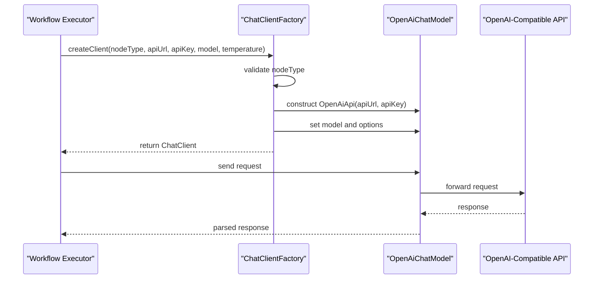
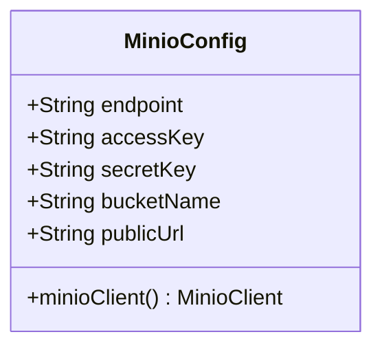
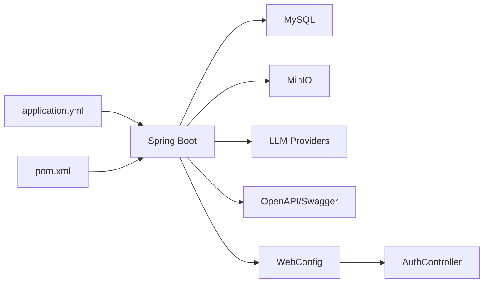

# Backend Configuration

<cite>
**Referenced Files in This Document**
- [application.yml](file://backend/src/main/resources/application.yml)
- [pom.xml](file://backend/pom.xml)
- [PaiAgentApplication.java](file://backend/src/main/java/com/paiagent/PaiAgentApplication.java)
- [MinioConfig.java](file://backend/src/main/java/com/paiagent/config/MinioConfig.java)
- [WebConfig.java](file://backend/src/main/java/com/paiagent/config/WebConfig.java)
- [ChatClientFactory.java](file://backend/src/main/java/com/paiagent/engine/llm/ChatClientFactory.java)
- [AuthController.java](file://backend/src/main/java/com/paiagent/controller/AuthController.java)
- [schema.sql](file://backend/src/main/resources/schema.sql)
- [migration_add_engine_type.sql](file://backend/src/main/resources/migration_add_engine_type.sql)
</cite>

## Table of Contents
1. [Introduction](#introduction)
2. [Project Structure](#project-structure)
3. [Core Components](#core-components)
4. [Architecture Overview](#architecture-overview)
5. [Detailed Component Analysis](#detailed-component-analysis)
6. [Dependency Analysis](#dependency-analysis)
7. [Performance Considerations](#performance-considerations)
8. [Troubleshooting Guide](#troubleshooting-guide)
9. [Conclusion](#conclusion)
10. [Appendices](#appendices)

## Introduction
This document provides comprehensive backend configuration guidance for the Spring Boot application. It covers database connectivity, LLM provider configuration, security settings, file storage via MinIO, logging, Maven dependencies and build configuration, environment-specific overrides, profile-based configurations, and production-ready recommendations. It also includes practical configuration scenarios and troubleshooting steps for common connection issues.

## Project Structure
The backend is a Spring Boot application with the following key configuration areas:
- Application configuration: centralized in application.yml
- Dependencies and build: managed in pom.xml
- Database schema and migrations: provided as SQL scripts
- File storage: configured via MinIO beans
- LLM client creation: dynamic factory supporting OpenAI-compatible providers
- Security: CORS and interceptors for authentication

**Diagram sources**
- [application.yml:1-55](file://backend/src/main/resources/application.yml#L1-L55)
- [pom.xml:1-163](file://backend/pom.xml#L1-L163)
- [schema.sql:1-84](file://backend/src/main/resources/schema.sql#L1-L84)
- [migration_add_engine_type.sql:1-17](file://backend/src/main/resources/migration_add_engine_type.sql#L1-L17)
- [MinioConfig.java:1-28](file://backend/src/main/java/com/paiagent/config/MinioConfig.java#L1-L28)
- [ChatClientFactory.java:1-60](file://backend/src/main/java/com/paiagent/engine/llm/ChatClientFactory.java#L1-L60)
- [WebConfig.java:1-35](file://backend/src/main/java/com/paiagent/config/WebConfig.java#L1-L35)
- [AuthController.java:1-62](file://backend/src/main/java/com/paiagent/controller/AuthController.java#L1-L62)

**Section sources**
- [application.yml:1-55](file://backend/src/main/resources/application.yml#L1-L55)
- [pom.xml:1-163](file://backend/pom.xml#L1-L163)
- [schema.sql:1-84](file://backend/src/main/resources/schema.sql#L1-L84)
- [migration_add_engine_type.sql:1-17](file://backend/src/main/resources/migration_add_engine_type.sql#L1-L17)
- [MinioConfig.java:1-28](file://backend/src/main/java/com/paiagent/config/MinioConfig.java#L1-L28)
- [ChatClientFactory.java:1-60](file://backend/src/main/java/com/paiagent/engine/llm/ChatClientFactory.java#L1-L60)
- [WebConfig.java:1-35](file://backend/src/main/java/com/paiagent/config/WebConfig.java#L1-L35)
- [AuthController.java:1-62](file://backend/src/main/java/com/paiagent/controller/AuthController.java#L1-L62)

## Core Components
- Server configuration: port binding and basic application metadata
- Datasource: MySQL connection settings and credentials
- Jackson: timezone and date format for serialization
- AI/OpenAI: placeholder API key and base URL; actual keys supplied per node configuration
- MyBatis-Plus: mapper locations, type aliases, and logging configuration
- SpringDoc OpenAPI: API documentation and UI enablement
- MinIO: endpoint, credentials, bucket, and public URL
- Maven dependencies: Spring Boot starters, MyBatis-Plus, OpenAPI, MinIO SDK, Spring AI OpenAI, LangGraph4j integrations, and testing support

**Section sources**
- [application.yml:1-55](file://backend/src/main/resources/application.yml#L1-L55)
- [pom.xml:29-131](file://backend/pom.xml#L29-L131)

## Architecture Overview
The backend integrates multiple subsystems:
- Configuration-driven LLM clients created dynamically based on node configuration
- MinIO-backed file storage with configurable endpoints and credentials
- Spring MVC with CORS and interceptor-based authentication
- Database persistence via MyBatis-Plus with logical delete support
- OpenAPI/Swagger for API documentation

**Diagram sources**
- [application.yml:1-55](file://backend/src/main/resources/application.yml#L1-L55)
- [PaiAgentApplication.java:1-16](file://backend/src/main/java/com/paiagent/PaiAgentApplication.java#L1-L16)
- [WebConfig.java:1-35](file://backend/src/main/java/com/paiagent/config/WebConfig.java#L1-L35)
- [AuthController.java:1-62](file://backend/src/main/java/com/paiagent/controller/AuthController.java#L1-L62)
- [MinioConfig.java:1-28](file://backend/src/main/java/com/paiagent/config/MinioConfig.java#L1-L28)
- [ChatClientFactory.java:1-60](file://backend/src/main/java/com/paiagent/engine/llm/ChatClientFactory.java#L1-L60)

## Detailed Component Analysis

### Database Configuration
- JDBC URL, driver, username, and password are defined in application.yml under the datasource section.
- MyBatis-Plus configuration includes:
  - Mapper XML locations
  - Type aliases package
  - Underscore-to-camelCase mapping
  - Logging via stdout
  - Global configuration with auto ID generation and logical delete fields

Recommended production settings:
- Use environment variables for sensitive credentials (see Environment Overrides).
- Configure connection pool properties (e.g., HikariCP) via spring.datasource.hikari.*.
- Enable SSL/TLS for the MySQL connection.
- Set serverTimezone and character encoding consistently with application timezone.

**Section sources**
- [application.yml:7-28](file://backend/src/main/resources/application.yml#L7-L28)
- [schema.sql:1-84](file://backend/src/main/resources/schema.sql#L1-L84)
- [migration_add_engine_type.sql:1-17](file://backend/src/main/resources/migration_add_engine_type.sql#L1-L17)

### LLM Provider Configuration
- Placeholder OpenAI API key and base URL are defined in application.yml.
- Actual API keys and endpoints are supplied per node during workflow execution via ChatClientFactory.
- Supported node types include openai, deepseek, and qwen, leveraging OpenAI-compatible APIs.

Production guidance:
- Store API keys in secure environment variables or secrets manager.
- Use per-node configuration to avoid hardcoding keys.
- Configure timeouts and retry policies at the ChatClient level.

**Diagram sources**
- [ChatClientFactory.java:29-58](file://backend/src/main/java/com/paiagent/engine/llm/ChatClientFactory.java#L29-L58)
- [application.yml:15-19](file://backend/src/main/resources/application.yml#L15-L19)

**Section sources**
- [application.yml:15-19](file://backend/src/main/resources/application.yml#L15-L19)
- [ChatClientFactory.java:1-60](file://backend/src/main/java/com/paiagent/engine/llm/ChatClientFactory.java#L1-L60)

### Security Settings and Authentication
- CORS: configured to allow localhost origins with credentials and standard HTTP methods.
- Interceptor: AuthInterceptor applied to /api/** excluding public endpoints (login, current user, node types, and Swagger UI).
- Authentication endpoints:
  - POST /api/auth/login
  - POST /api/auth/logout
  - GET /api/auth/current

Note: The provided configuration does not define JWT tokens or token signing keys. If JWT is desired, configure spring.security.oauth2.resourceserver.jwt and related properties accordingly.

**Section sources**
- [WebConfig.java:19-34](file://backend/src/main/java/com/paiagent/config/WebConfig.java#L19-L34)
- [AuthController.java:25-60](file://backend/src/main/java/com/paiagent/controller/AuthController.java#L25-L60)

### File Storage Setup with MinIO
- MinIO configuration properties mapped via @ConfigurationProperties(prefix = "minio").
- Beans created for MinioClient using endpoint, accessKey, and secretKey.
- Public URL and bucket name are also configurable.

Production guidance:
- Use HTTPS endpoints and TLS certificates.
- Separate buckets per environment or tenant.
- Enforce IAM policies and bucket lifecycle rules.

**Diagram sources**
- [MinioConfig.java:10-26](file://backend/src/main/java/com/paiagent/config/MinioConfig.java#L10-L26)

**Section sources**
- [application.yml:49-55](file://backend/src/main/resources/application.yml#L49-L55)
- [MinioConfig.java:1-28](file://backend/src/main/java/com/paiagent/config/MinioConfig.java#L1-L28)

### Logging Configuration
- Jackson timezone and date format are set globally.
- MyBatis logging is enabled via StdOutImpl for development visibility.
- For production, redirect logs to structured formats (JSON) and external log collectors.

**Section sources**
- [application.yml:12-28](file://backend/src/main/resources/application.yml#L12-L28)

### Maven Dependencies and Build Configuration
- Java 21, Spring Boot 3.4.1, MyBatis-Plus 3.5.5, SpringDoc OpenAPI 2.3.0, Spring AI 1.0.0-M5.
- Key runtime dependencies include:
  - Spring Boot Web, Validation, Test
  - MyBatis-Plus Spring Boot Starter
  - MySQL Connector/J
  - MinIO SDK
  - Spring AI OpenAI starter
  - LangGraph4j core and Spring AI integration
- Build plugins:
  - maven-compiler-plugin with Lombok annotation processor
  - spring-boot-maven-plugin with Lombok exclusion

**Section sources**
- [pom.xml:29-131](file://backend/pom.xml#L29-L131)

### Environment-Specific Property Overrides and Profiles
- Environment variable override pattern shown for OPENAI_API_KEY in application.yml.
- Profile-based configuration:
  - Use application-dev.yml, application-prod.yml, etc., to segregate environment-specific settings.
  - Activate profiles via spring.profiles.active or JVM arguments.
  - Externalize secrets using environment variables or mounted secrets in containers.

Common overrides:
- spring.datasource.url, username, password
- minio.endpoint, accessKey, secretKey
- server.port
- spring.ai.openai.base-url and api-key per environment

**Section sources**
- [application.yml:18-19](file://backend/src/main/resources/application.yml#L18-L19)

### Production-Ready Settings Checklist
- Database
  - Use strong passwords and rotate credentials regularly
  - Enable SSL/TLS for connections
  - Tune connection pool settings
- LLM Clients
  - Set timeouts and retries
  - Obfuscate API keys in logs
- Security
  - Add JWT resource server configuration
  - Restrict CORS to trusted origins only
- Storage
  - Use HTTPS endpoints
  - Apply IAM policies and bucket encryption
- Observability
  - Enable structured logging
  - Expose health and metrics endpoints

[No sources needed since this section provides general guidance]

## Dependency Analysis
The backend’s configuration depends on:
- application.yml for runtime properties
- pom.xml for dependency versions and build plugins
- MinioConfig.java and ChatClientFactory.java for external integrations
- WebConfig.java and AuthController.java for security and endpoints
- schema.sql and migration_add_engine_type.sql for database schema and evolution

**Diagram sources**
- [application.yml:1-55](file://backend/src/main/resources/application.yml#L1-L55)
- [pom.xml:1-163](file://backend/pom.xml#L1-L163)
- [WebConfig.java:1-35](file://backend/src/main/java/com/paiagent/config/WebConfig.java#L1-L35)
- [AuthController.java:1-62](file://backend/src/main/java/com/paiagent/controller/AuthController.java#L1-L62)

**Section sources**
- [application.yml:1-55](file://backend/src/main/resources/application.yml#L1-L55)
- [pom.xml:1-163](file://backend/pom.xml#L1-L163)
- [WebConfig.java:1-35](file://backend/src/main/java/com/paiagent/config/WebConfig.java#L1-L35)
- [AuthController.java:1-62](file://backend/src/main/java/com/paiagent/controller/AuthController.java#L1-L62)

## Performance Considerations
- Database
  - Use connection pooling and tune max pool size and timeouts.
  - Enable prepared statement caching.
- LLM Calls
  - Implement retry/backoff and circuit breaker patterns.
  - Batch requests where supported.
- Storage
  - Use multipart uploads for large files.
  - Enable compression and caching at the CDN layer.
- Logging
  - Avoid excessive debug logs in production.
  - Use async log appenders for high throughput.

[No sources needed since this section provides general guidance]

## Troubleshooting Guide

Common connection issues and resolutions:
- Database connectivity
  - Verify JDBC URL, credentials, and network reachability.
  - Confirm MySQL serverTimezone matches application timezone.
  - Check firewall and SSL/TLS settings.
- MinIO connectivity
  - Ensure endpoint is reachable and credentials are correct.
  - Confirm bucket exists and IAM policies permit access.
  - Use HTTPS endpoints in production.
- LLM provider connectivity
  - Validate API key and base URL per node configuration.
  - Check network egress and proxy settings.
  - Confirm model name and rate limits.
- OpenAPI/Swagger
  - Access /swagger-ui.html and /v3/api-docs after enabling.
- Authentication
  - Ensure Authorization header is present for protected endpoints.
  - Verify interceptor excludes are correct for public routes.

**Section sources**
- [application.yml:7-19](file://backend/src/main/resources/application.yml#L7-L19)
- [application.yml:49-55](file://backend/src/main/resources/application.yml#L49-L55)
- [WebConfig.java:29-34](file://backend/src/main/java/com/paiagent/config/WebConfig.java#L29-L34)
- [AuthController.java:25-60](file://backend/src/main/java/com/paiagent/controller/AuthController.java#L25-L60)

## Conclusion
The backend configuration centers on a clean separation of concerns: environment-specific properties in application.yml, robust dependencies in pom.xml, dynamic LLM client creation, secure and flexible storage via MinIO, and pragmatic security controls. By externalizing secrets, adopting profile-based configuration, and following production hardening practices, the system can be reliably deployed and operated at scale.

[No sources needed since this section summarizes without analyzing specific files]

## Appendices

### Example Configuration Scenarios
- Local development
  - Use embedded defaults in application.yml; override via environment variables for keys and endpoints.
- Staging
  - Point to staging MySQL and MinIO endpoints; enable stricter CORS.
- Production
  - Use dedicated MySQL and MinIO clusters; enforce TLS, IAM policies, and secrets management; enable structured logging and monitoring.

[No sources needed since this section provides general guidance]