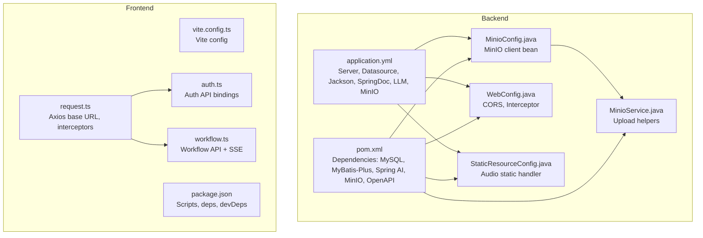
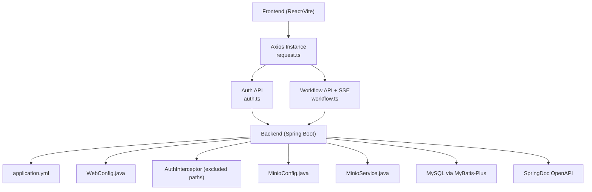
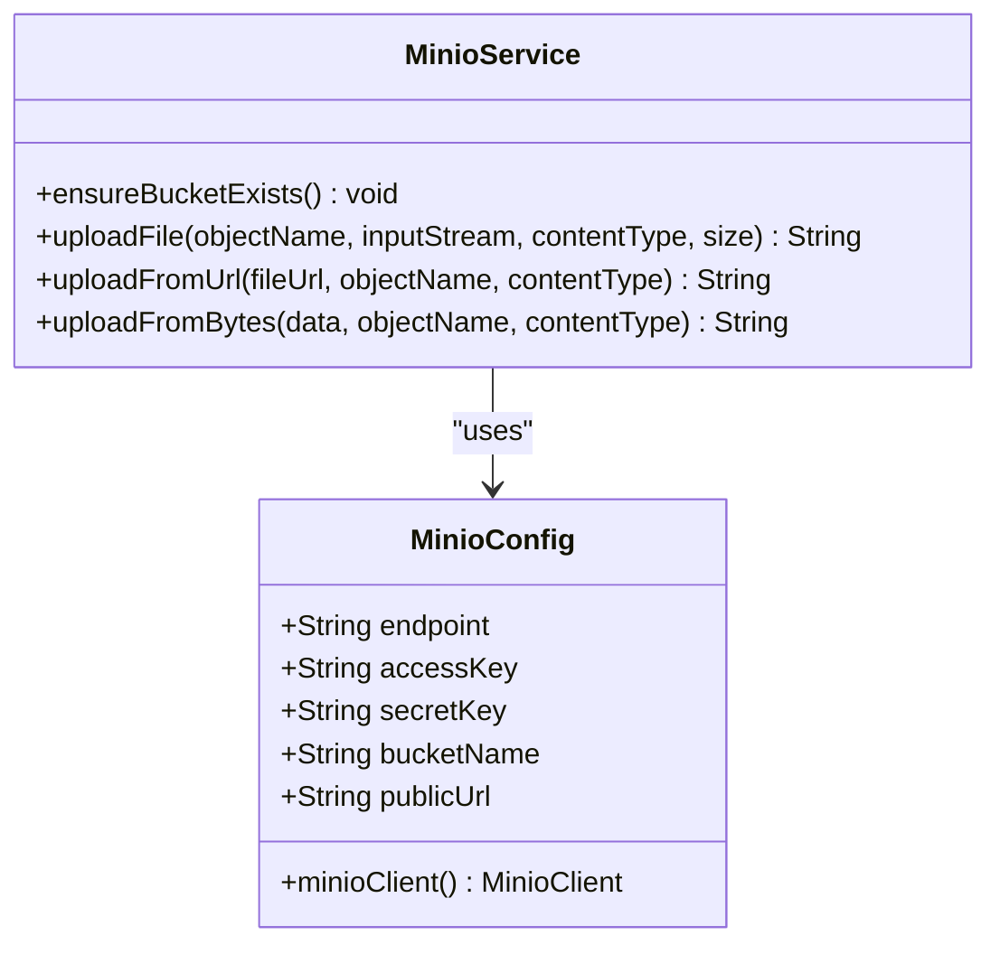
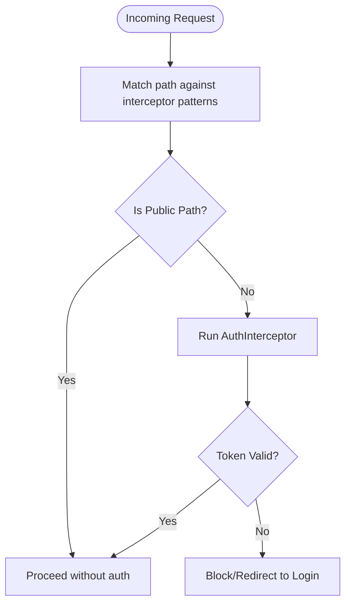
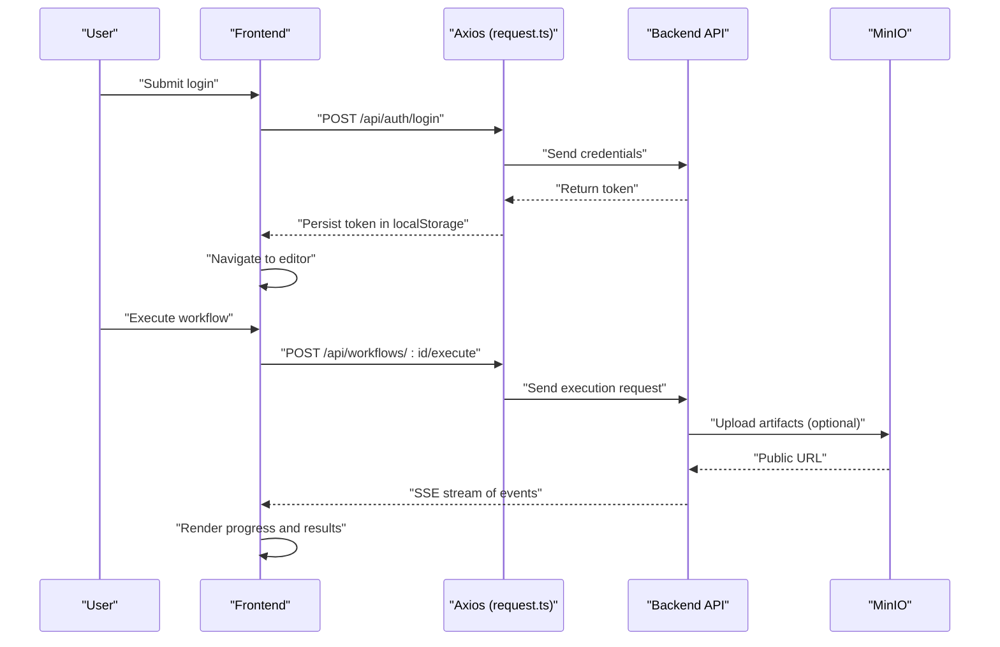
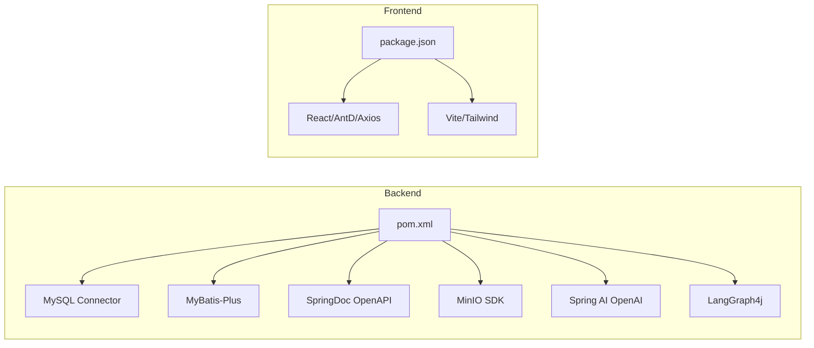

# Configuration & Setup

<cite>
**Referenced Files in This Document**
- [application.yml](file://backend/src/main/resources/application.yml)
- [MinioConfig.java](file://backend/src/main/java/com/paiagent/config/MinioConfig.java)
- [MinioService.java](file://backend/src/main/java/com/paiagent/service/MinioService.java)
- [WebConfig.java](file://backend/src/main/java/com/paiagent/config/WebConfig.java)
- [StaticResourceConfig.java](file://backend/src/main/java/com/paiagent/config/StaticResourceConfig.java)
- [pom.xml](file://backend/pom.xml)
- [vite.config.ts](file://frontend/vite.config.ts)
- [package.json](file://frontend/package.json)
- [request.ts](file://frontend/src/utils/request.ts)
- [auth.ts](file://frontend/src/api/auth.ts)
- [workflow.ts](file://frontend/src/api/workflow.ts)
</cite>

## Table of Contents
1. [Introduction](#introduction)
2. [Project Structure](#project-structure)
3. [Core Components](#core-components)
4. [Architecture Overview](#architecture-overview)
5. [Detailed Component Analysis](#detailed-component-analysis)
6. [Dependency Analysis](#dependency-analysis)
7. [Performance Considerations](#performance-considerations)
8. [Troubleshooting Guide](#troubleshooting-guide)
9. [Conclusion](#conclusion)
10. [Appendices](#appendices)

## Introduction
This document provides comprehensive configuration and setup guidance for both the backend Spring Boot application and the frontend Vite React application. It covers database connectivity, LLM provider configuration, security settings, static resource serving, MinIO object storage, and frontend environment and build settings. It also includes production deployment considerations, environment-specific configuration strategies, and troubleshooting tips for common configuration issues.

## Project Structure
The project consists of:
- Backend: Spring Boot application with YAML configuration, Java configuration classes, and Maven dependencies.
- Frontend: Vite-powered React application with TypeScript, Axios for HTTP requests, and environment-driven base URLs.

**Diagram sources**
- [application.yml:1-55](file://backend/src/main/resources/application.yml#L1-L55)
- [MinioConfig.java:1-28](file://backend/src/main/java/com/paiagent/config/MinioConfig.java#L1-L28)
- [MinioService.java:1-102](file://backend/src/main/java/com/paiagent/service/MinioService.java#L1-L102)
- [WebConfig.java:1-35](file://backend/src/main/java/com/paiagent/config/WebConfig.java#L1-L35)
- [StaticResourceConfig.java:1-25](file://backend/src/main/java/com/paiagent/config/StaticResourceConfig.java#L1-L25)
- [pom.xml:1-163](file://backend/pom.xml#L1-L163)
- [vite.config.ts:1-8](file://frontend/vite.config.ts#L1-L8)
- [package.json:1-40](file://frontend/package.json#L1-L40)
- [request.ts:1-49](file://frontend/src/utils/request.ts#L1-L49)
- [auth.ts:1-41](file://frontend/src/api/auth.ts#L1-L41)
- [workflow.ts:1-177](file://frontend/src/api/workflow.ts#L1-L177)

**Section sources**
- [application.yml:1-55](file://backend/src/main/resources/application.yml#L1-L55)
- [pom.xml:1-163](file://backend/pom.xml#L1-L163)
- [vite.config.ts:1-8](file://frontend/vite.config.ts#L1-L8)
- [package.json:1-40](file://frontend/package.json#L1-L40)

## Core Components
- Backend server and database:
  - Server port, datasource driver, URL, credentials, and timezone/date formatting are configured in the backend YAML.
  - MyBatis-Plus mapper locations, type aliases, and logging are configured.
  - SpringDoc OpenAPI is enabled with custom paths and info metadata.
- LLM provider settings:
  - OpenAI provider configuration includes base URL and an API key placeholder resolved from an environment variable.
- Security and CORS:
  - CORS allows localhost origins and credentials.
  - An authentication interceptor applies to protected API paths while excluding public endpoints.
- Static resources:
  - Audio files are served from a local directory mapped under a specific path.
- MinIO object storage:
  - MinIO client bean is created from YAML properties.
  - Service ensures bucket existence and supports uploads from streams, URLs, and byte arrays.
- Frontend:
  - Vite configuration enables React plugin.
  - Axios instance sets base URL and handles token injection and 401 handling.
  - API modules define endpoints for authentication and workflow execution.

**Section sources**
- [application.yml:1-55](file://backend/src/main/resources/application.yml#L1-L55)
- [WebConfig.java:1-35](file://backend/src/main/java/com/paiagent/config/WebConfig.java#L1-L35)
- [StaticResourceConfig.java:1-25](file://backend/src/main/java/com/paiagent/config/StaticResourceConfig.java#L1-L25)
- [MinioConfig.java:1-28](file://backend/src/main/java/com/paiagent/config/MinioConfig.java#L1-L28)
- [MinioService.java:1-102](file://backend/src/main/java/com/paiagent/service/MinioService.java#L1-L102)
- [vite.config.ts:1-8](file://frontend/vite.config.ts#L1-L8)
- [request.ts:1-49](file://frontend/src/utils/request.ts#L1-L49)
- [auth.ts:1-41](file://frontend/src/api/auth.ts#L1-L41)
- [workflow.ts:1-177](file://frontend/src/api/workflow.ts#L1-L177)

## Architecture Overview
The backend exposes REST APIs consumed by the frontend. Authentication tokens are stored locally and attached to requests. SSE is used for streaming workflow execution events. Static audio assets are served locally. File uploads leverage MinIO for persistent storage.

**Diagram sources**
- [request.ts:1-49](file://frontend/src/utils/request.ts#L1-L49)
- [auth.ts:1-41](file://frontend/src/api/auth.ts#L1-L41)
- [workflow.ts:1-177](file://frontend/src/api/workflow.ts#L1-L177)
- [application.yml:1-55](file://backend/src/main/resources/application.yml#L1-L55)
- [WebConfig.java:1-35](file://backend/src/main/java/com/paiagent/config/WebConfig.java#L1-L35)
- [MinioConfig.java:1-28](file://backend/src/main/java/com/paiagent/config/MinioConfig.java#L1-L28)
- [MinioService.java:1-102](file://backend/src/main/java/com/paiagent/service/MinioService.java#L1-L102)
- [pom.xml:1-163](file://backend/pom.xml#L1-L163)

## Detailed Component Analysis

### Backend Configuration: application.yml
- Server
  - Port is set for the HTTP server.
- Spring Application
  - Application name is defined.
- Datasource
  - JDBC driver, connection URL, username, and password are configured.
  - Timezone and date format are set for serialization.
- MyBatis-Plus
  - Mapper locations, type aliases package, underscore-to-camel mapping, caching, logging, and global DB config (including logic delete field) are configured.
- SpringDoc OpenAPI
  - API docs and Swagger UI are enabled with custom paths and informational metadata.
- LLM Provider (OpenAI)
  - Base URL is set; API key is resolved from an environment variable with a placeholder value.
- MinIO
  - Endpoint, access key, secret key, bucket name, and public URL are configured.

**Section sources**
- [application.yml:1-55](file://backend/src/main/resources/application.yml#L1-L55)

### MinIO Configuration and Service
- MinioConfig
  - Reads properties under the "minio" prefix and creates a MinioClient bean using endpoint and credentials.
- MinioService
  - Ensures the bucket exists during first use.
  - Provides upload methods from InputStream, URL, and byte array.
  - Returns a public URL constructed from the configured public URL and bucket name.

**Diagram sources**
- [MinioConfig.java:1-28](file://backend/src/main/java/com/paiagent/config/MinioConfig.java#L1-L28)
- [MinioService.java:1-102](file://backend/src/main/java/com/paiagent/service/MinioService.java#L1-L102)

**Section sources**
- [MinioConfig.java:1-28](file://backend/src/main/java/com/paiagent/config/MinioConfig.java#L1-L28)
- [MinioService.java:1-102](file://backend/src/main/java/com/paiagent/service/MinioService.java#L1-L102)

### Security and CORS Configuration
- WebConfig
  - Adds CORS allowing localhost origin patterns with credentials and broad headers/methods.
  - Registers an authentication interceptor for protected paths while excluding public endpoints such as login, current user, node types, and OpenAPI UI endpoints.

**Diagram sources**
- [WebConfig.java:1-35](file://backend/src/main/java/com/paiagent/config/WebConfig.java#L1-L35)

**Section sources**
- [WebConfig.java:1-35](file://backend/src/main/java/com/paiagent/config/WebConfig.java#L1-L35)

### Static Resource Serving for Audio
- StaticResourceConfig
  - Maps "/audio/**" to a local directory named "audio_output" using an absolute path.
  - Enables clients to fetch generated audio files directly from the backend.

**Section sources**
- [StaticResourceConfig.java:1-25](file://backend/src/main/java/com/paiagent/config/StaticResourceConfig.java#L1-L25)

### Frontend Configuration: Vite and Environment
- Vite Config
  - Uses the React plugin; no additional build-time transforms are configured.
- Package Scripts
  - Provides scripts for development, build, linting, and preview.
- Dependencies and Dev Dependencies
  - Includes React, Ant Design, Axios, React Router, Zustand, TypeScript, Vite, TailwindCSS, and related tooling.
- Axios Base Configuration
  - Sets the base URL to the backend server, timeout, and JSON content type.
  - Injects Authorization header from localStorage token.
  - Handles 401 by clearing token and redirecting to login.
- API Modules
  - Auth module defines login, logout, and current user endpoints.
  - Workflow module defines CRUD endpoints and SSE-based streaming execution with event listeners for workflow lifecycle events.

**Diagram sources**
- [request.ts:1-49](file://frontend/src/utils/request.ts#L1-L49)
- [auth.ts:1-41](file://frontend/src/api/auth.ts#L1-L41)
- [workflow.ts:1-177](file://frontend/src/api/workflow.ts#L1-L177)
- [MinioService.java:1-102](file://backend/src/main/java/com/paiagent/service/MinioService.java#L1-L102)

**Section sources**
- [vite.config.ts:1-8](file://frontend/vite.config.ts#L1-L8)
- [package.json:1-40](file://frontend/package.json#L1-L40)
- [request.ts:1-49](file://frontend/src/utils/request.ts#L1-L49)
- [auth.ts:1-41](file://frontend/src/api/auth.ts#L1-L41)
- [workflow.ts:1-177](file://frontend/src/api/workflow.ts#L1-L177)

## Dependency Analysis
- Backend dependencies relevant to configuration:
  - MySQL Connector/J for database connectivity.
  - MyBatis-Plus starter for ORM and SQL mapping.
  - SpringDoc OpenAPI for API documentation.
  - MinIO Java SDK for object storage.
  - Spring AI OpenAI starter for LLM integrations.
  - LangGraph4j core and Spring AI integration for workflow execution.
- Frontend dependencies relevant to configuration:
  - React, Axios, React Router, Ant Design, Zustand, TypeScript, Vite, TailwindCSS.

**Diagram sources**
- [pom.xml:1-163](file://backend/pom.xml#L1-L163)
- [package.json:1-40](file://frontend/package.json#L1-L40)

**Section sources**
- [pom.xml:1-163](file://backend/pom.xml#L1-L163)
- [package.json:1-40](file://frontend/package.json#L1-L40)

## Performance Considerations
- Backend
  - Disable MyBatis logging in production by adjusting the logging configuration to reduce overhead.
  - Tune datasource connection pool settings externally if needed.
  - Consider enabling gzip compression and setting appropriate timeouts for SSE streaming.
- Frontend
  - Build with production mode to enable minification and tree-shaking.
  - Use lazy loading for heavy components and split bundles appropriately.
  - Avoid unnecessary re-renders by leveraging state libraries and memoization.

## Troubleshooting Guide
- Backend YAML misconfiguration
  - Symptom: Application fails to start or connects to wrong database.
  - Action: Verify datasource URL, credentials, and timezone/date format; confirm MyBatis-Plus mapper locations and type aliases.
  - Reference: [application.yml:1-55](file://backend/src/main/resources/application.yml#L1-L55)
- LLM API key not applied
  - Symptom: LLM calls fail due to missing or invalid key.
  - Action: Set the environment variable containing the API key; ensure the placeholder is overridden in the runtime environment.
  - Reference: [application.yml:15-20](file://backend/src/main/resources/application.yml#L15-L20)
- CORS errors in browser
  - Symptom: Preflight or credential requests blocked.
  - Action: Confirm allowed origins include the frontend origin pattern and credentials are permitted.
  - Reference: [WebConfig.java:19-27](file://backend/src/main/java/com/paiagent/config/WebConfig.java#L19-L27)
- Authentication interceptor blocking legitimate requests
  - Symptom: Public endpoints like login or Swagger UI are unexpectedly protected.
  - Action: Review excluded paths in the interceptor registration.
  - Reference: [WebConfig.java:29-34](file://backend/src/main/java/com/paiagent/config/WebConfig.java#L29-L34)
- Audio files not accessible
  - Symptom: 404 for /audio/** resources.
  - Action: Ensure the "audio_output" directory exists and is writable; verify the static resource mapping path.
  - Reference: [StaticResourceConfig.java:14-24](file://backend/src/main/java/com/paiagent/config/StaticResourceConfig.java#L14-L24)
- MinIO upload failures
  - Symptom: Uploads fail or bucket creation errors occur.
  - Action: Validate endpoint, access key, secret key, and bucket name; ensure network connectivity and permissions; confirm public URL is reachable.
  - Reference: [MinioConfig.java:10-26](file://backend/src/main/java/com/paiagent/config/MinioConfig.java#L10-L26), [MinioService.java:26-86](file://backend/src/main/java/com/paiagent/service/MinioService.java#L26-L86)
- Frontend cannot reach backend
  - Symptom: Network errors or CORS failures.
  - Action: Confirm Axios base URL matches backend host/port; adjust if running behind a proxy or reverse proxy.
  - Reference: [request.ts:6-12](file://frontend/src/utils/request.ts#L6-L12)
- SSE connection drops or unauthorized
  - Symptom: Events stop mid-execution or immediate redirect to login.
  - Action: Ensure token is present and valid; verify backend SSE endpoint and token handling; handle onerror and close gracefully.
  - Reference: [workflow.ts:96-177](file://frontend/src/api/workflow.ts#L96-L177)

**Section sources**
- [application.yml:1-55](file://backend/src/main/resources/application.yml#L1-L55)
- [WebConfig.java:1-35](file://backend/src/main/java/com/paiagent/config/WebConfig.java#L1-L35)
- [StaticResourceConfig.java:1-25](file://backend/src/main/java/com/paiagent/config/StaticResourceConfig.java#L1-L25)
- [MinioConfig.java:1-28](file://backend/src/main/java/com/paiagent/config/MinioConfig.java#L1-L28)
- [MinioService.java:1-102](file://backend/src/main/java/com/paiagent/service/MinioService.java#L1-L102)
- [request.ts:1-49](file://frontend/src/utils/request.ts#L1-L49)
- [workflow.ts:1-177](file://frontend/src/api/workflow.ts#L1-L177)

## Conclusion
This guide consolidates backend and frontend configuration essentials for the platform. Backend settings cover server, database, LLM providers, security, static resources, and MinIO. Frontend settings focus on Vite configuration, environment-driven base URLs, and API integration. Production readiness requires validating environment variables, securing secrets, tuning performance, and implementing robust error handling and monitoring.

## Appendices

### Environment Variables and Secrets
- OPENAI_API_KEY
  - Purpose: Used by the LLM provider configuration.
  - Scope: Resolved from the environment and injected into the backend configuration.
  - Reference: [application.yml:15-20](file://backend/src/main/resources/application.yml#L15-L20)

### Production Deployment Checklist
- Backend
  - Externalize sensitive properties (database credentials, MinIO keys, API keys) via environment variables.
  - Configure SSL/TLS termination at the load balancer or container ingress.
  - Set JVM memory and GC options appropriate for workload.
  - Enable gzip compression and health checks.
- Frontend
  - Build with production mode and serve via a CDN or web server.
  - Lock dependency versions and audit for vulnerabilities.
  - Configure HTTPS and secure cookies if applicable.
- Storage
  - Ensure MinIO runs on a separate host or container with restricted network access.
  - Use IAM policies and bucket-level permissions to limit exposure.

### Validation Strategies
- Backend
  - Start the application and verify:
    - OpenAPI UI is accessible at the configured path.
    - Database migrations and schema are applied.
    - MinIO client initializes and bucket exists.
  - Test endpoints:
    - Public endpoints (e.g., node types, OpenAPI paths) should be accessible without authentication.
    - Protected endpoints require a valid token.
- Frontend
  - Confirm Axios base URL resolves to the backend.
  - Validate authentication flow and token persistence.
  - Test SSE streaming for workflow execution and verify event handling.