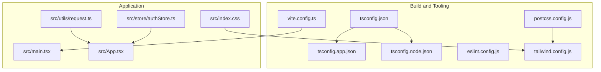
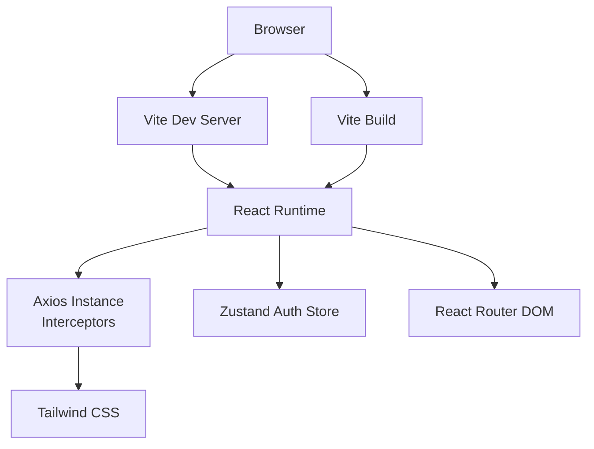
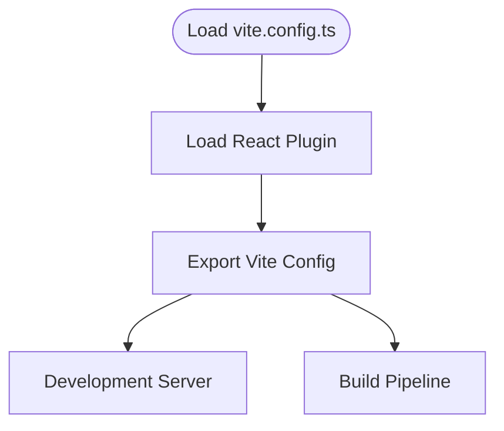
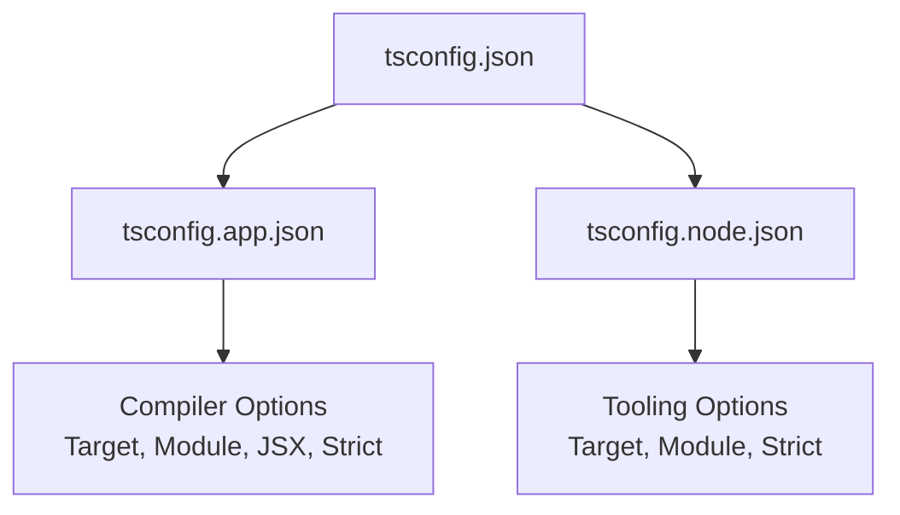
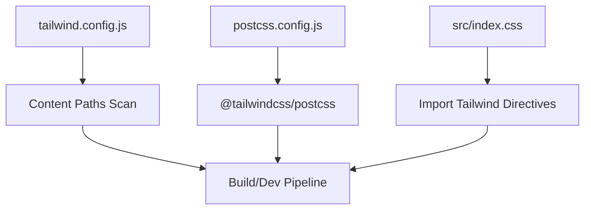
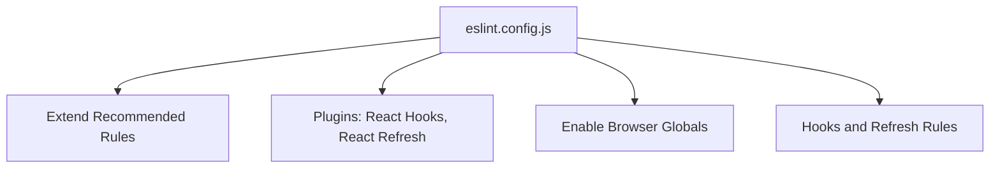
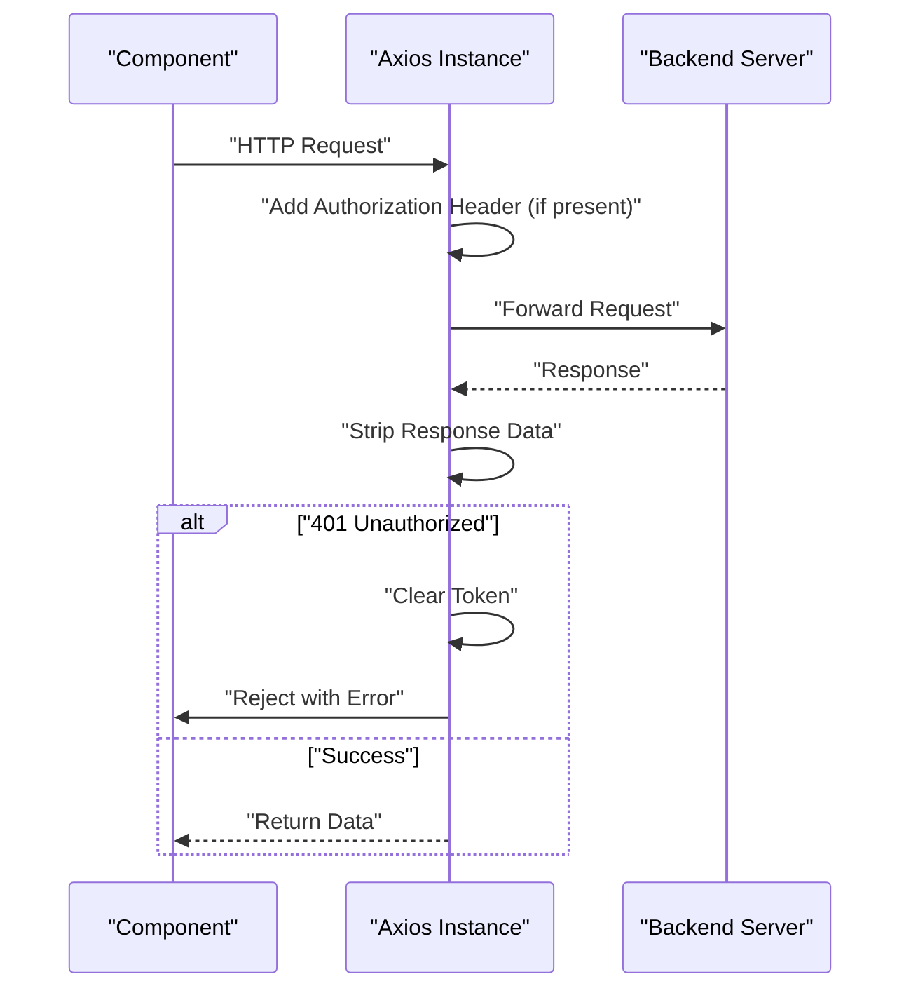
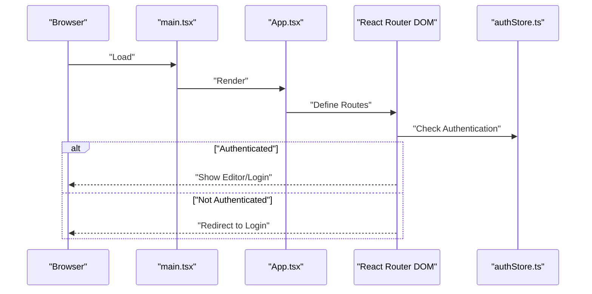
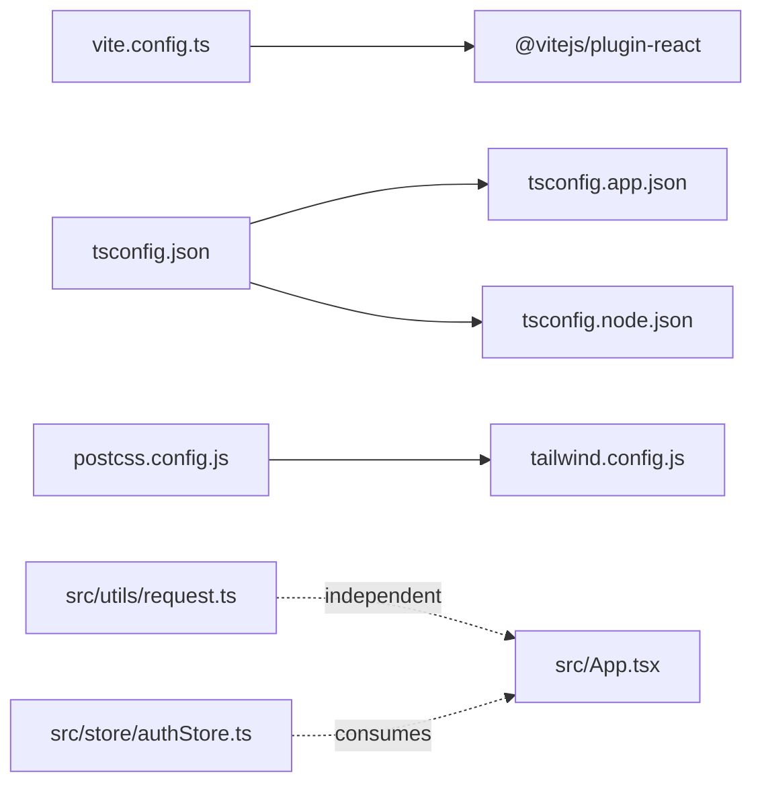

# Frontend Configuration

<cite>
**Referenced Files in This Document**
- [package.json](file://frontend/package.json)
- [vite.config.ts](file://frontend/vite.config.ts)
- [tsconfig.json](file://frontend/tsconfig.json)
- [tsconfig.app.json](file://frontend/tsconfig.app.json)
- [tsconfig.node.json](file://frontend/tsconfig.node.json)
- [tailwind.config.js](file://frontend/tailwind.config.js)
- [postcss.config.js](file://frontend/postcss.config.js)
- [eslint.config.js](file://frontend/eslint.config.js)
- [src/utils/request.ts](file://frontend/src/utils/request.ts)
- [src/main.tsx](file://frontend/src/main.tsx)
- [src/index.css](file://frontend/src/index.css)
- [src/App.tsx](file://frontend/src/App.tsx)
- [src/store/authStore.ts](file://frontend/src/store/authStore.ts)
</cite>

## Table of Contents
1. [Introduction](#introduction)
2. [Project Structure](#project-structure)
3. [Core Components](#core-components)
4. [Architecture Overview](#architecture-overview)
5. [Detailed Component Analysis](#detailed-component-analysis)
6. [Dependency Analysis](#dependency-analysis)
7. [Performance Considerations](#performance-considerations)
8. [Troubleshooting Guide](#troubleshooting-guide)
9. [Conclusion](#conclusion)

## Introduction
This document provides comprehensive frontend configuration documentation for the project's Vite-powered React application. It covers build configuration, TypeScript settings, Tailwind CSS setup, environment variables, proxy configurations for API requests, build optimization settings, development server configuration, package dependencies and scripts, linting rules, and deployment considerations. Guidance is included for customizing the build process and troubleshooting common frontend build issues.

## Project Structure
The frontend is organized under the frontend directory with the following key configuration and source files:
- Build and tooling: Vite configuration, TypeScript configurations, ESLint configuration, PostCSS/Tailwind configuration
- Application entry points: React root and application shell
- Networking: Axios-based HTTP client with interceptors
- State management: Zustand store for authentication
- Styling: Tailwind CSS integration via PostCSS

**Diagram sources**
- [vite.config.ts:1-8](file://frontend/vite.config.ts#L1-L8)
- [tsconfig.json:1-8](file://frontend/tsconfig.json#L1-L8)
- [tsconfig.app.json:1-27](file://frontend/tsconfig.app.json#L1-L27)
- [tsconfig.node.json:1-25](file://frontend/tsconfig.node.json#L1-L25)
- [eslint.config.js:1-29](file://frontend/eslint.config.js#L1-L29)
- [postcss.config.js:1-6](file://frontend/postcss.config.js#L1-L6)
- [tailwind.config.js:1-13](file://frontend/tailwind.config.js#L1-L13)
- [src/main.tsx:1-11](file://frontend/src/main.tsx#L1-L11)
- [src/App.tsx:1-24](file://frontend/src/App.tsx#L1-L24)
- [src/index.css:1-8](file://frontend/src/index.css#L1-L8)
- [src/utils/request.ts:1-49](file://frontend/src/utils/request.ts#L1-L49)
- [src/store/authStore.ts:1-31](file://frontend/src/store/authStore.ts#L1-L31)

**Section sources**
- [package.json:1-40](file://frontend/package.json#L1-L40)
- [vite.config.ts:1-8](file://frontend/vite.config.ts#L1-L8)
- [tsconfig.json:1-8](file://frontend/tsconfig.json#L1-L8)
- [tsconfig.app.json:1-27](file://frontend/tsconfig.app.json#L1-L27)
- [tsconfig.node.json:1-25](file://frontend/tsconfig.node.json#L1-L25)
- [eslint.config.js:1-29](file://frontend/eslint.config.js#L1-L29)
- [postcss.config.js:1-6](file://frontend/postcss.config.js#L1-L6)
- [tailwind.config.js:1-13](file://frontend/tailwind.config.js#L1-L13)
- [src/main.tsx:1-11](file://frontend/src/main.tsx#L1-L11)
- [src/App.tsx:1-24](file://frontend/src/App.tsx#L1-L24)
- [src/index.css:1-8](file://frontend/src/index.css#L1-L8)
- [src/utils/request.ts:1-49](file://frontend/src/utils/request.ts#L1-L49)
- [src/store/authStore.ts:1-31](file://frontend/src/store/authStore.ts#L1-L31)

## Core Components
- Vite configuration: Minimal React plugin setup for JSX transform and fast refresh
- TypeScript configuration: Split tsconfig.app.json for application code and tsconfig.node.json for tooling/Vite config
- Tailwind CSS: Content scanning paths and PostCSS pipeline integration
- ESLint: TypeScript-aware linting with React Hooks and React Refresh plugins
- HTTP client: Axios instance with base URL, timeout, interceptors, and auth token injection
- Routing and UI: React Router DOM with Ant Design provider and locale configuration

**Section sources**
- [vite.config.ts:1-8](file://frontend/vite.config.ts#L1-L8)
- [tsconfig.app.json:1-27](file://frontend/tsconfig.app.json#L1-L27)
- [tsconfig.node.json:1-25](file://frontend/tsconfig.node.json#L1-L25)
- [tailwind.config.js:1-13](file://frontend/tailwind.config.js#L1-L13)
- [postcss.config.js:1-6](file://frontend/postcss.config.js#L1-L6)
- [eslint.config.js:1-29](file://frontend/eslint.config.js#L1-L29)
- [src/utils/request.ts:1-49](file://frontend/src/utils/request.ts#L1-L49)
- [src/App.tsx:1-24](file://frontend/src/App.tsx#L1-L24)

## Architecture Overview
The frontend architecture integrates Vite for development and build, TypeScript for type safety, Tailwind CSS for styling, and React for UI composition. Axios handles HTTP communication with centralized interceptors for authentication and error handling. Zustand manages lightweight application state, and Ant Design provides UI components with locale support.

**Diagram sources**
- [vite.config.ts:1-8](file://frontend/vite.config.ts#L1-L8)
- [src/main.tsx:1-11](file://frontend/src/main.tsx#L1-L11)
- [src/App.tsx:1-24](file://frontend/src/App.tsx#L1-L24)
- [src/utils/request.ts:1-49](file://frontend/src/utils/request.ts#L1-L49)
- [src/store/authStore.ts:1-31](file://frontend/src/store/authStore.ts#L1-L31)
- [tailwind.config.js:1-13](file://frontend/tailwind.config.js#L1-L13)

## Detailed Component Analysis

### Vite Configuration
- Purpose: Configure the development server and build pipeline with React plugin
- Plugins: React plugin for JSX transform and fast refresh
- Extensibility: Add aliases, environment variables, and build optimization flags as needed

**Diagram sources**
- [vite.config.ts:1-8](file://frontend/vite.config.ts#L1-L8)

**Section sources**
- [vite.config.ts:1-8](file://frontend/vite.config.ts#L1-L8)

### TypeScript Configuration
- Root tsconfig.json: References app and node configurations
- tsconfig.app.json: Targets modern browsers, bundler module resolution, strictness, and JSX transform
- tsconfig.node.json: Targets Node tooling, bundler module resolution, and strictness

**Diagram sources**
- [tsconfig.json:1-8](file://frontend/tsconfig.json#L1-L8)
- [tsconfig.app.json:1-27](file://frontend/tsconfig.app.json#L1-L27)
- [tsconfig.node.json:1-25](file://frontend/tsconfig.node.json#L1-L25)

**Section sources**
- [tsconfig.json:1-8](file://frontend/tsconfig.json#L1-L8)
- [tsconfig.app.json:1-27](file://frontend/tsconfig.app.json#L1-L27)
- [tsconfig.node.json:1-25](file://frontend/tsconfig.node.json#L1-L25)

### Tailwind CSS Setup
- Content paths: Scans index.html and all TypeScript/JavaScript files under src
- Theme extension: Empty extension point for future customization
- PostCSS pipeline: Uses @tailwindcss/postcss plugin
- Global styles: Imports Tailwind directives in index.css

**Diagram sources**
- [tailwind.config.js:1-13](file://frontend/tailwind.config.js#L1-L13)
- [postcss.config.js:1-6](file://frontend/postcss.config.js#L1-L6)
- [src/index.css:1-8](file://frontend/src/index.css#L1-L8)

**Section sources**
- [tailwind.config.js:1-13](file://frontend/tailwind.config.js#L1-L13)
- [postcss.config.js:1-6](file://frontend/postcss.config.js#L1-L6)
- [src/index.css:1-8](file://frontend/src/index.css#L1-L8)

### ESLint Configuration
- Extends: Recommended rules for JavaScript and TypeScript
- Plugins: React Hooks, React Refresh
- Globals: Browser globals enabled
- Rules: Enforces hooks rules and restricts export components for refresh

**Diagram sources**
- [eslint.config.js:1-29](file://frontend/eslint.config.js#L1-L29)

**Section sources**
- [eslint.config.js:1-29](file://frontend/eslint.config.js#L1-L29)

### HTTP Client and Proxy Configuration
- Axios instance: Base URL configured to a local backend endpoint
- Interceptors:
  - Request: Injects Authorization header from localStorage token
  - Response: Handles 401 by clearing token and redirecting to login
- Proxy considerations: No Vite proxy is configured; adjust baseURL for different environments

**Diagram sources**
- [src/utils/request.ts:1-49](file://frontend/src/utils/request.ts#L1-L49)

**Section sources**
- [src/utils/request.ts:1-49](file://frontend/src/utils/request.ts#L1-L49)

### Application Entry Points and Routing
- Entry point: Creates React root and renders the App component
- App shell: Configures Ant Design locale, React Router routes, and protected/public routes
- Authentication store: Manages token, username, and authentication state with localStorage persistence

**Diagram sources**
- [src/main.tsx:1-11](file://frontend/src/main.tsx#L1-L11)
- [src/App.tsx:1-24](file://frontend/src/App.tsx#L1-L24)
- [src/store/authStore.ts:1-31](file://frontend/src/store/authStore.ts#L1-L31)

**Section sources**
- [src/main.tsx:1-11](file://frontend/src/main.tsx#L1-L11)
- [src/App.tsx:1-24](file://frontend/src/App.tsx#L1-L24)
- [src/store/authStore.ts:1-31](file://frontend/src/store/authStore.ts#L1-L31)

### Package Dependencies and Scripts
- Scripts:
  - dev: Start Vite development server
  - build: Run TypeScript project references then Vite build
  - lint: Run ESLint
  - preview: Preview built bundle locally
- Dependencies: React, React DOM, React Router DOM, Ant Design, Axios, Zustand, and React Flow
- Dev Dependencies: Vite, React plugin, TypeScript, Tailwind CSS, PostCSS, ESLint, and related plugins

**Section sources**
- [package.json:1-40](file://frontend/package.json#L1-L40)

## Dependency Analysis
The frontend configuration exhibits low coupling and high cohesion:
- Vite depends on the React plugin for JSX transform
- TypeScript configurations are decoupled via references
- Tailwind relies on PostCSS and content scanning
- Axios encapsulates HTTP concerns independently of routing/state
- Zustand provides isolated state management

**Diagram sources**
- [vite.config.ts:1-8](file://frontend/vite.config.ts#L1-L8)
- [tsconfig.json:1-8](file://frontend/tsconfig.json#L1-L8)
- [tsconfig.app.json:1-27](file://frontend/tsconfig.app.json#L1-L27)
- [tsconfig.node.json:1-25](file://frontend/tsconfig.node.json#L1-L25)
- [postcss.config.js:1-6](file://frontend/postcss.config.js#L1-L6)
- [tailwind.config.js:1-13](file://frontend/tailwind.config.js#L1-L13)
- [src/utils/request.ts:1-49](file://frontend/src/utils/request.ts#L1-L49)
- [src/App.tsx:1-24](file://frontend/src/App.tsx#L1-L24)
- [src/store/authStore.ts:1-31](file://frontend/src/store/authStore.ts#L1-L31)

**Section sources**
- [vite.config.ts:1-8](file://frontend/vite.config.ts#L1-L8)
- [tsconfig.json:1-8](file://frontend/tsconfig.json#L1-L8)
- [tsconfig.app.json:1-27](file://frontend/tsconfig.app.json#L1-L27)
- [tsconfig.node.json:1-25](file://frontend/tsconfig.node.json#L1-L25)
- [postcss.config.js:1-6](file://frontend/postcss.config.js#L1-L6)
- [tailwind.config.js:1-13](file://frontend/tailwind.config.js#L1-L13)
- [src/utils/request.ts:1-49](file://frontend/src/utils/request.ts#L1-L49)
- [src/App.tsx:1-24](file://frontend/src/App.tsx#L1-L24)
- [src/store/authStore.ts:1-31](file://frontend/src/store/authStore.ts#L1-L31)

## Performance Considerations
- Build optimization: Leverage Vite’s native tree-shaking and on-demand compilation. Consider adding external libraries to optimize chunking if bundle size grows.
- Asset optimization: Enable compression in production builds and configure asset hashing if needed.
- Browser compatibility: Target modern browsers aligned with React and TypeScript settings; avoid polyfills unless legacy support is required.
- Development server: Use Vite’s fast refresh and minimal dev server overhead; disable unnecessary plugins in development.

## Troubleshooting Guide
Common issues and resolutions:
- Axios baseURL mismatch: Update the base URL in the HTTP client to match the backend endpoint for the current environment.
- 401 errors during development: Verify token storage and interceptor logic; ensure tokens are persisted and refreshed appropriately.
- Tailwind classes not applied: Confirm content paths in Tailwind config include all relevant files and rebuild after changes.
- TypeScript errors in Vite: Ensure bundler module resolution and JSX settings align with Vite; verify tsconfig references are intact.
- ESLint errors: Address hook and refresh rules; confirm TypeScript files are included in linting scope.

**Section sources**
- [src/utils/request.ts:1-49](file://frontend/src/utils/request.ts#L1-L49)
- [tailwind.config.js:1-13](file://frontend/tailwind.config.js#L1-L13)
- [tsconfig.app.json:1-27](file://frontend/tsconfig.app.json#L1-L27)
- [eslint.config.js:1-29](file://frontend/eslint.config.js#L1-L29)

## Conclusion
The frontend configuration establishes a modern, type-safe, and efficient development environment using Vite, TypeScript, Tailwind CSS, and React. The setup supports rapid iteration with robust linting and a clean HTTP client with interceptors. By understanding the configuration files and their relationships, teams can customize the build process, integrate environment-specific settings, and troubleshoot issues effectively.