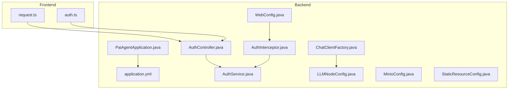
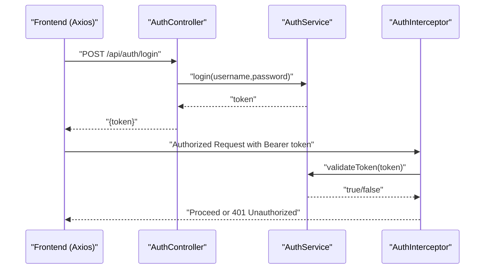
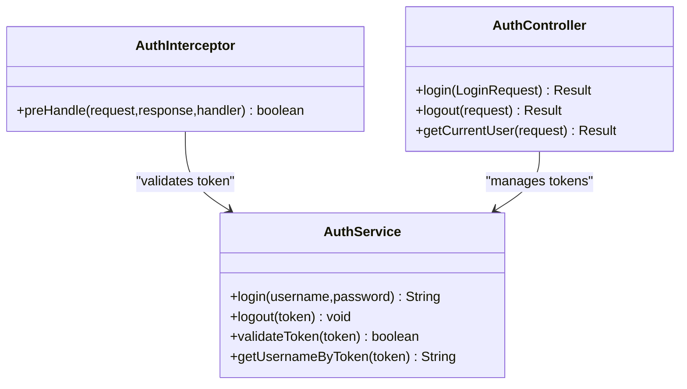
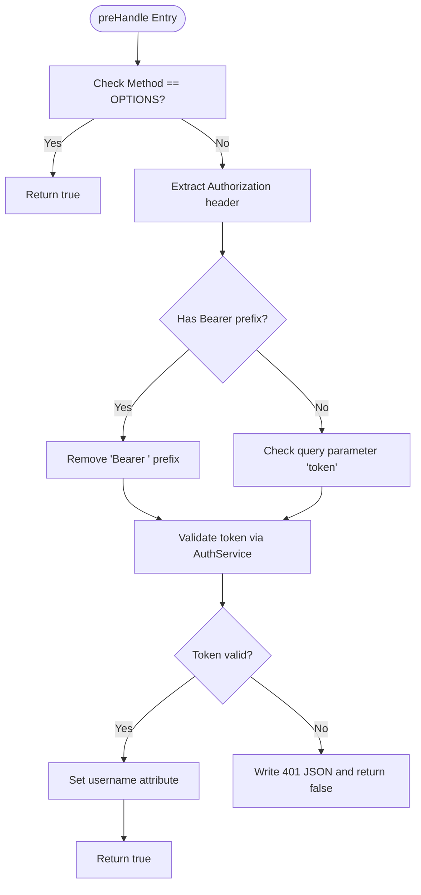
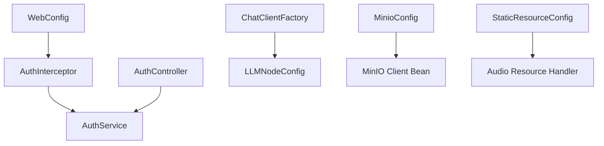

# Security Configuration

<cite>
**Referenced Files in This Document**
- [PaiAgentApplication.java](file://backend/src/main/java/com/paiagent/PaiAgentApplication.java)
- [application.yml](file://backend/src/main/resources/application.yml)
- [WebConfig.java](file://backend/src/main/java/com/paiagent/config/WebConfig.java)
- [AuthInterceptor.java](file://backend/src/main/java/com/paiagent/interceptor/AuthInterceptor.java)
- [AuthService.java](file://backend/src/main/java/com/paiagent/service/AuthService.java)
- [AuthController.java](file://backend/src/main/java/com/paiagent/controller/AuthController.java)
- [StaticResourceConfig.java](file://backend/src/main/java/com/paiagent/config/StaticResourceConfig.java)
- [MinioConfig.java](file://backend/src/main/java/com/paiagent/config/MinioConfig.java)
- [ChatClientFactory.java](file://backend/src/main/java/com/paiagent/engine/llm/ChatClientFactory.java)
- [LLMNodeConfig.java](file://backend/src/main/java/com/paiagent/engine/llm/LLMNodeConfig.java)
- [request.ts](file://frontend/src/utils/request.ts)
- [auth.ts](file://frontend/src/api/auth.ts)
</cite>

## Table of Contents
1. [Introduction](#introduction)
2. [Project Structure](#project-structure)
3. [Core Components](#core-components)
4. [Architecture Overview](#architecture-overview)
5. [Detailed Component Analysis](#detailed-component-analysis)
6. [Dependency Analysis](#dependency-analysis)
7. [Performance Considerations](#performance-considerations)
8. [Troubleshooting Guide](#troubleshooting-guide)
9. [Conclusion](#conclusion)
10. [Appendices](#appendices)

## Introduction
This document provides comprehensive security configuration guidance for the backend and frontend components. It covers authentication and authorization setup, JWT token handling, CORS configuration, CSRF considerations, security headers, authentication interceptors, role-based access control patterns, LLM provider API key security, encrypted storage configuration, secure communication settings, best practices, vulnerability mitigations, compliance considerations, and monitoring recommendations.

## Project Structure
The security-relevant backend modules include:
- Application bootstrap and configuration
- Web MVC configuration (CORS and interceptors)
- Authentication controller and service
- Interceptor for request authentication
- LLM client factory and configuration DTO
- MinIO configuration for object storage
- Static resource serving for audio assets

The frontend module includes:
- Axios instance with request/response interceptors
- Authentication API bindings

**Diagram sources**
- [PaiAgentApplication.java:1-16](file://backend/src/main/java/com/paiagent/PaiAgentApplication.java#L1-L16)
- [application.yml:1-55](file://backend/src/main/resources/application.yml#L1-L55)
- [WebConfig.java:1-35](file://backend/src/main/java/com/paiagent/config/WebConfig.java#L1-L35)
- [AuthController.java:1-62](file://backend/src/main/java/com/paiagent/controller/AuthController.java#L1-L62)
- [AuthService.java:1-63](file://backend/src/main/java/com/paiagent/service/AuthService.java#L1-L63)
- [AuthInterceptor.java:1-46](file://backend/src/main/java/com/paiagent/interceptor/AuthInterceptor.java#L1-L46)
- [ChatClientFactory.java:1-60](file://backend/src/main/java/com/paiagent/engine/llm/ChatClientFactory.java#L1-L60)
- [LLMNodeConfig.java:1-54](file://backend/src/main/java/com/paiagent/engine/llm/LLMNodeConfig.java#L1-L54)
- [MinioConfig.java:1-28](file://backend/src/main/java/com/paiagent/config/MinioConfig.java#L1-L28)
- [StaticResourceConfig.java:1-25](file://backend/src/main/java/com/paiagent/config/StaticResourceConfig.java#L1-L25)
- [request.ts:1-49](file://frontend/src/utils/request.ts#L1-L49)
- [auth.ts:1-41](file://frontend/src/api/auth.ts#L1-L41)

**Section sources**
- [PaiAgentApplication.java:1-16](file://backend/src/main/java/com/paiagent/PaiAgentApplication.java#L1-L16)
- [application.yml:1-55](file://backend/src/main/resources/application.yml#L1-L55)
- [WebConfig.java:1-35](file://backend/src/main/java/com/paiagent/config/WebConfig.java#L1-L35)
- [AuthController.java:1-62](file://backend/src/main/java/com/paiagent/controller/AuthController.java#L1-L62)
- [AuthService.java:1-63](file://backend/src/main/java/com/paiagent/service/AuthService.java#L1-L63)
- [AuthInterceptor.java:1-46](file://backend/src/main/java/com/paiagent/interceptor/AuthInterceptor.java#L1-L46)
- [ChatClientFactory.java:1-60](file://backend/src/main/java/com/paiagent/engine/llm/ChatClientFactory.java#L1-L60)
- [LLMNodeConfig.java:1-54](file://backend/src/main/java/com/paiagent/engine/llm/LLMNodeConfig.java#L1-L54)
- [MinioConfig.java:1-28](file://backend/src/main/java/com/paiagent/config/MinioConfig.java#L1-L28)
- [StaticResourceConfig.java:1-25](file://backend/src/main/java/com/paiagent/config/StaticResourceConfig.java#L1-L25)
- [request.ts:1-49](file://frontend/src/utils/request.ts#L1-L49)
- [auth.ts:1-41](file://frontend/src/api/auth.ts#L1-L41)

## Core Components
- Authentication and Authorization
  - Token-based session management via an in-memory store
  - Interceptor validates Authorization header or query parameter token
  - Controller endpoints for login, logout, and current user retrieval
- CORS Configuration
  - Permissive CORS for localhost origins with credentials allowed
- Frontend Security
  - Axios interceptor attaches Authorization header from localStorage
  - Automatic redirect to login on 401 responses
- LLM Provider Security
  - API keys supplied per-node via configuration DTO
  - Client factory constructs providers with explicit URLs and keys
- Storage Security
  - MinIO client configured from YAML properties
  - Static audio resource serving via file system

**Section sources**
- [AuthService.java:1-63](file://backend/src/main/java/com/paiagent/service/AuthService.java#L1-L63)
- [AuthInterceptor.java:1-46](file://backend/src/main/java/com/paiagent/interceptor/AuthInterceptor.java#L1-L46)
- [AuthController.java:1-62](file://backend/src/main/java/com/paiagent/controller/AuthController.java#L1-L62)
- [WebConfig.java:1-35](file://backend/src/main/java/com/paiagent/config/WebConfig.java#L1-L35)
- [request.ts:1-49](file://frontend/src/utils/request.ts#L1-L49)
- [ChatClientFactory.java:1-60](file://backend/src/main/java/com/paiagent/engine/llm/ChatClientFactory.java#L1-L60)
- [LLMNodeConfig.java:1-54](file://backend/src/main/java/com/paiagent/engine/llm/LLMNodeConfig.java#L1-L54)
- [MinioConfig.java:1-28](file://backend/src/main/java/com/paiagent/config/MinioConfig.java#L1-L28)
- [StaticResourceConfig.java:1-25](file://backend/src/main/java/com/paiagent/config/StaticResourceConfig.java#L1-L25)

## Architecture Overview
The authentication flow integrates frontend Axios interceptors, backend controllers, and an interceptor that validates tokens against an in-memory store. LLM provider calls are secured by passing API keys from node configuration to the client factory.

**Diagram sources**
- [request.ts:1-49](file://frontend/src/utils/request.ts#L1-L49)
- [AuthController.java:1-62](file://backend/src/main/java/com/paiagent/controller/AuthController.java#L1-L62)
- [AuthService.java:1-63](file://backend/src/main/java/com/paiagent/service/AuthService.java#L1-L63)
- [AuthInterceptor.java:1-46](file://backend/src/main/java/com/paiagent/interceptor/AuthInterceptor.java#L1-L46)

## Detailed Component Analysis

### Authentication and Authorization Setup
- Token Management
  - Login generates a random token stored in memory keyed by token value
  - Logout removes the token from the store
  - Current user endpoint resolves identity from token
- Interceptor Behavior
  - Accepts Authorization header or query parameter token
  - Skips OPTIONS preflight requests
  - On invalid token, responds with 401 JSON body
- Role-Based Access Control
  - No role-based enforcement exists in the current implementation
  - Extend AuthService to include roles and enforce permissions in AuthInterceptor

**Diagram sources**
- [AuthService.java:1-63](file://backend/src/main/java/com/paiagent/service/AuthService.java#L1-L63)
- [AuthInterceptor.java:1-46](file://backend/src/main/java/com/paiagent/interceptor/AuthInterceptor.java#L1-L46)
- [AuthController.java:1-62](file://backend/src/main/java/com/paiagent/controller/AuthController.java#L1-L62)

**Section sources**
- [AuthService.java:1-63](file://backend/src/main/java/com/paiagent/service/AuthService.java#L1-L63)
- [AuthInterceptor.java:1-46](file://backend/src/main/java/com/paiagent/interceptor/AuthInterceptor.java#L1-L46)
- [AuthController.java:1-62](file://backend/src/main/java/com/paiagent/controller/AuthController.java#L1-L62)

### JWT Token Configuration
- Current Implementation Notes
  - Tokens are randomly generated strings stored in memory
  - No cryptographic signing or expiration handling
- Recommendations
  - Replace with signed JWT tokens (e.g., HS256/HMAC or RS256/RSA)
  - Add issuer, audience, expiration, and refresh token support
  - Store tokens securely (HttpOnly cookies for web apps)
  - Enforce token rotation and revocation mechanisms

[No sources needed since this section provides general guidance]

### CORS Settings
- Current Configuration
  - Allows origins matching http://localhost:*
  - Permits GET/POST/PUT/DELETE/OPTIONS
  - Allows credentials and sets max age
- Recommendations
  - Restrict allowed origins to production domains
  - Remove wildcard headers; specify required headers only
  - Align allowed methods with actual API surface
  - Consider adding security headers at server level

**Section sources**
- [WebConfig.java:1-35](file://backend/src/main/java/com/paiagent/config/WebConfig.java#L1-L35)

### CSRF Protection
- Current Status
  - No CSRF protection implemented
- Recommendations
  - Enable Spring Security CSRF for stateful sessions
  - Use SameSite cookies for form submissions
  - Implement origin/referrer checks for state-changing requests
  - Add anti-CSRF tokens for AJAX endpoints if not using cookies

[No sources needed since this section provides general guidance]

### Security Headers
- Current Status
  - No explicit security headers configured
- Recommendations
  - Add Content-Security-Policy, X-Frame-Options, X-Content-Type-Options
  - Configure HSTS for HTTPS deployments
  - Set Referrer-Policy and Permissions-Policy appropriately

[No sources needed since this section provides general guidance]

### Authentication Interceptor Implementation
- Pre-handle Logic
  - Handles OPTIONS preflight
  - Extracts token from Authorization header or query parameter
  - Delegates validation to AuthService
  - Sets username attribute for downstream handlers
- Error Handling
  - Returns 401 with JSON body on missing/invalid token

**Diagram sources**
- [AuthInterceptor.java:1-46](file://backend/src/main/java/com/paiagent/interceptor/AuthInterceptor.java#L1-L46)
- [AuthService.java:1-63](file://backend/src/main/java/com/paiagent/service/AuthService.java#L1-L63)

**Section sources**
- [AuthInterceptor.java:1-46](file://backend/src/main/java/com/paiagent/interceptor/AuthInterceptor.java#L1-L46)
- [AuthService.java:1-63](file://backend/src/main/java/com/paiagent/service/AuthService.java#L1-L63)

### Role-Based Access Control
- Current Status
  - No role or permission enforcement
- Recommendations
  - Extend AuthService to include roles and claims
  - Add method-level security annotations or interceptor checks
  - Define role hierarchies and resource-based policies

[No sources needed since this section provides general guidance]

### API Security Patterns
- Token Propagation
  - Frontend attaches Authorization header automatically
  - Backend enforces token presence for protected routes
- Protected Routes
  - Interceptor applies to /api/**
  - Excludes public endpoints (login, swagger, node types)
- Logout Pattern
  - Client sends token in Authorization header
  - Backend removes token from store

**Section sources**
- [WebConfig.java:1-35](file://backend/src/main/java/com/paiagent/config/WebConfig.java#L1-L35)
- [AuthController.java:1-62](file://backend/src/main/java/com/paiagent/controller/AuthController.java#L1-L62)
- [request.ts:1-49](file://frontend/src/utils/request.ts#L1-L49)

### LLM Provider API Key Security
- Configuration Model
  - LLMNodeConfig holds apiUrl, apiKey, model, temperature, templates, and streaming
- Client Factory
  - Creates provider clients with explicit URLs and keys
- Security Practices
  - Avoid logging secrets; sanitize logs
  - Prefer environment variables over hardcoded values
  - Rotate keys regularly and limit provider-specific scopes
  - Validate and sanitize inputs before constructing clients

**Section sources**
- [LLMNodeConfig.java:1-54](file://backend/src/main/java/com/paiagent/engine/llm/LLMNodeConfig.java#L1-L54)
- [ChatClientFactory.java:1-60](file://backend/src/main/java/com/paiagent/engine/llm/ChatClientFactory.java#L1-L60)

### Encrypted Storage Configuration
- MinIO Configuration
  - Credentials loaded from YAML properties
  - Client bean constructed with endpoint and credentials
- Recommendations
  - Encrypt bucket objects at rest (provider-side encryption)
  - Use TLS for transport and enforce HTTPS endpoints
  - Limit IAM policies to least privilege
  - Audit access logs and monitor unusual activity

**Section sources**
- [MinioConfig.java:1-28](file://backend/src/main/java/com/paiagent/config/MinioConfig.java#L1-L28)
- [application.yml:49-55](file://backend/src/main/resources/application.yml#L49-L55)

### Secure Communication Settings
- Database
  - SSL disabled flag present in JDBC URL
  - Recommendation: enable SSL/TLS for database connections
- LLM Providers
  - Use HTTPS endpoints for provider APIs
  - Validate certificates and pin trusted CA roots
- Frontend-Backend
  - Axios targets localhost; consider HTTPS in production
  - Enforce CORS only for trusted origins

**Section sources**
- [application.yml:9-11](file://backend/src/main/resources/application.yml#L9-L11)
- [application.yml:18-19](file://backend/src/main/resources/application.yml#L18-L19)
- [request.ts:7-12](file://frontend/src/utils/request.ts#L7-L12)

### Security Best Practices
- Secrets Management
  - Externalize secrets via environment variables or secret managers
  - Never commit secrets to version control
- Least Privilege
  - Apply minimal permissions to database and storage accounts
- Logging and Monitoring
  - Log security-relevant events (auth failures, token issuance)
  - Monitor for anomalies and set alerts
- Input Validation
  - Sanitize and validate all inputs, especially provider configs
- Dependency Hygiene
  - Keep libraries updated to address vulnerabilities

[No sources needed since this section provides general guidance]

### Vulnerability Mitigation Strategies
- Injection
  - Parameterize queries; avoid dynamic SQL construction
- Exposure
  - Hide stack traces; return generic error messages
- Misconfiguration
  - Disable development endpoints in production
  - Lock down CORS and headers
- Session Management
  - Use short-lived tokens; implement refresh token rotation
- Data Protection
  - Encrypt sensitive data at rest and in transit

[No sources needed since this section provides general guidance]

### Compliance Considerations
- Data Residency
  - Ensure data stays within required jurisdictions
- Audit Trails
  - Maintain logs for access and modifications
- Privacy Controls
  - Implement data deletion and retention policies
- Standards Alignment
  - Align headers and policies with applicable frameworks

[No sources needed since this section provides general guidance]

## Dependency Analysis
The authentication pipeline depends on the interceptor and service, while the LLM client factory depends on node configuration. CORS and interceptor registration tie the web layer together.

**Diagram sources**
- [AuthInterceptor.java:1-46](file://backend/src/main/java/com/paiagent/interceptor/AuthInterceptor.java#L1-L46)
- [AuthService.java:1-63](file://backend/src/main/java/com/paiagent/service/AuthService.java#L1-L63)
- [AuthController.java:1-62](file://backend/src/main/java/com/paiagent/controller/AuthController.java#L1-L62)
- [ChatClientFactory.java:1-60](file://backend/src/main/java/com/paiagent/engine/llm/ChatClientFactory.java#L1-L60)
- [LLMNodeConfig.java:1-54](file://backend/src/main/java/com/paiagent/engine/llm/LLMNodeConfig.java#L1-L54)
- [WebConfig.java:1-35](file://backend/src/main/java/com/paiagent/config/WebConfig.java#L1-L35)
- [MinioConfig.java:1-28](file://backend/src/main/java/com/paiagent/config/MinioConfig.java#L1-L28)
- [StaticResourceConfig.java:1-25](file://backend/src/main/java/com/paiagent/config/StaticResourceConfig.java#L1-L25)

**Section sources**
- [WebConfig.java:1-35](file://backend/src/main/java/com/paiagent/config/WebConfig.java#L1-L35)
- [AuthInterceptor.java:1-46](file://backend/src/main/java/com/paiagent/interceptor/AuthInterceptor.java#L1-L46)
- [AuthService.java:1-63](file://backend/src/main/java/com/paiagent/service/AuthService.java#L1-L63)
- [AuthController.java:1-62](file://backend/src/main/java/com/paiagent/controller/AuthController.java#L1-L62)
- [ChatClientFactory.java:1-60](file://backend/src/main/java/com/paiagent/engine/llm/ChatClientFactory.java#L1-L60)
- [LLMNodeConfig.java:1-54](file://backend/src/main/java/com/paiagent/engine/llm/LLMNodeConfig.java#L1-L54)
- [MinioConfig.java:1-28](file://backend/src/main/java/com/paiagent/config/MinioConfig.java#L1-L28)
- [StaticResourceConfig.java:1-25](file://backend/src/main/java/com/paiagent/config/StaticResourceConfig.java#L1-L25)

## Performance Considerations
- Token Store Scalability
  - In-memory map is not suitable for clustered environments
  - Consider Redis or database-backed token store with TTL
- CORS Overhead
  - Reduce allowed origins/methods/headers to minimize preflight checks
- LLM Calls
  - Cache provider responses where appropriate
  - Use connection pooling and timeouts

[No sources needed since this section provides general guidance]

## Troubleshooting Guide
- 401 Unauthorized
  - Verify Authorization header format (Bearer token)
  - Confirm token exists in store and is not expired
  - Check interceptor exclusions for the endpoint
- CORS Issues
  - Ensure origin matches allowed pattern
  - Confirm credentials are allowed and exposed headers/methods align
- LLM Provider Failures
  - Validate apiUrl and apiKey in node configuration
  - Check network connectivity and certificate trust
- Frontend Redirect Loops
  - Clear stale tokens from localStorage
  - Confirm backend logout clears token from store

**Section sources**
- [AuthInterceptor.java:1-46](file://backend/src/main/java/com/paiagent/interceptor/AuthInterceptor.java#L1-L46)
- [WebConfig.java:1-35](file://backend/src/main/java/com/paiagent/config/WebConfig.java#L1-L35)
- [request.ts:1-49](file://frontend/src/utils/request.ts#L1-L49)
- [ChatClientFactory.java:1-60](file://backend/src/main/java/com/paiagent/engine/llm/ChatClientFactory.java#L1-L60)
- [LLMNodeConfig.java:1-54](file://backend/src/main/java/com/paiagent/engine/llm/LLMNodeConfig.java#L1-L54)

## Conclusion
The current implementation provides a functional token-based authentication mechanism with a simple in-memory store and basic CORS configuration. To achieve production-grade security, adopt signed JWT tokens, implement role-based access control, harden CORS and headers, secure secrets and communications, and establish robust logging and monitoring. These enhancements will strengthen resilience against common threats and improve compliance posture.

## Appendices
- Suggested Enhancements
  - Introduce Spring Security with OAuth2/JWT
  - Add audit logging for authentication and authorization events
  - Implement rate limiting and IP allowlisting
  - Deploy secrets management and encrypted storage for sensitive data

[No sources needed since this section provides general guidance]