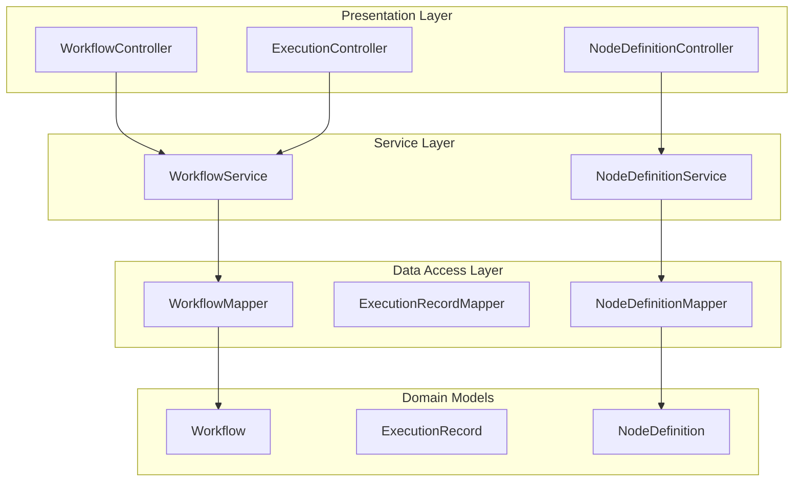
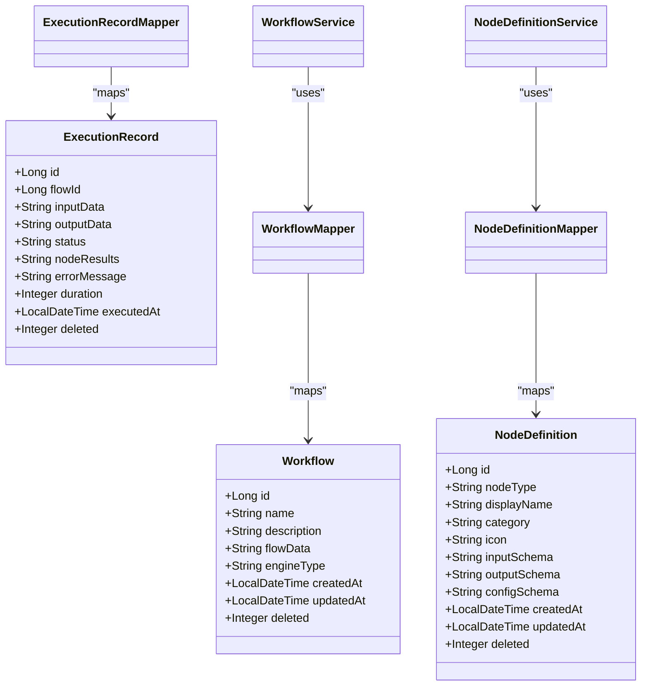
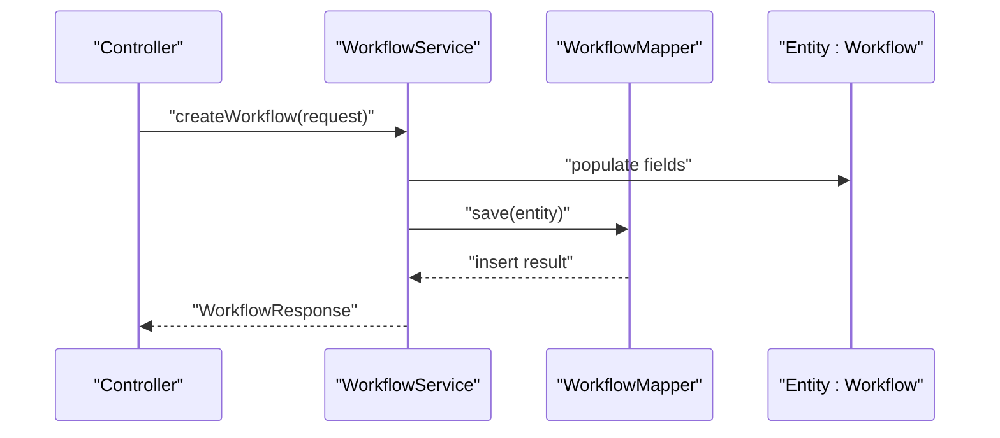
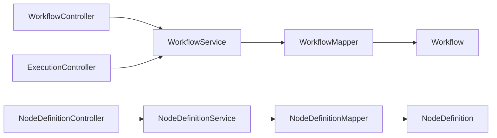

# Data Access Layer

<cite>
**Referenced Files in This Document**
- [PaiAgentApplication.java](file://backend/src/main/java/com/paiagent/PaiAgentApplication.java)
- [application.yml](file://backend/src/main/resources/application.yml)
- [Workflow.java](file://backend/src/main/java/com/paiagent/entity/Workflow.java)
- [ExecutionRecord.java](file://backend/src/main/java/com/paiagent/entity/ExecutionRecord.java)
- [NodeDefinition.java](file://backend/src/main/java/com/paiagent/entity/NodeDefinition.java)
- [WorkflowMapper.java](file://backend/src/main/java/com/paiagent/mapper/WorkflowMapper.java)
- [ExecutionRecordMapper.java](file://backend/src/main/java/com/paiagent/mapper/ExecutionRecordMapper.java)
- [NodeDefinitionMapper.java](file://backend/src/main/java/com/paiagent/mapper/NodeDefinitionMapper.java)
- [WorkflowService.java](file://backend/src/main/java/com/paiagent/service/WorkflowService.java)
- [NodeDefinitionService.java](file://backend/src/main/java/com/paiagent/service/NodeDefinitionService.java)
- [WorkflowController.java](file://backend/src/main/java/com/paiagent/controller/WorkflowController.java)
- [NodeDefinitionController.java](file://backend/src/main/java/com/paiagent/controller/NodeDefinitionController.java)
- [ExecutionController.java](file://backend/src/main/java/com/paiagent/controller/ExecutionController.java)
</cite>

## Table of Contents
1. [Introduction](#introduction)
2. [Project Structure](#project-structure)
3. [Core Components](#core-components)
4. [Architecture Overview](#architecture-overview)
5. [Detailed Component Analysis](#detailed-component-analysis)
6. [Dependency Analysis](#dependency-analysis)
7. [Performance Considerations](#performance-considerations)
8. [Troubleshooting Guide](#troubleshooting-guide)
9. [Conclusion](#conclusion)

## Introduction
This document describes the MyBatis-Plus data access layer for the backend module. It focuses on the mapper interfaces and data access patterns for three primary entities: Workflow, ExecutionRecord, and NodeDefinition. It explains how MyBatis-Plus is configured, how generic service implementations simplify CRUD operations, and how automatic SQL generation supports common database tasks. It also covers transaction management, pagination support, and performance optimization techniques, along with the relationships between entities and their mappers.

## Project Structure
The data access layer follows a layered architecture:
- Entities define table mappings and metadata via MyBatis-Plus annotations.
- Mappers extend BaseMapper to inherit generic CRUD and query capabilities.
- Services extend ServiceImpl to reuse MyBatis-Plus’s generic service features.
- Controllers orchestrate requests and delegate to services.

**Diagram sources**
- [WorkflowController.java:1-61](file://backend/src/main/java/com/paiagent/controller/WorkflowController.java#L1-L61)
- [NodeDefinitionController.java:1-33](file://backend/src/main/java/com/paiagent/controller/NodeDefinitionController.java#L1-L33)
- [ExecutionController.java:1-109](file://backend/src/main/java/com/paiagent/controller/ExecutionController.java#L1-L109)
- [WorkflowService.java:1-95](file://backend/src/main/java/com/paiagent/service/WorkflowService.java#L1-L95)
- [NodeDefinitionService.java:1-32](file://backend/src/main/java/com/paiagent/service/NodeDefinitionService.java#L1-L32)
- [WorkflowMapper.java:1-13](file://backend/src/main/java/com/paiagent/mapper/WorkflowMapper.java#L1-L13)
- [NodeDefinitionMapper.java:1-13](file://backend/src/main/java/com/paiagent/mapper/NodeDefinitionMapper.java#L1-L13)
- [ExecutionRecordMapper.java:1-13](file://backend/src/main/java/com/paiagent/mapper/ExecutionRecordMapper.java#L1-L13)
- [Workflow.java:1-58](file://backend/src/main/java/com/paiagent/entity/Workflow.java#L1-L58)
- [NodeDefinition.java:1-73](file://backend/src/main/java/com/paiagent/entity/NodeDefinition.java#L1-L73)
- [ExecutionRecord.java:1-67](file://backend/src/main/java/com/paiagent/entity/ExecutionRecord.java#L1-L67)

**Section sources**
- [PaiAgentApplication.java:1-16](file://backend/src/main/java/com/paiagent/PaiAgentApplication.java#L1-L16)
- [application.yml:1-55](file://backend/src/main/resources/application.yml#L1-L55)

## Core Components
- WorkflowMapper: Provides generic CRUD operations for Workflow entities.
- ExecutionRecordMapper: Provides generic CRUD operations for ExecutionRecord entities.
- NodeDefinitionMapper: Provides generic CRUD operations for NodeDefinition entities.
- WorkflowService: Extends ServiceImpl to reuse MyBatis-Plus generic operations and adds custom query logic.
- NodeDefinitionService: Extends ServiceImpl to provide convenience methods for listing and filtering NodeDefinition records.

Key capabilities:
- Automatic SQL generation for CRUD and common queries.
- Logical deletion support via MyBatis-Plus global configuration.
- Underscore-to-camel case mapping for column and property names.
- Global ID strategy configuration.

**Section sources**
- [WorkflowMapper.java:1-13](file://backend/src/main/java/com/paiagent/mapper/WorkflowMapper.java#L1-L13)
- [ExecutionRecordMapper.java:1-13](file://backend/src/main/java/com/paiagent/mapper/ExecutionRecordMapper.java#L1-L13)
- [NodeDefinitionMapper.java:1-13](file://backend/src/main/java/com/paiagent/mapper/NodeDefinitionMapper.java#L1-L13)
- [WorkflowService.java:1-95](file://backend/src/main/java/com/paiagent/service/WorkflowService.java#L1-L95)
- [NodeDefinitionService.java:1-32](file://backend/src/main/java/com/paiagent/service/NodeDefinitionService.java#L1-L32)
- [application.yml:21-35](file://backend/src/main/resources/application.yml#L21-L35)

## Architecture Overview
The data access layer leverages MyBatis-Plus’s BaseMapper and ServiceImpl to minimize boilerplate. Controllers depend on services, which depend on mappers. Entities are annotated for table mapping, field fill behavior, and logical deletion.

**Diagram sources**
- [Workflow.java:1-58](file://backend/src/main/java/com/paiagent/entity/Workflow.java#L1-L58)
- [ExecutionRecord.java:1-67](file://backend/src/main/java/com/paiagent/entity/ExecutionRecord.java#L1-L67)
- [NodeDefinition.java:1-73](file://backend/src/main/java/com/paiagent/entity/NodeDefinition.java#L1-L73)
- [WorkflowMapper.java:1-13](file://backend/src/main/java/com/paiagent/mapper/WorkflowMapper.java#L1-L13)
- [ExecutionRecordMapper.java:1-13](file://backend/src/main/java/com/paiagent/mapper/ExecutionRecordMapper.java#L1-L13)
- [NodeDefinitionMapper.java:1-13](file://backend/src/main/java/com/paiagent/mapper/NodeDefinitionMapper.java#L1-L13)
- [WorkflowService.java:1-95](file://backend/src/main/java/com/paiagent/service/WorkflowService.java#L1-L95)
- [NodeDefinitionService.java:1-32](file://backend/src/main/java/com/paiagent/service/NodeDefinitionService.java#L1-L32)

## Detailed Component Analysis

### MyBatis-Plus Configuration
- Mapper locations: classpath scanning for XML mapper files.
- Type aliases package: entity package for type resolution.
- Naming strategy: underscore-to-camel case mapping.
- Cache and logging: disabled cache and stdout logging enabled.
- Global DB config: auto ID strategy and logical delete configuration.

These settings enable automatic SQL generation and consistent naming across the application.

**Section sources**
- [application.yml:21-35](file://backend/src/main/resources/application.yml#L21-L35)

### Application Bootstrap and Mapper Scanning
- The application class enables MyBatis-Plus mapper scanning for the mapper package.
- This allows Spring to register mappers and inject them into services automatically.

**Section sources**
- [PaiAgentApplication.java:1-16](file://backend/src/main/java/com/paiagent/PaiAgentApplication.java#L1-L16)

### Entity Definitions and Annotations
- Table naming: explicit table names via annotations.
- ID strategy: AUTO for generated keys.
- Field fill: INSERT and INSERT_UPDATE triggers for createdAt/updatedAt.
- Logical delete: @TableLogic annotation with configured delete values.

These annotations inform MyBatis-Plus how to map entities and handle lifecycle events.

**Section sources**
- [Workflow.java:1-58](file://backend/src/main/java/com/paiagent/entity/Workflow.java#L1-L58)
- [ExecutionRecord.java:1-67](file://backend/src/main/java/com/paiagent/entity/ExecutionRecord.java#L1-L67)
- [NodeDefinition.java:1-73](file://backend/src/main/java/com/paiagent/entity/NodeDefinition.java#L1-L73)
- [application.yml:29-35](file://backend/src/main/resources/application.yml#L29-L35)

### Mapper Interfaces
- WorkflowMapper: extends BaseMapper<Workflow>.
- ExecutionRecordMapper: extends BaseMapper<ExecutionRecord>.
- NodeDefinitionMapper: extends BaseMapper<NodeDefinition>.

These interfaces inherit generic CRUD and query methods from BaseMapper, enabling operations like selectById, insert, updateById, removeById, and more.

**Section sources**
- [WorkflowMapper.java:1-13](file://backend/src/main/java/com/paiagent/mapper/WorkflowMapper.java#L1-L13)
- [ExecutionRecordMapper.java:1-13](file://backend/src/main/java/com/paiagent/mapper/ExecutionRecordMapper.java#L1-L13)
- [NodeDefinitionMapper.java:1-13](file://backend/src/main/java/com/paiagent/mapper/NodeDefinitionMapper.java#L1-L13)

### Generic Service Implementations
- WorkflowService extends ServiceImpl<WorkflowMapper, Workflow>, inheriting:
  - save(entity)
  - updateById(entity)
  - removeById(id)
  - getById(id)
  - list()
  - page()
  - And other generic operations.
- NodeDefinitionService extends ServiceImpl<NodeDefinitionMapper, NodeDefinition>, inheriting similar capabilities.

Custom logic:
- WorkflowService adds ordered listing and conversion to DTOs.
- NodeDefinitionService adds getByNodeType using lambda query.

**Section sources**
- [WorkflowService.java:1-95](file://backend/src/main/java/com/paiagent/service/WorkflowService.java#L1-L95)
- [NodeDefinitionService.java:1-32](file://backend/src/main/java/com/paiagent/service/NodeDefinitionService.java#L1-L32)

### Data Access Patterns
- CRUD via ServiceImpl methods.
- Custom queries via LambdaQueryWrapper in WorkflowService.
- Logical deletion respected by default MyBatis-Plus behavior.

**Diagram sources**
- [WorkflowController.java:1-61](file://backend/src/main/java/com/paiagent/controller/WorkflowController.java#L1-L61)
- [WorkflowService.java:1-95](file://backend/src/main/java/com/paiagent/service/WorkflowService.java#L1-L95)
- [WorkflowMapper.java:1-13](file://backend/src/main/java/com/paiagent/mapper/WorkflowMapper.java#L1-L13)
- [Workflow.java:1-58](file://backend/src/main/java/com/paiagent/entity/Workflow.java#L1-L58)

### Pagination Support
- MyBatis-Plus provides built-in pagination via IPage and ISearch.
- To add pagination to existing services, use Page<T> and IService.page(Page<T>) or custom query wrappers with pagination.

Note: Current services do not implement pagination. Adding pagination would involve:
- Accepting Pageable or Page<T> parameters in service methods.
- Using page() method inherited from ServiceImpl.

[No sources needed since this section provides general guidance]

### Transaction Management
- MyBatis-Plus integrates with Spring-managed transactions.
- Use @Transactional on service methods to ensure atomicity across multiple DAO operations.
- Typical placement: service layer to coordinate multiple mapper calls.

[No sources needed since this section provides general guidance]

### Association Mapping and Lazy Loading
- No explicit associations (foreign keys mapped to nested objects) are present in the current entities.
- If associations are introduced later:
  - Use @TableField(exist = false) for non-column fields.
  - Use separate mappers/services for associated entities.
  - Lazy loading is not enabled by default; enable it carefully to avoid N+1 selects.

[No sources needed since this section provides general guidance]

## Dependency Analysis
The following diagram shows runtime dependencies among controllers, services, and mappers.

**Diagram sources**
- [WorkflowController.java:1-61](file://backend/src/main/java/com/paiagent/controller/WorkflowController.java#L1-L61)
- [NodeDefinitionController.java:1-33](file://backend/src/main/java/com/paiagent/controller/NodeDefinitionController.java#L1-L33)
- [ExecutionController.java:1-109](file://backend/src/main/java/com/paiagent/controller/ExecutionController.java#L1-L109)
- [WorkflowService.java:1-95](file://backend/src/main/java/com/paiagent/service/WorkflowService.java#L1-L95)
- [NodeDefinitionService.java:1-32](file://backend/src/main/java/com/paiagent/service/NodeDefinitionService.java#L1-L32)
- [WorkflowMapper.java:1-13](file://backend/src/main/java/com/paiagent/mapper/WorkflowMapper.java#L1-L13)
- [NodeDefinitionMapper.java:1-13](file://backend/src/main/java/com/paiagent/mapper/NodeDefinitionMapper.java#L1-L13)
- [Workflow.java:1-58](file://backend/src/main/java/com/paiagent/entity/Workflow.java#L1-L58)
- [NodeDefinition.java:1-73](file://backend/src/main/java/com/paiagent/entity/NodeDefinition.java#L1-L73)

**Section sources**
- [WorkflowController.java:1-61](file://backend/src/main/java/com/paiagent/controller/WorkflowController.java#L1-L61)
- [NodeDefinitionController.java:1-33](file://backend/src/main/java/com/paiagent/controller/NodeDefinitionController.java#L1-L33)
- [ExecutionController.java:1-109](file://backend/src/main/java/com/paiagent/controller/ExecutionController.java#L1-L109)
- [WorkflowService.java:1-95](file://backend/src/main/java/com/paiagent/service/WorkflowService.java#L1-L95)
- [NodeDefinitionService.java:1-32](file://backend/src/main/java/com/paiagent/service/NodeDefinitionService.java#L1-L32)

## Performance Considerations
- Enable batch operations for bulk inserts/updates when applicable.
- Use projection queries to fetch only required columns.
- Leverage logical delete to avoid physical row removal.
- Configure connection pooling and optimize database indexes for frequent filters.
- Avoid N+1 queries by eager-loading associations or using join queries.

[No sources needed since this section provides general guidance]

## Troubleshooting Guide
Common issues and resolutions:
- Column/property name mismatch: ensure map-underscore-to-camel-case is enabled and annotations match table schema.
- Logical delete not applied: verify global-config settings and that entities use @TableLogic.
- Missing mappers: confirm @MapperScan is configured and mapper interfaces are in the scanned package.
- Transaction anomalies: wrap service methods with @Transactional where multiple DAO operations must succeed or fail together.

**Section sources**
- [application.yml:21-35](file://backend/src/main/resources/application.yml#L21-L35)
- [PaiAgentApplication.java:1-16](file://backend/src/main/java/com/paiagent/PaiAgentApplication.java#L1-L16)

## Conclusion
The data access layer uses MyBatis-Plus to streamline persistence operations. Mappers extend BaseMapper for generic CRUD, while services extend ServiceImpl to reuse built-in capabilities and add custom logic. MyBatis-Plus configuration ensures consistent naming, logical deletion, and automatic SQL generation. Controllers remain thin, delegating to services for data access. Future enhancements can include pagination, transaction boundaries, and association mapping with careful attention to performance.