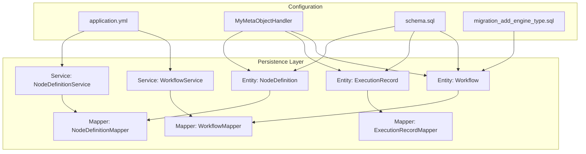
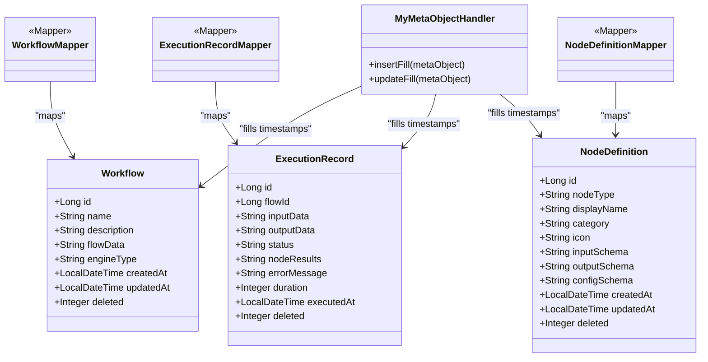
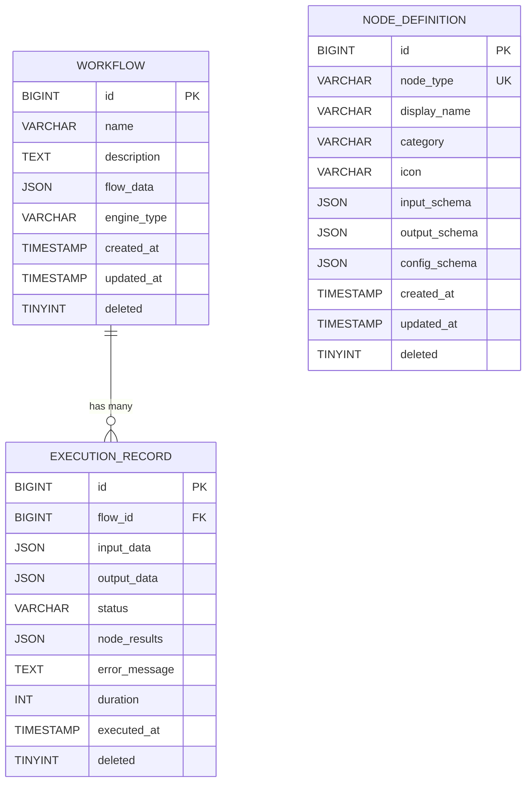
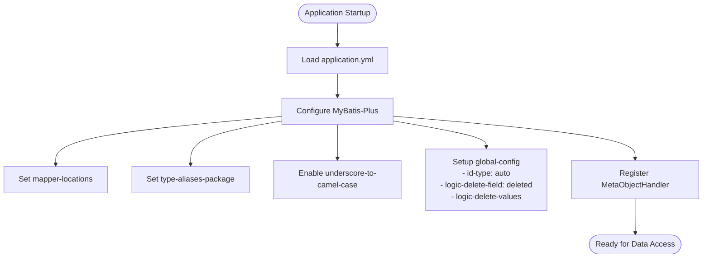
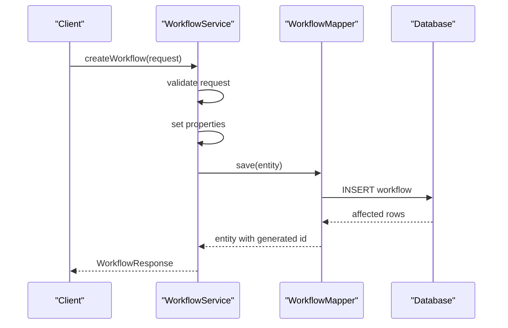
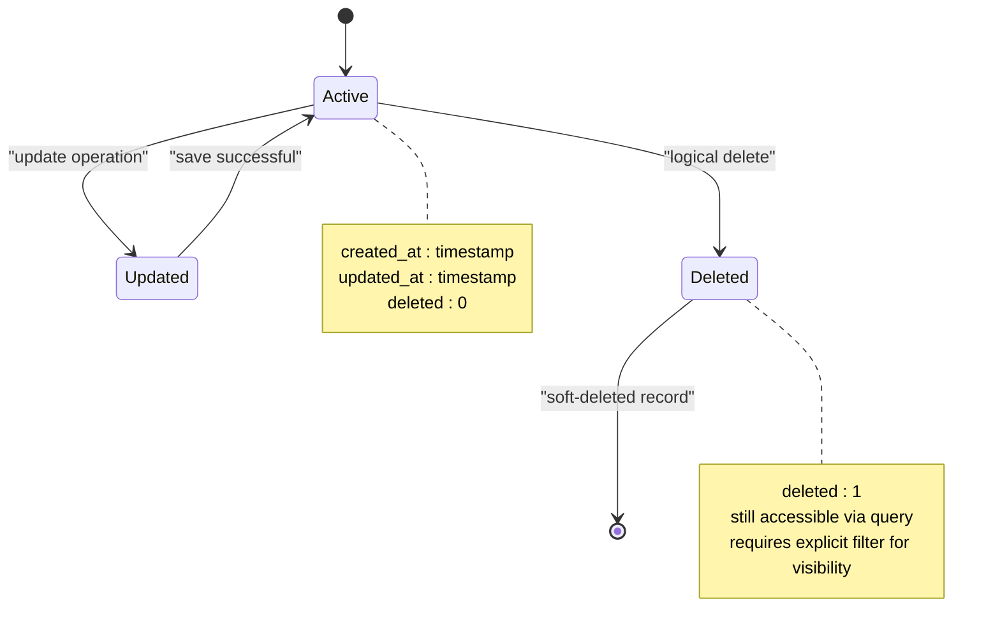
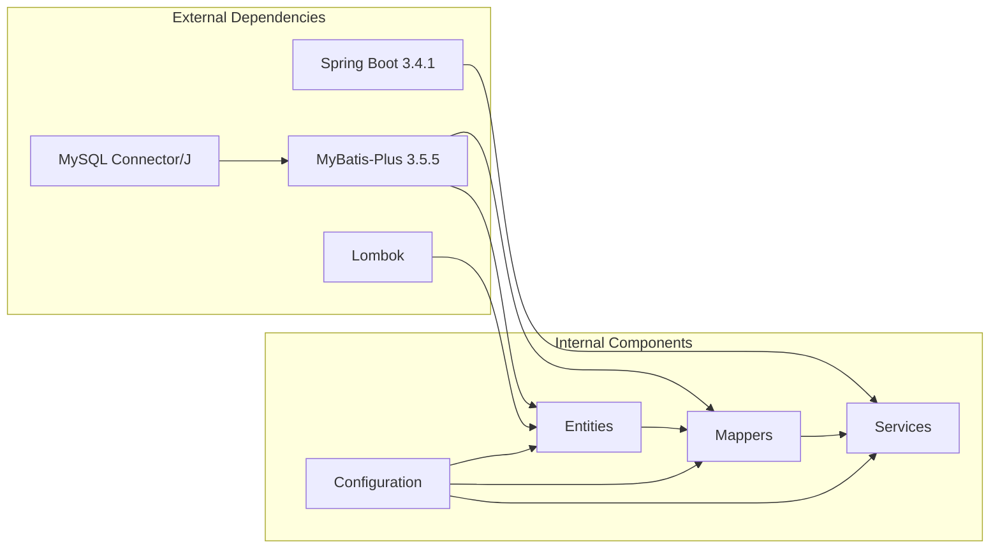

# Data Models & Persistence

<cite>
**Referenced Files in This Document**
- [Workflow.java](file://backend/src/main/java/com/paiagent/entity/Workflow.java)
- [ExecutionRecord.java](file://backend/src/main/java/com/paiagent/entity/ExecutionRecord.java)
- [NodeDefinition.java](file://backend/src/main/java/com/paiagent/entity/NodeDefinition.java)
- [WorkflowMapper.java](file://backend/src/main/java/com/paiagent/mapper/WorkflowMapper.java)
- [ExecutionRecordMapper.java](file://backend/src/main/java/com/paiagent/mapper/ExecutionRecordMapper.java)
- [NodeDefinitionMapper.java](file://backend/src/main/java/com/paiagent/mapper/NodeDefinitionMapper.java)
- [schema.sql](file://backend/src/main/resources/schema.sql)
- [migration_add_engine_type.sql](file://backend/src/main/resources/migration_add_engine_type.sql)
- [application.yml](file://backend/src/main/resources/application.yml)
- [MyMetaObjectHandler.java](file://backend/src/main/java/com/paiagent/config/MyMetaObjectHandler.java)
- [WorkflowService.java](file://backend/src/main/java/com/paiagent/service/WorkflowService.java)
- [NodeDefinitionService.java](file://backend/src/main/java/com/paiagent/service/NodeDefinitionService.java)
- [WorkflowRequest.java](file://backend/src/main/java/com/paiagent/dto/WorkflowRequest.java)
- [pom.xml](file://backend/pom.xml)
</cite>

## Table of Contents
1. [Introduction](#introduction)
2. [Project Structure](#project-structure)
3. [Core Components](#core-components)
4. [Architecture Overview](#architecture-overview)
5. [Detailed Component Analysis](#detailed-component-analysis)
6. [Dependency Analysis](#dependency-analysis)
7. [Performance Considerations](#performance-considerations)
8. [Troubleshooting Guide](#troubleshooting-guide)
9. [Conclusion](#conclusion)

## Introduction
This document provides comprehensive data model documentation for the database schema and entity relationships in the backend module. It covers three core entities: Workflow, ExecutionRecord, and NodeDefinition. The documentation details table structures, field definitions, primary and foreign key relationships, indexing strategies, MyBatis-Plus configuration, mapper interfaces, data access patterns, validation rules, business constraints, and schema evolution approaches.

## Project Structure
The persistence layer follows a layered architecture:
- Entities define the data model with MyBatis-Plus annotations
- Mappers extend BaseMapper for CRUD operations
- Services encapsulate business logic and coordinate data access
- Application configuration defines database connectivity and MyBatis-Plus settings
- SQL scripts define schema creation and migrations

**Diagram sources**
- [Workflow.java:10-57](file://backend/src/main/java/com/paiagent/entity/Workflow.java#L10-L57)
- [ExecutionRecord.java:11-66](file://backend/src/main/java/com/paiagent/entity/ExecutionRecord.java#L11-L66)
- [NodeDefinition.java:11-72](file://backend/src/main/java/com/paiagent/entity/NodeDefinition.java#L11-L72)
- [WorkflowMapper.java:10-12](file://backend/src/main/java/com/paiagent/mapper/WorkflowMapper.java#L10-L12)
- [ExecutionRecordMapper.java:10-12](file://backend/src/main/java/com/paiagent/mapper/ExecutionRecordMapper.java#L10-L12)
- [NodeDefinitionMapper.java:10-12](file://backend/src/main/java/com/paiagent/mapper/NodeDefinitionMapper.java#L10-L12)
- [application.yml:21-34](file://backend/src/main/resources/application.yml#L21-L34)
- [MyMetaObjectHandler.java:13-26](file://backend/src/main/java/com/paiagent/config/MyMetaObjectHandler.java#L13-L26)
- [schema.sql:6-51](file://backend/src/main/resources/schema.sql#L6-L51)
- [migration_add_engine_type.sql:7-13](file://backend/src/main/resources/migration_add_engine_type.sql#L7-L13)

**Section sources**
- [Workflow.java:1-58](file://backend/src/main/java/com/paiagent/entity/Workflow.java#L1-L58)
- [ExecutionRecord.java:1-67](file://backend/src/main/java/com/paiagent/entity/ExecutionRecord.java#L1-L67)
- [NodeDefinition.java:1-73](file://backend/src/main/java/com/paiagent/entity/NodeDefinition.java#L1-L73)
- [WorkflowMapper.java:1-13](file://backend/src/main/java/com/paiagent/mapper/WorkflowMapper.java#L1-L13)
- [ExecutionRecordMapper.java:1-13](file://backend/src/main/java/com/paiagent/mapper/ExecutionRecordMapper.java#L1-L13)
- [NodeDefinitionMapper.java:1-13](file://backend/src/main/java/com/paiagent/mapper/NodeDefinitionMapper.java#L1-L13)
- [application.yml:1-55](file://backend/src/main/resources/application.yml#L1-L55)
- [schema.sql:1-84](file://backend/src/main/resources/schema.sql#L1-L84)
- [migration_add_engine_type.sql:1-17](file://backend/src/main/resources/migration_add_engine_type.sql#L1-L17)
- [MyMetaObjectHandler.java:1-27](file://backend/src/main/java/com/paiagent/config/MyMetaObjectHandler.java#L1-L27)

## Core Components
This section documents the three core entities and their relationships.

### Workflow Entity
The Workflow entity stores workflow configurations and metadata:
- Primary key: id (auto-increment)
- Name and description fields for human-readable identification
- flowData stores the serialized workflow graph (JSON)
- engineType supports engine selection (default: "dag")
- Timestamps for creation and updates
- Logical deletion support via deleted flag

### ExecutionRecord Entity
The ExecutionRecord entity tracks execution history:
- Primary key: id (auto-increment)
- flowId links to the associated workflow
- inputData, outputData, and nodeResults store JSON-encoded data
- status indicates execution outcome (SUCCESS/FAILED)
- errorMessage captures error details
- duration records execution time in milliseconds
- executedAt timestamps execution events
- Logical deletion support via deleted flag

### NodeDefinition Entity
The NodeDefinition entity manages reusable node templates:
- Primary key: id (auto-increment)
- nodeType uniquely identifies node types
- displayName provides user-friendly names
- category classifies nodes (LLM/TOOL/IO)
- icon stores visual representation
- inputSchema, outputSchema, and configSchema define JSON schemas
- Timestamps for creation and updates
- Logical deletion support via deleted flag

**Section sources**
- [Workflow.java:10-57](file://backend/src/main/java/com/paiagent/entity/Workflow.java#L10-L57)
- [ExecutionRecord.java:11-66](file://backend/src/main/java/com/paiagent/entity/ExecutionRecord.java#L11-L66)
- [NodeDefinition.java:11-72](file://backend/src/main/java/com/paiagent/entity/NodeDefinition.java#L11-L72)

## Architecture Overview
The data persistence architecture leverages MyBatis-Plus with automatic CRUD generation and custom configuration for logical deletion and automatic timestamp filling.

**Diagram sources**
- [Workflow.java:10-57](file://backend/src/main/java/com/paiagent/entity/Workflow.java#L10-L57)
- [ExecutionRecord.java:11-66](file://backend/src/main/java/com/paiagent/entity/ExecutionRecord.java#L11-L66)
- [NodeDefinition.java:11-72](file://backend/src/main/java/com/paiagent/entity/NodeDefinition.java#L11-L72)
- [WorkflowMapper.java:10-12](file://backend/src/main/java/com/paiagent/mapper/WorkflowMapper.java#L10-L12)
- [ExecutionRecordMapper.java:10-12](file://backend/src/main/java/com/paiagent/mapper/ExecutionRecordMapper.java#L10-L12)
- [NodeDefinitionMapper.java:10-12](file://backend/src/main/java/com/paiagent/mapper/NodeDefinitionMapper.java#L10-L12)
- [MyMetaObjectHandler.java:13-26](file://backend/src/main/java/com/paiagent/config/MyMetaObjectHandler.java#L13-L26)

## Detailed Component Analysis

### Database Schema Definition
The schema defines three tables with appropriate constraints and indexes:

**Diagram sources**
- [schema.sql:6-51](file://backend/src/main/resources/schema.sql#L6-L51)

#### Table Constraints and Indexes
- Workflow table includes indexes on created_at and updated_at for efficient sorting and filtering
- NodeDefinition table includes an index on category for classification queries
- ExecutionRecord table includes indexes on flow_id, executed_at, and status for common query patterns
- Unique constraint on node_type ensures distinct node definitions
- Default values and NOT NULL constraints enforce data integrity

**Section sources**
- [schema.sql:6-51](file://backend/src/main/resources/schema.sql#L6-L51)

### MyBatis-Plus Configuration
The application uses MyBatis-Plus with the following key configurations:
- Mapper locations: classpath*:/mapper/**/*.xml
- Type aliases package: com.paiagent.entity
- Underscore-to-camel case mapping enabled
- Global configuration for logical deletion with custom field names and values
- Automatic timestamp filling via MetaObjectHandler

**Diagram sources**
- [application.yml:21-34](file://backend/src/main/resources/application.yml#L21-L34)
- [MyMetaObjectHandler.java:13-26](file://backend/src/main/java/com/paiagent/config/MyMetaObjectHandler.java#L13-L26)

**Section sources**
- [application.yml:21-34](file://backend/src/main/resources/application.yml#L21-L34)
- [MyMetaObjectHandler.java:1-27](file://backend/src/main/java/com/paiagent/config/MyMetaObjectHandler.java#L1-L27)

### Data Access Patterns
The persistence layer follows standard MyBatis-Plus patterns:
- Entity classes use @TableName and @TableId annotations
- Mappers extend BaseMapper for automatic CRUD generation
- Services extend ServiceImpl for business logic coordination
- Automatic timestamp filling handled by MetaObjectHandler
- Logical deletion configured globally

**Diagram sources**
- [WorkflowService.java:24-34](file://backend/src/main/java/com/paiagent/service/WorkflowService.java#L24-L34)
- [WorkflowMapper.java:10-12](file://backend/src/main/java/com/paiagent/mapper/WorkflowMapper.java#L10-L12)

**Section sources**
- [WorkflowService.java:18-94](file://backend/src/main/java/com/paiagent/service/WorkflowService.java#L18-L94)
- [NodeDefinitionService.java:13-31](file://backend/src/main/java/com/paiagent/service/NodeDefinitionService.java#L13-L31)

### Data Validation Rules and Business Constraints
The system implements validation at multiple levels:
- DTO validation using Jakarta Bean Validation annotations
- Database constraints enforced by SQL schema
- Business logic validation in services
- JSON schema validation for configuration fields

Validation rules include:
- Workflow name and flowData cannot be blank
- Node type uniqueness constraint prevents duplicates
- Category field restricts valid node classifications
- Status field constrained to SUCCESS/FAILED values
- Engine type defaults to "dag" for backward compatibility

**Section sources**
- [WorkflowRequest.java:10-21](file://backend/src/main/java/com/paiagent/dto/WorkflowRequest.java#L10-L21)
- [schema.sql:23-23](file://backend/src/main/resources/schema.sql#L23-L23)
- [schema.sql:42-42](file://backend/src/main/resources/schema.sql#L42-L42)
- [migration_add_engine_type.sql:8-10](file://backend/src/main/resources/migration_add_engine_type.sql#L8-L10)

### Data Lifecycle Management
The system implements comprehensive data lifecycle management:
- Automatic timestamp creation and updates via MetaObjectHandler
- Logical deletion using soft-delete pattern
- Automatic ID generation for new records
- Cascading behavior through foreign key relationships

**Diagram sources**
- [MyMetaObjectHandler.java:15-25](file://backend/src/main/java/com/paiagent/config/MyMetaObjectHandler.java#L15-L25)
- [application.yml:30-34](file://backend/src/main/resources/application.yml#L30-L34)

**Section sources**
- [MyMetaObjectHandler.java:1-27](file://backend/src/main/java/com/paiagent/config/MyMetaObjectHandler.java#L1-L27)
- [application.yml:29-34](file://backend/src/main/resources/application.yml#L29-L34)

### Schema Evolution Approaches
The project includes structured migration strategies:
- Initial schema creation with comprehensive table definitions
- Incremental migration script for adding engine_type column
- Backward compatibility maintained through default values
- Validation queries included in migration scripts

Migration strategy highlights:
- Non-breaking additions using DEFAULT values
- Optional data updates for existing records
- Verification queries to confirm successful migrations
- Clear comments documenting purpose and execution dates

**Section sources**
- [schema.sql:1-84](file://backend/src/main/resources/schema.sql#L1-L84)
- [migration_add_engine_type.sql:1-17](file://backend/src/main/resources/migration_add_engine_type.sql#L1-L17)

## Dependency Analysis
The persistence layer exhibits clean separation of concerns with minimal coupling between components.

**Diagram sources**
- [pom.xml:70-124](file://backend/pom.xml#L70-L124)

**Section sources**
- [pom.xml:30-124](file://backend/pom.xml#L30-L124)

## Performance Considerations
The data model incorporates several performance optimization strategies:
- Strategic indexing on frequently queried columns (created_at, updated_at, category, flow_id, executed_at, status)
- JSON column storage for flexible configuration data
- Efficient timestamp handling via automatic filling
- Soft-delete pattern avoiding expensive cascading operations
- Minimal entity relationships reducing join complexity

## Troubleshooting Guide
Common issues and resolutions:
- Logical deletion queries: Ensure proper filtering for deleted records
- JSON data validation: Verify JSON schema compliance for configuration fields
- Timestamp discrepancies: Confirm timezone settings in application.yml
- Migration failures: Check MySQL privileges and execute permissions
- Performance issues: Review index usage and query patterns

**Section sources**
- [application.yml:9-14](file://backend/src/main/resources/application.yml#L9-L14)
- [schema.sql:16-17](file://backend/src/main/resources/schema.sql#L16-L17)
- [schema.sql:33-33](file://backend/src/main/resources/schema.sql#L33-L33)
- [schema.sql:48-50](file://backend/src/main/resources/schema.sql#L48-L50)

## Conclusion
The data model demonstrates robust design principles with clear entity relationships, comprehensive validation, and scalable persistence patterns. The MyBatis-Plus configuration provides efficient data access with minimal boilerplate code. The schema evolution strategy ensures backward compatibility while supporting future enhancements. The combination of logical deletion, automatic timestamp management, and strategic indexing creates a solid foundation for production deployment.