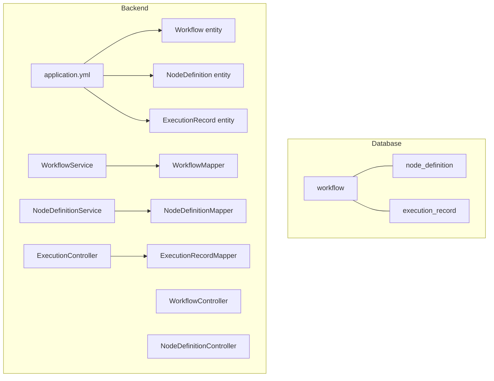
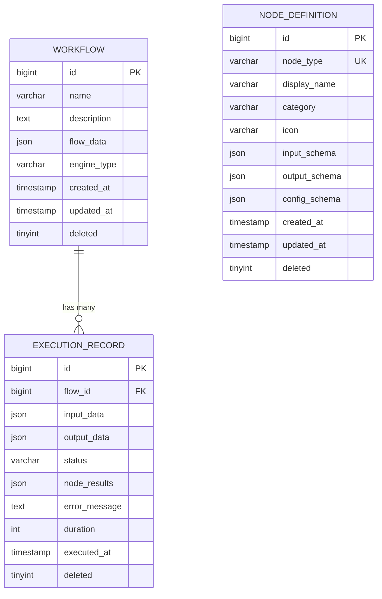
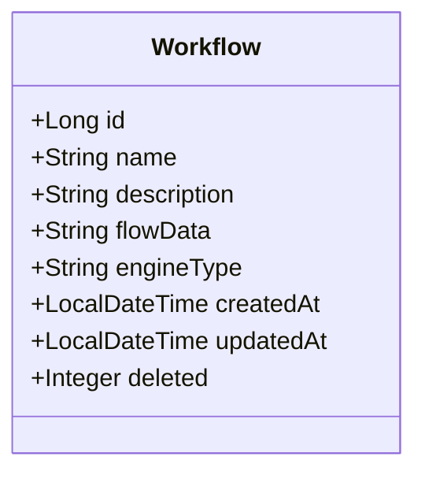
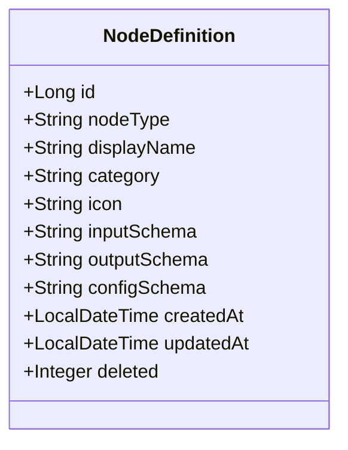
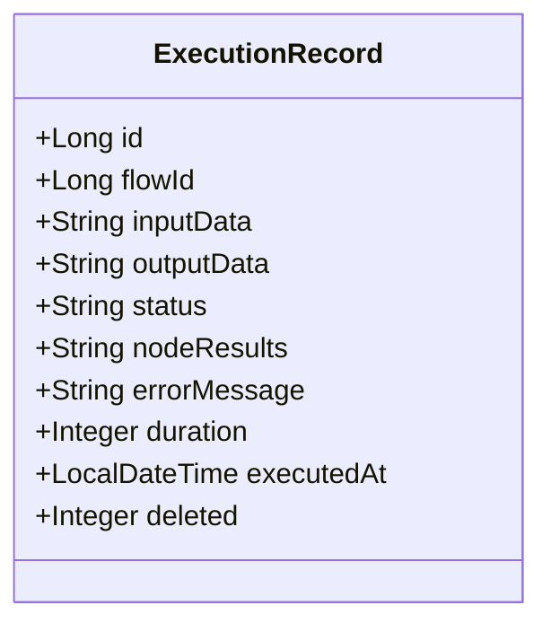
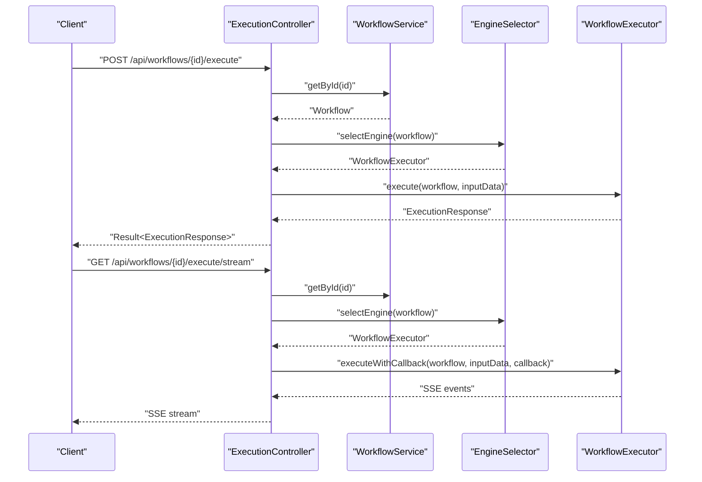
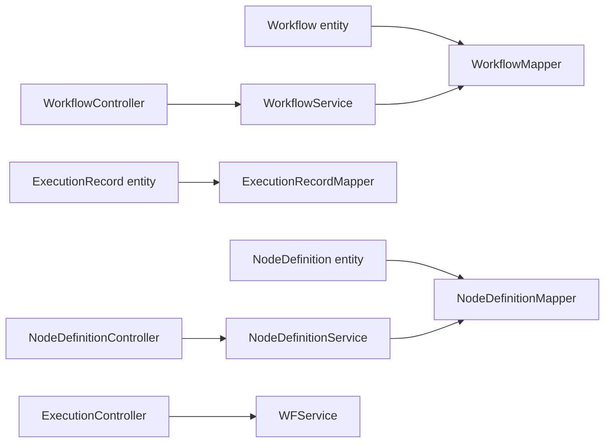

# Database Schema

<cite>
**Referenced Files in This Document**
- [schema.sql](file://backend/src/main/resources/schema.sql)
- [migration_add_engine_type.sql](file://backend/src/main/resources/migration_add_engine_type.sql)
- [application.yml](file://backend/src/main/resources/application.yml)
- [Workflow.java](file://backend/src/main/java/com/paiagent/entity/Workflow.java)
- [ExecutionRecord.java](file://backend/src/main/java/com/paiagent/entity/ExecutionRecord.java)
- [NodeDefinition.java](file://backend/src/main/java/com/paiagent/entity/NodeDefinition.java)
- [WorkflowMapper.java](file://backend/src/main/java/com/paiagent/mapper/WorkflowMapper.java)
- [ExecutionRecordMapper.java](file://backend/src/main/java/com/paiagent/mapper/ExecutionRecordMapper.java)
- [NodeDefinitionMapper.java](file://backend/src/main/java/com/paiagent/mapper/NodeDefinitionMapper.java)
- [WorkflowService.java](file://backend/src/main/java/com/paiagent/service/WorkflowService.java)
- [NodeDefinitionService.java](file://backend/src/main/java/com/paiagent/service/NodeDefinitionService.java)
- [ExecutionController.java](file://backend/src/main/java/com/paiagent/controller/ExecutionController.java)
- [WorkflowController.java](file://backend/src/main/java/com/paiagent/controller/WorkflowController.java)
- [NodeDefinitionController.java](file://backend/src/main/java/com/paiagent/controller/NodeDefinitionController.java)
</cite>

## Table of Contents
1. [Introduction](#introduction)
2. [Project Structure](#project-structure)
3. [Core Components](#core-components)
4. [Architecture Overview](#architecture-overview)
5. [Detailed Component Analysis](#detailed-component-analysis)
6. [Dependency Analysis](#dependency-analysis)
7. [Performance Considerations](#performance-considerations)
8. [Troubleshooting Guide](#troubleshooting-guide)
9. [Conclusion](#conclusion)

## Introduction
This document provides comprehensive database schema documentation for the workflow execution system. It covers the complete database structure, table relationships, primary and foreign key constraints, indexes, and data integrity mechanisms. It also documents the workflow table, execution record table, and node definition table, along with migration strategies, schema evolution patterns, and indexing strategies for optimal performance.

## Project Structure
The database schema is defined in SQL scripts and integrated with the Java backend via MyBatis-Plus. The schema includes three core tables:
- workflow: stores workflow definitions and metadata
- node_definition: stores reusable node templates and configuration schemas
- execution_record: tracks workflow executions, statuses, and audit fields

The backend configuration defines the MySQL connection and MyBatis-Plus settings for automatic field filling and logical deletion.

**Diagram sources**
- [schema.sql:6-51](file://backend/src/main/resources/schema.sql#L6-L51)
- [application.yml:4-35](file://backend/src/main/resources/application.yml#L4-L35)
- [Workflow.java:10-57](file://backend/src/main/java/com/paiagent/entity/Workflow.java#L10-L57)
- [NodeDefinition.java:11-72](file://backend/src/main/java/com/paiagent/entity/NodeDefinition.java#L11-L72)
- [ExecutionRecord.java:11-66](file://backend/src/main/java/com/paiagent/entity/ExecutionRecord.java#L11-L66)
- [WorkflowMapper.java:10-12](file://backend/src/main/java/com/paiagent/mapper/WorkflowMapper.java#L10-L12)
- [NodeDefinitionMapper.java:10-12](file://backend/src/main/java/com/paiagent/mapper/NodeDefinitionMapper.java#L10-L12)
- [ExecutionRecordMapper.java:10-12](file://backend/src/main/java/com/paiagent/mapper/ExecutionRecordMapper.java#L10-L12)
- [WorkflowService.java:18-94](file://backend/src/main/java/com/paiagent/service/WorkflowService.java#L18-L94)
- [NodeDefinitionService.java:13-31](file://backend/src/main/java/com/paiagent/service/NodeDefinitionService.java#L13-L31)
- [ExecutionController.java:25-109](file://backend/src/main/java/com/paiagent/controller/ExecutionController.java#L25-L109)
- [WorkflowController.java:18-60](file://backend/src/main/java/com/paiagent/controller/WorkflowController.java#L18-60)
- [NodeDefinitionController.java:18-32](file://backend/src/main/java/com/paiagent/controller/NodeDefinitionController.java#L18-32)

**Section sources**
- [schema.sql:6-84](file://backend/src/main/resources/schema.sql#L6-L84)
- [application.yml:4-35](file://backend/src/main/resources/application.yml#L4-L35)

## Core Components
This section documents the three core database tables and their roles in the system.

- workflow
  - Purpose: Stores workflow definitions, metadata, and engine selection.
  - Primary key: id (auto-increment)
  - Columns: id, name, description, flow_data (JSON), engine_type (with default), created_at, updated_at, deleted (logical delete)
  - Indexes: idx_created_at, idx_updated_at
  - Constraints: engine_type defaults to 'dag'; deleted supports soft deletes

- node_definition
  - Purpose: Defines reusable node templates with categorized types and JSON schemas for inputs, outputs, and configurations.
  - Primary key: id (auto-increment)
  - Unique constraint: node_type
  - Columns: id, node_type, display_name, category, icon, input_schema (JSON), output_schema (JSON), config_schema (JSON), created_at, updated_at, deleted (logical delete)
  - Indexes: idx_category
  - Constraints: node_type is unique; deleted supports soft deletes

- execution_record
  - Purpose: Tracks individual workflow executions, including status, timing, and per-node results.
  - Primary key: id (auto-increment)
  - Columns: id, flow_id (foreign key to workflow.id), input_data (JSON), output_data (JSON), status, node_results (JSON), error_message, duration, executed_at, deleted (logical delete)
  - Indexes: idx_flow_id, idx_executed_at, idx_status
  - Constraints: deleted supports soft deletes

**Section sources**
- [schema.sql:6-51](file://backend/src/main/resources/schema.sql#L6-L51)
- [Workflow.java:10-57](file://backend/src/main/java/com/paiagent/entity/Workflow.java#L10-L57)
- [NodeDefinition.java:11-72](file://backend/src/main/java/com/paiagent/entity/NodeDefinition.java#L11-L72)
- [ExecutionRecord.java:11-66](file://backend/src/main/java/com/paiagent/entity/ExecutionRecord.java#L11-L66)

## Architecture Overview
The database architecture centers around three tables with clear relationships:
- workflow is the parent entity for execution records
- node_definition provides reusable node templates referenced during workflow construction and execution
- execution_record captures runtime outcomes and audit data

**Diagram sources**
- [schema.sql:6-51](file://backend/src/main/resources/schema.sql#L6-L51)

## Detailed Component Analysis

### Workflow Table
The workflow table stores workflow definitions and metadata. It supports soft deletion and maintains timestamps for creation and updates. A migration script adds the engine_type column to support multiple execution engines.

- Primary key: id
- Indexes: idx_created_at, idx_updated_at
- Logical deletion: deleted field managed by MyBatis-Plus global config
- Engine selection: engine_type defaults to 'dag'

**Diagram sources**
- [Workflow.java:10-57](file://backend/src/main/java/com/paiagent/entity/Workflow.java#L10-L57)

**Section sources**
- [schema.sql:6-18](file://backend/src/main/resources/schema.sql#L6-L18)
- [migration_add_engine_type.sql:7-16](file://backend/src/main/resources/migration_add_engine_type.sql#L7-L16)
- [application.yml:29-34](file://backend/src/main/resources/application.yml#L29-L34)

### Node Definition Table
The node_definition table defines reusable node templates with categorized types and JSON schemas for inputs, outputs, and configurations. It supports soft deletion and categorization for efficient filtering.

- Primary key: id
- Unique constraint: node_type
- Indexes: idx_category
- Logical deletion: deleted field managed by MyBatis-Plus global config

**Diagram sources**
- [NodeDefinition.java:11-72](file://backend/src/main/java/com/paiagent/entity/NodeDefinition.java#L11-L72)

**Section sources**
- [schema.sql:20-34](file://backend/src/main/resources/schema.sql#L20-L34)
- [application.yml:29-34](file://backend/src/main/resources/application.yml#L29-L34)

### Execution Record Table
The execution_record table tracks workflow executions, including status, timing, and per-node results. It supports soft deletion and includes indexes optimized for common queries.

- Primary key: id
- Foreign key: flow_id references workflow.id
- Indexes: idx_flow_id, idx_executed_at, idx_status
- Logical deletion: deleted field managed by MyBatis-Plus global config

**Diagram sources**
- [ExecutionRecord.java:11-66](file://backend/src/main/java/com/paiagent/entity/ExecutionRecord.java#L11-L66)

**Section sources**
- [schema.sql:36-51](file://backend/src/main/resources/schema.sql#L36-L51)
- [application.yml:29-34](file://backend/src/main/resources/application.yml#L29-L34)

### Execution Flow (End-to-End)
This sequence illustrates how a client triggers a workflow execution and receives real-time progress updates.

**Diagram sources**
- [ExecutionController.java:39-109](file://backend/src/main/java/com/paiagent/controller/ExecutionController.java#L39-L109)
- [WorkflowService.java:18-94](file://backend/src/main/java/com/paiagent/service/WorkflowService.java#L18-L94)

## Dependency Analysis
This section maps the backend dependencies among entities, mappers, services, and controllers.

**Diagram sources**
- [Workflow.java:10-57](file://backend/src/main/java/com/paiagent/entity/Workflow.java#L10-L57)
- [NodeDefinition.java:11-72](file://backend/src/main/java/com/paiagent/entity/NodeDefinition.java#L11-L72)
- [ExecutionRecord.java:11-66](file://backend/src/main/java/com/paiagent/entity/ExecutionRecord.java#L11-L66)
- [WorkflowMapper.java:10-12](file://backend/src/main/java/com/paiagent/mapper/WorkflowMapper.java#L10-L12)
- [NodeDefinitionMapper.java:10-12](file://backend/src/main/java/com/paiagent/mapper/NodeDefinitionMapper.java#L10-L12)
- [ExecutionRecordMapper.java:10-12](file://backend/src/main/java/com/paiagent/mapper/ExecutionRecordMapper.java#L10-L12)
- [WorkflowService.java:18-94](file://backend/src/main/java/com/paiagent/service/WorkflowService.java#L18-L94)
- [NodeDefinitionService.java:13-31](file://backend/src/main/java/com/paiagent/service/NodeDefinitionService.java#L13-L31)
- [WorkflowController.java:18-60](file://backend/src/main/java/com/paiagent/controller/WorkflowController.java#L18-L60)
- [NodeDefinitionController.java:18-32](file://backend/src/main/java/com/paiagent/controller/NodeDefinitionController.java#L18-L32)
- [ExecutionController.java:25-109](file://backend/src/main/java/com/paiagent/controller/ExecutionController.java#L25-L109)

**Section sources**
- [WorkflowService.java:18-94](file://backend/src/main/java/com/paiagent/service/WorkflowService.java#L18-L94)
- [NodeDefinitionService.java:13-31](file://backend/src/main/java/com/paiagent/service/NodeDefinitionService.java#L13-L31)

## Performance Considerations
Indexing strategy
- workflow: idx_created_at, idx_updated_at for sorting and filtering by timestamps
- node_definition: idx_category for efficient categorization queries
- execution_record: idx_flow_id, idx_executed_at, idx_status for execution history, status filtering, and time-series queries

Logical deletion
- Soft deletes are enabled via the deleted field with MyBatis-Plus global configuration. Queries should respect soft-deleted rows unless explicitly handled otherwise.

JSON fields
- flow_data, input_data, output_data, node_results are stored as JSON. Consider validating JSON schemas at application level and avoid heavy JSON parsing in database queries.

Engine type evolution
- The engine_type column allows switching between execution engines without altering the core schema. Migrations should preserve backward compatibility using defaults and selective updates.

**Section sources**
- [schema.sql:16-17](file://backend/src/main/resources/schema.sql#L16-L17)
- [schema.sql:33](file://backend/src/main/resources/schema.sql#L33)
- [schema.sql:48-50](file://backend/src/main/resources/schema.sql#L48-L50)
- [application.yml:29-34](file://backend/src/main/resources/application.yml#L29-L34)
- [migration_add_engine_type.sql:7-16](file://backend/src/main/resources/migration_add_engine_type.sql#L7-L16)

## Troubleshooting Guide
Common issues and resolutions
- Missing engine_type column: Apply the migration script to add engine_type with a default value and optional data update.
- Soft delete behavior: Ensure queries exclude deleted rows unless explicitly intended. Verify MyBatis-Plus global configuration for logic delete fields.
- JSON schema validation: Validate JSON schemas for node_definition and execution_record JSON fields at the application boundary to prevent malformed data.
- Index usage: Confirm that queries leverage appropriate indexes (e.g., status filtering, flow_id joins, timestamp ranges).

**Section sources**
- [migration_add_engine_type.sql:1-17](file://backend/src/main/resources/migration_add_engine_type.sql#L1-L17)
- [application.yml:29-34](file://backend/src/main/resources/application.yml#L29-L34)

## Conclusion
The database schema provides a solid foundation for workflow definition, node templating, and execution tracking. The design emphasizes flexibility through JSON fields, maintainability via logical deletion, and performance through targeted indexes. The migration strategy demonstrates safe schema evolution with backward compatibility. Together with the backend services and controllers, the schema supports robust workflow orchestration and monitoring.