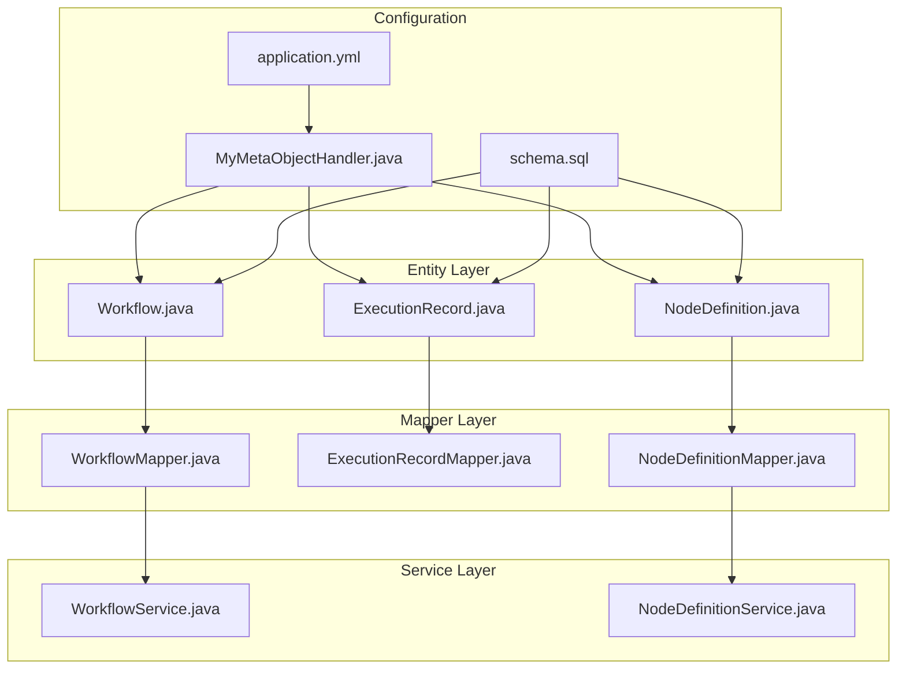
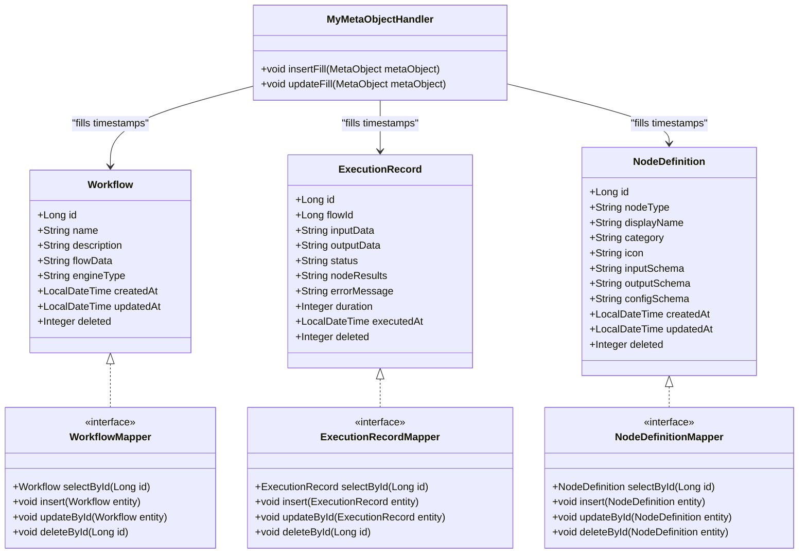
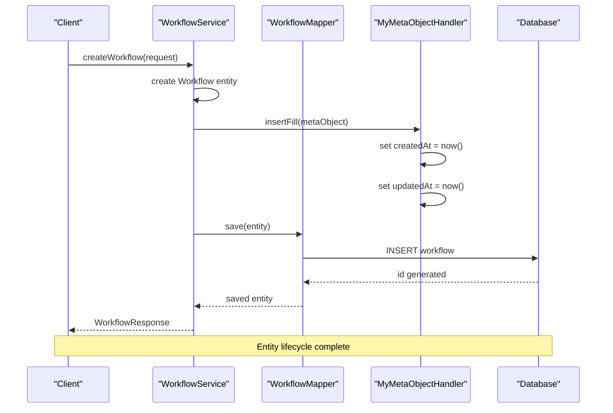
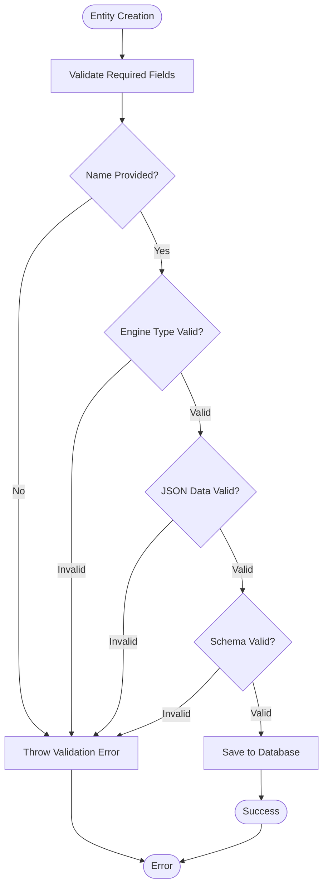
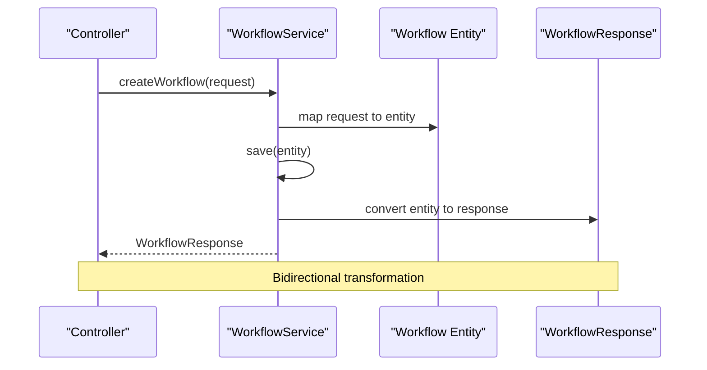
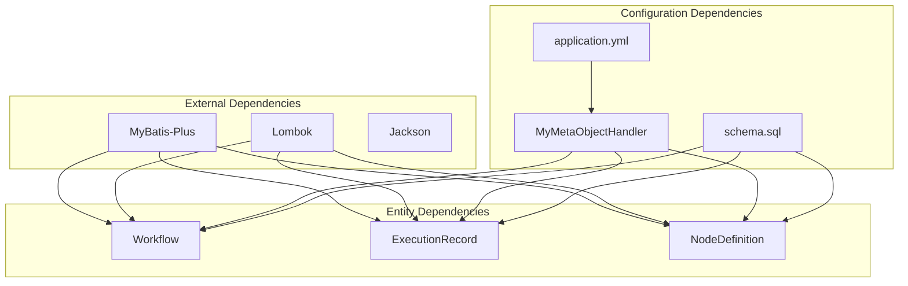

# Entity Definitions

<cite>
**Referenced Files in This Document**
- [Workflow.java](file://backend/src/main/java/com/paiagent/entity/Workflow.java)
- [ExecutionRecord.java](file://backend/src/main/java/com/paiagent/entity/ExecutionRecord.java)
- [NodeDefinition.java](file://backend/src/main/java/com/paiagent/entity/NodeDefinition.java)
- [MyMetaObjectHandler.java](file://backend/src/main/java/com/paiagent/config/MyMetaObjectHandler.java)
- [WorkflowMapper.java](file://backend/src/main/java/com/paiagent/mapper/WorkflowMapper.java)
- [ExecutionRecordMapper.java](file://backend/src/main/java/com/paiagent/mapper/ExecutionRecordMapper.java)
- [NodeDefinitionMapper.java](file://backend/src/main/java/com/paiagent/mapper/NodeDefinitionMapper.java)
- [schema.sql](file://backend/src/main/resources/schema.sql)
- [application.yml](file://backend/src/main/resources/application.yml)
- [WorkflowService.java](file://backend/src/main/java/com/paiagent/service/WorkflowService.java)
- [NodeDefinitionService.java](file://backend/src/main/java/com/paiagent/service/NodeDefinitionService.java)
- [WorkflowResponse.java](file://backend/src/main/java/com/paiagent/dto/WorkflowResponse.java)
</cite>

## Table of Contents
1. [Introduction](#introduction)
2. [Project Structure](#project-structure)
3. [Core Components](#core-components)
4. [Architecture Overview](#architecture-overview)
5. [Detailed Component Analysis](#detailed-component-analysis)
6. [Dependency Analysis](#dependency-analysis)
7. [Performance Considerations](#performance-considerations)
8. [Troubleshooting Guide](#troubleshooting-guide)
9. [Conclusion](#conclusion)

## Introduction
This document provides comprehensive entity documentation for the three core data models in the PaiAgent-LangGraph4J project. It covers the Workflow entity for storing workflow configurations and JSON-based flow data, the ExecutionRecord entity for tracking execution history with status and timing information, and the NodeDefinition entity for managing reusable node templates. The documentation includes field definitions, data types, MyBatis-Plus annotations, validation rules, lifecycle management, business rule enforcement, and data transformation patterns.

## Project Structure
The entities are part of the backend module under the com.paiagent.entity package, with corresponding MyBatis-Plus mappers, services, and configuration files. The database schema is defined in schema.sql with appropriate indexes and constraints.

**Diagram sources**
- [Workflow.java:1-58](file://backend/src/main/java/com/paiagent/entity/Workflow.java#L1-L58)
- [ExecutionRecord.java:1-67](file://backend/src/main/java/com/paiagent/entity/ExecutionRecord.java#L1-L67)
- [NodeDefinition.java:1-73](file://backend/src/main/java/com/paiagent/entity/NodeDefinition.java#L1-L73)
- [WorkflowMapper.java:1-13](file://backend/src/main/java/com/paiagent/mapper/WorkflowMapper.java#L1-L13)
- [ExecutionRecordMapper.java:1-13](file://backend/src/main/java/com/paiagent/mapper/ExecutionRecordMapper.java#L1-L13)
- [NodeDefinitionMapper.java:1-13](file://backend/src/main/java/com/paiagent/mapper/NodeDefinitionMapper.java#L1-L13)
- [MyMetaObjectHandler.java:1-27](file://backend/src/main/java/com/paiagent/config/MyMetaObjectHandler.java#L1-L27)
- [application.yml:21-35](file://backend/src/main/resources/application.yml#L21-L35)
- [schema.sql:6-51](file://backend/src/main/resources/schema.sql#L6-L51)

**Section sources**
- [Workflow.java:1-58](file://backend/src/main/java/com/paiagent/entity/Workflow.java#L1-L58)
- [ExecutionRecord.java:1-67](file://backend/src/main/java/com/paiagent/entity/ExecutionRecord.java#L1-L67)
- [NodeDefinition.java:1-73](file://backend/src/main/java/com/paiagent/entity/NodeDefinition.java#L1-L73)
- [schema.sql:6-51](file://backend/src/main/resources/schema.sql#L6-L51)

## Core Components
This section documents the three core entities with their field definitions, data types, annotations, and validation rules.

### Workflow Entity
The Workflow entity stores workflow configurations and JSON-based flow data with comprehensive metadata tracking.

**Primary Fields:**
- `id`: Long (Auto-increment primary key)
- `name`: String (255 chars max, required)
- `description`: String (Text, optional)
- `flowData`: String (JSON format, required)
- `engineType`: String (50 chars max, default: 'dag')

**Timestamp Fields:**
- `createdAt`: LocalDateTime (automatically filled on insert)
- `updatedAt`: LocalDateTime (automatically filled on insert/update)

**Soft Deletion:**
- `deleted`: Integer (logic delete flag, 0=active, 1=deleted)

**MyBatis-Plus Annotations:**
- `@TableName("workflow")`: Maps to workflow table
- `@TableId(type = IdType.AUTO)`: Auto-increment primary key
- `@TableLogic`: Enables soft deletion
- `@TableField(fill = FieldFill.INSERT)`: Automatic creation timestamp
- `@TableField(fill = FieldFill.INSERT_UPDATE)`: Automatic update timestamp

**Validation Rules:**
- Name is required and limited to 255 characters
- Flow data must be valid JSON
- Engine type defaults to 'dag' if not specified
- Soft deletion uses tinyint with 0/1 values

### ExecutionRecord Entity
The ExecutionRecord entity tracks execution history with comprehensive status and timing information.

**Primary Fields:**
- `id`: Long (Auto-increment primary key)
- `flowId`: Long (Foreign key to workflow)
- `inputData`: String (JSON format, optional)
- `outputData`: String (JSON format, optional)
- `status`: String (50 chars max, required: 'SUCCESS' or 'FAILED')
- `nodeResults`: String (JSON format, optional)
- `errorMessage`: String (Text, optional)
- `duration`: Integer (milliseconds, optional)

**Timestamp Fields:**
- `executedAt`: LocalDateTime (automatically filled on insert)

**Soft Deletion:**
- `deleted`: Integer (logic delete flag, 0=active, 1=deleted)

**MyBatis-Plus Annotations:**
- `@TableName("execution_record")`: Maps to execution_record table
- `@TableId(type = IdType.AUTO)`: Auto-increment primary key
- `@TableLogic`: Enables soft deletion
- `@TableField(fill = FieldFill.INSERT)`: Automatic execution timestamp

**Validation Rules:**
- Status must be either 'SUCCESS' or 'FAILED'
- Duration is measured in milliseconds
- All JSON fields must contain valid JSON data
- Flow ID references existing workflow

### NodeDefinition Entity
The NodeDefinition entity manages reusable node templates with JSON Schema validation capabilities.

**Primary Fields:**
- `id`: Long (Auto-increment primary key)
- `nodeType`: String (100 chars max, unique, required)
- `displayName`: String (255 chars max, required)
- `category`: String (50 chars max, required: 'LLM' or 'TOOL' or 'IO')
- `icon`: String (255 chars max, optional)
- `inputSchema`: String (JSON Schema, optional)
- `outputSchema`: String (JSON Schema, optional)
- `configSchema`: String (JSON Schema, optional)

**Timestamp Fields:**
- `createdAt`: LocalDateTime (automatically filled on insert)
- `updatedAt`: LocalDateTime (automatically filled on insert/update)

**Soft Deletion:**
- `deleted`: Integer (logic delete flag, 0=active, 1=deleted)

**MyBatis-Plus Annotations:**
- `@TableName("node_definition")`: Maps to node_definition table
- `@TableId(type = IdType.AUTO)`: Auto-increment primary key
- `@TableLogic`: Enables soft deletion
- `@TableField(fill = FieldFill.INSERT)`: Automatic creation timestamp
- `@TableField(fill = FieldFill.INSERT_UPDATE)`: Automatic update timestamp

**Validation Rules:**
- NodeType is unique and required
- Category must be one of 'LLM', 'TOOL', or 'IO'
- All JSON Schema fields must contain valid JSON Schema definitions
- Icons are optional but should follow the design system

**Section sources**
- [Workflow.java:10-57](file://backend/src/main/java/com/paiagent/entity/Workflow.java#L10-L57)
- [ExecutionRecord.java:11-66](file://backend/src/main/java/com/paiagent/entity/ExecutionRecord.java#L11-L66)
- [NodeDefinition.java:11-72](file://backend/src/main/java/com/paiagent/entity/NodeDefinition.java#L11-L72)

## Architecture Overview
The entity layer follows a clean architecture pattern with clear separation of concerns between entities, mappers, services, and configuration.

**Diagram sources**
- [Workflow.java:10-57](file://backend/src/main/java/com/paiagent/entity/Workflow.java#L10-L57)
- [ExecutionRecord.java:11-66](file://backend/src/main/java/com/paiagent/entity/ExecutionRecord.java#L11-L66)
- [NodeDefinition.java:11-72](file://backend/src/main/java/com/paiagent/entity/NodeDefinition.java#L11-L72)
- [WorkflowMapper.java:10-12](file://backend/src/main/java/com/paiagent/mapper/WorkflowMapper.java#L10-L12)
- [ExecutionRecordMapper.java:10-12](file://backend/src/main/java/com/paiagent/mapper/ExecutionRecordMapper.java#L10-L12)
- [NodeDefinitionMapper.java:10-12](file://backend/src/main/java/com/paiagent/mapper/NodeDefinitionMapper.java#L10-L12)
- [MyMetaObjectHandler.java:13-26](file://backend/src/main/java/com/paiagent/config/MyMetaObjectHandler.java#L13-L26)

## Detailed Component Analysis

### Entity Lifecycle Management
The entities implement comprehensive lifecycle management through MyBatis-Plus annotations and automatic field filling.

**Diagram sources**
- [WorkflowService.java:24-34](file://backend/src/main/java/com/paiagent/service/WorkflowService.java#L24-L34)
- [MyMetaObjectHandler.java:15-20](file://backend/src/main/java/com/paiagent/config/MyMetaObjectHandler.java#L15-L20)
- [WorkflowMapper.java:11](file://backend/src/main/java/com/paiagent/mapper/WorkflowMapper.java#L11)

### Business Rule Enforcement
The entities enforce business rules through database constraints and application-level validation.

**Diagram sources**
- [Workflow.java:30-38](file://backend/src/main/java/com/paiagent/entity/Workflow.java#L30-L38)
- [NodeDefinition.java:40-53](file://backend/src/main/java/com/paiagent/entity/NodeDefinition.java#L40-L53)
- [ExecutionRecord.java:35-48](file://backend/src/main/java/com/paiagent/entity/ExecutionRecord.java#L35-L48)

### Data Transformation Patterns
The entities participate in various data transformation patterns through DTOs and service layer conversions.

**Diagram sources**
- [WorkflowService.java:24-34](file://backend/src/main/java/com/paiagent/service/WorkflowService.java#L24-L34)
- [WorkflowResponse.java:9-19](file://backend/src/main/java/com/paiagent/dto/WorkflowResponse.java#L9-L19)

**Section sources**
- [MyMetaObjectHandler.java:13-26](file://backend/src/main/java/com/paiagent/config/MyMetaObjectHandler.java#L13-L26)
- [WorkflowService.java:18-94](file://backend/src/main/java/com/paiagent/service/WorkflowService.java#L18-L94)
- [NodeDefinitionService.java:13-31](file://backend/src/main/java/com/paiagent/service/NodeDefinitionService.java#L13-L31)

## Dependency Analysis
The entities have minimal direct dependencies, relying on MyBatis-Plus for persistence and Lombok for boilerplate reduction.

**Diagram sources**
- [Workflow.java:3](file://backend/src/main/java/com/paiagent/entity/Workflow.java#L3)
- [ExecutionRecord.java:3](file://backend/src/main/java/com/paiagent/entity/ExecutionRecord.java#L3)
- [NodeDefinition.java:3](file://backend/src/main/java/com/paiagent/entity/NodeDefinition.java#L3)
- [MyMetaObjectHandler.java:3](file://backend/src/main/java/com/paiagent/config/MyMetaObjectHandler.java#L3)
- [application.yml:21-35](file://backend/src/main/resources/application.yml#L21-L35)

**Section sources**
- [Workflow.java:1-58](file://backend/src/main/java/com/paiagent/entity/Workflow.java#L1-L58)
- [ExecutionRecord.java:1-67](file://backend/src/main/java/com/paiagent/entity/ExecutionRecord.java#L1-L67)
- [NodeDefinition.java:1-73](file://backend/src/main/java/com/paiagent/entity/NodeDefinition.java#L1-L73)

## Performance Considerations
The entities are designed for optimal performance with strategic indexing and efficient data types.

- **Indexing Strategy**: Primary keys are auto-incremented, with additional indexes on frequently queried columns (created_at, updated_at, executed_at, status, flow_id, category)
- **Data Types**: JSON fields are stored as JSON type in MySQL for efficient querying and validation
- **Soft Deletion**: Uses tinyint with 0/1 values for minimal storage overhead
- **Automatic Timestamps**: Reduces application-level timestamp management overhead
- **JSON Schema Validation**: Enforces data integrity at the database level

## Troubleshooting Guide
Common issues and their resolutions:

### Soft Deletion Issues
- **Problem**: Deleted records still appear in queries
- **Solution**: Configure MyBatis-Plus global configuration with proper logic delete field settings
- **Reference**: [application.yml:32-34](file://backend/src/main/resources/application.yml#L32-L34)

### JSON Data Validation
- **Problem**: JSON parsing errors when saving entities
- **Solution**: Ensure JSON data conforms to expected schema format
- **Reference**: [schema.sql:11](file://backend/src/main/resources/schema.sql#L11), [schema.sql:40](file://backend/src/main/resources/schema.sql#L40)

### Timestamp Synchronization
- **Problem**: Timestamps not updating correctly
- **Solution**: Verify MyMetaObjectHandler is properly configured and loaded
- **Reference**: [MyMetaObjectHandler.java:15-25](file://backend/src/main/java/com/paiagent/config/MyMetaObjectHandler.java#L15-L25)

### Entity Mapping Issues
- **Problem**: Field name mismatches between entities and database
- **Solution**: Ensure @TableName and @TableField annotations match database schema
- **Reference**: [schema.sql:7](file://backend/src/main/resources/schema.sql#L7), [schema.sql:21](file://backend/src/main/resources/schema.sql#L21)

**Section sources**
- [application.yml:32-34](file://backend/src/main/resources/application.yml#L32-L34)
- [schema.sql:11](file://backend/src/main/resources/schema.sql#L11)
- [schema.sql:40](file://backend/src/main/resources/schema.sql#L40)
- [MyMetaObjectHandler.java:15-25](file://backend/src/main/java/com/paiagent/config/MyMetaObjectHandler.java#L15-L25)

## Conclusion
The three core entities (Workflow, ExecutionRecord, and NodeDefinition) form a robust foundation for the PaiAgent-LangGraph4J platform. They implement comprehensive lifecycle management through MyBatis-Plus annotations, enforce business rules via database constraints and application validation, and support efficient data transformation patterns. The design emphasizes maintainability, performance, and extensibility while providing clear separation of concerns between the entity layer and other application components.