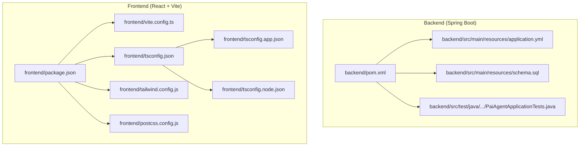
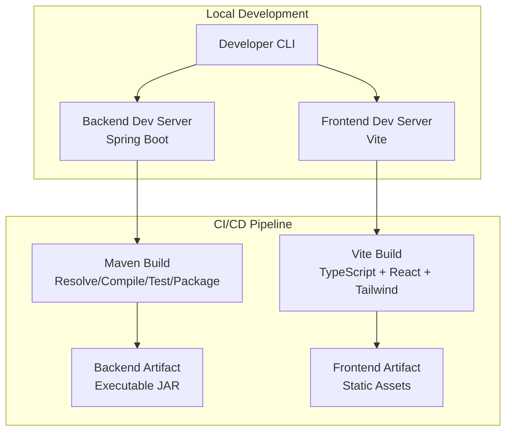
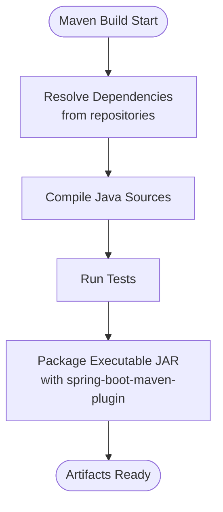
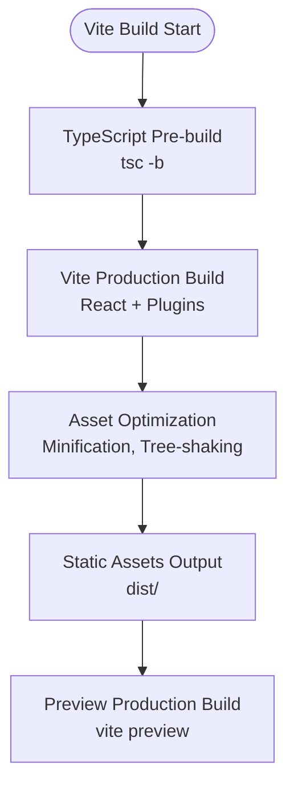
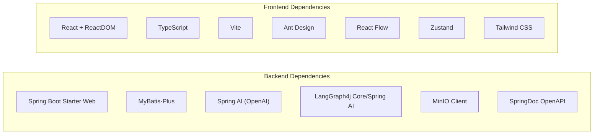

# Build Process

<cite>
**Referenced Files in This Document**
- [pom.xml](file://backend/pom.xml)
- [application.yml](file://backend/src/main/resources/application.yml)
- [schema.sql](file://backend/src/main/resources/schema.sql)
- [package.json](file://frontend/package.json)
- [vite.config.ts](file://frontend/vite.config.ts)
- [tsconfig.json](file://frontend/tsconfig.json)
- [tsconfig.app.json](file://frontend/tsconfig.app.json)
- [tsconfig.node.json](file://frontend/tsconfig.node.json)
- [tailwind.config.js](file://frontend/tailwind.config.js)
- [postcss.config.js](file://frontend/postcss.config.js)
- [PaiAgentApplicationTests.java](file://backend/src/test/java/com/paiagent/PaiAgentApplicationTests.java)
- [README.md](file://README.md)
</cite>

## Table of Contents
1. [Introduction](#introduction)
2. [Project Structure](#project-structure)
3. [Core Components](#core-components)
4. [Architecture Overview](#architecture-overview)
5. [Detailed Component Analysis](#detailed-component-analysis)
6. [Dependency Analysis](#dependency-analysis)
7. [Performance Considerations](#performance-considerations)
8. [Troubleshooting Guide](#troubleshooting-guide)
9. [Conclusion](#conclusion)
10. [Appendices](#appendices)

## Introduction
This document provides comprehensive build process documentation for both the Spring Boot backend and the React/Vite frontend. It covers Maven build phases for dependency resolution, compilation, testing, and packaging; Vite build configuration for development and production; environment-specific configuration via Spring profiles; optimization flags for production; artifact generation locations; and step-by-step instructions for local development and CI/CD environments. It also includes troubleshooting guidance for dependency conflicts and build performance optimization techniques.

## Project Structure
The project follows a clear separation between backend and frontend:
- Backend: Spring Boot application built with Maven, configured via pom.xml and application.yml.
- Frontend: React application built with Vite, TypeScript, and Tailwind CSS, configured via package.json, vite.config.ts, and related TypeScript configuration files.

**Diagram sources**
- [pom.xml:1-163](file://backend/pom.xml#L1-L163)
- [application.yml:1-55](file://backend/src/main/resources/application.yml#L1-L55)
- [schema.sql:1-84](file://backend/src/main/resources/schema.sql#L1-L84)
- [package.json:1-40](file://frontend/package.json#L1-L40)
- [vite.config.ts:1-8](file://frontend/vite.config.ts#L1-L8)
- [tsconfig.json:1-8](file://frontend/tsconfig.json#L1-L8)
- [tsconfig.app.json:1-27](file://frontend/tsconfig.app.json#L1-L27)
- [tsconfig.node.json:1-24](file://frontend/tsconfig.node.json#L1-L24)
- [tailwind.config.js:1-13](file://frontend/tailwind.config.js#L1-L13)
- [postcss.config.js:1-6](file://frontend/postcss.config.js#L1-L6)

**Section sources**
- [pom.xml:1-163](file://backend/pom.xml#L1-L163)
- [application.yml:1-55](file://backend/src/main/resources/application.yml#L1-L55)
- [schema.sql:1-84](file://backend/src/main/resources/schema.sql#L1-L84)
- [package.json:1-40](file://frontend/package.json#L1-L40)
- [vite.config.ts:1-8](file://frontend/vite.config.ts#L1-L8)
- [tsconfig.json:1-8](file://frontend/tsconfig.json#L1-L8)
- [tsconfig.app.json:1-27](file://frontend/tsconfig.app.json#L1-L27)
- [tsconfig.node.json:1-24](file://frontend/tsconfig.node.json#L1-L24)
- [tailwind.config.js:1-13](file://frontend/tailwind.config.js#L1-L13)
- [postcss.config.js:1-6](file://frontend/postcss.config.js#L1-L6)

## Core Components
- Backend build toolchain: Maven with Spring Boot plugin, compiler plugin, and dependency management.
- Frontend build toolchain: Vite with React plugin, TypeScript compilation, Tailwind CSS, and PostCSS pipeline.
- Environment configuration: Spring application.yml for runtime configuration; database initialization script included in resources.
- Testing: JUnit-based Spring Boot test scaffold.

**Section sources**
- [pom.xml:133-161](file://backend/pom.xml#L133-L161)
- [package.json:6-11](file://frontend/package.json#L6-L11)
- [vite.config.ts:5-7](file://frontend/vite.config.ts#L5-L7)
- [application.yml:1-55](file://backend/src/main/resources/application.yml#L1-L55)
- [schema.sql:1-84](file://backend/src/main/resources/schema.sql#L1-L84)
- [PaiAgentApplicationTests.java:1-14](file://backend/src/test/java/com/paiagent/PaiAgentApplicationTests.java#L1-L14)

## Architecture Overview
The build architecture separates concerns between backend and frontend while enabling seamless integration during development and deployment.

[No sources needed since this diagram shows conceptual workflow, not actual code structure]

## Detailed Component Analysis

### Backend Build with Maven
The backend uses Maven with Spring Boot plugin for building, testing, and packaging. Key aspects:
- Java version and dependency management properties.
- Dependency management for Spring AI Bill of Materials.
- Repositories for milestone artifacts.
- Dependencies include web starter, validation, MyBatis-Plus, OpenAPI/Swagger, JSON library, AI SDKs, MinIO client, and LangGraph4j integrations.
- Plugins:
  - maven-compiler-plugin with annotation processor path for Lombok.
  - spring-boot-maven-plugin with exclusion of Lombok from the final artifact.

**Diagram sources**
- [pom.xml:29-47](file://backend/pom.xml#L29-L47)
- [pom.xml:60-131](file://backend/pom.xml#L60-L131)
- [pom.xml:133-161](file://backend/pom.xml#L133-L161)

Maven build commands (typical usage):
- Clean and compile: mvn clean compile
- Run tests: mvn test
- Package executable JAR: mvn package
- Run with Spring Boot plugin: mvn spring-boot:run
- Install dependencies: mvn install

Environment-specific configuration:
- Application properties are loaded from backend/src/main/resources/application.yml.
- Database connection, timezone, Jackson formatting, OpenAI API key placeholder, MyBatis-Plus settings, OpenAPI/Swagger UI, and MinIO endpoints are configured here.
- The schema.sql initializes database tables and seed data.

Artifact generation:
- Backend artifact location: backend/target (executable JAR produced by spring-boot-maven-plugin).

**Section sources**
- [pom.xml:29-47](file://backend/pom.xml#L29-L47)
- [pom.xml:60-131](file://backend/pom.xml#L60-L131)
- [pom.xml:133-161](file://backend/pom.xml#L133-L161)
- [application.yml:1-55](file://backend/src/main/resources/application.yml#L1-L55)
- [schema.sql:1-84](file://backend/src/main/resources/schema.sql#L1-L84)

### Frontend Build with Vite
The frontend build leverages Vite with React and TypeScript:
- Scripts:
  - dev: vite (development server)
  - build: tsc -b && vite build (TypeScript pre-build + Vite production build)
  - preview: vite preview (local preview of production build)
  - lint: eslint .
- Vite configuration enables React plugin.
- TypeScript configurations split into app and node contexts with bundler module resolution.
- Tailwind CSS and PostCSS pipeline configured for styling.

**Diagram sources**
- [package.json:6-11](file://frontend/package.json#L6-L11)
- [vite.config.ts:5-7](file://frontend/vite.config.ts#L5-L7)
- [tsconfig.app.json:10-16](file://frontend/tsconfig.app.json#L10-L16)
- [tailwind.config.js:3-6](file://frontend/tailwind.config.js#L3-L6)
- [postcss.config.js:1-5](file://frontend/postcss.config.js#L1-L5)

Frontend build commands (typicall usage):
- Install dependencies: npm install
- Development: npm run dev
- Production build: npm run build
- Preview production build locally: npm run preview
- Lint: npm run lint

Optimization flags and asset generation:
- Vite performs automatic code splitting and tree-shaking.
- Tailwind CSS processes styles based on configured content globs.
- Output directory for production build: frontend/dist.

**Section sources**
- [package.json:6-11](file://frontend/package.json#L6-L11)
- [vite.config.ts:5-7](file://frontend/vite.config.ts#L5-L7)
- [tsconfig.app.json:10-16](file://frontend/tsconfig.app.json#L10-L16)
- [tsconfig.node.json:9-14](file://frontend/tsconfig.node.json#L9-L14)
- [tailwind.config.js:3-6](file://frontend/tailwind.config.js#L3-L6)
- [postcss.config.js:1-5](file://frontend/postcss.config.js#L1-L5)

### Environment Profiles and Configuration
- Backend profile support: Spring Boot supports multiple profiles via application.yml and external property files. Placeholders and environment variable overrides are supported (for example, OPENAI_API_KEY).
- Frontend environment: Vite loads environment variables prefixed with VITE_ by default. Configure environment variables per developer or CI needs.

Note: The repository does not include explicit Spring profile files beyond application.yml. To enable environment-specific builds, create additional application-{profile}.yml files and activate profiles via spring.profiles.active or environment variables.

**Section sources**
- [application.yml:18-19](file://backend/src/main/resources/application.yml#L18-L19)
- [README.md:284-376](file://README.md#L284-L376)

### Step-by-Step Build Instructions

#### Local Development
- Backend:
  - Navigate to backend directory.
  - Start backend: mvn spring-boot:run
  - Default server port is configured in application.yml.
- Frontend:
  - Navigate to frontend directory.
  - Install dependencies: npm install
  - Start dev server: npm run dev
  - Access frontend at http://localhost:5173 (as indicated in README).

#### CI/CD Environments
- Backend:
  - Maven wrapper recommended: ./mvnw (Windows) or mvnw (Unix-like).
  - Typical CI steps: mvn clean install (or test) followed by mvn package to produce the executable JAR.
- Frontend:
  - Install dependencies: npm ci (recommended in CI).
  - Build: npm run build
  - Publish artifacts from dist/ for hosting or containerization.

**Section sources**
- [README.md:336-376](file://README.md#L336-L376)
- [pom.xml:149-159](file://backend/pom.xml#L149-L159)
- [package.json:6-11](file://frontend/package.json#L6-L11)

## Dependency Analysis
The backend and frontend have distinct dependency ecosystems managed by Maven and npm respectively. The backend integrates Spring Boot, MyBatis-Plus, Spring AI, OpenAI-compatible SDKs, LangGraph4j, and MinIO. The frontend integrates React, TypeScript, Vite, Ant Design, React Flow, and Tailwind CSS.

**Diagram sources**
- [pom.xml:60-131](file://backend/pom.xml#L60-L131)
- [package.json:12-21](file://frontend/package.json#L12-L21)
- [package.json:22-38](file://frontend/package.json#L22-L38)

**Section sources**
- [pom.xml:60-131](file://backend/pom.xml#L60-L131)
- [package.json:12-38](file://frontend/package.json#L12-L38)

## Performance Considerations
- Backend:
  - Use Maven’s parallel builds and dependency updates to speed up resolution.
  - Prefer incremental compilation and avoid unnecessary re-runs of heavy tasks.
  - Keep dependency versions aligned with Spring Boot BOM to reduce transitive conflicts.
- Frontend:
  - Use npm ci in CI for deterministic installs.
  - Enable Vite’s built-in code splitting and lazy loading for optimal bundle sizes.
  - Tailwind CSS purging and minification are handled automatically; ensure content globs are accurate to prevent unused CSS inclusion.
  - Leverage browser caching and CDN delivery for static assets in production.

[No sources needed since this section provides general guidance]

## Troubleshooting Guide
Common build issues and resolutions:
- Backend dependency conflicts:
  - Align versions with Spring Boot parent BOM and Spring AI BOM.
  - Exclude conflicting transitive dependencies and force compatible versions if necessary.
  - Clear local Maven repository cache if stale artifacts cause issues.
- Frontend dependency conflicts:
  - Use npm ci to ensure reproducible installs.
  - Resolve peer dependency warnings by aligning versions of React, TypeScript, and Vite ecosystem packages.
- Build failures due to Java version mismatch:
  - Ensure JAVA_HOME and PATH point to Java 21+ as required by the project.
- Frontend build errors:
  - Verify Vite and React plugin compatibility.
  - Check TypeScript strictness settings and bundler module resolution in tsconfig files.
- Database initialization:
  - Apply schema.sql to the configured database before running the backend.
  - Confirm JDBC URL, credentials, and timezone settings in application.yml match the target environment.

**Section sources**
- [pom.xml:29-47](file://backend/pom.xml#L29-L47)
- [application.yml:8-11](file://backend/src/main/resources/application.yml#L8-L11)
- [schema.sql:1-84](file://backend/src/main/resources/schema.sql#L1-L84)
- [package.json:22-38](file://frontend/package.json#L22-L38)
- [tsconfig.app.json:19-23](file://frontend/tsconfig.app.json#L19-L23)
- [tsconfig.node.json:16-21](file://frontend/tsconfig.node.json#L16-L21)

## Conclusion
The project employs robust build systems for both backend and frontend. The Spring Boot backend relies on Maven with clear plugin configuration and environment-aware properties, while the frontend uses Vite with TypeScript and Tailwind CSS for efficient development and optimized production builds. Following the documented commands and best practices ensures reliable local development and CI/CD pipelines.

[No sources needed since this section summarizes without analyzing specific files]

## Appendices

### Backend Build Phases and Artifacts
- Phases: dependency resolution, compilation, testing, packaging.
- Artifacts: executable JAR under backend/target.
- Environment variables: OPENAI_API_KEY placeholder in application.yml.

**Section sources**
- [pom.xml:133-161](file://backend/pom.xml#L133-L161)
- [application.yml:18-19](file://backend/src/main/resources/application.yml#L18-L19)

### Frontend Build Outputs and Optimization
- Output directory: frontend/dist.
- Optimizations: Vite minification, tree-shaking, React Fast Refresh, Tailwind CSS processing.
- Scripts: dev, build, preview, lint.

**Section sources**
- [package.json:6-11](file://frontend/package.json#L6-L11)
- [vite.config.ts:5-7](file://frontend/vite.config.ts#L5-L7)
- [tailwind.config.js:3-6](file://frontend/tailwind.config.js#L3-L6)