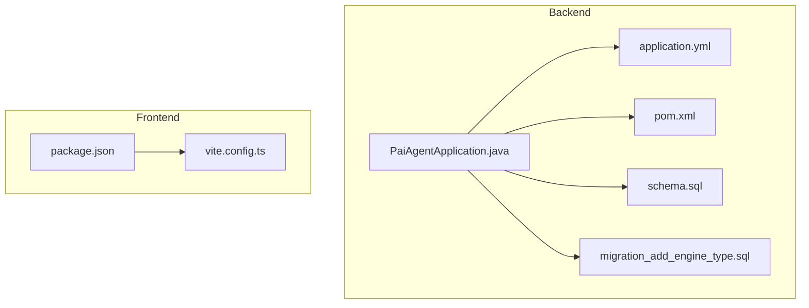
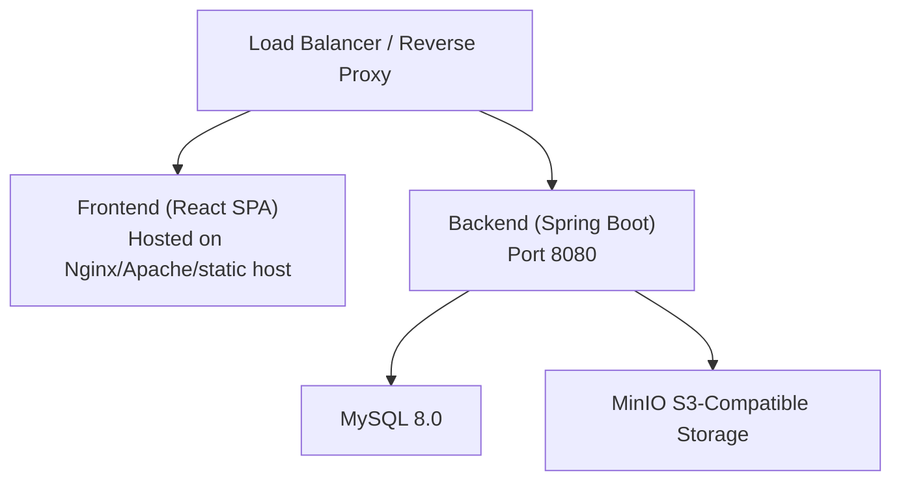
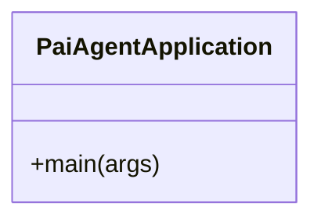
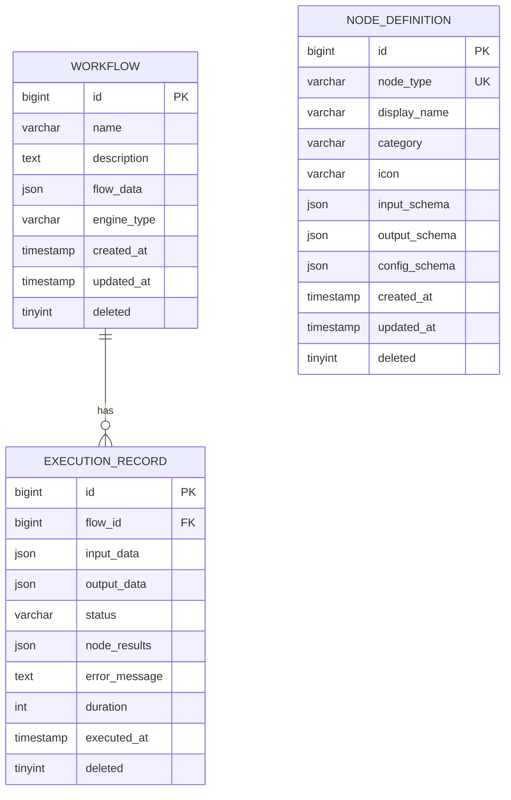
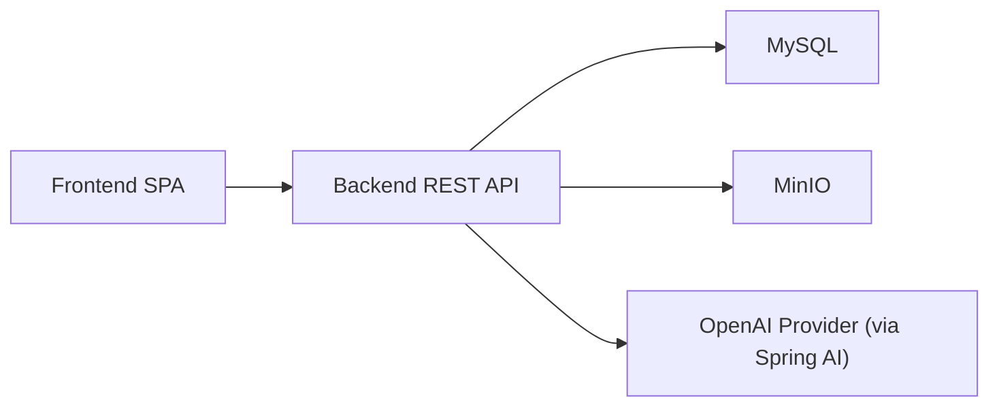

# Deployment & Operations

<cite>
**Referenced Files in This Document**
- [backend pom.xml](file://backend/pom.xml)
- [backend application.yml](file://backend/src/main/resources/application.yml)
- [backend schema.sql](file://backend/src/main/resources/schema.sql)
- [backend migration_add_engine_type.sql](file://backend/src/main/resources/migration_add_engine_type.sql)
- [backend README.md](file://backend/README.md)
- [backend PaiAgentApplication.java](file://backend/src/main/java/com/paiagent/PaiAgentApplication.java)
- [frontend package.json](file://frontend/package.json)
- [frontend vite.config.ts](file://frontend/vite.config.ts)
</cite>

## Table of Contents
1. [Introduction](#introduction)
2. [Project Structure](#project-structure)
3. [Core Components](#core-components)
4. [Architecture Overview](#architecture-overview)
5. [Detailed Component Analysis](#detailed-component-analysis)
6. [Dependency Analysis](#dependency-analysis)
7. [Performance Considerations](#performance-considerations)
8. [Troubleshooting Guide](#troubleshooting-guide)
9. [Conclusion](#conclusion)
10. [Appendices](#appendices)

## Introduction
This document provides comprehensive deployment and operations guidance for the PaiAgent platform, covering both backend and frontend build processes, production deployment strategies, environment configuration, database migrations, monitoring and logging, performance tuning, scaling, backup and disaster recovery, security hardening, maintenance schedules, and troubleshooting.

## Project Structure
The project consists of two primary components:
- Backend: Spring Boot application built with Maven, using Java 21, Spring Web, MyBatis-Plus, MySQL, and optional AI providers via Spring AI.
- Frontend: React-based single-page application built with Vite and TypeScript.

**Diagram sources**
- [backend PaiAgentApplication.java:1-16](file://backend/src/main/java/com/paiagent/PaiAgentApplication.java#L1-L16)
- [backend application.yml:1-55](file://backend/src/main/resources/application.yml#L1-L55)
- [backend pom.xml:1-163](file://backend/pom.xml#L1-L163)
- [backend schema.sql:1-84](file://backend/src/main/resources/schema.sql#L1-L84)
- [backend migration_add_engine_type.sql:1-17](file://backend/src/main/resources/migration_add_engine_type.sql#L1-L17)
- [frontend package.json:1-40](file://frontend/package.json#L1-L40)
- [frontend vite.config.ts:1-8](file://frontend/vite.config.ts#L1-L8)

**Section sources**
- [backend pom.xml:1-163](file://backend/pom.xml#L1-L163)
- [backend application.yml:1-55](file://backend/src/main/resources/application.yml#L1-L55)
- [backend schema.sql:1-84](file://backend/src/main/resources/schema.sql#L1-L84)
- [backend migration_add_engine_type.sql:1-17](file://backend/src/main/resources/migration_add_engine_type.sql#L1-L17)
- [backend README.md:1-75](file://backend/README.md#L1-L75)
- [backend PaiAgentApplication.java:1-16](file://backend/src/main/java/com/paiagent/PaiAgentApplication.java#L1-L16)
- [frontend package.json:1-40](file://frontend/package.json#L1-L40)
- [frontend vite.config.ts:1-8](file://frontend/vite.config.ts#L1-L8)

## Core Components
- Backend build and packaging:
  - Maven coordinates: groupId=com.paiagent, artifactId=paiagent-backend, version=0.0.1-SNAPSHOT.
  - Java 21 target with Spring Boot 3.4.1 and MyBatis-Plus 3.5.5.
  - Dependencies include Spring Web, MyBatis-Plus starter, MySQL connector, SpringDoc OpenAPI, Alibaba DashScope SDK, MinIO client, Spring AI OpenAI starter, and LangGraph4j integrations.
  - Build uses spring-boot-maven-plugin with Lombok exclusion and annotation processor configuration.
- Frontend build and packaging:
  - Scripts include dev, build, lint, and preview.
  - Build pipeline compiles TypeScript and runs Vite to produce optimized static assets.
  - Vite plugin stack includes React and TailwindCSS tooling.

Build commands summary:
- Backend (Maven):
  - Local development: ./mvnw spring-boot:run
  - Packaging: ./mvnw clean package (produces executable JAR)
- Frontend (npm/Vite):
  - Local development: npm run dev
  - Production build: npm run build (outputs to dist/)

Optimization flags and artifacts:
- Backend: spring-boot-maven-plugin produces an optimized executable JAR with embedded server.
- Frontend: Vite build enables tree-shaking and minification by default; adjust Vite configuration for advanced bundling if needed.

**Section sources**
- [backend pom.xml:1-163](file://backend/pom.xml#L1-L163)
- [backend README.md:13-47](file://backend/README.md#L13-L47)
- [frontend package.json:6-11](file://frontend/package.json#L6-L11)
- [frontend vite.config.ts:1-8](file://frontend/vite.config.ts#L1-L8)

## Architecture Overview
High-level runtime architecture for production deployment:

Operational flow:
- Clients access the frontend via HTTPS through a reverse proxy or CDN.
- The reverse proxy forwards API requests to the backend service.
- The backend connects to MySQL for persistence and MinIO for object storage.
- Environment variables supply secrets and dynamic configuration (e.g., OPENAI_API_KEY).

**Diagram sources**
- [backend application.yml:1-55](file://backend/src/main/resources/application.yml#L1-L55)

**Section sources**
- [backend application.yml:1-55](file://backend/src/main/resources/application.yml#L1-L55)

## Detailed Component Analysis

### Backend Application Packaging and Runtime
- Entry point: Spring Boot application class annotated with @SpringBootApplication and @MapperScan.
- Packaging: spring-boot-maven-plugin generates an executable JAR with embedded Tomcat/Jetty and excludes Lombok from runtime.
- Annotation processing: Lombok configured via maven-compiler-plugin annotationProcessorPaths.

**Diagram sources**
- [backend PaiAgentApplication.java:1-16](file://backend/src/main/java/com/paiagent/PaiAgentApplication.java#L1-L16)

**Section sources**
- [backend pom.xml:133-161](file://backend/pom.xml#L133-L161)
- [backend PaiAgentApplication.java:1-16](file://backend/src/main/java/com/paiagent/PaiAgentApplication.java#L1-L16)

### Database Schema and Migrations
- Initial schema creates three tables: workflow, node_definition, and execution_record, with JSON columns for flexible configurations and results.
- Predefined node definitions include IO and LLM/tool nodes with JSON schema for inputs, outputs, and configuration.
- Migration script adds engine_type column to workflow table to support LangGraph4j alongside DAG engine, preserving backward compatibility with default value.

**Diagram sources**
- [backend schema.sql:6-51](file://backend/src/main/resources/schema.sql#L6-L51)

**Section sources**
- [backend schema.sql:1-84](file://backend/src/main/resources/schema.sql#L1-L84)
- [backend migration_add_engine_type.sql:1-17](file://backend/src/main/resources/migration_add_engine_type.sql#L1-L17)

### Environment Configuration Management
- Port: 8080 (HTTP).
- Datasource: MySQL JDBC URL, credentials, timezone, and character encoding.
- Jackson: timezone and date format.
- SpringDoc: OpenAPI and Swagger UI endpoints.
- MinIO: endpoint, keys, bucket, and public URL.
- AI provider: OpenAI API key supplied via environment variable placeholder.

Recommendations:
- Store secrets in environment variables or a secrets manager; avoid committing sensitive values to source control.
- Override defaults using Spring profiles (application-prod.yml) and externalized configuration.

**Section sources**
- [backend application.yml:1-55](file://backend/src/main/resources/application.yml#L1-L55)

### Frontend Build and Hosting
- Scripts: dev (Vite dev server), build (TypeScript + Vite production bundle), lint, preview.
- Vite configuration enables React plugin; TailwindCSS is integrated via PostCSS.
- Build output: Vite default dist directory for static assets.

Hosting options:
- Serve dist/ via Nginx/Apache or a static hosting provider.
- Configure reverse proxy to forward API requests to backend origin.

**Section sources**
- [frontend package.json:6-11](file://frontend/package.json#L6-L11)
- [frontend vite.config.ts:1-8](file://frontend/vite.config.ts#L1-L8)

## Dependency Analysis
Runtime dependency graph for production:

External libraries and versions (selected):
- Spring Boot 3.4.1
- MyBatis-Plus 3.5.5
- MySQL Connector/J
- SpringDoc OpenAPI 2.3.0
- Spring AI OpenAI starter
- LangGraph4j core and Spring AI integration
- MinIO Java SDK
- Alibaba DashScope SDK

**Diagram sources**
- [backend pom.xml:60-131](file://backend/pom.xml#L60-L131)

**Section sources**
- [backend pom.xml:37-131](file://backend/pom.xml#L37-L131)

## Performance Considerations
- JVM and application tuning:
  - Use Java 21 with appropriate GC and heap sizing for workload.
  - Enable production-grade logging and metrics collection.
- Database:
  - Ensure proper indexing on frequently queried columns (e.g., workflow.created_at, execution_record.executed_at).
  - Monitor slow queries and consider connection pooling tuning.
- Caching:
  - Introduce application-level caching for read-heavy resources where appropriate.
- CDN and asset optimization:
  - Host frontend on CDN with compression and cache headers.
- Asynchronous processing:
  - Offload long-running tasks to background jobs or message queues if needed.

[No sources needed since this section provides general guidance]

## Troubleshooting Guide
Common deployment issues and resolutions:

- Backend fails to start due to missing database:
  - Verify MySQL connectivity, credentials, and schema initialization.
  - Confirm schema.sql was applied and migration_add_engine_type.sql executed if upgrading.
- OpenAI API key errors:
  - Ensure OPENAI_API_KEY environment variable is set; the configuration uses a placeholder that requires override.
- CORS and static resource serving:
  - Review WebMvc configuration and static resource handlers if frontend-hosting issues occur.
- Frontend build failures:
  - Clear node_modules and reinstall dependencies; confirm Vite and React plugins are present.
- Health checks and logs:
  - Expose health endpoints and configure structured logging for observability.

**Section sources**
- [backend application.yml:15-19](file://backend/src/main/resources/application.yml#L15-L19)
- [backend schema.sql:1-84](file://backend/src/main/resources/schema.sql#L1-L84)
- [backend migration_add_engine_type.sql:1-17](file://backend/src/main/resources/migration_add_engine_type.sql#L1-L17)
- [backend README.md:13-47](file://backend/README.md#L13-L47)

## Conclusion
This guide outlines a practical, production-ready deployment strategy for PaiAgent, covering build processes, configuration management, database migrations, monitoring/logging, performance tuning, scaling, backup/disaster recovery, security hardening, maintenance, and troubleshooting. Adopt the recommended practices to achieve reliable, scalable, and secure operations.

[No sources needed since this section summarizes without analyzing specific files]

## Appendices

### A. Build Commands Reference
- Backend (Maven):
  - Development: ./mvnw spring-boot:run
  - Package: ./mvnw clean package
- Frontend (npm/Vite):
  - Development: npm run dev
  - Production build: npm run build

**Section sources**
- [backend README.md:37-47](file://backend/README.md#L37-L47)
- [frontend package.json:6-11](file://frontend/package.json#L6-L11)

### B. Database Initialization and Migration Checklist
- Initialize schema: apply schema.sql to MySQL.
- Apply migration: run migration_add_engine_type.sql to add engine_type column.
- Verify: confirm table structure and preloaded node definitions.

**Section sources**
- [backend schema.sql:1-84](file://backend/src/main/resources/schema.sql#L1-L84)
- [backend migration_add_engine_type.sql:1-17](file://backend/src/main/resources/migration_add_engine_type.sql#L1-L17)

### C. Containerization Options (Recommended Practices)
- Backend:
  - Multi-stage Docker build to minimize image size.
  - Entrypoint executes the Spring Boot JAR; expose port 8080.
  - Mount persistent volumes for logs and any writable directories.
- Frontend:
  - Serve dist/ via Nginx in a minimal image.
  - Configure gzip/br compression and cache headers.
- Orchestration:
  - Deploy backend and MinIO as separate services behind a load balancer.
  - Use environment-specific values via ConfigMaps/Secrets.

[No sources needed since this section provides general guidance]

### D. Monitoring and Logging Setup
- Backend:
  - Enable Spring Boot Actuator and expose health, metrics, and info endpoints.
  - Configure structured logging (JSON) and integrate with centralized logging (e.g., ELK/Fluent Bit).
- Frontend:
  - Track user sessions and errors via browser console and error reporting services.
- Observability:
  - Add tracing (e.g., OpenTelemetry) and dashboarding (Grafana/Prometheus).

[No sources needed since this section provides general guidance]

### E. Security Hardening Measures
- Secrets management:
  - Store database credentials, OPENAI_API_KEY, MinIO keys in a secrets manager.
- Network:
  - Enforce TLS termination at ingress; restrict inbound ports.
  - Use private subnets for backend and database; whitelist IPs.
- Access control:
  - Enforce authentication and authorization at the gateway and application level.
- Dependencies:
  - Regularly audit and update third-party libraries.

[No sources needed since this section provides general guidance]

### F. Backup and Disaster Recovery Procedures
- Database:
  - Schedule regular logical backups (mysqldump) and verify restore procedures.
- Objects:
  - Back up MinIO buckets to durable storage.
- Artifacts:
  - Archive application JARs and frontend builds for reproducible rollbacks.
- DR testing:
  - Periodically validate failover and recovery timelines.

[No sources needed since this section provides general guidance]

### G. Maintenance Schedules
- Patching:
  - Apply OS and JDK updates on a quarterly schedule.
  - Review and update dependencies per release notes.
- Capacity planning:
  - Monitor CPU, memory, disk, and network; scale horizontally as needed.
- Rotating keys:
  - Rotate API keys and database credentials on a periodic basis.

[No sources needed since this section provides general guidance]