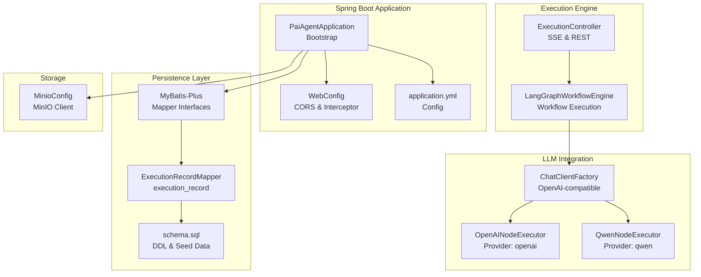
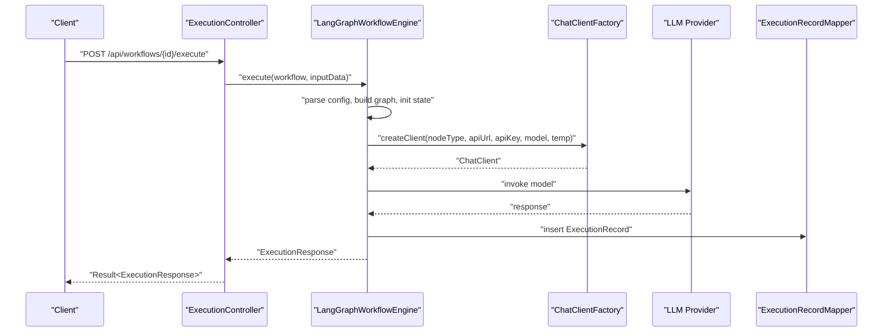
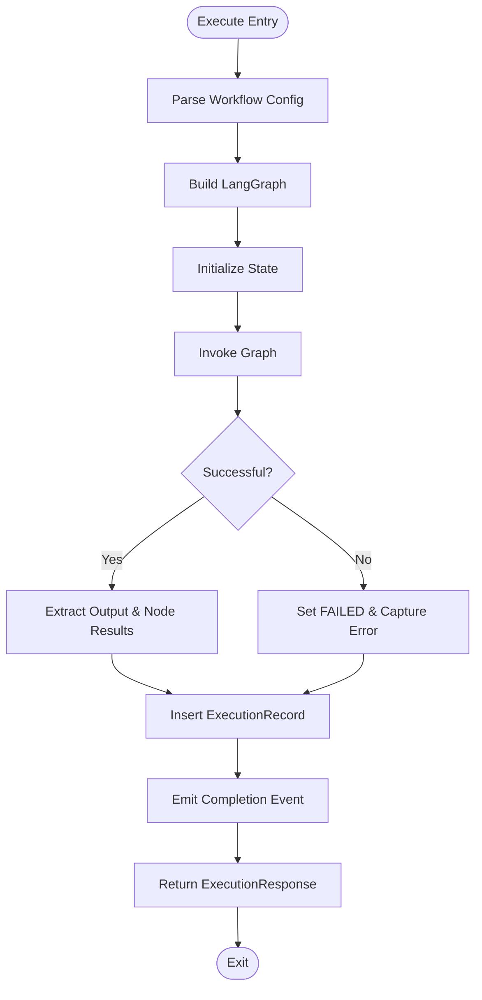
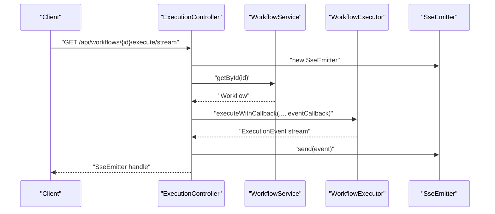
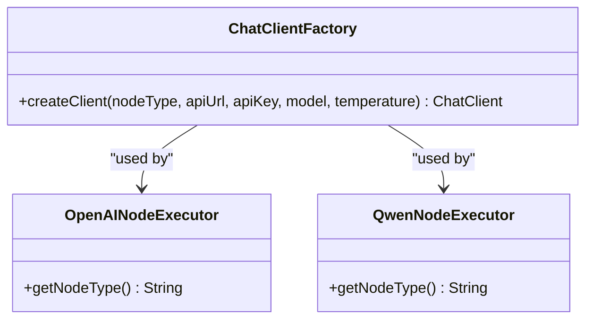
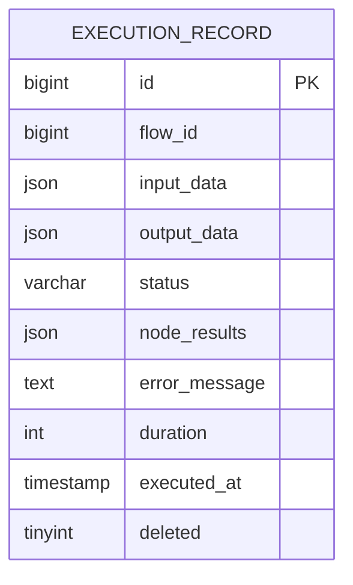
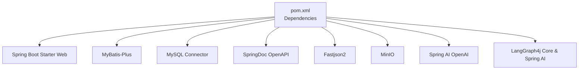

# Maintenance & Troubleshooting

<cite>
**Referenced Files in This Document**
- [PaiAgentApplication.java](file://backend/src/main/java/com/paiagent/PaiAgentApplication.java)
- [application.yml](file://backend/src/main/resources/application.yml)
- [WebConfig.java](file://backend/src/main/java/com/paiagent/config/WebConfig.java)
- [MinioConfig.java](file://backend/src/main/java/com/paiagent/config/MinioConfig.java)
- [LangGraphWorkflowEngine.java](file://backend/src/main/java/com/paiagent/engine/langgraph/LangGraphWorkflowEngine.java)
- [ExecutionController.java](file://backend/src/main/java/com/paiagent/controller/ExecutionController.java)
- [ExecutionRecord.java](file://backend/src/main/java/com/paiagent/entity/ExecutionRecord.java)
- [ExecutionRecordMapper.java](file://backend/src/main/java/com/paiagent/mapper/ExecutionRecordMapper.java)
- [ChatClientFactory.java](file://backend/src/main/java/com/paiagent/engine/llm/ChatClientFactory.java)
- [OpenAINodeExecutor.java](file://backend/src/main/java/com/paiagent/engine/executor/impl/OpenAINodeExecutor.java)
- [QwenNodeExecutor.java](file://backend/src/main/java/com/paiagent/engine/executor/impl/QwenNodeExecutor.java)
- [schema.sql](file://backend/src/main/resources/schema.sql)
- [pom.xml](file://backend/pom.xml)
</cite>

## Table of Contents
1. [Introduction](#introduction)
2. [Project Structure](#project-structure)
3. [Core Components](#core-components)
4. [Architecture Overview](#architecture-overview)
5. [Detailed Component Analysis](#detailed-component-analysis)
6. [Dependency Analysis](#dependency-analysis)
7. [Performance Considerations](#performance-considerations)
8. [Troubleshooting Guide](#troubleshooting-guide)
9. [Backup and Restore Procedures](#backup-and-restore-procedures)
10. [Escalation and Incident Response](#escalation-and-incident-response)
11. [Preventive Maintenance and Health Verification](#preventive-maintenance-and-health-verification)
12. [Conclusion](#conclusion)

## Introduction
This document provides comprehensive maintenance and troubleshooting guidance for the backend service. It covers routine maintenance tasks (database cleanup, log rotation, cache management, system updates), performance monitoring and optimization (memory tuning, database query optimization, workflow execution performance), operational issue resolution (workflow failures, LLM provider connectivity, database connection issues), diagnostics for bottlenecks and performance degradation, backup and restore procedures, escalation and incident response protocols, and preventive maintenance schedules.

## Project Structure
The backend is a Spring Boot application with modular components:
- Application bootstrap and configuration
- Web MVC configuration and CORS/interceptor setup
- Database configuration via MyBatis-Plus and MySQL
- Workflow engine (LangGraph-based) and execution pipeline
- LLM client factory supporting OpenAI-compatible providers
- Storage integration via MinIO
- OpenAPI/Swagger documentation endpoints

**Diagram sources**
- [PaiAgentApplication.java:1-16](file://backend/src/main/java/com/paiagent/PaiAgentApplication.java#L1-L16)
- [WebConfig.java:1-35](file://backend/src/main/java/com/paiagent/config/WebConfig.java#L1-L35)
- [application.yml:1-55](file://backend/src/main/resources/application.yml#L1-L55)
- [ExecutionRecordMapper.java:1-13](file://backend/src/main/java/com/paiagent/mapper/ExecutionRecordMapper.java#L1-L13)
- [schema.sql:1-84](file://backend/src/main/resources/schema.sql#L1-L84)
- [LangGraphWorkflowEngine.java:1-192](file://backend/src/main/java/com/paiagent/engine/langgraph/LangGraphWorkflowEngine.java#L1-L192)
- [ExecutionController.java:1-109](file://backend/src/main/java/com/paiagent/controller/ExecutionController.java#L1-L109)
- [ChatClientFactory.java:1-60](file://backend/src/main/java/com/paiagent/engine/llm/ChatClientFactory.java#L1-L60)
- [OpenAINodeExecutor.java:1-17](file://backend/src/main/java/com/paiagent/engine/executor/impl/OpenAINodeExecutor.java#L1-L17)
- [QwenNodeExecutor.java:1-17](file://backend/src/main/java/com/paiagent/engine/executor/impl/QwenNodeExecutor.java#L1-L17)
- [MinioConfig.java:1-28](file://backend/src/main/java/com/paiagent/config/MinioConfig.java#L1-L28)

**Section sources**
- [PaiAgentApplication.java:1-16](file://backend/src/main/java/com/paiagent/PaiAgentApplication.java#L1-L16)
- [application.yml:1-55](file://backend/src/main/resources/application.yml#L1-L55)
- [WebConfig.java:1-35](file://backend/src/main/java/com/paiagent/config/WebConfig.java#L1-L35)
- [schema.sql:1-84](file://backend/src/main/resources/schema.sql#L1-L84)

## Core Components
- Application bootstrap and mapper scanning
- Web MVC configuration (CORS, interceptors)
- Database configuration (MySQL, MyBatis-Plus, Jackson)
- Workflow execution engine (LangGraph-based)
- Execution controller with SSE streaming
- LLM client factory and provider executors
- MinIO storage configuration
- Execution record persistence and indexing

**Section sources**
- [PaiAgentApplication.java:1-16](file://backend/src/main/java/com/paiagent/PaiAgentApplication.java#L1-L16)
- [WebConfig.java:1-35](file://backend/src/main/java/com/paiagent/config/WebConfig.java#L1-L35)
- [application.yml:1-55](file://backend/src/main/resources/application.yml#L1-L55)
- [LangGraphWorkflowEngine.java:1-192](file://backend/src/main/java/com/paiagent/engine/langgraph/LangGraphWorkflowEngine.java#L1-L192)
- [ExecutionController.java:1-109](file://backend/src/main/java/com/paiagent/controller/ExecutionController.java#L1-L109)
- [ChatClientFactory.java:1-60](file://backend/src/main/java/com/paiagent/engine/llm/ChatClientFactory.java#L1-L60)
- [MinioConfig.java:1-28](file://backend/src/main/java/com/paiagent/config/MinioConfig.java#L1-L28)
- [ExecutionRecord.java:1-67](file://backend/src/main/java/com/paiagent/entity/ExecutionRecord.java#L1-L67)
- [ExecutionRecordMapper.java:1-13](file://backend/src/main/java/com/paiagent/mapper/ExecutionRecordMapper.java#L1-L13)

## Architecture Overview
The backend exposes REST APIs for workflow execution and streaming events. The execution pipeline integrates with LangGraph for workflow orchestration, persists execution records, and interacts with LLM providers through a dynamic client factory. Storage is handled via MinIO.

**Diagram sources**
- [ExecutionController.java:39-55](file://backend/src/main/java/com/paiagent/controller/ExecutionController.java#L39-L55)
- [LangGraphWorkflowEngine.java:43-184](file://backend/src/main/java/com/paiagent/engine/langgraph/LangGraphWorkflowEngine.java#L43-L184)
- [ChatClientFactory.java:29-58](file://backend/src/main/java/com/paiagent/engine/llm/ChatClientFactory.java#L29-L58)
- [ExecutionRecordMapper.java:1-13](file://backend/src/main/java/com/paiagent/mapper/ExecutionRecordMapper.java#L1-L13)

## Detailed Component Analysis

### Workflow Execution Engine
The engine orchestrates workflow execution, manages state, emits events, and persists execution records. It measures execution duration and logs success/failure.

**Diagram sources**
- [LangGraphWorkflowEngine.java:43-184](file://backend/src/main/java/com/paiagent/engine/langgraph/LangGraphWorkflowEngine.java#L43-L184)
- [ExecutionRecord.java:10-67](file://backend/src/main/java/com/paiagent/entity/ExecutionRecord.java#L10-L67)

**Section sources**
- [LangGraphWorkflowEngine.java:1-192](file://backend/src/main/java/com/paiagent/engine/langgraph/LangGraphWorkflowEngine.java#L1-L192)
- [ExecutionRecord.java:1-67](file://backend/src/main/java/com/paiagent/entity/ExecutionRecord.java#L1-L67)
- [ExecutionRecordMapper.java:1-13](file://backend/src/main/java/com/paiagent/mapper/ExecutionRecordMapper.java#L1-L13)

### Execution Controller and SSE Streaming
The controller validates workflows, selects the appropriate executor, and supports server-sent events for real-time progress.

**Diagram sources**
- [ExecutionController.java:57-108](file://backend/src/main/java/com/paiagent/controller/ExecutionController.java#L57-L108)

**Section sources**
- [ExecutionController.java:1-109](file://backend/src/main/java/com/paiagent/controller/ExecutionController.java#L1-L109)

### LLM Client Factory and Providers
The factory creates provider-specific clients for OpenAI-compatible endpoints. Executors for specific providers extend a common base.

**Diagram sources**
- [ChatClientFactory.java:1-60](file://backend/src/main/java/com/paiagent/engine/llm/ChatClientFactory.java#L1-L60)
- [OpenAINodeExecutor.java:1-17](file://backend/src/main/java/com/paiagent/engine/executor/impl/OpenAINodeExecutor.java#L1-L17)
- [QwenNodeExecutor.java:1-17](file://backend/src/main/java/com/paiagent/engine/executor/impl/QwenNodeExecutor.java#L1-L17)

**Section sources**
- [ChatClientFactory.java:1-60](file://backend/src/main/java/com/paiagent/engine/llm/ChatClientFactory.java#L1-L60)
- [OpenAINodeExecutor.java:1-17](file://backend/src/main/java/com/paiagent/engine/executor/impl/OpenAINodeExecutor.java#L1-L17)
- [QwenNodeExecutor.java:1-17](file://backend/src/main/java/com/paiagent/engine/executor/impl/QwenNodeExecutor.java#L1-L17)

### Persistence Model and Indexing
Execution records capture workflow outcomes, errors, and timing metrics. The schema defines indexes for performance.

**Diagram sources**
- [schema.sql:36-51](file://backend/src/main/resources/schema.sql#L36-L51)
- [ExecutionRecord.java:10-67](file://backend/src/main/java/com/paiagent/entity/ExecutionRecord.java#L10-L67)

**Section sources**
- [schema.sql:1-84](file://backend/src/main/resources/schema.sql#L1-L84)
- [ExecutionRecord.java:1-67](file://backend/src/main/java/com/paiagent/entity/ExecutionRecord.java#L1-L67)

## Dependency Analysis
External libraries and integrations include Spring Boot, MyBatis-Plus, Spring AI (OpenAI), LangGraph4j, Fastjson2, MinIO, and Swagger/OpenAPI.

**Diagram sources**
- [pom.xml:60-131](file://backend/pom.xml#L60-L131)

**Section sources**
- [pom.xml:1-163](file://backend/pom.xml#L1-L163)

## Performance Considerations
- Memory tuning
  - Adjust JVM heap size and GC settings via environment variables or startup scripts to accommodate concurrent workflow executions and streaming events.
  - Monitor thread pools used by SSE and workflow execution threads; consider tuning thread pool sizes if throughput degrades under load.
- Database query optimization
  - ExecutionRecord queries commonly filter by flow_id, executed_at, and status. Ensure indexes are effective and avoid N+1 select patterns in reporting views.
  - Use pagination for listing execution records and limit returned fields to reduce payload size.
- Workflow execution performance
  - Reduce graph complexity by minimizing unnecessary branching and loops.
  - Batch or parallelize independent nodes where safe.
  - Tune LLM model parameters (temperature, max tokens) to balance quality and latency.
- Logging and tracing
  - Keep logging at INFO level for production; enable DEBUG selectively for diagnosing slow paths.
  - Use structured logs and correlation IDs to trace requests across components.

[No sources needed since this section provides general guidance]

## Troubleshooting Guide

### Routine Maintenance
- Database cleanup
  - Archive or purge old execution records periodically using status and executed_at filters. Retain minimal history per policy.
  - Monitor table sizes and reclaim space after logical deletes.
- Log file rotation
  - Configure logback/log4j2 rotation policies (size/time-based) to prevent disk pressure.
- Cache management
  - Disable MyBatis-Plus local cache globally as configured; rely on database-level caching and application-level caches if needed.
- System updates
  - Apply OS and Java updates regularly.
  - Review dependency updates in the build file and test upgrades in staging.

**Section sources**
- [application.yml:25-28](file://backend/src/main/resources/application.yml#L25-L28)
- [schema.sql:36-51](file://backend/src/main/resources/schema.sql#L36-L51)

### Operational Issues

#### Workflow Execution Failures
Symptoms:
- ExecutionResponse status indicates failure with error message.
- SSE streams ERROR events.

Diagnosis steps:
- Verify workflow exists and engine type matches supported engines.
- Inspect execution record for error_message and duration.
- Confirm node configurations (provider credentials, model, prompt) embedded in workflow JSON.

Resolution:
- Correct node configuration in the workflow definition.
- Retry execution after fixing configuration.

**Section sources**
- [ExecutionController.java:41-55](file://backend/src/main/java/com/paiagent/controller/ExecutionController.java#L41-L55)
- [LangGraphWorkflowEngine.java:151-184](file://backend/src/main/java/com/paiagent/engine/langgraph/LangGraphWorkflowEngine.java#L151-L184)
- [ExecutionRecord.java:46-48](file://backend/src/main/java/com/paiagent/entity/ExecutionRecord.java#L46-L48)

#### LLM Provider Connectivity Problems
Symptoms:
- Exceptions during LLM invocation.
- ChatClient creation failures.

Diagnosis steps:
- Validate provider URL and API key in node configuration.
- Test network reachability to provider endpoints.
- Check rate limits and quotas.

Resolution:
- Update node configuration with correct credentials and endpoint.
- Retry after resolving network or quota issues.

**Section sources**
- [ChatClientFactory.java:29-58](file://backend/src/main/java/com/paiagent/engine/llm/ChatClientFactory.java#L29-L58)
- [OpenAINodeExecutor.java:10-16](file://backend/src/main/java/com/paiagent/engine/executor/impl/OpenAINodeExecutor.java#L10-L16)
- [QwenNodeExecutor.java:10-16](file://backend/src/main/java/com/paiagent/engine/executor/impl/QwenNodeExecutor.java#L10-L16)

#### Database Connection Issues
Symptoms:
- Startup failures or SQL exceptions.
- Connection pool exhaustion under load.

Diagnosis steps:
- Verify datasource URL, username, and password.
- Check MySQL availability and network ACLs.
- Inspect connection pool metrics and timeouts.

Resolution:
- Fix credentials and endpoint.
- Scale connection pool settings and tune retry/backoff.

**Section sources**
- [application.yml:7-11](file://backend/src/main/resources/application.yml#L7-L11)

### Diagnostics for Bottlenecks and Degradation
- CPU and memory
  - Profile JVM to identify hotspots in workflow execution and SSE handling.
- Database
  - Run EXPLAIN plans for frequent queries on execution_record; add missing indexes if needed.
- Network
  - Measure latency to LLM providers; monitor timeouts and retries.
- Logs
  - Correlate timestamps across services; search for repeated error patterns.

**Section sources**
- [LangGraphWorkflowEngine.java:54-106](file://backend/src/main/java/com/paiagent/engine/langgraph/LangGraphWorkflowEngine.java#L54-L106)
- [schema.sql:48-50](file://backend/src/main/resources/schema.sql#L48-L50)

## Backup and Restore Procedures

### Database Backup
- Use logical backup tools to export schema and data for the target database.
- Schedule periodic backups and retain recent snapshots for quick restore.

### Database Restore
- Stop the service.
- Restore the database from the latest backup.
- Start the service and verify execution records and workflow data integrity.

### Configuration Data
- Back up application configuration files and environment variables.
- Store offsite and version control sensitive configuration securely.

[No sources needed since this section provides general guidance]

## Escalation and Incident Response
- Severity levels
  - Level 1: Non-critical performance degradation; investigate and resolve within SLA.
  - Level 2: Partial service outage; roll back recent changes and restore from backup if needed.
  - Level 3: Full service outage; engage on-call team, restore from backup, and communicate stakeholders.
- Communication
  - Notify stakeholders via predefined channels with impact assessment and ETA.
- Postmortem
  - Document root cause, actions taken, and preventive measures.

[No sources needed since this section provides general guidance]

## Preventive Maintenance and Health Verification
- Daily
  - Monitor service health endpoints and alert on failures.
  - Review execution record counts and error rates.
- Weekly
  - Audit database indexes and unused indices.
  - Rotate logs and archive metrics.
- Monthly
  - Review dependency versions and plan upgrades.
  - Validate backup integrity and restore drills.
- Quarterly
  - Capacity planning and resource scaling reviews.
  - Security patching and vulnerability scans.

**Section sources**
- [application.yml:1-55](file://backend/src/main/resources/application.yml#L1-L55)
- [schema.sql:1-84](file://backend/src/main/resources/schema.sql#L1-L84)

## Conclusion
This guide consolidates maintenance, performance tuning, and troubleshooting practices for the backend service. By following the outlined procedures—routine maintenance, diagnostics, backup/restore, escalation protocols, and preventive schedules—you can sustain reliable operation, quickly resolve issues, and continuously optimize performance.