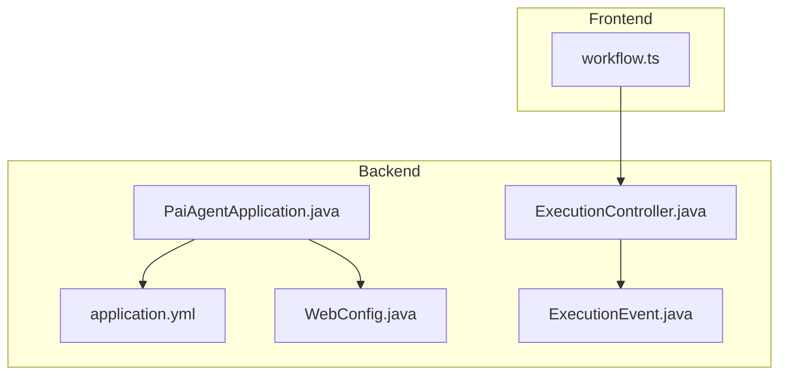
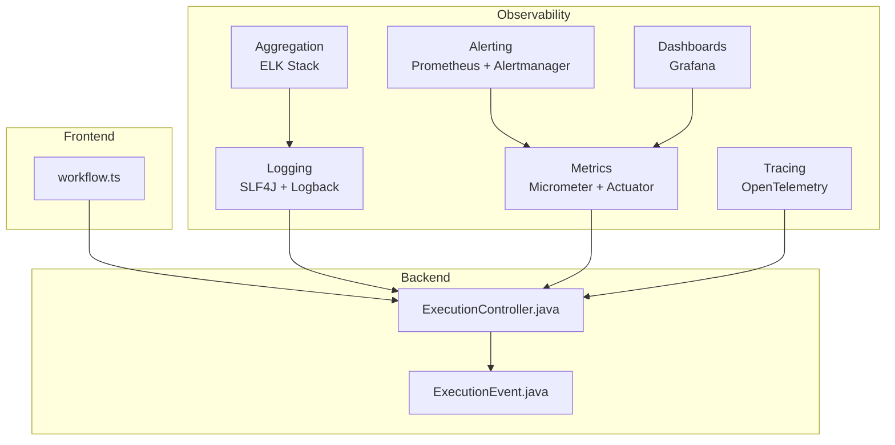
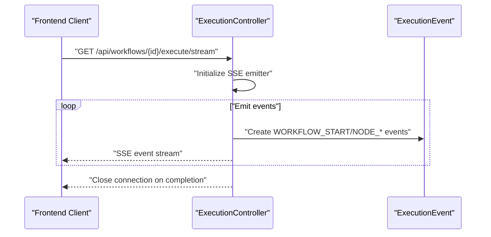
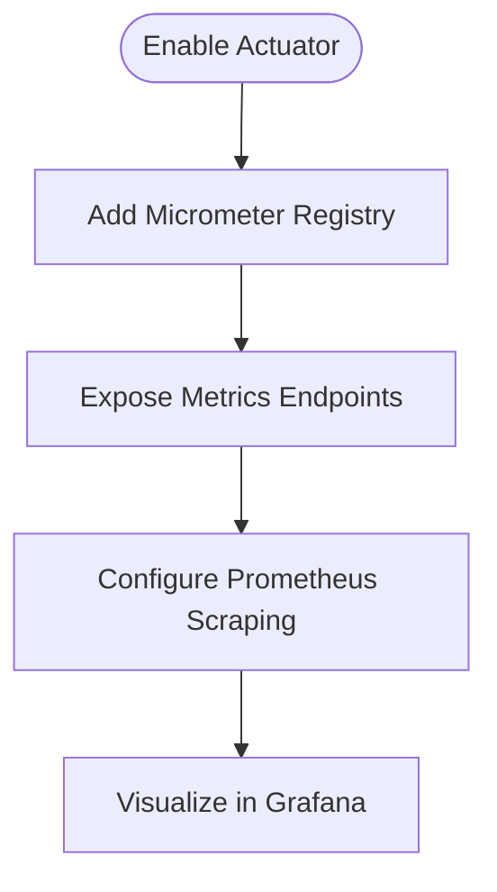
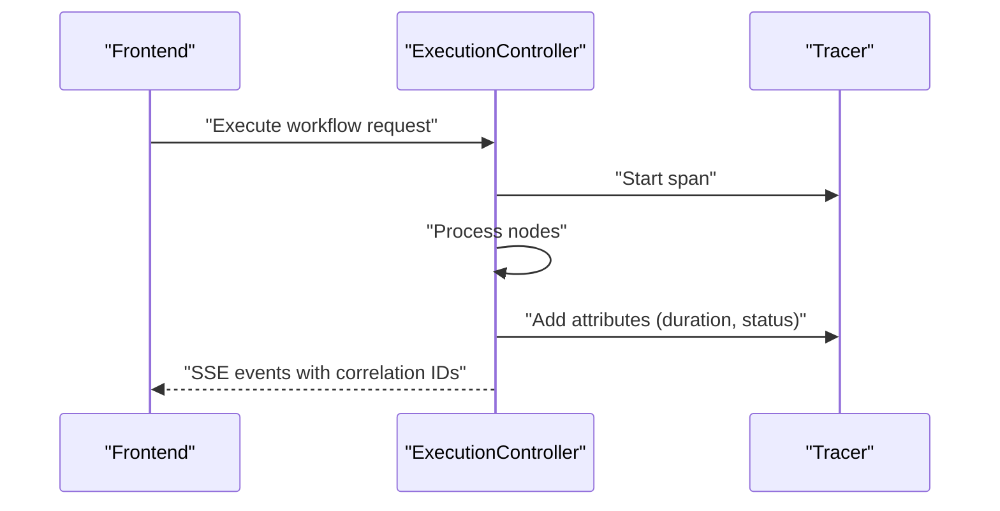
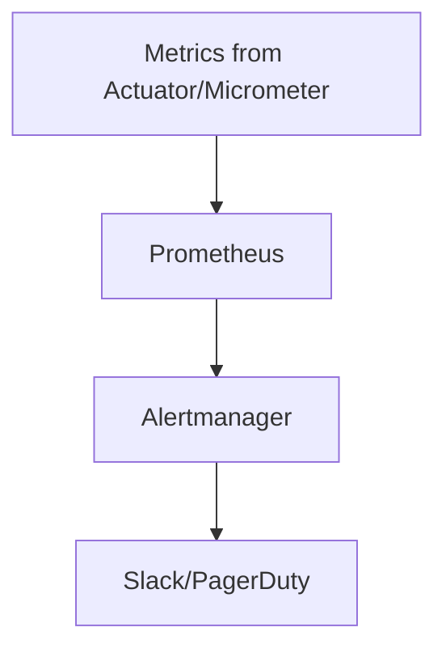
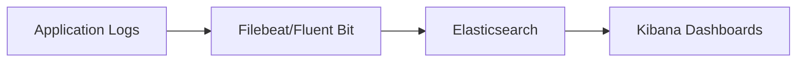
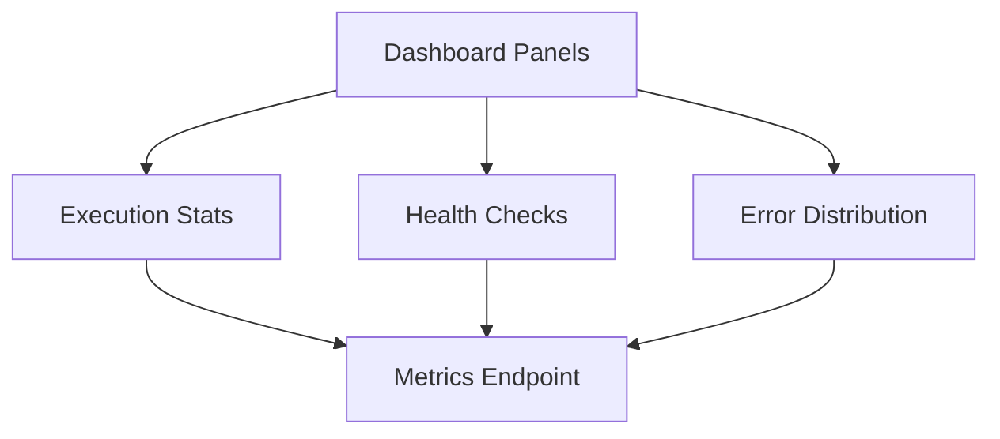
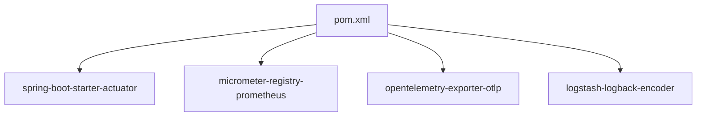

# Monitoring & Logging

<cite>
**Referenced Files in This Document**
- [application.yml](file://backend/src/main/resources/application.yml)
- [PaiAgentApplication.java](file://backend/src/main/java/com/paiagent/PaiAgentApplication.java)
- [WebConfig.java](file://backend/src/main/java/com/paiagent/config/WebConfig.java)
- [ExecutionController.java](file://backend/src/main/java/com/paiagent/controller/ExecutionController.java)
- [ExecutionEvent.java](file://backend/src/main/java/com/paiagent/dto/ExecutionEvent.java)
- [workflow.ts](file://frontend/src/api/workflow.ts)
- [pom.xml](file://backend/pom.xml)
</cite>

## Table of Contents
1. [Introduction](#introduction)
2. [Project Structure](#project-structure)
3. [Core Components](#core-components)
4. [Architecture Overview](#architecture-overview)
5. [Detailed Component Analysis](#detailed-component-analysis)
6. [Dependency Analysis](#dependency-analysis)
7. [Performance Considerations](#performance-considerations)
8. [Troubleshooting Guide](#troubleshooting-guide)
9. [Conclusion](#conclusion)
10. [Appendices](#appendices)

## Introduction
This document provides comprehensive monitoring and logging guidance for the PaiAgent-LangGraph4J platform. It covers logging configuration, structured event formats, metrics collection strategies, distributed tracing setup, alerting configuration, log aggregation and analysis, dashboard setup, and operational practices such as log rotation, retention, and security.

The backend is a Spring Boot 3.4.1 application written in Java 21, integrating LangGraph4j for workflow execution and OpenAI-compatible LLM providers. The frontend is a React-based UI that consumes SSE-based execution events for real-time monitoring of workflow progress.

## Project Structure
The monitoring and logging surface primarily involves:
- Application configuration for logging and runtime behavior
- Controllers emitting structured execution events via SSE
- DTOs defining event schemas for workflow execution
- Frontend consumers of SSE streams for live dashboards
- Build configuration enabling optional observability dependencies

**Diagram sources**
- [PaiAgentApplication.java:1-16](file://backend/src/main/java/com/paiagent/PaiAgentApplication.java#L1-L16)
- [application.yml:1-55](file://backend/src/main/resources/application.yml#L1-L55)
- [WebConfig.java:1-35](file://backend/src/main/java/com/paiagent/config/WebConfig.java#L1-L35)
- [ExecutionController.java:1-59](file://backend/src/main/java/com/paiagent/controller/ExecutionController.java#L1-L59)
- [ExecutionEvent.java:1-79](file://backend/src/main/java/com/paiagent/dto/ExecutionEvent.java#L1-L79)
- [workflow.ts:139-177](file://frontend/src/api/workflow.ts#L139-L177)

**Section sources**
- [PaiAgentApplication.java:1-16](file://backend/src/main/java/com/paiagent/PaiAgentApplication.java#L1-L16)
- [application.yml:1-55](file://backend/src/main/resources/application.yml#L1-L55)
- [WebConfig.java:1-35](file://backend/src/main/java/com/paiagent/config/WebConfig.java#L1-L35)
- [ExecutionController.java:1-59](file://backend/src/main/java/com/paiagent/controller/ExecutionController.java#L1-L59)
- [ExecutionEvent.java:1-79](file://backend/src/main/java/com/paiagent/dto/ExecutionEvent.java#L1-L79)
- [workflow.ts:139-177](file://frontend/src/api/workflow.ts#L139-L177)

## Core Components
- Logging and configuration: Centralized in application.yml; Spring Boot defaults apply unless overridden.
- Execution event pipeline: Controllers emit structured ExecutionEvent objects via SSE for real-time monitoring.
- Frontend SSE consumption: React components listen to SSE channels to render live execution stats and errors.
- CORS and interceptors: WebConfig configures cross-origin behavior and authentication interception.

Key implementation references:
- Logging and runtime configuration: [application.yml:1-55](file://backend/src/main/resources/application.yml#L1-L55)
- SSE-based execution streaming: [ExecutionController.java:57-59](file://backend/src/main/java/com/paiagent/controller/ExecutionController.java#L57-L59)
- Event schema definition: [ExecutionEvent.java:1-79](file://backend/src/main/java/com/paiagent/dto/ExecutionEvent.java#L1-L79)
- Frontend SSE listeners: [workflow.ts:139-177](file://frontend/src/api/workflow.ts#L139-L177)
- CORS and interceptors: [WebConfig.java:1-35](file://backend/src/main/java/com/paiagent/config/WebConfig.java#L1-L35)

**Section sources**
- [application.yml:1-55](file://backend/src/main/resources/application.yml#L1-L55)
- [ExecutionController.java:57-59](file://backend/src/main/java/com/paiagent/controller/ExecutionController.java#L57-L59)
- [ExecutionEvent.java:1-79](file://backend/src/main/java/com/paiagent/dto/ExecutionEvent.java#L1-L79)
- [workflow.ts:139-177](file://frontend/src/api/workflow.ts#L139-L177)
- [WebConfig.java:1-35](file://backend/src/main/java/com/paiagent/config/WebConfig.java#L1-L35)

## Architecture Overview
The monitoring architecture leverages:
- Structured logging via SLF4J and Spring Boot logging properties
- SSE-based event streaming for workflow execution telemetry
- Optional Micrometer and Actuator for JVM and application metrics
- Optional OpenTelemetry for distributed tracing across services
- Log aggregation with ELK Stack for centralized log analysis
- Dashboarding with Grafana for KPIs and health checks

[No sources needed since this diagram shows conceptual workflow, not actual code structure]

## Detailed Component Analysis

### Logging Configuration and Structured Events
- Logging framework: SLF4J with Logback (Spring Boot default). Configure levels and formats via application.yml.
- Structured execution events: ExecutionEvent defines standardized fields for workflow and node lifecycle events, enabling downstream systems to parse and visualize telemetry consistently.
- SSE emission: ExecutionController exposes a streaming endpoint that emits ExecutionEvent instances, allowing clients to subscribe and react to real-time updates.

Implementation references:
- Logging configuration: [application.yml:1-55](file://backend/src/main/resources/application.yml#L1-L55)
- Event schema: [ExecutionEvent.java:1-79](file://backend/src/main/java/com/paiagent/dto/ExecutionEvent.java#L1-L79)
- SSE endpoint: [ExecutionController.java:57-59](file://backend/src/main/java/com/paiagent/controller/ExecutionController.java#L57-L59)

**Diagram sources**
- [ExecutionController.java:57-59](file://backend/src/main/java/com/paiagent/controller/ExecutionController.java#L57-L59)
- [ExecutionEvent.java:1-79](file://backend/src/main/java/com/paiagent/dto/ExecutionEvent.java#L1-L79)

**Section sources**
- [application.yml:1-55](file://backend/src/main/resources/application.yml#L1-L55)
- [ExecutionEvent.java:1-79](file://backend/src/main/java/com/paiagent/dto/ExecutionEvent.java#L1-L79)
- [ExecutionController.java:57-59](file://backend/src/main/java/com/paiagent/controller/ExecutionController.java#L57-L59)

### Metrics Collection
Recommended additions to collect JVM and application metrics:
- Enable Spring Boot Actuator and expose metrics endpoints.
- Add Micrometer registry integrations (e.g., Prometheus) for scraping.
- Instrument key business metrics such as workflow execution counts, durations, and error rates.

Implementation references:
- Build dependencies: [pom.xml:60-131](file://backend/pom.xml#L60-L131)

[No sources needed since this diagram shows conceptual workflow, not actual code structure]

**Section sources**
- [pom.xml:60-131](file://backend/pom.xml#L60-L131)

### Distributed Tracing Setup
Recommended additions for tracing:
- Integrate OpenTelemetry SDK or Spring Cloud Sleuth for automatic tracing.
- Propagate trace context across services and correlate logs with trace IDs.
- Export traces to Jaeger or Tempo for visualization.

Implementation references:
- Build dependencies: [pom.xml:60-131](file://backend/pom.xml#L60-L131)

[No sources needed since this diagram shows conceptual workflow, not actual code structure]

**Section sources**
- [pom.xml:60-131](file://backend/pom.xml#L60-L131)

### Alerting Configuration
Recommended additions for alerting:
- Define Prometheus alerts for error rate thresholds, latency p95, and resource utilization.
- Wire alerts to Alertmanager and integrate with Slack or PagerDuty.
- Monitor critical system events such as authentication failures and database connectivity.

Implementation references:
- Metrics exposure: [pom.xml:60-131](file://backend/pom.xml#L60-L131)

[No sources needed since this diagram shows conceptual workflow, not actual code structure]

**Section sources**
- [pom.xml:60-131](file://backend/pom.xml#L60-L131)

### Log Aggregation and Analysis (ELK Stack)
Recommended additions for log aggregation:
- Ship application logs to Elasticsearch via Logstash or Filebeat.
- Index logs with structured fields from ExecutionEvent for efficient querying.
- Use Kibana dashboards to monitor error rates, node durations, and workflow throughput.

Implementation references:
- Logging configuration: [application.yml:1-55](file://backend/src/main/resources/application.yml#L1-L55)

[No sources needed since this diagram shows conceptual workflow, not actual code structure]

**Section sources**
- [application.yml:1-55](file://backend/src/main/resources/application.yml#L1-L55)

### Monitoring Dashboard Setup
Recommended additions for dashboards:
- Create panels for workflow execution success/failure rates, average duration per node, and total workflow time.
- Add health checks for database connectivity and external LLM provider availability.
- Visualize error distributions by node type and error messages.

Implementation references:
- Metrics exposure: [pom.xml:60-131](file://backend/pom.xml#L60-L131)

[No sources needed since this diagram shows conceptual workflow, not actual code structure]

**Section sources**
- [pom.xml:60-131](file://backend/pom.xml#L60-L131)

## Dependency Analysis
The backend build includes optional observability-related dependencies that can be enabled to support metrics, tracing, and logging infrastructure.

**Diagram sources**
- [pom.xml:60-131](file://backend/pom.xml#L60-L131)

**Section sources**
- [pom.xml:60-131](file://backend/pom.xml#L60-L131)

## Performance Considerations
- Use structured logging to minimize parsing overhead and improve query performance.
- Emit lightweight execution events; avoid excessive verbosity in production.
- Prefer asynchronous processing for heavy LLM calls to keep SSE streams responsive.
- Tune JVM garbage collection and heap sizing for predictable latencies.

[No sources needed since this section provides general guidance]

## Troubleshooting Guide
Common issues and resolutions:
- Authentication failures: Verify token validity and interceptor configuration in WebConfig.
- SSE connection drops: Inspect frontend event listeners and network conditions; ensure CORS allows credentials.
- Missing metrics/traces: Confirm Actuator endpoints are exposed and Micrometer/OpenTelemetry are configured.

Implementation references:
- Interceptor and CORS: [WebConfig.java:1-35](file://backend/src/main/java/com/paiagent/config/WebConfig.java#L1-L35)
- SSE consumption: [workflow.ts:139-177](file://frontend/src/api/workflow.ts#L139-L177)

**Section sources**
- [WebConfig.java:1-35](file://backend/src/main/java/com/paiagent/config/WebConfig.java#L1-L35)
- [workflow.ts:139-177](file://frontend/src/api/workflow.ts#L139-L177)

## Conclusion
The current codebase provides a solid foundation for monitoring and logging through structured execution events and SLF4J-backed logging. By adding optional Micrometer, Actuator, OpenTelemetry, and ELK Stack integrations, teams can achieve comprehensive observability, real-time dashboards, and automated alerting aligned with workflow execution and system health.

[No sources needed since this section summarizes without analyzing specific files]

## Appendices

### Appendix A: Logging Configuration Reference
- Configure log levels and formats in application.yml under logging.* keys.
- Use structured logging formats (e.g., JSON) for easier ingestion by log aggregators.

References:
- [application.yml:1-55](file://backend/src/main/resources/application.yml#L1-L55)

**Section sources**
- [application.yml:1-55](file://backend/src/main/resources/application.yml#L1-L55)

### Appendix B: SSE Event Schema Reference
- ExecutionEvent fields: eventType, nodeId, nodeName, status, message, data, timestamp.
- Use these fields to drive frontend dashboards and alerting rules.

References:
- [ExecutionEvent.java:1-79](file://backend/src/main/java/com/paiagent/dto/ExecutionEvent.java#L1-L79)

**Section sources**
- [ExecutionEvent.java:1-79](file://backend/src/main/java/com/paiagent/dto/ExecutionEvent.java#L1-L79)

### Appendix C: Frontend SSE Consumption Reference
- Listen to NODE_START, NODE_SUCCESS, NODE_ERROR, WORKFLOW_COMPLETE, and ERROR events.
- Close connections on completion and handle re-authentication on persistent errors.

References:
- [workflow.ts:139-177](file://frontend/src/api/workflow.ts#L139-L177)

**Section sources**
- [workflow.ts:139-177](file://frontend/src/api/workflow.ts#L139-L177)