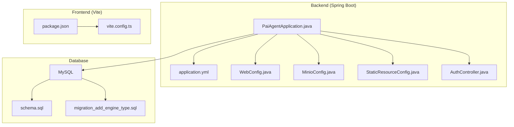
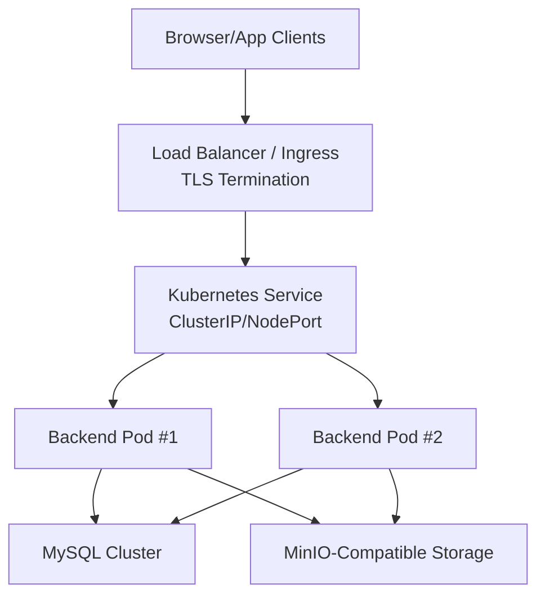
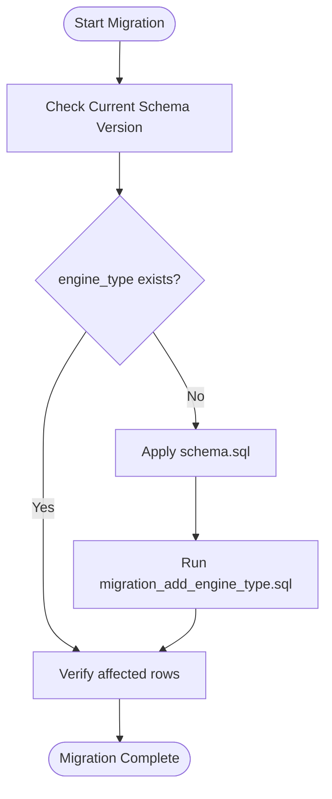
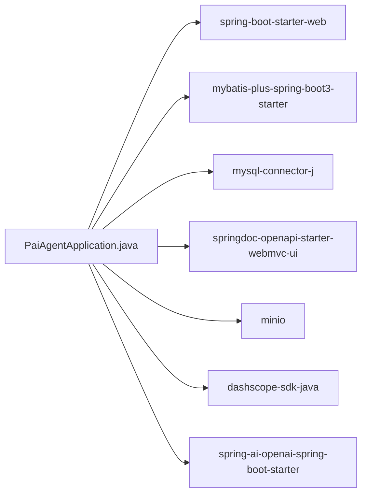

# Production Deployment

<cite>
**Referenced Files in This Document**
- [PaiAgentApplication.java](file://backend/src/main/java/com/paiagent/PaiAgentApplication.java)
- [application.yml](file://backend/src/main/resources/application.yml)
- [schema.sql](file://backend/src/main/resources/schema.sql)
- [migration_add_engine_type.sql](file://backend/src/main/resources/migration_add_engine_type.sql)
- [WebConfig.java](file://backend/src/main/java/com/paiagent/config/WebConfig.java)
- [MinioConfig.java](file://backend/src/main/java/com/paiagent/config/MinioConfig.java)
- [StaticResourceConfig.java](file://backend/src/main/java/com/paiagent/config/StaticResourceConfig.java)
- [AuthController.java](file://backend/src/main/java/com/paiagent/controller/AuthController.java)
- [pom.xml](file://backend/pom.xml)
- [package.json](file://frontend/package.json)
- [vite.config.ts](file://frontend/vite.config.ts)
</cite>

## Table of Contents
1. [Introduction](#introduction)
2. [Project Structure](#project-structure)
3. [Core Components](#core-components)
4. [Architecture Overview](#architecture-overview)
5. [Detailed Component Analysis](#detailed-component-analysis)
6. [Dependency Analysis](#dependency-analysis)
7. [Performance Considerations](#performance-considerations)
8. [Troubleshooting Guide](#troubleshooting-guide)
9. [Conclusion](#conclusion)
10. [Appendices](#appendices)

## Introduction
This document provides production-grade deployment guidance for the Ai Agent Workflow Platform. It covers containerization with Docker (multi-stage builds and image optimization), orchestration with Kubernetes, environment configuration management, database migration procedures, load balancing and TLS, reverse proxy setup, CI/CD automation, blue-green deployments, rolling updates, and security hardening.

## Project Structure
The platform consists of:
- A Spring Boot backend written in Java, exposing REST APIs and managing workflows.
- A MySQL database for persistence.
- An optional MinIO-compatible object storage for artifacts.
- A React-based frontend built via Vite.

**Diagram sources**
- [PaiAgentApplication.java:1-16](file://backend/src/main/java/com/paiagent/PaiAgentApplication.java#L1-L16)
- [application.yml:1-55](file://backend/src/main/resources/application.yml#L1-L55)
- [WebConfig.java:1-35](file://backend/src/main/java/com/paiagent/config/WebConfig.java#L1-L35)
- [MinioConfig.java:1-28](file://backend/src/main/java/com/paiagent/config/MinioConfig.java#L1-L28)
- [StaticResourceConfig.java:1-25](file://backend/src/main/java/com/paiagent/config/StaticResourceConfig.java#L1-L25)
- [AuthController.java:1-62](file://backend/src/main/java/com/paiagent/controller/AuthController.java#L1-L62)
- [schema.sql:1-84](file://backend/src/main/resources/schema.sql#L1-L84)
- [migration_add_engine_type.sql:1-17](file://backend/src/main/resources/migration_add_engine_type.sql#L1-L17)
- [package.json:1-40](file://frontend/package.json#L1-L40)
- [vite.config.ts:1-8](file://frontend/vite.config.ts#L1-L8)

**Section sources**
- [PaiAgentApplication.java:1-16](file://backend/src/main/java/com/paiagent/PaiAgentApplication.java#L1-L16)
- [application.yml:1-55](file://backend/src/main/resources/application.yml#L1-L55)
- [schema.sql:1-84](file://backend/src/main/resources/schema.sql#L1-L84)
- [migration_add_engine_type.sql:1-17](file://backend/src/main/resources/migration_add_engine_type.sql#L1-L17)
- [WebConfig.java:1-35](file://backend/src/main/java/com/paiagent/config/WebConfig.java#L1-L35)
- [MinioConfig.java:1-28](file://backend/src/main/java/com/paiagent/config/MinioConfig.java#L1-L28)
- [StaticResourceConfig.java:1-25](file://backend/src/main/java/com/paiagent/config/StaticResourceConfig.java#L1-L25)
- [AuthController.java:1-62](file://backend/src/main/java/com/paiagent/controller/AuthController.java#L1-L62)
- [package.json:1-40](file://frontend/package.json#L1-L40)
- [vite.config.ts:1-8](file://frontend/vite.config.ts#L1-L8)

## Core Components
- Application bootstrap and scanning: The backend uses Spring Boot’s component scanning to initialize controllers, services, and configuration classes.
- Environment configuration: application.yml defines server port, datasource, Jackson timezone/date format, OpenAI API key placeholder, MyBatis-Plus settings, SpringDoc OpenAPI, and MinIO configuration.
- CORS and interceptors: WebConfig registers a global CORS policy and an authentication interceptor excluding public endpoints.
- MinIO client: MinioConfig binds externalized MinIO properties and exposes a configured client bean.
- Static resource serving: StaticResourceConfig serves audio output files from a local directory under /audio/.
- Authentication endpoints: AuthController exposes login/logout/current endpoints protected by the interceptor.

**Section sources**
- [PaiAgentApplication.java:1-16](file://backend/src/main/java/com/paiagent/PaiAgentApplication.java#L1-L16)
- [application.yml:1-55](file://backend/src/main/resources/application.yml#L1-L55)
- [WebConfig.java:1-35](file://backend/src/main/java/com/paiagent/config/WebConfig.java#L1-L35)
- [MinioConfig.java:1-28](file://backend/src/main/java/com/paiagent/config/MinioConfig.java#L1-L28)
- [StaticResourceConfig.java:1-25](file://backend/src/main/java/com/paiagent/config/StaticResourceConfig.java#L1-L25)
- [AuthController.java:1-62](file://backend/src/main/java/com/paiagent/controller/AuthController.java#L1-L62)

## Architecture Overview
The production runtime comprises:
- Stateless backend pods behind a Kubernetes Service and Ingress.
- A MySQL primary database and optional read replicas.
- Optional MinIO-compatible object storage for artifacts.
- A CDN or reverse proxy terminating TLS and load balancing traffic to the backend.

[No sources needed since this diagram shows conceptual workflow, not actual code structure]

## Detailed Component Analysis

### Containerization with Docker
- Build artifact: The backend uses Maven to produce a Spring Boot executable JAR. The Maven plugin configuration excludes annotation processors at packaging time.
- Multi-stage build strategy:
  - Stage 1: Build with Maven inside a JDK 21 image.
  - Stage 2: Copy the built JAR into a lightweight runtime image (e.g., distroless or alpine with JRE).
  - Final stage: Set non-root user, declare exposed port, set JVM memory options via environment variables, and run the application.
- Image optimization:
  - Use a minimal base image for the runtime stage.
  - Keep only necessary packages; avoid installing build tools in the final image.
  - Enable JVM GC tuning and heap sizing via environment variables.
- Health checks:
  - Add an HTTP health endpoint (e.g., GET /actuator/health) and probe it from Kubernetes.
- Secrets:
  - Mount secrets via Kubernetes Secrets and pass them as environment variables to the container.
- Ports:
  - Expose the port defined in application.yml (default 8080).

**Section sources**
- [pom.xml:133-161](file://backend/pom.xml#L133-L161)

### Kubernetes Orchestration
- Deployments:
  - Use RollingUpdate strategy with maxUnavailable and maxSurge tuned for low-latency restarts.
  - Define readiness and liveness probes pointing to the health endpoint.
- Services:
  - ClusterIP for internal access; expose externally via Ingress/NLB.
- ConfigMaps and Secrets:
  - Store application.yml-derived properties as environment variables or mounted ConfigMaps.
  - Store sensitive keys (OpenAI, DB credentials, MinIO) in Secrets.
- Persistent storage:
  - Mount persistent volumes for audio output directory if StaticResourceConfig writes to disk.
- Horizontal scaling:
  - Configure HPA based on CPU/memory or custom metrics.

**Section sources**
- [application.yml:1-55](file://backend/src/main/resources/application.yml#L1-L55)
- [StaticResourceConfig.java:1-25](file://backend/src/main/java/com/paiagent/config/StaticResourceConfig.java#L1-L25)

### Environment Configuration Management
- application.yml properties:
  - server.port, datasource, jackson, mybatis-plus, springdoc, minio.
- Externalized configuration:
  - Override via environment variables (e.g., OPENAI_API_KEY, SPRING_DATASOURCE_URL).
  - Use Spring Profiles (dev/test/prod) with separate property files.
- Frontend:
  - Build-time variables via Vite environment variables; runtime API host via environment variable injected at deploy time.

**Section sources**
- [application.yml:1-55](file://backend/src/main/resources/application.yml#L1-L55)
- [package.json:1-40](file://frontend/package.json#L1-L40)
- [vite.config.ts:1-8](file://frontend/vite.config.ts#L1-L8)

### Database Migration Procedures
- Initial schema:
  - Create database and tables via schema.sql.
- Incremental migration:
  - Add engine_type column to workflow table using migration_add_engine_type.sql.
- Rollout strategy:
  - Apply schema.sql in a controlled maintenance window.
  - Run migration_add_engine_type.sql after schema rollout; verify selected rows.
- Rollback:
  - Revert by dropping the new column and restoring prior schema state (ensure backups).
- Data safety:
  - Back up before applying migrations; validate with a subset of data.

**Diagram sources**
- [schema.sql:1-84](file://backend/src/main/resources/schema.sql#L1-L84)
- [migration_add_engine_type.sql:1-17](file://backend/src/main/resources/migration_add_engine_type.sql#L1-L17)

**Section sources**
- [schema.sql:1-84](file://backend/src/main/resources/schema.sql#L1-L84)
- [migration_add_engine_type.sql:1-17](file://backend/src/main/resources/migration_add_engine_type.sql#L1-L17)

### Load Balancing, SSL/TLS, and Reverse Proxy
- Load balancing:
  - Use a cloud Load Balancer or NGINX/HAProxy to distribute traffic across backend pods.
- SSL/TLS termination:
  - Terminate TLS at the Ingress or reverse proxy; forward to backend over HTTP.
- Security headers:
  - Configure HSTS, CSP, X-Frame-Options at the proxy level.
- CORS:
  - Align WebConfig CORS with the proxy’s origin and subdomain policy.

**Section sources**
- [WebConfig.java:1-35](file://backend/src/main/java/com/paiagent/config/WebConfig.java#L1-L35)

### Reverse Proxy Setup (NGINX Example)
- Proxy upstream to Kubernetes Service.
- Configure TLS certificate and redirect HTTP to HTTPS.
- Set timeouts, body size limits, and gzip compression.
- Optionally serve frontend static assets from the proxy.

[No sources needed since this section provides general guidance]

### CI/CD Automation and Deployment Strategies
- CI pipeline:
  - Build: mvn clean package.
  - Test: mvn test.
  - Build container image and push to registry.
- CD pipeline:
  - Blue-Green:
    - Deploy new version behind a secondary Service/Ingress.
    - Validate health and switch traffic.
  - Rolling Updates:
    - Gradually replace pods with new version; configure maxUnavailable/maxSurge.
- GitOps:
  - Manage manifests via ArgoCD/Flux; keep images tagged by commit SHA.

[No sources needed since this section provides general guidance]

### Security Hardening
- Secrets management:
  - Store DB credentials, OpenAI API key, MinIO keys in Kubernetes Secrets; mount as env vars.
- Network policies:
  - Restrict ingress to trusted CIDRs; limit egress to required endpoints.
- Access controls:
  - Enforce JWT-based authentication via AuthController; secure admin endpoints.
- Runtime hardening:
  - Run containers as non-root; drop unnecessary capabilities; enable read-only root filesystem.

**Section sources**
- [AuthController.java:1-62](file://backend/src/main/java/com/paiagent/controller/AuthController.java#L1-L62)

## Dependency Analysis
Runtime dependencies include Spring Boot web, MyBatis-Plus, MySQL connector, SpringDoc OpenAPI, MinIO SDK, Alibaba DashScope SDK, and Spring AI OpenAI starter. These influence container size, startup time, and operational footprint.

**Diagram sources**
- [pom.xml:60-131](file://backend/pom.xml#L60-L131)

**Section sources**
- [pom.xml:60-131](file://backend/pom.xml#L60-L131)

## Performance Considerations
- JVM tuning:
  - Set heap size and GC options via environment variables.
- Database:
  - Use connection pooling; monitor slow queries; scale read replicas.
- Caching:
  - Cache infrequent metadata; avoid caching PII.
- Observability:
  - Enable metrics and logs; configure alerting on latency and error rates.

[No sources needed since this section provides general guidance]

## Troubleshooting Guide
- Startup failures:
  - Verify database connectivity and credentials from environment variables.
  - Confirm MinIO endpoint and bucket accessibility.
- CORS errors:
  - Align allowed origins with the proxy and frontend domain.
- Authentication issues:
  - Check token extraction and interceptor path patterns.
- Static assets:
  - Ensure audio output directory exists and is writable; confirm volume mounts in Kubernetes.

**Section sources**
- [application.yml:1-55](file://backend/src/main/resources/application.yml#L1-L55)
- [WebConfig.java:1-35](file://backend/src/main/java/com/paiagent/config/WebConfig.java#L1-L35)
- [AuthController.java:1-62](file://backend/src/main/java/com/paiagent/controller/AuthController.java#L1-L62)
- [StaticResourceConfig.java:1-25](file://backend/src/main/java/com/paiagent/config/StaticResourceConfig.java#L1-L25)

## Conclusion
This guide outlines a robust, production-ready deployment strategy for the Ai Agent Workflow Platform. By combining containerization, Kubernetes orchestration, externalized configuration, safe database migrations, secure reverse proxying, and CI/CD automation, teams can achieve reliable, scalable, and maintainable operations.

## Appendices
- Appendix A: Example environment variable overrides
  - SPRING_PROFILES_ACTIVE=prod
  - SERVER_PORT=8080
  - SPRING_DATASOURCE_URL=jdbc:mysql://mysql:3306/paiagent
  - SPRING_DATASOURCE_USERNAME=${DB_USER}
  - SPRING_DATASOURCE_PASSWORD=${DB_PW}
  - OPENAI_API_KEY=${OPENAI_API_KEY}
  - MINIO_ENDPOINT=http://minio:9000
  - MINIO_ACCESSKEY=${MINIO_ACCESS_KEY}
  - MINIO_SECRETKEY=${MINIO_SECRET_KEY}
- Appendix B: Health endpoint
  - Expose and probe GET /actuator/health.

[No sources needed since this section provides general guidance]