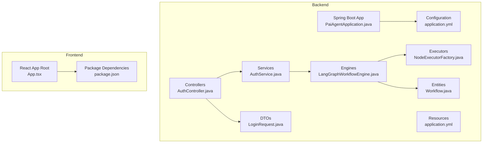
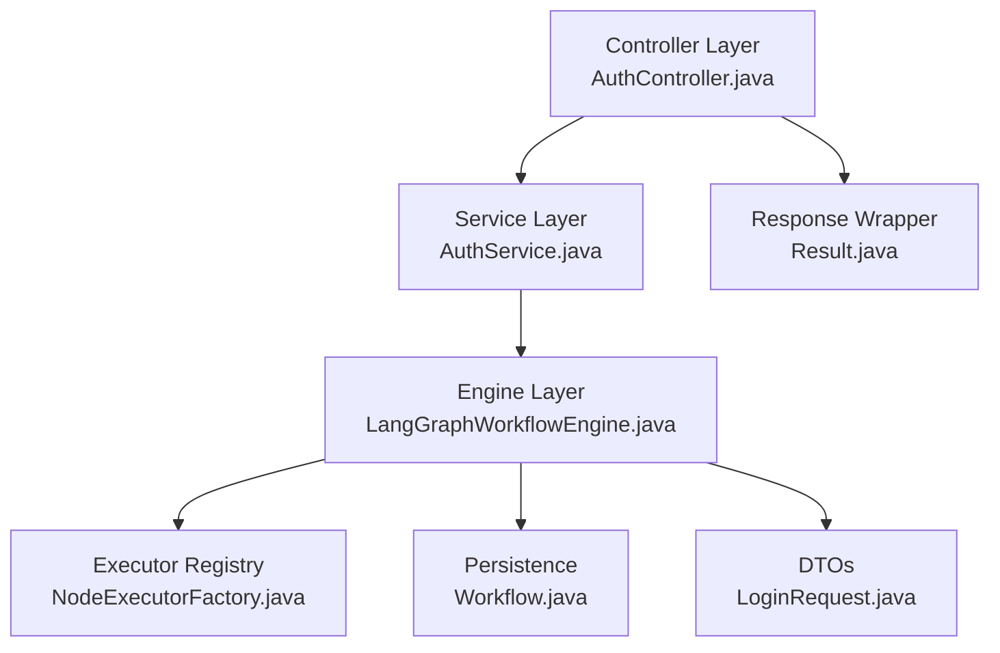
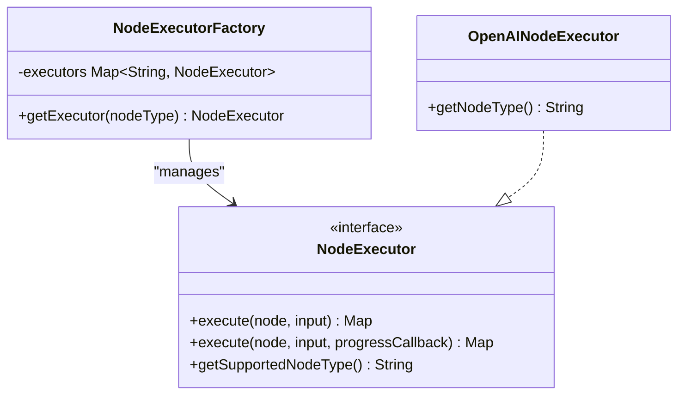
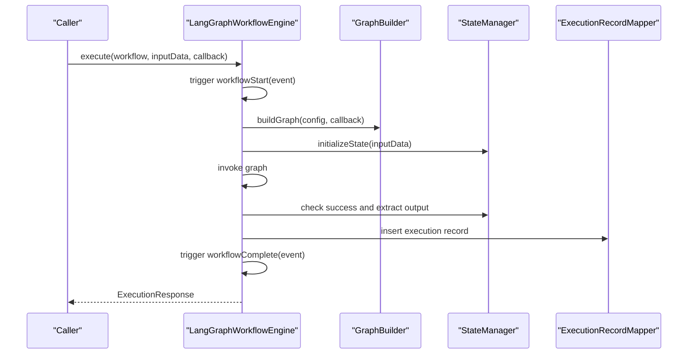
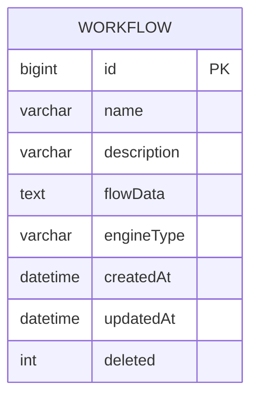
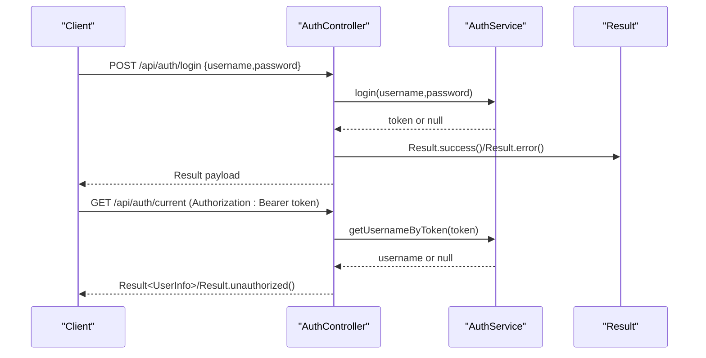
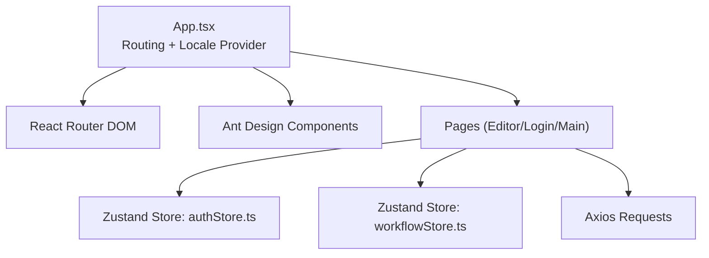
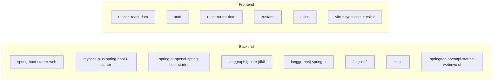

# Coding Standards & Guidelines

<cite>
**Referenced Files in This Document**
- [PaiAgentApplication.java](file://backend/src/main/java/com/paiagent/PaiAgentApplication.java)
- [application.yml](file://backend/src/main/resources/application.yml)
- [pom.xml](file://backend/pom.xml)
- [NodeExecutor.java](file://backend/src/main/java/com/paiagent/engine/executor/NodeExecutor.java)
- [NodeExecutorFactory.java](file://backend/src/main/java/com/paiagent/engine/executor/NodeExecutorFactory.java)
- [OpenAINodeExecutor.java](file://backend/src/main/java/com/paiagent/engine/executor/impl/OpenAINodeExecutor.java)
- [LangGraphWorkflowEngine.java](file://backend/src/main/java/com/paiagent/engine/langgraph/LangGraphWorkflowEngine.java)
- [AuthService.java](file://backend/src/main/java/com/paiagent/service/AuthService.java)
- [AuthController.java](file://backend/src/main/java/com/paiagent/controller/AuthController.java)
- [Result.java](file://backend/src/main/java/com/paiagent/common/Result.java)
- [LoginRequest.java](file://backend/src/main/java/com/paiagent/dto/LoginRequest.java)
- [Workflow.java](file://backend/src/main/java/com/paiagent/entity/Workflow.java)
- [App.tsx](file://frontend/src/App.tsx)
- [package.json](file://frontend/package.json)
</cite>

## Table of Contents
1. [Introduction](#introduction)
2. [Project Structure](#project-structure)
3. [Core Components](#core-components)
4. [Architecture Overview](#architecture-overview)
5. [Detailed Component Analysis](#detailed-component-analysis)
6. [Dependency Analysis](#dependency-analysis)
7. [Performance Considerations](#performance-considerations)
8. [Security Best Practices](#security-best-practices)
9. [Maintainability Principles](#maintainability-principles)
10. [Code Review Guidelines](#code-review-guidelines)
11. [Naming Conventions](#naming-conventions)
12. [Documentation Requirements](#documentation-requirements)
13. [Conclusion](#conclusion)

## Introduction
This document establishes comprehensive coding standards and development guidelines for the project. It covers Java backend conventions (package structure, class naming, method naming, and formatting), TypeScript/JavaScript frontend standards (component structure, state management patterns, and React best practices), documented architectural patterns (Factory Pattern, Observer Pattern via callbacks), and operational practices (performance, security, and maintainability). The guidelines are grounded in the existing codebase and aim to ensure consistency, readability, and scalability across the platform.

## Project Structure
The project follows a clear separation of concerns:
- Backend: Spring Boot application with layered architecture (controllers, services, engines, mappers, entities, DTOs, configs).
- Frontend: React application using Vite, TypeScript, Ant Design, Zustand for state management, and React Router for navigation.

**Diagram sources**
- [PaiAgentApplication.java:1-16](file://backend/src/main/java/com/paiagent/PaiAgentApplication.java#L1-L16)
- [application.yml:1-55](file://backend/src/main/resources/application.yml#L1-L55)
- [AuthController.java:1-62](file://backend/src/main/java/com/paiagent/controller/AuthController.java#L1-L62)
- [AuthService.java:1-63](file://backend/src/main/java/com/paiagent/service/AuthService.java#L1-L63)
- [LangGraphWorkflowEngine.java:1-192](file://backend/src/main/java/com/paiagent/engine/langgraph/LangGraphWorkflowEngine.java#L1-L192)
- [NodeExecutorFactory.java:1-36](file://backend/src/main/java/com/paiagent/engine/executor/NodeExecutorFactory.java#L1-L36)
- [LoginRequest.java:1-18](file://backend/src/main/java/com/paiagent/dto/LoginRequest.java#L1-L18)
- [Workflow.java:1-58](file://backend/src/main/java/com/paiagent/entity/Workflow.java#L1-L58)
- [App.tsx:1-24](file://frontend/src/App.tsx#L1-L24)
- [package.json:1-40](file://frontend/package.json#L1-L40)

**Section sources**
- [PaiAgentApplication.java:1-16](file://backend/src/main/java/com/paiagent/PaiAgentApplication.java#L1-L16)
- [application.yml:1-55](file://backend/src/main/resources/application.yml#L1-L55)
- [App.tsx:1-24](file://frontend/src/App.tsx#L1-L24)
- [package.json:1-40](file://frontend/package.json#L1-L40)

## Core Components
- Unified response wrapper: Result<T> centralizes HTTP-style responses with standardized codes and messages.
- Authentication service and controller: Stateless token-based authentication with concurrent-safe storage.
- Workflow engine: LangGraph-based execution engine with callback-driven progress events.
- Node executor factory: Dynamic dispatch of node executors by type using a registry pattern.
- DTOs and entities: Strong typing for requests and persistence mapping.

**Section sources**
- [Result.java:1-79](file://backend/src/main/java/com/paiagent/common/Result.java#L1-L79)
- [AuthService.java:1-63](file://backend/src/main/java/com/paiagent/service/AuthService.java#L1-L63)
- [AuthController.java:1-62](file://backend/src/main/java/com/paiagent/controller/AuthController.java#L1-L62)
- [LangGraphWorkflowEngine.java:1-192](file://backend/src/main/java/com/paiagent/engine/langgraph/LangGraphWorkflowEngine.java#L1-L192)
- [NodeExecutorFactory.java:1-36](file://backend/src/main/java/com/paiagent/engine/executor/NodeExecutorFactory.java#L1-L36)
- [LoginRequest.java:1-18](file://backend/src/main/java/com/paiagent/dto/LoginRequest.java#L1-L18)
- [Workflow.java:1-58](file://backend/src/main/java/com/paiagent/entity/Workflow.java#L1-L58)

## Architecture Overview
The backend employs layered architecture with clear boundaries:
- Presentation: Controllers expose REST endpoints.
- Application: Services encapsulate business logic.
- Domain/Execution: Engines orchestrate workflow execution.
- Persistence: Entities and MyBatis-Plus mappers handle data access.
- Configuration: YAML and Maven define runtime and dependency settings.

**Diagram sources**
- [AuthController.java:1-62](file://backend/src/main/java/com/paiagent/controller/AuthController.java#L1-L62)
- [AuthService.java:1-62](file://backend/src/main/java/com/paiagent/service/AuthController.java#L1-L62)
- [LangGraphWorkflowEngine.java:1-192](file://backend/src/main/java/com/paiagent/engine/langgraph/LangGraphWorkflowEngine.java#L1-L192)
- [NodeExecutorFactory.java:1-36](file://backend/src/main/java/com/paiagent/engine/executor/NodeExecutorFactory.java#L1-L36)
- [Result.java:1-79](file://backend/src/main/java/com/paiagent/common/Result.java#L1-L79)
- [LoginRequest.java:1-18](file://backend/src/main/java/com/paiagent/dto/LoginRequest.java#L1-L18)
- [Workflow.java:1-58](file://backend/src/main/java/com/paiagent/entity/Workflow.java#L1-L58)

## Detailed Component Analysis

### Factory Pattern: NodeExecutorFactory
- Purpose: Centralized registry mapping node types to executor implementations.
- Behavior: Builds a map from discovered NodeExecutor beans; throws on unsupported type.
- Extensibility: New executors automatically become available via component scanning.

**Diagram sources**
- [NodeExecutor.java:1-18](file://backend/src/main/java/com/paiagent/engine/executor/NodeExecutor.java#L1-L18)
- [NodeExecutorFactory.java:1-36](file://backend/src/main/java/com/paiagent/engine/executor/NodeExecutorFactory.java#L1-L36)
- [OpenAINodeExecutor.java:1-17](file://backend/src/main/java/com/paiagent/engine/executor/impl/OpenAINodeExecutor.java#L1-L17)

**Section sources**
- [NodeExecutorFactory.java:1-36](file://backend/src/main/java/com/paiagent/engine/executor/NodeExecutorFactory.java#L1-L36)
- [NodeExecutor.java:1-18](file://backend/src/main/java/com/paiagent/engine/executor/NodeExecutor.java#L1-L18)
- [OpenAINodeExecutor.java:1-17](file://backend/src/main/java/com/paiagent/engine/executor/impl/OpenAINodeExecutor.java#L1-L17)

### Observer Pattern: Execution Event Callbacks
- The workflow engine accepts a Consumer<ExecutionEvent> to emit lifecycle events (start, progress, completion).
- This decouples execution monitoring from core logic, enabling streaming logs and real-time UI updates.

**Diagram sources**
- [LangGraphWorkflowEngine.java:43-185](file://backend/src/main/java/com/paiagent/engine/langgraph/LangGraphWorkflowEngine.java#L43-L185)

**Section sources**
- [LangGraphWorkflowEngine.java:43-185](file://backend/src/main/java/com/paiagent/engine/langgraph/LangGraphWorkflowEngine.java#L43-L185)

### Repository Pattern: MyBatis-Plus Entities and Mappers
- Entities annotate table/column mappings and metadata (auto timestamps, logical delete).
- MyBatis-Plus configuration enables automatic SQL generation and camelCase mapping.

**Diagram sources**
- [Workflow.java:1-58](file://backend/src/main/java/com/paiagent/entity/Workflow.java#L1-L58)
- [application.yml:21-35](file://backend/src/main/resources/application.yml#L21-L35)

**Section sources**
- [Workflow.java:1-58](file://backend/src/main/java/com/paiagent/entity/Workflow.java#L1-L58)
- [application.yml:21-35](file://backend/src/main/resources/application.yml#L21-L35)

### Authentication Flow
- Stateless token-based authentication stored in-memory with concurrent-safe map.
- Controllers validate tokens from Authorization header and return unified responses.

**Diagram sources**
- [AuthController.java:25-60](file://backend/src/main/java/com/paiagent/controller/AuthController.java#L25-L60)
- [AuthService.java:33-61](file://backend/src/main/java/com/paiagent/service/AuthService.java#L33-L61)
- [Result.java:44-77](file://backend/src/main/java/com/paiagent/common/Result.java#L44-L77)

**Section sources**
- [AuthController.java:1-62](file://backend/src/main/java/com/paiagent/controller/AuthController.java#L1-L62)
- [AuthService.java:1-63](file://backend/src/main/java/com/paiagent/service/AuthService.java#L1-L63)
- [Result.java:1-79](file://backend/src/main/java/com/paiagent/common/Result.java#L1-L79)

### Frontend Architecture and Patterns
- Routing: Centralized routes with React Router DOM.
- UI Library: Ant Design with ConfigProvider for locale.
- State Management: Zustand stores for auth and workflow state.
- HTTP Client: Axios for API calls.
- Tooling: Vite, TypeScript, ESLint, TailwindCSS.

**Diagram sources**
- [App.tsx:1-24](file://frontend/src/App.tsx#L1-L24)
- [package.json:12-38](file://frontend/package.json#L12-L38)

**Section sources**
- [App.tsx:1-24](file://frontend/src/App.tsx#L1-L24)
- [package.json:1-40](file://frontend/package.json#L1-L40)

## Dependency Analysis
- Backend dependencies include Spring Boot starters, MyBatis-Plus, Spring AI OpenAI, LangGraph4j, FastJSON2, MinIO, and Swagger/OpenAPI.
- Frontend dependencies include React, Ant Design, React Router, Zustand, Axios, and Vite toolchain.

**Diagram sources**
- [pom.xml:60-131](file://backend/pom.xml#L60-L131)
- [package.json:12-38](file://frontend/package.json#L12-L38)

**Section sources**
- [pom.xml:1-163](file://backend/pom.xml#L1-L163)
- [package.json:1-40](file://frontend/package.json#L1-L40)

## Performance Considerations
- Logging and metrics: Use structured logging and capture execution durations for profiling.
- Asynchronous processing: Offload heavy operations to background tasks or async streams where supported.
- Caching: Introduce caching for repeated reads of immutable configuration or frequently accessed nodes.
- Resource pooling: Configure connection pools and external client timeouts appropriately.
- Serialization: Prefer compact JSON serialization and avoid unnecessary object allocations during execution.
- Observability: Expose health checks and metrics endpoints for monitoring.

## Security Best Practices
- Authentication: Replace in-memory token store with secure JWT tokens and persistent sessions.
- Secrets: Externalize sensitive configuration (API keys, database credentials) using environment variables or secret managers.
- CORS and CSRF: Configure CORS policy and enforce CSRF protection for state-changing endpoints.
- Input validation: Leverage DTO validation and sanitize inputs to prevent injection attacks.
- Least privilege: Restrict filesystem and network access for deployed services.
- Transport security: Enforce HTTPS/TLS termination at the edge and internal transport encryption.

## Maintainability Principles
- Single responsibility: Keep controllers thin, services cohesive, and engines modular.
- Testability: Write unit tests for services and integration tests for controllers and engines.
- Documentation: Maintain inline documentation for public APIs and complex algorithms.
- Refactoring: Regularly refactor duplicated logic into shared utilities or domain services.
- Backward compatibility: Version APIs and deprecate features gracefully.

## Code Review Guidelines
- Naming: Use descriptive names for classes, methods, and variables; avoid abbreviations.
- Consistency: Align with existing package and class naming conventions.
- Error handling: Return unified Result<T> responses; log meaningful errors with context.
- Formatting: Enforce consistent indentation, spacing, and line length.
- Comments: Add concise comments for non-obvious logic; avoid redundant comments.
- Dependencies: Limit coupling; favor interfaces and dependency injection.
- Tests: Require passing tests and coverage for new features.

## Naming Conventions
- Java (Backend):
  - Package: lower dot-separated (e.g., com.paiagent.engine.executor).
  - Classes: PascalCase (e.g., NodeExecutorFactory, LangGraphWorkflowEngine).
  - Methods: camelCase (e.g., getExecutor, executeWithCallback).
  - Constants: UPPER_SNAKE_CASE (e.g., SUCCESS_CODE).
  - Interfaces: Noun or adjective (e.g., NodeExecutor).
- TypeScript/JavaScript (Frontend):
  - Files: PascalCase for components (e.g., LoginPage.tsx), camelCase for hooks/utils.
  - Variables/functions: camelCase (e.g., authStore, workflowStore).
  - Types/interfaces: PascalCase (e.g., LoginRequest, WorkflowConfig).

## Documentation Requirements
- API documentation: Use Swagger/OpenAPI annotations for controllers and keep them synchronized with implementation.
- Inline comments: Document complex algorithms, business rules, and non-obvious decisions.
- README updates: Reflect changes in setup, configuration, and deployment steps.
- Architecture diagrams: Maintain diagrams for major subsystems and update with significant changes.

## Conclusion
These coding standards and guidelines provide a consistent foundation for developing and maintaining the platform. By adhering to the outlined conventions, architectural patterns, and operational practices, contributors can improve code quality, security, performance, and maintainability while ensuring a smooth developer experience across both backend and frontend teams.