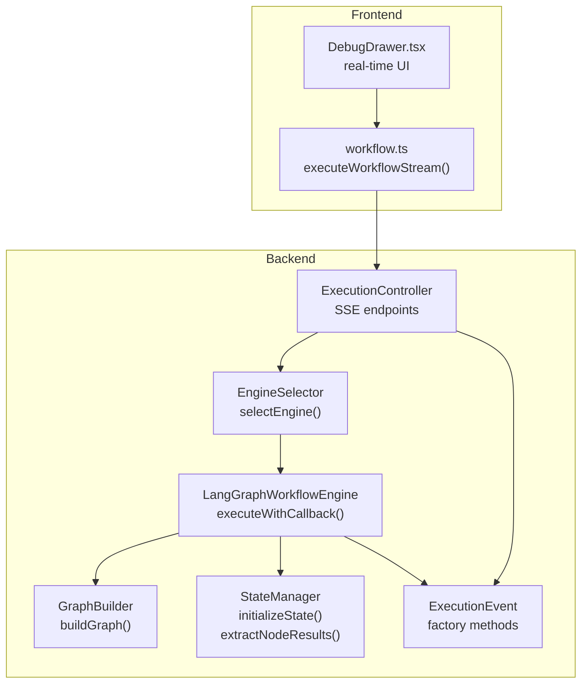
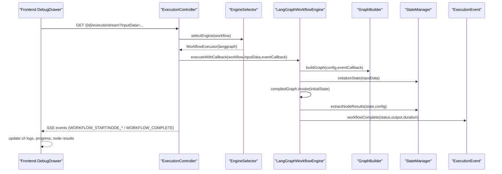
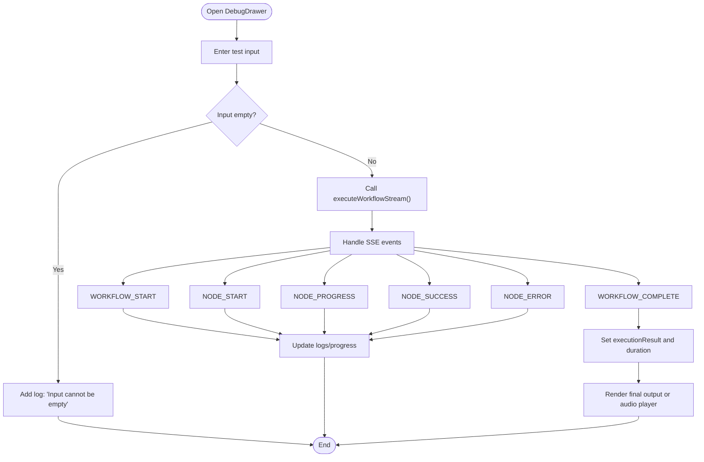
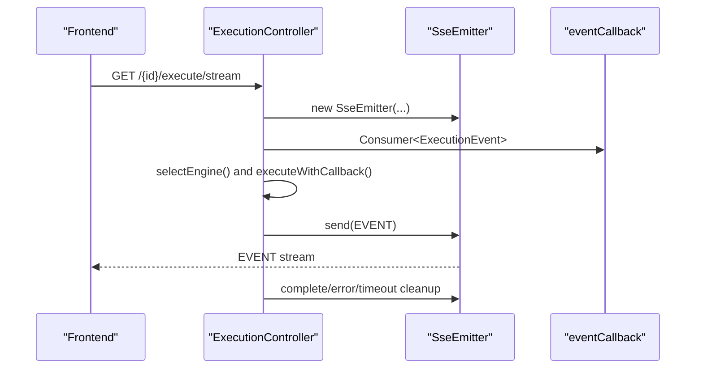
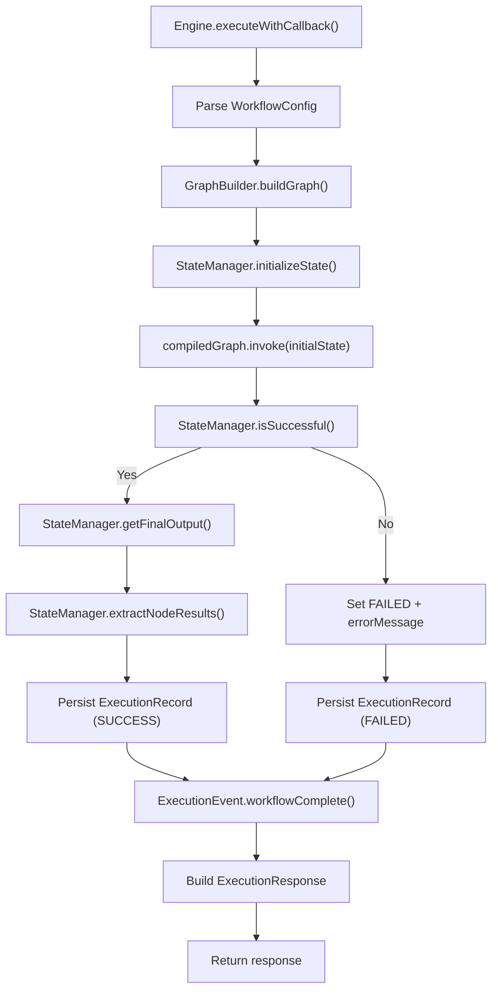
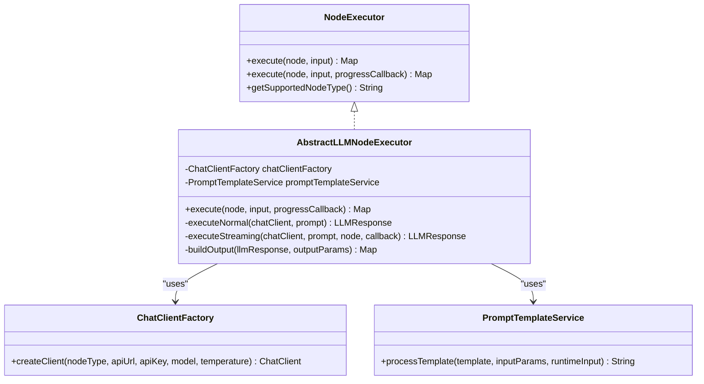
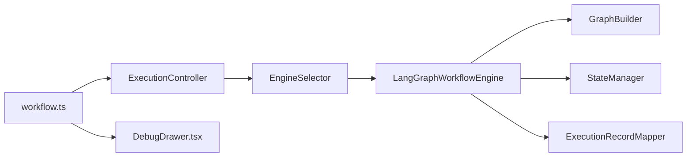

# Debugging & Profiling

<cite>
**Referenced Files in This Document**
- [ExecutionController.java](file://backend/src/main/java/com/paiagent/controller/ExecutionController.java)
- [WorkflowExecutor.java](file://backend/src/main/java/com/paiagent/engine/WorkflowExecutor.java)
- [LangGraphWorkflowEngine.java](file://backend/src/main/java/com/paiagent/engine/langgraph/LangGraphWorkflowEngine.java)
- [EngineSelector.java](file://backend/src/main/java/com/paiagent/engine/EngineSelector.java)
- [GraphBuilder.java](file://backend/src/main/java/com/paiagent/engine/langgraph/builder/GraphBuilder.java)
- [StateManager.java](file://backend/src/main/java/com/paiagent/engine/langgraph/state/StateManager.java)
- [ExecutionEvent.java](file://backend/src/main/java/com/paiagent/dto/ExecutionEvent.java)
- [NodeExecutor.java](file://backend/src/main/java/com/paiagent/engine/executor/NodeExecutor.java)
- [AbstractLLMNodeExecutor.java](file://backend/src/main/java/com/paiagent/engine/executor/impl/AbstractLLMNodeExecutor.java)
- [ChatClientFactory.java](file://backend/src/main/java/com/paiagent/engine/llm/ChatClientFactory.java)
- [PromptTemplateService.java](file://backend/src/main/java/com/paiagent/engine/llm/PromptTemplateService.java)
- [workflow.ts](file://frontend/src/api/workflow.ts)
- [DebugDrawer.tsx](file://frontend/src/components/DebugDrawer.tsx)
- [application.yml](file://backend/src/main/resources/application.yml)
</cite>

## Table of Contents
1. [Introduction](#introduction)
2. [Project Structure](#project-structure)
3. [Core Components](#core-components)
4. [Architecture Overview](#architecture-overview)
5. [Detailed Component Analysis](#detailed-component-analysis)
6. [Dependency Analysis](#dependency-analysis)
7. [Performance Considerations](#performance-considerations)
8. [Troubleshooting Guide](#troubleshooting-guide)
9. [Conclusion](#conclusion)
10. [Appendices](#appendices)

## Introduction
This document provides comprehensive debugging and profiling guidance for optimizing the development workflow in the project. It focuses on diagnosing workflow execution issues, node execution problems, and state management challenges. It explains the DebugDrawer component’s functionality and real-time execution monitoring capabilities, outlines logging strategies and error tracking, and details performance profiling approaches. It also includes guidelines for debugging LLM provider integrations, workflow state issues, and frontend-backend communication problems, along with performance optimization techniques, memory management, bottleneck identification, and troubleshooting for common development and production scenarios.

## Project Structure
The debugging and profiling surface spans both backend and frontend:
- Backend: Execution orchestration via controllers, engines, and state management; SSE-based streaming events; LLM integration factories and prompt templating.
- Frontend: Real-time debugging drawer that subscribes to SSE events, displays execution logs, node results, and final output.

**Diagram sources**
- [ExecutionController.java:57-108](file://backend/src/main/java/com/paiagent/controller/ExecutionController.java#L57-L108)
- [EngineSelector.java:29-49](file://backend/src/main/java/com/paiagent/engine/EngineSelector.java#L29-L49)
- [LangGraphWorkflowEngine.java:48-184](file://backend/src/main/java/com/paiagent/engine/langgraph/LangGraphWorkflowEngine.java#L48-L184)
- [GraphBuilder.java:39-62](file://backend/src/main/java/com/paiagent/engine/langgraph/builder/GraphBuilder.java#L39-L62)
- [StateManager.java:26-162](file://backend/src/main/java/com/paiagent/engine/langgraph/state/StateManager.java#L26-L162)
- [ExecutionEvent.java:15-78](file://backend/src/main/java/com/paiagent/dto/ExecutionEvent.java#L15-L78)
- [workflow.ts:96-177](file://frontend/src/api/workflow.ts#L96-L177)
- [DebugDrawer.tsx:35-175](file://frontend/src/components/DebugDrawer.tsx#L35-L175)

**Section sources**
- [ExecutionController.java:1-109](file://backend/src/main/java/com/paiagent/controller/ExecutionController.java#L1-L109)
- [workflow.ts:1-177](file://frontend/src/api/workflow.ts#L1-L177)

## Core Components
- ExecutionController: Exposes synchronous and streaming execution endpoints, manages SSE emitters, and forwards events to clients.
- EngineSelector: Selects the appropriate WorkflowExecutor based on workflow engine type.
- LangGraphWorkflowEngine: Implements WorkflowExecutor, orchestrates graph building, state initialization, execution, and result extraction.
- GraphBuilder: Translates workflow configuration into a compiled LangGraph.
- StateManager: Initializes and extracts workflow state, aggregates node outputs, and computes final outputs.
- ExecutionEvent: Defines structured event types for WORKFLOW_START, NODE_START, NODE_SUCCESS, NODE_PROGRESS, NODE_ERROR, and WORKFLOW_COMPLETE.
- NodeExecutor and AbstractLLMNodeExecutor: Define node execution contracts and provide shared LLM execution logic including streaming progress callbacks.
- ChatClientFactory and PromptTemplateService: Support LLM provider integrations and dynamic prompt templating.
- workflow.ts and DebugDrawer: Frontend SSE client and real-time debugging UI.

**Section sources**
- [ExecutionController.java:39-108](file://backend/src/main/java/com/paiagent/controller/ExecutionController.java#L39-L108)
- [EngineSelector.java:29-67](file://backend/src/main/java/com/paiagent/engine/EngineSelector.java#L29-L67)
- [LangGraphWorkflowEngine.java:43-190](file://backend/src/main/java/com/paiagent/engine/langgraph/LangGraphWorkflowEngine.java#L43-L190)
- [GraphBuilder.java:39-154](file://backend/src/main/java/com/paiagent/engine/langgraph/builder/GraphBuilder.java#L39-L154)
- [StateManager.java:26-162](file://backend/src/main/java/com/paiagent/engine/langgraph/state/StateManager.java#L26-L162)
- [ExecutionEvent.java:15-78](file://backend/src/main/java/com/paiagent/dto/ExecutionEvent.java#L15-L78)
- [NodeExecutor.java:9-18](file://backend/src/main/java/com/paiagent/engine/executor/NodeExecutor.java#L9-L18)
- [AbstractLLMNodeExecutor.java:36-88](file://backend/src/main/java/com/paiagent/engine/executor/impl/AbstractLLMNodeExecutor.java#L36-L88)
- [ChatClientFactory.java:29-58](file://backend/src/main/java/com/paiagent/engine/llm/ChatClientFactory.java#L29-L58)
- [PromptTemplateService.java:30-106](file://backend/src/main/java/com/paiagent/engine/llm/PromptTemplateService.java#L30-L106)
- [workflow.ts:96-177](file://frontend/src/api/workflow.ts#L96-L177)
- [DebugDrawer.tsx:35-175](file://frontend/src/components/DebugDrawer.tsx#L35-L175)

## Architecture Overview
The system supports two execution modes:
- Synchronous execution returning a single ExecutionResponse.
- Streaming execution via Server-Sent Events (SSE) pushing ExecutionEvent updates to the client.

**Diagram sources**
- [ExecutionController.java:57-108](file://backend/src/main/java/com/paiagent/controller/ExecutionController.java#L57-L108)
- [EngineSelector.java:29-49](file://backend/src/main/java/com/paiagent/engine/EngineSelector.java#L29-L49)
- [LangGraphWorkflowEngine.java:48-184](file://backend/src/main/java/com/paiagent/engine/langgraph/LangGraphWorkflowEngine.java#L48-L184)
- [GraphBuilder.java:39-62](file://backend/src/main/java/com/paiagent/engine/langgraph/builder/GraphBuilder.java#L39-L62)
- [StateManager.java:26-162](file://backend/src/main/java/com/paiagent/engine/langgraph/state/StateManager.java#L26-L162)
- [ExecutionEvent.java:15-78](file://backend/src/main/java/com/paiagent/dto/ExecutionEvent.java#L15-L78)
- [workflow.ts:112-177](file://frontend/src/api/workflow.ts#L112-L177)
- [DebugDrawer.tsx:69-175](file://frontend/src/components/DebugDrawer.tsx#L69-L175)

## Detailed Component Analysis

### DebugDrawer Component
The DebugDrawer provides a real-time debugging UI:
- Accepts user input text, triggers stream execution, and renders logs, progress, node results, and final output.
- Subscribes to SSE events and updates internal state accordingly.
- Supports audio playback for generated audio URLs.

**Diagram sources**
- [DebugDrawer.tsx:35-175](file://frontend/src/components/DebugDrawer.tsx#L35-L175)
- [workflow.ts:96-177](file://frontend/src/api/workflow.ts#L96-L177)

**Section sources**
- [DebugDrawer.tsx:35-395](file://frontend/src/components/DebugDrawer.tsx#L35-L395)
- [workflow.ts:96-177](file://frontend/src/api/workflow.ts#L96-L177)

### ExecutionController and SSE Streaming
- Provides synchronous execution and streaming endpoints.
- Manages SseEmitter lifecycle and forwards ExecutionEvent instances to clients.
- Emits standardized events for workflow and node lifecycle.

**Diagram sources**
- [ExecutionController.java:57-108](file://backend/src/main/java/com/paiagent/controller/ExecutionController.java#L57-L108)
- [ExecutionEvent.java:15-78](file://backend/src/main/java/com/paiagent/dto/ExecutionEvent.java#L15-L78)

**Section sources**
- [ExecutionController.java:57-108](file://backend/src/main/java/com/paiagent/controller/ExecutionController.java#L57-L108)
- [ExecutionEvent.java:15-78](file://backend/src/main/java/com/paiagent/dto/ExecutionEvent.java#L15-L78)

### LangGraphWorkflowEngine and State Management
- Orchestrates execution: parses config, builds graph, initializes state, invokes graph, extracts results, persists records, and emits completion events.
- Uses StateManager to manage state transitions and node output aggregation.
- Emits structured events for progress and completion.

**Diagram sources**
- [LangGraphWorkflowEngine.java:48-184](file://backend/src/main/java/com/paiagent/engine/langgraph/LangGraphWorkflowEngine.java#L48-L184)
- [GraphBuilder.java:39-62](file://backend/src/main/java/com/paiagent/engine/langgraph/builder/GraphBuilder.java#L39-L62)
- [StateManager.java:26-162](file://backend/src/main/java/com/paiagent/engine/langgraph/state/StateManager.java#L26-L162)
- [ExecutionEvent.java:58-66](file://backend/src/main/java/com/paiagent/dto/ExecutionEvent.java#L58-L66)

**Section sources**
- [LangGraphWorkflowEngine.java:43-190](file://backend/src/main/java/com/paiagent/engine/langgraph/LangGraphWorkflowEngine.java#L43-L190)
- [StateManager.java:26-162](file://backend/src/main/java/com/paiagent/engine/langgraph/state/StateManager.java#L26-L162)

### LLM Provider Integrations and Prompt Templating
- AbstractLLMNodeExecutor centralizes LLM execution logic: configuration extraction, prompt template processing, ChatClient creation, normal vs streaming execution, and output construction.
- ChatClientFactory creates provider-compatible ChatClient instances based on node type and configuration.
- PromptTemplateService replaces template variables with static or referenced values from upstream outputs.

**Diagram sources**
- [NodeExecutor.java:9-18](file://backend/src/main/java/com/paiagent/engine/executor/NodeExecutor.java#L9-L18)
- [AbstractLLMNodeExecutor.java:36-88](file://backend/src/main/java/com/paiagent/engine/executor/impl/AbstractLLMNodeExecutor.java#L36-L88)
- [ChatClientFactory.java:29-58](file://backend/src/main/java/com/paiagent/engine/llm/ChatClientFactory.java#L29-L58)
- [PromptTemplateService.java:30-106](file://backend/src/main/java/com/paiagent/engine/llm/PromptTemplateService.java#L30-L106)

**Section sources**
- [AbstractLLMNodeExecutor.java:36-231](file://backend/src/main/java/com/paiagent/engine/executor/impl/AbstractLLMNodeExecutor.java#L36-L231)
- [ChatClientFactory.java:19-58](file://backend/src/main/java/com/paiagent/engine/llm/ChatClientFactory.java#L19-L58)
- [PromptTemplateService.java:30-106](file://backend/src/main/java/com/paiagent/engine/llm/PromptTemplateService.java#L30-L106)

## Dependency Analysis
- ExecutionController depends on EngineSelector and delegates to WorkflowExecutor implementations.
- LangGraphWorkflowEngine depends on GraphBuilder, StateManager, and ExecutionRecordMapper.
- GraphBuilder depends on NodeAdapter (not shown here) to adapt nodes to LangGraph actions.
- StateManager depends on WorkflowState and WorkflowConfig to extract and transform state.
- Frontend workflow.ts depends on local storage tokens and constructs SSE URLs.

**Diagram sources**
- [ExecutionController.java:39-108](file://backend/src/main/java/com/paiagent/controller/ExecutionController.java#L39-L108)
- [EngineSelector.java:29-49](file://backend/src/main/java/com/paiagent/engine/EngineSelector.java#L29-L49)
- [LangGraphWorkflowEngine.java:34-41](file://backend/src/main/java/com/paiagent/engine/langgraph/LangGraphWorkflowEngine.java#L34-L41)
- [GraphBuilder.java:28-29](file://backend/src/main/java/com/paiagent/engine/langgraph/builder/GraphBuilder.java#L28-L29)
- [StateManager.java:3-8](file://backend/src/main/java/com/paiagent/engine/langgraph/state/StateManager.java#L3-L8)
- [workflow.ts:96-112](file://frontend/src/api/workflow.ts#L96-L112)
- [DebugDrawer.tsx:35-41](file://frontend/src/components/DebugDrawer.tsx#L35-L41)

**Section sources**
- [ExecutionController.java:39-108](file://backend/src/main/java/com/paiagent/controller/ExecutionController.java#L39-L108)
- [EngineSelector.java:29-67](file://backend/src/main/java/com/paiagent/engine/EngineSelector.java#L29-L67)
- [LangGraphWorkflowEngine.java:34-41](file://backend/src/main/java/com/paiagent/engine/langgraph/LangGraphWorkflowEngine.java#L34-L41)
- [GraphBuilder.java:28-29](file://backend/src/main/java/com/paiagent/engine/langgraph/builder/GraphBuilder.java#L28-L29)
- [StateManager.java:3-8](file://backend/src/main/java/com/paiagent/engine/langgraph/state/StateManager.java#L3-L8)
- [workflow.ts:96-112](file://frontend/src/api/workflow.ts#L96-L112)
- [DebugDrawer.tsx:35-41](file://frontend/src/components/DebugDrawer.tsx#L35-L41)

## Performance Considerations
- Logging overhead: Excessive INFO/WARN/ERROR logs can impact throughput. Tune log levels per environment.
- SSE buffering: Ensure clients consume events promptly to avoid backpressure.
- Graph compilation cost: Reuse compiled graphs where feasible; avoid rebuilding unnecessarily.
- Memory management:
  - Avoid retaining large intermediate state objects after completion.
  - Limit stored node outputs to essential fields.
  - Prefer streaming for long-running LLM calls to reduce peak memory.
- Token usage: Monitor input/output tokens to detect inefficient prompts or excessive context.
- Network latency: For LLM providers, consider connection pooling and retry policies at the provider layer.

[No sources needed since this section provides general guidance]

## Troubleshooting Guide

### Workflow Execution Issues
- Symptom: No SSE events received.
  - Verify token presence and validity in localStorage; the SSE URL includes a token query parameter.
  - Check backend logs for SSE errors and emitter cleanup.
  - Confirm the workflow exists and engine type is supported.
- Symptom: Execution completes immediately without progress.
  - Ensure the frontend subscribes to all expected event types and handles completion/close.
  - Validate that the backend emits NODE_START, NODE_PROGRESS, NODE_SUCCESS, and WORKFLOW_COMPLETE.

**Section sources**
- [workflow.ts:103-177](file://frontend/src/api/workflow.ts#L103-L177)
- [ExecutionController.java:57-108](file://backend/src/main/java/com/paiagent/controller/ExecutionController.java#L57-L108)

### Node Execution Problems
- Symptom: Nodes fail mid-execution.
  - Inspect NODE_ERROR events for error messages and node identifiers.
  - Review LLM provider configuration (API URL, key, model, temperature).
  - For streaming, confirm progressCallback is supplied to receive NODE_PROGRESS events.
- Symptom: Unexpected output or missing fields.
  - Validate outputParams configuration and ensure prompt template variables resolve correctly.

**Section sources**
- [ExecutionEvent.java:47-56](file://backend/src/main/java/com/paiagent/dto/ExecutionEvent.java#L47-L56)
- [AbstractLLMNodeExecutor.java:69-88](file://backend/src/main/java/com/paiagent/engine/executor/impl/AbstractLLMNodeExecutor.java#L69-L88)
- [PromptTemplateService.java:30-106](file://backend/src/main/java/com/paiagent/engine/llm/PromptTemplateService.java#L30-L106)

### State Management Challenges
- Symptom: Final output is empty or incorrect.
  - Confirm StateManager.getFinalOutput reads currentInput and that nodeOutputs are populated.
  - Verify extractNodeResults maps node IDs to names and serializes outputs.
- Symptom: Status remains RUNNING.
  - Check StateManager.isSuccessful and ensure status propagation from node execution to final state.

**Section sources**
- [StateManager.java:89-162](file://backend/src/main/java/com/paiagent/engine/langgraph/state/StateManager.java#L89-L162)

### LLM Provider Integration Debugging
- Validate provider compatibility: ChatClientFactory supports node types that map to OpenAI-compatible APIs.
- Confirm prompt template resolution: PromptTemplateService resolves {{variables}} from static inputParams or upstream node outputs.
- For streaming, ensure progressCallback is passed so NODE_PROGRESS events are emitted.

**Section sources**
- [ChatClientFactory.java:29-58](file://backend/src/main/java/com/paiagent/engine/llm/ChatClientFactory.java#L29-L58)
- [PromptTemplateService.java:30-106](file://backend/src/main/java/com/paiagent/engine/llm/PromptTemplateService.java#L30-L106)
- [AbstractLLMNodeExecutor.java:69-88](file://backend/src/main/java/com/paiagent/engine/executor/impl/AbstractLLMNodeExecutor.java#L69-L88)

### Frontend-Backend Communication Problems
- Authentication failures during SSE:
  - The frontend clears token and redirects to login if SSE fails early.
  - Ensure OPENID/OAuth token is present and valid.
- CORS and network:
  - Confirm backend allows requests from frontend origin and exposes proper headers.
- SSE URL correctness:
  - The URL includes token and inputData query parameters; verify encoding and presence.

**Section sources**
- [workflow.ts:103-177](file://frontend/src/api/workflow.ts#L103-L177)
- [application.yml:1-55](file://backend/src/main/resources/application.yml#L1-L55)

### Production Debugging Scenarios
- Enable structured logging for ExecutionController, LangGraphWorkflowEngine, and StateManager.
- Capture ExecutionEvent payloads and correlate with ExecutionRecord entries.
- Monitor SSE emitter counts and timeouts; investigate long-running streams.
- For LLM calls, track token usage and latency; alert on high input/output ratios or timeouts.

**Section sources**
- [ExecutionController.java:57-108](file://backend/src/main/java/com/paiagent/controller/ExecutionController.java#L57-L108)
- [LangGraphWorkflowEngine.java:54-184](file://backend/src/main/java/com/paiagent/engine/langgraph/LangGraphWorkflowEngine.java#L54-L184)
- [application.yml:1-55](file://backend/src/main/resources/application.yml#L1-L55)

## Conclusion
The project’s debugging and profiling capabilities center on structured event emission (ExecutionEvent), real-time SSE streaming (ExecutionController), and a comprehensive frontend DebugDrawer. By leveraging these components, developers can diagnose workflow execution issues, inspect node-level progress and outcomes, monitor state transitions, and troubleshoot LLM provider integrations. Applying the provided logging, event handling, and performance guidance will improve development velocity and operational reliability.

[No sources needed since this section summarizes without analyzing specific files]

## Appendices

### Logging Strategies and Error Tracking
- Backend logging:
  - Use INFO for lifecycle events (engine selection, graph building, invocation).
  - Use WARN for fallbacks (default engine selection).
  - Use ERROR for exceptions and failed completions; include duration and error messages.
- Frontend logging:
  - Append timestamped logs in DebugDrawer and display in a Timeline.
  - Map event severity to timeline colors for quick scanning.

**Section sources**
- [LangGraphWorkflowEngine.java:54-184](file://backend/src/main/java/com/paiagent/engine/langgraph/LangGraphWorkflowEngine.java#L54-L184)
- [ExecutionController.java:57-108](file://backend/src/main/java/com/paiagent/controller/ExecutionController.java#L57-L108)
- [DebugDrawer.tsx:43-46](file://frontend/src/components/DebugDrawer.tsx#L43-L46)

### Performance Profiling Approaches
- Measure execution durations:
  - Backend: Track start/end timestamps around graph invocation and persist duration.
  - Frontend: Compute total duration from WORKFLOW_COMPLETE message parsing.
- Token accounting:
  - Extract and log input/output/total tokens for LLM nodes; compare across providers.
- Bottleneck identification:
  - Compare node durations; isolate slow nodes and their upstream dependencies.
  - Monitor SSE delivery latency and client-side rendering costs.

**Section sources**
- [LangGraphWorkflowEngine.java:105-106](file://backend/src/main/java/com/paiagent/engine/langgraph/LangGraphWorkflowEngine.java#L105-L106)
- [AbstractLLMNodeExecutor.java:77-82](file://backend/src/main/java/com/paiagent/engine/executor/impl/AbstractLLMNodeExecutor.java#L77-L82)
- [DebugDrawer.tsx:146-156](file://frontend/src/components/DebugDrawer.tsx#L146-L156)