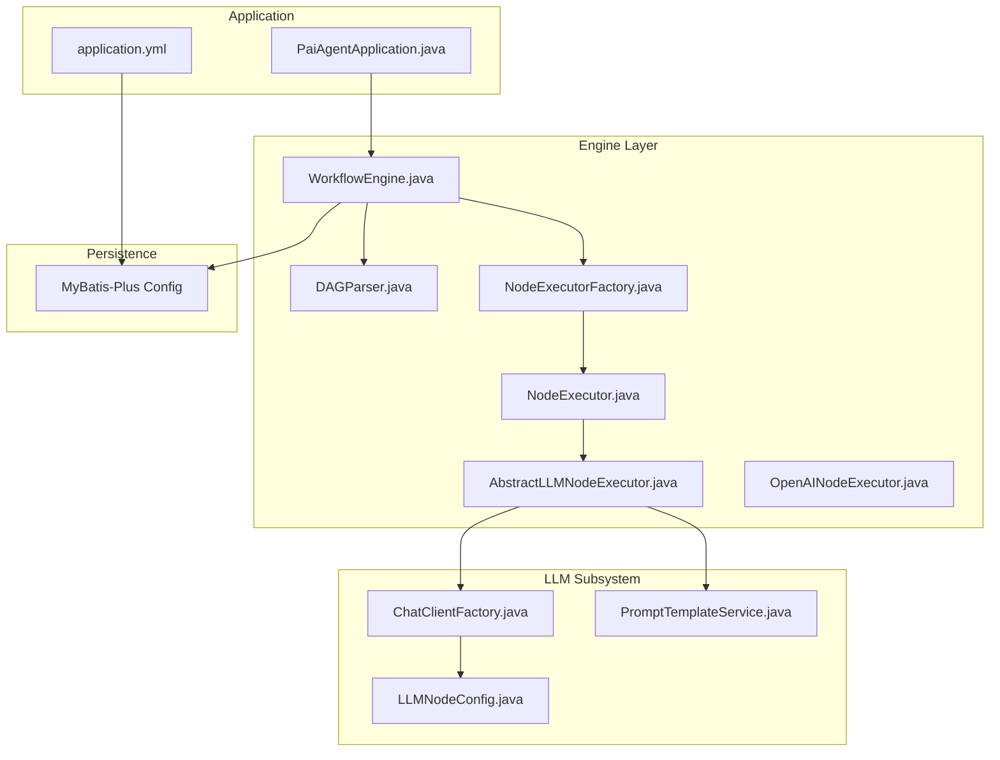
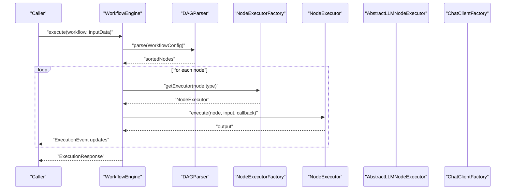
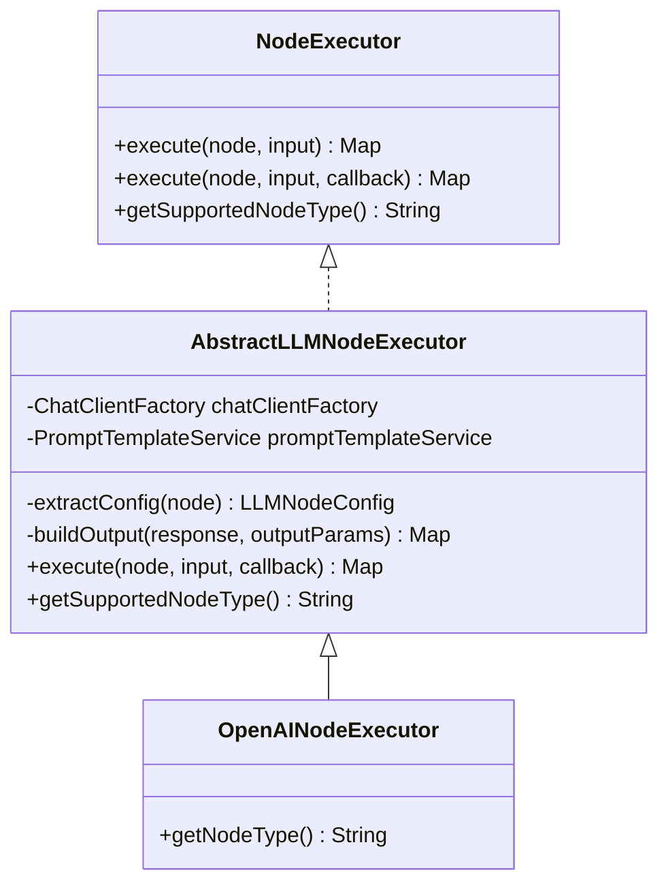
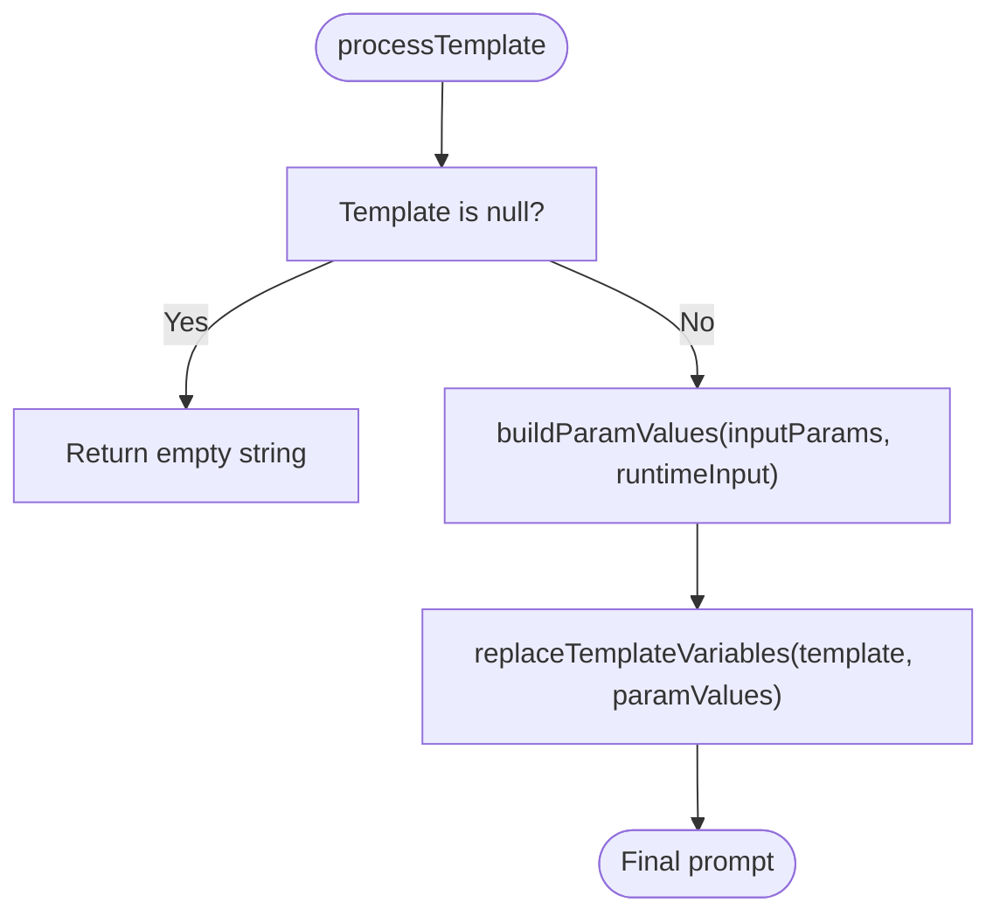
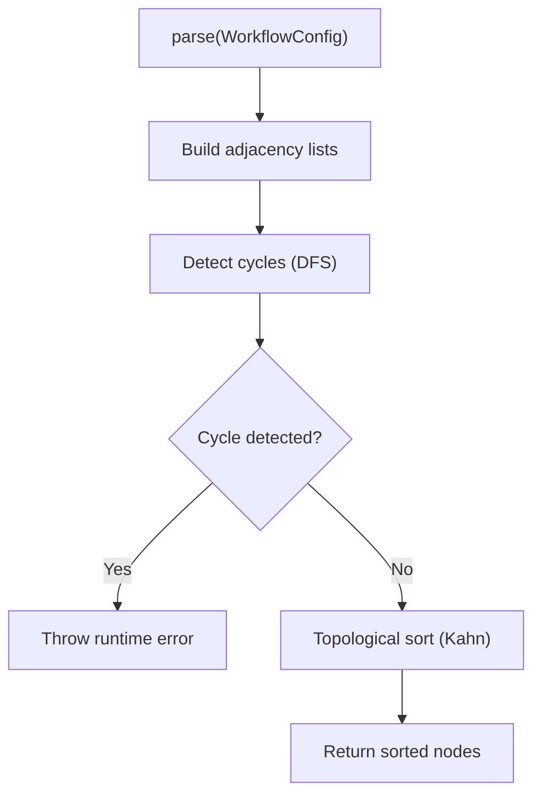
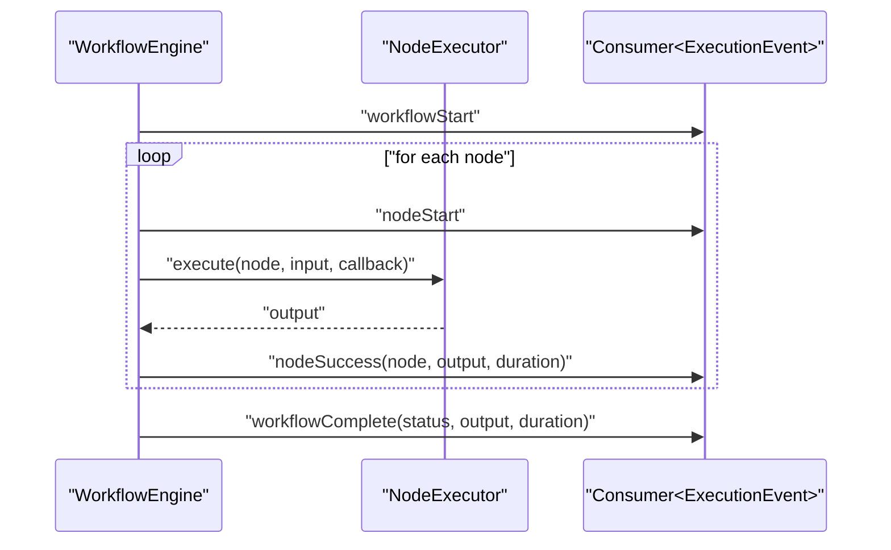
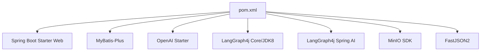

# Development Guide

<cite>
**Referenced Files in This Document**
- [PaiAgentApplication.java](file://backend/src/main/java/com/paiagent/PaiAgentApplication.java)
- [application.yml](file://backend/src/main/resources/application.yml)
- [pom.xml](file://backend/pom.xml)
- [README.md](file://backend/README.md)
- [NodeExecutor.java](file://backend/src/main/java/com/paiagent/engine/executor/NodeExecutor.java)
- [AbstractLLMNodeExecutor.java](file://backend/src/main/java/com/paiagent/engine/executor/impl/AbstractLLMNodeExecutor.java)
- [OpenAINodeExecutor.java](file://backend/src/main/java/com/paiagent/engine/executor/impl/OpenAINodeExecutor.java)
- [NodeExecutorFactory.java](file://backend/src/main/java/com/paiagent/engine/executor/NodeExecutorFactory.java)
- [ChatClientFactory.java](file://backend/src/main/java/com/paiagent/engine/llm/ChatClientFactory.java)
- [LLMNodeConfig.java](file://backend/src/main/java/com/paiagent/engine/llm/LLMNodeConfig.java)
- [PromptTemplateService.java](file://backend/src/main/java/com/paiagent/engine/llm/PromptTemplateService.java)
- [DAGParser.java](file://backend/src/main/java/com/paiagent/engine/dag/DAGParser.java)
- [WorkflowEngine.java](file://backend/src/main/java/com/paiagent/engine/WorkflowEngine.java)
- [WorkflowExecutor.java](file://backend/src/main/java/com/paiagent/engine/WorkflowExecutor.java)
- [LangGraphBasicTest.java](file://backend/src/test/java/com/paiagent/engine/langgraph/LangGraphBasicTest.java)
- [LangGraphWorkflowEngineTest.java](file://backend/src/test/java/com/paiagent/engine/langgraph/LangGraphWorkflowEngineTest.java)
- [PaiAgentApplicationTests.java](file://backend/src/test/java/com/paiagent/PaiAgentApplicationTests.java)
</cite>

## Table of Contents
1. [Introduction](#introduction)
2. [Project Structure](#project-structure)
3. [Core Components](#core-components)
4. [Architecture Overview](#architecture-overview)
5. [Detailed Component Analysis](#detailed-component-analysis)
6. [Dependency Analysis](#dependency-analysis)
7. [Performance Considerations](#performance-considerations)
8. [Testing Strategy](#testing-strategy)
9. [Development Workflow](#development-workflow)
10. [Debugging and Profiling](#debugging-and-profiling)
11. [Contribution Workflow](#contribution-workflow)
12. [Code Review and Quality Assurance](#code-review-and-quality-assurance)
13. [Troubleshooting Guide](#troubleshooting-guide)
14. [Conclusion](#conclusion)

## Introduction
This guide provides comprehensive development documentation for contributors and extension developers working on the backend of the AI Agent Workflow Platform. It covers local environment setup, coding standards, development workflow, extending LLM providers, testing strategy, code organization, debugging, performance profiling, and contribution practices.

## Project Structure
The backend follows a layered Spring Boot architecture with clear separation of concerns:
- Application bootstrap and scanning configuration
- Configuration for database, OpenAPI/Swagger, and external services
- Engine layer orchestrating workflow execution via DAG parsing and pluggable node executors
- LLM subsystem supporting multiple providers through a unified abstraction
- Service, mapper, controller, DTO, entity, and configuration packages

**Diagram sources**
- [PaiAgentApplication.java:1-16](file://backend/src/main/java/com/paiagent/PaiAgentApplication.java#L1-L16)
- [application.yml:1-55](file://backend/src/main/resources/application.yml#L1-L55)
- [WorkflowEngine.java:1-164](file://backend/src/main/java/com/paiagent/engine/WorkflowEngine.java#L1-L164)
- [DAGParser.java:1-162](file://backend/src/main/java/com/paiagent/engine/dag/DAGParser.java#L1-L162)
- [NodeExecutorFactory.java:1-36](file://backend/src/main/java/com/paiagent/engine/executor/NodeExecutorFactory.java#L1-L36)
- [NodeExecutor.java:1-18](file://backend/src/main/java/com/paiagent/engine/executor/NodeExecutor.java#L1-L18)
- [AbstractLLMNodeExecutor.java:1-231](file://backend/src/main/java/com/paiagent/engine/executor/impl/AbstractLLMNodeExecutor.java#L1-L231)
- [OpenAINodeExecutor.java:1-17](file://backend/src/main/java/com/paiagent/engine/executor/impl/OpenAINodeExecutor.java#L1-L17)
- [ChatClientFactory.java:1-60](file://backend/src/main/java/com/paiagent/engine/llm/ChatClientFactory.java#L1-L60)
- [LLMNodeConfig.java:1-54](file://backend/src/main/java/com/paiagent/engine/llm/LLMNodeConfig.java#L1-L54)
- [PromptTemplateService.java:1-108](file://backend/src/main/java/com/paiagent/engine/llm/PromptTemplateService.java#L1-L108)

**Section sources**
- [README.md:62-75](file://backend/README.md#L62-L75)
- [pom.xml:1-163](file://backend/pom.xml#L1-L163)

## Core Components
- Application bootstrap and mapper scanning are configured in the main class.
- Workflow execution is orchestrated by the engine, which parses the DAG, resolves node executors, and streams execution events.
- LLM nodes share a common abstraction that handles configuration extraction, prompt templating, client creation, streaming vs normal invocation, and output building.
- The factory pattern registers and retrieves node executors by type.

Key responsibilities:
- WorkflowEngine: orchestrates execution, manages timing, records execution history, and emits events.
- AbstractLLMNodeExecutor: centralizes LLM invocation logic and output formatting.
- NodeExecutorFactory: registry of supported node types.
- ChatClientFactory: builds provider-specific clients for OpenAI-compatible APIs.
- PromptTemplateService: replaces template variables with static or upstream-provided values.

**Section sources**
- [PaiAgentApplication.java:1-16](file://backend/src/main/java/com/paiagent/PaiAgentApplication.java#L1-L16)
- [WorkflowEngine.java:24-164](file://backend/src/main/java/com/paiagent/engine/WorkflowEngine.java#L24-L164)
- [AbstractLLMNodeExecutor.java:18-231](file://backend/src/main/java/com/paiagent/engine/executor/impl/AbstractLLMNodeExecutor.java#L18-L231)
- [NodeExecutorFactory.java:10-36](file://backend/src/main/java/com/paiagent/engine/executor/NodeExecutorFactory.java#L10-L36)
- [ChatClientFactory.java:11-60](file://backend/src/main/java/com/paiagent/engine/llm/ChatClientFactory.java#L11-L60)
- [PromptTemplateService.java:12-108](file://backend/src/main/java/com/paiagent/engine/llm/PromptTemplateService.java#L12-L108)

## Architecture Overview
The system uses a DAG-based workflow engine with pluggable node executors. LLM nodes are unified under an abstract executor that delegates to a provider-agnostic client factory. Events are emitted for real-time feedback during execution.

**Diagram sources**
- [WorkflowEngine.java:37-158](file://backend/src/main/java/com/paiagent/engine/WorkflowEngine.java#L37-L158)
- [DAGParser.java:20-57](file://backend/src/main/java/com/paiagent/engine/dag/DAGParser.java#L20-L57)
- [NodeExecutorFactory.java:25-34](file://backend/src/main/java/com/paiagent/engine/executor/NodeExecutorFactory.java#L25-L34)
- [NodeExecutor.java:9-18](file://backend/src/main/java/com/paiagent/engine/executor/NodeExecutor.java#L9-L18)
- [AbstractLLMNodeExecutor.java:36-89](file://backend/src/main/java/com/paiagent/engine/executor/impl/AbstractLLMNodeExecutor.java#L36-L89)
- [ChatClientFactory.java:29-40](file://backend/src/main/java/com/paiagent/engine/llm/ChatClientFactory.java#L29-L40)

## Detailed Component Analysis

### LLM Provider Extension Pattern
To add support for a new LLM provider:
1. Extend the abstract LLM executor and override the node type identifier.
2. Ensure the provider is supported by the client factory (OpenAI-compatible mode).
3. Configure node data with apiUrl, apiKey, model, temperature, prompt template, input/output params, and streaming flag.

**Diagram sources**
- [NodeExecutor.java:9-18](file://backend/src/main/java/com/paiagent/engine/executor/NodeExecutor.java#L9-L18)
- [AbstractLLMNodeExecutor.java:22-231](file://backend/src/main/java/com/paiagent/engine/executor/impl/AbstractLLMNodeExecutor.java#L22-L231)
- [OpenAINodeExecutor.java:9-16](file://backend/src/main/java/com/paiagent/engine/executor/impl/OpenAINodeExecutor.java#L9-L16)

Implementation steps:
- Create a new executor class extending the abstract LLM executor and returning the provider’s node type.
- Add the provider to the client factory switch for OpenAI-compatible models.
- Define node configuration keys in the node data (apiUrl, apiKey, model, temperature, prompt, inputParams, outputParams, streaming).
- Verify that prompt templates and parameter references resolve correctly.

**Section sources**
- [AbstractLLMNodeExecutor.java:18-231](file://backend/src/main/java/com/paiagent/engine/executor/impl/AbstractLLMNodeExecutor.java#L18-L231)
- [OpenAINodeExecutor.java:5-16](file://backend/src/main/java/com/paiagent/engine/executor/impl/OpenAINodeExecutor.java#L5-L16)
- [ChatClientFactory.java:34-37](file://backend/src/main/java/com/paiagent/engine/llm/ChatClientFactory.java#L34-L37)
- [LLMNodeConfig.java:12-54](file://backend/src/main/java/com/paiagent/engine/llm/LLMNodeConfig.java#L12-L54)

### Prompt Template Processing
The service supports two parameter types:
- Static input values from configuration
- Reference values from upstream node outputs, including a compatibility fallback for user input

**Diagram sources**
- [PromptTemplateService.java:30-106](file://backend/src/main/java/com/paiagent/engine/llm/PromptTemplateService.java#L30-L106)

**Section sources**
- [PromptTemplateService.java:12-108](file://backend/src/main/java/com/paiagent/engine/llm/PromptTemplateService.java#L12-L108)

### DAG Parsing and Topological Sort
The parser validates acyclic dependencies and produces an execution order suitable for sequential processing.

**Diagram sources**
- [DAGParser.java:20-160](file://backend/src/main/java/com/paiagent/engine/dag/DAGParser.java#L20-L160)

**Section sources**
- [DAGParser.java:10-162](file://backend/src/main/java/com/paiagent/engine/dag/DAGParser.java#L10-L162)

### Execution Flow and Event Streaming
The engine executes nodes in order, tracks per-node durations, and emits structured events for UI updates.

**Diagram sources**
- [WorkflowEngine.java:62-134](file://backend/src/main/java/com/paiagent/engine/WorkflowEngine.java#L62-L134)

**Section sources**
- [WorkflowEngine.java:24-164](file://backend/src/main/java/com/paiagent/engine/WorkflowEngine.java#L24-L164)

## Dependency Analysis
External libraries and their roles:
- Spring Boot 3.4.1, Spring Web, Validation, OpenAPI/Swagger
- MyBatis-Plus 3.5.5 for persistence
- Spring AI OpenAI starter for LLM integrations
- LangGraph4j core and Spring AI integration for graph execution
- MinIO SDK for object storage
- FastJSON2 for JSON processing

**Diagram sources**
- [pom.xml:60-131](file://backend/pom.xml#L60-L131)

**Section sources**
- [pom.xml:29-47](file://backend/pom.xml#L29-L47)

## Performance Considerations
- Prefer non-streaming LLM calls when token usage metrics are required; streaming disables metadata-based token counting.
- Use prompt templates judiciously to avoid excessive variable substitutions.
- Keep node configurations minimal and avoid unnecessary downstream references.
- Monitor per-node durations emitted by the engine to identify bottlenecks.
- Tune temperature and model selection based on use case requirements.

[No sources needed since this section provides general guidance]

## Testing Strategy
- Unit tests: Validate individual components like prompt template processing and DAG parsing.
- Integration tests: Exercise end-to-end workflow execution and event emission.
- Test data management: Use representative workflow configurations and input datasets to simulate real-world scenarios.

Current test coverage includes:
- Basic engine tests and workflow engine tests
- Application context load test

Recommendations:
- Add provider-specific executor tests for new LLM providers.
- Mock external LLM calls to isolate logic and speed up tests.
- Parameterize tests with different prompt templates and node configurations.

**Section sources**
- [LangGraphBasicTest.java](file://backend/src/test/java/com/paiagent/engine/langgraph/LangGraphBasicTest.java)
- [LangGraphWorkflowEngineTest.java](file://backend/src/test/java/com/paiagent/engine/langgraph/LangGraphWorkflowEngineTest.java)
- [PaiAgentApplicationTests.java:1-14](file://backend/src/test/java/com/paiagent/PaiAgentApplicationTests.java#L1-L14)

## Development Workflow
Local setup:
- Install Java 21, MySQL 8.0, and Maven 3.8+
- Initialize the database using the provided schema script
- Configure datasource credentials in application YAML
- Run the application using Maven or IDE

Access:
- Swagger UI at the configured server port
- Default credentials for initial access are documented

**Section sources**
- [README.md:13-48](file://backend/README.md#L13-L48)
- [application.yml:7-11](file://backend/src/main/resources/application.yml#L7-L11)

## Debugging and Profiling
- Enable logging for the engine and LLM subsystem to trace execution and token usage.
- Use event callbacks to stream progress for real-time debugging.
- Profile slow nodes by inspecting per-node durations emitted by the engine.
- For LLM calls, verify provider configuration keys and template variable resolution.

**Section sources**
- [WorkflowEngine.java:62-134](file://backend/src/main/java/com/paiagent/engine/WorkflowEngine.java#L62-L134)
- [AbstractLLMNodeExecutor.java:44-89](file://backend/src/main/java/com/paiagent/engine/executor/impl/AbstractLLMNodeExecutor.java#L44-L89)

## Contribution Workflow
- Fork and branch from the main repository
- Follow existing package and class naming conventions
- Add or extend node executors following the abstract LLM executor pattern
- Write unit and integration tests for new functionality
- Update documentation and provide examples where applicable
- Submit pull requests with clear descriptions and test results

[No sources needed since this section provides general guidance]

## Code Review and Quality Assurance
- Ensure adherence to layered architecture and single-responsibility principle
- Validate that new node types integrate cleanly with the factory and engine
- Confirm prompt template logic handles both static and reference parameters correctly
- Verify error handling and event emission for failure scenarios
- Maintain backward compatibility for output fields (e.g., tokens)

[No sources needed since this section provides general guidance]

## Troubleshooting Guide
Common issues and resolutions:
- Unsupported node type errors indicate missing executor registration; ensure the new executor is picked up by component scanning and registered in the factory.
- Circular dependencies in workflows cause runtime errors during parsing; review edge definitions.
- Missing or invalid API credentials lead to LLM call failures; confirm provider configuration keys and environment variables.
- Stream mode disables token metadata; switch to non-streaming if token accounting is required.

**Section sources**
- [NodeExecutorFactory.java:25-34](file://backend/src/main/java/com/paiagent/engine/executor/NodeExecutorFactory.java#L25-L34)
- [DAGParser.java:52-71](file://backend/src/main/java/com/paiagent/engine/dag/DAGParser.java#L52-L71)
- [AbstractLLMNodeExecutor.java:69-82](file://backend/src/main/java/com/paiagent/engine/executor/impl/AbstractLLMNodeExecutor.java#L69-L82)

## Conclusion
This guide outlines how to set up the development environment, extend LLM providers, test effectively, and maintain high-quality code. By leveraging the provided abstractions and following the established patterns, contributors can efficiently add new capabilities while preserving system stability and performance.