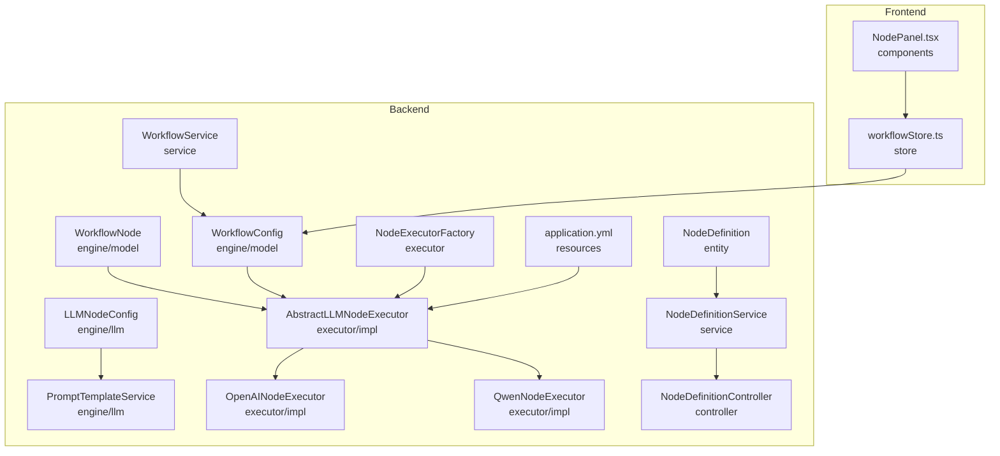
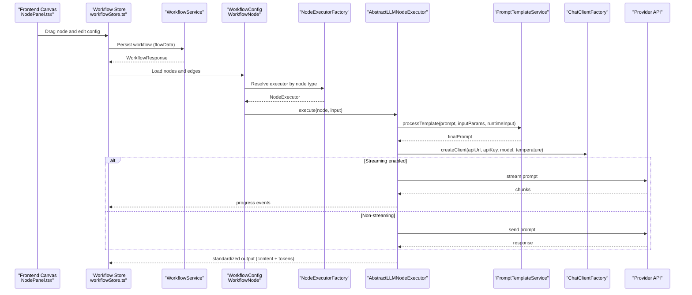
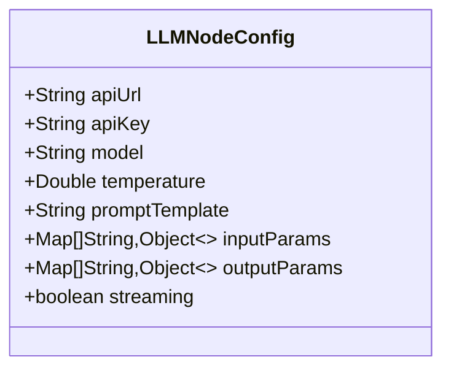
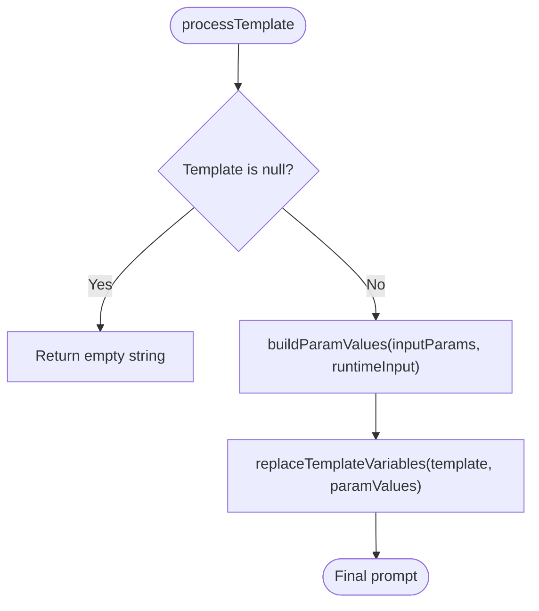
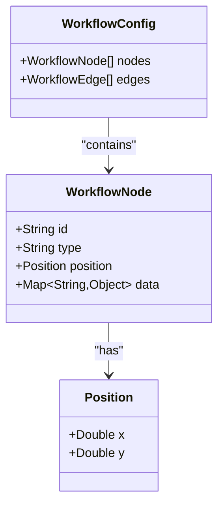
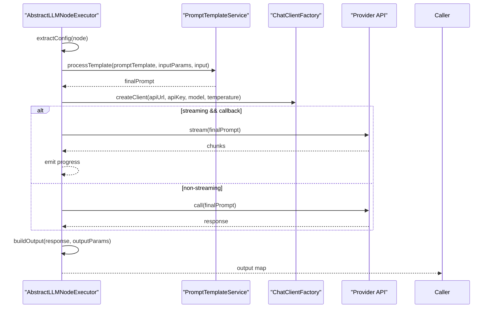
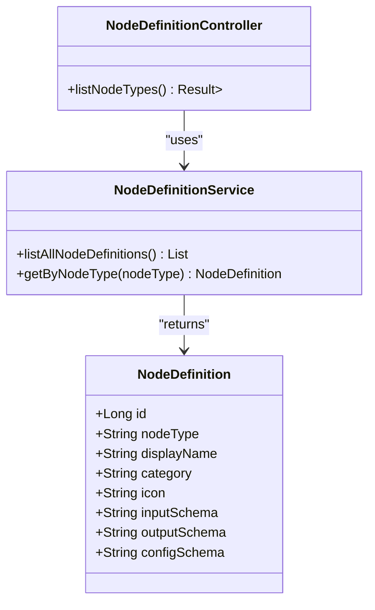
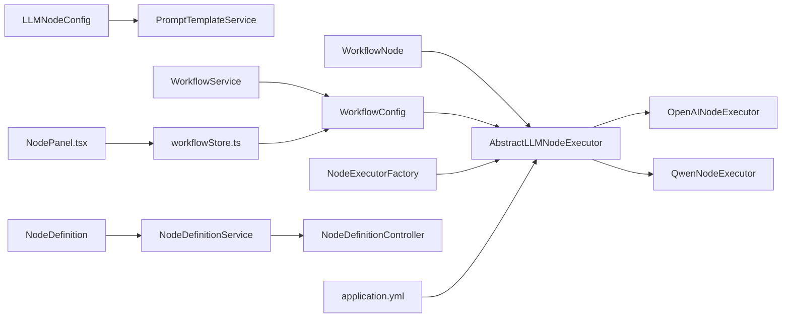
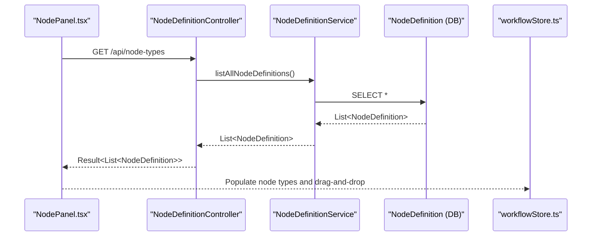

# Configuration Schema & Templates

<cite>
**Referenced Files in This Document**
- [LLMNodeConfig.java](file://backend/src/main/java/com/paiagent/engine/llm/LLMNodeConfig.java)
- [PromptTemplateService.java](file://backend/src/main/java/com/paiagent/engine/llm/PromptTemplateService.java)
- [WorkflowNode.java](file://backend/src/main/java/com/paiagent/engine/model/WorkflowNode.java)
- [WorkflowConfig.java](file://backend/src/main/java/com/paiagent/engine/model/WorkflowConfig.java)
- [AbstractLLMNodeExecutor.java](file://backend/src/main/java/com/paiagent/engine/executor/impl/AbstractLLMNodeExecutor.java)
- [OpenAINodeExecutor.java](file://backend/src/main/java/com/paiagent/engine/executor/impl/OpenAINodeExecutor.java)
- [QwenNodeExecutor.java](file://backend/src/main/java/com/paiagent/engine/executor/impl/QwenNodeExecutor.java)
- [NodeExecutorFactory.java](file://backend/src/main/java/com/paiagent/engine/executor/NodeExecutorFactory.java)
- [WorkflowService.java](file://backend/src/main/java/com/paiagent/service/WorkflowService.java)
- [NodeDefinitionController.java](file://backend/src/main/java/com/paiagent/controller/NodeDefinitionController.java)
- [NodeDefinitionService.java](file://backend/src/main/java/com/paiagent/service/NodeDefinitionService.java)
- [NodeDefinition.java](file://backend/src/main/java/com/paiagent/entity/NodeDefinition.java)
- [application.yml](file://backend/src/main/resources/application.yml)
- [NodePanel.tsx](file://frontend/src/components/NodePanel.tsx)
- [workflowStore.ts](file://frontend/src/store/workflowStore.ts)
</cite>

## Table of Contents
1. [Introduction](#introduction)
2. [Project Structure](#project-structure)
3. [Core Components](#core-components)
4. [Architecture Overview](#architecture-overview)
5. [Detailed Component Analysis](#detailed-component-analysis)
6. [Dependency Analysis](#dependency-analysis)
7. [Performance Considerations](#performance-considerations)
8. [Troubleshooting Guide](#troubleshooting-guide)
9. [Conclusion](#conclusion)
10. [Appendices](#appendices)

## Introduction
This document explains the LLM node configuration schemas and prompt template systems used to define and execute LLM-powered workflow nodes. It covers:
- The LLMNodeConfig data structure and how it defines API endpoints, authentication, model parameters, temperature, prompt templates, and input/output parameter mappings.
- The PromptTemplateService that dynamically constructs prompts by substituting template variables with static values or upstream node outputs.
- The WorkflowNode model and how node configurations are stored and retrieved during execution.
- Examples of configuration schemas for different LLM providers and node types.
- Best practices for prompt engineering, parameter validation, and template variable substitution.
- Security considerations for credential storage and configuration management.
- The relationship between frontend configuration interfaces and backend processing logic.

## Project Structure
The relevant backend modules are organized by responsibility:
- LLM configuration and prompt processing: engine/llm
- Workflow models: engine/model
- LLM node executors: engine/executor/impl
- Node type definitions and schemas: entity, service, controller
- Frontend workflow canvas and stores: frontend/src

**Diagram sources**
- [LLMNodeConfig.java:1-54](file://backend/src/main/java/com/paiagent/engine/llm/LLMNodeConfig.java#L1-L54)
- [PromptTemplateService.java:1-108](file://backend/src/main/java/com/paiagent/engine/llm/PromptTemplateService.java#L1-L108)
- [WorkflowNode.java:1-38](file://backend/src/main/java/com/paiagent/engine/model/WorkflowNode.java#L1-L38)
- [WorkflowConfig.java:1-22](file://backend/src/main/java/com/paiagent/engine/model/WorkflowConfig.java#L1-L22)
- [AbstractLLMNodeExecutor.java:1-231](file://backend/src/main/java/com/paiagent/engine/executor/impl/AbstractLLMNodeExecutor.java#L1-L231)
- [OpenAINodeExecutor.java:1-17](file://backend/src/main/java/com/paiagent/engine/executor/impl/OpenAINodeExecutor.java#L1-L17)
- [QwenNodeExecutor.java:1-17](file://backend/src/main/java/com/paiagent/engine/executor/impl/QwenNodeExecutor.java#L1-L17)
- [NodeExecutorFactory.java:1-36](file://backend/src/main/java/com/paiagent/engine/executor/NodeExecutorFactory.java#L1-L36)
- [NodeDefinitionService.java:1-32](file://backend/src/main/java/com/paiagent/service/NodeDefinitionService.java#L1-L32)
- [NodeDefinitionController.java:1-33](file://backend/src/main/java/com/paiagent/controller/NodeDefinitionController.java#L1-L33)
- [NodeDefinition.java:1-73](file://backend/src/main/java/com/paiagent/entity/NodeDefinition.java#L1-L73)
- [WorkflowService.java:1-95](file://backend/src/main/java/com/paiagent/service/WorkflowService.java#L1-L95)
- [application.yml:1-55](file://backend/src/main/resources/application.yml#L1-L55)
- [NodePanel.tsx:1-112](file://frontend/src/components/NodePanel.tsx#L1-L112)
- [workflowStore.ts:1-70](file://frontend/src/store/workflowStore.ts#L1-L70)

**Section sources**
- [LLMNodeConfig.java:1-54](file://backend/src/main/java/com/paiagent/engine/llm/LLMNodeConfig.java#L1-L54)
- [PromptTemplateService.java:1-108](file://backend/src/main/java/com/paiagent/engine/llm/PromptTemplateService.java#L1-L108)
- [WorkflowNode.java:1-38](file://backend/src/main/java/com/paiagent/engine/model/WorkflowNode.java#L1-L38)
- [WorkflowConfig.java:1-22](file://backend/src/main/java/com/paiagent/engine/model/WorkflowConfig.java#L1-L22)
- [AbstractLLMNodeExecutor.java:1-231](file://backend/src/main/java/com/paiagent/engine/executor/impl/AbstractLLMNodeExecutor.java#L1-L231)
- [OpenAINodeExecutor.java:1-17](file://backend/src/main/java/com/paiagent/engine/executor/impl/OpenAINodeExecutor.java#L1-L17)
- [QwenNodeExecutor.java:1-17](file://backend/src/main/java/com/paiagent/engine/executor/impl/QwenNodeExecutor.java#L1-L17)
- [NodeExecutorFactory.java:1-36](file://backend/src/main/java/com/paiagent/engine/executor/NodeExecutorFactory.java#L1-L36)
- [NodeDefinitionService.java:1-32](file://backend/src/main/java/com/paiagent/service/NodeDefinitionService.java#L1-L32)
- [NodeDefinitionController.java:1-33](file://backend/src/main/java/com/paiagent/controller/NodeDefinitionController.java#L1-L33)
- [NodeDefinition.java:1-73](file://backend/src/main/java/com/paiagent/entity/NodeDefinition.java#L1-L73)
- [WorkflowService.java:1-95](file://backend/src/main/java/com/paiagent/service/WorkflowService.java#L1-L95)
- [application.yml:1-55](file://backend/src/main/resources/application.yml#L1-L55)
- [NodePanel.tsx:1-112](file://frontend/src/components/NodePanel.tsx#L1-L112)
- [workflowStore.ts:1-70](file://frontend/src/store/workflowStore.ts#L1-L70)

## Core Components
- LLMNodeConfig: Defines the configuration for an LLM node, including API endpoint, API key, model, temperature, prompt template, input/output parameter mappings, and streaming flag.
- PromptTemplateService: Processes templates by building a parameter map from static values and upstream node outputs, then replacing {{variable}} placeholders.
- WorkflowNode: Represents a node in the workflow graph with an identifier, type, position, and a data payload containing the node’s configuration.
- AbstractLLMNodeExecutor: Extracts LLMNodeConfig from WorkflowNode.data, builds prompts via PromptTemplateService, creates a ChatClient via ChatClientFactory, executes either normal or streaming calls, and constructs standardized outputs.
- Provider Executors: Specialized executors for providers such as OpenAI and Qwen that inherit shared LLM behavior from AbstractLLMNodeExecutor.
- NodeExecutorFactory: Maps node types to their respective executors.
- NodeDefinition: Stores provider-specific JSON Schemas for input, output, and configuration, enabling frontend forms and validation.
- WorkflowService: Manages persistence of workflow definitions and their associated flow data.

**Section sources**
- [LLMNodeConfig.java:11-53](file://backend/src/main/java/com/paiagent/engine/llm/LLMNodeConfig.java#L11-L53)
- [PromptTemplateService.java:18-107](file://backend/src/main/java/com/paiagent/engine/llm/PromptTemplateService.java#L18-L107)
- [WorkflowNode.java:10-31](file://backend/src/main/java/com/paiagent/engine/model/WorkflowNode.java#L10-L31)
- [AbstractLLMNodeExecutor.java:23-231](file://backend/src/main/java/com/paiagent/engine/executor/impl/AbstractLLMNodeExecutor.java#L23-L231)
- [OpenAINodeExecutor.java:9-16](file://backend/src/main/java/com/paiagent/engine/executor/impl/OpenAINodeExecutor.java#L9-L16)
- [QwenNodeExecutor.java:9-16](file://backend/src/main/java/com/paiagent/engine/executor/impl/QwenNodeExecutor.java#L9-L16)
- [NodeExecutorFactory.java:14-35](file://backend/src/main/java/com/paiagent/engine/executor/NodeExecutorFactory.java#L14-L35)
- [NodeDefinition.java:10-73](file://backend/src/main/java/com/paiagent/entity/NodeDefinition.java#L10-L73)
- [WorkflowService.java:18-95](file://backend/src/main/java/com/paiagent/service/WorkflowService.java#L18-L95)

## Architecture Overview
The system orchestrates LLM nodes through a factory-selected executor. The executor extracts configuration from the workflow node, resolves prompts, invokes the provider client, and emits structured outputs.

**Diagram sources**
- [NodePanel.tsx:12-112](file://frontend/src/components/NodePanel.tsx#L12-L112)
- [workflowStore.ts:34-70](file://frontend/src/store/workflowStore.ts#L34-L70)
- [WorkflowService.java:24-95](file://backend/src/main/java/com/paiagent/service/WorkflowService.java#L24-L95)
- [WorkflowConfig.java:10-21](file://backend/src/main/java/com/paiagent/engine/model/WorkflowConfig.java#L10-L21)
- [WorkflowNode.java:10-31](file://backend/src/main/java/com/paiagent/engine/model/WorkflowNode.java#L10-L31)
- [NodeExecutorFactory.java:18-34](file://backend/src/main/java/com/paiagent/engine/executor/NodeExecutorFactory.java#L18-L34)
- [AbstractLLMNodeExecutor.java:36-89](file://backend/src/main/java/com/paiagent/engine/executor/impl/AbstractLLMNodeExecutor.java#L36-L89)
- [PromptTemplateService.java:30-43](file://backend/src/main/java/com/paiagent/engine/llm/PromptTemplateService.java#L30-L43)

## Detailed Component Analysis

### LLMNodeConfig: Node Configuration Schema
LLMNodeConfig encapsulates all runtime configuration for an LLM node:
- apiUrl: Endpoint URL for the provider API
- apiKey: Authentication credential
- model: Target model identifier
- temperature: Generation randomness parameter
- promptTemplate: Template string with {{variable}} placeholders
- inputParams: Parameter definitions supporting static "input" and upstream "reference" values
- outputParams: Output field definitions mapping the LLM response to downstream nodes
- streaming: Enables streaming mode for progressive generation

**Diagram sources**
- [LLMNodeConfig.java:12-53](file://backend/src/main/java/com/paiagent/engine/llm/LLMNodeConfig.java#L12-L53)

**Section sources**
- [LLMNodeConfig.java:11-53](file://backend/src/main/java/com/paiagent/engine/llm/LLMNodeConfig.java#L11-L53)

### PromptTemplateService: Dynamic Prompt Construction
PromptTemplateService performs two steps:
1) Build a parameter map from inputParams:
- "input" type: static values from configuration
- "reference" type: values extracted from upstream node outputs using dot-notation keys; includes a compatibility fallback for user_input/input
2) Replace {{variable}} placeholders in the template with resolved values

**Diagram sources**
- [PromptTemplateService.java:30-106](file://backend/src/main/java/com/paiagent/engine/llm/PromptTemplateService.java#L30-L106)

**Section sources**
- [PromptTemplateService.java:18-107](file://backend/src/main/java/com/paiagent/engine/llm/PromptTemplateService.java#L18-L107)

### WorkflowNode and WorkflowConfig: Node Storage and Retrieval
- WorkflowNode holds node metadata and a data payload containing the serialized LLMNodeConfig fields.
- WorkflowConfig aggregates nodes and edges for the entire workflow graph.
- During execution, AbstractLLMNodeExecutor extracts configuration from node.data and applies it to the provider client.

**Diagram sources**
- [WorkflowNode.java:10-36](file://backend/src/main/java/com/paiagent/engine/model/WorkflowNode.java#L10-L36)
- [WorkflowConfig.java:10-21](file://backend/src/main/java/com/paiagent/engine/model/WorkflowConfig.java#L10-L21)

**Section sources**
- [WorkflowNode.java:10-36](file://backend/src/main/java/com/paiagent/engine/model/WorkflowNode.java#L10-L36)
- [WorkflowConfig.java:10-21](file://backend/src/main/java/com/paiagent/engine/model/WorkflowConfig.java#L10-L21)
- [AbstractLLMNodeExecutor.java:173-190](file://backend/src/main/java/com/paiagent/engine/executor/impl/AbstractLLMNodeExecutor.java#L173-L190)

### AbstractLLMNodeExecutor: Execution Pipeline
AbstractLLMNodeExecutor coordinates:
- Config extraction from node.data into LLMNodeConfig
- Prompt construction via PromptTemplateService
- Client creation via ChatClientFactory with apiUrl, apiKey, model, temperature
- Normal vs streaming execution paths
- Output assembly using outputParams or default "output" field, plus token metrics

**Diagram sources**
- [AbstractLLMNodeExecutor.java:36-89](file://backend/src/main/java/com/paiagent/engine/executor/impl/AbstractLLMNodeExecutor.java#L36-L89)
- [PromptTemplateService.java:30-43](file://backend/src/main/java/com/paiagent/engine/llm/PromptTemplateService.java#L30-L43)

**Section sources**
- [AbstractLLMNodeExecutor.java:23-231](file://backend/src/main/java/com/paiagent/engine/executor/impl/AbstractLLMNodeExecutor.java#L23-L231)

### Provider-Specific Executors
- OpenAINodeExecutor: Uses the "openai" node type and inherits all behavior from AbstractLLMNodeExecutor.
- QwenNodeExecutor: Uses the "qwen" node type and inherits all behavior from AbstractLLMNodeExecutor.

These executors enable different provider integrations without duplicating prompt processing or output logic.

**Section sources**
- [OpenAINodeExecutor.java:9-16](file://backend/src/main/java/com/paiagent/engine/executor/impl/OpenAINodeExecutor.java#L9-L16)
- [QwenNodeExecutor.java:9-16](file://backend/src/main/java/com/paiagent/engine/executor/impl/QwenNodeExecutor.java#L9-L16)

### NodeExecutorFactory: Type-to-Executor Mapping
NodeExecutorFactory registers all NodeExecutor beans and maps node types to their executors. It throws an error for unsupported node types.

**Section sources**
- [NodeExecutorFactory.java:14-35](file://backend/src/main/java/com/paiagent/engine/executor/NodeExecutorFactory.java#L14-L35)

### Node Definitions and Schemas
NodeDefinition stores provider metadata and JSON Schemas for:
- inputSchema: describes input parameters for the node form
- outputSchema: describes output structure for downstream consumption
- configSchema: describes the configuration payload shape (including LLMNodeConfig fields)

NodeDefinitionController exposes a list of node types, enabling the frontend to populate the node panel and render appropriate configuration forms.

**Diagram sources**
- [NodeDefinition.java:10-73](file://backend/src/main/java/com/paiagent/entity/NodeDefinition.java#L10-L73)
- [NodeDefinitionController.java:21-31](file://backend/src/main/java/com/paiagent/controller/NodeDefinitionController.java#L21-L31)
- [NodeDefinitionService.java:14-31](file://backend/src/main/java/com/paiagent/service/NodeDefinitionService.java#L14-L31)

**Section sources**
- [NodeDefinition.java:10-73](file://backend/src/main/java/com/paiagent/entity/NodeDefinition.java#L10-L73)
- [NodeDefinitionController.java:21-31](file://backend/src/main/java/com/paiagent/controller/NodeDefinitionController.java#L21-L31)
- [NodeDefinitionService.java:14-31](file://backend/src/main/java/com/paiagent/service/NodeDefinitionService.java#L14-L31)

### Workflow Persistence
WorkflowService persists and retrieves workflow definitions, storing flowData (containing nodes and edges) and engine type. This enables the frontend to load saved workflows and the backend to execute them.

**Section sources**
- [WorkflowService.java:18-95](file://backend/src/main/java/com/paiagent/service/WorkflowService.java#L18-L95)

## Dependency Analysis
The following diagram shows key dependencies among components involved in configuration and execution.

**Diagram sources**
- [LLMNodeConfig.java:12-53](file://backend/src/main/java/com/paiagent/engine/llm/LLMNodeConfig.java#L12-L53)
- [PromptTemplateService.java:18-107](file://backend/src/main/java/com/paiagent/engine/llm/PromptTemplateService.java#L18-L107)
- [WorkflowNode.java:10-31](file://backend/src/main/java/com/paiagent/engine/model/WorkflowNode.java#L10-L31)
- [WorkflowConfig.java:10-21](file://backend/src/main/java/com/paiagent/engine/model/WorkflowConfig.java#L10-L21)
- [AbstractLLMNodeExecutor.java:23-231](file://backend/src/main/java/com/paiagent/engine/executor/impl/AbstractLLMNodeExecutor.java#L23-L231)
- [OpenAINodeExecutor.java:9-16](file://backend/src/main/java/com/paiagent/engine/executor/impl/OpenAINodeExecutor.java#L9-L16)
- [QwenNodeExecutor.java:9-16](file://backend/src/main/java/com/paiagent/engine/executor/impl/QwenNodeExecutor.java#L9-L16)
- [NodeExecutorFactory.java:14-35](file://backend/src/main/java/com/paiagent/engine/executor/NodeExecutorFactory.java#L14-L35)
- [NodeDefinitionService.java:14-31](file://backend/src/main/java/com/paiagent/service/NodeDefinitionService.java#L14-L31)
- [NodeDefinitionController.java:21-31](file://backend/src/main/java/com/paiagent/controller/NodeDefinitionController.java#L21-L31)
- [NodeDefinition.java:10-73](file://backend/src/main/java/com/paiagent/entity/NodeDefinition.java#L10-L73)
- [WorkflowService.java:18-95](file://backend/src/main/java/com/paiagent/service/WorkflowService.java#L18-L95)
- [application.yml:15-20](file://backend/src/main/resources/application.yml#L15-L20)
- [NodePanel.tsx:12-112](file://frontend/src/components/NodePanel.tsx#L12-L112)
- [workflowStore.ts:34-70](file://frontend/src/store/workflowStore.ts#L34-L70)

**Section sources**
- [NodeExecutorFactory.java:18-34](file://backend/src/main/java/com/paiagent/engine/executor/NodeExecutorFactory.java#L18-L34)
- [AbstractLLMNodeExecutor.java:25-29](file://backend/src/main/java/com/paiagent/engine/executor/impl/AbstractLLMNodeExecutor.java#L25-L29)
- [application.yml:15-20](file://backend/src/main/resources/application.yml#L15-L20)

## Performance Considerations
- Prefer non-streaming for deterministic token accounting; streaming disables metadata-based token statistics.
- Keep promptTemplate concise and delegate heavy customization to inputParams to minimize repeated substitutions.
- Use reference-based parameter mapping to avoid duplicating large upstream outputs in the template.
- Cache frequently reused static values in inputParams to reduce repeated conversions.
- Limit the number of concurrent LLM calls per workflow to prevent provider throttling.

## Troubleshooting Guide
Common issues and resolutions:
- Missing or empty promptTemplate: Returns an empty final prompt; ensure promptTemplate is present in node configuration.
- Unresolved template variables: Variables without matching inputParams or upstream values resolve to empty strings; verify inputParams and upstream keys.
- Unsupported node type: NodeExecutorFactory throws an error when no executor matches the node type; confirm node.type aligns with registered executors.
- Missing API credentials or incorrect API URL: ChatClient creation fails; validate apiKey and apiUrl in node configuration.
- Token statistics missing in streaming: Expected behavior; switch to non-streaming if token accounting is required.
- Upstream key mismatch: Reference resolution falls back from user_input to input; ensure consistent naming in upstream nodes.

**Section sources**
- [PromptTemplateService.java:33-42](file://backend/src/main/java/com/paiagent/engine/llm/PromptTemplateService.java#L33-L42)
- [PromptTemplateService.java:69-86](file://backend/src/main/java/com/paiagent/engine/llm/PromptTemplateService.java#L69-L86)
- [NodeExecutorFactory.java:30-33](file://backend/src/main/java/com/paiagent/engine/executor/NodeExecutorFactory.java#L30-L33)
- [AbstractLLMNodeExecutor.java:143-168](file://backend/src/main/java/com/paiagent/engine/executor/impl/AbstractLLMNodeExecutor.java#L143-L168)

## Conclusion
The LLM node configuration and prompt template system provides a flexible, provider-agnostic framework for building and executing workflows. LLMNodeConfig centralizes provider settings and prompt mechanics, PromptTemplateService ensures robust variable substitution, and AbstractLLMNodeExecutor unifies execution logic across providers. NodeDefinition schemas enable frontend-driven configuration, while WorkflowService persists and retrieves workflow graphs. Together, these components support secure, maintainable, and extensible LLM-powered workflows.

## Appendices

### Configuration Schema Examples
Below are example shapes for different LLM providers and node types. These reflect the fields stored in node.data and consumed by LLMNodeConfig and AbstractLLMNodeExecutor.

- Generic LLM Node
  - Fields: apiUrl, apiKey, model, temperature, prompt, inputParams, outputParams, streaming
  - Typical values:
    - apiUrl: provider-specific base URL
    - apiKey: secret credential
    - model: model identifier
    - temperature: numeric between 0 and 2
    - prompt: template string with {{variables}}
    - inputParams: array of parameter definitions (static or reference)
    - outputParams: array of output field definitions
    - streaming: boolean

- OpenAI Node
  - Node type: "openai"
  - Uses the same configuration schema as generic LLM nodes; provider-specific client is created via ChatClientFactory.

- Qwen Node
  - Node type: "qwen"
  - Uses the same configuration schema as generic LLM nodes; provider-specific client is created via ChatClientFactory.

- Tool Node (example)
  - Node type: "tool"
  - Typically omits LLM fields; uses inputSchema and outputSchema to describe tool-specific parameters.

Note: The exact JSON Schema for each node type is stored in NodeDefinition.configSchema and NodeDefinition.inputSchema/outputSchema, enabling frontend forms and validation.

**Section sources**
- [LLMNodeConfig.java:12-53](file://backend/src/main/java/com/paiagent/engine/llm/LLMNodeConfig.java#L12-L53)
- [AbstractLLMNodeExecutor.java:173-190](file://backend/src/main/java/com/paiagent/engine/executor/impl/AbstractLLMNodeExecutor.java#L173-L190)
- [OpenAINodeExecutor.java:12-15](file://backend/src/main/java/com/paiagent/engine/executor/impl/OpenAINodeExecutor.java#L12-L15)
- [QwenNodeExecutor.java:12-15](file://backend/src/main/java/com/paiagent/engine/executor/impl/QwenNodeExecutor.java#L12-L15)
- [NodeDefinition.java:42-53](file://backend/src/main/java/com/paiagent/entity/NodeDefinition.java#L42-L53)

### Best Practices for Prompt Engineering and Validation
- Prompt Engineering
  - Use clear roles and instructions; separate context from tasks.
  - Employ few-shot examples when beneficial but keep examples concise.
  - Encapsulate dynamic data in {{variables}} and supply via inputParams.
- Parameter Validation
  - Validate presence of apiUrl, apiKey, model, and prompt before execution.
  - Normalize temperature to acceptable ranges per provider.
  - Ensure inputParams and outputParams are well-formed lists of maps.
- Template Variable Substitution
  - Prefer explicit inputParams for upstream references to avoid ambiguity.
  - Use consistent key naming across nodes; leverage the fallback from user_input to input for compatibility.
  - Test templates with minimal inputs to isolate variable resolution issues.

### Security Considerations
- Credential Storage
  - Store apiKey securely; avoid embedding secrets in frontend code.
  - Use environment variables or secret managers; application.yml demonstrates placeholder usage.
- Configuration Management
  - Restrict access to workflow editing and retrieval APIs.
  - Sanitize and validate all node configuration inputs on the server.
- Provider Integration
  - Use provider-specific base URLs and enforce HTTPS.
  - Limit model and temperature ranges to prevent misuse.

**Section sources**
- [application.yml:15-20](file://backend/src/main/resources/application.yml#L15-L20)
- [AbstractLLMNodeExecutor.java:173-187](file://backend/src/main/java/com/paiagent/engine/executor/impl/AbstractLLMNodeExecutor.java#L173-L187)

### Frontend-Backend Relationship
- Frontend
  - NodePanel.tsx loads node types from the backend and renders draggable nodes.
  - workflowStore.ts manages nodes, edges, and selected node state for editing.
- Backend
  - NodeDefinitionController and NodeDefinitionService expose provider schemas and metadata.
  - WorkflowService persists and retrieves workflow definitions containing nodes and edges.
  - AbstractLLMNodeExecutor consumes node.data to execute LLM calls.

**Diagram sources**
- [NodePanel.tsx:20-37](file://frontend/src/components/NodePanel.tsx#L20-L37)
- [NodeDefinitionController.java:26-31](file://backend/src/main/java/com/paiagent/controller/NodeDefinitionController.java#L26-L31)
- [NodeDefinitionService.java:19-21](file://backend/src/main/java/com/paiagent/service/NodeDefinitionService.java#L19-L21)
- [NodeDefinition.java:10-73](file://backend/src/main/java/com/paiagent/entity/NodeDefinition.java#L10-L73)

**Section sources**
- [NodePanel.tsx:12-112](file://frontend/src/components/NodePanel.tsx#L12-L112)
- [NodeDefinitionController.java:21-31](file://backend/src/main/java/com/paiagent/controller/NodeDefinitionController.java#L21-L31)
- [NodeDefinitionService.java:14-31](file://backend/src/main/java/com/paiagent/service/NodeDefinitionService.java#L14-L31)
- [workflowStore.ts:34-70](file://frontend/src/store/workflowStore.ts#L34-L70)