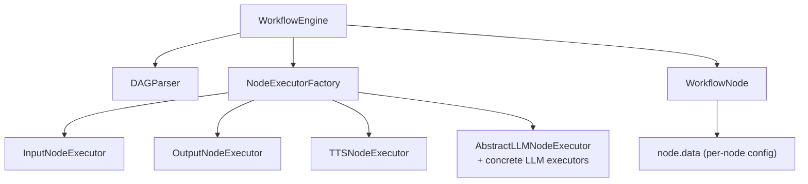
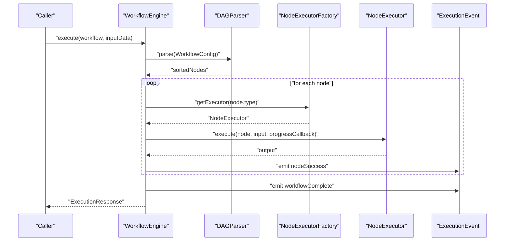
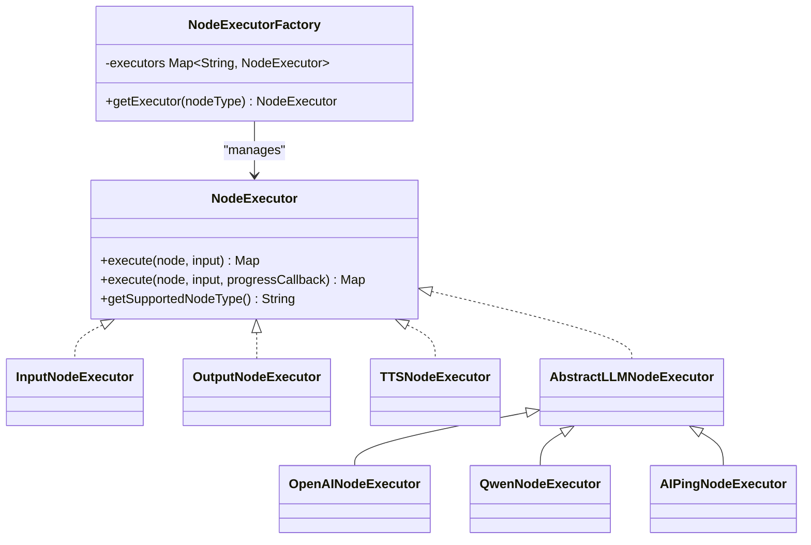
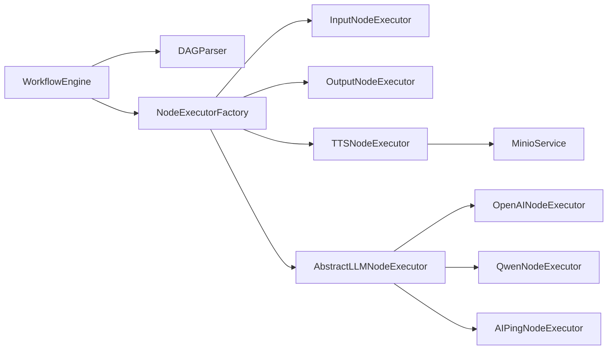

# Custom Node Types

<cite>
**Referenced Files in This Document**
- [NodeExecutor.java](file://backend/src/main/java/com/paiagent/engine/executor/NodeExecutor.java)
- [NodeExecutorFactory.java](file://backend/src/main/java/com/paiagent/engine/executor/NodeExecutorFactory.java)
- [InputNodeExecutor.java](file://backend/src/main/java/com/paiagent/engine/executor/impl/InputNodeExecutor.java)
- [OutputNodeExecutor.java](file://backend/src/main/java/com/paiagent/engine/executor/impl/OutputNodeExecutor.java)
- [TTSNodeExecutor.java](file://backend/src/main/java/com/paiagent/engine/executor/impl/TTSNodeExecutor.java)
- [WorkflowEngine.java](file://backend/src/main/java/com/paiagent/engine/WorkflowEngine.java)
- [DAGParser.java](file://backend/src/main/java/com/paiagent/engine/dag/DAGParser.java)
- [WorkflowNode.java](file://backend/src/main/java/com/paiagent/engine/model/WorkflowNode.java)
- [LLMNodeConfig.java](file://backend/src/main/java/com/paiagent/engine/llm/LLMNodeConfig.java)
- [AbstractLLMNodeExecutor.java](file://backend/src/main/java/com/paiagent/engine/executor/impl/AbstractLLMNodeExecutor.java)
- [AIPingNodeExecutor.java](file://backend/src/main/java/com/paiagent/engine/executor/impl/AIPingNodeExecutor.java)
- [OpenAINodeExecutor.java](file://backend/src/main/java/com/paiagent/engine/executor/impl/OpenAINodeExecutor.java)
- [QwenNodeExecutor.java](file://backend/src/main/java/com/paiagent/engine/executor/impl/QwenNodeExecutor.java)
- [ExecutionEvent.java](file://backend/src/main/java/com/paiagent/dto/ExecutionEvent.java)
</cite>

## Table of Contents
1. [Introduction](#introduction)
2. [Project Structure](#project-structure)
3. [Core Components](#core-components)
4. [Architecture Overview](#architecture-overview)
5. [Detailed Component Analysis](#detailed-component-analysis)
6. [Dependency Analysis](#dependency-analysis)
7. [Performance Considerations](#performance-considerations)
8. [Troubleshooting Guide](#troubleshooting-guide)
9. [Conclusion](#conclusion)
10. [Appendices](#appendices)

## Introduction
This document explains how to develop custom node types beyond LLM providers in the workflow engine. It covers the NodeExecutor interface contract, the NodeExecutorFactory registration pattern, and provides step-by-step guides for implementing InputNodeExecutor, OutputNodeExecutor, and TTSNodeExecutor as reference examples. It also documents configuration schema requirements, input/output parameter handling, and integration with the workflow execution engine. Finally, it outlines testing methodologies and best practices for maintaining compatibility with the existing system.

## Project Structure
The workflow engine centers around a DAG-based execution model:
- WorkflowEngine orchestrates execution, delegates node execution to NodeExecutorFactory, and emits ExecutionEvent events.
- NodeExecutorFactory registers and retrieves node executors by node type.
- Node implementations (e.g., InputNodeExecutor, OutputNodeExecutor, TTSNodeExecutor) implement the NodeExecutor interface.
- DAGParser computes the execution order based on node dependencies.
- WorkflowNode carries per-node configuration under the data field.
- LLMNodeConfig and AbstractLLMNodeExecutor demonstrate how LLM-style nodes can reuse shared logic.

**Diagram sources**
- [WorkflowEngine.java:37-80](file://backend/src/main/java/com/paiagent/engine/WorkflowEngine.java#L37-L80)
- [NodeExecutorFactory.java:14-35](file://backend/src/main/java/com/paiagent/engine/executor/NodeExecutorFactory.java#L14-L35)
- [InputNodeExecutor.java:14-26](file://backend/src/main/java/com/paiagent/engine/executor/impl/InputNodeExecutor.java#L14-L26)
- [OutputNodeExecutor.java:19-122](file://backend/src/main/java/com/paiagent/engine/executor/impl/OutputNodeExecutor.java#L19-L122)
- [TTSNodeExecutor.java:26-174](file://backend/src/main/java/com/paiagent/engine/executor/impl/TTSNodeExecutor.java#L26-L174)
- [DAGParser.java:20-57](file://backend/src/main/java/com/paiagent/engine/dag/DAGParser.java#L20-L57)
- [WorkflowNode.java:10-31](file://backend/src/main/java/com/paiagent/engine/model/WorkflowNode.java#L10-L31)

**Section sources**
- [WorkflowEngine.java:26-158](file://backend/src/main/java/com/paiagent/engine/WorkflowEngine.java#L26-L158)
- [NodeExecutorFactory.java:10-35](file://backend/src/main/java/com/paiagent/engine/executor/NodeExecutorFactory.java#L10-L35)
- [DAGParser.java:14-57](file://backend/src/main/java/com/paiagent/engine/dag/DAGParser.java#L14-L57)
- [WorkflowNode.java:9-37](file://backend/src/main/java/com/paiagent/engine/model/WorkflowNode.java#L9-L37)

## Core Components
- NodeExecutor interface defines the contract for all node types:
  - execute(node, input): returns a Map of output parameters.
  - execute(node, input, progressCallback): optional overload for streaming progress.
  - getSupportedNodeType(): identifies the node type string.
- NodeExecutorFactory:
  - Registers all discovered NodeExecutor beans by their supported node type.
  - Provides getExecutor(nodeType) lookup with a runtime exception for unsupported types.
- WorkflowEngine:
  - Parses workflow into a topological order.
  - Iterates nodes, obtains the appropriate executor via NodeExecutorFactory, and executes with optional progress callbacks.
  - Emits ExecutionEvent events for lifecycle hooks.
- WorkflowNode:
  - Holds node.id, node.type, node.position, and node.data (per-node configuration).
- ExecutionEvent:
  - Defines event types for workflow start, node start/success/error, node progress, and workflow completion.

Implementation highlights:
- InputNodeExecutor: returns the input unchanged.
- OutputNodeExecutor: supports templated response generation and parameter references across nodes.
- TTSNodeExecutor: demonstrates advanced features like text segmentation, concurrent processing, audio merging, and cloud storage upload.

**Section sources**
- [NodeExecutor.java:9-18](file://backend/src/main/java/com/paiagent/engine/executor/NodeExecutor.java#L9-L18)
- [NodeExecutorFactory.java:14-35](file://backend/src/main/java/com/paiagent/engine/executor/NodeExecutorFactory.java#L14-L35)
- [WorkflowEngine.java:37-118](file://backend/src/main/java/com/paiagent/engine/WorkflowEngine.java#L37-L118)
- [WorkflowNode.java:10-31](file://backend/src/main/java/com/paiagent/engine/model/WorkflowNode.java#L10-L31)
- [ExecutionEvent.java:6-79](file://backend/src/main/java/com/paiagent/dto/ExecutionEvent.java#L6-L79)

## Architecture Overview
The execution pipeline integrates parsing, factory-based dispatch, and event-driven progress reporting.

**Diagram sources**
- [WorkflowEngine.java:43-134](file://backend/src/main/java/com/paiagent/engine/WorkflowEngine.java#L43-L134)
- [DAGParser.java:20-57](file://backend/src/main/java/com/paiagent/engine/dag/DAGParser.java#L20-L57)
- [NodeExecutorFactory.java:28-34](file://backend/src/main/java/com/paiagent/engine/executor/NodeExecutorFactory.java#L28-L34)
- [ExecutionEvent.java:15-78](file://backend/src/main/java/com/paiagent/dto/ExecutionEvent.java#L15-L78)

## Detailed Component Analysis

### NodeExecutor Interface Contract
- Inputs:
  - WorkflowNode node: includes node.id, node.type, node.position, and node.data (per-node configuration).
  - Map<String, Object> input: previous node outputs plus initial input.
  - Optional Consumer<ExecutionEvent> progressCallback: for streaming progress.
- Outputs:
  - Map<String, Object>: arbitrary output parameters; conventionally includes "output" for single-result nodes.
- Behavior:
  - Implementations must honor the node’s configured data and produce deterministic outputs for reproducibility.
  - Progress callbacks must be invoked for long-running nodes to keep clients informed.

Best practices:
- Validate required inputs early and fail fast with meaningful messages.
- Keep side effects minimal; delegate external integrations to services injected via Spring.
- Support optional progressCallback gracefully when not provided.

**Section sources**
- [NodeExecutor.java:11-17](file://backend/src/main/java/com/paiagent/engine/executor/NodeExecutor.java#L11-L17)
- [WorkflowNode.java:10-31](file://backend/src/main/java/com/paiagent/engine/model/WorkflowNode.java#L10-L31)

### NodeExecutorFactory Pattern
- Registration:
  - Constructor scans all NodeExecutor beans and registers them by node type returned by getSupportedNodeType().
- Lookup:
  - getExecutor(nodeType) returns the matching executor or throws a runtime exception for unsupported types.
- Integration:
  - WorkflowEngine uses NodeExecutorFactory to resolve the correct executor per node during execution.

**Diagram sources**
- [NodeExecutor.java:9-18](file://backend/src/main/java/com/paiagent/engine/executor/NodeExecutor.java#L9-L18)
- [NodeExecutorFactory.java:14-35](file://backend/src/main/java/com/paiagent/engine/executor/NodeExecutorFactory.java#L14-L35)
- [InputNodeExecutor.java:14-26](file://backend/src/main/java/com/paiagent/engine/executor/impl/InputNodeExecutor.java#L14-L26)
- [OutputNodeExecutor.java:19-122](file://backend/src/main/java/com/paiagent/engine/executor/impl/OutputNodeExecutor.java#L19-L122)
- [TTSNodeExecutor.java:26-174](file://backend/src/main/java/com/paiagent/engine/executor/impl/TTSNodeExecutor.java#L26-L174)
- [AbstractLLMNodeExecutor.java:23-230](file://backend/src/main/java/com/paiagent/engine/executor/impl/AbstractLLMNodeExecutor.java#L23-L230)
- [OpenAINodeExecutor.java:10-16](file://backend/src/main/java/com/paiagent/engine/executor/impl/OpenAINodeExecutor.java#L10-L16)
- [QwenNodeExecutor.java:10-16](file://backend/src/main/java/com/paiagent/engine/executor/impl/QwenNodeExecutor.java#L10-L16)
- [AIPingNodeExecutor.java:10-16](file://backend/src/main/java/com/paiagent/engine/executor/impl/AIPingNodeExecutor.java#L10-L16)

**Section sources**
- [NodeExecutorFactory.java:14-35](file://backend/src/main/java/com/paiagent/engine/executor/NodeExecutorFactory.java#L14-L35)
- [WorkflowEngine.java:79-80](file://backend/src/main/java/com/paiagent/engine/WorkflowEngine.java#L79-L80)

### Step-by-Step: Implementing InputNodeExecutor
Purpose:
- Pass through initial input unchanged.

Steps:
1. Implement NodeExecutor.
2. In execute(node, input), return a copy of the input Map.
3. In getSupportedNodeType(), return the node type string (e.g., "input").
4. Register as a Spring component so NodeExecutorFactory auto-discovers it.

Integration notes:
- Initial input is placed under the "input" key in the first node’s input Map.
- Subsequent nodes receive outputs from previous nodes as input.

**Section sources**
- [InputNodeExecutor.java:14-26](file://backend/src/main/java/com/paiagent/engine/executor/impl/InputNodeExecutor.java#L14-L26)
- [WorkflowEngine.java:52-99](file://backend/src/main/java/com/paiagent/engine/WorkflowEngine.java#L52-L99)

### Step-by-Step: Implementing OutputNodeExecutor
Purpose:
- Build a final response from a template and referenced parameters.

Steps:
1. Implement NodeExecutor.
2. Extract node.data and responseContent template.
3. Parse outputParams to map parameter names to either literal values or references.
4. Resolve references from:
   - __nodeOutputs__ (LangGraph-style intermediate outputs),
   - input (DAG-style inputs),
   - fallbacks (e.g., "input" for user input).
5. Replace placeholders in the template with resolved values.
6. Return a Map containing the final "output" string.

Configuration schema (node.data):
- responseContent: string template with {{param}} placeholders.
- outputParams: array of objects with fields:
  - name: output parameter name.
  - type: "input" or "reference".
  - value or referenceNode: depends on type.

**Section sources**
- [OutputNodeExecutor.java:21-116](file://backend/src/main/java/com/paiagent/engine/executor/impl/OutputNodeExecutor.java#L21-L116)
- [WorkflowEngine.java:99](file://backend/src/main/java/com/paiagent/engine/WorkflowEngine.java#L99)

### Step-by-Step: Implementing TTSNodeExecutor
Purpose:
- Convert text to speech using an external API, handle chunking, concurrent processing, merging, and upload.

Steps:
1. Implement NodeExecutor with both execute(node, input) and execute(node, input, progressCallback).
2. Extract input text from node.data.inputParams or fallbacks in input.
3. Validate required configuration (API key, model, voice, language).
4. Split text into chunks respecting byte-length limits and punctuation boundaries.
5. Optionally emit progress events for chunk processing.
6. Call the external TTS API concurrently for each chunk.
7. Merge resulting WAV files and upload to storage.
8. Return output with audioUrl, fileName, and chunks count.

Configuration schema (node.data):
- apiKey: provider API key.
- model: model identifier (default provided).
- voice: voice identifier (converted to enum).
- languageType: language selection.
- inputParams: array of input bindings:
  - name: "text"
  - type: "input" or "reference"
  - value or referenceNode

Concurrency and progress:
- Uses CompletableFuture to process chunks in parallel.
- Emits NODE_PROGRESS events with current/total chunk counts.

**Section sources**
- [TTSNodeExecutor.java:33-174](file://backend/src/main/java/com/paiagent/engine/executor/impl/TTSNodeExecutor.java#L33-L174)
- [TTSNodeExecutor.java:185-224](file://backend/src/main/java/com/paiagent/engine/executor/impl/TTSNodeExecutor.java#L185-L224)
- [TTSNodeExecutor.java:231-279](file://backend/src/main/java/com/paiagent/engine/executor/impl/TTSNodeExecutor.java#L231-L279)
- [TTSNodeExecutor.java:291-352](file://backend/src/main/java/com/paiagent/engine/executor/impl/TTSNodeExecutor.java#L291-L352)
- [ExecutionEvent.java:68-78](file://backend/src/main/java/com/paiagent/dto/ExecutionEvent.java#L68-L78)

### Reference LLM Node Executors
AbstractLLMNodeExecutor provides a reusable base for LLM-style nodes:
- Extracts configuration from node.data into LLMNodeConfig.
- Processes prompt templates with PromptTemplateService.
- Creates ChatClient via ChatClientFactory.
- Supports normal and streaming execution modes.
- Builds standardized outputs with tokens and configurable output parameters.

Concrete implementations:
- OpenAINodeExecutor, QwenNodeExecutor, AIPingNodeExecutor override getNodeType() to register distinct node types.

**Section sources**
- [AbstractLLMNodeExecutor.java:36-89](file://backend/src/main/java/com/paiagent/engine/executor/impl/AbstractLLMNodeExecutor.java#L36-L89)
- [AbstractLLMNodeExecutor.java:174-190](file://backend/src/main/java/com/paiagent/engine/executor/impl/AbstractLLMNodeExecutor.java#L174-L190)
- [AbstractLLMNodeExecutor.java:196-217](file://backend/src/main/java/com/paiagent/engine/executor/impl/AbstractLLMNodeExecutor.java#L196-L217)
- [OpenAINodeExecutor.java:10-16](file://backend/src/main/java/com/paiagent/engine/executor/impl/OpenAINodeExecutor.java#L10-L16)
- [QwenNodeExecutor.java:10-16](file://backend/src/main/java/com/paiagent/engine/executor/impl/QwenNodeExecutor.java#L10-L16)
- [AIPingNodeExecutor.java:10-16](file://backend/src/main/java/com/paiagent/engine/executor/impl/AIPingNodeExecutor.java#L10-L16)
- [LLMNodeConfig.java:12-53](file://backend/src/main/java/com/paiagent/engine/llm/LLMNodeConfig.java#L12-L53)

### Non-LLM Node Examples
Beyond LLMs, the framework supports diverse node types:
- Audio processing: TTSNodeExecutor demonstrates chunking, merging, and storage upload.
- Data transformation: OutputNodeExecutor transforms structured inputs into templated outputs.
- External API integration: AbstractLLMNodeExecutor and TTSNodeExecutor integrate with third-party APIs.

Guidelines:
- Encapsulate external calls behind services (e.g., MinioService).
- Emit progress events for long-running operations.
- Validate configuration and inputs early.

**Section sources**
- [TTSNodeExecutor.java:30-174](file://backend/src/main/java/com/paiagent/engine/executor/impl/TTSNodeExecutor.java#L30-L174)
- [OutputNodeExecutor.java:21-116](file://backend/src/main/java/com/paiagent/engine/executor/impl/OutputNodeExecutor.java#L21-L116)
- [AbstractLLMNodeExecutor.java:42-89](file://backend/src/main/java/com/paiagent/engine/executor/impl/AbstractLLMNodeExecutor.java#L42-L89)

## Dependency Analysis
- WorkflowEngine depends on DAGParser for ordering, NodeExecutorFactory for dispatch, and persists ExecutionRecord.
- NodeExecutorFactory depends on Spring’s DI to discover all NodeExecutor beans.
- Node implementations depend on WorkflowNode.data for configuration and may depend on services (e.g., MinioService).
- LLM executors depend on LLMNodeConfig and AbstractLLMNodeExecutor for shared logic.

**Diagram sources**
- [WorkflowEngine.java:29-35](file://backend/src/main/java/com/paiagent/engine/WorkflowEngine.java#L29-L35)
- [NodeExecutorFactory.java:19-23](file://backend/src/main/java/com/paiagent/engine/executor/NodeExecutorFactory.java#L19-L23)
- [TTSNodeExecutor.java:30-31](file://backend/src/main/java/com/paiagent/engine/executor/impl/TTSNodeExecutor.java#L30-L31)
- [AbstractLLMNodeExecutor.java:25-29](file://backend/src/main/java/com/paiagent/engine/executor/impl/AbstractLLMNodeExecutor.java#L25-L29)

**Section sources**
- [WorkflowEngine.java:28-35](file://backend/src/main/java/com/paiagent/engine/WorkflowEngine.java#L28-L35)
- [NodeExecutorFactory.java:19-23](file://backend/src/main/java/com/paiagent/engine/executor/NodeExecutorFactory.java#L19-L23)

## Performance Considerations
- Concurrency:
  - Use CompletableFuture for parallel processing in long-running nodes (e.g., TTSNodeExecutor).
  - Ensure thread-safe operations and avoid blocking the main execution thread.
- Chunking:
  - Split large inputs to respect provider limits and improve throughput (e.g., TTSNodeExecutor).
- Progress reporting:
  - Emit NODE_PROGRESS events to keep clients informed without blocking execution.
- Storage:
  - Upload artifacts asynchronously and track completion to minimize latency.
- Logging:
  - Log inputs, outputs, and timing for observability; avoid logging sensitive data.

[No sources needed since this section provides general guidance]

## Troubleshooting Guide
Common issues and resolutions:
- Unsupported node type:
  - Symptom: RuntimeException indicating unsupported node type.
  - Cause: NodeExecutor not registered or mismatched getSupportedNodeType().
  - Fix: Ensure the implementation is annotated as a Spring component and returns the correct type.
- Missing configuration:
  - Symptom: IllegalArgumentException for missing apiKey or input text.
  - Fix: Validate node.data fields before use and provide clear error messages.
- Circular dependencies:
  - Symptom: Runtime exception during DAG parsing.
  - Fix: Review workflow edges to remove cycles.
- Streaming progress not received:
  - Symptom: No progress updates.
  - Fix: Verify that progressCallback is passed to NodeExecutor.execute and that the node supports streaming.

**Section sources**
- [NodeExecutorFactory.java:30-33](file://backend/src/main/java/com/paiagent/engine/executor/NodeExecutorFactory.java#L30-L33)
- [TTSNodeExecutor.java:40-53](file://backend/src/main/java/com/paiagent/engine/executor/impl/TTSNodeExecutor.java#L40-L53)
- [DAGParser.java:52-57](file://backend/src/main/java/com/paiagent/engine/dag/DAGParser.java#L52-L57)
- [WorkflowEngine.java:101-112](file://backend/src/main/java/com/paiagent/engine/WorkflowEngine.java#L101-L112)

## Conclusion
By adhering to the NodeExecutor interface and leveraging NodeExecutorFactory, you can implement robust, extensible node types that integrate seamlessly with the DAG-based workflow engine. Use the provided examples as templates: InputNodeExecutor for pass-through logic, OutputNodeExecutor for templated outputs, and TTSNodeExecutor for complex, asynchronous operations. Follow the configuration and progress-reporting patterns demonstrated here to maintain compatibility and reliability across the system.

[No sources needed since this section summarizes without analyzing specific files]

## Appendices

### Configuration Schema Reference
- WorkflowNode.data (per-node configuration):
  - Arbitrary key-value pairs; node-specific semantics.
  - Example keys: apiKey, model, voice, languageType, prompt, inputParams, outputParams, streaming.
- LLMNodeConfig (LLM-style nodes):
  - apiUrl, apiKey, model, temperature, promptTemplate, inputParams, outputParams, streaming.
- OutputNodeExecutor:
  - responseContent: template string with {{param}} placeholders.
  - outputParams: array of parameter bindings (name, type, value/referenceNode).
- TTSNodeExecutor:
  - inputParams: array with "text" binding (type=input or reference).
  - apiKey, model, voice, languageType.

**Section sources**
- [WorkflowNode.java:30](file://backend/src/main/java/com/paiagent/engine/model/WorkflowNode.java#L30)
- [LLMNodeConfig.java:17-52](file://backend/src/main/java/com/paiagent/engine/llm/LLMNodeConfig.java#L17-L52)
- [OutputNodeExecutor.java:33-44](file://backend/src/main/java/com/paiagent/engine/executor/impl/OutputNodeExecutor.java#L33-L44)
- [TTSNodeExecutor.java:45-49](file://backend/src/main/java/com/paiagent/engine/executor/impl/TTSNodeExecutor.java#L45-L49)
- [TTSNodeExecutor.java:185-211](file://backend/src/main/java/com/paiagent/engine/executor/impl/TTSNodeExecutor.java#L185-L211)

### Testing Methodologies
Recommended approaches:
- Unit tests for individual node executors:
  - Mock WorkflowNode.data and input Maps.
  - Verify output Map shape and content.
  - Test error paths (missing config, invalid references).
- Integration tests:
  - Compose small workflows with InputNodeExecutor → YourNode → OutputNodeExecutor.
  - Assert ExecutionResponse and persisted ExecutionRecord.
- Event-driven tests:
  - Capture ExecutionEvent emissions for progress and completion.
- Concurrency tests:
  - Validate parallel processing correctness and resource cleanup.

[No sources needed since this section provides general guidance]