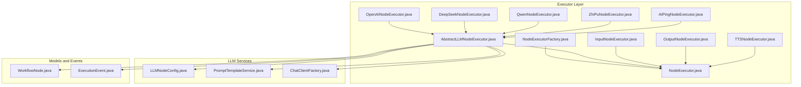
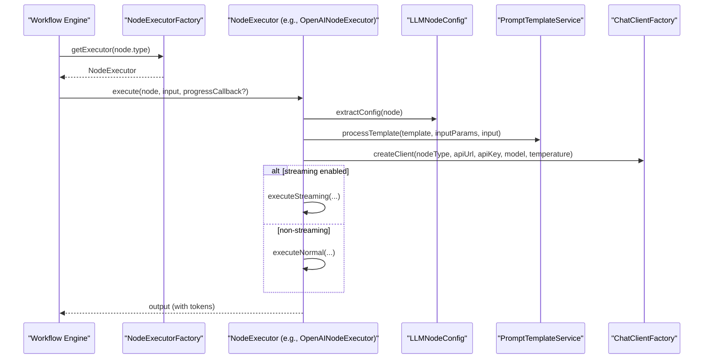
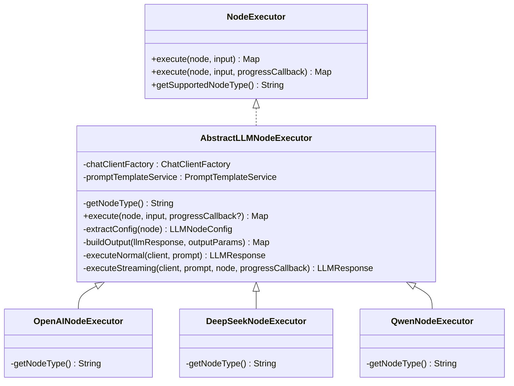
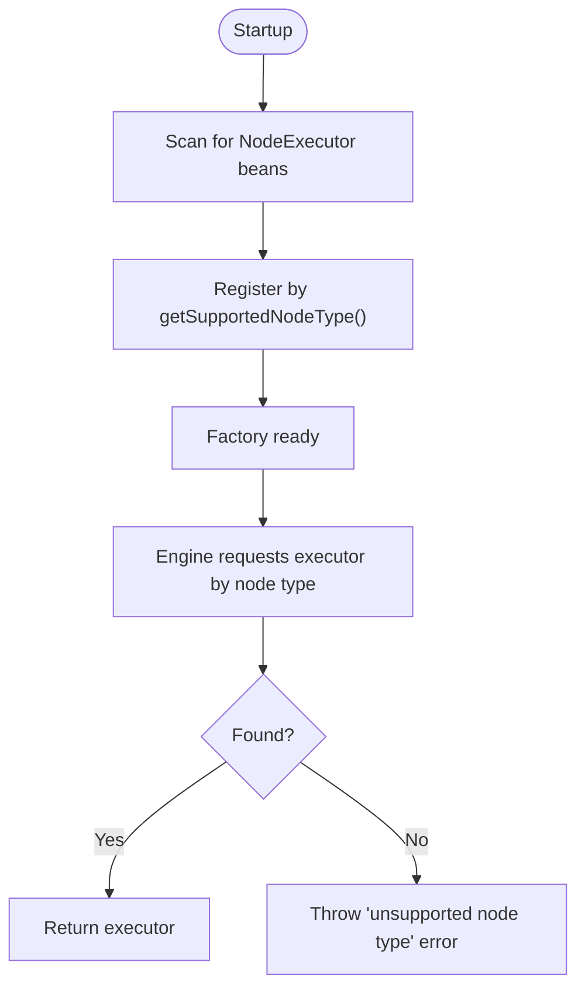
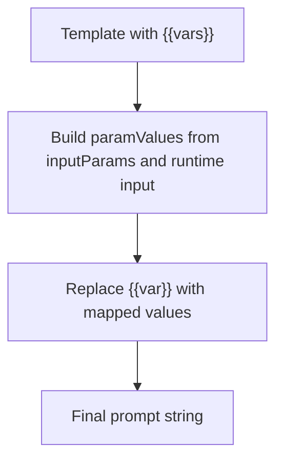
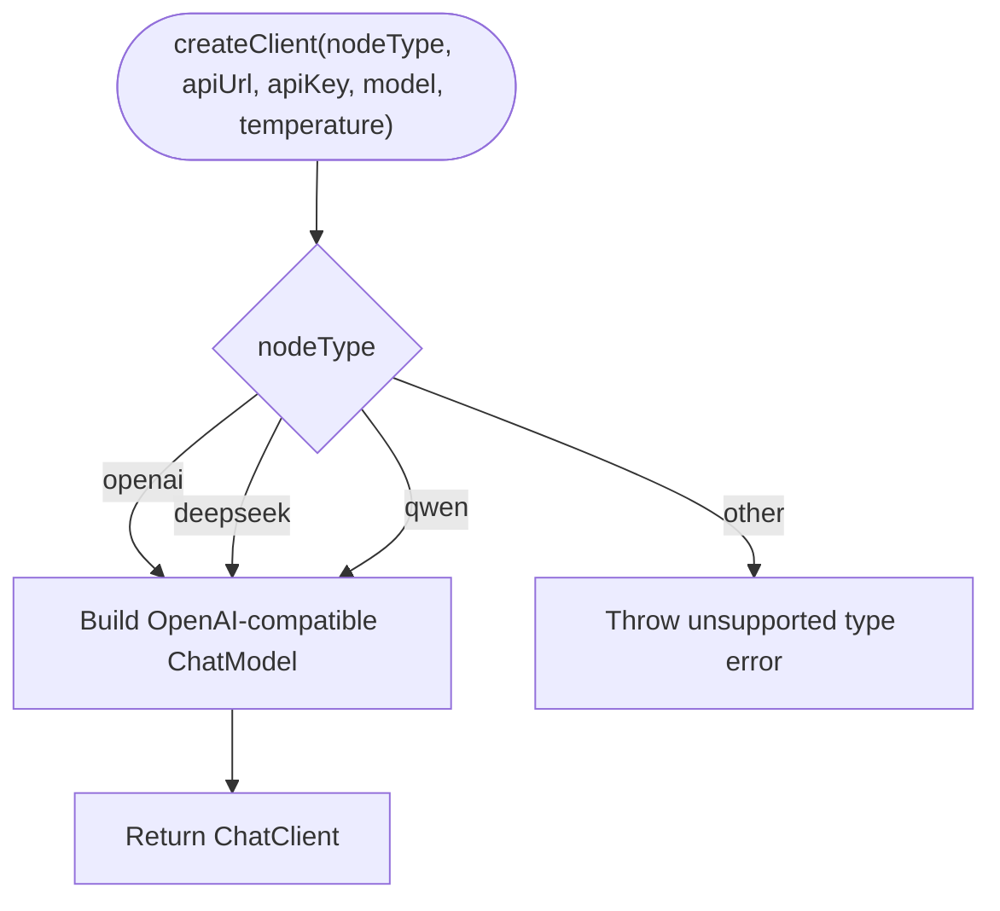
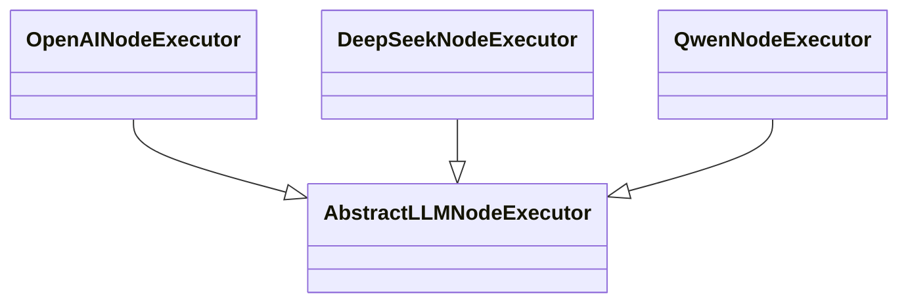
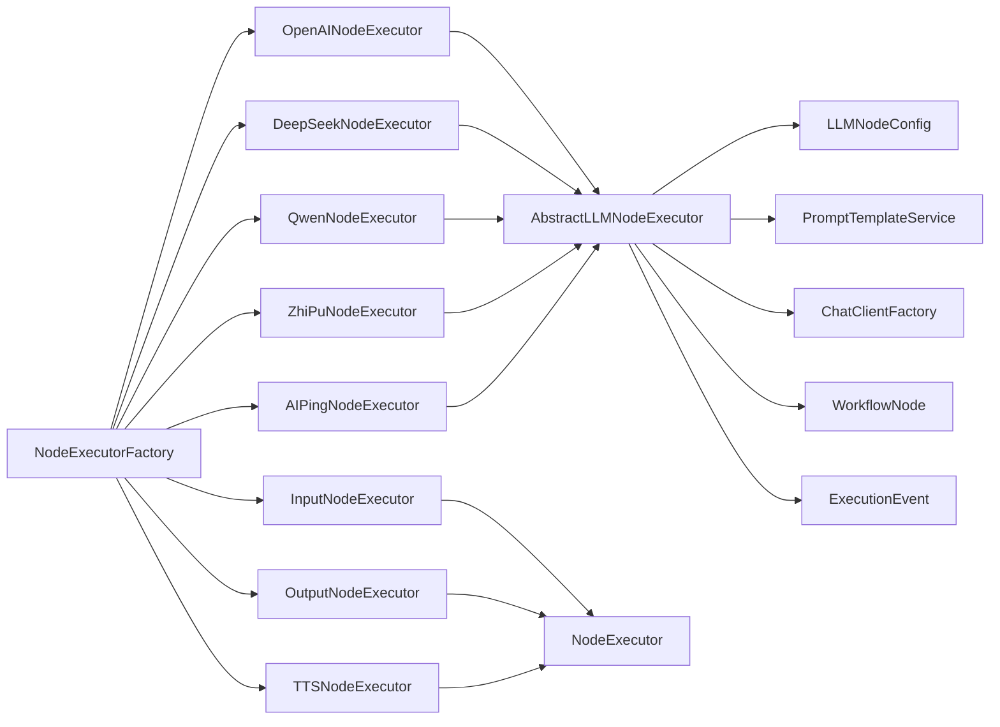

# Extension Development

<cite>
**Referenced Files in This Document**
- [AbstractLLMNodeExecutor.java](file://backend/src/main/java/com/paiagent/engine/executor/impl/AbstractLLMNodeExecutor.java)
- [NodeExecutor.java](file://backend/src/main/java/com/paiagent/engine/executor/NodeExecutor.java)
- [NodeExecutorFactory.java](file://backend/src/main/java/com/paiagent/engine/executor/NodeExecutorFactory.java)
- [OpenAINodeExecutor.java](file://backend/src/main/java/com/paiagent/engine/executor/impl/OpenAINodeExecutor.java)
- [DeepSeekNodeExecutor.java](file://backend/src/main/java/com/paiagent/engine/executor/impl/DeepSeekNodeExecutor.java)
- [QwenNodeExecutor.java](file://backend/src/main/java/com/paiagent/engine/executor/impl/QwenNodeExecutor.java)
- [LLMNodeConfig.java](file://backend/src/main/java/com/paiagent/engine/llm/LLMNodeConfig.java)
- [PromptTemplateService.java](file://backend/src/main/java/com/paiagent/engine/llm/PromptTemplateService.java)
- [ChatClientFactory.java](file://backend/src/main/java/com/paiagent/engine/llm/ChatClientFactory.java)
- [WorkflowNode.java](file://backend/src/main/java/com/paiagent/engine/model/WorkflowNode.java)
- [ExecutionEvent.java](file://backend/src/main/java/com/paiagent/dto/ExecutionEvent.java)
- [InputNodeExecutor.java](file://backend/src/main/java/com/paiagent/engine/executor/impl/InputNodeExecutor.java)
- [OutputNodeExecutor.java](file://backend/src/main/java/com/paiagent/engine/executor/impl/OutputNodeExecutor.java)
- [AIPingNodeExecutor.java](file://backend/src/main/java/com/paiagent/engine/executor/impl/AIPingNodeExecutor.java)
- [ZhiPuNodeExecutor.java](file://backend/src/main/java/com/paiagent/engine/executor/impl/ZhiPuNodeExecutor.java)
- [TTSNodeExecutor.java](file://backend/src/main/java/com/paiagent/engine/executor/impl/TTSNodeExecutor.java)
</cite>

## Table of Contents
1. [Introduction](#introduction)
2. [Project Structure](#project-structure)
3. [Core Components](#core-components)
4. [Architecture Overview](#architecture-overview)
5. [Detailed Component Analysis](#detailed-component-analysis)
6. [Dependency Analysis](#dependency-analysis)
7. [Performance Considerations](#performance-considerations)
8. [Troubleshooting Guide](#troubleshooting-guide)
9. [Conclusion](#conclusion)
10. [Appendices](#appendices)

## Introduction
This document explains how to extend the system by adding new LLM providers and custom node types. It focuses on:
- The AbstractLLMNodeExecutor base class and its extension points for implementing new AI providers
- The NodeExecutor interface and the factory pattern used to register and dispatch node executors
- Step-by-step integration guidelines for new LLM providers, including configuration, authentication, and API integration patterns
- Reference implementations for OpenAI, DeepSeek, and Qwen
- Testing strategies and deployment considerations

## Project Structure
The extension points relevant to adding new providers and nodes are primarily located under the engine executor and LLM packages. The key areas are:
- Executor interfaces and implementations
- Factory for executor registration and lookup
- LLM configuration, prompt templating, and client creation
- Node models and execution events

**Diagram sources**
- [NodeExecutor.java:1-18](file://backend/src/main/java/com/paiagent/engine/executor/NodeExecutor.java#L1-L18)
- [NodeExecutorFactory.java:1-36](file://backend/src/main/java/com/paiagent/engine/executor/NodeExecutorFactory.java#L1-L36)
- [AbstractLLMNodeExecutor.java:1-231](file://backend/src/main/java/com/paiagent/engine/executor/impl/AbstractLLMNodeExecutor.java#L1-L231)
- [OpenAINodeExecutor.java:1-17](file://backend/src/main/java/com/paiagent/engine/executor/impl/OpenAINodeExecutor.java#L1-L17)
- [DeepSeekNodeExecutor.java:1-17](file://backend/src/main/java/com/paiagent/engine/executor/impl/DeepSeekNodeExecutor.java#L1-L17)
- [QwenNodeExecutor.java:1-17](file://backend/src/main/java/com/paiagent/engine/executor/impl/QwenNodeExecutor.java#L1-L17)
- [ZhiPuNodeExecutor.java:1-17](file://backend/src/main/java/com/paiagent/engine/executor/impl/ZhiPuNodeExecutor.java#L1-L17)
- [AIPingNodeExecutor.java:1-17](file://backend/src/main/java/com/paiagent/engine/executor/impl/AIPingNodeExecutor.java#L1-L17)
- [InputNodeExecutor.java:1-27](file://backend/src/main/java/com/paiagent/engine/executor/impl/InputNodeExecutor.java#L1-L27)
- [OutputNodeExecutor.java:1-123](file://backend/src/main/java/com/paiagent/engine/executor/impl/OutputNodeExecutor.java#L1-L123)
- [TTSNodeExecutor.java:1-353](file://backend/src/main/java/com/paiagent/engine/executor/impl/TTSNodeExecutor.java#L1-L353)
- [LLMNodeConfig.java:1-54](file://backend/src/main/java/com/paiagent/engine/llm/LLMNodeConfig.java#L1-L54)
- [PromptTemplateService.java:1-108](file://backend/src/main/java/com/paiagent/engine/llm/PromptTemplateService.java#L1-L108)
- [ChatClientFactory.java:1-60](file://backend/src/main/java/com/paiagent/engine/llm/ChatClientFactory.java#L1-L60)
- [WorkflowNode.java:1-38](file://backend/src/main/java/com/paiagent/engine/model/WorkflowNode.java#L1-L38)
- [ExecutionEvent.java:1-79](file://backend/src/main/java/com/paiagent/dto/ExecutionEvent.java#L1-L79)

**Section sources**
- [NodeExecutor.java:1-18](file://backend/src/main/java/com/paiagent/engine/executor/NodeExecutor.java#L1-L18)
- [NodeExecutorFactory.java:1-36](file://backend/src/main/java/com/paiagent/engine/executor/NodeExecutorFactory.java#L1-L36)
- [AbstractLLMNodeExecutor.java:1-231](file://backend/src/main/java/com/paiagent/engine/executor/impl/AbstractLLMNodeExecutor.java#L1-L231)
- [LLMNodeConfig.java:1-54](file://backend/src/main/java/com/paiagent/engine/llm/LLMNodeConfig.java#L1-L54)
- [PromptTemplateService.java:1-108](file://backend/src/main/java/com/paiagent/engine/llm/PromptTemplateService.java#L1-L108)
- [ChatClientFactory.java:1-60](file://backend/src/main/java/com/paiagent/engine/llm/ChatClientFactory.java#L1-L60)
- [WorkflowNode.java:1-38](file://backend/src/main/java/com/paiagent/engine/model/WorkflowNode.java#L1-L38)
- [ExecutionEvent.java:1-79](file://backend/src/main/java/com/paiagent/dto/ExecutionEvent.java#L1-L79)

## Core Components
- NodeExecutor interface defines the contract for all node executors, including optional progress callback support.
- NodeExecutorFactory registers all NodeExecutor beans and maps them by supported node type for runtime dispatch.
- AbstractLLMNodeExecutor provides a reusable foundation for LLM-based nodes, handling configuration extraction, prompt templating, client creation, streaming vs non-streaming invocation, and standardized output building.
- LLMNodeConfig encapsulates provider-specific configuration such as API endpoint, API key, model, temperature, prompt template, input/output parameter mappings, and streaming flag.
- PromptTemplateService performs variable substitution in templates using inputParams and runtime input data.
- ChatClientFactory creates Spring AI ChatClient instances compatible with OpenAI-style APIs, enabling unified client usage across providers like OpenAI, DeepSeek, and Qwen.

**Section sources**
- [NodeExecutor.java:1-18](file://backend/src/main/java/com/paiagent/engine/executor/NodeExecutor.java#L1-L18)
- [NodeExecutorFactory.java:1-36](file://backend/src/main/java/com/paiagent/engine/executor/NodeExecutorFactory.java#L1-L36)
- [AbstractLLMNodeExecutor.java:1-231](file://backend/src/main/java/com/paiagent/engine/executor/impl/AbstractLLMNodeExecutor.java#L1-L231)
- [LLMNodeConfig.java:1-54](file://backend/src/main/java/com/paiagent/engine/llm/LLMNodeConfig.java#L1-L54)
- [PromptTemplateService.java:1-108](file://backend/src/main/java/com/paiagent/engine/llm/PromptTemplateService.java#L1-L108)
- [ChatClientFactory.java:1-60](file://backend/src/main/java/com/paiagent/engine/llm/ChatClientFactory.java#L1-L60)

## Architecture Overview
The extension architecture leverages dependency injection and a factory pattern to dynamically route workflow nodes to their respective executors. LLM providers inherit from the shared AbstractLLMNodeExecutor to reuse common logic.

**Diagram sources**
- [NodeExecutorFactory.java:1-36](file://backend/src/main/java/com/paiagent/engine/executor/NodeExecutorFactory.java#L1-L36)
- [AbstractLLMNodeExecutor.java:1-231](file://backend/src/main/java/com/paiagent/engine/executor/impl/AbstractLLMNodeExecutor.java#L1-L231)
- [LLMNodeConfig.java:1-54](file://backend/src/main/java/com/paiagent/engine/llm/LLMNodeConfig.java#L1-L54)
- [PromptTemplateService.java:1-108](file://backend/src/main/java/com/paiagent/engine/llm/PromptTemplateService.java#L1-L108)
- [ChatClientFactory.java:1-60](file://backend/src/main/java/com/paiagent/engine/llm/ChatClientFactory.java#L1-L60)

## Detailed Component Analysis

### AbstractLLMNodeExecutor
AbstractLLMNodeExecutor centralizes LLM node execution:
- Extracts configuration from node data via LLMNodeConfig
- Processes prompt templates using PromptTemplateService
- Creates a ChatClient via ChatClientFactory
- Executes either streaming or non-streaming calls
- Builds standardized output with content and token metrics

Key extension points:
- getNodeType(): return the unique node type string (e.g., "openai", "deepseek", "qwen")
- The rest of the logic is inherited and handles logging, progress callbacks, and output formatting

**Diagram sources**
- [NodeExecutor.java:1-18](file://backend/src/main/java/com/paiagent/engine/executor/NodeExecutor.java#L1-L18)
- [AbstractLLMNodeExecutor.java:1-231](file://backend/src/main/java/com/paiagent/engine/executor/impl/AbstractLLMNodeExecutor.java#L1-L231)
- [OpenAINodeExecutor.java:1-17](file://backend/src/main/java/com/paiagent/engine/executor/impl/OpenAINodeExecutor.java#L1-L17)
- [DeepSeekNodeExecutor.java:1-17](file://backend/src/main/java/com/paiagent/engine/executor/impl/DeepSeekNodeExecutor.java#L1-L17)
- [QwenNodeExecutor.java:1-17](file://backend/src/main/java/com/paiagent/engine/executor/impl/QwenNodeExecutor.java#L1-L17)

**Section sources**
- [AbstractLLMNodeExecutor.java:1-231](file://backend/src/main/java/com/paiagent/engine/executor/impl/AbstractLLMNodeExecutor.java#L1-L231)

### NodeExecutor Interface and Factory Pattern
- NodeExecutor defines the execution contract and default behavior for progress callbacks.
- NodeExecutorFactory scans for all NodeExecutor beans and registers them by node type during startup. It throws an error for unsupported node types.

**Diagram sources**
- [NodeExecutor.java:1-18](file://backend/src/main/java/com/paiagent/engine/executor/NodeExecutor.java#L1-L18)
- [NodeExecutorFactory.java:1-36](file://backend/src/main/java/com/paiagent/engine/executor/NodeExecutorFactory.java#L1-L36)

**Section sources**
- [NodeExecutor.java:1-18](file://backend/src/main/java/com/paiagent/engine/executor/NodeExecutor.java#L1-L18)
- [NodeExecutorFactory.java:1-36](file://backend/src/main/java/com/paiagent/engine/executor/NodeExecutorFactory.java#L1-L36)

### LLMNodeConfig and Prompt Template Processing
- LLMNodeConfig holds provider settings and parameters used by AbstractLLMNodeExecutor.
- PromptTemplateService replaces {{variable}} placeholders using inputParams and runtime input data, supporting both static and referenced values.

**Diagram sources**
- [LLMNodeConfig.java:1-54](file://backend/src/main/java/com/paiagent/engine/llm/LLMNodeConfig.java#L1-L54)
- [PromptTemplateService.java:1-108](file://backend/src/main/java/com/paiagent/engine/llm/PromptTemplateService.java#L1-L108)

**Section sources**
- [LLMNodeConfig.java:1-54](file://backend/src/main/java/com/paiagent/engine/llm/LLMNodeConfig.java#L1-L54)
- [PromptTemplateService.java:1-108](file://backend/src/main/java/com/paiagent/engine/llm/PromptTemplateService.java#L1-L108)

### ChatClientFactory and Provider Compatibility
- ChatClientFactory creates ChatClient instances compatible with OpenAI-style APIs.
- Supported node types include "openai", "deepseek", "qwen", and others handled similarly.
- The factory constructs OpenAiApi with a custom base URL and OpenAiChatOptions (model, temperature).

**Diagram sources**
- [ChatClientFactory.java:1-60](file://backend/src/main/java/com/paiagent/engine/llm/ChatClientFactory.java#L1-L60)

**Section sources**
- [ChatClientFactory.java:1-60](file://backend/src/main/java/com/paiagent/engine/llm/ChatClientFactory.java#L1-L60)

### Reference Implementations
- OpenAINodeExecutor, DeepSeekNodeExecutor, and QwenNodeExecutor demonstrate minimal overrides: only getNodeType() returning their respective identifiers.
- These classes inherit all execution logic from AbstractLLMNodeExecutor.

**Diagram sources**
- [OpenAINodeExecutor.java:1-17](file://backend/src/main/java/com/paiagent/engine/executor/impl/OpenAINodeExecutor.java#L1-L17)
- [DeepSeekNodeExecutor.java:1-17](file://backend/src/main/java/com/paiagent/engine/executor/impl/DeepSeekNodeExecutor.java#L1-L17)
- [QwenNodeExecutor.java:1-17](file://backend/src/main/java/com/paiagent/engine/executor/impl/QwenNodeExecutor.java#L1-L17)
- [AbstractLLMNodeExecutor.java:1-231](file://backend/src/main/java/com/paiagent/engine/executor/impl/AbstractLLMNodeExecutor.java#L1-L231)

**Section sources**
- [OpenAINodeExecutor.java:1-17](file://backend/src/main/java/com/paiagent/engine/executor/impl/OpenAINodeExecutor.java#L1-L17)
- [DeepSeekNodeExecutor.java:1-17](file://backend/src/main/java/com/paiagent/engine/executor/impl/DeepSeekNodeExecutor.java#L1-L17)
- [QwenNodeExecutor.java:1-17](file://backend/src/main/java/com/paiagent/engine/executor/impl/QwenNodeExecutor.java#L1-L17)

### Additional Node Types for Reference
- InputNodeExecutor: Returns the incoming input unchanged.
- OutputNodeExecutor: Builds a response using a template and parameter mappings, supporting references to upstream outputs.
- AIPingNodeExecutor: Minimal LLM executor for health checks.
- ZhiPuNodeExecutor: Another OpenAI-compatible provider executor.
- TTSNodeExecutor: Non-LLM node demonstrating advanced features like text segmentation, async processing, audio merging, and storage upload.

These show how to implement custom node behaviors beyond LLMs.

**Section sources**
- [InputNodeExecutor.java:1-27](file://backend/src/main/java/com/paiagent/engine/executor/impl/InputNodeExecutor.java#L1-L27)
- [OutputNodeExecutor.java:1-123](file://backend/src/main/java/com/paiagent/engine/executor/impl/OutputNodeExecutor.java#L1-L123)
- [AIPingNodeExecutor.java:1-17](file://backend/src/main/java/com/paiagent/engine/executor/impl/AIPingNodeExecutor.java#L1-L17)
- [ZhiPuNodeExecutor.java:1-17](file://backend/src/main/java/com/paiagent/engine/executor/impl/ZhiPuNodeExecutor.java#L1-L17)
- [TTSNodeExecutor.java:1-353](file://backend/src/main/java/com/paiagent/engine/executor/impl/TTSNodeExecutor.java#L1-L353)

## Dependency Analysis
- AbstractLLMNodeExecutor depends on:
  - LLMNodeConfig for configuration
  - PromptTemplateService for templating
  - ChatClientFactory for client creation
  - WorkflowNode for node metadata
  - ExecutionEvent for progress reporting
- NodeExecutorFactory depends on Spring’s bean discovery to populate the registry.
- Provider executors depend on AbstractLLMNodeExecutor for behavior and rely on ChatClientFactory for API compatibility.

**Diagram sources**
- [AbstractLLMNodeExecutor.java:1-231](file://backend/src/main/java/com/paiagent/engine/executor/impl/AbstractLLMNodeExecutor.java#L1-L231)
- [LLMNodeConfig.java:1-54](file://backend/src/main/java/com/paiagent/engine/llm/LLMNodeConfig.java#L1-L54)
- [PromptTemplateService.java:1-108](file://backend/src/main/java/com/paiagent/engine/llm/PromptTemplateService.java#L1-L108)
- [ChatClientFactory.java:1-60](file://backend/src/main/java/com/paiagent/engine/llm/ChatClientFactory.java#L1-L60)
- [WorkflowNode.java:1-38](file://backend/src/main/java/com/paiagent/engine/model/WorkflowNode.java#L1-L38)
- [ExecutionEvent.java:1-79](file://backend/src/main/java/com/paiagent/dto/ExecutionEvent.java#L1-L79)
- [NodeExecutorFactory.java:1-36](file://backend/src/main/java/com/paiagent/engine/executor/NodeExecutorFactory.java#L1-L36)
- [OpenAINodeExecutor.java:1-17](file://backend/src/main/java/com/paiagent/engine/executor/impl/OpenAINodeExecutor.java#L1-L17)
- [DeepSeekNodeExecutor.java:1-17](file://backend/src/main/java/com/paiagent/engine/executor/impl/DeepSeekNodeExecutor.java#L1-L17)
- [QwenNodeExecutor.java:1-17](file://backend/src/main/java/com/paiagent/engine/executor/impl/QwenNodeExecutor.java#L1-L17)
- [ZhiPuNodeExecutor.java:1-17](file://backend/src/main/java/com/paiagent/engine/executor/impl/ZhiPuNodeExecutor.java#L1-L17)
- [AIPingNodeExecutor.java:1-17](file://backend/src/main/java/com/paiagent/engine/executor/impl/AIPingNodeExecutor.java#L1-L17)
- [InputNodeExecutor.java:1-27](file://backend/src/main/java/com/paiagent/engine/executor/impl/InputNodeExecutor.java#L1-L27)
- [OutputNodeExecutor.java:1-123](file://backend/src/main/java/com/paiagent/engine/executor/impl/OutputNodeExecutor.java#L1-L123)
- [TTSNodeExecutor.java:1-353](file://backend/src/main/java/com/paiagent/engine/executor/impl/TTSNodeExecutor.java#L1-L353)

**Section sources**
- [NodeExecutorFactory.java:1-36](file://backend/src/main/java/com/paiagent/engine/executor/NodeExecutorFactory.java#L1-L36)
- [AbstractLLMNodeExecutor.java:1-231](file://backend/src/main/java/com/paiagent/engine/executor/impl/AbstractLLMNodeExecutor.java#L1-L231)

## Performance Considerations
- Streaming vs non-streaming: Streaming mode reduces latency feedback but does not provide token usage metadata; non-streaming captures token statistics.
- Prompt templating cost: Keep templates concise and limit the number of referenced upstream outputs to reduce processing overhead.
- Client creation: Reuse ChatClient instances per provider configuration where feasible; the current factory builds clients per execution.
- Output building: Avoid unnecessary copying of large content; pass through content efficiently and only include required token fields.

[No sources needed since this section provides general guidance]

## Troubleshooting Guide
Common issues and resolutions:
- Unsupported node type: Ensure your executor’s getSupportedNodeType() matches the node type and that it is registered by the factory.
- Missing or invalid API credentials: Verify apiUrl, apiKey, model, and temperature in node data.
- Empty or malformed prompt: Confirm prompt template and inputParams mapping; check upstream node outputs for referenced keys.
- Streaming errors: Progress callbacks require streaming mode; otherwise, token usage metadata is unavailable.
- ExecutionEvent usage: Use ExecutionEvent.nodeProgress for real-time updates during long-running nodes.

**Section sources**
- [NodeExecutorFactory.java:1-36](file://backend/src/main/java/com/paiagent/engine/executor/NodeExecutorFactory.java#L1-L36)
- [AbstractLLMNodeExecutor.java:1-231](file://backend/src/main/java/com/paiagent/engine/executor/impl/AbstractLLMNodeExecutor.java#L1-L231)
- [ExecutionEvent.java:1-79](file://backend/src/main/java/com/paiagent/dto/ExecutionEvent.java#L1-L79)

## Conclusion
By extending AbstractLLMNodeExecutor and registering a NodeExecutor bean, you can integrate new LLM providers with minimal boilerplate. The factory pattern ensures automatic routing, while LLMNodeConfig, PromptTemplateService, and ChatClientFactory provide a consistent configuration and API integration model. For non-LLM nodes, follow the patterns demonstrated by InputNodeExecutor, OutputNodeExecutor, and TTSNodeExecutor.

[No sources needed since this section summarizes without analyzing specific files]

## Appendices

### Step-by-Step: Adding a New LLM Provider
1. Create a new executor class:
   - Extend AbstractLLMNodeExecutor
   - Override getNodeType() to return a unique node type string
   - Place it under the executor impl package and annotate with the appropriate component annotation

2. Ensure provider compatibility:
   - The provider must be compatible with OpenAI-style APIs so ChatClientFactory can create a suitable ChatClient
   - If the provider requires special headers or authentication, adjust ChatClientFactory accordingly

3. Configure nodes:
   - Set node.type to match the returned node type
   - Provide apiUrl, apiKey, model, temperature, prompt, inputParams, outputParams, and streaming as needed

4. Test locally:
   - Run unit tests for your executor
   - Validate prompt template rendering and output structure
   - Verify token metrics for non-streaming calls

5. Deploy:
   - Package the application
   - Ensure environment variables or configuration files supply the provider credentials
   - Monitor logs for execution events and token usage

**Section sources**
- [AbstractLLMNodeExecutor.java:1-231](file://backend/src/main/java/com/paiagent/engine/executor/impl/AbstractLLMNodeExecutor.java#L1-L231)
- [NodeExecutorFactory.java:1-36](file://backend/src/main/java/com/paiagent/engine/executor/NodeExecutorFactory.java#L1-L36)
- [ChatClientFactory.java:1-60](file://backend/src/main/java/com/paiagent/engine/llm/ChatClientFactory.java#L1-L60)
- [LLMNodeConfig.java:1-54](file://backend/src/main/java/com/paiagent/engine/llm/LLMNodeConfig.java#L1-L54)
- [PromptTemplateService.java:1-108](file://backend/src/main/java/com/paiagent/engine/llm/PromptTemplateService.java#L1-L108)

### Step-by-Step: Adding a Custom Non-LLM Node Type
1. Implement NodeExecutor:
   - Define execute(node, input) and optionally override the progress-enabled variant
   - Return a Map<String, Object> representing the node’s output

2. Register the executor:
   - Annotate with the appropriate component annotation
   - Ensure it participates in Spring component scanning

3. Integrate with workflow:
   - Set node.type to the executor’s getSupportedNodeType()
   - Configure node.data according to your executor’s expectations

4. Test and deploy:
   - Validate behavior with various inputs
   - Use ExecutionEvent for progress updates if applicable

**Section sources**
- [NodeExecutor.java:1-18](file://backend/src/main/java/com/paiagent/engine/executor/NodeExecutor.java#L1-L18)
- [InputNodeExecutor.java:1-27](file://backend/src/main/java/com/paiagent/engine/executor/impl/InputNodeExecutor.java#L1-L27)
- [OutputNodeExecutor.java:1-123](file://backend/src/main/java/com/paiagent/engine/executor/impl/OutputNodeExecutor.java#L1-L123)
- [TTSNodeExecutor.java:1-353](file://backend/src/main/java/com/paiagent/engine/executor/impl/TTSNodeExecutor.java#L1-L353)