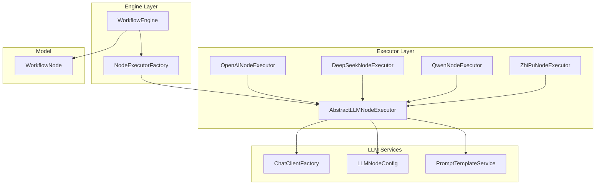
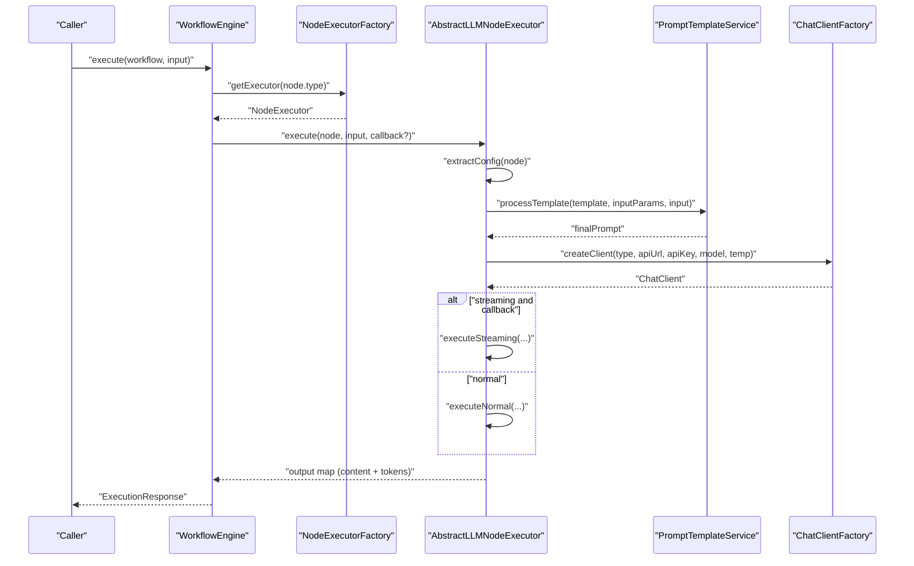
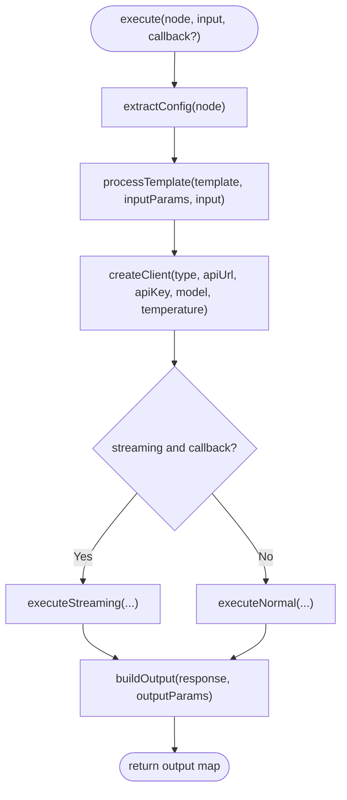
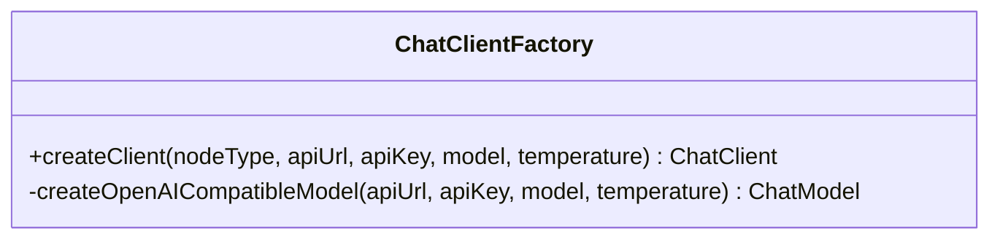
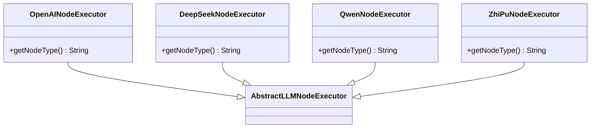
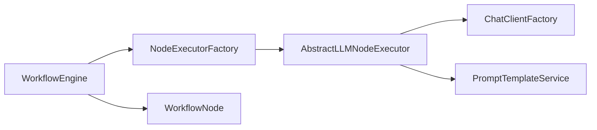

# LLM Provider Integration

<cite>
**Referenced Files in This Document**
- [AbstractLLMNodeExecutor.java](file://backend/src/main/java/com/paiagent/engine/executor/impl/AbstractLLMNodeExecutor.java)
- [OpenAINodeExecutor.java](file://backend/src/main/java/com/paiagent/engine/executor/impl/OpenAINodeExecutor.java)
- [DeepSeekNodeExecutor.java](file://backend/src/main/java/com/paiagent/engine/executor/impl/DeepSeekNodeExecutor.java)
- [QwenNodeExecutor.java](file://backend/src/main/java/com/paiagent/engine/executor/impl/QwenNodeExecutor.java)
- [ZhiPuNodeExecutor.java](file://backend/src/main/java/com/paiagent/engine/executor/impl/ZhiPuNodeExecutor.java)
- [ChatClientFactory.java](file://backend/src/main/java/com/paiagent/engine/llm/ChatClientFactory.java)
- [LLMNodeConfig.java](file://backend/src/main/java/com/paiagent/engine/llm/LLMNodeConfig.java)
- [PromptTemplateService.java](file://backend/src/main/java/com/paiagent/engine/llm/PromptTemplateService.java)
- [NodeExecutor.java](file://backend/src/main/java/com/paiagent/engine/executor/NodeExecutor.java)
- [NodeExecutorFactory.java](file://backend/src/main/java/com/paiagent/engine/executor/NodeExecutorFactory.java)
- [WorkflowNode.java](file://backend/src/main/java/com/paiagent/engine/model/WorkflowNode.java)
- [WorkflowEngine.java](file://backend/src/main/java/com/paiagent/engine/WorkflowEngine.java)
- [application.yml](file://backend/src/main/resources/application.yml)
</cite>

## Table of Contents
1. [Introduction](#introduction)
2. [Project Structure](#project-structure)
3. [Core Components](#core-components)
4. [Architecture Overview](#architecture-overview)
5. [Detailed Component Analysis](#detailed-component-analysis)
6. [Dependency Analysis](#dependency-analysis)
7. [Performance Considerations](#performance-considerations)
8. [Troubleshooting Guide](#troubleshooting-guide)
9. [Conclusion](#conclusion)
10. [Appendices](#appendices)

## Introduction
This document explains how to integrate new Large Language Model (LLM) providers into the PaiAgent system. It focuses on the AbstractLLMNodeExecutor base class architecture and its extension points, including the getNodeType() method, configuration extraction, prompt processing, API integration via ChatClientFactory, response handling, and output formatting. It also provides step-by-step instructions for implementing custom LLM node executors using existing implementations as examples (OpenAI, DeepSeek, Qwen, ZhiPu). Finally, it covers testing strategies and production deployment considerations.

## Project Structure
The LLM integration resides in the backend module under the engine package hierarchy:
- executor/impl: Contains the AbstractLLMNodeExecutor and concrete LLM executors (OpenAI, DeepSeek, Qwen, ZhiPu).
- llm: Contains ChatClientFactory, LLMNodeConfig, and PromptTemplateService.
- model: Contains WorkflowNode used by the execution pipeline.
- engine: Contains WorkflowEngine orchestrating execution and NodeExecutorFactory managing executor instances.

**Diagram sources**
- [WorkflowEngine.java:26-164](file://backend/src/main/java/com/paiagent/engine/WorkflowEngine.java#L26-L164)
- [NodeExecutorFactory.java:14-36](file://backend/src/main/java/com/paiagent/engine/executor/NodeExecutorFactory.java#L14-L36)
- [AbstractLLMNodeExecutor.java:23-231](file://backend/src/main/java/com/paiagent/engine/executor/impl/AbstractLLMNodeExecutor.java#L23-L231)
- [OpenAINodeExecutor.java:10-17](file://backend/src/main/java/com/paiagent/engine/executor/impl/OpenAINodeExecutor.java#L10-L17)
- [DeepSeekNodeExecutor.java:10-17](file://backend/src/main/java/com/paiagent/engine/executor/impl/DeepSeekNodeExecutor.java#L10-L17)
- [QwenNodeExecutor.java:10-17](file://backend/src/main/java/com/paiagent/engine/executor/impl/QwenNodeExecutor.java#L10-L17)
- [ZhiPuNodeExecutor.java:10-17](file://backend/src/main/java/com/paiagent/engine/executor/impl/ZhiPuNodeExecutor.java#L10-L17)
- [ChatClientFactory.java:17-60](file://backend/src/main/java/com/paiagent/engine/llm/ChatClientFactory.java#L17-L60)
- [LLMNodeConfig.java:12-54](file://backend/src/main/java/com/paiagent/engine/llm/LLMNodeConfig.java#L12-L54)
- [PromptTemplateService.java:18-108](file://backend/src/main/java/com/paiagent/engine/llm/PromptTemplateService.java#L18-L108)
- [WorkflowNode.java:10-38](file://backend/src/main/java/com/paiagent/engine/model/WorkflowNode.java#L10-L38)

**Section sources**
- [WorkflowEngine.java:26-164](file://backend/src/main/java/com/paiagent/engine/WorkflowEngine.java#L26-L164)
- [NodeExecutorFactory.java:14-36](file://backend/src/main/java/com/paiagent/engine/executor/NodeExecutorFactory.java#L14-L36)
- [AbstractLLMNodeExecutor.java:23-231](file://backend/src/main/java/com/paiagent/engine/executor/impl/AbstractLLMNodeExecutor.java#L23-L231)

## Core Components
- AbstractLLMNodeExecutor: Provides a unified execution pipeline for LLM nodes, including configuration extraction, prompt templating, ChatClient creation, API invocation (streaming and non-streaming), and output formatting.
- ChatClientFactory: Dynamically creates ChatClient instances compatible with OpenAI-compatible APIs, enabling support for multiple providers (OpenAI, DeepSeek, Qwen, ZhiPu) through a single interface.
- LLMNodeConfig: DTO encapsulating node-level configuration such as API URL, API key, model, temperature, prompt template, input/output parameter mappings, and streaming flag.
- PromptTemplateService: Processes templates by replacing placeholders with values derived from static configuration and upstream node outputs.
- NodeExecutor and NodeExecutorFactory: Define the executor contract and manage registration and retrieval of node executors by type.
- WorkflowNode: Represents a node in the workflow graph with type and data payload containing LLM configuration.
- WorkflowEngine: Orchestrates execution of nodes, wiring inputs/outputs, invoking executors, and emitting execution events.

**Section sources**
- [AbstractLLMNodeExecutor.java:23-231](file://backend/src/main/java/com/paiagent/engine/executor/impl/AbstractLLMNodeExecutor.java#L23-L231)
- [ChatClientFactory.java:17-60](file://backend/src/main/java/com/paiagent/engine/llm/ChatClientFactory.java#L17-L60)
- [LLMNodeConfig.java:12-54](file://backend/src/main/java/com/paiagent/engine/llm/LLMNodeConfig.java#L12-L54)
- [PromptTemplateService.java:18-108](file://backend/src/main/java/com/paiagent/engine/llm/PromptTemplateService.java#L18-L108)
- [NodeExecutor.java:9-18](file://backend/src/main/java/com/paiagent/engine/executor/NodeExecutor.java#L9-L18)
- [NodeExecutorFactory.java:14-36](file://backend/src/main/java/com/paiagent/engine/executor/NodeExecutorFactory.java#L14-L36)
- [WorkflowNode.java:10-38](file://backend/src/main/java/com/paiagent/engine/model/WorkflowNode.java#L10-L38)
- [WorkflowEngine.java:26-164](file://backend/src/main/java/com/paiagent/engine/WorkflowEngine.java#L26-L164)

## Architecture Overview
The LLM integration follows a layered design:
- WorkflowEngine drives execution and delegates node-specific logic to registered NodeExecutors.
- AbstractLLMNodeExecutor centralizes LLM-specific concerns: configuration extraction, prompt processing, client creation, API calls, and output assembly.
- ChatClientFactory abstracts provider differences behind a common OpenAI-compatible ChatClient interface.
- PromptTemplateService decouples prompt construction from provider specifics.

**Diagram sources**
- [WorkflowEngine.java:43-118](file://backend/src/main/java/com/paiagent/engine/WorkflowEngine.java#L43-L118)
- [NodeExecutorFactory.java:28-34](file://backend/src/main/java/com/paiagent/engine/executor/NodeExecutorFactory.java#L28-L34)
- [AbstractLLMNodeExecutor.java:36-89](file://backend/src/main/java/com/paiagent/engine/executor/impl/AbstractLLMNodeExecutor.java#L36-L89)
- [PromptTemplateService.java:30-43](file://backend/src/main/java/com/paiagent/engine/llm/PromptTemplateService.java#L30-L43)
- [ChatClientFactory.java:29-40](file://backend/src/main/java/com/paiagent/engine/llm/ChatClientFactory.java#L29-L40)

## Detailed Component Analysis

### AbstractLLMNodeExecutor
Key responsibilities:
- Enforce a provider-agnostic execution flow via a protected getNodeType() method.
- Extract configuration from WorkflowNode.data into LLMNodeConfig.
- Process prompts using PromptTemplateService.
- Create ChatClient via ChatClientFactory.
- Support normal and streaming LLM calls, capturing token usage when available.
- Build standardized output maps with content and token metrics.

Extension points:
- getNodeType(): Return a unique string identifier for the provider (e.g., "openai", "deepseek", "qwen", "zhipu").
- extractConfig(): Override to add provider-specific fields if needed (default handles standard fields).
- buildOutput(): Override to customize output shape (default emits a flat map with content and token fields).

Execution flow highlights:
- Normal call path captures token usage from response metadata.
- Streaming call path accumulates chunks and emits progress events but does not capture token usage.
- Logging statements provide visibility into configuration, prompt, and response statistics.

**Diagram sources**
- [AbstractLLMNodeExecutor.java:36-89](file://backend/src/main/java/com/paiagent/engine/executor/impl/AbstractLLMNodeExecutor.java#L36-L89)
- [AbstractLLMNodeExecutor.java:116-168](file://backend/src/main/java/com/paiagent/engine/executor/impl/AbstractLLMNodeExecutor.java#L116-L168)
- [AbstractLLMNodeExecutor.java:195-217](file://backend/src/main/java/com/paiagent/engine/executor/impl/AbstractLLMNodeExecutor.java#L195-L217)

**Section sources**
- [AbstractLLMNodeExecutor.java:23-231](file://backend/src/main/java/com/paiagent/engine/executor/impl/AbstractLLMNodeExecutor.java#L23-L231)

### ChatClientFactory
Purpose:
- Create ChatClient instances dynamically based on node type and configuration.
- Supports OpenAI-compatible providers by constructing OpenAiApi with a custom base URL and OpenAiChatOptions.

Integration pattern:
- Node type determines which provider family to instantiate.
- For OpenAI-compatible providers, pass apiUrl, apiKey, model, and temperature to the OpenAI-compatible ChatModel.

**Diagram sources**
- [ChatClientFactory.java:17-60](file://backend/src/main/java/com/paiagent/engine/llm/ChatClientFactory.java#L17-L60)

**Section sources**
- [ChatClientFactory.java:17-60](file://backend/src/main/java/com/paiagent/engine/llm/ChatClientFactory.java#L17-L60)

### LLMNodeConfig
Fields:
- apiUrl, apiKey, model, temperature, promptTemplate, inputParams, outputParams, streaming.

Usage:
- Parsed from WorkflowNode.data by AbstractLLMNodeExecutor.extractConfig().
- Passed to ChatClientFactory and used by PromptTemplateService.

**Section sources**
- [LLMNodeConfig.java:12-54](file://backend/src/main/java/com/paiagent/engine/llm/LLMNodeConfig.java#L12-L54)
- [AbstractLLMNodeExecutor.java:174-190](file://backend/src/main/java/com/paiagent/engine/executor/impl/AbstractLLMNodeExecutor.java#L174-L190)

### PromptTemplateService
Responsibilities:
- Replace {{variable}} placeholders in prompt templates with values from inputParams and runtime input.
- Support two parameter types:
  - input: static values from configuration.
  - reference: dynamic values from upstream node outputs, with a fallback for "user_input" to "input".

Behavior:
- Builds a paramValues map and substitutes all template variables.
- Handles missing references gracefully by leaving placeholders empty.

**Section sources**
- [PromptTemplateService.java:18-108](file://backend/src/main/java/com/paiagent/engine/llm/PromptTemplateService.java#L18-L108)

### Existing LLM Executors (Examples)
- OpenAINodeExecutor: Returns "openai" as the node type.
- DeepSeekNodeExecutor: Returns "deepseek" as the node type.
- QwenNodeExecutor: Returns "qwen" as the node type.
- ZhiPuNodeExecutor: Returns "zhipu" as the node type.

These minimal implementations rely entirely on AbstractLLMNodeExecutor for configuration, prompt processing, client creation, and response handling.

**Diagram sources**
- [AbstractLLMNodeExecutor.java:23-231](file://backend/src/main/java/com/paiagent/engine/executor/impl/AbstractLLMNodeExecutor.java#L23-L231)
- [OpenAINodeExecutor.java:10-17](file://backend/src/main/java/com/paiagent/engine/executor/impl/OpenAINodeExecutor.java#L10-L17)
- [DeepSeekNodeExecutor.java:10-17](file://backend/src/main/java/com/paiagent/engine/executor/impl/DeepSeekNodeExecutor.java#L10-L17)
- [QwenNodeExecutor.java:10-17](file://backend/src/main/java/com/paiagent/engine/executor/impl/QwenNodeExecutor.java#L10-L17)
- [ZhiPuNodeExecutor.java:10-17](file://backend/src/main/java/com/paiagent/engine/executor/impl/ZhiPuNodeExecutor.java#L10-L17)

**Section sources**
- [OpenAINodeExecutor.java:10-17](file://backend/src/main/java/com/paiagent/engine/executor/impl/OpenAINodeExecutor.java#L10-L17)
- [DeepSeekNodeExecutor.java:10-17](file://backend/src/main/java/com/paiagent/engine/executor/impl/DeepSeekNodeExecutor.java#L10-L17)
- [QwenNodeExecutor.java:10-17](file://backend/src/main/java/com/paiagent/engine/executor/impl/QwenNodeExecutor.java#L10-L17)
- [ZhiPuNodeExecutor.java:10-17](file://backend/src/main/java/com/paiagent/engine/executor/impl/ZhiPuNodeExecutor.java#L10-L17)

### NodeExecutor and NodeExecutorFactory
- NodeExecutor defines the contract for node execution and declares getSupportedNodeType().
- NodeExecutorFactory registers all NodeExecutor beans and maps them by type for lookup during execution.

**Section sources**
- [NodeExecutor.java:9-18](file://backend/src/main/java/com/paiagent/engine/executor/NodeExecutor.java#L9-L18)
- [NodeExecutorFactory.java:14-36](file://backend/src/main/java/com/paiagent/engine/executor/NodeExecutorFactory.java#L14-L36)

### WorkflowNode
- Holds node metadata (id, type, position) and the data payload containing LLM configuration and parameters.

**Section sources**
- [WorkflowNode.java:10-38](file://backend/src/main/java/com/paiagent/engine/model/WorkflowNode.java#L10-L38)

### WorkflowEngine
- Parses workflow configuration, executes nodes in topological order, and manages execution events.
- Uses NodeExecutorFactory to resolve the appropriate executor per node type.

**Section sources**
- [WorkflowEngine.java:26-164](file://backend/src/main/java/com/paiagent/engine/WorkflowEngine.java#L26-L164)

## Step-by-Step: Adding a New LLM Provider

### Step 1: Create the Executor Class
- Create a new class extending AbstractLLMNodeExecutor.
- Implement getNodeType() to return a unique provider identifier (e.g., "ollama", "groq").
- Keep the constructor default so Spring can instantiate it as a @Component.

Implementation location:
- Place the new executor under backend/src/main/java/com/paiagent/engine/executor/impl/.

**Section sources**
- [AbstractLLMNodeExecutor.java:23-231](file://backend/src/main/java/com/paiagent/engine/executor/impl/AbstractLLMNodeExecutor.java#L23-L231)

### Step 2: Configure ChatClientFactory (if needed)
- ChatClientFactory supports "openai", "deepseek", "qwen" via OpenAI-compatible mode.
- If your provider requires a different client, extend ChatClientFactory to handle your node type similarly to how it handles the supported types.

Reference:
- [ChatClientFactory.java:34-37](file://backend/src/main/java/com/paiagent/engine/llm/ChatClientFactory.java#L34-L37)

**Section sources**
- [ChatClientFactory.java:17-60](file://backend/src/main/java/com/paiagent/engine/llm/ChatClientFactory.java#L17-L60)

### Step 3: Prepare Node Configuration
- Ensure the node’s data payload includes:
  - apiUrl: Base URL for the provider API.
  - apiKey: Authentication key.
  - model: Target model name.
  - temperature: Sampling temperature.
  - prompt: Template string with {{variable}} placeholders.
  - inputParams: Parameter mapping list supporting "input" and "reference".
  - outputParams: Optional list specifying output field names.
  - streaming: Boolean to enable streaming with progress callbacks.

Validation:
- AbstractLLMNodeExecutor.extractConfig() expects these keys; missing keys are handled with defaults.

**Section sources**
- [LLMNodeConfig.java:12-54](file://backend/src/main/java/com/paiagent/engine/llm/LLMNodeConfig.java#L12-L54)
- [AbstractLLMNodeExecutor.java:174-190](file://backend/src/main/java/com/paiagent/engine/executor/impl/AbstractLLMNodeExecutor.java#L174-L190)

### Step 4: Prompt Processing
- Use PromptTemplateService to substitute {{variable}} placeholders.
- inputParams supports:
  - type=input: static value from configuration.
  - type=reference: dynamic value from upstream node outputs (with fallback for "user_input").

**Section sources**
- [PromptTemplateService.java:30-43](file://backend/src/main/java/com/paiagent/engine/llm/PromptTemplateService.java#L30-L43)
- [PromptTemplateService.java:51-90](file://backend/src/main/java/com/paiagent/engine/llm/PromptTemplateService.java#L51-L90)

### Step 5: API Integration Patterns
- ChatClientFactory.createClient() constructs an OpenAI-compatible ChatClient when nodeType matches supported families.
- For OpenAI-compatible providers, pass apiUrl, apiKey, model, and temperature to the OpenAI ChatModel.

**Section sources**
- [ChatClientFactory.java:29-40](file://backend/src/main/java/com/paiagent/engine/llm/ChatClientFactory.java#L29-L40)
- [ChatClientFactory.java:46-58](file://backend/src/main/java/com/paiagent/engine/llm/ChatClientFactory.java#L46-L58)

### Step 6: Response Handling and Output Formatting
- Normal calls capture token usage from response metadata.
- Streaming calls accumulate chunks and emit progress events; token usage is not captured.
- Output map includes content and token fields (inputTokens, outputTokens, totalTokens, tokens).

**Section sources**
- [AbstractLLMNodeExecutor.java:116-138](file://backend/src/main/java/com/paiagent/engine/executor/impl/AbstractLLMNodeExecutor.java#L116-L138)
- [AbstractLLMNodeExecutor.java:143-168](file://backend/src/main/java/com/paiagent/engine/executor/impl/AbstractLLMNodeExecutor.java#L143-L168)
- [AbstractLLMNodeExecutor.java:195-217](file://backend/src/main/java/com/paiagent/engine/executor/impl/AbstractLLMNodeExecutor.java#L195-L217)

### Step 7: Authentication Setup
- API key is passed to ChatClientFactory and used by the underlying OpenAI-compatible client.
- application.yml contains a placeholder for OPENAI_API_KEY; for other providers, supply apiKey via node configuration.

**Section sources**
- [application.yml:15-19](file://backend/src/main/resources/application.yml#L15-L19)
- [ChatClientFactory.java:49](file://backend/src/main/java/com/paiagent/engine/llm/ChatClientFactory.java#L49)

### Step 8: Testing Strategies
- Unit tests for AbstractLLMNodeExecutor:
  - Mock ChatClientFactory to return a stub ChatClient.
  - Mock PromptTemplateService to return a fixed prompt.
  - Verify execute() produces expected output map with content and token fields.
- Integration tests for the new executor:
  - Wire up the executor with NodeExecutorFactory.
  - Run a small workflow with a single LLM node and assert execution events and final output.
- Edge case coverage:
  - Empty prompt template.
  - Missing upstream references (ensure graceful handling).
  - Streaming vs non-streaming modes.
  - Missing token metadata in streaming mode.

[No sources needed since this section provides general guidance]

### Step 9: Production Deployment Considerations
- Environment variables:
  - Store API keys securely (avoid hardcoding).
  - Consider secrets management systems.
- Observability:
  - Enable structured logging for configuration, prompts, and responses.
  - Expose metrics for token usage and latency.
- Reliability:
  - Add retry/backoff for transient failures.
  - Implement timeouts for API calls.
- Security:
  - Validate and sanitize prompt inputs.
  - Restrict node types to approved providers.
- Configuration:
  - Provide sensible defaults for temperature and model.
  - Allow per-node overrides via node data.

[No sources needed since this section provides general guidance]

## Dependency Analysis
The LLM integration exhibits low coupling and high cohesion:
- AbstractLLMNodeExecutor depends on ChatClientFactory and PromptTemplateService.
- NodeExecutorFactory depends on Spring’s bean discovery to register executors.
- WorkflowEngine depends on NodeExecutorFactory and WorkflowNode.

**Diagram sources**
- [AbstractLLMNodeExecutor.java:25-29](file://backend/src/main/java/com/paiagent/engine/executor/impl/AbstractLLMNodeExecutor.java#L25-L29)
- [NodeExecutorFactory.java:18-23](file://backend/src/main/java/com/paiagent/engine/executor/NodeExecutorFactory.java#L18-L23)
- [WorkflowEngine.java:29-32](file://backend/src/main/java/com/paiagent/engine/WorkflowEngine.java#L29-L32)

**Section sources**
- [AbstractLLMNodeExecutor.java:23-231](file://backend/src/main/java/com/paiagent/engine/executor/impl/AbstractLLMNodeExecutor.java#L23-L231)
- [NodeExecutorFactory.java:14-36](file://backend/src/main/java/com/paiagent/engine/executor/NodeExecutorFactory.java#L14-L36)
- [WorkflowEngine.java:26-164](file://backend/src/main/java/com/paiagent/engine/WorkflowEngine.java#L26-L164)

## Performance Considerations
- Streaming vs Non-streaming:
  - Streaming reduces perceived latency and enables real-time progress updates but does not provide token usage metadata.
  - Non-streaming captures token usage for billing and analytics.
- Prompt complexity:
  - Keep prompt templates concise and parameterized to minimize token overhead.
- Token limits:
  - Monitor inputTokens and outputTokens to avoid exceeding provider limits.
- Concurrency:
  - Ensure ChatClientFactory and downstream services can handle concurrent requests.

[No sources needed since this section provides general guidance]

## Troubleshooting Guide
Common issues and resolutions:
- Unsupported node type:
  - Symptom: IllegalArgumentException from ChatClientFactory or runtime error from NodeExecutorFactory.
  - Resolution: Ensure getNodeType() returns a supported type or extend ChatClientFactory to support the new provider.
- Missing API key or invalid URL:
  - Symptom: Exceptions during ChatClient creation or API calls.
  - Resolution: Verify node configuration and environment variables.
- Streaming progress not received:
  - Symptom: No incremental updates.
  - Resolution: Confirm streaming is enabled and a progress callback is provided.
- Missing token usage:
  - Symptom: Tokens fields absent or zero.
  - Resolution: Streaming mode does not report tokens; switch to non-streaming if token usage is required.

**Section sources**
- [ChatClientFactory.java:34-37](file://backend/src/main/java/com/paiagent/engine/llm/ChatClientFactory.java#L34-L37)
- [NodeExecutorFactory.java:28-34](file://backend/src/main/java/com/paiagent/engine/executor/NodeExecutorFactory.java#L28-L34)
- [AbstractLLMNodeExecutor.java:143-168](file://backend/src/main/java/com/paiagent/engine/executor/impl/AbstractLLMNodeExecutor.java#L143-L168)

## Conclusion
By extending AbstractLLMNodeExecutor and ensuring ChatClientFactory supports the new provider type, integrating additional LLM providers into the PaiAgent system is straightforward. The design emphasizes separation of concerns, testability, and observability, enabling rapid iteration and reliable production deployments.

## Appendices

### Appendix A: Example Node Data Payload
- Required fields:
  - apiUrl, apiKey, model, temperature, prompt, inputParams, outputParams?, streaming?
- Example structure:
  - apiUrl: "https://api.example.com/v1"
  - apiKey: "sk-...your-api-key..."
  - model: "gpt-4-turbo"
  - temperature: 0.7
  - prompt: "Summarize: {{input}}"
  - inputParams:
    - name: "input", type: "reference", referenceNode: "upstream_node.output"
  - outputParams:
    - name: "summary"
  - streaming: true

**Section sources**
- [LLMNodeConfig.java:12-54](file://backend/src/main/java/com/paiagent/engine/llm/LLMNodeConfig.java#L12-L54)
- [PromptTemplateService.java:51-90](file://backend/src/main/java/com/paiagent/engine/llm/PromptTemplateService.java#L51-L90)