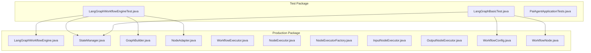
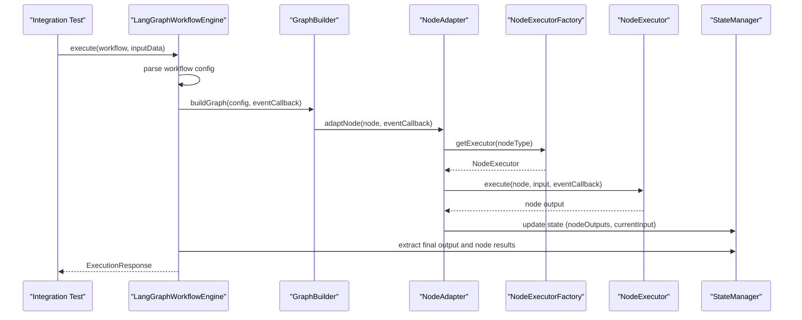
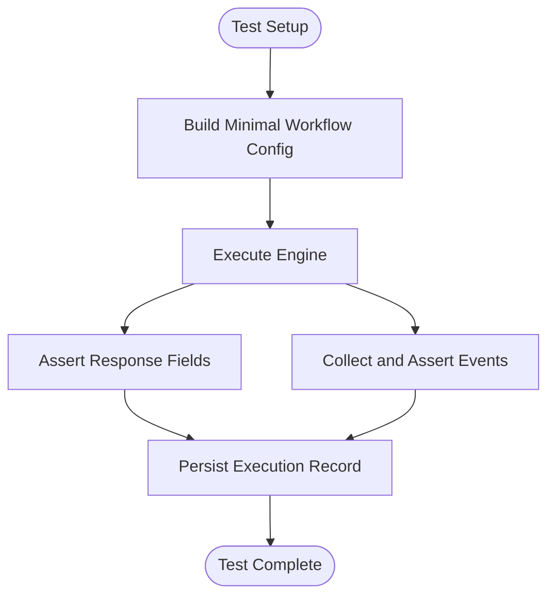
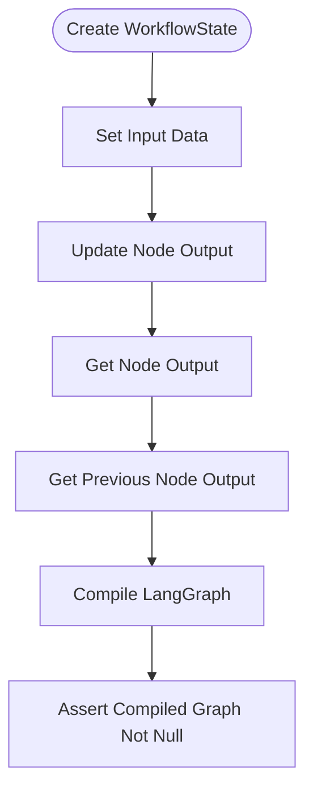
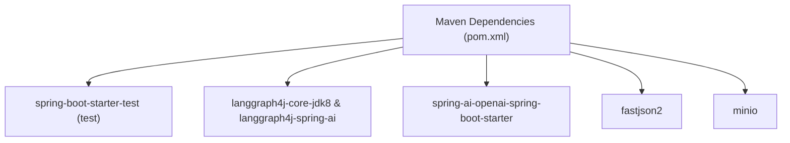

# Testing Strategy

<cite>
**Referenced Files in This Document**
- [LangGraphWorkflowEngineTest.java](file://backend/src/test/java/com/paiagent/engine/langgraph/LangGraphWorkflowEngineTest.java)
- [LangGraphBasicTest.java](file://backend/src/test/java/com/paiagent/engine/langgraph/LangGraphBasicTest.java)
- [PaiAgentApplicationTests.java](file://backend/src/test/java/com/paiagent/PaiAgentApplicationTests.java)
- [pom.xml](file://backend/pom.xml)
- [LangGraphWorkflowEngine.java](file://backend/src/main/java/com/paiagent/engine/langgraph/LangGraphWorkflowEngine.java)
- [StateManager.java](file://backend/src/main/java/com/paiagent/engine/langgraph/state/StateManager.java)
- [GraphBuilder.java](file://backend/src/main/java/com/paiagent/engine/langgraph/builder/GraphBuilder.java)
- [NodeAdapter.java](file://backend/src/main/java/com/paiagent/engine/langgraph/adapter/NodeAdapter.java)
- [WorkflowExecutor.java](file://backend/src/main/java/com/paiagent/engine/WorkflowExecutor.java)
- [NodeExecutor.java](file://backend/src/main/java/com/paiagent/engine/executor/NodeExecutor.java)
- [NodeExecutorFactory.java](file://backend/src/main/java/com/paiagent/engine/executor/NodeExecutorFactory.java)
- [InputNodeExecutor.java](file://backend/src/main/java/com/paiagent/engine/executor/impl/InputNodeExecutor.java)
- [OutputNodeExecutor.java](file://backend/src/main/java/com/paiagent/engine/executor/impl/OutputNodeExecutor.java)
- [WorkflowConfig.java](file://backend/src/main/java/com/paiagent/engine/model/WorkflowConfig.java)
- [WorkflowNode.java](file://backend/src/main/java/com/paiagent/engine/model/WorkflowNode.java)
</cite>

## Table of Contents
1. [Introduction](#introduction)
2. [Project Structure](#project-structure)
3. [Core Components](#core-components)
4. [Architecture Overview](#architecture-overview)
5. [Detailed Component Analysis](#detailed-component-analysis)
6. [Dependency Analysis](#dependency-analysis)
7. [Performance Considerations](#performance-considerations)
8. [Troubleshooting Guide](#troubleshooting-guide)
9. [Conclusion](#conclusion)
10. [Appendices](#appendices)

## Introduction
This document defines a comprehensive testing strategy for the backend workflow engine, focusing on unit testing, integration testing, and test data management. It documents the existing test structure centered around LangGraphWorkflowEngineTest and LangGraphBasicTest, explains testing methodologies for workflow execution, node execution, and state management, and provides guidelines for mocking external dependencies (such as LLM providers), configuring test environments, writing effective tests, continuous integration testing, coverage requirements, and automated workflows.

## Project Structure
The backend module organizes tests under a dedicated package mirroring the production code structure. Tests are primarily Spring Boot integration tests that leverage the application context to validate end-to-end behavior of the workflow engine and its components.

**Diagram sources**
- [LangGraphWorkflowEngineTest.java](file://backend/src/test/java/com/paiagent/engine/langgraph/LangGraphWorkflowEngineTest.java)
- [LangGraphBasicTest.java](file://backend/src/test/java/com/paiagent/engine/langgraph/LangGraphBasicTest.java)
- [PaiAgentApplicationTests.java](file://backend/src/test/java/com/paiagent/PaiAgentApplicationTests.java)
- [LangGraphWorkflowEngine.java](file://backend/src/main/java/com/paiagent/engine/langgraph/LangGraphWorkflowEngine.java)
- [StateManager.java](file://backend/src/main/java/com/paiagent/engine/langgraph/state/StateManager.java)
- [GraphBuilder.java](file://backend/src/main/java/com/paiagent/engine/langgraph/builder/GraphBuilder.java)
- [NodeAdapter.java](file://backend/src/main/java/com/paiagent/engine/langgraph/adapter/NodeAdapter.java)
- [WorkflowExecutor.java](file://backend/src/main/java/com/paiagent/engine/WorkflowExecutor.java)
- [NodeExecutor.java](file://backend/src/main/java/com/paiagent/engine/executor/NodeExecutor.java)
- [NodeExecutorFactory.java](file://backend/src/main/java/com/paiagent/engine/executor/NodeExecutorFactory.java)
- [InputNodeExecutor.java](file://backend/src/main/java/com/paiagent/engine/executor/impl/InputNodeExecutor.java)
- [OutputNodeExecutor.java](file://backend/src/main/java/com/paiagent/engine/executor/impl/OutputNodeExecutor.java)
- [WorkflowConfig.java](file://backend/src/main/java/com/paiagent/engine/model/WorkflowConfig.java)
- [WorkflowNode.java](file://backend/src/main/java/com/paiagent/engine/model/WorkflowNode.java)

**Section sources**
- [LangGraphWorkflowEngineTest.java](file://backend/src/test/java/com/paiagent/engine/langgraph/LangGraphWorkflowEngineTest.java)
- [LangGraphBasicTest.java](file://backend/src/test/java/com/paiagent/engine/langgraph/LangGraphBasicTest.java)
- [PaiAgentApplicationTests.java](file://backend/src/test/java/com/paiagent/PaiAgentApplicationTests.java)

## Core Components
This section outlines the primary components under test and their roles in the testing strategy.

- WorkflowExecutor interface: Defines the contract for workflow execution, enabling pluggable engines (e.g., LangGraph vs DAG).
- LangGraphWorkflowEngine: Implements the LangGraph-based engine, orchestrating graph building, state initialization, execution, and result extraction.
- StateManager: Manages state initialization, updates, and extraction for workflow execution.
- GraphBuilder: Translates workflow configuration into a compiled LangGraph.
- NodeAdapter: Bridges NodeExecutors to LangGraph actions, handling state transitions and event callbacks.
- NodeExecutorFactory: Provides NodeExecutors by type, enabling polymorphic node execution.
- NodeExecutors (InputNodeExecutor, OutputNodeExecutor): Implement specific node behaviors for input and output nodes.

Key testing focus areas:
- Workflow execution end-to-end validation via LangGraphWorkflowEngineTest.
- State management correctness via LangGraphBasicTest.
- Event callback propagation and execution metrics.
- Node execution behavior and output templating.

**Section sources**
- [WorkflowExecutor.java](file://backend/src/main/java/com/paiagent/engine/WorkflowExecutor.java)
- [LangGraphWorkflowEngine.java](file://backend/src/main/java/com/paiagent/engine/langgraph/LangGraphWorkflowEngine.java)
- [StateManager.java](file://backend/src/main/java/com/paiagent/engine/langgraph/state/StateManager.java)
- [GraphBuilder.java](file://backend/src/main/java/com/paiagent/engine/langgraph/builder/GraphBuilder.java)
- [NodeAdapter.java](file://backend/src/main/java/com/paiagent/engine/langgraph/adapter/NodeAdapter.java)
- [NodeExecutorFactory.java](file://backend/src/main/java/com/paiagent/engine/executor/NodeExecutorFactory.java)
- [NodeExecutor.java](file://backend/src/main/java/com/paiagent/engine/executor/NodeExecutor.java)
- [InputNodeExecutor.java](file://backend/src/main/java/com/paiagent/engine/executor/impl/InputNodeExecutor.java)
- [OutputNodeExecutor.java](file://backend/src/main/java/com/paiagent/engine/executor/impl/OutputNodeExecutor.java)

## Architecture Overview
The testing architecture leverages Spring Boot’s test slices to validate integration between the workflow engine, state management, graph builder, and node adapters. The sequence below reflects the typical execution path validated by integration tests.

**Diagram sources**
- [LangGraphWorkflowEngine.java](file://backend/src/main/java/com/paiagent/engine/langgraph/LangGraphWorkflowEngine.java)
- [GraphBuilder.java](file://backend/src/main/java/com/paiagent/engine/langgraph/builder/GraphBuilder.java)
- [NodeAdapter.java](file://backend/src/main/java/com/paiagent/engine/langgraph/adapter/NodeAdapter.java)
- [NodeExecutorFactory.java](file://backend/src/main/java/com/paiagent/engine/executor/NodeExecutorFactory.java)
- [NodeExecutor.java](file://backend/src/main/java/com/paiagent/engine/executor/NodeExecutor.java)
- [StateManager.java](file://backend/src/main/java/com/paiagent/engine/langgraph/state/StateManager.java)

## Detailed Component Analysis

### LangGraphWorkflowEngineTest
This integration test validates end-to-end workflow execution, event callbacks, and multi-node scenarios. It demonstrates:
- Engine type identification.
- Simple workflow execution with input and output nodes.
- Multi-node workflow execution.
- Callback-driven event emission and verification.

Recommended testing patterns derived from this suite:
- Use Spring Boot test slices (@SpringBootTest) to load the application context.
- Construct minimal workflow configurations programmatically for repeatability.
- Assert response shape, status, duration, and presence of execution identifiers.
- Verify event callback emissions for workflow and node lifecycle events.

**Diagram sources**
- [LangGraphWorkflowEngineTest.java](file://backend/src/test/java/com/paiagent/engine/langgraph/LangGraphWorkflowEngineTest.java)
- [LangGraphWorkflowEngine.java](file://backend/src/main/java/com/paiagent/engine/langgraph/LangGraphWorkflowEngine.java)

**Section sources**
- [LangGraphWorkflowEngineTest.java](file://backend/src/test/java/com/paiagent/engine/langgraph/LangGraphWorkflowEngineTest.java)

### LangGraphBasicTest
This test validates foundational state and LangGraph4j integration:
- WorkflowState creation and mutation.
- Node output updates and retrieval.
- Previous node output access.
- LangGraph dependency compilation and basic graph construction.

Testing methodology:
- Instantiate state objects and assert initial conditions.
- Exercise state update APIs and verify retrievals.
- Validate LangGraph dependency availability and graph compilation.

**Diagram sources**
- [LangGraphBasicTest.java](file://backend/src/test/java/com/paiagent/engine/langgraph/LangGraphBasicTest.java)
- [StateManager.java](file://backend/src/main/java/com/paiagent/engine/langgraph/state/StateManager.java)

**Section sources**
- [LangGraphBasicTest.java](file://backend/src/test/java/com/paiagent/engine/langgraph/LangGraphBasicTest.java)

### Unit Testing Patterns for Node Executors
Unit tests should validate:
- InputNodeExecutor: returns input unchanged.
- OutputNodeExecutor: applies templates, resolves references, and produces deterministic outputs.

Guidelines:
- Mock or stub NodeExecutorFactory to return controlled executors.
- Use small, isolated test cases for template parsing and parameter resolution.
- Validate error paths (missing references, invalid templates) without relying on external systems.

**Section sources**
- [InputNodeExecutor.java](file://backend/src/main/java/com/paiagent/engine/executor/impl/InputNodeExecutor.java)
- [OutputNodeExecutor.java](file://backend/src/main/java/com/paiagent/engine/executor/impl/OutputNodeExecutor.java)
- [NodeExecutor.java](file://backend/src/main/java/com/paiagent/engine/executor/NodeExecutor.java)
- [NodeExecutorFactory.java](file://backend/src/main/java/com/paiagent/engine/executor/NodeExecutorFactory.java)

### State Management Testing
Focus areas:
- State initialization with input data and metadata.
- Extraction of final output and node results.
- Success/failure detection and error message propagation.
- Conversion from LangGraph state to internal WorkflowState representation.

Testing approach:
- Initialize state and assert baseline fields.
- Simulate node outputs and verify aggregation.
- Extract final output and node results, asserting shapes and content.

**Section sources**
- [StateManager.java](file://backend/src/main/java/com/paiagent/engine/langgraph/state/StateManager.java)

### Graph Building and Node Adaptation Testing
Validation points:
- GraphBuilder translates nodes and edges into a compiled graph.
- NodeAdapter adapts executors to async actions, manages state updates, and emits events.
- Entry/exit detection logic handles missing or ambiguous boundaries gracefully.

Testing approach:
- Provide minimal node and edge sets; assert graph compilation succeeds.
- Inject event callbacks and verify emissions during adaptation and execution.
- Validate fallback behavior when explicit entry/exit nodes are absent.

**Section sources**
- [GraphBuilder.java](file://backend/src/main/java/com/paiagent/engine/langgraph/builder/GraphBuilder.java)
- [NodeAdapter.java](file://backend/src/main/java/com/paiagent/engine/langgraph/adapter/NodeAdapter.java)

## Dependency Analysis
The testing strategy relies on Maven dependencies declared for Spring Boot, MyBatis Plus, OpenAI/Spring AI, LangGraph4j, and test scopes. These dependencies enable:
- Application context bootstrapping for integration tests.
- LLM provider integrations (OpenAI-compatible) for node execution.
- LangGraph4j runtime for state graph execution.

**Diagram sources**
- [pom.xml](file://backend/pom.xml)

**Section sources**
- [pom.xml](file://backend/pom.xml)

## Performance Considerations
- Execution timing: Integration tests assert non-zero duration; use this to detect regressions.
- Event throughput: Callback-based tests help measure event volume per workflow.
- State growth: Monitor nodeOutputs accumulation and final output extraction costs.
- External provider latency: While tests avoid real LLM calls, ensure mocks simulate realistic latencies for performance profiling.

## Troubleshooting Guide
Common issues and resolutions:
- Missing engine type: Validate engine type assertion in integration tests.
- Empty execution results: Confirm graph compilation succeeded and entry/exit nodes are properly configured.
- Event callback failures: Ensure eventCallback is non-null and registered during execution.
- Node execution errors: Inspect error messages propagated via state and verify factory lookup for node types.
- Template rendering failures: Validate outputParams and reference patterns in output nodes.

**Section sources**
- [LangGraphWorkflowEngineTest.java](file://backend/src/test/java/com/paiagent/engine/langgraph/LangGraphWorkflowEngineTest.java)
- [LangGraphWorkflowEngine.java](file://backend/src/main/java/com/paiagent/engine/langgraph/LangGraphWorkflowEngine.java)
- [NodeAdapter.java](file://backend/src/main/java/com/paiagent/engine/langgraph/adapter/NodeAdapter.java)

## Conclusion
The existing test suite establishes a solid foundation for validating the LangGraph-based workflow engine. By expanding unit tests for node executors, enhancing state management assertions, and introducing performance and edge-case tests, the project can achieve robust quality assurance. Continuous integration should enforce test execution, coverage thresholds, and pre-deploy validation.

## Appendices

### Test Data Management Guidelines
- Reuse workflow builders to construct minimal, deterministic test cases.
- Parameterize inputs and expected outputs to increase coverage breadth.
- Persist execution records during tests to validate persistence and retrieval paths.
- Use consistent naming for workflows and nodes to simplify debugging.

### Mocking External Dependencies (LLM Providers)
- Prefer Spring-managed mocks for NodeExecutorFactory to return deterministic executors.
- Replace OpenAI/Spring AI integrations with lightweight stubs that simulate provider responses and errors.
- Isolate network-dependent behavior behind interfaces to facilitate mocking.

### Test Environment Configuration
- Use Spring profiles to switch between test and production configurations.
- Configure embedded databases or test containers for persistence tests.
- Control logging levels to reduce noise while preserving diagnostic information.

### Writing Effective Tests
- Unit tests: Small, focused, deterministic; mock collaborators; assert outcomes and side effects.
- Integration tests: Validate end-to-end flows; use programmatic workflow construction; assert response shape and execution metrics.
- Performance tests: Measure execution time, memory footprint, and event throughput; simulate realistic workloads.

### Continuous Integration and Coverage
- Enforce test execution in CI pipelines with Maven Surefire/Failsafe plugins.
- Integrate code coverage tools to track statement and branch coverage; set minimum thresholds.
- Automate artifact publishing and vulnerability scanning alongside test runs.