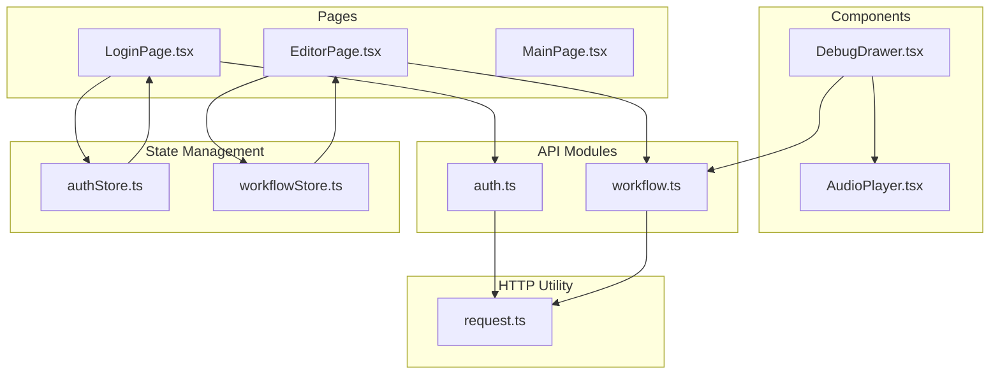
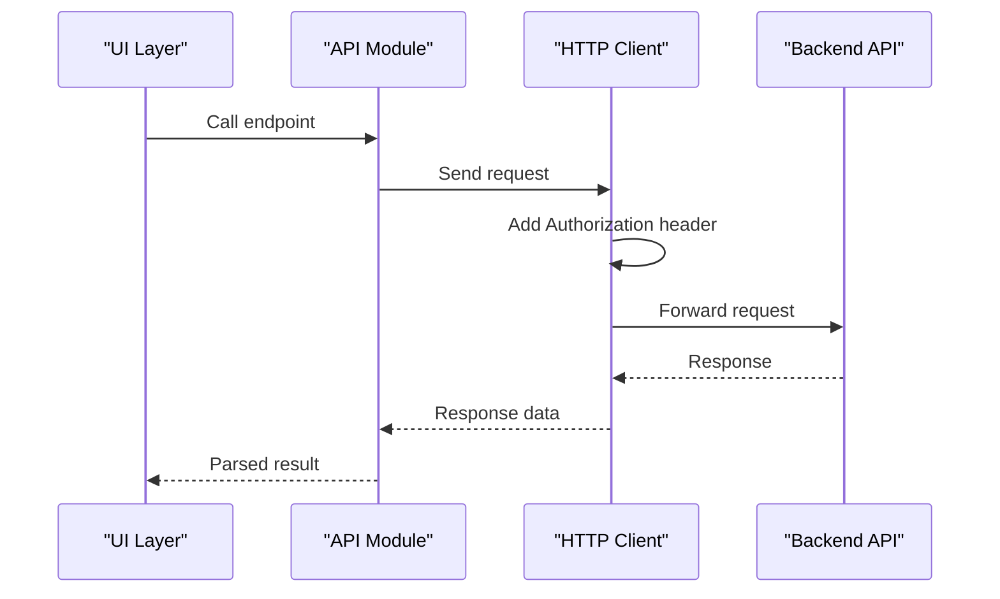
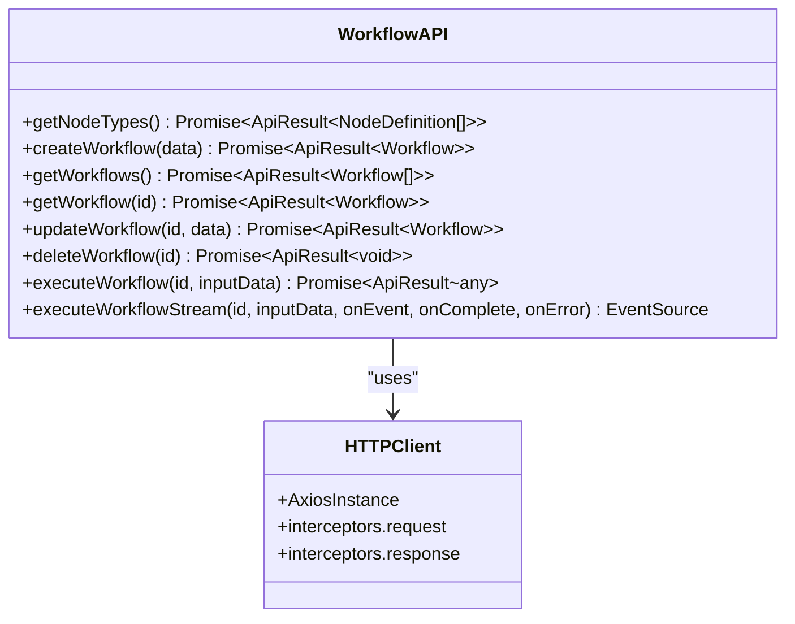
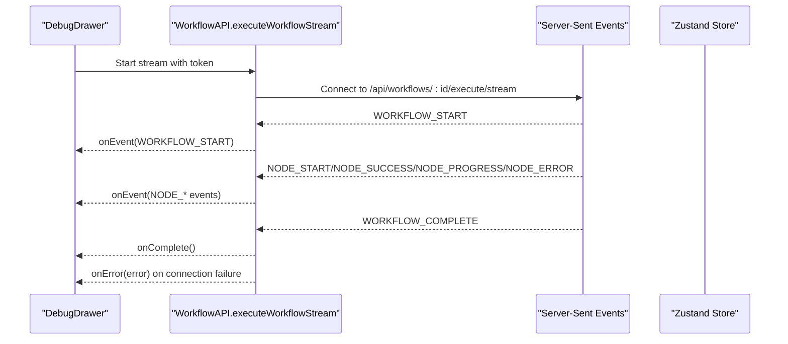
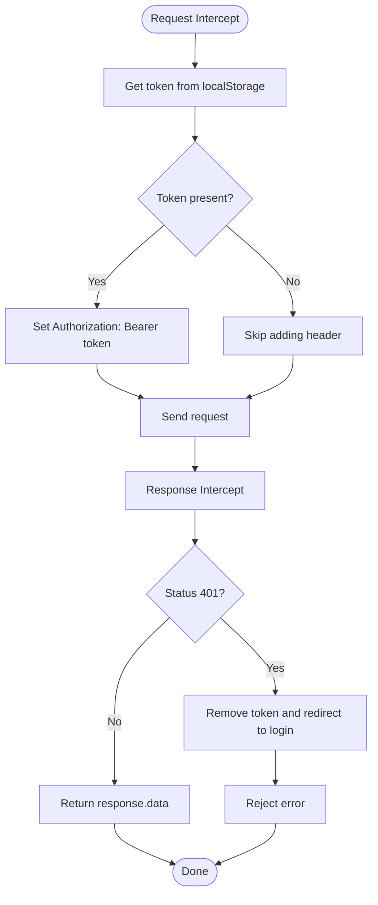
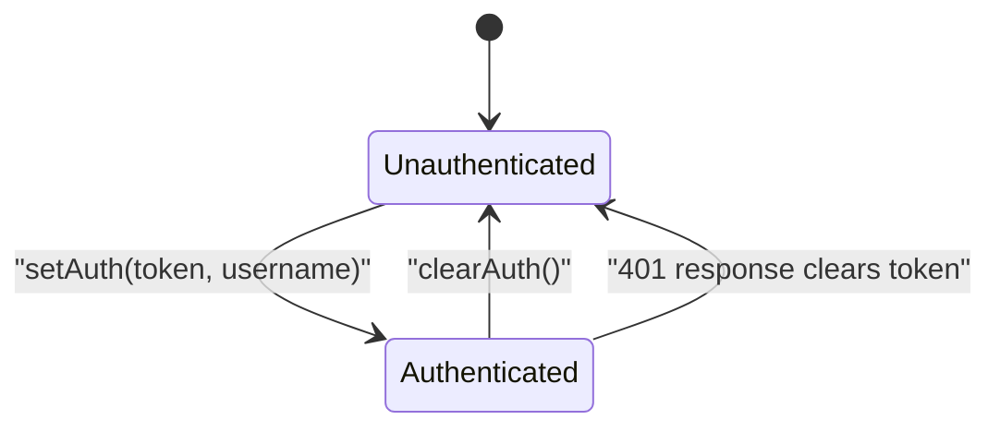
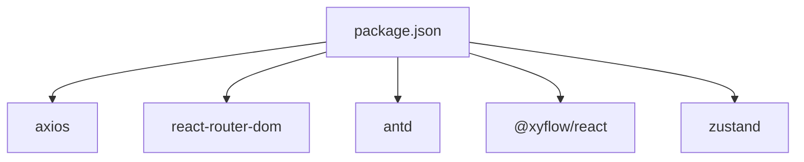

# API Integration

<cite>
**Referenced Files in This Document**
- [auth.ts](file://frontend/src/api/auth.ts)
- [workflow.ts](file://frontend/src/api/workflow.ts)
- [request.ts](file://frontend/src/utils/request.ts)
- [authStore.ts](file://frontend/src/store/authStore.ts)
- [workflowStore.ts](file://frontend/src/store/workflowStore.ts)
- [LoginPage.tsx](file://frontend/src/pages/LoginPage.tsx)
- [EditorPage.tsx](file://frontend/src/pages/EditorPage.tsx)
- [MainPage.tsx](file://frontend/src/pages/MainPage.tsx)
- [DebugDrawer.tsx](file://frontend/src/components/DebugDrawer.tsx)
- [AudioPlayer.tsx](file://frontend/src/components/AudioPlayer.tsx)
- [package.json](file://frontend/package.json)
</cite>

## Table of Contents
1. [Introduction](#introduction)
2. [Project Structure](#project-structure)
3. [Core Components](#core-components)
4. [Architecture Overview](#architecture-overview)
5. [Detailed Component Analysis](#detailed-component-analysis)
6. [Dependency Analysis](#dependency-analysis)
7. [Performance Considerations](#performance-considerations)
8. [Troubleshooting Guide](#troubleshooting-guide)
9. [Conclusion](#conclusion)

## Introduction
This document describes the frontend API integration layer for the PaiAgent project. It covers:
- Authentication API module for login, logout, and current user retrieval
- Token handling and session management via local storage and Zustand stores
- Workflow API module for CRUD operations on workflows and execution requests
- Streaming execution with Server-Sent Events (SSE) for real-time state synchronization
- Request utility functions for HTTP client configuration, error handling, and response transformation
- Authentication headers, error response handling, loading states, and retry mechanisms
- API versioning, timeout configuration, and offline handling strategies

## Project Structure
The frontend API integration is organized around three primary areas:
- API modules: authentication and workflow endpoints
- HTTP client utility: Axios instance with interceptors
- State management: authentication and workflow stores
- Pages and components: UI integration points for login, editor, and debug drawer



**Diagram sources**
- [auth.ts:1-41](file://frontend/src/api/auth.ts#L1-L41)
- [workflow.ts:1-177](file://frontend/src/api/workflow.ts#L1-L177)
- [request.ts:1-49](file://frontend/src/utils/request.ts#L1-L49)
- [authStore.ts:1-31](file://frontend/src/store/authStore.ts#L1-L31)
- [workflowStore.ts:1-70](file://frontend/src/store/workflowStore.ts#L1-L70)
- [LoginPage.tsx:1-89](file://frontend/src/pages/LoginPage.tsx#L1-L89)
- [EditorPage.tsx:1-1396](file://frontend/src/pages/EditorPage.tsx#L1-L1396)
- [MainPage.tsx:1-55](file://frontend/src/pages/MainPage.tsx#L1-L55)
- [DebugDrawer.tsx:1-395](file://frontend/src/components/DebugDrawer.tsx#L1-L395)
- [AudioPlayer.tsx:1-123](file://frontend/src/components/AudioPlayer.tsx#L1-L123)

**Section sources**
- [auth.ts:1-41](file://frontend/src/api/auth.ts#L1-L41)
- [workflow.ts:1-177](file://frontend/src/api/workflow.ts#L1-L177)
- [request.ts:1-49](file://frontend/src/utils/request.ts#L1-L49)
- [authStore.ts:1-31](file://frontend/src/store/authStore.ts#L1-L31)
- [workflowStore.ts:1-70](file://frontend/src/store/workflowStore.ts#L1-L70)
- [LoginPage.tsx:1-89](file://frontend/src/pages/LoginPage.tsx#L1-L89)
- [EditorPage.tsx:1-1396](file://frontend/src/pages/EditorPage.tsx#L1-L1396)
- [MainPage.tsx:1-55](file://frontend/src/pages/MainPage.tsx#L1-L55)
- [DebugDrawer.tsx:1-395](file://frontend/src/components/DebugDrawer.tsx#L1-L395)
- [AudioPlayer.tsx:1-123](file://frontend/src/components/AudioPlayer.tsx#L1-L123)

## Core Components
- Authentication API module: login, logout, current user
- Workflow API module: node types, CRUD on workflows, execution requests, SSE streaming
- HTTP client utility: base URL, timeout, request/response interceptors
- Authentication store: token, username, isAuthenticated, persistence
- Workflow store: nodes, edges, selection, current workflow ID

**Section sources**
- [auth.ts:1-41](file://frontend/src/api/auth.ts#L1-L41)
- [workflow.ts:1-177](file://frontend/src/api/workflow.ts#L1-L177)
- [request.ts:1-49](file://frontend/src/utils/request.ts#L1-L49)
- [authStore.ts:1-31](file://frontend/src/store/authStore.ts#L1-L31)
- [workflowStore.ts:1-70](file://frontend/src/store/workflowStore.ts#L1-L70)

## Architecture Overview
The API integration follows a layered architecture:
- UI pages/components call API modules
- API modules use the shared HTTP client utility
- HTTP client adds Authorization headers and handles errors
- Stores manage authentication and workflow state



**Diagram sources**
- [auth.ts:24-40](file://frontend/src/api/auth.ts#L24-L40)
- [workflow.ts:47-84](file://frontend/src/api/workflow.ts#L47-L84)
- [request.ts:17-46](file://frontend/src/utils/request.ts#L17-L46)

## Detailed Component Analysis

### Authentication API Module
The authentication module exposes typed endpoints for login, logout, and current user retrieval. It relies on the shared HTTP client for transport and error handling.

```mermaid
classDiagram
class AuthAPI {
+login(data) Promise~ApiResult~LoginResponse~~
+logout() Promise~ApiResult~void~~
+getCurrentUser() Promise~ApiResult~{username, authenticated}~
}
class HTTPClient {
+AxiosInstance
+interceptors.request
+interceptors.response
}
AuthAPI --> HTTPClient : "uses"
```

**Diagram sources**
- [auth.ts:24-40](file://frontend/src/api/auth.ts#L24-L40)
- [request.ts:1-49](file://frontend/src/utils/request.ts#L1-L49)

Key behaviors:
- Login endpoint posts credentials and expects a token and user object
- Logout endpoint invalidates the session
- Current user endpoint returns username and authentication status
- All endpoints use the shared HTTP client configured with base URL and interceptors

**Section sources**
- [auth.ts:1-41](file://frontend/src/api/auth.ts#L1-L41)
- [request.ts:1-49](file://frontend/src/utils/request.ts#L1-L49)

### Workflow API Module
The workflow module encapsulates CRUD operations for workflows and execution requests. It also provides a streaming execution interface using Server-Sent Events (SSE).



**Diagram sources**
- [workflow.ts:40-177](file://frontend/src/api/workflow.ts#L40-L177)
- [request.ts:1-49](file://frontend/src/utils/request.ts#L1-L49)

Streaming execution flow:


**Diagram sources**
- [workflow.ts:96-177](file://frontend/src/api/workflow.ts#L96-L177)
- [DebugDrawer.tsx:48-175](file://frontend/src/components/DebugDrawer.tsx#L48-L175)

**Section sources**
- [workflow.ts:1-177](file://frontend/src/api/workflow.ts#L1-L177)
- [DebugDrawer.tsx:1-395](file://frontend/src/components/DebugDrawer.tsx#L1-L395)

### Request Utility Functions
The HTTP client utility configures the Axios instance and defines request/response interceptors for authentication and error handling.



**Diagram sources**
- [request.ts:17-46](file://frontend/src/utils/request.ts#L17-L46)

Behavior highlights:
- Base URL: http://localhost:8080
- Timeout: 60000 ms
- Content-Type: application/json
- Request interceptor: adds Authorization header when token exists
- Response interceptor: transforms responses to data and handles 401 by clearing token and redirecting

**Section sources**
- [request.ts:1-49](file://frontend/src/utils/request.ts#L1-L49)

### Authentication Headers and Session Management
Authentication state is managed via a Zustand store and persisted in localStorage. The UI pages integrate with these stores to enforce protected routes and update UI state after login.



**Diagram sources**
- [authStore.ts:14-30](file://frontend/src/store/authStore.ts#L14-L30)
- [request.ts:34-46](file://frontend/src/utils/request.ts#L34-L46)

Integration points:
- LoginPage: calls login API, sets auth state, navigates to home
- Protected route guard: redirects unauthenticated users to login
- EditorPage: displays username and provides logout action

**Section sources**
- [authStore.ts:1-31](file://frontend/src/store/authStore.ts#L1-L31)
- [LoginPage.tsx:1-89](file://frontend/src/pages/LoginPage.tsx#L1-L89)
- [MainPage.tsx:1-55](file://frontend/src/pages/MainPage.tsx#L1-L55)
- [EditorPage.tsx:279-283](file://frontend/src/pages/EditorPage.tsx#L279-L283)

### Error Response Handling, Loading States, and Retry Mechanisms
Error handling and loading states are implemented across the UI and API layers:
- Login page: loading state during login, error messages for failures
- Workflow operations: saving/loading states, error messages for failures
- Streaming execution: logs and error callbacks for connection and execution errors
- HTTP client: automatic 401 handling and token cleanup

Retry mechanisms:
- No explicit retry logic is implemented in the current codebase
- Streaming reconnection is handled by SSE listeners and UI feedback

**Section sources**
- [LoginPage.tsx:16-32](file://frontend/src/pages/LoginPage.tsx#L16-L32)
- [EditorPage.tsx:200-254](file://frontend/src/pages/EditorPage.tsx#L200-L254)
- [DebugDrawer.tsx:48-175](file://frontend/src/components/DebugDrawer.tsx#L48-L175)
- [request.ts:34-46](file://frontend/src/utils/request.ts#L34-L46)

### API Versioning, Timeout Configuration, and Offline Handling
- API versioning: endpoints use /api/* paths; no explicit version suffix observed
- Timeout configuration: Axios timeout set to 60000 ms
- Offline handling: no explicit offline detection or retry policies; streaming relies on SSE availability

**Section sources**
- [request.ts:6-12](file://frontend/src/utils/request.ts#L6-L12)
- [workflow.ts:102-177](file://frontend/src/api/workflow.ts#L102-L177)

## Dependency Analysis
The frontend depends on several libraries for HTTP, routing, UI, and state management.



**Diagram sources**
- [package.json:12-21](file://frontend/package.json#L12-L21)

**Section sources**
- [package.json:1-40](file://frontend/package.json#L1-L40)

## Performance Considerations
- Streaming execution uses SSE for real-time updates; ensure efficient event handling to avoid UI jank
- Avoid excessive re-renders by leveraging Zustand selectors and memoization
- Consider debouncing auto-save operations in workflow editing to reduce network calls
- Monitor long-running executions and provide progress indicators

## Troubleshooting Guide
Common issues and resolutions:
- 401 Unauthorized: The HTTP client automatically clears the token and redirects to login; verify backend authentication and token validity
- Login fails: Check credentials and network connectivity; inspect message feedback in the login page
- Streaming disconnects: The UI detects missing initial data and prompts re-login; verify backend SSE endpoint and token presence
- Execution errors: Inspect the debug drawer logs for node-level errors and messages
- Audio playback issues: Verify audio URL resolution and CORS configuration

**Section sources**
- [request.ts:34-46](file://frontend/src/utils/request.ts#L34-L46)
- [LoginPage.tsx:16-32](file://frontend/src/pages/LoginPage.tsx#L16-L32)
- [DebugDrawer.tsx:164-175](file://frontend/src/components/DebugDrawer.tsx#L164-L175)
- [AudioPlayer.tsx:27-42](file://frontend/src/components/AudioPlayer.tsx#L27-L42)

## Conclusion
The frontend API integration layer provides a clean separation of concerns:
- Typed API modules encapsulate backend interactions
- A shared HTTP client centralizes configuration and error handling
- Zustand stores manage authentication and workflow state
- UI pages/components consume these modules and stores to deliver a responsive user experience

Future enhancements could include explicit retry policies, offline mode support, and API versioning strategies to align with backend changes.