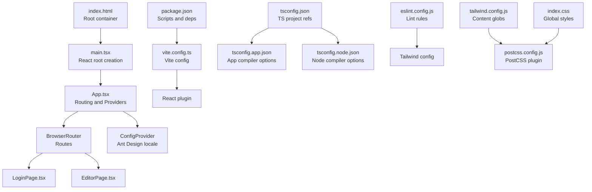
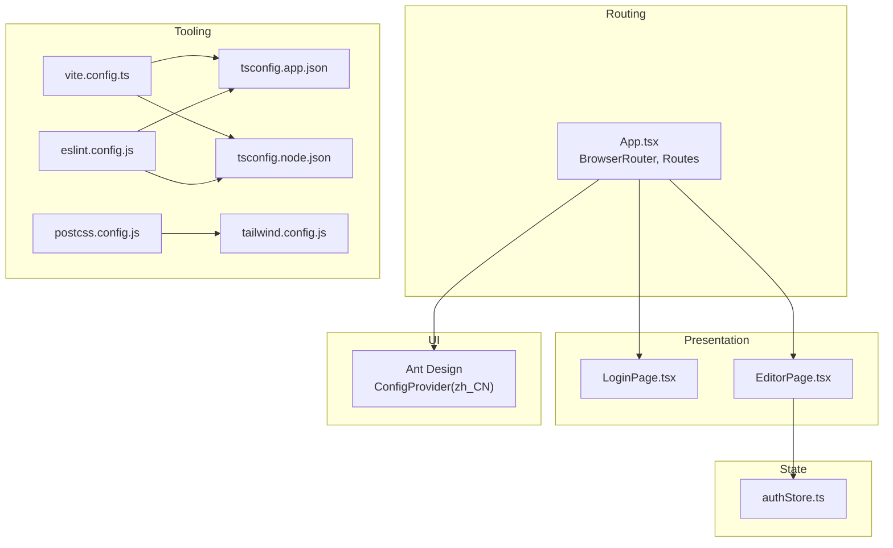
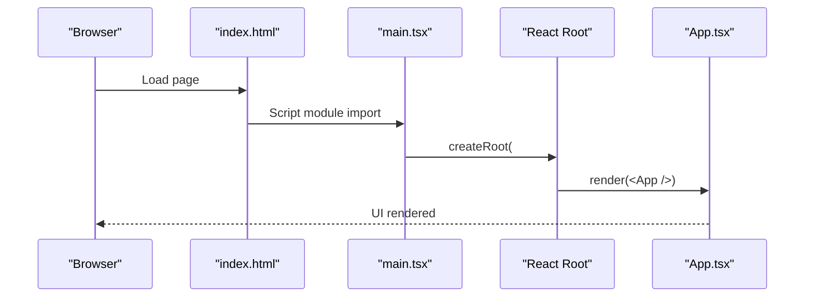
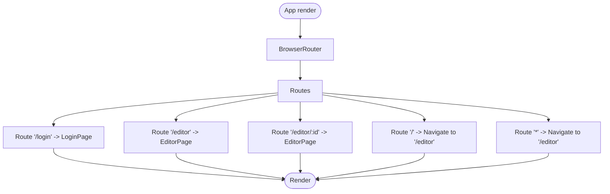
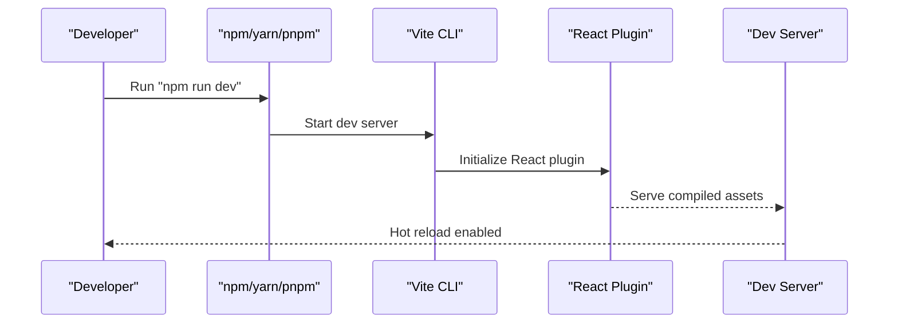
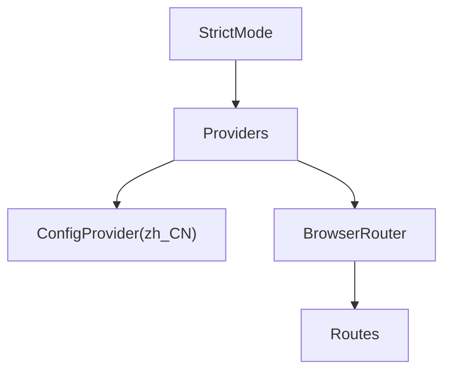
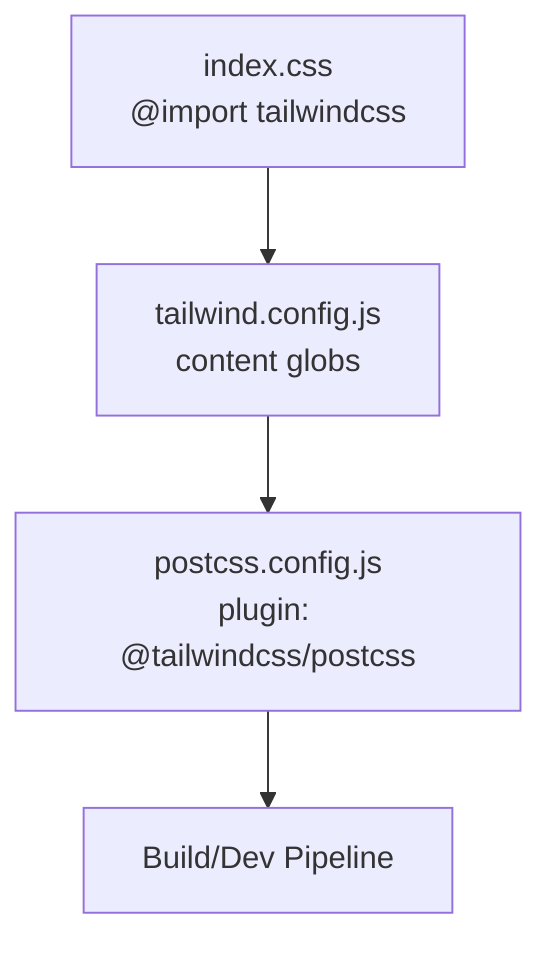
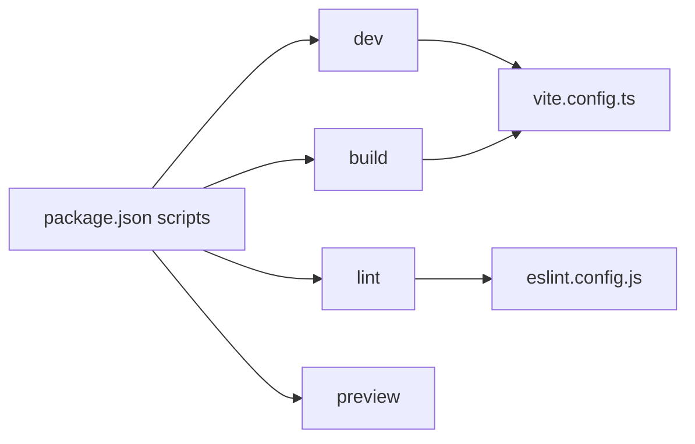
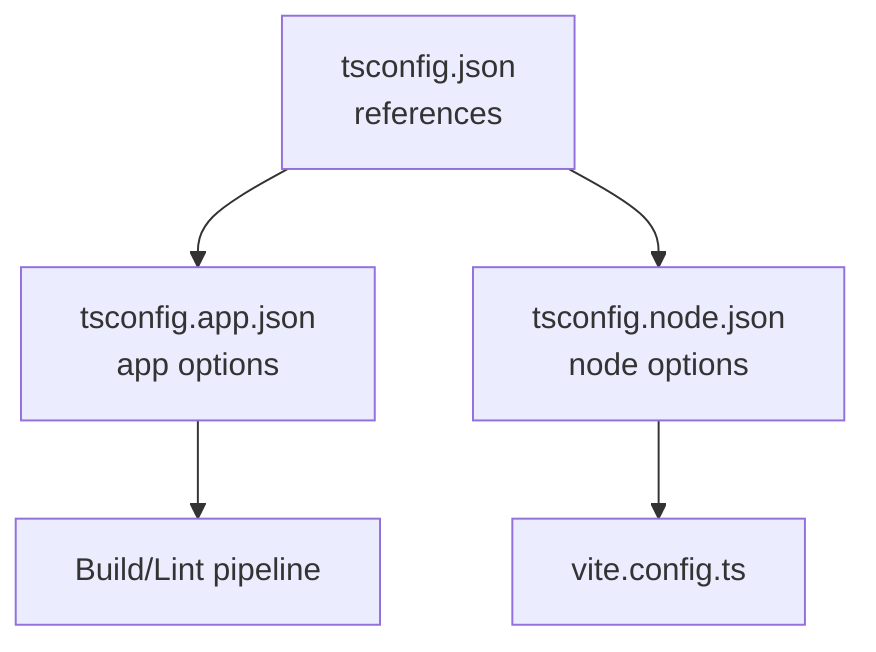
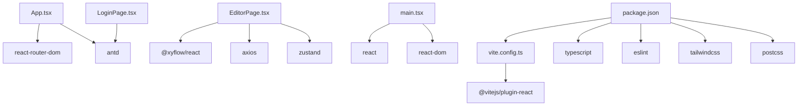

# Application Structure

<cite>
**Referenced Files in This Document**
- [main.tsx](file://frontend/src/main.tsx)
- [App.tsx](file://frontend/src/App.tsx)
- [package.json](file://frontend/package.json)
- [vite.config.ts](file://frontend/vite.config.ts)
- [index.html](file://frontend/index.html)
- [index.css](file://frontend/src/index.css)
- [tsconfig.json](file://frontend/tsconfig.json)
- [tsconfig.app.json](file://frontend/tsconfig.app.json)
- [tsconfig.node.json](file://frontend/tsconfig.node.json)
- [eslint.config.js](file://frontend/eslint.config.js)
- [tailwind.config.js](file://frontend/tailwind.config.js)
- [postcss.config.js](file://frontend/postcss.config.js)
- [EditorPage.tsx](file://frontend/src/pages/EditorPage.tsx)
- [LoginPage.tsx](file://frontend/src/pages/LoginPage.tsx)
- [authStore.ts](file://frontend/src/store/authStore.ts)
</cite>

## Table of Contents
1. [Introduction](#introduction)
2. [Project Structure](#project-structure)
3. [Core Components](#core-components)
4. [Architecture Overview](#architecture-overview)
5. [Detailed Component Analysis](#detailed-component-analysis)
6. [Dependency Analysis](#dependency-analysis)
7. [Performance Considerations](#performance-considerations)
8. [Troubleshooting Guide](#troubleshooting-guide)
9. [Conclusion](#conclusion)
10. [Appendices](#appendices)

## Introduction
This document describes the frontend application structure and configuration for the React-based editor. It covers the application entry point, routing configuration, Ant Design internationalization setup, Vite build configuration, development server setup, environment variable handling, application initialization, global styling, and component provider configuration. It also documents package.json dependencies, build scripts, development workflow, TypeScript configuration, ESLint setup, and Tailwind CSS integration.

## Project Structure
The frontend is organized around a standard React + Vite setup with TypeScript, Ant Design, and Tailwind CSS. Key areas include:
- Entry point and root rendering
- Routing with React Router DOM
- Global providers for UI and localization
- Pages and stores for application logic
- Build tooling via Vite
- Styling via Tailwind CSS and PostCSS
- Type checking via TypeScript configuration
- Code quality via ESLint

**Diagram sources**
- [index.html:1-14](file://frontend/index.html#L1-L14)
- [main.tsx:1-11](file://frontend/src/main.tsx#L1-L11)
- [App.tsx:1-24](file://frontend/src/App.tsx#L1-L24)
- [vite.config.ts:1-8](file://frontend/vite.config.ts#L1-L8)
- [package.json:1-40](file://frontend/package.json#L1-L40)
- [tsconfig.json:1-8](file://frontend/tsconfig.json#L1-L8)
- [tsconfig.app.json:1-27](file://frontend/tsconfig.app.json#L1-L27)
- [tsconfig.node.json:1-25](file://frontend/tsconfig.node.json#L1-L25)
- [eslint.config.js:1-29](file://frontend/eslint.config.js#L1-L29)
- [tailwind.config.js:1-13](file://frontend/tailwind.config.js#L1-L13)
- [postcss.config.js:1-6](file://frontend/postcss.config.js#L1-L6)
- [index.css:1-8](file://frontend/src/index.css#L1-L8)

**Section sources**
- [index.html:1-14](file://frontend/index.html#L1-L14)
- [main.tsx:1-11](file://frontend/src/main.tsx#L1-L11)
- [App.tsx:1-24](file://frontend/src/App.tsx#L1-L24)
- [vite.config.ts:1-8](file://frontend/vite.config.ts#L1-L8)
- [package.json:1-40](file://frontend/package.json#L1-L40)
- [tsconfig.json:1-8](file://frontend/tsconfig.json#L1-L8)
- [tsconfig.app.json:1-27](file://frontend/tsconfig.app.json#L1-L27)
- [tsconfig.node.json:1-25](file://frontend/tsconfig.node.json#L1-L25)
- [eslint.config.js:1-29](file://frontend/eslint.config.js#L1-L29)
- [tailwind.config.js:1-13](file://frontend/tailwind.config.js#L1-L13)
- [postcss.config.js:1-6](file://frontend/postcss.config.js#L1-L6)
- [index.css:1-8](file://frontend/src/index.css#L1-L8)

## Core Components
- Application entry point: Initializes the React root and mounts the root App component.
- Root application shell: Wraps routes with a router and sets up Ant Design’s ConfigProvider with Chinese locale.
- Pages: Login page and Editor page implement user authentication and workflow editing respectively.
- Stores: Zustand-based stores manage authentication state and workflow state.

Key implementation references:
- Entry point and root rendering: [main.tsx:1-11](file://frontend/src/main.tsx#L1-L11)
- Routing and providers: [App.tsx:1-24](file://frontend/src/App.tsx#L1-L24)
- Login page and authentication flow: [LoginPage.tsx:1-89](file://frontend/src/pages/LoginPage.tsx#L1-L89)
- Authentication store: [authStore.ts:1-31](file://frontend/src/store/authStore.ts#L1-L31)
- Editor page (workflow editing): [EditorPage.tsx:1-1396](file://frontend/src/pages/EditorPage.tsx#L1-L1396)

**Section sources**
- [main.tsx:1-11](file://frontend/src/main.tsx#L1-L11)
- [App.tsx:1-24](file://frontend/src/App.tsx#L1-L24)
- [LoginPage.tsx:1-89](file://frontend/src/pages/LoginPage.tsx#L1-L89)
- [authStore.ts:1-31](file://frontend/src/store/authStore.ts#L1-L31)
- [EditorPage.tsx:1-1396](file://frontend/src/pages/EditorPage.tsx#L1-L1396)

## Architecture Overview
The frontend follows a layered architecture:
- Presentation layer: React components (pages and shared components)
- State management: Zustand stores for auth and workflow state
- Routing: React Router DOM for navigation
- UI framework: Ant Design with localized messages
- Styling: Tailwind CSS with PostCSS pipeline
- Tooling: Vite for dev server and build, TypeScript for type safety, ESLint for linting

**Diagram sources**
- [App.tsx:1-24](file://frontend/src/App.tsx#L1-L24)
- [LoginPage.tsx:1-89](file://frontend/src/pages/LoginPage.tsx#L1-L89)
- [EditorPage.tsx:1-1396](file://frontend/src/pages/EditorPage.tsx#L1-L1396)
- [authStore.ts:1-31](file://frontend/src/store/authStore.ts#L1-L31)
- [vite.config.ts:1-8](file://frontend/vite.config.ts#L1-L8)
- [tsconfig.app.json:1-27](file://frontend/tsconfig.app.json#L1-L27)
- [tsconfig.node.json:1-25](file://frontend/tsconfig.node.json#L1-L25)
- [eslint.config.js:1-29](file://frontend/eslint.config.js#L1-L29)
- [tailwind.config.js:1-13](file://frontend/tailwind.config.js#L1-L13)
- [postcss.config.js:1-6](file://frontend/postcss.config.js#L1-L6)

## Detailed Component Analysis

### Application Entry Point and Initialization
- The HTML root element provides a mount point for the React app.
- The entry script loads the TypeScript module that creates the React root and renders the App component.
- Global CSS is imported at the entry point to ensure base styles are applied early.

Implementation references:
- Root container: [index.html:10-11](file://frontend/index.html#L10-L11)
- Entry render: [main.tsx:1-11](file://frontend/src/main.tsx#L1-L11)
- Global styles import: [main.tsx:3-3](file://frontend/src/main.tsx#L3-L3), [index.css:1-8](file://frontend/src/index.css#L1-L8)

**Diagram sources**
- [index.html:10-11](file://frontend/index.html#L10-L11)
- [main.tsx:1-11](file://frontend/src/main.tsx#L1-L11)
- [App.tsx:1-24](file://frontend/src/App.tsx#L1-L24)

**Section sources**
- [index.html:1-14](file://frontend/index.html#L1-L14)
- [main.tsx:1-11](file://frontend/src/main.tsx#L1-L11)
- [index.css:1-8](file://frontend/src/index.css#L1-L8)

### Routing Configuration with React Router DOM
- The application uses a single route configuration with nested routes for login and editor.
- Default and wildcard redirects ensure sensible navigation defaults.
- The router is wrapped inside the application shell to share providers.

Implementation references:
- Router setup and routes: [App.tsx:1-24](file://frontend/src/App.tsx#L1-L24)

**Diagram sources**
- [App.tsx:1-24](file://frontend/src/App.tsx#L1-L24)

**Section sources**
- [App.tsx:1-24](file://frontend/src/App.tsx#L1-L24)

### Ant Design Internationalization Setup
- The application wraps the router with Ant Design’s ConfigProvider and sets the locale to Chinese (China).
- This ensures all Ant Design components display messages and formats in Chinese.

Implementation references:
- Locale provider: [App.tsx:4-10](file://frontend/src/App.tsx#L4-L10)

**Diagram sources**
- [App.tsx:4-10](file://frontend/src/App.tsx#L4-L10)

**Section sources**
- [App.tsx:4-10](file://frontend/src/App.tsx#L4-L10)

### Vite Build Configuration and Development Server
- Vite is configured with the React plugin for JSX and TypeScript support.
- Scripts in package.json define dev, build, lint, and preview commands.
- The dev command starts the Vite development server; preview serves built assets locally.

Implementation references:
- Vite config: [vite.config.ts:1-8](file://frontend/vite.config.ts#L1-L8)
- Scripts and dependencies: [package.json:6-11](file://frontend/package.json#L6-L11)

**Diagram sources**
- [vite.config.ts:1-8](file://frontend/vite.config.ts#L1-L8)
- [package.json:6-11](file://frontend/package.json#L6-L11)

**Section sources**
- [vite.config.ts:1-8](file://frontend/vite.config.ts#L1-L8)
- [package.json:6-11](file://frontend/package.json#L6-L11)

### Environment Variable Handling
- No explicit environment variable files were found in the repository snapshot.
- Typical Vite environment variables are supported via .env files at the project root; however, none are present in the provided files.

Recommendation:
- Add environment files (e.g., .env.development, .env.production) if backend URLs or feature flags are needed at runtime.

**Section sources**
- [package.json:1-40](file://frontend/package.json#L1-L40)

### Application Initialization and Provider Configuration
- The application initializes by mounting the React root and rendering the App shell.
- Providers include:
  - React Strict Mode (enabled in the root)
  - Ant Design ConfigProvider with zh_CN locale
  - React Router BrowserRouter

Implementation references:
- Strict Mode and App render: [main.tsx:6-10](file://frontend/src/main.tsx#L6-L10)
- Providers and router: [App.tsx:7-20](file://frontend/src/App.tsx#L7-L20)

**Diagram sources**
- [main.tsx:6-10](file://frontend/src/main.tsx#L6-L10)
- [App.tsx:7-20](file://frontend/src/App.tsx#L7-L20)

**Section sources**
- [main.tsx:6-10](file://frontend/src/main.tsx#L6-L10)
- [App.tsx:7-20](file://frontend/src/App.tsx#L7-L20)

### Global Styling Setup
- Global CSS imports Tailwind directives and defines basic body styles.
- Tailwind’s content configuration scans HTML and TypeScript/JSX files for class usage.
- PostCSS is configured to process Tailwind directives.

Implementation references:
- Global styles: [index.css:1-8](file://frontend/src/index.css#L1-L8)
- Tailwind content scanning: [tailwind.config.js:3-6](file://frontend/tailwind.config.js#L3-L6)
- PostCSS plugin: [postcss.config.js:1-6](file://frontend/postcss.config.js#L1-L6)

**Diagram sources**
- [index.css:1-8](file://frontend/src/index.css#L1-L8)
- [tailwind.config.js:1-13](file://frontend/tailwind.config.js#L1-L13)
- [postcss.config.js:1-6](file://frontend/postcss.config.js#L1-L6)

**Section sources**
- [index.css:1-8](file://frontend/src/index.css#L1-L8)
- [tailwind.config.js:1-13](file://frontend/tailwind.config.js#L1-L13)
- [postcss.config.js:1-6](file://frontend/postcss.config.js#L1-L6)

### Component Provider Configuration
- Ant Design ConfigProvider is used to set the locale globally.
- This affects date pickers, buttons, and other components’ language and formats.

Implementation references:
- Locale provider: [App.tsx:9-9](file://frontend/src/App.tsx#L9-L9)

**Section sources**
- [App.tsx:9-9](file://frontend/src/App.tsx#L9-L9)

### Package Dependencies, Scripts, and Development Workflow
- Dependencies include React, React DOM, React Router DOM, Ant Design, icons, XYFlow, Axios, and Zustand.
- Development scripts:
  - dev: starts Vite dev server
  - build: compiles TypeScript then builds with Vite
  - lint: runs ESLint
  - preview: serves production build locally

Implementation references:
- Dependencies and scripts: [package.json:12-38](file://frontend/package.json#L12-L38)

**Diagram sources**
- [package.json:6-11](file://frontend/package.json#L6-L11)
- [vite.config.ts:1-8](file://frontend/vite.config.ts#L1-L8)
- [eslint.config.js:1-29](file://frontend/eslint.config.js#L1-L29)

**Section sources**
- [package.json:1-40](file://frontend/package.json#L1-L40)

### TypeScript Configuration
- Project references separate app and node configurations.
- App configuration targets modern JS environments, enables bundler module resolution, and enforces strictness.
- Node configuration targets Node tooling and Vite config.

Implementation references:
- Project references: [tsconfig.json:3-6](file://frontend/tsconfig.json#L3-L6)
- App compiler options: [tsconfig.app.json:2-24](file://frontend/tsconfig.app.json#L2-L24)
- Node compiler options: [tsconfig.node.json:2-22](file://frontend/tsconfig.node.json#L2-L22)

**Diagram sources**
- [tsconfig.json:1-8](file://frontend/tsconfig.json#L1-L8)
- [tsconfig.app.json:1-27](file://frontend/tsconfig.app.json#L1-L27)
- [tsconfig.node.json:1-25](file://frontend/tsconfig.node.json#L1-L25)

**Section sources**
- [tsconfig.json:1-8](file://frontend/tsconfig.json#L1-L8)
- [tsconfig.app.json:1-27](file://frontend/tsconfig.app.json#L1-L27)
- [tsconfig.node.json:1-25](file://frontend/tsconfig.node.json#L1-L25)

### ESLint Setup
- ESLint is configured with TypeScript and React hooks recommended rules.
- Globals are scoped to browser environment.
- React refresh plugin is included for fast refresh during development.

Implementation references:
- ESLint config: [eslint.config.js:7-28](file://frontend/eslint.config.js#L7-L28)

**Section sources**
- [eslint.config.js:1-29](file://frontend/eslint.config.js#L1-L29)

### Tailwind CSS Integration
- Tailwind is imported in global CSS.
- Content paths scan index.html and all src files with supported extensions.
- PostCSS plugin is configured to process Tailwind directives.

Implementation references:
- Import in global CSS: [index.css:1-1](file://frontend/src/index.css#L1-L1)
- Content globs: [tailwind.config.js:3-6](file://frontend/tailwind.config.js#L3-L6)
- PostCSS plugin: [postcss.config.js:1-6](file://frontend/postcss.config.js#L1-L6)

**Section sources**
- [index.css:1-8](file://frontend/src/index.css#L1-L8)
- [tailwind.config.js:1-13](file://frontend/tailwind.config.js#L1-L13)
- [postcss.config.js:1-6](file://frontend/postcss.config.js#L1-L6)

## Dependency Analysis
The frontend depends on React ecosystem libraries and build tooling. The primary external dependencies are:
- React and React DOM for UI rendering
- React Router DOM for client-side routing
- Ant Design and Ant Design Icons for UI components and icons
- XYFlow for interactive flow canvases
- Axios for HTTP requests
- Zustand for lightweight state management
- Vite, TypeScript, ESLint, Tailwind CSS, and PostCSS for tooling

**Diagram sources**
- [App.tsx:1-24](file://frontend/src/App.tsx#L1-L24)
- [EditorPage.tsx:1-1396](file://frontend/src/pages/EditorPage.tsx#L1-L1396)
- [LoginPage.tsx:1-89](file://frontend/src/pages/LoginPage.tsx#L1-L89)
- [main.tsx:1-11](file://frontend/src/main.tsx#L1-L11)
- [vite.config.ts:1-8](file://frontend/vite.config.ts#L1-L8)
- [package.json:12-38](file://frontend/package.json#L12-L38)

**Section sources**
- [package.json:12-38](file://frontend/package.json#L12-L38)
- [App.tsx:1-24](file://frontend/src/App.tsx#L1-L24)
- [EditorPage.tsx:1-1396](file://frontend/src/pages/EditorPage.tsx#L1-L1396)
- [LoginPage.tsx:1-89](file://frontend/src/pages/LoginPage.tsx#L1-L89)
- [main.tsx:1-11](file://frontend/src/main.tsx#L1-L11)
- [vite.config.ts:1-8](file://frontend/vite.config.ts#L1-L8)

## Performance Considerations
- Prefer lazy loading for heavy pages or components if the application grows.
- Use React.memo and useMemo/useCallback judiciously in frequently re-rendered components.
- Keep Ant Design components optimized; avoid unnecessary re-renders by passing stable props.
- Split bundles with dynamic imports for non-critical features.
- Monitor bundle size with Vite’s built-in analyzer plugin if needed.

## Troubleshooting Guide
Common issues and resolutions:
- Build fails due to TypeScript errors: Verify tsconfig references and strictness settings.
  - References: [tsconfig.json:3-6](file://frontend/tsconfig.json#L3-L6)
  - App config: [tsconfig.app.json:2-24](file://frontend/tsconfig.app.json#L2-L24)
- Lint errors: Review ESLint configuration and fix reported issues.
  - Config: [eslint.config.js:7-28](file://frontend/eslint.config.js#L7-L28)
- Styles not applying: Ensure Tailwind directives are imported and content globs include relevant files.
  - Global CSS: [index.css:1-1](file://frontend/src/index.css#L1-L1)
  - Tailwind config: [tailwind.config.js:3-6](file://frontend/tailwind.config.js#L3-L6)
- Dev server hot reload not working: Confirm Vite plugin is enabled and port is free.
  - Vite config: [vite.config.ts:1-8](file://frontend/vite.config.ts#L1-L8)
- Ant Design locale not taking effect: Ensure ConfigProvider wraps the router and locale is correctly imported.
  - Provider: [App.tsx:9-9](file://frontend/src/App.tsx#L9-L9)

**Section sources**
- [tsconfig.json:1-8](file://frontend/tsconfig.json#L1-L8)
- [tsconfig.app.json:1-27](file://frontend/tsconfig.app.json#L1-L27)
- [eslint.config.js:1-29](file://frontend/eslint.config.js#L1-L29)
- [index.css:1-8](file://frontend/src/index.css#L1-L8)
- [tailwind.config.js:1-13](file://frontend/tailwind.config.js#L1-L13)
- [vite.config.ts:1-8](file://frontend/vite.config.ts#L1-L8)
- [App.tsx:9-9](file://frontend/src/App.tsx#L9-L9)

## Conclusion
The frontend is structured around a clean React + Vite foundation with TypeScript, Ant Design, Tailwind CSS, and ESLint. The routing and provider setup centralizes internationalization and navigation. The build and development scripts enable a smooth developer experience. As the application evolves, consider adding environment-specific configuration and performance optimizations.

## Appendices
- Authentication store usage in pages:
  - LoginPage integrates with the auth store to persist credentials and redirect after login.
    - Store usage: [LoginPage.tsx:14-23](file://frontend/src/pages/LoginPage.tsx#L14-L23)
    - Store definition: [authStore.ts:14-30](file://frontend/src/store/authStore.ts#L14-L30)
- Editor page features:
  - Workflow CRUD, execution, and configuration management are implemented in the editor page.
    - Editor page: [EditorPage.tsx:1-1396](file://frontend/src/pages/EditorPage.tsx#L1-L1396)

**Section sources**
- [LoginPage.tsx:1-89](file://frontend/src/pages/LoginPage.tsx#L1-L89)
- [authStore.ts:1-31](file://frontend/src/store/authStore.ts#L1-L31)
- [EditorPage.tsx:1-1396](file://frontend/src/pages/EditorPage.tsx#L1-L1396)