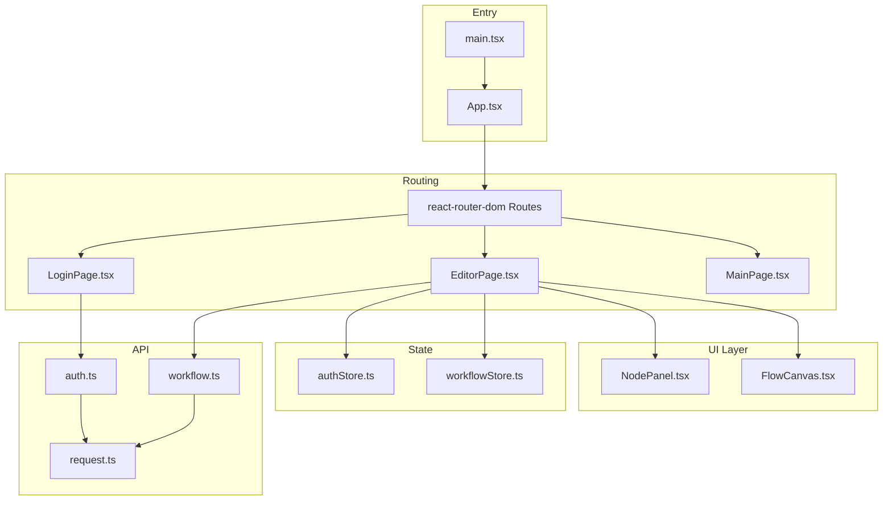
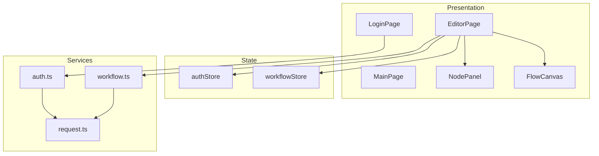
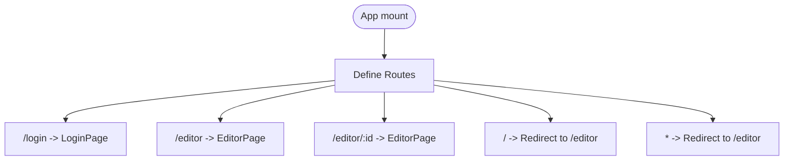
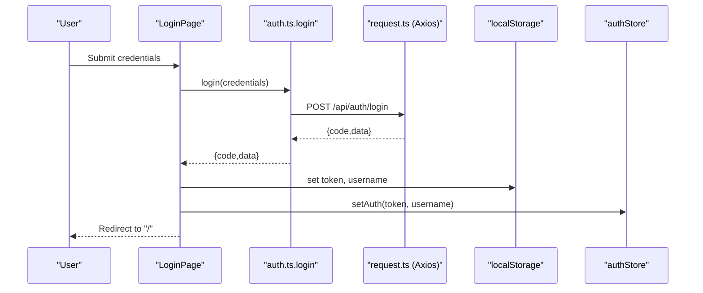
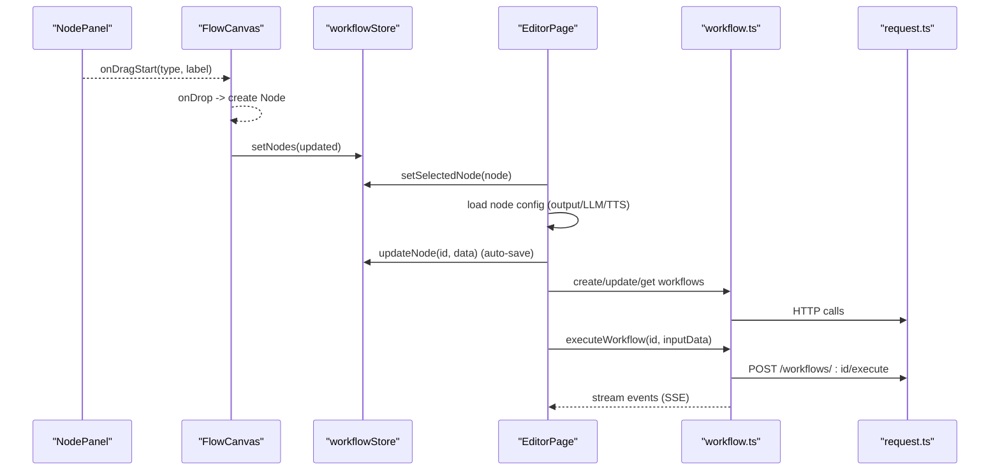
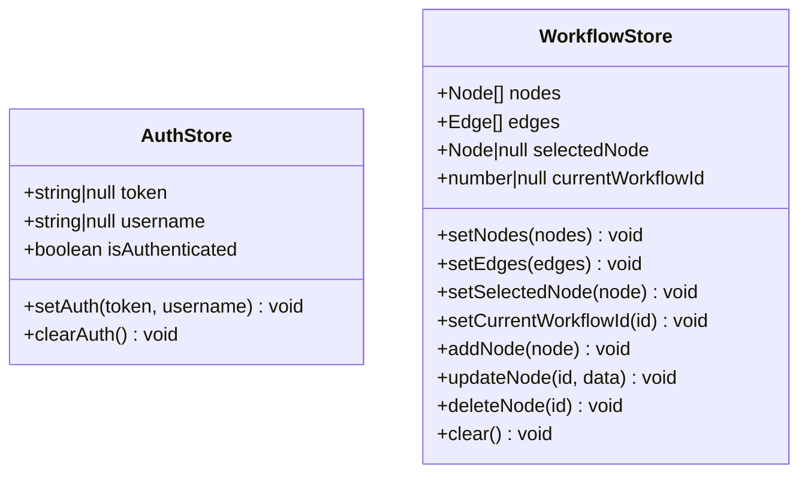
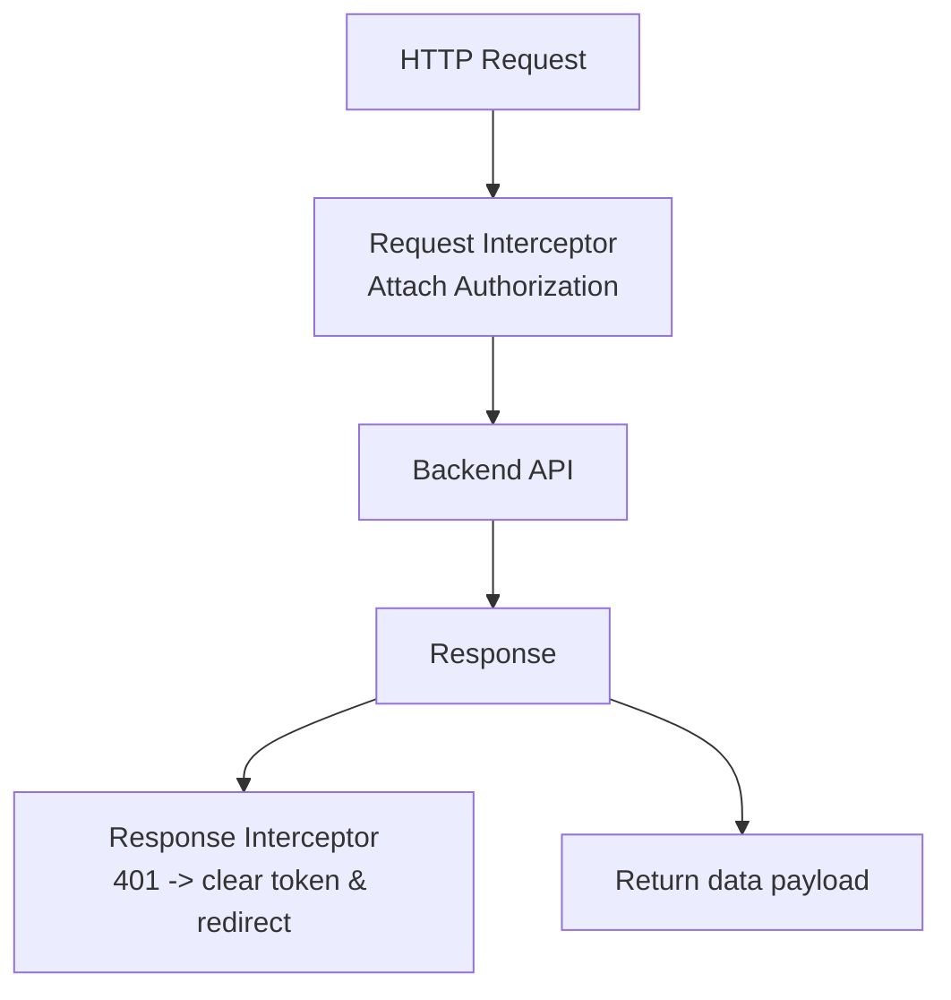
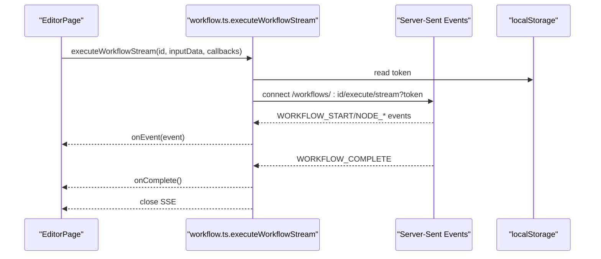
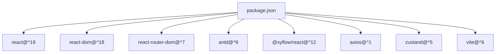

# Frontend Application

<cite>
**Referenced Files in This Document**
- [App.tsx](file://frontend/src/App.tsx)
- [main.tsx](file://frontend/src/main.tsx)
- [EditorPage.tsx](file://frontend/src/pages/EditorPage.tsx)
- [LoginPage.tsx](file://frontend/src/pages/LoginPage.tsx)
- [MainPage.tsx](file://frontend/src/pages/MainPage.tsx)
- [FlowCanvas.tsx](file://frontend/src/components/FlowCanvas.tsx)
- [NodePanel.tsx](file://frontend/src/components/NodePanel.tsx)
- [authStore.ts](file://frontend/src/store/authStore.ts)
- [workflowStore.ts](file://frontend/src/store/workflowStore.ts)
- [auth.ts](file://frontend/src/api/auth.ts)
- [workflow.ts](file://frontend/src/api/workflow.ts)
- [request.ts](file://frontend/src/utils/request.ts)
- [package.json](file://frontend/package.json)
- [vite.config.ts](file://frontend/vite.config.ts)
</cite>

## Table of Contents
1. [Introduction](#introduction)
2. [Project Structure](#project-structure)
3. [Core Components](#core-components)
4. [Architecture Overview](#architecture-overview)
5. [Detailed Component Analysis](#detailed-component-analysis)
6. [Dependency Analysis](#dependency-analysis)
7. [Performance Considerations](#performance-considerations)
8. [Troubleshooting Guide](#troubleshooting-guide)
9. [Conclusion](#conclusion)

## Introduction
This document describes the frontend React application architecture for the workflow editor. It covers the component hierarchy starting from the application entry point, routing configuration, React Flow integration for workflow visualization, state management with Zustand, Ant Design usage, and API integration patterns. It also details the workflow editor implementation including drag-and-drop, node configuration panels, and real-time debugging capabilities.

## Project Structure
The frontend is organized by feature and layer:
- Entry point renders the app shell with routing and theme provider
- Pages implement route handlers (EditorPage, LoginPage, MainPage)
- Components encapsulate reusable UI (FlowCanvas, NodePanel, Debug drawer)
- Store modules manage global state (authentication, workflow)
- API modules define typed requests to the backend
- Utilities configure HTTP client and interceptors

**Diagram sources**
- [main.tsx:1-11](file://frontend/src/main.tsx#L1-L11)
- [App.tsx:1-24](file://frontend/src/App.tsx#L1-L24)
- [LoginPage.tsx:1-89](file://frontend/src/pages/LoginPage.tsx#L1-L89)
- [EditorPage.tsx:1-1396](file://frontend/src/pages/EditorPage.tsx#L1-L1396)
- [MainPage.tsx:1-55](file://frontend/src/pages/MainPage.tsx#L1-L55)
- [NodePanel.tsx:1-112](file://frontend/src/components/NodePanel.tsx#L1-L112)
- [FlowCanvas.tsx:1-165](file://frontend/src/components/FlowCanvas.tsx#L1-L165)
- [authStore.ts:1-31](file://frontend/src/store/authStore.ts#L1-L31)
- [workflowStore.ts:1-70](file://frontend/src/store/workflowStore.ts#L1-L70)
- [auth.ts:1-41](file://frontend/src/api/auth.ts#L1-L41)
- [workflow.ts:1-177](file://frontend/src/api/workflow.ts#L1-L177)
- [request.ts:1-49](file://frontend/src/utils/request.ts#L1-L49)

**Section sources**
- [main.tsx:1-11](file://frontend/src/main.tsx#L1-L11)
- [App.tsx:1-24](file://frontend/src/App.tsx#L1-L24)
- [package.json:1-40](file://frontend/package.json#L1-L40)
- [vite.config.ts:1-8](file://frontend/vite.config.ts#L1-L8)

## Core Components
- App shell with routing and localization provider
- Page components: EditorPage (main editor), LoginPage (authentication), MainPage (placeholder)
- UI components: NodePanel (drag sources), FlowCanvas (visualization canvas)
- State stores: authStore (token, user, auth state), workflowStore (nodes, edges, selection)
- API modules: auth.ts, workflow.ts, request.ts (Axios instance with interceptors)

Key responsibilities:
- Routing: protected routes and redirects
- Authentication: login flow, token persistence, logout
- Workflow editing: drag-and-drop creation, connection drawing, node configuration
- Real-time execution: server-sent events for streaming execution events

**Section sources**
- [App.tsx:1-24](file://frontend/src/App.tsx#L1-L24)
- [EditorPage.tsx:1-1396](file://frontend/src/pages/EditorPage.tsx#L1-L1396)
- [LoginPage.tsx:1-89](file://frontend/src/pages/LoginPage.tsx#L1-L89)
- [MainPage.tsx:1-55](file://frontend/src/pages/MainPage.tsx#L1-L55)
- [NodePanel.tsx:1-112](file://frontend/src/components/NodePanel.tsx#L1-L112)
- [FlowCanvas.tsx:1-165](file://frontend/src/components/FlowCanvas.tsx#L1-L165)
- [authStore.ts:1-31](file://frontend/src/store/authStore.ts#L1-L31)
- [workflowStore.ts:1-70](file://frontend/src/store/workflowStore.ts#L1-L70)
- [auth.ts:1-41](file://frontend/src/api/auth.ts#L1-L41)
- [workflow.ts:1-177](file://frontend/src/api/workflow.ts#L1-L177)
- [request.ts:1-49](file://frontend/src/utils/request.ts#L1-L49)

## Architecture Overview
The frontend follows a layered architecture:
- Presentation layer: React components and pages
- State layer: Zustand stores for global state
- Service layer: API modules encapsulating HTTP calls
- Infrastructure: Axios instance with request/response interceptors

**Diagram sources**
- [EditorPage.tsx:1-1396](file://frontend/src/pages/EditorPage.tsx#L1-L1396)
- [LoginPage.tsx:1-89](file://frontend/src/pages/LoginPage.tsx#L1-L89)
- [MainPage.tsx:1-55](file://frontend/src/pages/MainPage.tsx#L1-L55)
- [NodePanel.tsx:1-112](file://frontend/src/components/NodePanel.tsx#L1-L112)
- [FlowCanvas.tsx:1-165](file://frontend/src/components/FlowCanvas.tsx#L1-L165)
- [authStore.ts:1-31](file://frontend/src/store/authStore.ts#L1-L31)
- [workflowStore.ts:1-70](file://frontend/src/store/workflowStore.ts#L1-L70)
- [auth.ts:1-41](file://frontend/src/api/auth.ts#L1-L41)
- [workflow.ts:1-177](file://frontend/src/api/workflow.ts#L1-L177)
- [request.ts:1-49](file://frontend/src/utils/request.ts#L1-L49)

## Detailed Component Analysis

### Routing and Navigation
- BrowserRouter wraps the app with routes
- Public routes: /login, /editor, /editor/:id
- Root and wildcard redirect to /editor
- Ant Design ConfigProvider sets locale

**Diagram sources**
- [App.tsx:1-24](file://frontend/src/App.tsx#L1-L24)

**Section sources**
- [App.tsx:1-24](file://frontend/src/App.tsx#L1-L24)

### Authentication Flow
- LoginPage handles credentials submission via login API
- On success, sets token and username in localStorage and auth store
- Global Axios interceptor attaches Authorization header
- Response interceptor handles 401 by clearing token and redirecting to login

**Diagram sources**
- [LoginPage.tsx:16-32](file://frontend/src/pages/LoginPage.tsx#L16-L32)
- [auth.ts:24-26](file://frontend/src/api/auth.ts#L24-L26)
- [request.ts:17-46](file://frontend/src/utils/request.ts#L17-L46)
- [authStore.ts:19-29](file://frontend/src/store/authStore.ts#L19-L29)

**Section sources**
- [LoginPage.tsx:1-89](file://frontend/src/pages/LoginPage.tsx#L1-L89)
- [auth.ts:1-41](file://frontend/src/api/auth.ts#L1-L41)
- [request.ts:1-49](file://frontend/src/utils/request.ts#L1-L49)
- [authStore.ts:1-31](file://frontend/src/store/authStore.ts#L1-L31)

### Workflow Editor Implementation
- Drag-and-drop creation: NodePanel emits drag events; FlowCanvas receives drops and creates nodes
- Canvas interactions: nodes, edges, connections, minimap, controls, background
- Node selection: clicking a node loads its configuration into the right panel
- Configuration forms: output, LLM (openai/deepseek/qwen), TTS (qwen tts) configurations
- Auto-save: debounced updates to selected node data in store
- Execution: debug drawer triggers workflow execution; supports SSE streaming

**Diagram sources**
- [NodePanel.tsx:43-55](file://frontend/src/components/NodePanel.tsx#L43-L55)
- [FlowCanvas.tsx:92-122](file://frontend/src/components/FlowCanvas.tsx#L92-L122)
- [FlowCanvas.tsx:52-90](file://frontend/src/components/FlowCanvas.tsx#L52-L90)
- [EditorPage.tsx:95-133](file://frontend/src/pages/EditorPage.tsx#L95-L133)
- [EditorPage.tsx:456-527](file://frontend/src/pages/EditorPage.tsx#L456-L527)
- [EditorPage.tsx:546-595](file://frontend/src/pages/EditorPage.tsx#L546-L595)
- [EditorPage.tsx:648-772](file://frontend/src/pages/EditorPage.tsx#L648-L772)
- [workflow.ts:47-84](file://frontend/src/api/workflow.ts#L47-L84)
- [workflow.ts:96-177](file://frontend/src/api/workflow.ts#L96-L177)
- [request.ts:17-46](file://frontend/src/utils/request.ts#L17-L46)

**Section sources**
- [NodePanel.tsx:1-112](file://frontend/src/components/NodePanel.tsx#L1-L112)
- [FlowCanvas.tsx:1-165](file://frontend/src/components/FlowCanvas.tsx#L1-L165)
- [EditorPage.tsx:1-1396](file://frontend/src/pages/EditorPage.tsx#L1-L1396)
- [workflow.ts:1-177](file://frontend/src/api/workflow.ts#L1-L177)

### State Management with Zustand
- authStore: token, username, isAuthenticated; setAuth, clearAuth persist to localStorage
- workflowStore: nodes, edges, selectedNode, currentWorkflowId; CRUD operations and clear

**Diagram sources**
- [authStore.ts:14-30](file://frontend/src/store/authStore.ts#L14-L30)
- [workflowStore.ts:34-69](file://frontend/src/store/workflowStore.ts#L34-L69)

**Section sources**
- [authStore.ts:1-31](file://frontend/src/store/authStore.ts#L1-L31)
- [workflowStore.ts:1-70](file://frontend/src/store/workflowStore.ts#L1-L70)

### API Integration Patterns
- request.ts: Axios instance with base URL, timeout, headers
- Request interceptor: attach Authorization: Bearer token from localStorage
- Response interceptor: handle 401 globally by clearing token and redirect
- workflow.ts: typed APIs for node types, workflows CRUD, execution, and SSE streaming
- auth.ts: login, logout, current user

**Diagram sources**
- [request.ts:17-46](file://frontend/src/utils/request.ts#L17-L46)
- [workflow.ts:47-84](file://frontend/src/api/workflow.ts#L47-L84)
- [auth.ts:24-40](file://frontend/src/api/auth.ts#L24-L40)

**Section sources**
- [request.ts:1-49](file://frontend/src/utils/request.ts#L1-L49)
- [workflow.ts:1-177](file://frontend/src/api/workflow.ts#L1-L177)
- [auth.ts:1-41](file://frontend/src/api/auth.ts#L1-L41)

### Real-time Debugging Capabilities
- EditorPage opens a debug drawer bound to a workflow
- executeWorkflowStream establishes SSE connection with token
- Handles events: WORKFLOW_START, NODE_START, NODE_SUCCESS, NODE_PROGRESS, NODE_ERROR, WORKFLOW_COMPLETE, ERROR
- Closes SSE on completion or error; cleans up on network errors

**Diagram sources**
- [EditorPage.tsx:256-277](file://frontend/src/pages/EditorPage.tsx#L256-L277)
- [workflow.ts:96-177](file://frontend/src/api/workflow.ts#L96-L177)

**Section sources**
- [EditorPage.tsx:256-277](file://frontend/src/pages/EditorPage.tsx#L256-L277)
- [workflow.ts:96-177](file://frontend/src/api/workflow.ts#L96-L177)

## Dependency Analysis
External dependencies include React, React DOM, React Router, Ant Design, @xyflow/react, axios, zustand. Vite plugin for React is configured.

**Diagram sources**
- [package.json:12-38](file://frontend/package.json#L12-L38)
- [vite.config.ts:5-7](file://frontend/vite.config.ts#L5-L7)

**Section sources**
- [package.json:1-40](file://frontend/package.json#L1-L40)
- [vite.config.ts:1-8](file://frontend/vite.config.ts#L1-L8)

## Performance Considerations
- Debounced auto-save: avoid excessive updates to the store and backend during configuration edits
- Efficient rendering: keep node and edge lists minimal; use XYFlow’s built-in virtualization and fitView
- Streaming execution: SSE reduces UI blocking and provides immediate feedback
- Local storage caching: reduce repeated network calls for small metadata (e.g., token presence)

## Troubleshooting Guide
Common issues and resolutions:
- Authentication failures: 401 responses trigger automatic token removal and redirect to login
- Network errors: Axios interceptor surfaces generic messages; check backend connectivity and CORS
- SSE connection problems: onerror handler detects missing token or connection interruptions; re-login or refresh
- Drag-and-drop not working: ensure drop zone bounds and preventDefault/dropEffect are handled in onDragOver/onDrop
- Auto-save not persisting: verify debounce timing and that selectedNode is set before saving

**Section sources**
- [request.ts:34-46](file://frontend/src/utils/request.ts#L34-L46)
- [workflow.ts:164-177](file://frontend/src/api/workflow.ts#L164-L177)
- [FlowCanvas.tsx:124-127](file://frontend/src/components/FlowCanvas.tsx#L124-L127)
- [EditorPage.tsx:648-772](file://frontend/src/pages/EditorPage.tsx#L648-L772)

## Conclusion
The frontend employs a clean separation of concerns with React Router for navigation, Ant Design for UI, Zustand for state, and @xyflow/react for workflow visualization. The EditorPage orchestrates drag-and-drop, configuration, and execution flows, while API modules encapsulate backend interactions with robust interceptors and streaming support. This architecture enables a responsive, maintainable, and extensible workflow editor.