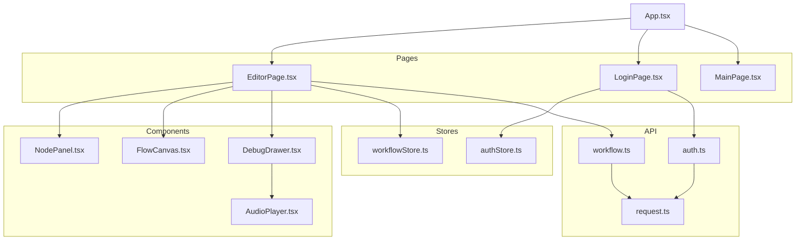
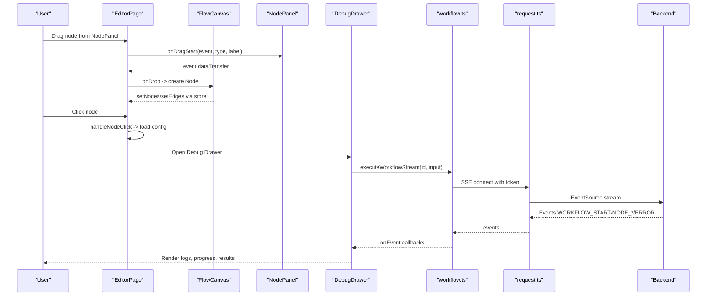
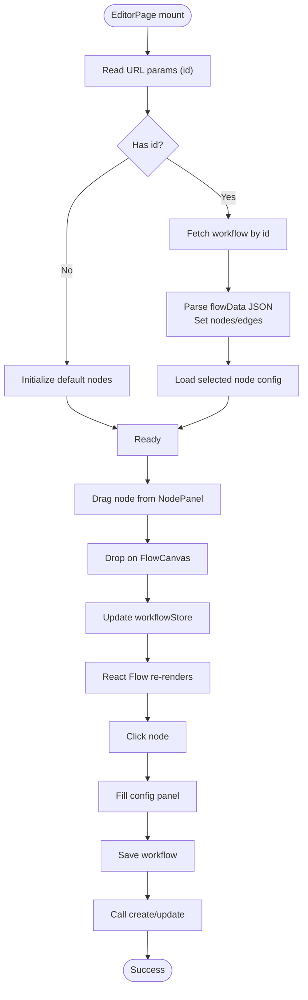
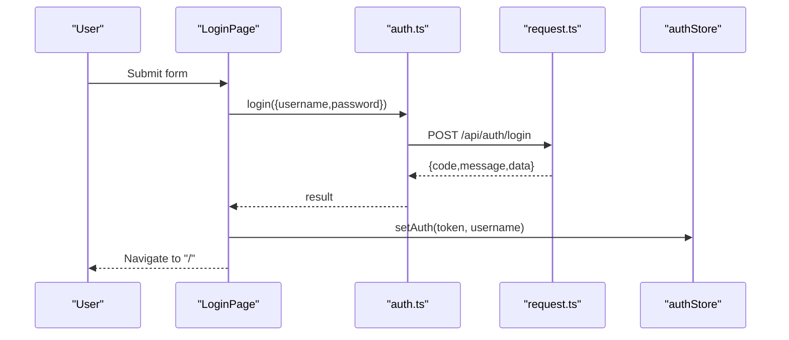
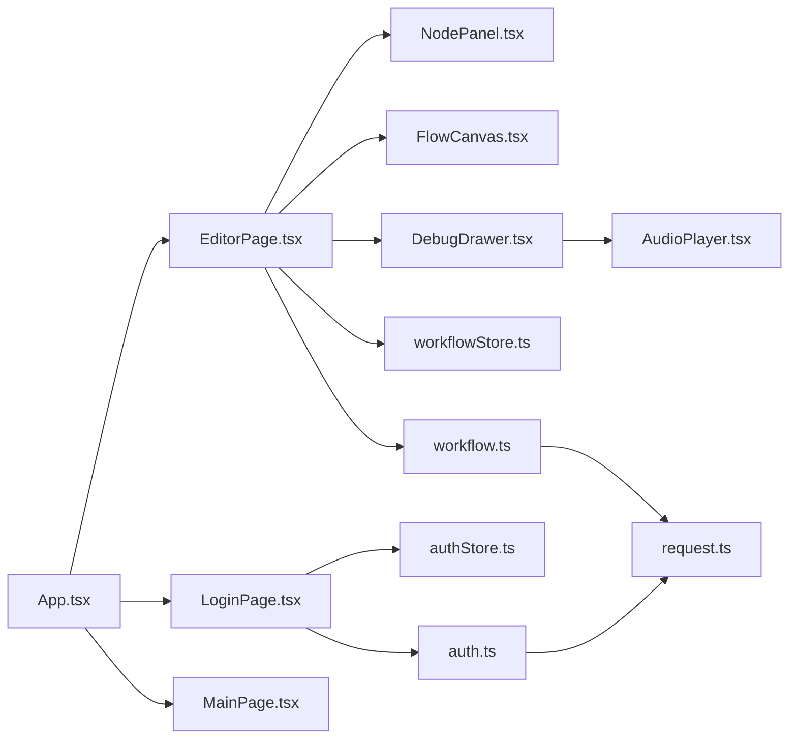

# Page Components

<cite>
**Referenced Files in This Document**
- [EditorPage.tsx](file://frontend/src/pages/EditorPage.tsx)
- [LoginPage.tsx](file://frontend/src/pages/LoginPage.tsx)
- [MainPage.tsx](file://frontend/src/pages/MainPage.tsx)
- [FlowCanvas.tsx](file://frontend/src/components/FlowCanvas.tsx)
- [NodePanel.tsx](file://frontend/src/components/NodePanel.tsx)
- [DebugDrawer.tsx](file://frontend/src/components/DebugDrawer.tsx)
- [AudioPlayer.tsx](file://frontend/src/components/AudioPlayer.tsx)
- [workflowStore.ts](file://frontend/src/store/workflowStore.ts)
- [authStore.ts](file://frontend/src/store/authStore.ts)
- [workflow.ts](file://frontend/src/api/workflow.ts)
- [auth.ts](file://frontend/src/api/auth.ts)
- [request.ts](file://frontend/src/utils/request.ts)
- [App.tsx](file://frontend/src/App.tsx)
- [package.json](file://frontend/package.json)
</cite>

## Table of Contents
1. [Introduction](#introduction)
2. [Project Structure](#project-structure)
3. [Core Components](#core-components)
4. [Architecture Overview](#architecture-overview)
5. [Detailed Component Analysis](#detailed-component-analysis)
6. [Dependency Analysis](#dependency-analysis)
7. [Performance Considerations](#performance-considerations)
8. [Troubleshooting Guide](#troubleshooting-guide)
9. [Conclusion](#conclusion)

## Introduction
This document provides comprehensive documentation for the main page components of the application: EditorPage, LoginPage, and MainPage. It explains the EditorPage workflow editor built with React Flow, including drag-and-drop, node manipulation, and configuration panels. It documents the LoginPage authentication flow, form validation, and state management. It also covers the MainPage layout and navigation patterns. The guide includes component props, state management, event handling, backend API integration, responsive design considerations, and user experience patterns.

## Project Structure
The frontend is organized into pages, components, stores, API modules, and utilities. Pages define top-level views, components encapsulate reusable UI and logic, stores manage global state, API modules abstract backend communication, and utilities provide shared infrastructure like HTTP requests.

**Diagram sources**
- [EditorPage.tsx:1-1396](file://frontend/src/pages/EditorPage.tsx#L1-L1396)
- [LoginPage.tsx:1-89](file://frontend/src/pages/LoginPage.tsx#L1-L89)
- [MainPage.tsx:1-55](file://frontend/src/pages/MainPage.tsx#L1-L55)
- [NodePanel.tsx:1-112](file://frontend/src/components/NodePanel.tsx#L1-L112)
- [FlowCanvas.tsx:1-165](file://frontend/src/components/FlowCanvas.tsx#L1-L165)
- [DebugDrawer.tsx:1-395](file://frontend/src/components/DebugDrawer.tsx#L1-L395)
- [AudioPlayer.tsx:1-123](file://frontend/src/components/AudioPlayer.tsx#L1-L123)
- [workflowStore.ts:1-70](file://frontend/src/store/workflowStore.ts#L1-L70)
- [authStore.ts:1-31](file://frontend/src/store/authStore.ts#L1-L31)
- [workflow.ts:1-177](file://frontend/src/api/workflow.ts#L1-L177)
- [auth.ts:1-41](file://frontend/src/api/auth.ts#L1-L41)
- [request.ts:1-49](file://frontend/src/utils/request.ts#L1-L49)
- [App.tsx:1-24](file://frontend/src/App.tsx#L1-L24)

**Section sources**
- [App.tsx:1-24](file://frontend/src/App.tsx#L1-L24)
- [package.json:1-40](file://frontend/package.json#L1-L40)

## Core Components
- EditorPage: Full-featured workflow editor integrating React Flow, drag-and-drop, node configuration panels, saving/loading workflows, and execution via a debug drawer.
- LoginPage: Authentication form with Ant Design, validation, submission flow, and redirect after successful login.
- MainPage: Placeholder main page with protected routing and basic layout.

**Section sources**
- [EditorPage.tsx:48-1396](file://frontend/src/pages/EditorPage.tsx#L48-L1396)
- [LoginPage.tsx:11-89](file://frontend/src/pages/LoginPage.tsx#L11-L89)
- [MainPage.tsx:7-55](file://frontend/src/pages/MainPage.tsx#L7-L55)

## Architecture Overview
The application uses React with React Flow for graph editing, Zustand for state management, Ant Design for UI, and Axios for HTTP requests. Routing is handled by React Router DOM. The EditorPage orchestrates drag-and-drop, canvas updates, and node configuration. The DebugDrawer streams execution events from the backend and renders progress and results.

**Diagram sources**
- [EditorPage.tsx:88-134](file://frontend/src/pages/EditorPage.tsx#L88-L134)
- [FlowCanvas.tsx:92-134](file://frontend/src/components/FlowCanvas.tsx#L92-L134)
- [NodePanel.tsx:43-55](file://frontend/src/components/NodePanel.tsx#L43-L55)
- [DebugDrawer.tsx:69-175](file://frontend/src/components/DebugDrawer.tsx#L69-L175)
- [workflow.ts:96-177](file://frontend/src/api/workflow.ts#L96-L177)
- [request.ts:17-46](file://frontend/src/utils/request.ts#L17-L46)

## Detailed Component Analysis

### EditorPage
EditorPage is the central component for workflow authoring. It manages:
- Global state via workflowStore (nodes, edges, selection, current workflow ID)
- Authentication via authStore (username, token, isAuthenticated)
- Drag-and-drop from NodePanel to FlowCanvas
- Node configuration forms for input, output, LLM, and TTS nodes
- Saving/loading workflows via workflow API
- Executing workflows via DebugDrawer and streaming events

Key responsibilities:
- Drag-and-drop handling: sets dataTransfer types/labels and creates nodes on drop
- Node click handler: loads selected node data and pre-fills configuration panels
- Validation and saving: validates parameter templates and saves to backend
- Auto-save: debounced persistence of node configurations
- Execution: opens DebugDrawer and triggers server-side execution

Props and state:
- Uses router params (id) to load workflows
- Manages local state for workflow metadata, engine type, and node-specific configs
- Integrates with workflowStore for reactive UI updates

Event handling:
- onDragStart (from NodePanel)
- onNodeClick (from FlowCanvas)
- Form handlers for adding/removing/updating parameters
- Auto-save effects for output, LLM, and TTS configurations

Backend integration:
- createWorkflow/updateWorkflow/getWorkflows/getWorkflow
- executeWorkflow (single-shot) and executeWorkflowStream (SSE)

Responsive UX:
- Flexible three-panel layout: left panel (nodes), center canvas, right config panel
- Modal for loading workflows
- Drawer for execution feedback

**Diagram sources**
- [EditorPage.tsx:135-198](file://frontend/src/pages/EditorPage.tsx#L135-L198)
- [EditorPage.tsx:88-134](file://frontend/src/pages/EditorPage.tsx#L88-L134)
- [FlowCanvas.tsx:92-122](file://frontend/src/components/FlowCanvas.tsx#L92-L122)
- [workflowStore.ts:34-69](file://frontend/src/store/workflowStore.ts#L34-L69)

**Section sources**
- [EditorPage.tsx:48-1396](file://frontend/src/pages/EditorPage.tsx#L48-L1396)
- [workflowStore.ts:1-70](file://frontend/src/store/workflowStore.ts#L1-L70)
- [workflow.ts:47-84](file://frontend/src/api/workflow.ts#L47-L84)

### LoginPage
LoginPage handles user authentication:
- Form with username/password fields and Ant Design validation
- Submission flow: calls login API, stores token/username in authStore, navigates to home
- Error handling: displays messages for invalid credentials or network errors

Props and state:
- Local loading state during submission
- Uses useAuthStore to persist credentials

Backend integration:
- login API endpoint
- Uses request.ts interceptors for Authorization header

UX considerations:
- Pre-filled default credentials for demo ease
- Loading indicator during submission

**Diagram sources**
- [LoginPage.tsx:16-32](file://frontend/src/pages/LoginPage.tsx#L16-L32)
- [auth.ts:24-26](file://frontend/src/api/auth.ts#L24-L26)
- [request.ts:17-29](file://frontend/src/utils/request.ts#L17-L29)
- [authStore.ts:19-29](file://frontend/src/store/authStore.ts#L19-L29)

**Section sources**
- [LoginPage.tsx:11-89](file://frontend/src/pages/LoginPage.tsx#L11-L89)
- [auth.ts:1-41](file://frontend/src/api/auth.ts#L1-L41)
- [authStore.ts:1-31](file://frontend/src/store/authStore.ts#L1-L31)
- [request.ts:1-49](file://frontend/src/utils/request.ts#L1-L49)

### MainPage
MainPage is a placeholder route guarded by authentication:
- Displays welcome message with username from authStore
- Provides logout button that clears auth state
- ProtectedMainPage enforces authentication via useAuthStore

Routing:
- Protected route ensures unauthenticated users are redirected to /login

**Section sources**
- [MainPage.tsx:7-55](file://frontend/src/pages/MainPage.tsx#L7-L55)
- [authStore.ts:1-31](file://frontend/src/store/authStore.ts#L1-L31)
- [App.tsx:11-17](file://frontend/src/App.tsx#L11-L17)

### FlowCanvas (React Flow Integration)
FlowCanvas wraps @xyflow/react to provide:
- Nodes and edges state synchronized with workflowStore
- Drag-and-drop creation of nodes from external drag events
- Edge creation with arrow markers
- Node click propagation to parent for configuration
- Automatic synchronization of local state with store

Key behaviors:
- Converts store edges to include arrow markers
- Debounces store updates after local changes
- Adds default arrow markers on new edges

**Section sources**
- [FlowCanvas.tsx:27-165](file://frontend/src/components/FlowCanvas.tsx#L27-L165)
- [workflowStore.ts:34-69](file://frontend/src/store/workflowStore.ts#L34-L69)

### NodePanel (Drag-and-Drop Library)
NodePanel fetches node types from backend and exposes draggable items:
- Loads node definitions on mount
- Groups nodes by category (LLM, TOOL)
- Emits drag events with type and display name

Integration:
- Calls getNodeTypes API
- Draggable items trigger EditorPage.handleDragStart

**Section sources**
- [NodePanel.tsx:12-112](file://frontend/src/components/NodePanel.tsx#L12-L112)
- [workflow.ts:40-42](file://frontend/src/api/workflow.ts#L40-L42)

### DebugDrawer (Execution and Streaming)
DebugDrawer provides:
- Input area for test data
- Execution control and real-time progress
- Event-driven rendering of node execution logs and results
- Final output display (including audio playback)

Streaming:
- Uses executeWorkflowStream with EventSource
- Handles WORKFLOW_START, NODE_START/SUCCESS/PROGRESS/ERROR, WORKFLOW_COMPLETE, ERROR
- Closes stream on completion and cleans up on errors

Final output handling:
- Detects audio URLs from execution result and renders AudioPlayer
- Falls back to JSON output display

**Section sources**
- [DebugDrawer.tsx:35-395](file://frontend/src/components/DebugDrawer.tsx#L35-L395)
- [workflow.ts:96-177](file://frontend/src/api/workflow.ts#L96-L177)
- [AudioPlayer.tsx:13-123](file://frontend/src/components/AudioPlayer.tsx#L13-L123)

### AudioPlayer (Playback and Download)
AudioPlayer provides:
- Play/pause controls
- Progress slider with time formatting
- Download button for audio files

**Section sources**
- [AudioPlayer.tsx:13-123](file://frontend/src/components/AudioPlayer.tsx#L13-L123)

## Dependency Analysis
External libraries and integrations:
- React Flow (@xyflow/react) for graph editing
- Ant Design (antd) for UI components and forms
- React Router DOM for routing
- Axios for HTTP requests with interceptors
- Zustand for lightweight state management

Internal dependencies:
- EditorPage depends on NodePanel, FlowCanvas, DebugDrawer, workflowStore, authStore, and workflow API
- DebugDrawer depends on AudioPlayer and workflow API
- LoginPage depends on auth API and authStore
- App routes define page-level navigation

**Diagram sources**
- [EditorPage.tsx:1-12](file://frontend/src/pages/EditorPage.tsx#L1-L12)
- [NodePanel.tsx:1-7](file://frontend/src/components/NodePanel.tsx#L1-L7)
- [FlowCanvas.tsx:1-18](file://frontend/src/components/FlowCanvas.tsx#L1-L18)
- [DebugDrawer.tsx:1-6](file://frontend/src/components/DebugDrawer.tsx#L1-L6)
- [AudioPlayer.tsx:1-4](file://frontend/src/components/AudioPlayer.tsx#L1-L4)
- [workflowStore.ts:1-3](file://frontend/src/store/workflowStore.ts#L1-L3)
- [authStore.ts:1-2](file://frontend/src/store/authStore.ts#L1-L2)
- [workflow.ts:1-2](file://frontend/src/api/workflow.ts#L1-L2)
- [auth.ts:1-2](file://frontend/src/api/auth.ts#L1-L2)
- [request.ts:1-2](file://frontend/src/utils/request.ts#L1-L2)
- [App.tsx:1-4](file://frontend/src/App.tsx#L1-L4)

**Section sources**
- [package.json:12-21](file://frontend/package.json#L12-L21)

## Performance Considerations
- Debounced auto-save: EditorPage uses timeouts to avoid frequent writes while editing node configurations.
- Efficient state updates: FlowCanvas synchronizes store and local state with minimal re-renders.
- Streaming execution: DebugDrawer uses EventSource to receive incremental updates without polling.
- Lazy loading: NodePanel fetches node types once on mount.

Recommendations:
- Consider virtualizing long lists in DebugDrawer logs for very large executions.
- Batch updates to nodes/edges when performing bulk operations.
- Memoize derived data like referenceable parameters to reduce recomputation.

[No sources needed since this section provides general guidance]

## Troubleshooting Guide
Common issues and resolutions:
- Authentication failures: 401 responses trigger automatic logout and redirect to login.
- Missing token during execution: executeWorkflowStream checks for token and redirects to login if absent.
- Network errors: request.ts interceptors surface errors; check backend availability and CORS.
- Empty workflow save: EditorPage prevents saving empty workflows and warns the user.
- Parameter template validation: EditorPage validates prompt/response templates for undefined parameter references.

**Section sources**
- [request.ts:34-46](file://frontend/src/utils/request.ts#L34-L46)
- [workflow.ts:103-177](file://frontend/src/api/workflow.ts#L103-L177)
- [EditorPage.tsx:347-397](file://frontend/src/pages/EditorPage.tsx#L347-L397)
- [EditorPage.tsx:476-498](file://frontend/src/pages/EditorPage.tsx#L476-L498)

## Conclusion
The EditorPage integrates React Flow with a robust configuration system, enabling users to design workflows visually and configure nodes with validation and auto-save. LoginPage provides secure authentication with Ant Design forms and persistent session storage. MainPage offers a protected landing with basic navigation. Together, these components demonstrate a clean separation of concerns, efficient state management, and responsive UX patterns, supported by typed APIs and streaming execution feedback.