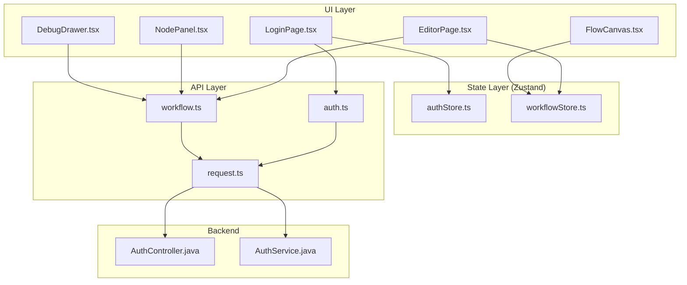
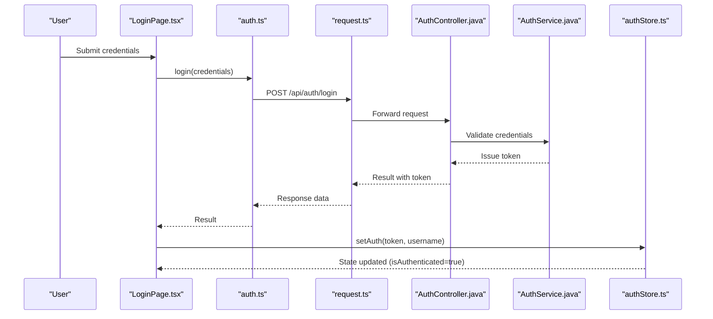
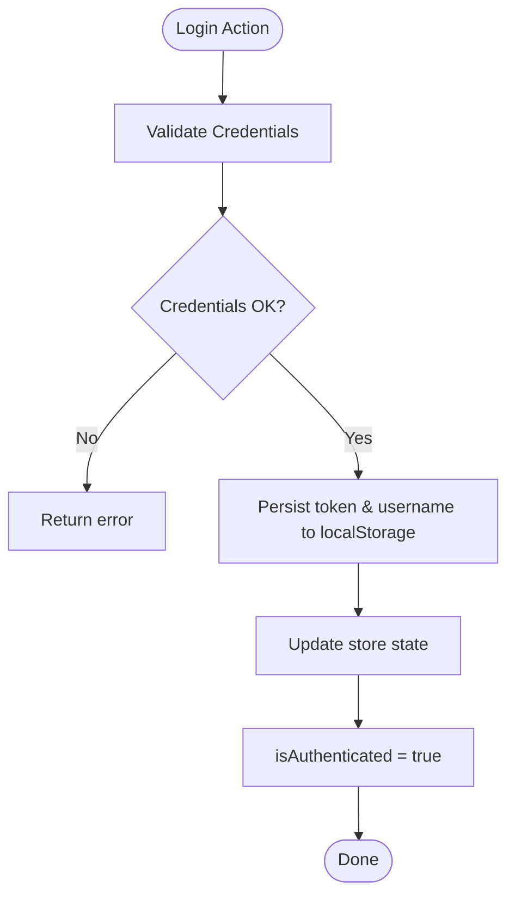
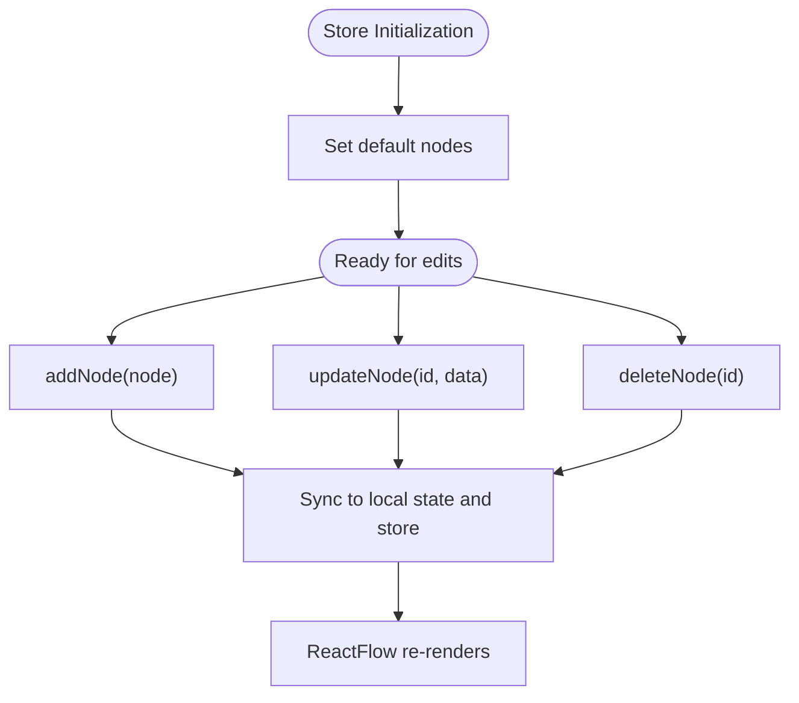
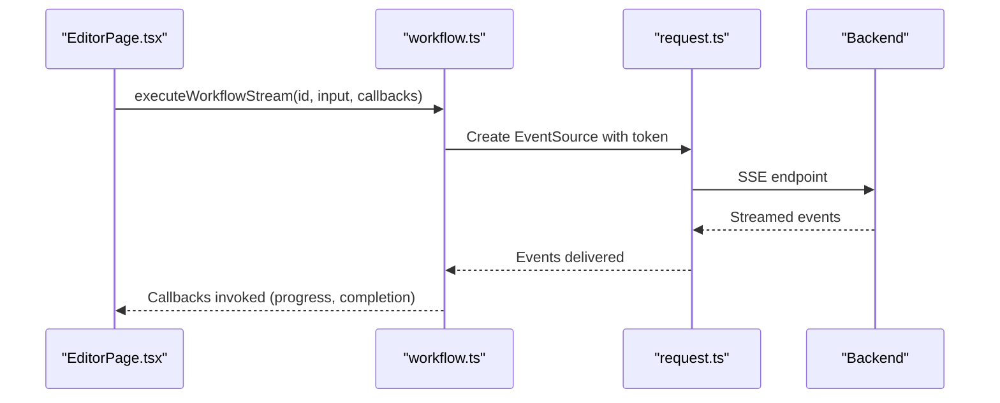
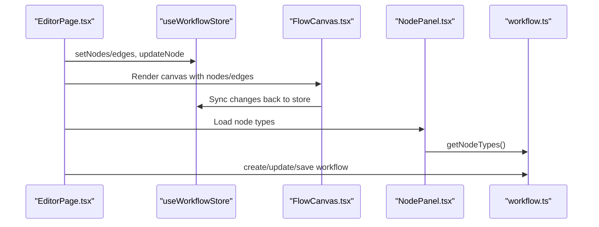
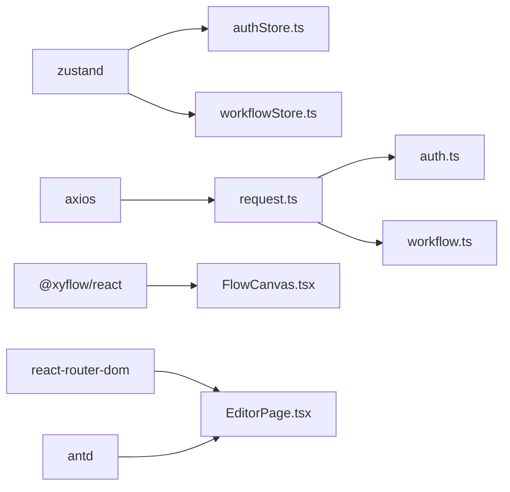

# State Management

<cite>
**Referenced Files in This Document**
- [authStore.ts](file://frontend/src/store/authStore.ts)
- [workflowStore.ts](file://frontend/src/store/workflowStore.ts)
- [auth.ts](file://frontend/src/api/auth.ts)
- [workflow.ts](file://frontend/src/api/workflow.ts)
- [request.ts](file://frontend/src/utils/request.ts)
- [LoginPage.tsx](file://frontend/src/pages/LoginPage.tsx)
- [EditorPage.tsx](file://frontend/src/pages/EditorPage.tsx)
- [FlowCanvas.tsx](file://frontend/src/components/FlowCanvas.tsx)
- [NodePanel.tsx](file://frontend/src/components/NodePanel.tsx)
- [DebugDrawer.tsx](file://frontend/src/components/DebugDrawer.tsx)
- [AuthController.java](file://backend/src/main/java/com/paiagent/controller/AuthController.java)
- [AuthService.java](file://backend/src/main/java/com/paiagent/service/AuthService.java)
- [package.json](file://frontend/package.json)
</cite>

## Table of Contents
1. [Introduction](#introduction)
2. [Project Structure](#project-structure)
3. [Core Components](#core-components)
4. [Architecture Overview](#architecture-overview)
5. [Detailed Component Analysis](#detailed-component-analysis)
6. [Dependency Analysis](#dependency-analysis)
7. [Performance Considerations](#performance-considerations)
8. [Troubleshooting Guide](#troubleshooting-guide)
9. [Conclusion](#conclusion)

## Introduction
This document explains the Zustand-based state management system used in the frontend. It covers:
- Authentication state via authStore, including login/logout actions and token lifecycle
- Workflow editing state via workflowStore, including canvas nodes/edges, selection, and node configuration
- State selectors, action creators, and persistence strategies
- Integration patterns with React components
- Async state updates and synchronization with backend APIs
- State hydration, middleware usage, and debugging techniques

## Project Structure
The state management spans three layers:
- Stores: Zustand-backed stores for authentication and workflow editing
- API Layer: Axios-based HTTP client with interceptors and typed API endpoints
- UI Layer: React components that consume stores and drive async operations

**Diagram sources**
- [authStore.ts:1-31](file://frontend/src/store/authStore.ts#L1-L31)
- [workflowStore.ts:1-70](file://frontend/src/store/workflowStore.ts#L1-L70)
- [auth.ts:1-41](file://frontend/src/api/auth.ts#L1-L41)
- [workflow.ts:1-177](file://frontend/src/api/workflow.ts#L1-L177)
- [request.ts:1-49](file://frontend/src/utils/request.ts#L1-L49)
- [LoginPage.tsx:1-89](file://frontend/src/pages/LoginPage.tsx#L1-L89)
- [EditorPage.tsx:1-1396](file://frontend/src/pages/EditorPage.tsx#L1-L1396)
- [FlowCanvas.tsx:1-165](file://frontend/src/components/FlowCanvas.tsx#L1-L165)
- [NodePanel.tsx:1-112](file://frontend/src/components/NodePanel.tsx#L1-L112)
- [DebugDrawer.tsx:1-395](file://frontend/src/components/DebugDrawer.tsx#L1-L395)
- [AuthController.java:1-62](file://backend/src/main/java/com/paiagent/controller/AuthController.java#L1-L62)
- [AuthService.java:1-63](file://backend/src/main/java/com/paiagent/service/AuthService.java#L1-L63)

**Section sources**
- [authStore.ts:1-31](file://frontend/src/store/authStore.ts#L1-L31)
- [workflowStore.ts:1-70](file://frontend/src/store/workflowStore.ts#L1-L70)
- [auth.ts:1-41](file://frontend/src/api/auth.ts#L1-L41)
- [workflow.ts:1-177](file://frontend/src/api/workflow.ts#L1-L177)
- [request.ts:1-49](file://frontend/src/utils/request.ts#L1-L49)
- [AuthController.java:1-62](file://backend/src/main/java/com/paiagent/controller/AuthController.java#L1-L62)
- [AuthService.java:1-63](file://backend/src/main/java/com/paiagent/service/AuthService.java#L1-L63)

## Core Components
- authStore: Holds token, username, and isAuthenticated flag; exposes setAuth and clearAuth actions; persists to localStorage
- workflowStore: Manages nodes, edges, selectedNode, currentWorkflowId; exposes setters and CRUD-like actions for nodes; initializes with default nodes

Key capabilities:
- Local storage hydration on initialization
- Action-driven updates with immutable patterns
- Seamless integration with React components via hooks

**Section sources**
- [authStore.ts:14-30](file://frontend/src/store/authStore.ts#L14-L30)
- [workflowStore.ts:34-69](file://frontend/src/store/workflowStore.ts#L34-L69)

## Architecture Overview
The system follows a unidirectional data flow:
- UI triggers actions (login, save workflow, execute)
- Stores update state synchronously
- API layer performs async requests with interceptors
- Backend validates tokens and serves data
- UI reacts to state changes and renders updated views

**Diagram sources**
- [LoginPage.tsx:16-32](file://frontend/src/pages/LoginPage.tsx#L16-L32)
- [auth.ts:24-26](file://frontend/src/api/auth.ts#L24-L26)
- [request.ts:17-29](file://frontend/src/utils/request.ts#L17-L29)
- [AuthController.java:25-35](file://backend/src/main/java/com/paiagent/controller/AuthController.java#L25-L35)
- [AuthService.java:33-40](file://backend/src/main/java/com/paiagent/service/AuthService.java#L33-L40)
- [authStore.ts:19-29](file://frontend/src/store/authStore.ts#L19-L29)

## Detailed Component Analysis

### Authentication Store (authStore)
Responsibilities:
- Initialize from localStorage
- Persist token and username on login
- Clear token and username on logout
- Expose isAuthenticated derived state

Selectors and actions:
- Selectors: token, username, isAuthenticated
- Actions: setAuth(token, username), clearAuth()

Persistence strategy:
- localStorage keys: token, username
- Hydration occurs at store creation

**Diagram sources**
- [authStore.ts:19-29](file://frontend/src/store/authStore.ts#L19-L29)
- [authStore.ts:14-17](file://frontend/src/store/authStore.ts#L14-L17)

**Section sources**
- [authStore.ts:3-9](file://frontend/src/store/authStore.ts#L3-L9)
- [authStore.ts:14-30](file://frontend/src/store/authStore.ts#L14-L30)

### Workflow Editing Store (workflowStore)
Responsibilities:
- Manage nodes and edges for the canvas
- Track selectedNode and currentWorkflowId
- Provide CRUD-like actions for nodes
- Initialize with default nodes

Actions:
- setNodes(nodes), setEdges(edges), setSelectedNode(node), setCurrentWorkflowId(id)
- addNode(node), updateNode(id, data), deleteNode(id), clear()

**Diagram sources**
- [workflowStore.ts:19-32](file://frontend/src/store/workflowStore.ts#L19-L32)
- [workflowStore.ts:34-69](file://frontend/src/store/workflowStore.ts#L34-L69)

**Section sources**
- [workflowStore.ts:4-17](file://frontend/src/store/workflowStore.ts#L4-L17)
- [workflowStore.ts:34-69](file://frontend/src/store/workflowStore.ts#L34-L69)

### API Layer and Interceptors
- request.ts creates an Axios instance with base URL and timeout
- Request interceptor attaches Authorization header when token exists
- Response interceptor handles 401 by clearing token and redirecting to login
- auth.ts defines login/logout/getCurrentUser endpoints
- workflow.ts defines node types, workflow CRUD, execution, and server-sent events streaming

**Diagram sources**
- [workflow.ts:96-177](file://frontend/src/api/workflow.ts#L96-L177)
- [request.ts:17-46](file://frontend/src/utils/request.ts#L17-L46)
- [EditorPage.tsx:256-268](file://frontend/src/pages/EditorPage.tsx#L256-L268)

**Section sources**
- [request.ts:6-12](file://frontend/src/utils/request.ts#L6-L12)
- [request.ts:17-46](file://frontend/src/utils/request.ts#L17-L46)
- [auth.ts:24-40](file://frontend/src/api/auth.ts#L24-L40)
- [workflow.ts:40-177](file://frontend/src/api/workflow.ts#L40-L177)

### UI Integration Patterns
- LoginPage.tsx uses useAuthStore to set credentials after successful login
- EditorPage.tsx consumes useWorkflowStore for nodes/edges and useAuthStore for username/clearAuth
- FlowCanvas.tsx bridges Zustand store and ReactFlow, syncing nodes/edges bidirectionally
- NodePanel.tsx loads node types from workflow.getNodeTypes
- DebugDrawer.tsx executes workflows via workflow.executeWorkflowStream and displays progress

**Diagram sources**
- [EditorPage.tsx:50-52](file://frontend/src/pages/EditorPage.tsx#L50-L52)
- [EditorPage.tsx:136-198](file://frontend/src/pages/EditorPage.tsx#L136-L198)
- [FlowCanvas.tsx:28-50](file://frontend/src/components/FlowCanvas.tsx#L28-L50)
- [NodePanel.tsx:16-37](file://frontend/src/components/NodePanel.tsx#L16-L37)
- [workflow.ts:47-77](file://frontend/src/api/workflow.ts#L47-L77)

**Section sources**
- [LoginPage.tsx:14-32](file://frontend/src/pages/LoginPage.tsx#L14-L32)
- [EditorPage.tsx:48-283](file://frontend/src/pages/EditorPage.tsx#L48-L283)
- [FlowCanvas.tsx:27-90](file://frontend/src/components/FlowCanvas.tsx#L27-L90)
- [NodePanel.tsx:12-37](file://frontend/src/components/NodePanel.tsx#L12-L37)
- [DebugDrawer.tsx:35-175](file://frontend/src/components/DebugDrawer.tsx#L35-L175)

### State Hydration, Middleware, and Debugging
- Hydration: authStore hydrates from localStorage on startup; workflowStore initializes defaults
- Middleware: request.ts interceptors handle auth headers and 401 redirects
- Debugging: extensive console logging in EditorPage and FlowCanvas; DebugDrawer logs execution events and node statuses

Recommendations:
- Consider zustand devtools for advanced debugging
- For production, add structured logging and error boundaries
- For scalability, consider splitting stores and adding middleware for analytics

**Section sources**
- [authStore.ts:14-17](file://frontend/src/store/authStore.ts#L14-L17)
- [workflowStore.ts:34-38](file://frontend/src/store/workflowStore.ts#L34-L38)
- [request.ts:17-46](file://frontend/src/utils/request.ts#L17-L46)
- [EditorPage.tsx:96-133](file://frontend/src/pages/EditorPage.tsx#L96-L133)
- [FlowCanvas.tsx:33-50](file://frontend/src/components/FlowCanvas.tsx#L33-L50)
- [DebugDrawer.tsx:43-175](file://frontend/src/components/DebugDrawer.tsx#L43-L175)

## Dependency Analysis
- Frontend dependencies include zustand, axios, antd, @xyflow/react, react-router-dom
- authStore depends on localStorage for persistence
- workflowStore depends on @xyflow/react types for nodes/edges
- API layer depends on request.ts interceptors for auth and error handling
- Backend provides token-based authentication and workflow CRUD

**Diagram sources**
- [package.json:12-20](file://frontend/package.json#L12-L20)
- [authStore.ts:1](file://frontend/src/store/authStore.ts#L1)
- [workflowStore.ts:1](file://frontend/src/store/workflowStore.ts#L1)
- [request.ts:1](file://frontend/src/utils/request.ts#L1)
- [auth.ts:1](file://frontend/src/api/auth.ts#L1)
- [workflow.ts:1](file://frontend/src/api/workflow.ts#L1)
- [FlowCanvas.tsx:1](file://frontend/src/components/FlowCanvas.tsx#L1)
- [EditorPage.tsx:1](file://frontend/src/pages/EditorPage.tsx#L1)

**Section sources**
- [package.json:12-20](file://frontend/package.json#L12-L20)
- [authStore.ts:1](file://frontend/src/store/authStore.ts#L1)
- [workflowStore.ts:1](file://frontend/src/store/workflowStore.ts#L1)
- [request.ts:1](file://frontend/src/utils/request.ts#L1)
- [auth.ts:1](file://frontend/src/api/auth.ts#L1)
- [workflow.ts:1](file://frontend/src/api/workflow.ts#L1)
- [FlowCanvas.tsx:1](file://frontend/src/components/FlowCanvas.tsx#L1)
- [EditorPage.tsx:1](file://frontend/src/pages/EditorPage.tsx#L1)

## Performance Considerations
- Prefer granular selectors to minimize re-renders
- Batch updates when modifying many nodes/edges
- Debounce autosave operations (already implemented in EditorPage)
- Use shallow comparisons for props passed to ReactFlow to avoid unnecessary updates
- Limit excessive logging in production builds

## Troubleshooting Guide
Common issues and resolutions:
- Unauthenticated requests: 401 clears token and redirects to login via response interceptor
- Missing token during execution: workflow.executeWorkflowStream checks token and redirects to login
- Canvas not updating: ensure FlowCanvas syncs local state back to store after ReactFlow changes
- Autosave not triggering: verify useEffect timers and debounce logic in EditorPage

**Section sources**
- [request.ts:34-46](file://frontend/src/utils/request.ts#L34-L46)
- [workflow.ts:103-110](file://frontend/src/api/workflow.ts#L103-L110)
- [FlowCanvas.tsx:52-72](file://frontend/src/components/FlowCanvas.tsx#L52-L72)
- [EditorPage.tsx:649-691](file://frontend/src/pages/EditorPage.tsx#L649-L691)

## Conclusion
The Zustand-based state management provides a clean separation of concerns:
- authStore manages authentication state with localStorage hydration and simple actions
- workflowStore encapsulates editing state with intuitive actions and default initialization
- The API layer centralizes HTTP logic with interceptors for auth and error handling
- UI components integrate seamlessly with stores and APIs, enabling robust async workflows and real-time execution feedback