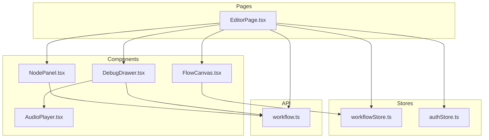
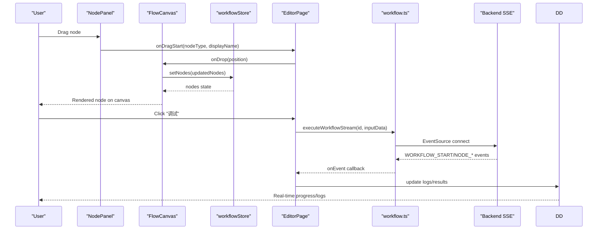
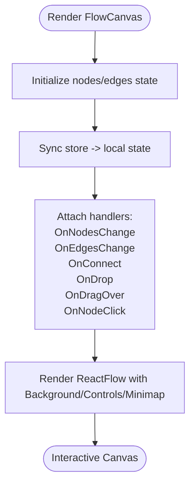
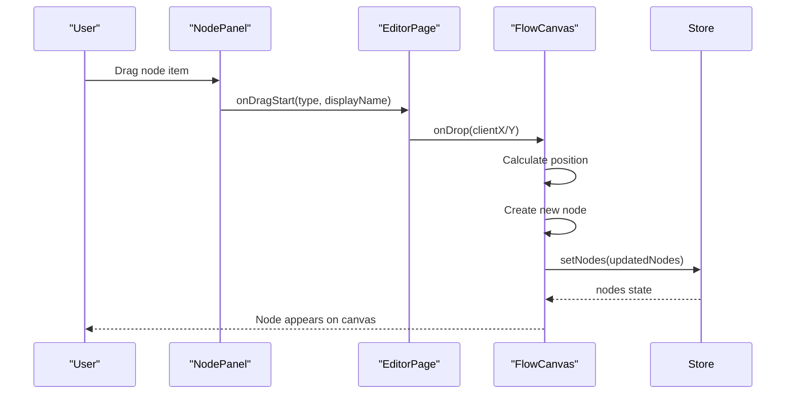
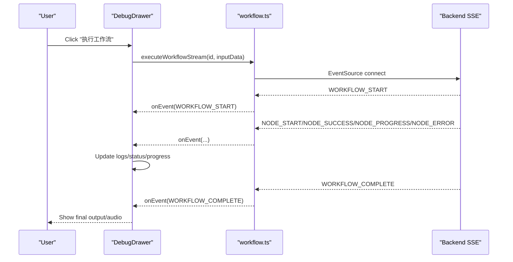
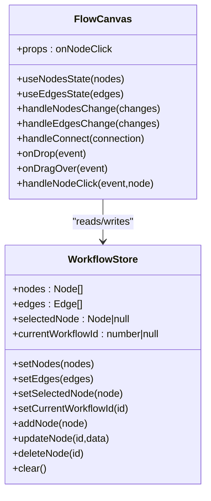
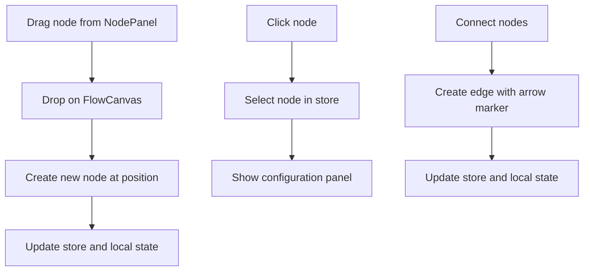
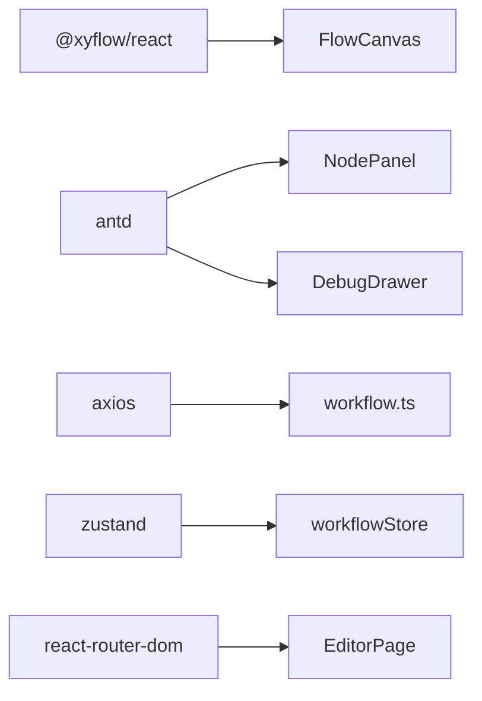

# Workflow Editor

<cite>
**Referenced Files in This Document**
- [FlowCanvas.tsx](file://frontend/src/components/FlowCanvas.tsx)
- [NodePanel.tsx](file://frontend/src/components/NodePanel.tsx)
- [DebugDrawer.tsx](file://frontend/src/components/DebugDrawer.tsx)
- [EditorPage.tsx](file://frontend/src/pages/EditorPage.tsx)
- [workflowStore.ts](file://frontend/src/store/workflowStore.ts)
- [authStore.ts](file://frontend/src/store/authStore.ts)
- [workflow.ts](file://frontend/src/api/workflow.ts)
- [AudioPlayer.tsx](file://frontend/src/components/AudioPlayer.tsx)
- [package.json](file://frontend/package.json)
</cite>

## Table of Contents
1. [Introduction](#introduction)
2. [Project Structure](#project-structure)
3. [Core Components](#core-components)
4. [Architecture Overview](#architecture-overview)
5. [Detailed Component Analysis](#detailed-component-analysis)
6. [Dependency Analysis](#dependency-analysis)
7. [Performance Considerations](#performance-considerations)
8. [Troubleshooting Guide](#troubleshooting-guide)
9. [Conclusion](#conclusion)

## Introduction
This document describes the workflow editor system built with React Flow. It covers the FlowCanvas component for rendering nodes and edges, the NodePanel drag-and-drop system for adding nodes, the DebugDrawer real-time execution monitoring interface, and the overall React Flow configuration and state synchronization. The system integrates with a backend service to persist workflows and stream execution events during debugging.

## Project Structure
The frontend is organized around a page-driven architecture with dedicated components for canvas, panel, and debugging, plus stores for state management and API bindings for workflow operations.

**Diagram sources**
- [EditorPage.tsx:1-1396](file://frontend/src/pages/EditorPage.tsx#L1-L1396)
- [NodePanel.tsx:1-112](file://frontend/src/components/NodePanel.tsx#L1-L112)
- [FlowCanvas.tsx:1-165](file://frontend/src/components/FlowCanvas.tsx#L1-L165)
- [DebugDrawer.tsx:1-395](file://frontend/src/components/DebugDrawer.tsx#L1-L395)
- [AudioPlayer.tsx:1-123](file://frontend/src/components/AudioPlayer.tsx#L1-L123)
- [workflowStore.ts:1-70](file://frontend/src/store/workflowStore.ts#L1-L70)
- [authStore.ts:1-31](file://frontend/src/store/authStore.ts#L1-L31)
- [workflow.ts:1-177](file://frontend/src/api/workflow.ts#L1-L177)

**Section sources**
- [EditorPage.tsx:1-1396](file://frontend/src/pages/EditorPage.tsx#L1-L1396)
- [package.json:1-40](file://frontend/package.json#L1-L40)

## Core Components
- FlowCanvas: Renders the React Flow canvas, manages nodes/edges, handles drag-and-drop placement, connects nodes, and synchronizes state with the workflow store.
- NodePanel: Loads node definitions from the backend and exposes draggable nodes categorized by type.
- DebugDrawer: Provides a real-time execution monitor that streams events from the backend and displays progress, logs, and results.
- EditorPage: Orchestrates the UI layout, handles drag-and-drop from the panel to the canvas, saves/loads workflows, and opens the debug drawer.
- Stores: workflowStore maintains nodes, edges, selection, and current workflow ID; authStore manages authentication state.
- API: workflow.ts defines typed interfaces and functions for CRUD operations and streaming execution.

**Section sources**
- [FlowCanvas.tsx:1-165](file://frontend/src/components/FlowCanvas.tsx#L1-L165)
- [NodePanel.tsx:1-112](file://frontend/src/components/NodePanel.tsx#L1-L112)
- [DebugDrawer.tsx:1-395](file://frontend/src/components/DebugDrawer.tsx#L1-L395)
- [EditorPage.tsx:1-1396](file://frontend/src/pages/EditorPage.tsx#L1-L1396)
- [workflowStore.ts:1-70](file://frontend/src/store/workflowStore.ts#L1-L70)
- [authStore.ts:1-31](file://frontend/src/store/authStore.ts#L1-L31)
- [workflow.ts:1-177](file://frontend/src/api/workflow.ts#L1-L177)

## Architecture Overview
The system uses React Flow for visualization and zustand for state management. Drag-and-drop from NodePanel populates FlowCanvas nodes. Changes to nodes/edges are synchronized bidirectionally between local React Flow state and the workflow store. The debug drawer streams execution events from the backend and updates the UI in real time.

**Diagram sources**
- [NodePanel.tsx:89-93](file://frontend/src/components/NodePanel.tsx#L89-L93)
- [EditorPage.tsx:88-93](file://frontend/src/pages/EditorPage.tsx#L88-L93)
- [FlowCanvas.tsx:93-122](file://frontend/src/components/FlowCanvas.tsx#L93-L122)
- [workflowStore.ts:34-69](file://frontend/src/store/workflowStore.ts#L34-L69)
- [workflow.ts:96-177](file://frontend/src/api/workflow.ts#L96-L177)
- [DebugDrawer.tsx:48-175](file://frontend/src/components/DebugDrawer.tsx#L48-L175)

## Detailed Component Analysis

### FlowCanvas Component
FlowCanvas renders the React Flow canvas with background grid, controls, and minimap. It manages:
- Nodes and edges state via useNodesState/useEdgesState hooks
- Bidirectional synchronization with the workflow store
- Drag-and-drop placement from the NodePanel
- Edge creation with arrow markers
- Node click handling

Key behaviors:
- Synchronizes store nodes/edges to local state and vice versa
- Adds arrow markers to edges and default edges
- Handles drop events to create new nodes at the drop position
- Uses fitView to center the canvas

**Diagram sources**
- [FlowCanvas.tsx:27-161](file://frontend/src/components/FlowCanvas.tsx#L27-L161)

**Section sources**
- [FlowCanvas.tsx:20-165](file://frontend/src/components/FlowCanvas.tsx#L20-L165)
- [workflowStore.ts:4-17](file://frontend/src/store/workflowStore.ts#L4-L17)

### NodePanel Drag-and-Drop System
NodePanel loads node definitions from the backend and presents them in collapsible categories. Each node item is draggable with metadata stored in the data transfer object. EditorPage sets up the drag start handler to pass node type and display name to FlowCanvas.

Implementation highlights:
- Loads node types on mount via getNodeTypes
- Groups nodes by category (LLM, TOOL)
- Renders draggable items with icons and labels
- Uses Collapse for expandable sections

**Diagram sources**
- [NodePanel.tsx:12-37](file://frontend/src/components/NodePanel.tsx#L12-L37)
- [EditorPage.tsx:88-93](file://frontend/src/pages/EditorPage.tsx#L88-L93)
- [FlowCanvas.tsx:93-122](file://frontend/src/components/FlowCanvas.tsx#L93-L122)

**Section sources**
- [NodePanel.tsx:1-112](file://frontend/src/components/NodePanel.tsx#L1-L112)
- [EditorPage.tsx:88-93](file://frontend/src/pages/EditorPage.tsx#L88-L93)
- [workflow.ts:40-42](file://frontend/src/api/workflow.ts#L40-L42)

### DebugDrawer Real-Time Execution Monitoring
DebugDrawer provides a right-side drawer with:
- Input area for test data
- Execution status with progress percentage
- Collapsible node results with input/output previews
- Final output display (audio player or JSON)
- Timeline logs with colored entries
- Streamed execution events from the backend

Execution flow:
- Validates current workflow ID and input
- Calls executeWorkflowStream with callbacks
- Updates logs and node status map per event
- Computes progress percentage
- Displays final output and audio player when available

**Diagram sources**
- [DebugDrawer.tsx:35-175](file://frontend/src/components/DebugDrawer.tsx#L35-L175)
- [workflow.ts:96-177](file://frontend/src/api/workflow.ts#L96-L177)

**Section sources**
- [DebugDrawer.tsx:1-395](file://frontend/src/components/DebugDrawer.tsx#L1-L395)
- [AudioPlayer.tsx:1-123](file://frontend/src/components/AudioPlayer.tsx#L1-L123)
- [workflow.ts:86-177](file://frontend/src/api/workflow.ts#L86-L177)

### React Flow Configuration and State Synchronization
- React Flow is configured with default edge options including arrow markers and fitView enabled.
- Nodes and edges are managed by React Flow hooks and synchronized with the workflow store.
- The store provides setters for nodes/edges and maintains current workflow ID and selected node.

**Diagram sources**
- [FlowCanvas.tsx:27-161](file://frontend/src/components/FlowCanvas.tsx#L27-L161)
- [workflowStore.ts:34-69](file://frontend/src/store/workflowStore.ts#L34-L69)

**Section sources**
- [FlowCanvas.tsx:136-161](file://frontend/src/components/FlowCanvas.tsx#L136-L161)
- [workflowStore.ts:19-69](file://frontend/src/store/workflowStore.ts#L19-L69)

### User Interaction Patterns and Canvas Manipulation
- Drag-and-drop: NodePanel items are dragged onto FlowCanvas to create nodes.
- Node selection: Clicking a node selects it and opens configuration in the right panel.
- Edge creation: Connecting nodes creates edges with arrow markers.
- Pan and zoom: Controls and minimap enable navigation.
- Saving/loading: Workflows are persisted to the backend and reloaded by ID.

**Diagram sources**
- [NodePanel.tsx:43-55](file://frontend/src/components/NodePanel.tsx#L43-L55)
- [FlowCanvas.tsx:93-122](file://frontend/src/components/FlowCanvas.tsx#L93-L122)
- [EditorPage.tsx:96-133](file://frontend/src/pages/EditorPage.tsx#L96-L133)
- [FlowCanvas.tsx:74-90](file://frontend/src/components/FlowCanvas.tsx#L74-L90)

**Section sources**
- [EditorPage.tsx:88-133](file://frontend/src/pages/EditorPage.tsx#L88-L133)
- [FlowCanvas.tsx:93-134](file://frontend/src/components/FlowCanvas.tsx#L93-L134)

## Dependency Analysis
External libraries and their roles:
- @xyflow/react: Core React Flow rendering and interaction
- antd: UI components (Drawer, Button, Input, Timeline, Progress, etc.)
- axios: HTTP client for API requests
- zustand: Lightweight state management for stores
- react-router-dom: Navigation and routing

**Diagram sources**
- [package.json:12-21](file://frontend/package.json#L12-L21)
- [FlowCanvas.tsx:1-16](file://frontend/src/components/FlowCanvas.tsx#L1-L16)
- [NodePanel.tsx:1-3](file://frontend/src/components/NodePanel.tsx#L1-L3)
- [DebugDrawer.tsx:1-6](file://frontend/src/components/DebugDrawer.tsx#L1-L6)
- [workflow.ts:1-2](file://frontend/src/api/workflow.ts#L1-L2)
- [workflowStore.ts:1-2](file://frontend/src/store/workflowStore.ts#L1-L2)
- [EditorPage.tsx:1-11](file://frontend/src/pages/EditorPage.tsx#L1-L11)

**Section sources**
- [package.json:12-21](file://frontend/package.json#L12-L21)

## Performance Considerations
- Debounced auto-save: Configuration changes for output and LLM/TTS nodes are saved with a short debounce to reduce API calls.
- Efficient state updates: React Flow hooks manage local state efficiently; synchronization to the store happens after state updates.
- Streaming execution: EventSource is used for real-time updates, minimizing polling overhead.
- Rendering optimization: Collapse and lazy loading in NodePanel reduce DOM overhead.

[No sources needed since this section provides general guidance]

## Troubleshooting Guide
Common issues and resolutions:
- Authentication errors during execution: The API checks for a token and redirects to login if missing. Ensure the user is logged in and the token is present.
- No nodes appear after dragging: Verify that onDragStart sets both type and label in the data transfer object and that onDrop reads them correctly.
- Edges not appearing: Confirm that defaultEdgeOptions include arrow markers and that handleConnect adds markers when creating edges.
- Debug drawer not updating: Ensure the EventSource listeners are attached and onEvent is invoked for each event type.
- Audio playback failures: Check that the audio URL is valid and accessible; the AudioPlayer component handles play/pause and download actions.

**Section sources**
- [workflow.ts:103-110](file://frontend/src/api/workflow.ts#L103-L110)
- [EditorPage.tsx:88-93](file://frontend/src/pages/EditorPage.tsx#L88-L93)
- [FlowCanvas.tsx:74-90](file://frontend/src/components/FlowCanvas.tsx#L74-L90)
- [DebugDrawer.tsx:163-174](file://frontend/src/components/DebugDrawer.tsx#L163-L174)
- [AudioPlayer.tsx:27-42](file://frontend/src/components/AudioPlayer.tsx#L27-L42)

## Conclusion
The workflow editor integrates React Flow for visualization, zustand for state management, and a backend streaming API for real-time execution monitoring. The NodePanel enables intuitive drag-and-drop creation, while FlowCanvas ensures robust node/edge management and synchronization. The DebugDrawer provides comprehensive feedback during execution, including progress, logs, and final outputs. Together, these components deliver a powerful, user-friendly workflow authoring and testing environment.