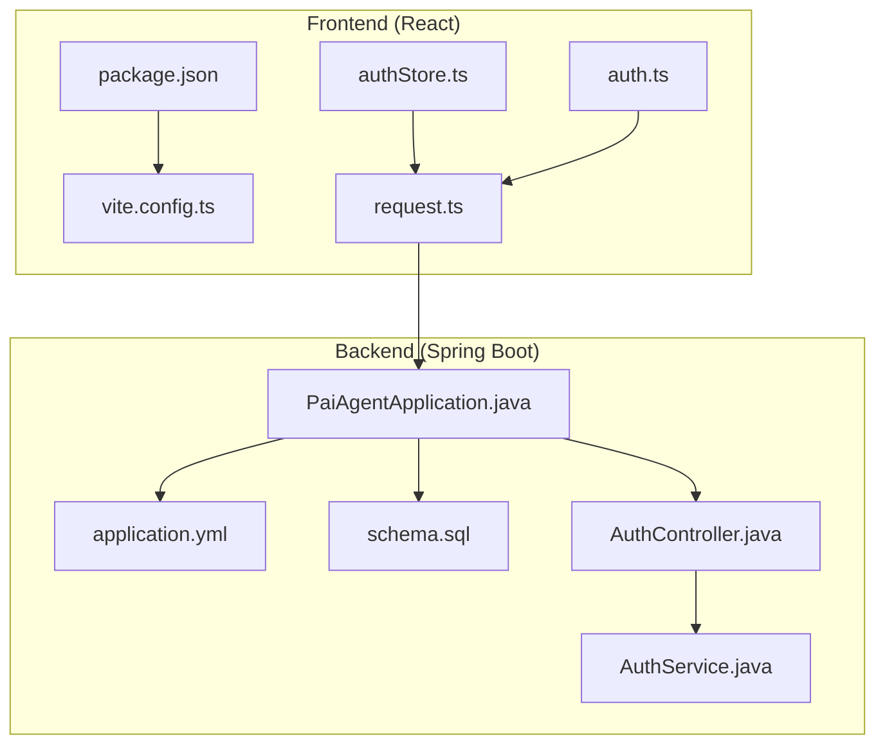
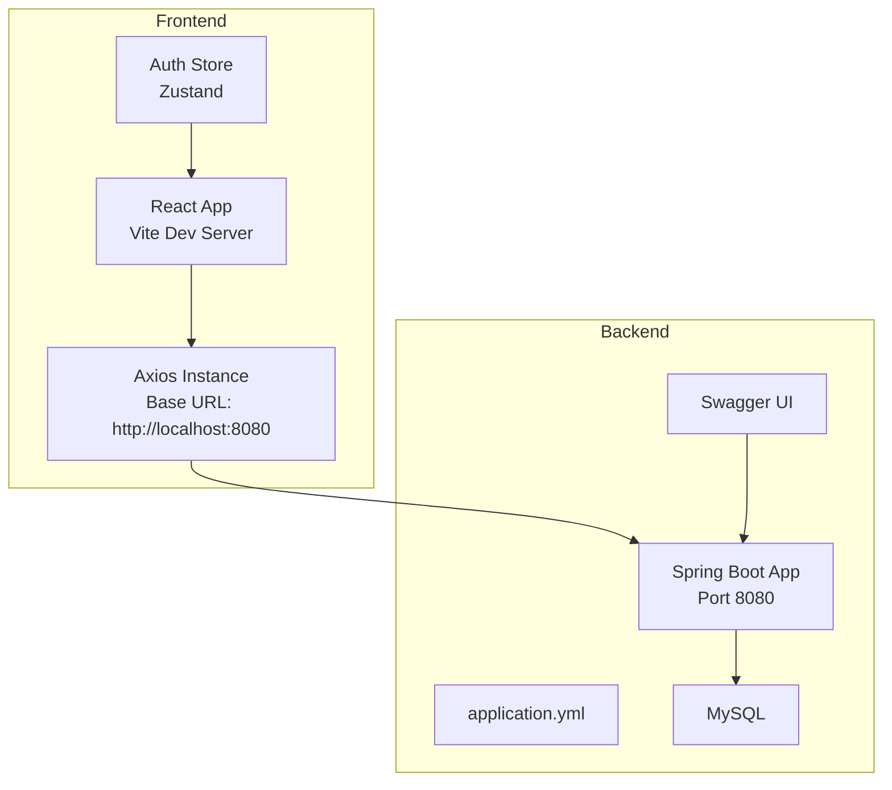

# Getting Started

<cite>
**Referenced Files in This Document**
- [README.md](file://README.md)
- [backend/README.md](file://backend/README.md)
- [AGENTS.md](file://AGENTS.md)
- [backend/pom.xml](file://backend/pom.xml)
- [backend/src/main/resources/application.yml](file://backend/src/main/resources/application.yml)
- [backend/src/main/resources/schema.sql](file://backend/src/main/resources/schema.sql)
- [backend/src/main/resources/migration_add_engine_type.sql](file://backend/src/main/resources/migration_add_engine_type.sql)
- [backend/src/main/java/com/paiagent/PaiAgentApplication.java](file://backend/src/main/java/com/paiagent/PaiAgentApplication.java)
- [backend/src/main/java/com/paiagent/controller/AuthController.java](file://backend/src/main/java/com/paiagent/controller/AuthController.java)
- [backend/src/main/java/com/paiagent/service/AuthService.java](file://backend/src/main/java/com/paiagent/service/AuthService.java)
- [frontend/package.json](file://frontend/package.json)
- [frontend/vite.config.ts](file://frontend/vite.config.ts)
- [frontend/src/utils/request.ts](file://frontend/src/utils/request.ts)
- [frontend/src/store/authStore.ts](file://frontend/src/store/authStore.ts)
- [frontend/src/api/auth.ts](file://frontend/src/api/auth.ts)
</cite>

## Table of Contents
1. [Introduction](#introduction)
2. [Project Structure](#project-structure)
3. [Environment Requirements](#environment-requirements)
4. [Installation Instructions](#installation-instructions)
5. [Database Setup](#database-setup)
6. [Quick Start Guide](#quick-start-guide)
7. [Development Workflow](#development-workflow)
8. [Common Setup Issues and Troubleshooting](#common-setup-issues-and-troubleshooting)
9. [Architecture Overview](#architecture-overview)
10. [Conclusion](#conclusion)

## Introduction
PaiAgent-LangGraph4J is an enterprise-grade AI workflow orchestration platform featuring a visual drag-and-drop editor, a custom DAG execution engine, and support for multiple LLM providers (OpenAI, DeepSeek, Qwen, Zhipu, AIPing) plus tool nodes (TTS, input/output). The platform consists of a Spring Boot backend (Java 21+) and a React 18 + TypeScript frontend, integrated with MySQL for persistence and optional MinIO for file storage.

## Project Structure
The repository is organized into two primary modules:
- backend: Spring Boot application with controllers, services, mappers, engines, and configuration
- frontend: React application with components for the visual editor, state management, and API integration

**Diagram sources**
- [backend/src/main/java/com/paiagent/PaiAgentApplication.java:1-16](file://backend/src/main/java/com/paiagent/PaiAgentApplication.java#L1-L16)
- [backend/src/main/resources/application.yml:1-55](file://backend/src/main/resources/application.yml#L1-L55)
- [backend/src/main/resources/schema.sql:1-84](file://backend/src/main/resources/schema.sql#L1-L84)
- [backend/src/main/java/com/paiagent/controller/AuthController.java:1-62](file://backend/src/main/java/com/paiagent/controller/AuthController.java#L1-L62)
- [backend/src/main/java/com/paiagent/service/AuthService.java:1-63](file://backend/src/main/java/com/paiagent/service/AuthService.java#L1-L63)
- [frontend/package.json:1-40](file://frontend/package.json#L1-L40)
- [frontend/vite.config.ts:1-8](file://frontend/vite.config.ts#L1-L8)
- [frontend/src/utils/request.ts:1-49](file://frontend/src/utils/request.ts#L1-L49)
- [frontend/src/store/authStore.ts:1-31](file://frontend/src/store/authStore.ts#L1-L31)
- [frontend/src/api/auth.ts:1-41](file://frontend/src/api/auth.ts#L1-L41)

**Section sources**
- [README.md:220-282](file://README.md#L220-L282)
- [backend/README.md:62-75](file://backend/README.md#L62-L75)
- [AGENTS.md:43-85](file://AGENTS.md#L43-L85)

## Environment Requirements
Ensure your environment meets the following prerequisites before installation:
- Java 21+ (required by Spring Boot 3.4.1 and Java compiler settings)
- Node.js 18+ (with npm)
- MySQL 8.0+ (for relational data persistence)
- Maven 3.8+ (for building the backend)

These requirements are enforced by the project configuration and documented in the repository materials.

**Section sources**
- [README.md:286-296](file://README.md#L286-L296)
- [backend/README.md:5-11](file://backend/README.md#L5-L11)
- [backend/pom.xml:29-35](file://backend/pom.xml#L29-L35)
- [frontend/package.json:1-40](file://frontend/package.json#L1-L40)

## Installation Instructions
Follow these steps to install and run the backend and frontend services locally.

### Backend (Spring Boot)
1. Navigate to the backend directory and start the application using Maven:
   - Command: `./mvnw spring-boot:run`
   - Alternatively, run the main class `com.paiagent.PaiAgentApplication` from your IDE
2. Verify the backend is running on port 8080 and Swagger UI is accessible at `http://localhost:8080/swagger-ui.html`

**Section sources**
- [backend/README.md:37-47](file://backend/README.md#L37-L47)
- [backend/src/main/java/com/paiagent/PaiAgentApplication.java:1-16](file://backend/src/main/java/com/paiagent/PaiAgentApplication.java#L1-L16)

### Frontend (React + Vite)
1. Install dependencies:
   - Command: `npm install`
2. Start the development server:
   - Command: `npm run dev`
3. Access the frontend at `http://localhost:5173`

**Section sources**
- [frontend/package.json:6-11](file://frontend/package.json#L6-L11)
- [frontend/vite.config.ts:1-8](file://frontend/vite.config.ts#L1-L8)

## Database Setup
Initialize the database and configure connections as follows:

### Create Database and Import Schema
1. Connect to MySQL as root and create the database:
   - SQL: `CREATE DATABASE IF NOT EXISTS paiagent DEFAULT CHARACTER SET utf8mb4 COLLATE utf8mb4_unicode_ci;`
2. Import the schema:
   - Command: `mysql -u root -p paiagent < backend/src/main/resources/schema.sql`
   - Or manually execute the SQL statements in `schema.sql`

### Configure Database Connection
Edit the backend configuration file to set your MySQL credentials:
- File: `backend/src/main/resources/application.yml`
- Keys to update: `spring.datasource.url`, `spring.datasource.username`, `spring.datasource.password`

Notes:
- The default JDBC driver class is configured
- Jackson timezone and date format are preconfigured
- MyBatis-Plus settings include mapper locations and underscore-to-camel mapping

**Section sources**
- [backend/src/main/resources/schema.sql:1-84](file://backend/src/main/resources/schema.sql#L1-L84)
- [backend/src/main/resources/application.yml:4-28](file://backend/src/main/resources/application.yml#L4-L28)

## Quick Start Guide
Complete this checklist to run your first workflow:

1. Start the backend and frontend services as described above
2. Access the frontend at `http://localhost:5173`
3. Log in using the default credentials:
   - Username: `admin`
   - Password: `123`
4. Create your first workflow:
   - Click "New Workflow"
   - Drag nodes from the left panel (e.g., Input → OpenAI → Output)
   - Connect nodes in sequence
   - Configure node parameters (e.g., set API key and prompt for the OpenAI node)
5. Execute and debug:
   - Click "Debug" to stream execution logs and results
   - View outputs in the Debug Drawer

Optional: To enable the LangGraph4j engine option, apply the migration script:
- Command: `mysql -u root -p paiagent < backend/src/main/resources/migration_add_engine_type.sql`

**Section sources**
- [README.md:365-392](file://README.md#L365-L392)
- [backend/src/main/resources/migration_add_engine_type.sql:1-17](file://backend/src/main/resources/migration_add_engine_type.sql#L1-L17)

## Development Workflow
From cloning to first successful run:

1. Clone the repository
2. Set up the database (create DB and import schema)
3. Configure database credentials in `application.yml`
4. Start the backend with Maven or IDE
5. Install frontend dependencies and start Vite dev server
6. Access the applications and log in with default credentials
7. Build and test as needed using the commands in the repository documentation

**Section sources**
- [README.md:299-372](file://README.md#L299-L372)
- [AGENTS.md:9-27](file://AGENTS.md#L9-L27)

## Common Setup Issues and Troubleshooting
Below are typical problems and their resolutions:

- Backend fails to start due to missing Java 21
  - Cause: Java version lower than 21
  - Fix: Install Java 21+ and ensure your PATH points to the correct runtime

- Frontend dependency errors
  - Cause: Missing Node.js 18+ or npm
  - Fix: Install Node.js 18+ and rerun `npm install`

- Database connection failures
  - Symptoms: Backend startup logs show connection errors
  - Fix: Confirm MySQL is running, the database exists, and credentials in `application.yml` are correct

- Port conflicts
  - Backend port 8080 or frontend port 5173 in use
  - Fix: Stop conflicting processes or adjust ports in backend configuration and frontend dev server settings

- Authentication issues
  - Symptoms: 401 Unauthorized after login
  - Fix: Ensure the Authorization header is present in requests; verify token storage in local storage and Zustand store

- CORS or proxy issues
  - Symptoms: Frontend cannot reach backend APIs
  - Fix: Confirm the frontend base URL matches the backend address; ensure no reverse proxy blocks requests

- Swagger UI not accessible
  - Fix: Verify SpringDoc configuration is enabled and backend is running on port 8080

**Section sources**
- [frontend/src/utils/request.ts:17-46](file://frontend/src/utils/request.ts#L17-L46)
- [frontend/src/store/authStore.ts:14-30](file://frontend/src/store/authStore.ts#L14-L30)
- [backend/src/main/resources/application.yml:36-47](file://backend/src/main/resources/application.yml#L36-L47)

## Architecture Overview
High-level system architecture and component interactions:

**Diagram sources**
- [frontend/src/utils/request.ts:6-12](file://frontend/src/utils/request.ts#L6-L12)
- [frontend/src/store/authStore.ts:14-29](file://frontend/src/store/authStore.ts#L14-L29)
- [backend/src/main/resources/application.yml:1-2](file://backend/src/main/resources/application.yml#L1-L2)
- [backend/src/main/resources/application.yml:36-47](file://backend/src/main/resources/application.yml#L36-L47)

## Conclusion
You now have the environment requirements, installation steps, database setup, and quick start instructions to run PaiAgent-LangGraph4J locally. Use the troubleshooting section to resolve common issues, and refer to the architecture overview to understand how the frontend and backend communicate with the database and each other.