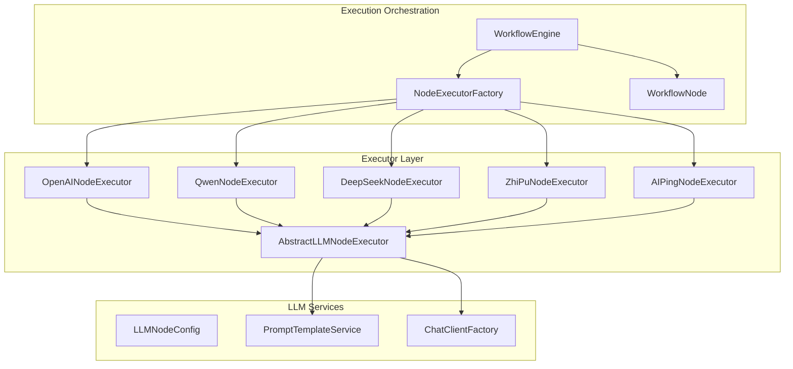
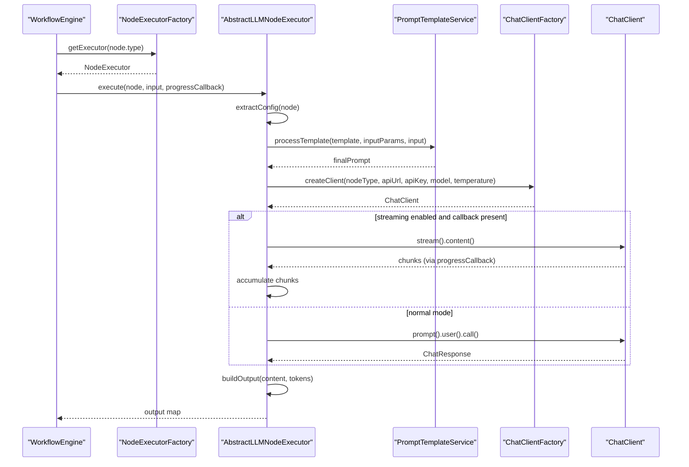
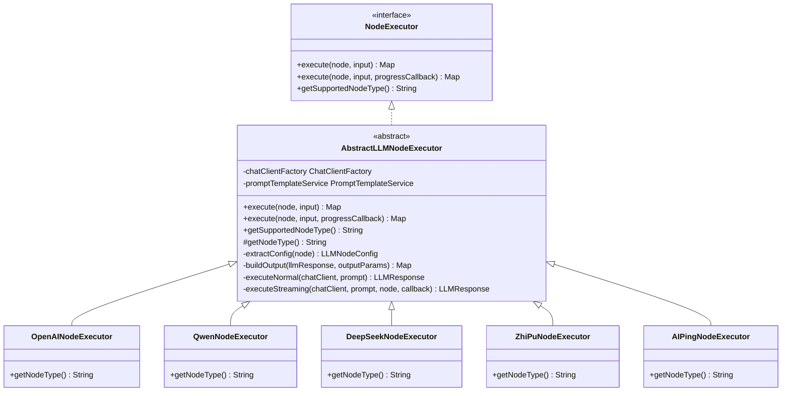
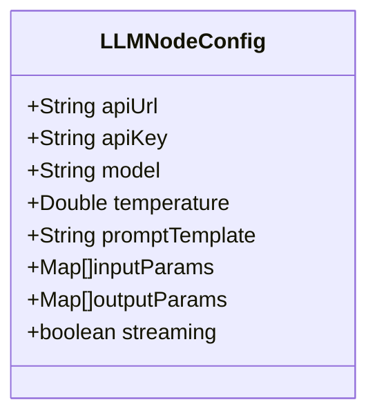
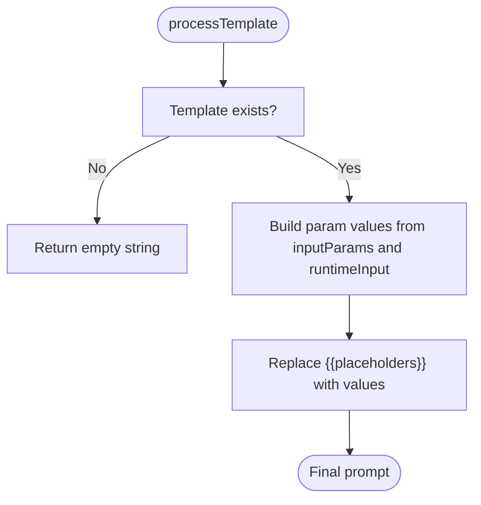
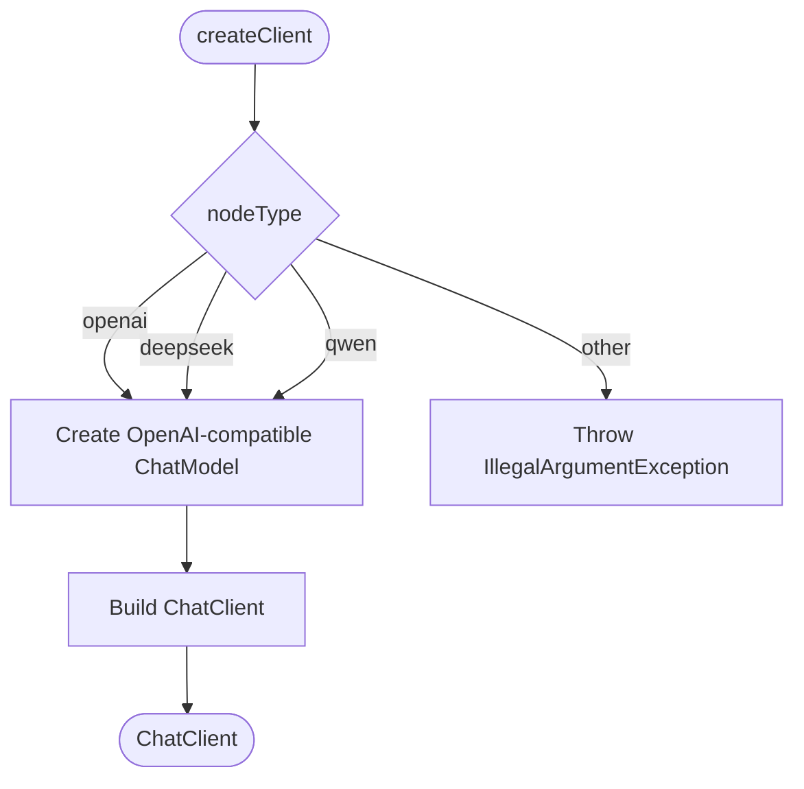
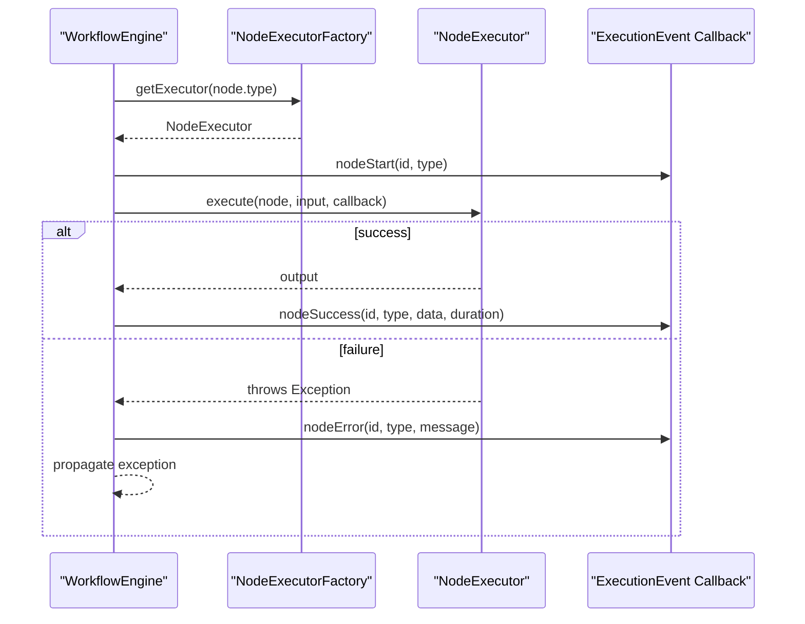
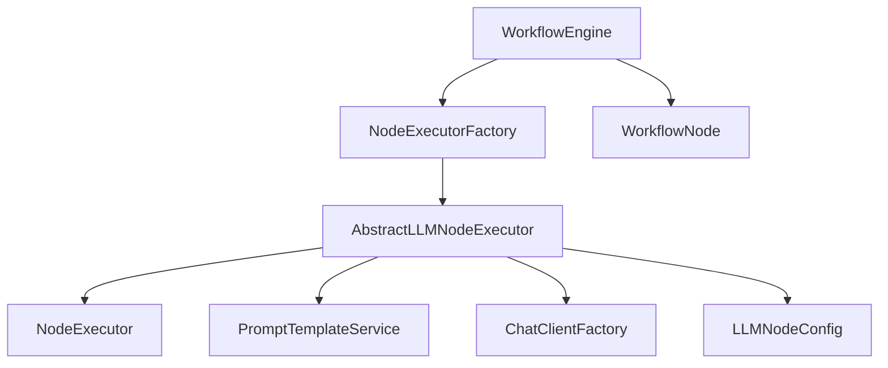

# AbstractLLMNodeExecutor Base Class

<cite>
**Referenced Files in This Document**
- [AbstractLLMNodeExecutor.java](file://backend/src/main/java/com/paiagent/engine/executor/impl/AbstractLLMNodeExecutor.java)
- [OpenAINodeExecutor.java](file://backend/src/main/java/com/paiagent/engine/executor/impl/OpenAINodeExecutor.java)
- [QwenNodeExecutor.java](file://backend/src/main/java/com/paiagent/engine/executor/impl/QwenNodeExecutor.java)
- [DeepSeekNodeExecutor.java](file://backend/src/main/java/com/paiagent/engine/executor/impl/DeepSeekNodeExecutor.java)
- [ZhiPuNodeExecutor.java](file://backend/src/main/java/com/paiagent/engine/executor/impl/ZhiPuNodeExecutor.java)
- [AIPingNodeExecutor.java](file://backend/src/main/java/com/paiagent/engine/executor/impl/AIPingNodeExecutor.java)
- [LLMNodeConfig.java](file://backend/src/main/java/com/paiagent/engine/llm/LLMNodeConfig.java)
- [PromptTemplateService.java](file://backend/src/main/java/com/paiagent/engine/llm/PromptTemplateService.java)
- [ChatClientFactory.java](file://backend/src/main/java/com/paiagent/engine/llm/ChatClientFactory.java)
- [NodeExecutor.java](file://backend/src/main/java/com/paiagent/engine/executor/NodeExecutor.java)
- [NodeExecutorFactory.java](file://backend/src/main/java/com/paiagent/engine/executor/NodeExecutorFactory.java)
- [WorkflowEngine.java](file://backend/src/main/java/com/paiagent/engine/WorkflowEngine.java)
- [WorkflowNode.java](file://backend/src/main/java/com/paiagent/engine/model/WorkflowNode.java)
</cite>

## Table of Contents
1. [Introduction](#introduction)
2. [Project Structure](#project-structure)
3. [Core Components](#core-components)
4. [Architecture Overview](#architecture-overview)
5. [Detailed Component Analysis](#detailed-component-analysis)
6. [Dependency Analysis](#dependency-analysis)
7. [Performance Considerations](#performance-considerations)
8. [Troubleshooting Guide](#troubleshooting-guide)
9. [Conclusion](#conclusion)

## Introduction
This document provides comprehensive documentation for the AbstractLLMNodeExecutor base class, which standardizes LLM node behavior across multiple providers in the workflow execution engine. It explains how the base class unifies configuration extraction, prompt processing, API invocation, and response formatting, while supporting both streaming and non-streaming modes. The document also covers the abstract methods that subclasses must implement, the utility methods provided by the base class, LLM-specific configurations, streaming response handling, error propagation patterns, and guidelines for extending the base class for new LLM providers.

## Project Structure
The AbstractLLMNodeExecutor resides in the executor implementation package alongside provider-specific executors. It collaborates with LLM configuration models, prompt template processing services, and a ChatClient factory to create provider-agnostic LLM execution logic.

**Diagram sources**
- [AbstractLLMNodeExecutor.java:1-231](file://backend/src/main/java/com/paiagent/engine/executor/impl/AbstractLLMNodeExecutor.java#L1-L231)
- [OpenAINodeExecutor.java:1-17](file://backend/src/main/java/com/paiagent/engine/executor/impl/OpenAINodeExecutor.java#L1-L17)
- [QwenNodeExecutor.java:1-17](file://backend/src/main/java/com/paiagent/engine/executor/impl/QwenNodeExecutor.java#L1-L17)
- [DeepSeekNodeExecutor.java:1-17](file://backend/src/main/java/com/paiagent/engine/executor/impl/DeepSeekNodeExecutor.java#L1-L17)
- [ZhiPuNodeExecutor.java:1-17](file://backend/src/main/java/com/paiagent/engine/executor/impl/ZhiPuNodeExecutor.java#L1-L17)
- [AIPingNodeExecutor.java:1-17](file://backend/src/main/java/com/paiagent/engine/executor/impl/AIPingNodeExecutor.java#L1-L17)
- [LLMNodeConfig.java:1-54](file://backend/src/main/java/com/paiagent/engine/llm/LLMNodeConfig.java#L1-L54)
- [PromptTemplateService.java:1-108](file://backend/src/main/java/com/paiagent/engine/llm/PromptTemplateService.java#L1-L108)
- [ChatClientFactory.java:1-60](file://backend/src/main/java/com/paiagent/engine/llm/ChatClientFactory.java#L1-L60)
- [NodeExecutorFactory.java:1-36](file://backend/src/main/java/com/paiagent/engine/executor/NodeExecutorFactory.java#L1-L36)
- [WorkflowEngine.java:1-164](file://backend/src/main/java/com/paiagent/engine/WorkflowEngine.java#L1-L164)
- [WorkflowNode.java:1-38](file://backend/src/main/java/com/paiagent/engine/model/WorkflowNode.java#L1-L38)

**Section sources**
- [AbstractLLMNodeExecutor.java:1-231](file://backend/src/main/java/com/paiagent/engine/executor/impl/AbstractLLMNodeExecutor.java#L1-L231)
- [NodeExecutor.java:1-18](file://backend/src/main/java/com/paiagent/engine/executor/NodeExecutor.java#L1-L18)
- [NodeExecutorFactory.java:1-36](file://backend/src/main/java/com/paiagent/engine/executor/NodeExecutorFactory.java#L1-L36)
- [WorkflowEngine.java:1-164](file://backend/src/main/java/com/paiagent/engine/WorkflowEngine.java#L1-L164)
- [WorkflowNode.java:1-38](file://backend/src/main/java/com/paiagent/engine/model/WorkflowNode.java#L1-L38)

## Core Components
- AbstractLLMNodeExecutor: Provides standardized LLM execution logic, including configuration extraction, prompt processing, ChatClient creation, normal and streaming execution, and output building.
- Provider Executors: Subclasses such as OpenAINodeExecutor, QwenNodeExecutor, DeepSeekNodeExecutor, ZhiPuNodeExecutor, and AIPingNodeExecutor implement the abstract method getNodeType() to specify their provider identifier.
- LLMNodeConfig: Encapsulates LLM-specific configuration including API endpoint, API key, model, temperature, prompt template, input/output parameter mappings, and streaming flag.
- PromptTemplateService: Processes templates by replacing placeholders with values derived from static configuration or upstream node outputs.
- ChatClientFactory: Creates provider-compatible ChatClient instances based on node type and configuration.
- NodeExecutor and NodeExecutorFactory: Define the execution contract and provide a registry for node executors by supported node type.
- WorkflowEngine and WorkflowNode: Orchestrate execution across nodes, passing inputs and progress callbacks to executors.

**Section sources**
- [AbstractLLMNodeExecutor.java:18-231](file://backend/src/main/java/com/paiagent/engine/executor/impl/AbstractLLMNodeExecutor.java#L18-L231)
- [LLMNodeConfig.java:8-54](file://backend/src/main/java/com/paiagent/engine/llm/LLMNodeConfig.java#L8-L54)
- [PromptTemplateService.java:12-108](file://backend/src/main/java/com/paiagent/engine/llm/PromptTemplateService.java#L12-L108)
- [ChatClientFactory.java:11-60](file://backend/src/main/java/com/paiagent/engine/llm/ChatClientFactory.java#L11-L60)
- [NodeExecutor.java:9-18](file://backend/src/main/java/com/paiagent/engine/executor/NodeExecutor.java#L9-L18)
- [NodeExecutorFactory.java:10-36](file://backend/src/main/java/com/paiagent/engine/executor/NodeExecutorFactory.java#L10-L36)
- [WorkflowEngine.java:26-164](file://backend/src/main/java/com/paiagent/engine/WorkflowEngine.java#L26-L164)
- [WorkflowNode.java:6-38](file://backend/src/main/java/com/paiagent/engine/model/WorkflowNode.java#L6-L38)

## Architecture Overview
The AbstractLLMNodeExecutor standardizes LLM execution across providers by:
- Extracting configuration from the node's data map into LLMNodeConfig.
- Processing prompts via PromptTemplateService to produce the final prompt string.
- Creating a provider-agnostic ChatClient using ChatClientFactory.
- Executing either a normal call (non-streaming) or a streaming call, depending on configuration and callback availability.
- Building a unified output map with content and token statistics.

**Diagram sources**
- [WorkflowEngine.java:78-80](file://backend/src/main/java/com/paiagent/engine/WorkflowEngine.java#L78-L80)
- [NodeExecutorFactory.java:28-34](file://backend/src/main/java/com/paiagent/engine/executor/NodeExecutorFactory.java#L28-L34)
- [AbstractLLMNodeExecutor.java:36-89](file://backend/src/main/java/com/paiagent/engine/executor/impl/AbstractLLMNodeExecutor.java#L36-L89)
- [PromptTemplateService.java:30-43](file://backend/src/main/java/com/paiagent/engine/llm/PromptTemplateService.java#L30-L43)
- [ChatClientFactory.java:29-40](file://backend/src/main/java/com/paiagent/engine/llm/ChatClientFactory.java#L29-L40)

## Detailed Component Analysis

### AbstractLLMNodeExecutor Base Class
The base class centralizes LLM execution logic:
- Abstract method: getNodeType() must be implemented by subclasses to identify the provider type.
- Public execute methods: Support both synchronous execution and execution with a progress callback for streaming updates.
- Configuration extraction: extractConfig reads node data to populate LLMNodeConfig with API endpoint, credentials, model, temperature, prompt template, input/output parameter mappings, and streaming flag.
- Prompt processing: Uses PromptTemplateService to replace placeholders with values from static configuration or upstream node outputs.
- ChatClient creation: Delegates to ChatClientFactory to create a provider-compatible client based on node type and configuration.
- Execution modes:
  - Normal execution: Calls ChatClient, extracts content and token usage from response metadata, and returns a unified LLMResponse wrapper.
  - Streaming execution: Streams content chunks, accumulates them, and emits progress events via the provided callback. Token statistics are not available in streaming mode.
- Output building: buildOutput constructs a standardized output map containing content and token metrics, with support for custom output parameter mappings.

**Diagram sources**
- [NodeExecutor.java:9-18](file://backend/src/main/java/com/paiagent/engine/executor/NodeExecutor.java#L9-L18)
- [AbstractLLMNodeExecutor.java:23-231](file://backend/src/main/java/com/paiagent/engine/executor/impl/AbstractLLMNodeExecutor.java#L23-L231)
- [OpenAINodeExecutor.java:10-16](file://backend/src/main/java/com/paiagent/engine/executor/impl/OpenAINodeExecutor.java#L10-L16)
- [QwenNodeExecutor.java:10-16](file://backend/src/main/java/com/paiagent/engine/executor/impl/QwenNodeExecutor.java#L10-L16)
- [DeepSeekNodeExecutor.java:10-16](file://backend/src/main/java/com/paiagent/engine/executor/impl/DeepSeekNodeExecutor.java#L10-L16)
- [ZhiPuNodeExecutor.java:10-16](file://backend/src/main/java/com/paiagent/engine/executor/impl/ZhiPuNodeExecutor.java#L10-L16)
- [AIPingNodeExecutor.java:10-16](file://backend/src/main/java/com/paiagent/engine/executor/impl/AIPingNodeExecutor.java#L10-L16)

**Section sources**
- [AbstractLLMNodeExecutor.java:18-231](file://backend/src/main/java/com/paiagent/engine/executor/impl/AbstractLLMNodeExecutor.java#L18-L231)

### LLMNodeConfig
Encapsulates LLM-specific configuration:
- apiUrl: API endpoint URL.
- apiKey: Authentication key.
- model: Target model identifier.
- temperature: Generation temperature.
- promptTemplate: Template string with placeholders.
- inputParams: Mapping of input parameters (static values or upstream references).
- outputParams: Mapping of output parameters to be populated in the final output.
- streaming: Flag indicating whether streaming mode is enabled.

**Diagram sources**
- [LLMNodeConfig.java:11-54](file://backend/src/main/java/com/paiagent/engine/llm/LLMNodeConfig.java#L11-L54)

**Section sources**
- [LLMNodeConfig.java:8-54](file://backend/src/main/java/com/paiagent/engine/llm/LLMNodeConfig.java#L8-L54)

### PromptTemplateService
Processes prompt templates by:
- Building a parameter value map from static values and upstream node references.
- Replacing placeholders in the template with resolved values.

**Diagram sources**
- [PromptTemplateService.java:30-43](file://backend/src/main/java/com/paiagent/engine/llm/PromptTemplateService.java#L30-L43)

**Section sources**
- [PromptTemplateService.java:12-108](file://backend/src/main/java/com/paiagent/engine/llm/PromptTemplateService.java#L12-L108)

### ChatClientFactory
Creates provider-compatible ChatClient instances:
- Supports node types "openai", "deepseek", and "qwen" by constructing an OpenAI-compatible ChatModel with custom baseUrl, model, and temperature.
- Throws an exception for unsupported node types.

**Diagram sources**
- [ChatClientFactory.java:29-40](file://backend/src/main/java/com/paiagent/engine/llm/ChatClientFactory.java#L29-L40)

**Section sources**
- [ChatClientFactory.java:11-60](file://backend/src/main/java/com/paiagent/engine/llm/ChatClientFactory.java#L11-L60)

### Execution Flow and Error Propagation
The WorkflowEngine orchestrates execution across nodes:
- Resolves the appropriate NodeExecutor via NodeExecutorFactory.
- Invokes execute(node, input, progressCallback) on the executor.
- Emits execution events (start, success, error) and aggregates node results.
- Propagates exceptions thrown by executors up to the caller.

**Diagram sources**
- [WorkflowEngine.java:78-117](file://backend/src/main/java/com/paiagent/engine/WorkflowEngine.java#L78-L117)
- [NodeExecutorFactory.java:28-34](file://backend/src/main/java/com/paiagent/engine/executor/NodeExecutorFactory.java#L28-L34)

**Section sources**
- [WorkflowEngine.java:26-164](file://backend/src/main/java/com/paiagent/engine/WorkflowEngine.java#L26-L164)
- [NodeExecutorFactory.java:10-36](file://backend/src/main/java/com/paiagent/engine/executor/NodeExecutorFactory.java#L10-L36)

## Dependency Analysis
The AbstractLLMNodeExecutor depends on:
- NodeExecutor interface for the execution contract.
- PromptTemplateService for prompt processing.
- ChatClientFactory for creating provider-agnostic clients.
- LLMNodeConfig for configuration.
- NodeExecutorFactory for resolving executors by node type.
- WorkflowEngine for orchestrating execution and emitting events.

**Diagram sources**
- [AbstractLLMNodeExecutor.java:3-11](file://backend/src/main/java/com/paiagent/engine/executor/impl/AbstractLLMNodeExecutor.java#L3-L11)
- [NodeExecutor.java:9-18](file://backend/src/main/java/com/paiagent/engine/executor/NodeExecutor.java#L9-L18)
- [NodeExecutorFactory.java:14-23](file://backend/src/main/java/com/paiagent/engine/executor/NodeExecutorFactory.java#L14-L23)
- [WorkflowEngine.java:28-35](file://backend/src/main/java/com/paiagent/engine/WorkflowEngine.java#L28-L35)
- [WorkflowNode.java:10-31](file://backend/src/main/java/com/paiagent/engine/model/WorkflowNode.java#L10-L31)

**Section sources**
- [AbstractLLMNodeExecutor.java:1-231](file://backend/src/main/java/com/paiagent/engine/executor/impl/AbstractLLMNodeExecutor.java#L1-L231)
- [NodeExecutor.java:1-18](file://backend/src/main/java/com/paiagent/engine/executor/NodeExecutor.java#L1-L18)
- [NodeExecutorFactory.java:1-36](file://backend/src/main/java/com/paiagent/engine/executor/NodeExecutorFactory.java#L1-L36)
- [WorkflowEngine.java:1-164](file://backend/src/main/java/com/paiagent/engine/WorkflowEngine.java#L1-L164)
- [WorkflowNode.java:1-38](file://backend/src/main/java/com/paiagent/engine/model/WorkflowNode.java#L1-L38)

## Performance Considerations
- Streaming vs Non-streaming: Streaming mode reduces latency for incremental feedback but does not provide token usage statistics. Non-streaming mode captures accurate token metrics from response metadata.
- Prompt processing overhead: Template replacement occurs per node execution; keep templates concise and limit the number of dynamic parameters.
- Provider compatibility: Using ChatClientFactory ensures consistent client behavior across providers, minimizing provider-specific overhead.
- Event emission: Progress callbacks in streaming mode should be lightweight to avoid blocking the streaming pipeline.

## Troubleshooting Guide
Common issues and resolutions:
- Unsupported node type: ChatClientFactory throws an exception for unknown node types during client creation. Verify the getNodeType() implementation in subclasses.
- Missing API credentials or endpoint: Ensure apiUrl and apiKey are configured in the node data; otherwise, provider client creation or API calls may fail.
- Empty or malformed prompt template: PromptTemplateService replaces missing values with empty strings; validate template placeholders and inputParams mappings.
- Streaming token statistics unavailable: In streaming mode, token usage is not available. Switch to non-streaming mode if token accounting is required.
- Execution errors: WorkflowEngine propagates exceptions from executors; check node-specific logs and error messages emitted via ExecutionEvent callbacks.

**Section sources**
- [ChatClientFactory.java:34-37](file://backend/src/main/java/com/paiagent/engine/llm/ChatClientFactory.java#L34-L37)
- [AbstractLLMNodeExecutor.java:143-168](file://backend/src/main/java/com/paiagent/engine/executor/impl/AbstractLLMNodeExecutor.java#L143-L168)
- [WorkflowEngine.java:101-117](file://backend/src/main/java/com/paiagent/engine/WorkflowEngine.java#L101-L117)

## Conclusion
The AbstractLLMNodeExecutor provides a robust, provider-agnostic foundation for LLM node execution. By standardizing configuration extraction, prompt processing, client creation, and output formatting, it enables consistent behavior across multiple providers while supporting both streaming and non-streaming modes. Subclasses implement only the provider identifier, ensuring minimal boilerplate and maximum maintainability. The documented patterns and guidelines facilitate extending the system with new LLM providers and integrating them seamlessly into the workflow execution engine.