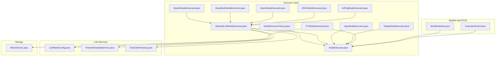
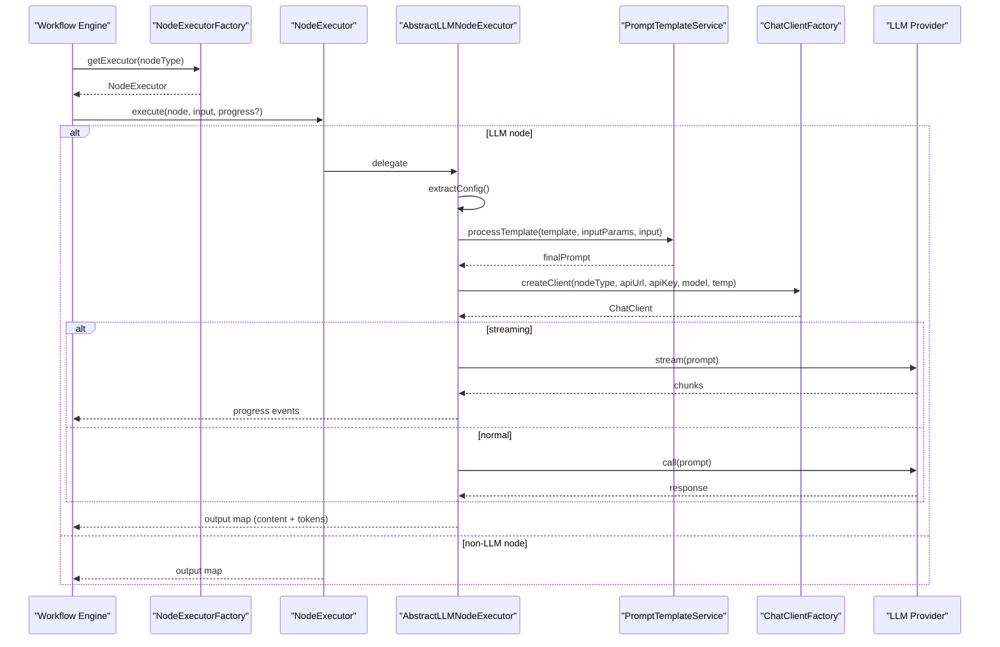
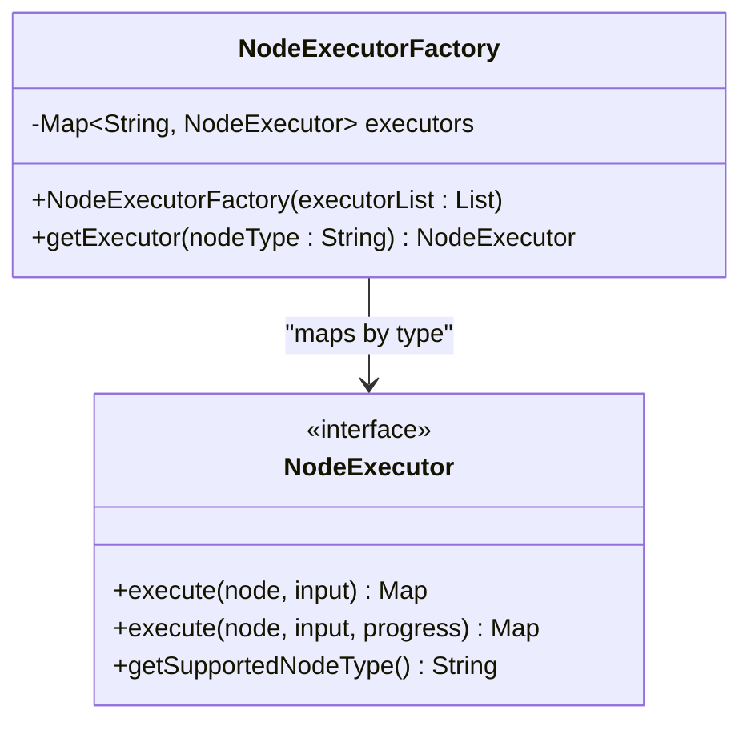
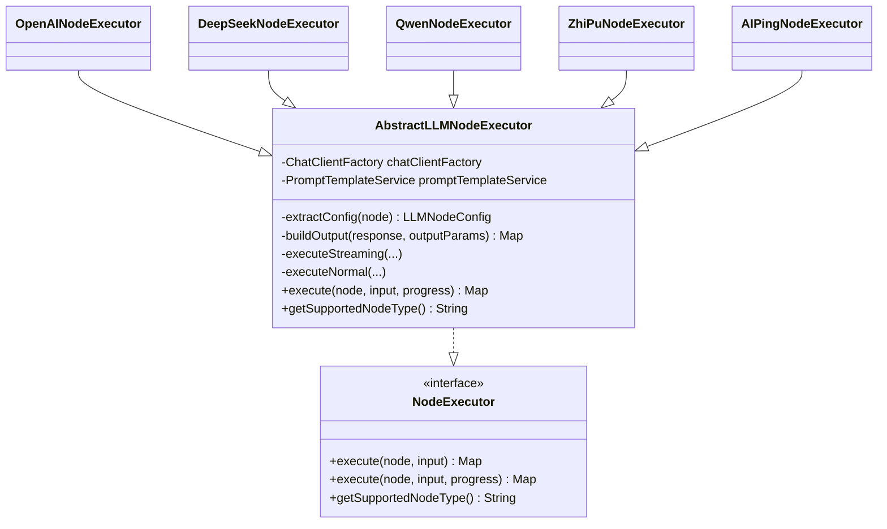
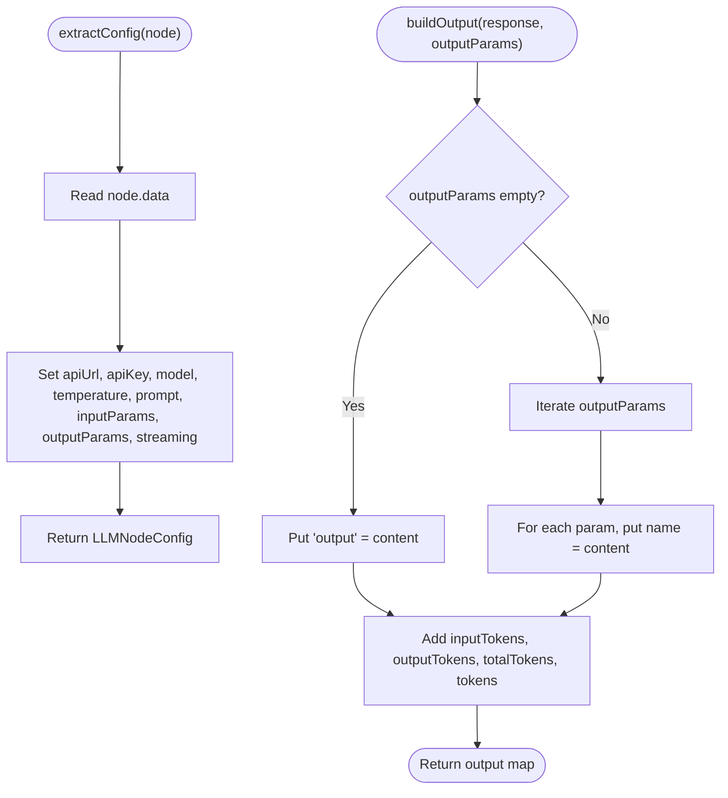
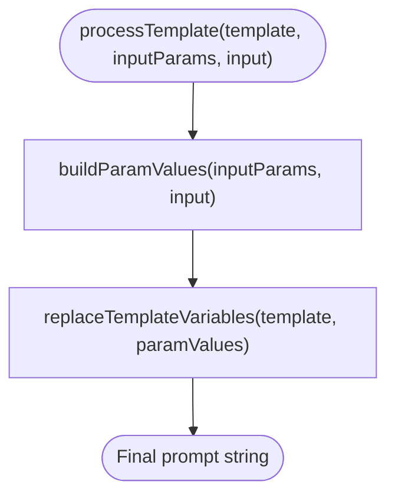
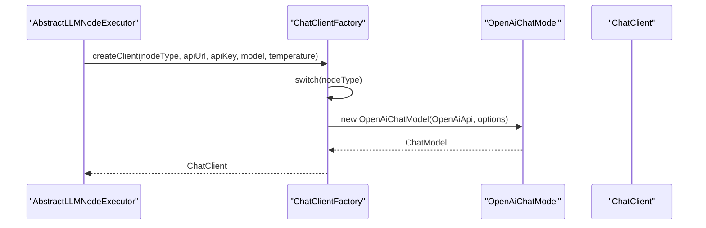
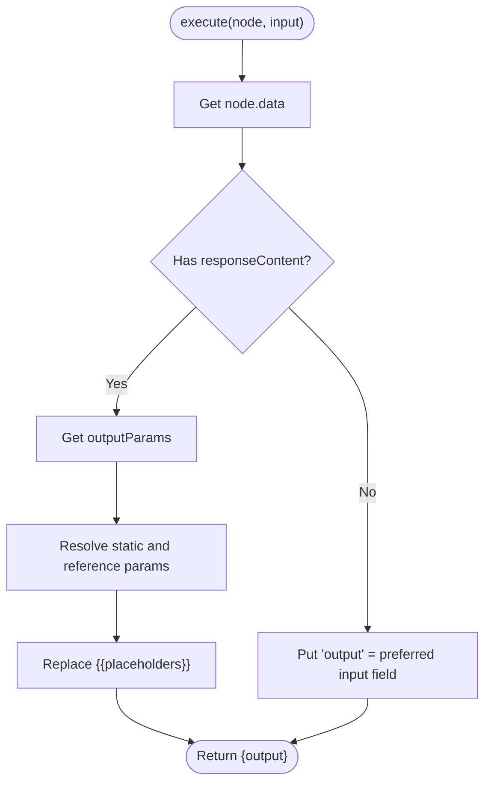
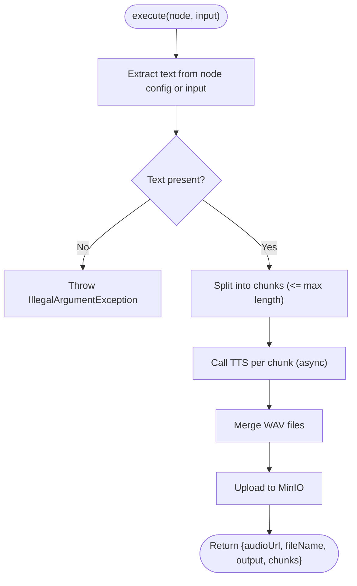
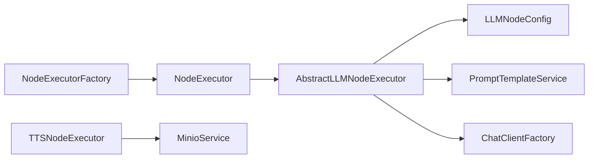

# Node Execution System

<cite>
**Referenced Files in This Document**
- [NodeExecutor.java](file://backend/src/main/java/com/paiagent/engine/executor/NodeExecutor.java)
- [NodeExecutorFactory.java](file://backend/src/main/java/com/paiagent/engine/executor/NodeExecutorFactory.java)
- [AbstractLLMNodeExecutor.java](file://backend/src/main/java/com/paiagent/engine/executor/impl/AbstractLLMNodeExecutor.java)
- [OpenAINodeExecutor.java](file://backend/src/main/java/com/paiagent/engine/executor/impl/OpenAINodeExecutor.java)
- [DeepSeekNodeExecutor.java](file://backend/src/main/java/com/paiagent/engine/executor/impl/DeepSeekNodeExecutor.java)
- [QwenNodeExecutor.java](file://backend/src/main/java/com/paiagent/engine/executor/impl/QwenNodeExecutor.java)
- [ZhiPuNodeExecutor.java](file://backend/src/main/java/com/paiagent/engine/executor/impl/ZhiPuNodeExecutor.java)
- [AIPingNodeExecutor.java](file://backend/src/main/java/com/paiagent/engine/executor/impl/AIPingNodeExecutor.java)
- [InputNodeExecutor.java](file://backend/src/main/java/com/paiagent/engine/executor/impl/InputNodeExecutor.java)
- [OutputNodeExecutor.java](file://backend/src/main/java/com/paiagent/engine/executor/impl/OutputNodeExecutor.java)
- [TTSNodeExecutor.java](file://backend/src/main/java/com/paiagent/engine/executor/impl/TTSNodeExecutor.java)
- [LLMNodeConfig.java](file://backend/src/main/java/com/paiagent/engine/llm/LLMNodeConfig.java)
- [PromptTemplateService.java](file://backend/src/main/java/com/paiagent/engine/llm/PromptTemplateService.java)
- [ChatClientFactory.java](file://backend/src/main/java/com/paiagent/engine/llm/ChatClientFactory.java)
- [WorkflowNode.java](file://backend/src/main/java/com/paiagent/engine/model/WorkflowNode.java)
- [ExecutionEvent.java](file://backend/src/main/java/com/paiagent/dto/ExecutionEvent.java)
- [MinioService.java](file://backend/src/main/java/com/paiagent/service/MinioService.java)
</cite>

## Table of Contents
1. [Introduction](#introduction)
2. [Project Structure](#project-structure)
3. [Core Components](#core-components)
4. [Architecture Overview](#architecture-overview)
5. [Detailed Component Analysis](#detailed-component-analysis)
6. [Dependency Analysis](#dependency-analysis)
7. [Performance Considerations](#performance-considerations)
8. [Troubleshooting Guide](#troubleshooting-guide)
9. [Conclusion](#conclusion)

## Introduction
This document explains the node execution system used to run workflow nodes in the backend engine. It covers the NodeExecutor interface and the factory pattern used to dynamically select and instantiate node executors. It documents the AbstractLLMNodeExecutor base class that standardizes LLM node behavior across providers such as OpenAI, DeepSeek, Qwen, ZhiPu, and AIPing. It also details specialized nodes including Input/Output and TTS, along with the execution lifecycle, parameter handling, error propagation, and result formatting. Finally, it provides guidelines for extending the system with new node types and integrating additional AI providers.

## Project Structure
The node execution system resides under the engine/executor package and integrates with LLM configuration and prompt processing services. The primary components are:
- NodeExecutor interface defining the contract for node execution
- NodeExecutorFactory implementing the factory pattern to register and retrieve executors
- AbstractLLMNodeExecutor providing shared LLM execution logic
- Concrete node executors for different providers and special-purpose nodes
- Supporting services for LLM configuration, prompt templating, client creation, and storage

**Diagram sources**
- [NodeExecutor.java:1-18](file://backend/src/main/java/com/paiagent/engine/executor/NodeExecutor.java#L1-L18)
- [NodeExecutorFactory.java:1-36](file://backend/src/main/java/com/paiagent/engine/executor/NodeExecutorFactory.java#L1-L36)
- [AbstractLLMNodeExecutor.java:1-231](file://backend/src/main/java/com/paiagent/engine/executor/impl/AbstractLLMNodeExecutor.java#L1-L231)
- [OpenAINodeExecutor.java:1-17](file://backend/src/main/java/com/paiagent/engine/executor/impl/OpenAINodeExecutor.java#L1-L17)
- [DeepSeekNodeExecutor.java:1-17](file://backend/src/main/java/com/paiagent/engine/executor/impl/DeepSeekNodeExecutor.java#L1-L17)
- [QwenNodeExecutor.java:1-17](file://backend/src/main/java/com/paiagent/engine/executor/impl/QwenNodeExecutor.java#L1-L17)
- [ZhiPuNodeExecutor.java:1-17](file://backend/src/main/java/com/paiagent/engine/executor/impl/ZhiPuNodeExecutor.java#L1-L17)
- [AIPingNodeExecutor.java:1-17](file://backend/src/main/java/com/paiagent/engine/executor/impl/AIPingNodeExecutor.java#L1-L17)
- [InputNodeExecutor.java:1-27](file://backend/src/main/java/com/paiagent/engine/executor/impl/InputNodeExecutor.java#L1-L27)
- [OutputNodeExecutor.java:1-123](file://backend/src/main/java/com/paiagent/engine/executor/impl/OutputNodeExecutor.java#L1-L123)
- [TTSNodeExecutor.java:1-353](file://backend/src/main/java/com/paiagent/engine/executor/impl/TTSNodeExecutor.java#L1-L353)
- [LLMNodeConfig.java:1-54](file://backend/src/main/java/com/paiagent/engine/llm/LLMNodeConfig.java#L1-L54)
- [PromptTemplateService.java:1-108](file://backend/src/main/java/com/paiagent/engine/llm/PromptTemplateService.java#L1-L108)
- [ChatClientFactory.java:1-60](file://backend/src/main/java/com/paiagent/engine/llm/ChatClientFactory.java#L1-L60)
- [WorkflowNode.java:1-38](file://backend/src/main/java/com/paiagent/engine/model/WorkflowNode.java#L1-L38)
- [ExecutionEvent.java:1-79](file://backend/src/main/java/com/paiagent/dto/ExecutionEvent.java#L1-L79)
- [MinioService.java:1-102](file://backend/src/main/java/com/paiagent/service/MinioService.java#L1-L102)

**Section sources**
- [NodeExecutor.java:1-18](file://backend/src/main/java/com/paiagent/engine/executor/NodeExecutor.java#L1-L18)
- [NodeExecutorFactory.java:1-36](file://backend/src/main/java/com/paiagent/engine/executor/NodeExecutorFactory.java#L1-L36)

## Core Components
- NodeExecutor interface defines the execution contract with two overloads: one returning a result map and another accepting a progress callback consumer. It also exposes the supported node type identifier.
- NodeExecutorFactory registers all NodeExecutor beans and maps them by their supported node type. It retrieves the appropriate executor for a given node type and throws a runtime exception if none is found.
- AbstractLLMNodeExecutor encapsulates the standard LLM execution lifecycle: extracting configuration from the node data, processing prompt templates, creating a ChatClient via ChatClientFactory, invoking the LLM (normal or streaming), and building standardized output with tokens and content.

Key responsibilities:
- Standardized parameter extraction and output formatting
- Support for streaming progress callbacks
- Unified logging and error visibility
- Extensibility through provider-specific subclasses

**Section sources**
- [NodeExecutor.java:9-18](file://backend/src/main/java/com/paiagent/engine/executor/NodeExecutor.java#L9-L18)
- [NodeExecutorFactory.java:14-35](file://backend/src/main/java/com/paiagent/engine/executor/NodeExecutorFactory.java#L14-L35)
- [AbstractLLMNodeExecutor.java:22-89](file://backend/src/main/java/com/paiagent/engine/executor/impl/AbstractLLMNodeExecutor.java#L22-L89)

## Architecture Overview
The system follows a factory-driven architecture:
- NodeExecutorFactory collects all NodeExecutor beans and binds them to their supported node type.
- During execution, the engine selects the executor by node type and delegates execution to it.
- For LLM nodes, AbstractLLMNodeExecutor orchestrates configuration extraction, prompt processing, client creation, and response handling.

**Diagram sources**
- [NodeExecutorFactory.java:28-34](file://backend/src/main/java/com/paiagent/engine/executor/NodeExecutorFactory.java#L28-L34)
- [AbstractLLMNodeExecutor.java:42-89](file://backend/src/main/java/com/paiagent/engine/executor/impl/AbstractLLMNodeExecutor.java#L42-L89)
- [PromptTemplateService.java:30-43](file://backend/src/main/java/com/paiagent/engine/llm/PromptTemplateService.java#L30-L43)
- [ChatClientFactory.java:29-40](file://backend/src/main/java/com/paiagent/engine/llm/ChatClientFactory.java#L29-L40)

## Detailed Component Analysis

### NodeExecutor Interface
Defines the execution contract:
- execute(node, input): returns a Map of outputs
- execute(node, input, progressCallback): optional streaming progress support
- getSupportedNodeType(): identifies the node type handled by the executor

**Section sources**
- [NodeExecutor.java:11-17](file://backend/src/main/java/com/paiagent/engine/executor/NodeExecutor.java#L11-L17)

### NodeExecutorFactory
Implements the factory pattern:
- Constructor registers all NodeExecutor beans by calling getSupportedNodeType()
- getExecutor(nodeType): retrieves the matching executor or throws a runtime exception

**Diagram sources**
- [NodeExecutorFactory.java:14-35](file://backend/src/main/java/com/paiagent/engine/executor/NodeExecutorFactory.java#L14-L35)
- [NodeExecutor.java:9-18](file://backend/src/main/java/com/paiagent/engine/executor/NodeExecutor.java#L9-L18)

**Section sources**
- [NodeExecutorFactory.java:19-34](file://backend/src/main/java/com/paiagent/engine/executor/NodeExecutorFactory.java#L19-L34)

### AbstractLLMNodeExecutor
Standardizes LLM execution:
- Extracts configuration from WorkflowNode.data into LLMNodeConfig
- Processes prompt templates via PromptTemplateService
- Creates ChatClient via ChatClientFactory
- Executes either normal or streaming calls
- Builds standardized output with content and token metrics

**Diagram sources**
- [AbstractLLMNodeExecutor.java:23-89](file://backend/src/main/java/com/paiagent/engine/executor/impl/AbstractLLMNodeExecutor.java#L23-L89)
- [OpenAINodeExecutor.java:10-16](file://backend/src/main/java/com/paiagent/engine/executor/impl/OpenAINodeExecutor.java#L10-L16)
- [DeepSeekNodeExecutor.java:10-16](file://backend/src/main/java/com/paiagent/engine/executor/impl/DeepSeekNodeExecutor.java#L10-L16)
- [QwenNodeExecutor.java:10-16](file://backend/src/main/java/com/paiagent/engine/executor/impl/QwenNodeExecutor.java#L10-L16)
- [ZhiPuNodeExecutor.java:10-16](file://backend/src/main/java/com/paiagent/engine/executor/impl/ZhiPuNodeExecutor.java#L10-L16)
- [AIPingNodeExecutor.java:10-16](file://backend/src/main/java/com/paiagent/engine/executor/impl/AIPingNodeExecutor.java#L10-L16)

**Section sources**
- [AbstractLLMNodeExecutor.java:36-89](file://backend/src/main/java/com/paiagent/engine/executor/impl/AbstractLLMNodeExecutor.java#L36-L89)
- [LLMNodeConfig.java:12-53](file://backend/src/main/java/com/paiagent/engine/llm/LLMNodeConfig.java#L12-L53)
- [PromptTemplateService.java:30-43](file://backend/src/main/java/com/paiagent/engine/llm/PromptTemplateService.java#L30-L43)
- [ChatClientFactory.java:29-40](file://backend/src/main/java/com/paiagent/engine/llm/ChatClientFactory.java#L29-L40)

### LLM Configuration Extraction and Output Building
- extractConfig(node): reads apiUrl, apiKey, model, temperature, prompt template, inputParams, outputParams, and streaming flag from node data
- buildOutput(response, outputParams): constructs output map with content and token metrics; supports custom output parameter names or defaults to "output"

**Diagram sources**
- [AbstractLLMNodeExecutor.java:173-217](file://backend/src/main/java/com/paiagent/engine/executor/impl/AbstractLLMNodeExecutor.java#L173-L217)

**Section sources**
- [AbstractLLMNodeExecutor.java:173-217](file://backend/src/main/java/com/paiagent/engine/executor/impl/AbstractLLMNodeExecutor.java#L173-L217)

### Prompt Template Processing
PromptTemplateService replaces template variables with runtime values:
- buildParamValues: resolves static values and upstream references
- replaceTemplateVariables: substitutes {{variable}} placeholders

**Diagram sources**
- [PromptTemplateService.java:30-43](file://backend/src/main/java/com/paiagent/engine/llm/PromptTemplateService.java#L30-L43)
- [PromptTemplateService.java:51-90](file://backend/src/main/java/com/paiagent/engine/llm/PromptTemplateService.java#L51-L90)

**Section sources**
- [PromptTemplateService.java:30-106](file://backend/src/main/java/com/paiagent/engine/llm/PromptTemplateService.java#L30-L106)

### ChatClient Creation
ChatClientFactory creates provider-specific clients:
- Supports openai, deepseek, qwen via OpenAI-compatible API
- Throws an exception for unsupported node types

**Diagram sources**
- [ChatClientFactory.java:29-58](file://backend/src/main/java/com/paiagent/engine/llm/ChatClientFactory.java#L29-L58)

**Section sources**
- [ChatClientFactory.java:29-58](file://backend/src/main/java/com/paiagent/engine/llm/ChatClientFactory.java#L29-L58)

### Specialized Node Implementations

#### InputNodeExecutor
- Returns a copy of the incoming input map as-is
- Supported node type: "input"

**Section sources**
- [InputNodeExecutor.java:17-25](file://backend/src/main/java/com/paiagent/engine/executor/impl/InputNodeExecutor.java#L17-L25)

#### OutputNodeExecutor
- Processes a responseContent template with outputParams
- Resolves static values and upstream references (LangGraph and DAG modes)
- Replaces {{placeholders}} with resolved values
- Returns a single "output" field containing the rendered template

**Diagram sources**
- [OutputNodeExecutor.java:22-116](file://backend/src/main/java/com/paiagent/engine/executor/impl/OutputNodeExecutor.java#L22-L116)

**Section sources**
- [OutputNodeExecutor.java:22-122](file://backend/src/main/java/com/paiagent/engine/executor/impl/OutputNodeExecutor.java#L22-L122)

#### TTSNodeExecutor
- Validates and extracts input text from node configuration or upstream input
- Splits text into chunks respecting byte limits and punctuation
- Calls Alibaba DashScope TTS API per chunk, downloading audio URLs
- Merges WAV files, uploads to MinIO, and returns public URL and metadata

**Diagram sources**
- [TTSNodeExecutor.java:34-174](file://backend/src/main/java/com/paiagent/engine/executor/impl/TTSNodeExecutor.java#L34-L174)
- [MinioService.java:95-101](file://backend/src/main/java/com/paiagent/service/MinioService.java#L95-L101)

**Section sources**
- [TTSNodeExecutor.java:34-353](file://backend/src/main/java/com/paiagent/engine/executor/impl/TTSNodeExecutor.java#L34-L353)
- [MinioService.java:95-101](file://backend/src/main/java/com/paiagent/service/MinioService.java#L95-L101)

### Provider-Specific Executors
- OpenAINodeExecutor: "openai"
- DeepSeekNodeExecutor: "deepseek"
- QwenNodeExecutor: "qwen"
- ZhiPuNodeExecutor: "zhipu"
- AIPingNodeExecutor: "ai_ping"

Each provider executor extends AbstractLLMNodeExecutor and overrides getNodeType() to return its identifier. They inherit the unified execution pipeline.

**Section sources**
- [OpenAINodeExecutor.java:10-16](file://backend/src/main/java/com/paiagent/engine/executor/impl/OpenAINodeExecutor.java#L10-L16)
- [DeepSeekNodeExecutor.java:10-16](file://backend/src/main/java/com/paiagent/engine/executor/impl/DeepSeekNodeExecutor.java#L10-L16)
- [QwenNodeExecutor.java:10-16](file://backend/src/main/java/com/paiagent/engine/executor/impl/QwenNodeExecutor.java#L10-L16)
- [ZhiPuNodeExecutor.java:10-16](file://backend/src/main/java/com/paiagent/engine/executor/impl/ZhiPuNodeExecutor.java#L10-L16)
- [AIPingNodeExecutor.java:10-16](file://backend/src/main/java/com/paiagent/engine/executor/impl/AIPingNodeExecutor.java#L10-L16)

## Dependency Analysis
- NodeExecutorFactory depends on Spring’s bean discovery to collect all NodeExecutor implementations and bind them by type.
- AbstractLLMNodeExecutor depends on:
  - LLMNodeConfig for structured configuration
  - PromptTemplateService for template processing
  - ChatClientFactory for provider-specific client creation
- TTSNodeExecutor depends on MinioService for media storage.

**Diagram sources**
- [NodeExecutorFactory.java:19-23](file://backend/src/main/java/com/paiagent/engine/executor/NodeExecutorFactory.java#L19-L23)
- [AbstractLLMNodeExecutor.java:25-29](file://backend/src/main/java/com/paiagent/engine/executor/impl/AbstractLLMNodeExecutor.java#L25-L29)
- [TTSNodeExecutor.java:30-31](file://backend/src/main/java/com/paiagent/engine/executor/impl/TTSNodeExecutor.java#L30-L31)

**Section sources**
- [NodeExecutorFactory.java:19-23](file://backend/src/main/java/com/paiagent/engine/executor/NodeExecutorFactory.java#L19-L23)
- [AbstractLLMNodeExecutor.java:25-29](file://backend/src/main/java/com/paiagent/engine/executor/impl/AbstractLLMNodeExecutor.java#L25-L29)
- [TTSNodeExecutor.java:30-31](file://backend/src/main/java/com/paiagent/engine/executor/impl/TTSNodeExecutor.java#L30-L31)

## Performance Considerations
- Streaming vs. Non-streaming: Streaming enables real-time progress updates but does not expose token usage metadata; non-streaming captures token statistics.
- Asynchronous TTS: Chunked processing uses async tasks to improve throughput; ensure thread pool sizing matches workload.
- Prompt template complexity: Complex templates with many references increase processing time; cache or precompute where possible.
- Token accounting: Prefer non-streaming mode when accurate token metrics are required.

[No sources needed since this section provides general guidance]

## Troubleshooting Guide
Common issues and resolutions:
- Unsupported node type: NodeExecutorFactory throws a runtime exception when no executor is registered for the given type. Verify the node type string and ensure the executor component is annotated and discoverable.
- Missing API credentials or endpoint: AbstractLLMNodeExecutor requires apiUrl and apiKey; missing values cause exceptions during client creation. Confirm node data configuration.
- Empty input text for TTS: TTSNodeExecutor validates input text and throws an error if absent; ensure inputParams or upstream output contains text.
- Unknown voice for TTS: Voice conversion falls back to a default if an invalid value is provided; check configuration.
- Audio URL missing from provider response: TTSNodeExecutor validates audio URLs and throws errors if empty; retry or adjust chunk sizes.
- Output template placeholders unresolved: Ensure outputParams reference existing upstream keys or provide static values; verify LangGraph/DAG compatibility.

**Section sources**
- [NodeExecutorFactory.java:30-32](file://backend/src/main/java/com/paiagent/engine/executor/NodeExecutorFactory.java#L30-L32)
- [AbstractLLMNodeExecutor.java:61-67](file://backend/src/main/java/com/paiagent/engine/executor/impl/AbstractLLMNodeExecutor.java#L61-L67)
- [TTSNodeExecutor.java:41-53](file://backend/src/main/java/com/paiagent/engine/executor/impl/TTSNodeExecutor.java#L41-L53)
- [TTSNodeExecutor.java:114-116](file://backend/src/main/java/com/paiagent/engine/executor/impl/TTSNodeExecutor.java#L114-L116)
- [OutputNodeExecutor.java:55-96](file://backend/src/main/java/com/paiagent/engine/executor/impl/OutputNodeExecutor.java#L55-L96)

## Conclusion
The node execution system leverages a clean interface and factory pattern to enable dynamic selection of node executors. AbstractLLMNodeExecutor provides a robust, standardized foundation for LLM providers, while specialized executors encapsulate provider-specific behavior. The system supports streaming progress, structured configuration, template-driven prompts, and reliable output formatting. By following the extension guidelines below, teams can integrate additional AI providers and node types consistently.

## Extension Guidelines

### Adding a New LLM Provider Executor
1. Create a new executor class extending AbstractLLMNodeExecutor and override getNodeType() to return the provider’s node type identifier.
2. Register the executor as a Spring component so NodeExecutorFactory can discover it.
3. Ensure ChatClientFactory supports the new provider type; if using OpenAI-compatible APIs, it is supported out of the box.
4. Configure node data with apiUrl, apiKey, model, temperature, prompt, inputParams, outputParams, and streaming as needed.

**Section sources**
- [AbstractLLMNodeExecutor.java:34-34](file://backend/src/main/java/com/paiagent/engine/executor/impl/AbstractLLMNodeExecutor.java#L34-L34)
- [ChatClientFactory.java:34-37](file://backend/src/main/java/com/paiagent/engine/llm/ChatClientFactory.java#L34-L37)

### Adding a New Non-LLM Node Type
1. Implement NodeExecutor with execute(node, input) and getSupportedNodeType().
2. Annotate with @Component so NodeExecutorFactory can register it automatically.
3. Define node data schema in WorkflowNode.data and handle parameter extraction and output formatting in the execute method.

**Section sources**
- [NodeExecutor.java:11-17](file://backend/src/main/java/com/paiagent/engine/executor/NodeExecutor.java#L11-L17)
- [InputNodeExecutor.java:17-25](file://backend/src/main/java/com/paiagent/engine/executor/impl/InputNodeExecutor.java#L17-L25)

### Integrating Additional AI Providers
- For OpenAI-compatible providers, reuse AbstractLLMNodeExecutor and configure apiUrl and apiKey accordingly.
- For providers requiring custom SDKs, implement a dedicated executor similar to TTSNodeExecutor, handling authentication, chunking, and storage via MinioService.

**Section sources**
- [ChatClientFactory.java:34-37](file://backend/src/main/java/com/paiagent/engine/llm/ChatClientFactory.java#L34-L37)
- [TTSNodeExecutor.java:103-111](file://backend/src/main/java/com/paiagent/engine/executor/impl/TTSNodeExecutor.java#L103-L111)
- [MinioService.java:95-101](file://backend/src/main/java/com/paiagent/service/MinioService.java#L95-L101)