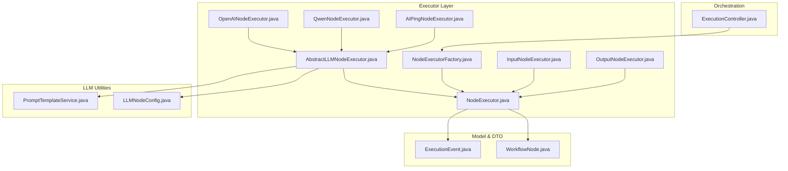
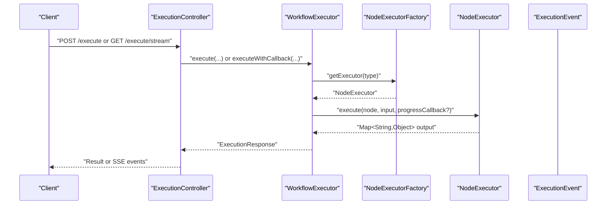
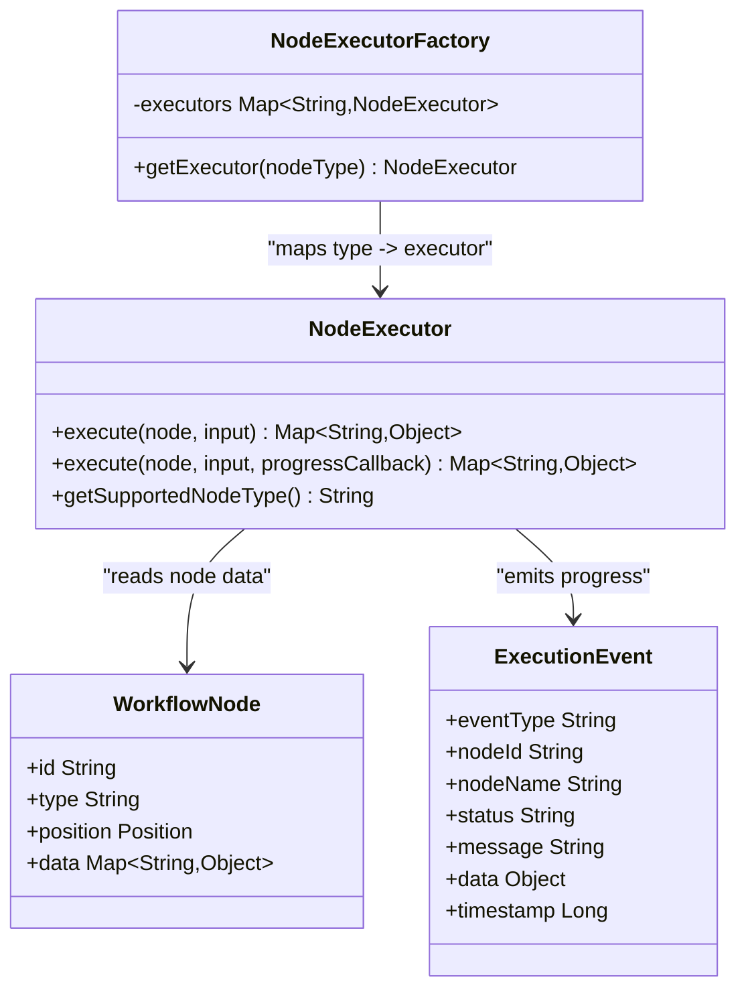
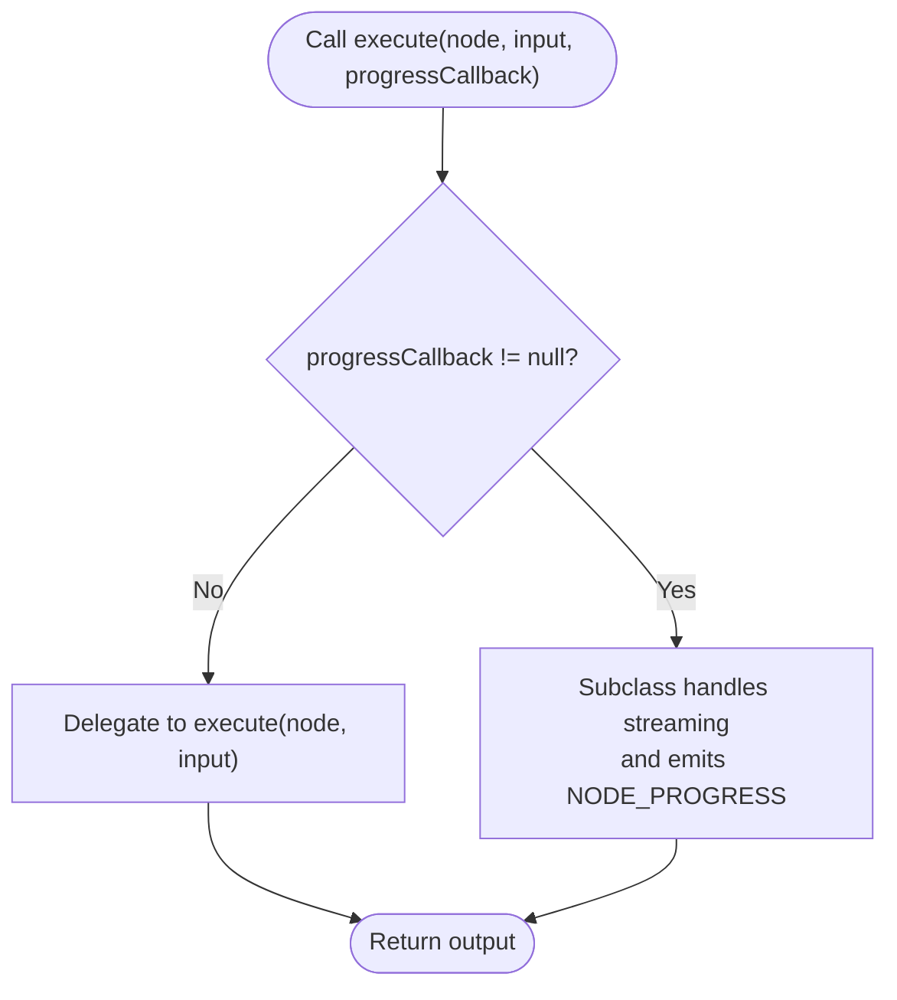
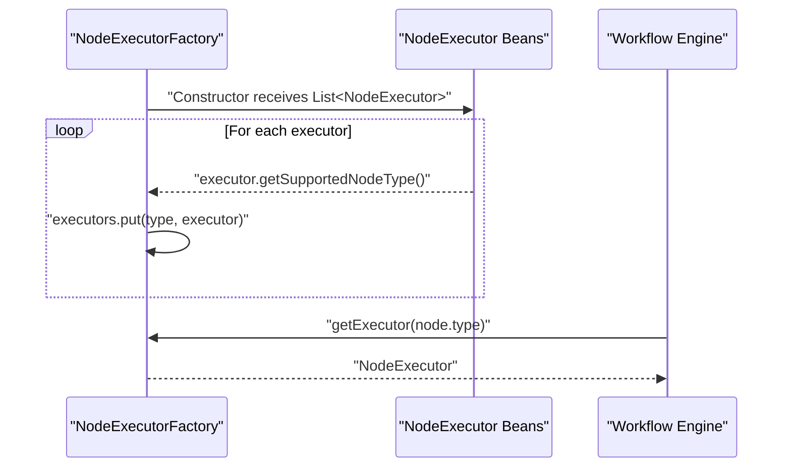
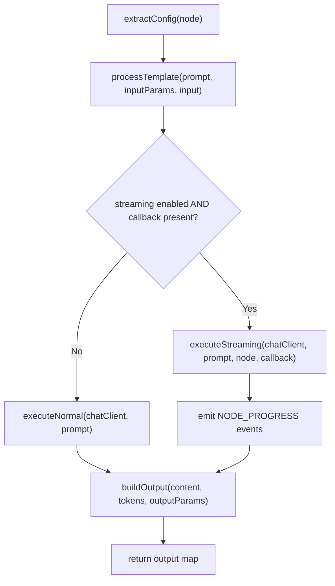
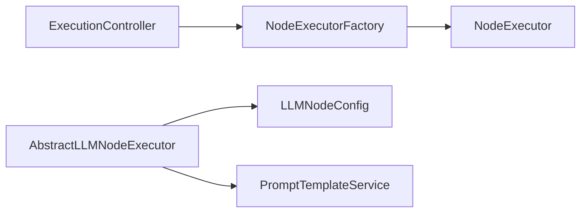

# NodeExecutor Interface

<cite>
**Referenced Files in This Document**
- [NodeExecutor.java](file://backend/src/main/java/com/paiagent/engine/executor/NodeExecutor.java)
- [NodeExecutorFactory.java](file://backend/src/main/java/com/paiagent/engine/executor/NodeExecutorFactory.java)
- [ExecutionEvent.java](file://backend/src/main/java/com/paiagent/dto/ExecutionEvent.java)
- [WorkflowNode.java](file://backend/src/main/java/com/paiagent/engine/model/WorkflowNode.java)
- [AbstractLLMNodeExecutor.java](file://backend/src/main/java/com/paiagent/engine/executor/impl/AbstractLLMNodeExecutor.java)
- [InputNodeExecutor.java](file://backend/src/main/java/com/paiagent/engine/executor/impl/InputNodeExecutor.java)
- [OutputNodeExecutor.java](file://backend/src/main/java/com/paiagent/engine/executor/impl/OutputNodeExecutor.java)
- [OpenAINodeExecutor.java](file://backend/src/main/java/com/paiagent/engine/executor/impl/OpenAINodeExecutor.java)
- [QwenNodeExecutor.java](file://backend/src/main/java/com/paiagent/engine/executor/impl/QwenNodeExecutor.java)
- [AIPingNodeExecutor.java](file://backend/src/main/java/com/paiagent/engine/executor/impl/AIPingNodeExecutor.java)
- [LLMNodeConfig.java](file://backend/src/main/java/com/paiagent/engine/llm/LLMNodeConfig.java)
- [PromptTemplateService.java](file://backend/src/main/java/com/paiagent/engine/llm/PromptTemplateService.java)
- [ExecutionController.java](file://backend/src/main/java/com/paiagent/controller/ExecutionController.java)
</cite>

## Table of Contents
1. [Introduction](#introduction)
2. [Project Structure](#project-structure)
3. [Core Components](#core-components)
4. [Architecture Overview](#architecture-overview)
5. [Detailed Component Analysis](#detailed-component-analysis)
6. [Dependency Analysis](#dependency-analysis)
7. [Performance Considerations](#performance-considerations)
8. [Troubleshooting Guide](#troubleshooting-guide)
9. [Conclusion](#conclusion)

## Introduction
This document provides comprehensive documentation for the NodeExecutor interface and its ecosystem. It explains the core contract for all node executors, covering the execute method signatures, input/output parameter handling, and the progress callback mechanism. It also documents the default implementation of the progress callback, how it integrates with the execution event system, and the role of getSupportedNodeType in node type registration. Finally, it includes examples of implementing custom node executors and best practices for error handling and result formatting.

## Project Structure
The NodeExecutor interface resides in the executor package alongside factory and implementation classes. Supporting components include execution events, workflow node models, LLM configuration and prompt processing utilities, and controllers that orchestrate execution and event streaming.

**Diagram sources**
- [NodeExecutor.java:1-18](file://backend/src/main/java/com/paiagent/engine/executor/NodeExecutor.java#L1-L18)
- [NodeExecutorFactory.java:1-36](file://backend/src/main/java/com/paiagent/engine/executor/NodeExecutorFactory.java#L1-L36)
- [AbstractLLMNodeExecutor.java:1-231](file://backend/src/main/java/com/paiagent/engine/executor/impl/AbstractLLMNodeExecutor.java#L1-L231)
- [InputNodeExecutor.java:1-27](file://backend/src/main/java/com/paiagent/engine/executor/impl/InputNodeExecutor.java#L1-L27)
- [OutputNodeExecutor.java:1-123](file://backend/src/main/java/com/paiagent/engine/executor/impl/OutputNodeExecutor.java#L1-L123)
- [OpenAINodeExecutor.java:1-17](file://backend/src/main/java/com/paiagent/engine/executor/impl/OpenAINodeExecutor.java#L1-L17)
- [QwenNodeExecutor.java:1-17](file://backend/src/main/java/com/paiagent/engine/executor/impl/QwenNodeExecutor.java#L1-L17)
- [AIPingNodeExecutor.java:1-17](file://backend/src/main/java/com/paiagent/engine/executor/impl/AIPingNodeExecutor.java#L1-L17)
- [WorkflowNode.java:1-38](file://backend/src/main/java/com/paiagent/engine/model/WorkflowNode.java#L1-L38)
- [ExecutionEvent.java:1-79](file://backend/src/main/java/com/paiagent/dto/ExecutionEvent.java#L1-L79)
- [LLMNodeConfig.java:1-54](file://backend/src/main/java/com/paiagent/engine/llm/LLMNodeConfig.java#L1-L54)
- [PromptTemplateService.java:1-108](file://backend/src/main/java/com/paiagent/engine/llm/PromptTemplateService.java#L1-L108)
- [ExecutionController.java:1-109](file://backend/src/main/java/com/paiagent/controller/ExecutionController.java#L1-L109)

**Section sources**
- [NodeExecutor.java:1-18](file://backend/src/main/java/com/paiagent/engine/executor/NodeExecutor.java#L1-L18)
- [NodeExecutorFactory.java:1-36](file://backend/src/main/java/com/paiagent/engine/executor/NodeExecutorFactory.java#L1-L36)
- [ExecutionEvent.java:1-79](file://backend/src/main/java/com/paiagent/dto/ExecutionEvent.java#L1-L79)
- [WorkflowNode.java:1-38](file://backend/src/main/java/com/paiagent/engine/model/WorkflowNode.java#L1-L38)
- [ExecutionController.java:1-109](file://backend/src/main/java/com/paiagent/controller/ExecutionController.java#L1-L109)

## Core Components
- NodeExecutor interface defines the core contract for node execution:
  - execute(WorkflowNode, Map<String,Object>): returns a Map<String,Object> representing the node’s output.
  - execute(..., Consumer<ExecutionEvent>): default implementation delegates to the primary execute method.
  - getSupportedNodeType(): returns the node type string supported by the implementation.
- NodeExecutorFactory registers and retrieves executors by node type, enabling dynamic dispatch during workflow execution.
- ExecutionEvent encapsulates standardized execution events (start, progress, success, error, completion) with fields for type, node identity, status, message, payload, and timestamp.
- WorkflowNode carries node metadata (id, type, position) and configuration data (data map) used by executors.

Key responsibilities:
- InputNodeExecutor: returns input unchanged.
- OutputNodeExecutor: constructs output using templates and parameter references.
- AbstractLLMNodeExecutor: provides a reusable base for LLM-based nodes, including prompt processing, client creation, streaming/non-streaming execution, and output building with token metrics.

**Section sources**
- [NodeExecutor.java:9-18](file://backend/src/main/java/com/paiagent/engine/executor/NodeExecutor.java#L9-L18)
- [NodeExecutorFactory.java:14-35](file://backend/src/main/java/com/paiagent/engine/executor/NodeExecutorFactory.java#L14-L35)
- [ExecutionEvent.java:6-79](file://backend/src/main/java/com/paiagent/dto/ExecutionEvent.java#L6-L79)
- [WorkflowNode.java:10-37](file://backend/src/main/java/com/paiagent/engine/model/WorkflowNode.java#L10-L37)
- [InputNodeExecutor.java:14-26](file://backend/src/main/java/com/paiagent/engine/executor/impl/InputNodeExecutor.java#L14-L26)
- [OutputNodeExecutor.java:19-122](file://backend/src/main/java/com/paiagent/engine/executor/impl/OutputNodeExecutor.java#L19-L122)
- [AbstractLLMNodeExecutor.java:23-89](file://backend/src/main/java/com/paiagent/engine/executor/impl/AbstractLLMNodeExecutor.java#L23-L89)

## Architecture Overview
The execution pipeline integrates controllers, factories, and node executors. Controllers select engines and optionally stream ExecutionEvents via SSE. Factories resolve the appropriate NodeExecutor based on node type. Executors produce outputs and optional progress events.

**Diagram sources**
- [ExecutionController.java:39-109](file://backend/src/main/java/com/paiagent/controller/ExecutionController.java#L39-L109)
- [NodeExecutorFactory.java:25-35](file://backend/src/main/java/com/paiagent/engine/executor/NodeExecutorFactory.java#L25-L35)
- [NodeExecutor.java:11-15](file://backend/src/main/java/com/paiagent/engine/executor/NodeExecutor.java#L11-L15)
- [ExecutionEvent.java:15-78](file://backend/src/main/java/com/paiagent/dto/ExecutionEvent.java#L15-L78)

## Detailed Component Analysis

### NodeExecutor Interface Contract
- Method signatures:
  - execute(WorkflowNode, Map<String,Object>): primary execution method returning node output.
  - execute(WorkflowNode, Map<String,Object>, Consumer<ExecutionEvent>): optional progress callback overload with default delegation to the primary method.
  - getSupportedNodeType(): identifies the node type handled by the implementation.
- Input/Output handling:
  - Input is a Map<String,Object> carrying upstream outputs and runtime context.
  - Output is a Map<String,Object> containing structured results; implementations may add metrics (e.g., tokens).
- Progress callback:
  - Optional Consumer<ExecutionEvent> allows streaming progress updates.
  - Default implementation does not consume the callback; subclasses may override to emit NODE_PROGRESS events.

**Diagram sources**
- [NodeExecutor.java:9-18](file://backend/src/main/java/com/paiagent/engine/executor/NodeExecutor.java#L9-L18)
- [NodeExecutorFactory.java:14-35](file://backend/src/main/java/com/paiagent/engine/executor/NodeExecutorFactory.java#L14-L35)
- [ExecutionEvent.java:6-14](file://backend/src/main/java/com/paiagent/dto/ExecutionEvent.java#L6-L14)
- [WorkflowNode.java:10-37](file://backend/src/main/java/com/paiagent/engine/model/WorkflowNode.java#L10-L37)

**Section sources**
- [NodeExecutor.java:9-18](file://backend/src/main/java/com/paiagent/engine/executor/NodeExecutor.java#L9-L18)
- [ExecutionEvent.java:6-79](file://backend/src/main/java/com/paiagent/dto/ExecutionEvent.java#L6-L79)
- [WorkflowNode.java:10-37](file://backend/src/main/java/com/paiagent/engine/model/WorkflowNode.java#L10-L37)

### Default Progress Callback Behavior
- The default implementation of the progress callback overload simply delegates to the primary execute method, meaning no progress events are emitted unless overridden.
- Subclasses like AbstractLLMNodeExecutor override the two-parameter execute method to accept a progressCallback and emit NODE_PROGRESS events during streaming generation.

**Diagram sources**
- [NodeExecutor.java:13-15](file://backend/src/main/java/com/paiagent/engine/executor/NodeExecutor.java#L13-L15)
- [AbstractLLMNodeExecutor.java:42-89](file://backend/src/main/java/com/paiagent/engine/executor/impl/AbstractLLMNodeExecutor.java#L42-L89)
- [ExecutionEvent.java:68-78](file://backend/src/main/java/com/paiagent/dto/ExecutionEvent.java#L68-L78)

**Section sources**
- [NodeExecutor.java:13-15](file://backend/src/main/java/com/paiagent/engine/executor/NodeExecutor.java#L13-L15)
- [AbstractLLMNodeExecutor.java:42-89](file://backend/src/main/java/com/paiagent/engine/executor/impl/AbstractLLMNodeExecutor.java#L42-L89)
- [ExecutionEvent.java:68-78](file://backend/src/main/java/com/paiagent/dto/ExecutionEvent.java#L68-L78)

### getSupportedNodeType and Registration
- getSupportedNodeType returns a string identifying the node type handled by the executor.
- NodeExecutorFactory collects all NodeExecutor beans and maps them by their supported node type during construction.
- This enables dynamic dispatch: the engine queries the factory with a node’s type to obtain the correct executor.

**Diagram sources**
- [NodeExecutorFactory.java:18-23](file://backend/src/main/java/com/paiagent/engine/executor/NodeExecutorFactory.java#L18-L23)
- [NodeExecutorFactory.java:28-34](file://backend/src/main/java/com/paiagent/engine/executor/NodeExecutorFactory.java#L28-L34)
- [NodeExecutor.java:17](file://backend/src/main/java/com/paiagent/engine/executor/NodeExecutor.java#L17)

**Section sources**
- [NodeExecutor.java:17](file://backend/src/main/java/com/paiagent/engine/executor/NodeExecutor.java#L17)
- [NodeExecutorFactory.java:16-23](file://backend/src/main/java/com/paiagent/engine/executor/NodeExecutorFactory.java#L16-L23)
- [NodeExecutorFactory.java:28-34](file://backend/src/main/java/com/paiagent/engine/executor/NodeExecutorFactory.java#L28-L34)

### InputNodeExecutor
- Purpose: Passes input data forward unchanged.
- Behavior: Returns a copy of the input map as the output map.
- Registration: Supports node type "input".

**Section sources**
- [InputNodeExecutor.java:14-26](file://backend/src/main/java/com/paiagent/engine/executor/impl/InputNodeExecutor.java#L14-L26)

### OutputNodeExecutor
- Purpose: Builds a structured output using a responseContent template and configured outputParams.
- Input handling: Reads node configuration and merges upstream inputs, including special handling for LangGraph-style nodeOutputs and fallbacks.
- Template processing: Replaces placeholders with resolved parameter values.
- Output: Produces a map containing the final output string and logs.

**Section sources**
- [OutputNodeExecutor.java:19-122](file://backend/src/main/java/com/paiagent/engine/executor/impl/OutputNodeExecutor.java#L19-L122)

### AbstractLLMNodeExecutor
- Purpose: Provides a reusable foundation for LLM-based node executors.
- Execution flow:
  - Extracts LLM configuration from node data.
  - Processes prompt template using PromptTemplateService.
  - Creates a ChatClient via ChatClientFactory.
  - Executes either normal or streaming mode depending on configuration and callback presence.
  - Builds output with content and token metrics.
- Streaming progress: Emits NODE_PROGRESS events with incremental chunks and accumulated content.
- Output formatting: Supports named output parameters or a default "output" field, plus token statistics.

**Diagram sources**
- [AbstractLLMNodeExecutor.java:42-89](file://backend/src/main/java/com/paiagent/engine/executor/impl/AbstractLLMNodeExecutor.java#L42-L89)
- [AbstractLLMNodeExecutor.java:116-168](file://backend/src/main/java/com/paiagent/engine/executor/impl/AbstractLLMNodeExecutor.java#L116-L168)
- [AbstractLLMNodeExecutor.java:196-217](file://backend/src/main/java/com/paiagent/engine/executor/impl/AbstractLLMNodeExecutor.java#L196-L217)
- [PromptTemplateService.java:30-43](file://backend/src/main/java/com/paiagent/engine/llm/PromptTemplateService.java#L30-L43)
- [LLMNodeConfig.java:12-53](file://backend/src/main/java/com/paiagent/engine/llm/LLMNodeConfig.java#L12-L53)

**Section sources**
- [AbstractLLMNodeExecutor.java:23-89](file://backend/src/main/java/com/paiagent/engine/executor/impl/AbstractLLMNodeExecutor.java#L23-L89)
- [AbstractLLMNodeExecutor.java:116-168](file://backend/src/main/java/com/paiagent/engine/executor/impl/AbstractLLMNodeExecutor.java#L116-L168)
- [AbstractLLMNodeExecutor.java:196-217](file://backend/src/main/java/com/paiagent/engine/executor/impl/AbstractLLMNodeExecutor.java#L196-L217)
- [PromptTemplateService.java:30-43](file://backend/src/main/java/com/paiagent/engine/llm/PromptTemplateService.java#L30-L43)
- [LLMNodeConfig.java:12-53](file://backend/src/main/java/com/paiagent/engine/llm/LLMNodeConfig.java#L12-L53)

### Example Implementations
- OpenAINodeExecutor, QwenNodeExecutor, AIPingNodeExecutor: Extend AbstractLLMNodeExecutor and specify their node type via getNodeType().
- InputNodeExecutor: Minimal implementation returning input unchanged.
- OutputNodeExecutor: Complex templating and parameter resolution for constructing final output.

**Section sources**
- [OpenAINodeExecutor.java:10-16](file://backend/src/main/java/com/paiagent/engine/executor/impl/OpenAINodeExecutor.java#L10-L16)
- [QwenNodeExecutor.java:10-16](file://backend/src/main/java/com/paiagent/engine/executor/impl/QwenNodeExecutor.java#L10-L16)
- [AIPingNodeExecutor.java:10-16](file://backend/src/main/java/com/paiagent/engine/executor/impl/AIPingNodeExecutor.java#L10-L16)
- [InputNodeExecutor.java:14-26](file://backend/src/main/java/com/paiagent/engine/executor/impl/InputNodeExecutor.java#L14-L26)
- [OutputNodeExecutor.java:19-122](file://backend/src/main/java/com/paiagent/engine/executor/impl/OutputNodeExecutor.java#L19-L122)

### Best Practices for Custom Node Executors
- Implement getSupportedNodeType consistently with the node type used in workflow definitions.
- Validate and sanitize input maps; handle missing keys gracefully.
- For streaming nodes, emit NODE_PROGRESS events periodically with incremental data and accumulated content.
- Include meaningful status messages and timestamps for traceability.
- Return structured outputs with consistent keys; consider adding metrics (e.g., tokens) for observability.
- Catch and propagate exceptions appropriately; avoid swallowing errors silently.

**Section sources**
- [NodeExecutor.java:17](file://backend/src/main/java/com/paiagent/engine/executor/NodeExecutor.java#L17)
- [ExecutionEvent.java:68-78](file://backend/src/main/java/com/paiagent/dto/ExecutionEvent.java#L68-L78)
- [AbstractLLMNodeExecutor.java:143-168](file://backend/src/main/java/com/paiagent/engine/executor/impl/AbstractLLMNodeExecutor.java#L143-L168)

## Dependency Analysis
- NodeExecutorFactory depends on Spring’s DI container to collect all NodeExecutor beans and register them by type.
- AbstractLLMNodeExecutor depends on LLMNodeConfig and PromptTemplateService for configuration and prompt processing.
- ExecutionController depends on WorkflowExecutor and NodeExecutorFactory indirectly via engine selection and execution orchestration.

**Diagram sources**
- [NodeExecutorFactory.java:18-23](file://backend/src/main/java/com/paiagent/engine/executor/NodeExecutorFactory.java#L18-L23)
- [AbstractLLMNodeExecutor.java:25-29](file://backend/src/main/java/com/paiagent/engine/executor/impl/AbstractLLMNodeExecutor.java#L25-L29)
- [LLMNodeConfig.java:12-53](file://backend/src/main/java/com/paiagent/engine/llm/LLMNodeConfig.java#L12-L53)
- [PromptTemplateService.java:16-17](file://backend/src/main/java/com/paiagent/engine/llm/PromptTemplateService.java#L16-L17)
- [ExecutionController.java:31-36](file://backend/src/main/java/com/paiagent/controller/ExecutionController.java#L31-L36)

**Section sources**
- [NodeExecutorFactory.java:18-23](file://backend/src/main/java/com/paiagent/engine/executor/NodeExecutorFactory.java#L18-L23)
- [AbstractLLMNodeExecutor.java:25-29](file://backend/src/main/java/com/paiagent/engine/executor/impl/AbstractLLMNodeExecutor.java#L25-L29)
- [LLMNodeConfig.java:12-53](file://backend/src/main/java/com/paiagent/engine/llm/LLMNodeConfig.java#L12-L53)
- [PromptTemplateService.java:16-17](file://backend/src/main/java/com/paiagent/engine/llm/PromptTemplateService.java#L16-L17)
- [ExecutionController.java:31-36](file://backend/src/main/java/com/paiagent/controller/ExecutionController.java#L31-L36)

## Performance Considerations
- Streaming vs. non-streaming: Streaming LLM calls reduce perceived latency but do not provide token usage metadata; non-streaming calls yield richer metrics.
- Template processing cost: Complex prompt templates and many parameter substitutions increase CPU usage; cache or precompute where feasible.
- Event emission frequency: Excessive progress events can impact throughput; batch or throttle emissions for long-running tasks.
- Memory footprint: Accumulating large streaming outputs requires careful memory management; consider chunked processing and bounded buffers.

## Troubleshooting Guide
- Unsupported node type: NodeExecutorFactory throws an exception when a node type is not registered; verify getSupportedNodeType matches workflow definitions.
- Missing input parameters: Ensure upstream nodes produce required outputs; check for fallbacks (e.g., user_input to input).
- Streaming progress not emitted: Confirm the subclass overrides the two-parameter execute method and passes a non-null progressCallback.
- SSE delivery failures: ExecutionController handles SSE errors and completes emitters; inspect logs for IOExceptions during event sending.

**Section sources**
- [NodeExecutorFactory.java:30-33](file://backend/src/main/java/com/paiagent/engine/executor/NodeExecutorFactory.java#L30-L33)
- [OutputNodeExecutor.java:67-96](file://backend/src/main/java/com/paiagent/engine/executor/impl/OutputNodeExecutor.java#L67-L96)
- [AbstractLLMNodeExecutor.java:71-75](file://backend/src/main/java/com/paiagent/engine/executor/impl/AbstractLLMNodeExecutor.java#L71-L75)
- [ExecutionController.java:68-77](file://backend/src/main/java/com/paiagent/controller/ExecutionController.java#L68-L77)

## Conclusion
The NodeExecutor interface defines a clean, extensible contract for node execution with optional progress callbacks and standardized output formatting. Through NodeExecutorFactory, the system supports dynamic registration and dispatch of executors by node type. AbstractLLMNodeExecutor demonstrates robust patterns for configuration extraction, prompt processing, streaming/non-streaming execution, and structured output building. Following the best practices outlined here ensures reliable, observable, and maintainable node implementations across diverse execution scenarios.