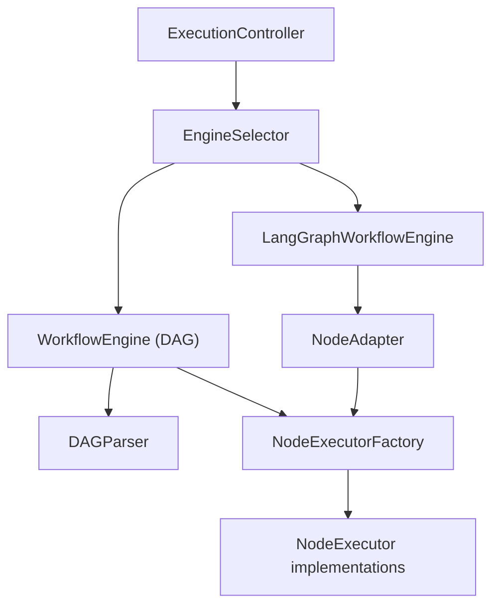
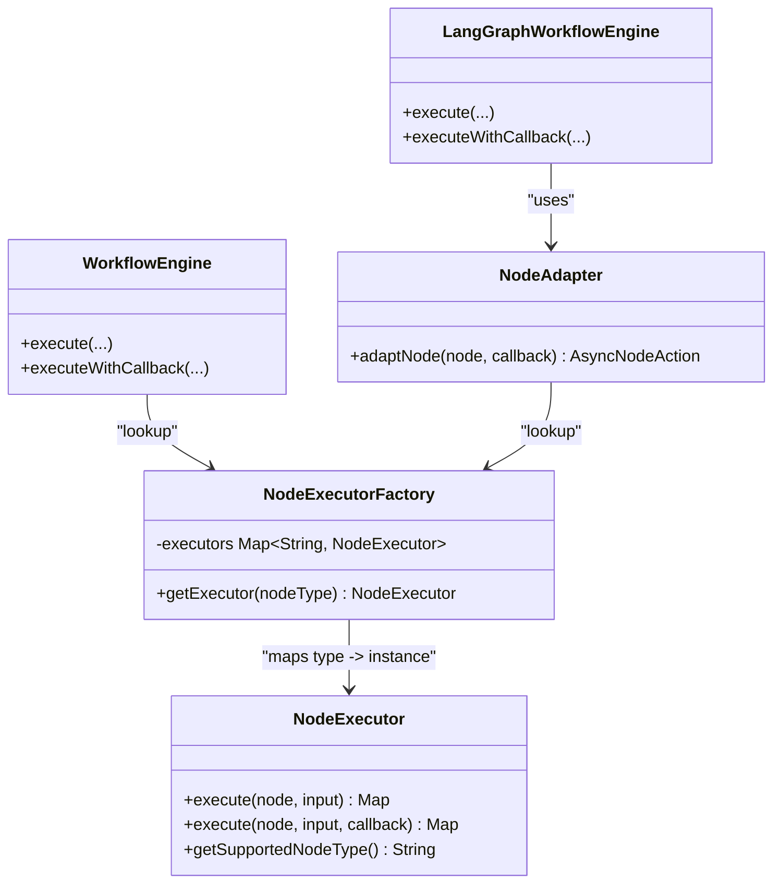
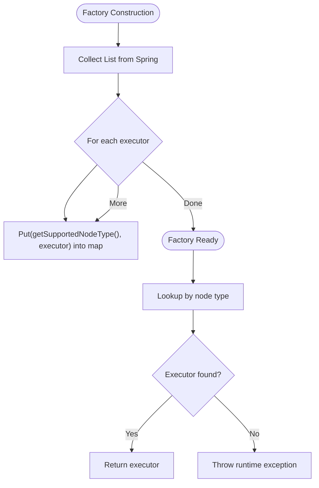
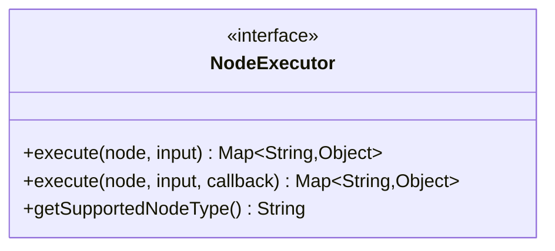
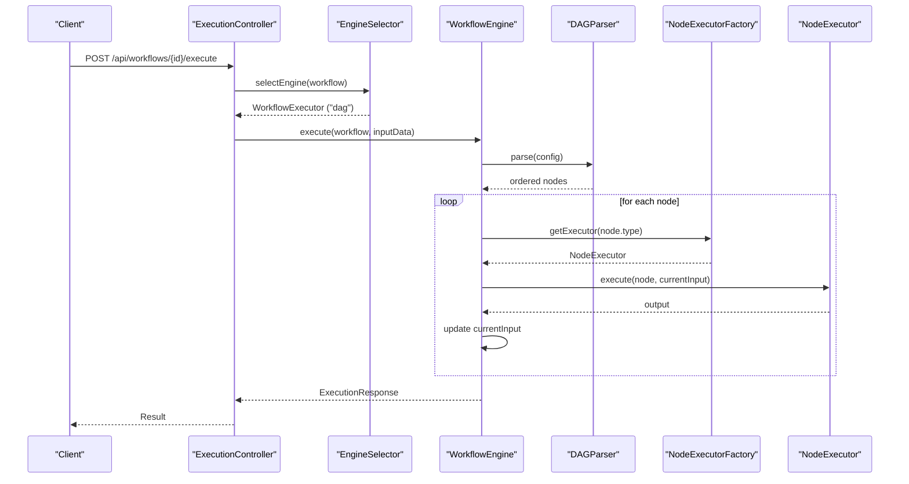
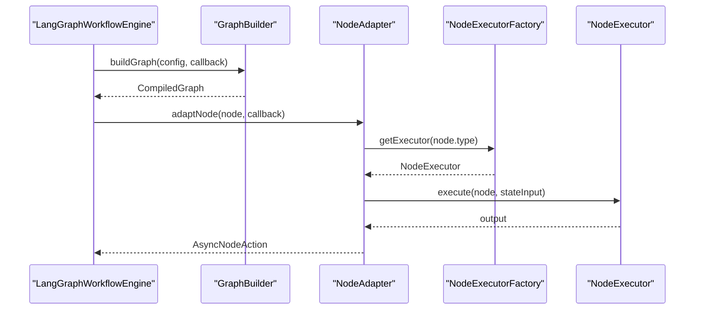
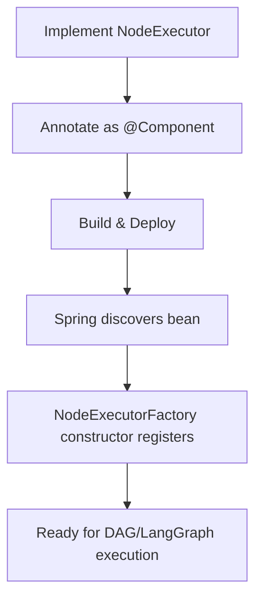
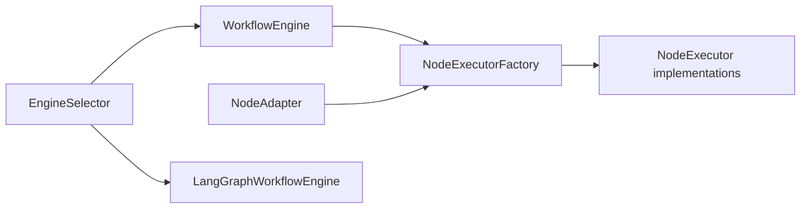

# NodeExecutorFactory

<cite>
**Referenced Files in This Document**
- [NodeExecutorFactory.java](file://backend/src/main/java/com/paiagent/engine/executor/NodeExecutorFactory.java)
- [NodeExecutor.java](file://backend/src/main/java/com/paiagent/engine/executor/NodeExecutor.java)
- [WorkflowEngine.java](file://backend/src/main/java/com/paiagent/engine/WorkflowEngine.java)
- [EngineSelector.java](file://backend/src/main/java/com/paiagent/engine/EngineSelector.java)
- [ExecutionController.java](file://backend/src/main/java/com/paiagent/controller/ExecutionController.java)
- [DAGParser.java](file://backend/src/main/java/com/paiagent/engine/dag/DAGParser.java)
- [WorkflowNode.java](file://backend/src/main/java/com/paiagent/engine/model/WorkflowNode.java)
- [WorkflowConfig.java](file://backend/src/main/java/com/paiagent/engine/model/WorkflowConfig.java)
- [NodeAdapter.java](file://backend/src/main/java/com/paiagent/engine/langgraph/adapter/NodeAdapter.java)
- [LangGraphWorkflowEngine.java](file://backend/src/main/java/com/paiagent/engine/langgraph/LangGraphWorkflowEngine.java)
</cite>

## Table of Contents
1. [Introduction](#introduction)
2. [Project Structure](#project-structure)
3. [Core Components](#core-components)
4. [Architecture Overview](#architecture-overview)
5. [Detailed Component Analysis](#detailed-component-analysis)
6. [Dependency Analysis](#dependency-analysis)
7. [Performance Considerations](#performance-considerations)
8. [Troubleshooting Guide](#troubleshooting-guide)
9. [Conclusion](#conclusion)

## Introduction
This document explains the NodeExecutorFactory pattern used to dynamically create and dispatch node executors based on node type configuration. It covers the factory's registration mechanism, lookup strategy, error handling for unsupported node types, and integration with both the legacy DAG engine and the newer LangGraph engine. It also provides guidance on extending the factory with new node types and integrating them into the workflow execution pipeline.

## Project Structure
The NodeExecutorFactory resides in the executor package alongside the NodeExecutor interface and concrete implementations. It integrates with:
- WorkflowEngine (DAG engine): orchestrates execution order via DAG parsing and delegates node execution to the factory.
- LangGraphWorkflowEngine: executes workflows using LangGraph4j and adapts existing NodeExecutors via NodeAdapter.
- EngineSelector: selects the appropriate WorkflowExecutor based on workflow metadata.
- ExecutionController: exposes REST endpoints to trigger executions and stream events.

**Diagram sources**
- [ExecutionController.java:39-55](file://backend/src/main/java/com/paiagent/controller/ExecutionController.java#L39-L55)
- [EngineSelector.java:29-49](file://backend/src/main/java/com/paiagent/engine/EngineSelector.java#L29-L49)
- [WorkflowEngine.java:37-80](file://backend/src/main/java/com/paiagent/engine/WorkflowEngine.java#L37-L80)
- [LangGraphWorkflowEngine.java:48-79](file://backend/src/main/java/com/paiagent/engine/langgraph/LangGraphWorkflowEngine.java#L48-L79)
- [NodeAdapter.java:39-51](file://backend/src/main/java/com/paiagent/engine/langgraph/adapter/NodeAdapter.java#L39-L51)
- [NodeExecutorFactory.java:18-34](file://backend/src/main/java/com/paiagent/engine/executor/NodeExecutorFactory.java#L18-L34)

**Section sources**
- [ExecutionController.java:39-55](file://backend/src/main/java/com/paiagent/controller/ExecutionController.java#L39-L55)
- [EngineSelector.java:29-49](file://backend/src/main/java/com/paiagent/engine/EngineSelector.java#L29-L49)
- [WorkflowEngine.java:37-80](file://backend/src/main/java/com/paiagent/engine/WorkflowEngine.java#L37-L80)
- [LangGraphWorkflowEngine.java:48-79](file://backend/src/main/java/com/paiagent/engine/langgraph/LangGraphWorkflowEngine.java#L48-L79)
- [NodeAdapter.java:39-51](file://backend/src/main/java/com/paiagent/engine/langgraph/adapter/NodeAdapter.java#L39-L51)

## Core Components
- NodeExecutor: Defines the contract for node execution with two methods:
  - execute(WorkflowNode, Map<String,Object>): primary execution method.
  - execute(..., Consumer<ExecutionEvent>): optional overload for streaming progress.
  - getSupportedNodeType(): returns the node type string supported by the implementation.
- NodeExecutorFactory: Central registry that maps node type strings to NodeExecutor instances. It is constructed by Spring with a list of discovered NodeExecutor beans and provides a lookup method to retrieve the appropriate executor for a given node type.
- WorkflowEngine (DAG): Uses DAGParser to compute execution order, then iterates nodes, retrieves the executor via NodeExecutorFactory, and executes each node.
- LangGraphWorkflowEngine: Executes workflows using LangGraph4j and relies on NodeAdapter to bridge NodeExecutorFactory with LangGraph nodes.
- NodeAdapter: Adapts NodeExecutorFactory lookups into LangGraph AsyncNodeAction, enabling reuse of existing NodeExecutor implementations within the new engine.

**Section sources**
- [NodeExecutor.java:9-18](file://backend/src/main/java/com/paiagent/engine/executor/NodeExecutor.java#L9-L18)
- [NodeExecutorFactory.java:14-35](file://backend/src/main/java/com/paiagent/engine/executor/NodeExecutorFactory.java#L14-L35)
- [WorkflowEngine.java:66-80](file://backend/src/main/java/com/paiagent/engine/WorkflowEngine.java#L66-L80)
- [NodeAdapter.java:39-51](file://backend/src/main/java/com/paiagent/engine/langgraph/adapter/NodeAdapter.java#L39-L51)

## Architecture Overview
The factory pattern centralizes node type-to-executor mapping, enabling loose coupling between node definitions and their execution logic. The workflow engines coordinate execution order and delegate per-node work to the factory.

**Diagram sources**
- [NodeExecutor.java:9-18](file://backend/src/main/java/com/paiagent/engine/executor/NodeExecutor.java#L9-L18)
- [NodeExecutorFactory.java:14-35](file://backend/src/main/java/com/paiagent/engine/executor/NodeExecutorFactory.java#L14-L35)
- [WorkflowEngine.java:66-80](file://backend/src/main/java/com/paiagent/engine/WorkflowEngine.java#L66-L80)
- [LangGraphWorkflowEngine.java:48-79](file://backend/src/main/java/com/paiagent/engine/langgraph/LangGraphWorkflowEngine.java#L48-L79)
- [NodeAdapter.java:39-51](file://backend/src/main/java/com/paiagent/engine/langgraph/adapter/NodeAdapter.java#L39-L51)

## Detailed Component Analysis

### NodeExecutorFactory
- Registration mechanism: During construction, the factory receives a list of NodeExecutor beans from the Spring context and registers them by their supported node type. This leverages Spring’s automatic discovery of components implementing NodeExecutor.
- Lookup strategy: The getExecutor method performs a constant-time map lookup keyed by node type string.
- Error handling: If no executor is registered for a given node type, the factory throws a runtime exception indicating the unsupported node type.
- Initialization: Constructed automatically by Spring, ensuring the registry is populated before the factory is injected elsewhere.

**Diagram sources**
- [NodeExecutorFactory.java:18-34](file://backend/src/main/java/com/paiagent/engine/executor/NodeExecutorFactory.java#L18-L34)

**Section sources**
- [NodeExecutorFactory.java:18-34](file://backend/src/main/java/com/paiagent/engine/executor/NodeExecutorFactory.java#L18-L34)

### NodeExecutor Interface
- Contract: All node executors must implement execute with the standard signature and declare their supported node type via getSupportedNodeType.
- Overload: An optional second execute method allows passing a progress callback for streaming events.

**Diagram sources**
- [NodeExecutor.java:9-18](file://backend/src/main/java/com/paiagent/engine/executor/NodeExecutor.java#L9-L18)

**Section sources**
- [NodeExecutor.java:9-18](file://backend/src/main/java/com/paiagent/engine/executor/NodeExecutor.java#L9-L18)

### WorkflowEngine Integration (DAG)
- Execution orchestration: WorkflowEngine parses the workflow configuration into a topological order, then iterates nodes in that order.
- Executor retrieval: For each node, it requests the appropriate NodeExecutor from NodeExecutorFactory using the node’s type.
- Execution and events: It invokes the executor with the current input and streams node-level events via the callback if provided.
- Error propagation: Exceptions during node execution are caught, logged, and rethrown after updating execution records and events.

**Diagram sources**
- [ExecutionController.java:41-51](file://backend/src/main/java/com/paiagent/controller/ExecutionController.java#L41-L51)
- [EngineSelector.java:29-49](file://backend/src/main/java/com/paiagent/engine/EngineSelector.java#L29-L49)
- [WorkflowEngine.java:46-118](file://backend/src/main/java/com/paiagent/engine/WorkflowEngine.java#L46-L118)
- [DAGParser.java:20-57](file://backend/src/main/java/com/paiagent/engine/dag/DAGParser.java#L20-L57)
- [NodeExecutorFactory.java:28-34](file://backend/src/main/java/com/paiagent/engine/executor/NodeExecutorFactory.java#L28-L34)

**Section sources**
- [WorkflowEngine.java:46-118](file://backend/src/main/java/com/paiagent/engine/WorkflowEngine.java#L46-L118)
- [DAGParser.java:20-57](file://backend/src/main/java/com/paiagent/engine/dag/DAGParser.java#L20-L57)

### LangGraph Integration
- NodeAdapter role: Converts a WorkflowNode into a LangGraph AsyncNodeAction that:
  - Emits node start events.
  - Retrieves the NodeExecutor from NodeExecutorFactory by node type.
  - Executes the NodeExecutor with the current state-derived input.
  - Emits node success/error events and updates state.
- LangGraphWorkflowEngine: Builds a CompiledGraph using GraphBuilder, initializes state, invokes the graph, extracts results, and persists execution records.

**Diagram sources**
- [LangGraphWorkflowEngine.java:71-79](file://backend/src/main/java/com/paiagent/engine/langgraph/LangGraphWorkflowEngine.java#L71-L79)
- [NodeAdapter.java:39-51](file://backend/src/main/java/com/paiagent/engine/langgraph/adapter/NodeAdapter.java#L39-L51)
- [NodeExecutorFactory.java:28-34](file://backend/src/main/java/com/paiagent/engine/executor/NodeExecutorFactory.java#L28-L34)

**Section sources**
- [NodeAdapter.java:39-51](file://backend/src/main/java/com/paiagent/engine/langgraph/adapter/NodeAdapter.java#L39-L51)
- [LangGraphWorkflowEngine.java:71-79](file://backend/src/main/java/com/paiagent/engine/langgraph/LangGraphWorkflowEngine.java#L71-L79)

### Adding New Node Types
To add a new node type:
1. Implement NodeExecutor with a unique supported node type string.
2. Annotate the implementation as a Spring component so it is auto-discovered.
3. Ensure the node type string in the workflow configuration matches the value returned by getSupportedNodeType.
4. The factory will automatically register the executor during construction.

**Diagram sources**
- [NodeExecutor.java:9-18](file://backend/src/main/java/com/paiagent/engine/executor/NodeExecutor.java#L9-L18)
- [NodeExecutorFactory.java:18-23](file://backend/src/main/java/com/paiagent/engine/executor/NodeExecutorFactory.java#L18-L23)

**Section sources**
- [NodeExecutor.java:9-18](file://backend/src/main/java/com/paiagent/engine/executor/NodeExecutor.java#L9-L18)
- [NodeExecutorFactory.java:18-23](file://backend/src/main/java/com/paiagent/engine/executor/NodeExecutorFactory.java#L18-L23)

## Dependency Analysis
- Coupling: WorkflowEngine and NodeAdapter depend on NodeExecutorFactory for runtime dispatch. This decouples node implementations from the execution engines.
- Cohesion: NodeExecutorFactory encapsulates the mapping logic, keeping node implementations focused on execution logic.
- External dependencies: Spring’s dependency injection supplies the NodeExecutor list to the factory and the factory to consumers.

**Diagram sources**
- [NodeExecutorFactory.java:18-34](file://backend/src/main/java/com/paiagent/engine/executor/NodeExecutorFactory.java#L18-L34)
- [WorkflowEngine.java:79-80](file://backend/src/main/java/com/paiagent/engine/WorkflowEngine.java#L79-L80)
- [NodeAdapter.java:51](file://backend/src/main/java/com/paiagent/engine/langgraph/adapter/NodeAdapter.java#L51)
- [EngineSelector.java:29-49](file://backend/src/main/java/com/paiagent/engine/EngineSelector.java#L29-L49)

**Section sources**
- [NodeExecutorFactory.java:18-34](file://backend/src/main/java/com/paiagent/engine/executor/NodeExecutorFactory.java#L18-L34)
- [WorkflowEngine.java:79-80](file://backend/src/main/java/com/paiagent/engine/WorkflowEngine.java#L79-L80)
- [NodeAdapter.java:51](file://backend/src/main/java/com/paiagent/engine/langgraph/adapter/NodeAdapter.java#L51)
- [EngineSelector.java:29-49](file://backend/src/main/java/com/paiagent/engine/EngineSelector.java#L29-L49)

## Performance Considerations
- Factory lookup: O(1) average-case map lookup by node type string.
- Initialization cost: Single pass over discovered NodeExecutor beans during factory construction.
- No caching layer: Executors are stored in a map keyed by node type; no additional caching is needed.
- Event streaming: Both engines support streaming events; ensure callbacks are lightweight to avoid blocking execution.

[No sources needed since this section provides general guidance]

## Troubleshooting Guide
Common issues and resolutions:
- Unsupported node type error: Thrown when a node’s type is not registered in NodeExecutorFactory. Verify the node type string matches the value returned by getSupportedNodeType and that the implementation is annotated as a Spring component.
- Execution failures: WorkflowEngine catches exceptions per node, logs them, and rethrows after updating execution records and events. Inspect node-specific errors and stack traces.
- Circular dependencies: Detected by DAGParser during topology computation. Fix workflow configuration to remove cycles.
- Engine selection: EngineSelector defaults to DAG if no engine type is specified. Ensure workflow metadata specifies the intended engine type.

**Section sources**
- [NodeExecutorFactory.java:30-32](file://backend/src/main/java/com/paiagent/engine/executor/NodeExecutorFactory.java#L30-L32)
- [WorkflowEngine.java:101-112](file://backend/src/main/java/com/paiagent/engine/WorkflowEngine.java#L101-L112)
- [DAGParser.java:52-57](file://backend/src/main/java/com/paiagent/engine/dag/DAGParser.java#L52-L57)
- [EngineSelector.java:57-67](file://backend/src/main/java/com/paiagent/engine/EngineSelector.java#L57-L67)

## Conclusion
The NodeExecutorFactory pattern cleanly separates node type identification from execution logic, enabling extensibility and reuse across both the DAG and LangGraph engines. By leveraging Spring’s DI, the factory automatically registers new executors and provides fast, reliable lookups during execution. Following the outlined steps ensures seamless addition of new node types and robust integration with the workflow engine.