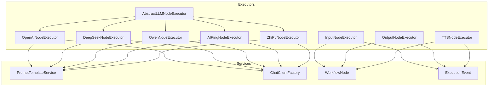
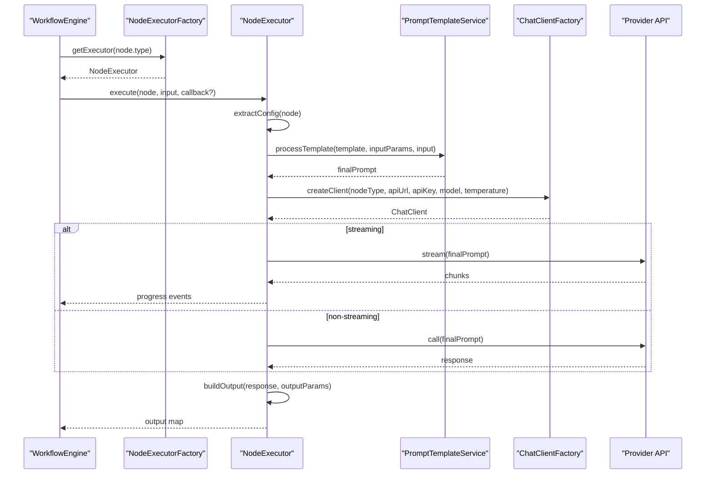
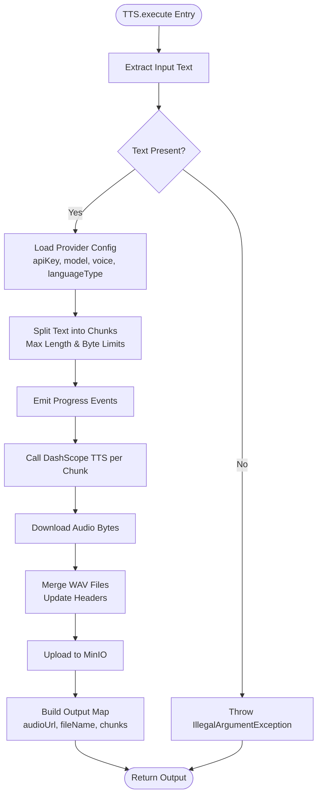
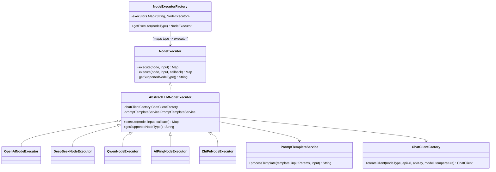

# Specific Node Implementations

<cite>
**Referenced Files in This Document**
- [AIPingNodeExecutor.java](file://backend/src/main/java/com/paiagent/engine/executor/impl/AIPingNodeExecutor.java)
- [AbstractLLMNodeExecutor.java](file://backend/src/main/java/com/paiagent/engine/executor/impl/AbstractLLMNodeExecutor.java)
- [DeepSeekNodeExecutor.java](file://backend/src/main/java/com/paiagent/engine/executor/impl/DeepSeekNodeExecutor.java)
- [InputNodeExecutor.java](file://backend/src/main/java/com/paiagent/engine/executor/impl/InputNodeExecutor.java)
- [OpenAINodeExecutor.java](file://backend/src/main/java/com/paiagent/engine/executor/impl/OpenAINodeExecutor.java)
- [OutputNodeExecutor.java](file://backend/src/main/java/com/paiagent/engine/executor/impl/OutputNodeExecutor.java)
- [QwenNodeExecutor.java](file://backend/src/main/java/com/paiagent/engine/executor/impl/QwenNodeExecutor.java)
- [TTSNodeExecutor.java](file://backend/src/main/java/com/paiagent/engine/executor/impl/TTSNodeExecutor.java)
- [ZhiPuNodeExecutor.java](file://backend/src/main/java/com/paiagent/engine/executor/impl/ZhiPuNodeExecutor.java)
- [LLMNodeConfig.java](file://backend/src/main/java/com/paiagent/engine/llm/LLMNodeConfig.java)
- [PromptTemplateService.java](file://backend/src/main/java/com/paiagent/engine/llm/PromptTemplateService.java)
- [ChatClientFactory.java](file://backend/src/main/java/com/paiagent/engine/llm/ChatClientFactory.java)
- [WorkflowNode.java](file://backend/src/main/java/com/paiagent/engine/model/WorkflowNode.java)
- [ExecutionEvent.java](file://backend/src/main/java/com/paiagent/dto/ExecutionEvent.java)
- [NodeExecutor.java](file://backend/src/main/java/com/paiagent/engine/executor/NodeExecutor.java)
- [NodeExecutorFactory.java](file://backend/src/main/java/com/paiagent/engine/executor/NodeExecutorFactory.java)
- [application.yml](file://backend/src/main/resources/application.yml)
</cite>

## Table of Contents
1. [Introduction](#introduction)
2. [Project Structure](#project-structure)
3. [Core Components](#core-components)
4. [Architecture Overview](#architecture-overview)
5. [Detailed Component Analysis](#detailed-component-analysis)
6. [Dependency Analysis](#dependency-analysis)
7. [Performance Considerations](#performance-considerations)
8. [Troubleshooting Guide](#troubleshooting-guide)
9. [Conclusion](#conclusion)

## Introduction
This document provides comprehensive documentation for all specific node executor implementations in the backend engine. It explains the unique characteristics, configuration requirements, parameter handling, and execution logic for each node type: OpenAI, DeepSeek, Qwen, TTS, Input/Output, AIPing, and ZhiPu. It covers provider-specific settings, API integration patterns, and result processing. Examples of node configuration, execution scenarios, and troubleshooting common issues are included for each implementation.

## Project Structure
The node executors are organized under the executor package with a shared abstraction for LLM-based nodes and specialized implementations for providers and media processing. Supporting services handle prompt templating, client creation, and workflow node modeling.

**Diagram sources**
- [AbstractLLMNodeExecutor.java:1-231](file://backend/src/main/java/com/paiagent/engine/executor/impl/AbstractLLMNodeExecutor.java#L1-L231)
- [OpenAINodeExecutor.java:1-17](file://backend/src/main/java/com/paiagent/engine/executor/impl/OpenAINodeExecutor.java#L1-L17)
- [DeepSeekNodeExecutor.java:1-17](file://backend/src/main/java/com/paiagent/engine/executor/impl/DeepSeekNodeExecutor.java#L1-L17)
- [QwenNodeExecutor.java:1-17](file://backend/src/main/java/com/paiagent/engine/executor/impl/QwenNodeExecutor.java#L1-L17)
- [AIPingNodeExecutor.java:1-17](file://backend/src/main/java/com/paiagent/engine/executor/impl/AIPingNodeExecutor.java#L1-L17)
- [ZhiPuNodeExecutor.java:1-17](file://backend/src/main/java/com/paiagent/engine/executor/impl/ZhiPuNodeExecutor.java#L1-L17)
- [InputNodeExecutor.java:1-27](file://backend/src/main/java/com/paiagent/engine/executor/impl/InputNodeExecutor.java#L1-L27)
- [OutputNodeExecutor.java:1-123](file://backend/src/main/java/com/paiagent/engine/executor/impl/OutputNodeExecutor.java#L1-L123)
- [TTSNodeExecutor.java:1-353](file://backend/src/main/java/com/paiagent/engine/executor/impl/TTSNodeExecutor.java#L1-L353)
- [PromptTemplateService.java:1-108](file://backend/src/main/java/com/paiagent/engine/llm/PromptTemplateService.java#L1-L108)
- [ChatClientFactory.java:1-60](file://backend/src/main/java/com/paiagent/engine/llm/ChatClientFactory.java#L1-L60)
- [WorkflowNode.java:1-38](file://backend/src/main/java/com/paiagent/engine/model/WorkflowNode.java#L1-L38)
- [ExecutionEvent.java:1-79](file://backend/src/main/java/com/paiagent/dto/ExecutionEvent.java#L1-L79)

**Section sources**
- [NodeExecutor.java:1-18](file://backend/src/main/java/com/paiagent/engine/executor/NodeExecutor.java#L1-L18)
- [NodeExecutorFactory.java:1-36](file://backend/src/main/java/com/paiagent/engine/executor/NodeExecutorFactory.java#L1-L36)

## Core Components
- AbstractLLMNodeExecutor: Provides unified LLM execution logic, including configuration extraction, prompt template processing, ChatClient creation, normal vs streaming execution, and output building with token metrics.
- PromptTemplateService: Handles template variable replacement for prompts using inputParams and runtime input data.
- ChatClientFactory: Creates provider-compatible ChatClient instances for OpenAI, DeepSeek, and Qwen via OpenAI-compatible APIs.
- WorkflowNode: Encapsulates node metadata and configuration data passed to executors.
- ExecutionEvent: Standardized event model for workflow and node lifecycle events.

**Section sources**
- [AbstractLLMNodeExecutor.java:1-231](file://backend/src/main/java/com/paiagent/engine/executor/impl/AbstractLLMNodeExecutor.java#L1-L231)
- [PromptTemplateService.java:1-108](file://backend/src/main/java/com/paiagent/engine/llm/PromptTemplateService.java#L1-L108)
- [ChatClientFactory.java:1-60](file://backend/src/main/java/com/paiagent/engine/llm/ChatClientFactory.java#L1-L60)
- [WorkflowNode.java:1-38](file://backend/src/main/java/com/paiagent/engine/model/WorkflowNode.java#L1-L38)
- [ExecutionEvent.java:1-79](file://backend/src/main/java/com/paiagent/dto/ExecutionEvent.java#L1-L79)

## Architecture Overview
The execution pipeline follows a consistent flow for LLM nodes: extract configuration, process prompt templates, create a provider-specific ChatClient, call the LLM (streaming or non-streaming), and build structured output with tokens. Specialized nodes override the node type identifier while reusing shared logic.

**Diagram sources**
- [AbstractLLMNodeExecutor.java:36-89](file://backend/src/main/java/com/paiagent/engine/executor/impl/AbstractLLMNodeExecutor.java#L36-L89)
- [PromptTemplateService.java:30-43](file://backend/src/main/java/com/paiagent/engine/llm/PromptTemplateService.java#L30-L43)
- [ChatClientFactory.java:29-58](file://backend/src/main/java/com/paiagent/engine/llm/ChatClientFactory.java#L29-L58)
- [NodeExecutorFactory.java:28-34](file://backend/src/main/java/com/paiagent/engine/executor/NodeExecutorFactory.java#L28-L34)

## Detailed Component Analysis

### OpenAI Node Executor
- Purpose: Executes OpenAI-compatible LLM calls with support for streaming output.
- Configuration requirements:
  - apiUrl: Provider endpoint URL.
  - apiKey: Authentication key.
  - model: Target model identifier.
  - temperature: Generation randomness parameter.
  - prompt: Template string with {{variable}} placeholders.
  - inputParams: Parameter mapping list supporting "input" static values and "reference" upstream values.
  - outputParams: Output field mapping list; if empty, defaults to a single "output" field.
  - streaming: Boolean enabling streaming mode.
- Execution logic:
  - Extracts configuration and logs settings and inputs.
  - Processes prompt template using PromptTemplateService.
  - Creates ChatClient via ChatClientFactory with OpenAI-compatible model.
  - Calls LLM either in streaming mode (with progress callbacks) or non-streaming mode.
  - Builds output map with content and token statistics (inputTokens, outputTokens, totalTokens).
- Provider-specific notes:
  - Uses OpenAI-compatible API via OpenAiApi and OpenAiChatModel.
  - Streaming mode emits progress events with incremental chunks and accumulated content.
- Example configuration keys:
  - apiUrl, apiKey, model, temperature, prompt, inputParams, outputParams, streaming.

**Section sources**
- [OpenAINodeExecutor.java:1-17](file://backend/src/main/java/com/paiagent/engine/executor/impl/OpenAINodeExecutor.java#L1-L17)
- [AbstractLLMNodeExecutor.java:41-89](file://backend/src/main/java/com/paiagent/engine/executor/impl/AbstractLLMNodeExecutor.java#L41-L89)
- [LLMNodeConfig.java:11-53](file://backend/src/main/java/com/paiagent/engine/llm/LLMNodeConfig.java#L11-L53)
- [PromptTemplateService.java:30-43](file://backend/src/main/java/com/paiagent/engine/llm/PromptTemplateService.java#L30-L43)
- [ChatClientFactory.java:29-58](file://backend/src/main/java/com/paiagent/engine/llm/ChatClientFactory.java#L29-L58)

### DeepSeek Node Executor
- Purpose: Executes DeepSeek LLM via OpenAI-compatible API.
- Configuration requirements: Same as OpenAI node (apiUrl, apiKey, model, temperature, prompt, inputParams, outputParams, streaming).
- Execution logic: Inherits all behavior from AbstractLLMNodeExecutor with node type set to "deepseek".
- Provider-specific notes:
  - Uses the same OpenAI-compatible ChatClientFactory configuration as OpenAI.

**Section sources**
- [DeepSeekNodeExecutor.java:1-17](file://backend/src/main/java/com/paiagent/engine/executor/impl/DeepSeekNodeExecutor.java#L1-L17)
- [AbstractLLMNodeExecutor.java:173-190](file://backend/src/main/java/com/paiagent/engine/executor/impl/AbstractLLMNodeExecutor.java#L173-L190)
- [ChatClientFactory.java:34-37](file://backend/src/main/java/com/paiagent/engine/llm/ChatClientFactory.java#L34-L37)

### Qwen Node Executor
- Purpose: Executes Tongyi Qianwen via OpenAI-compatible API.
- Configuration requirements: Same as OpenAI node.
- Execution logic: Inherits all behavior from AbstractLLMNodeExecutor with node type set to "qwen".
- Provider-specific notes:
  - Uses OpenAI-compatible ChatClientFactory configuration.

**Section sources**
- [QwenNodeExecutor.java:1-17](file://backend/src/main/java/com/paiagent/engine/executor/impl/QwenNodeExecutor.java#L1-L17)
- [AbstractLLMNodeExecutor.java:173-190](file://backend/src/main/java/com/paiagent/engine/executor/impl/AbstractLLMNodeExecutor.java#L173-L190)
- [ChatClientFactory.java:34-37](file://backend/src/main/java/com/paiagent/engine/llm/ChatClientFactory.java#L34-L37)

### ZhiPu Node Executor
- Purpose: Executes ZhiPu AI via OpenAI-compatible API.
- Configuration requirements: Same as OpenAI node.
- Execution logic: Inherits all behavior from AbstractLLMNodeExecutor with node type set to "zhipu".
- Provider-specific notes:
  - Uses OpenAI-compatible ChatClientFactory configuration.

**Section sources**
- [ZhiPuNodeExecutor.java:1-17](file://backend/src/main/java/com/paiagent/engine/executor/impl/ZhiPuNodeExecutor.java#L1-L17)
- [AbstractLLMNodeExecutor.java:173-190](file://backend/src/main/java/com/paiagent/engine/executor/impl/AbstractLLMNodeExecutor.java#L173-L190)
- [ChatClientFactory.java:34-37](file://backend/src/main/java/com/paiagent/engine/llm/ChatClientFactory.java#L34-L37)

### AIPing Node Executor
- Purpose: Health-check style node using OpenAI-compatible interface.
- Configuration requirements: Same as OpenAI node.
- Execution logic: Inherits all behavior from AbstractLLMNodeExecutor with node type set to "ai_ping".
- Provider-specific notes:
  - Intended for connectivity verification rather than content generation.

**Section sources**
- [AIPingNodeExecutor.java:1-17](file://backend/src/main/java/com/paiagent/engine/executor/impl/AIPingNodeExecutor.java#L1-L17)
- [AbstractLLMNodeExecutor.java:173-190](file://backend/src/main/java/com/paiagent/engine/executor/impl/AbstractLLMNodeExecutor.java#L173-L190)

### Input Node Executor
- Purpose: Passes upstream inputs directly to downstream nodes.
- Configuration requirements:
  - None required; returns a copy of the input map.
- Execution logic:
  - Returns a shallow copy of the input map as-is.
- Notes:
  - Useful as the starting node in a workflow.

**Section sources**
- [InputNodeExecutor.java:1-27](file://backend/src/main/java/com/paiagent/engine/executor/impl/InputNodeExecutor.java#L1-L27)

### Output Node Executor
- Purpose: Constructs final output using a responseContent template and optional outputParams.
- Configuration requirements:
  - responseContent: Template string with {{parameter}} placeholders.
  - outputParams: List of parameter mappings:
    - name: Output field name.
    - type: "input" for literal values or "reference" for upstream node outputs.
    - value/referenceNode: For "input", literal string value; for "reference", upstream node reference in "nodeId.field" format.
- Execution logic:
  - Logs configuration and input.
  - Resolves parameter values from outputParams:
    - For "input": uses literal value.
    - For "reference": resolves from __nodeOutputs__ (LangGraph) or input map (DAG), with fallback to "input" for "user_input".
  - Replaces {{placeholders}} in responseContent with resolved values.
  - Returns a map containing the final "output" field.
- Notes:
  - Supports LangGraph-style nodeOutputs and DAG-style direct input references.

**Section sources**
- [OutputNodeExecutor.java:21-116](file://backend/src/main/java/com/paiagent/engine/executor/impl/OutputNodeExecutor.java#L21-L116)

### TTS Node Executor
- Purpose: Converts text to speech using Alibaba DashScope TTS, splits long texts, merges audio, and uploads to MinIO.
- Configuration requirements:
  - apiKey: Required for DashScope API.
  - model: Defaults to "qwen3-tts-flash"; supports provider-specific models.
  - voice: Defaults to "Cherry"; accepts supported voice identifiers.
  - languageType: Defaults to "Auto"; selects language behavior.
  - inputParams: Text source resolution:
    - name="text", type="input" uses literal value.
    - type="reference" uses upstream node output in "nodeId.field" format.
- Execution logic:
  - Validates input text and extracts from inputParams or fallbacks.
  - Splits text into chunks respecting UTF-8 byte limits and punctuation boundaries.
  - Streams progress events indicating total chunks and current chunk.
  - Calls DashScope MultiModalConversation for each chunk and downloads audio URLs.
  - Merges WAV files by updating header sizes and concatenating audio data.
  - Uploads merged audio to MinIO and returns audioUrl, fileName, and chunks count.
- Provider-specific notes:
  - Uses Alibaba DashScope SDK for TTS.
  - Requires MinIO service for audio storage and retrieval.
- Example configuration keys:
  - apiKey, model, voice, languageType, inputParams.

**Diagram sources**
- [TTSNodeExecutor.java:38-174](file://backend/src/main/java/com/paiagent/engine/executor/impl/TTSNodeExecutor.java#L38-L174)
- [TTSNodeExecutor.java:231-289](file://backend/src/main/java/com/paiagent/engine/executor/impl/TTSNodeExecutor.java#L231-L289)
- [TTSNodeExecutor.java:291-352](file://backend/src/main/java/com/paiagent/engine/executor/impl/TTSNodeExecutor.java#L291-L352)

**Section sources**
- [TTSNodeExecutor.java:38-174](file://backend/src/main/java/com/paiagent/engine/executor/impl/TTSNodeExecutor.java#L38-L174)
- [TTSNodeExecutor.java:231-289](file://backend/src/main/java/com/paiagent/engine/executor/impl/TTSNodeExecutor.java#L231-L289)
- [TTSNodeExecutor.java:291-352](file://backend/src/main/java/com/paiagent/engine/executor/impl/TTSNodeExecutor.java#L291-L352)

## Dependency Analysis
- NodeExecutorFactory registers all NodeExecutor beans by their supported node type, enabling dynamic dispatch based on node.type.
- AbstractLLMNodeExecutor depends on PromptTemplateService and ChatClientFactory for prompt processing and client creation respectively.
- LLMNodeConfig encapsulates all provider-specific configuration extracted from WorkflowNode.data.
- TTSNodeExecutor depends on MinIO service for audio upload and the Alibaba DashScope SDK for synthesis.

**Diagram sources**
- [NodeExecutor.java:9-18](file://backend/src/main/java/com/paiagent/engine/executor/NodeExecutor.java#L9-L18)
- [NodeExecutorFactory.java:14-35](file://backend/src/main/java/com/paiagent/engine/executor/NodeExecutorFactory.java#L14-L35)
- [AbstractLLMNodeExecutor.java:23-231](file://backend/src/main/java/com/paiagent/engine/executor/impl/AbstractLLMNodeExecutor.java#L23-L231)
- [OpenAINodeExecutor.java:1-17](file://backend/src/main/java/com/paiagent/engine/executor/impl/OpenAINodeExecutor.java#L1-L17)
- [DeepSeekNodeExecutor.java:1-17](file://backend/src/main/java/com/paiagent/engine/executor/impl/DeepSeekNodeExecutor.java#L1-L17)
- [QwenNodeExecutor.java:1-17](file://backend/src/main/java/com/paiagent/engine/executor/impl/QwenNodeExecutor.java#L1-L17)
- [AIPingNodeExecutor.java:1-17](file://backend/src/main/java/com/paiagent/engine/executor/impl/AIPingNodeExecutor.java#L1-L17)
- [ZhiPuNodeExecutor.java:1-17](file://backend/src/main/java/com/paiagent/engine/executor/impl/ZhiPuNodeExecutor.java#L1-L17)
- [PromptTemplateService.java:18-108](file://backend/src/main/java/com/paiagent/engine/llm/PromptTemplateService.java#L18-L108)
- [ChatClientFactory.java:17-60](file://backend/src/main/java/com/paiagent/engine/llm/ChatClientFactory.java#L17-L60)

**Section sources**
- [NodeExecutorFactory.java:18-34](file://backend/src/main/java/com/paiagent/engine/executor/NodeExecutorFactory.java#L18-L34)
- [AbstractLLMNodeExecutor.java:25-29](file://backend/src/main/java/com/paiagent/engine/executor/impl/AbstractLLMNodeExecutor.java#L25-L29)

## Performance Considerations
- Streaming vs Non-streaming:
  - Streaming reduces perceived latency and enables real-time progress updates but does not provide token usage metadata.
  - Non-streaming collects token usage from provider metadata for accurate cost tracking.
- Text splitting for TTS:
  - Chunk length and UTF-8 byte limits prevent provider errors and ensure audio quality.
  - Punctuation-aware splitting improves natural pauses between segments.
- Concurrency:
  - TTS executor processes chunks concurrently and aggregates results; ensure adequate thread pool sizing for high concurrency.
- Logging overhead:
  - Extensive logging aids debugging but may impact throughput under heavy load.

[No sources needed since this section provides general guidance]

## Troubleshooting Guide
- Missing or invalid API credentials:
  - Symptom: Authentication failures during LLM calls or TTS synthesis.
  - Resolution: Verify apiKey in node configuration and environment variables.
- Empty or missing input text:
  - Symptom: IllegalArgumentException in TTS node.
  - Resolution: Ensure inputParams includes a valid "text" source or upstream node provides "output"/"input"/"text".
- Unsupported node type:
  - Symptom: Runtime exception when retrieving executor.
  - Resolution: Confirm node.type matches a registered executor (openai, deepseek, qwen, zhipu, ai_ping, input, output, tts).
- Streaming mode token stats unavailable:
  - Symptom: Tokens fields absent in output.
  - Resolution: Switch to non-streaming mode if token usage tracking is required.
- TTS audio upload failure:
  - Symptom: Missing audioUrl or upload errors.
  - Resolution: Check MinIO configuration and credentials; verify network connectivity and audio URL validity from provider.
- Unknown voice or unsupported language:
  - Symptom: Voice conversion warnings or synthesis errors.
  - Resolution: Use supported voice identifiers and languageType values as per provider documentation.

**Section sources**
- [AbstractLLMNodeExecutor.java:71-75](file://backend/src/main/java/com/paiagent/engine/executor/impl/AbstractLLMNodeExecutor.java#L71-L75)
- [TTSNodeExecutor.java:40-53](file://backend/src/main/java/com/paiagent/engine/executor/impl/TTSNodeExecutor.java#L40-L53)
- [NodeExecutorFactory.java:28-34](file://backend/src/main/java/com/paiagent/engine/executor/NodeExecutorFactory.java#L28-L34)
- [application.yml:49-55](file://backend/src/main/resources/application.yml#L49-L55)

## Conclusion
Each node executor adheres to a consistent execution model while accommodating provider-specific configurations and capabilities. LLM nodes share a robust abstraction for prompt processing, client creation, and output construction, whereas TTS introduces specialized text segmentation, audio merging, and cloud storage integration. Proper configuration and understanding of streaming behavior enable efficient and reliable workflows across diverse providers and use cases.