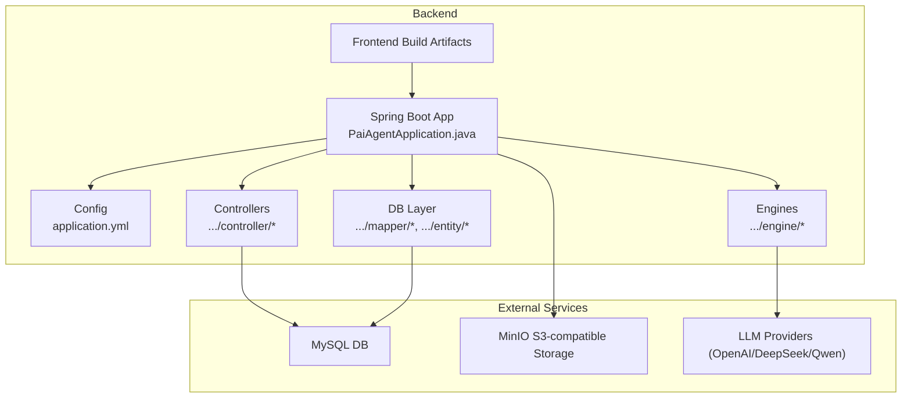
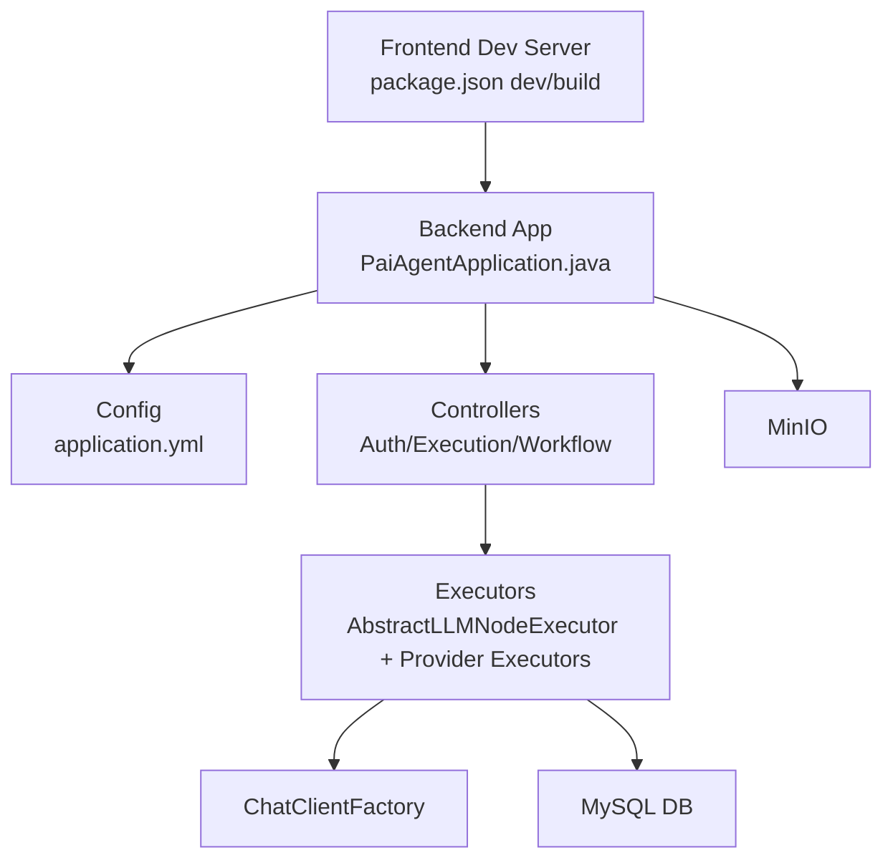
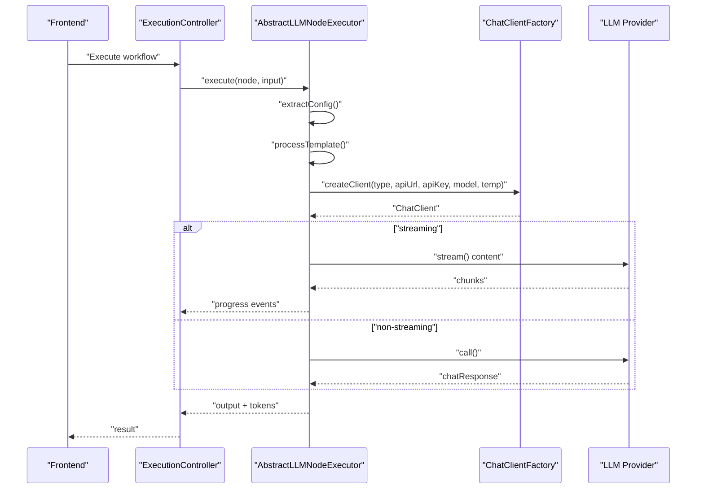
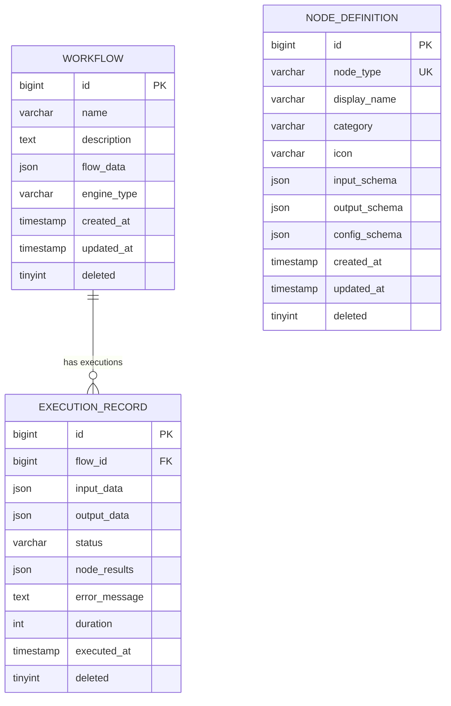
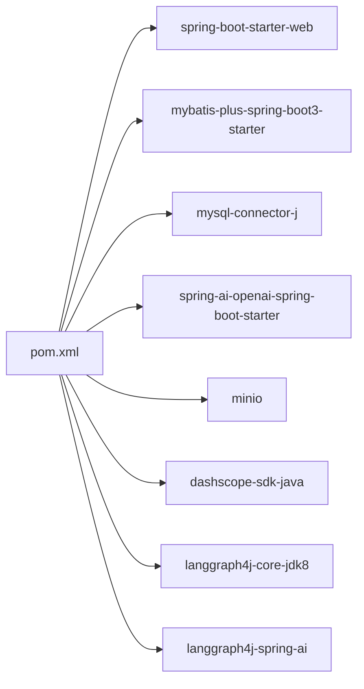

# Troubleshooting & FAQ

<cite>
**Referenced Files in This Document**
- [PaiAgentApplication.java](file://backend/src/main/java/com/paiagent/PaiAgentApplication.java)
- [application.yml](file://backend/src/main/resources/application.yml)
- [pom.xml](file://backend/pom.xml)
- [WebConfig.java](file://backend/src/main/java/com/paiagent/config/WebConfig.java)
- [MyMetaObjectHandler.java](file://backend/src/main/java/com/paiagent/config/MyMetaObjectHandler.java)
- [Result.java](file://backend/src/main/java/com/paiagent/common/Result.java)
- [MinioConfig.java](file://backend/src/main/java/com/paiagent/config/MinioConfig.java)
- [schema.sql](file://backend/src/main/resources/schema.sql)
- [migration_add_engine_type.sql](file://backend/src/main/resources/migration_add_engine_type.sql)
- [ChatClientFactory.java](file://backend/src/main/java/com/paiagent/engine/llm/ChatClientFactory.java)
- [AbstractLLMNodeExecutor.java](file://backend/src/main/java/com/paiagent/engine/executor/impl/AbstractLLMNodeExecutor.java)
- [OpenAINodeExecutor.java](file://backend/src/main/java/com/paiagent/engine/executor/impl/OpenAINodeExecutor.java)
- [QwenNodeExecutor.java](file://backend/src/main/java/com/paiagent/engine/executor/impl/QwenNodeExecutor.java)
- [DeepSeekNodeExecutor.java](file://backend/src/main/java/com/paiagent/engine/executor/impl/DeepSeekNodeExecutor.java)
- [package.json](file://frontend/package.json)
</cite>

## Table of Contents
1. [Introduction](#introduction)
2. [Project Structure](#project-structure)
3. [Core Components](#core-components)
4. [Architecture Overview](#architecture-overview)
5. [Detailed Component Analysis](#detailed-component-analysis)
6. [Dependency Analysis](#dependency-analysis)
7. [Performance Considerations](#performance-considerations)
8. [Troubleshooting Guide](#troubleshooting-guide)
9. [Conclusion](#conclusion)
10. [Appendices](#appendices)

## Introduction
This document provides a comprehensive troubleshooting guide and FAQ for the project. It covers:
- Development environment issues (dependencies, ports, IDE configuration)
- LLM provider integration problems (API keys, network, quotas)
- Database connectivity, migrations, and performance
- Workflow execution failures, node configuration errors, and frontend integration
- Step-by-step resolutions and preventive measures

## Project Structure
The project consists of:
- Backend (Spring Boot): configuration, controllers, engines, mappers, services, and resources
- Frontend (React/Vite): editor UI, stores, and API clients
- Shared configuration via YAML and SQL scripts

**Diagram sources**
- [PaiAgentApplication.java:1-16](file://backend/src/main/java/com/paiagent/PaiAgentApplication.java#L1-L16)
- [application.yml:1-55](file://backend/src/main/resources/application.yml#L1-L55)

**Section sources**
- [PaiAgentApplication.java:1-16](file://backend/src/main/java/com/paiagent/PaiAgentApplication.java#L1-L16)
- [application.yml:1-55](file://backend/src/main/resources/application.yml#L1-L55)

## Core Components
- Application bootstrap and mapper scanning
- Centralized configuration (server, datasource, OpenAI, MyBatis-Plus, OpenAPI/Swagger, MinIO)
- CORS and authentication interceptors
- Automatic field filling for audit timestamps
- Unified response wrapper
- MinIO client bean
- Database schema and migration script
- LLM client factory and abstract LLM node executor
- Provider-specific executors (OpenAI, Qwen, DeepSeek)

**Section sources**
- [PaiAgentApplication.java:1-16](file://backend/src/main/java/com/paiagent/PaiAgentApplication.java#L1-L16)
- [application.yml:1-55](file://backend/src/main/resources/application.yml#L1-L55)
- [WebConfig.java:1-35](file://backend/src/main/java/com/paiagent/config/WebConfig.java#L1-L35)
- [MyMetaObjectHandler.java:1-27](file://backend/src/main/java/com/paiagent/config/MyMetaObjectHandler.java#L1-L27)
- [Result.java:1-79](file://backend/src/main/java/com/paiagent/common/Result.java#L1-L79)
- [MinioConfig.java:1-28](file://backend/src/main/java/com/paiagent/config/MinioConfig.java#L1-L28)
- [schema.sql:1-84](file://backend/src/main/resources/schema.sql#L1-L84)
- [migration_add_engine_type.sql:1-17](file://backend/src/main/resources/migration_add_engine_type.sql#L1-L17)
- [ChatClientFactory.java:1-60](file://backend/src/main/java/com/paiagent/engine/llm/ChatClientFactory.java#L1-L60)
- [AbstractLLMNodeExecutor.java:1-231](file://backend/src/main/java/com/paiagent/engine/executor/impl/AbstractLLMNodeExecutor.java#L1-L231)
- [OpenAINodeExecutor.java:1-17](file://backend/src/main/java/com/paiagent/engine/executor/impl/OpenAINodeExecutor.java#L1-L17)
- [QwenNodeExecutor.java:1-17](file://backend/src/main/java/com/paiagent/engine/executor/impl/QwenNodeExecutor.java#L1-L17)
- [DeepSeekNodeExecutor.java:1-17](file://backend/src/main/java/com/paiagent/engine/executor/impl/DeepSeekNodeExecutor.java#L1-L17)

## Architecture Overview
High-level runtime flow:
- Frontend builds and runs locally, communicates with backend APIs
- Backend exposes REST endpoints, applies CORS and auth interceptors
- Controllers orchestrate workflow execution via engines
- Engines use LLM providers via a dynamic ChatClient factory
- Data persistence via MyBatis-Plus against MySQL
- File storage via MinIO

**Diagram sources**
- [package.json:1-40](file://frontend/package.json#L1-L40)
- [PaiAgentApplication.java:1-16](file://backend/src/main/java/com/paiagent/PaiAgentApplication.java#L1-L16)
- [application.yml:1-55](file://backend/src/main/resources/application.yml#L1-L55)
- [AbstractLLMNodeExecutor.java:1-231](file://backend/src/main/java/com/paiagent/engine/executor/impl/AbstractLLMNodeExecutor.java#L1-L231)
- [ChatClientFactory.java:1-60](file://backend/src/main/java/com/paiagent/engine/llm/ChatClientFactory.java#L1-L60)

## Detailed Component Analysis

### LLM Integration Flow

**Diagram sources**
- [AbstractLLMNodeExecutor.java:36-89](file://backend/src/main/java/com/paiagent/engine/executor/impl/AbstractLLMNodeExecutor.java#L36-L89)
- [ChatClientFactory.java:29-58](file://backend/src/main/java/com/paiagent/engine/llm/ChatClientFactory.java#L29-L58)

**Section sources**
- [AbstractLLMNodeExecutor.java:36-89](file://backend/src/main/java/com/paiagent/engine/executor/impl/AbstractLLMNodeExecutor.java#L36-L89)
- [ChatClientFactory.java:29-58](file://backend/src/main/java/com/paiagent/engine/llm/ChatClientFactory.java#L29-L58)

### Database Schema and Migration

**Diagram sources**
- [schema.sql:6-51](file://backend/src/main/resources/schema.sql#L6-L51)

**Section sources**
- [schema.sql:6-51](file://backend/src/main/resources/schema.sql#L6-L51)
- [migration_add_engine_type.sql:7-13](file://backend/src/main/resources/migration_add_engine_type.sql#L7-L13)

## Dependency Analysis
- Java 21 and Spring Boot 3.4.1
- Spring AI OpenAI starter for provider integrations
- MyBatis-Plus for ORM
- MySQL Connector/J for JDBC
- MinIO SDK for object storage
- React/Vite for frontend

**Diagram sources**
- [pom.xml:60-131](file://backend/pom.xml#L60-L131)

**Section sources**
- [pom.xml:29-35](file://backend/pom.xml#L29-L35)
- [pom.xml:60-131](file://backend/pom.xml#L60-L131)

## Performance Considerations
- Streaming vs non-streaming LLM calls: streaming reduces latency feedback but omits token usage metadata
- Token usage extraction: available only for non-streaming calls
- Logging and tracing: enable structured logs for slow nodes and long-running workflows
- Database: ensure proper indexing on frequently queried columns (execution status, timestamps)
- MinIO: tune connection pool and region alignment to reduce latency

[No sources needed since this section provides general guidance]

## Troubleshooting Guide

### Development Environment Issues

- Port Binding Conflicts
  - Symptom: server fails to start on configured port
  - Resolution:
    - Change server.port in configuration
    - Kill process occupying the port
    - Verify firewall allows inbound connections
  - Prevention: reserve a fixed port for local development and document it

- Dependency Conflicts and Maven Build Failures
  - Symptom: dependency resolution errors or incompatible versions
  - Resolution:
    - Align Java version with project property
    - Refresh Maven dependencies and rebuild
    - Check milestone repository availability
  - Prevention: keep dependency versions synchronized with managed BOM

- IDE Configuration Problems
  - Symptom: missing Lombok-generated methods or unresolved imports
  - Resolution:
    - Enable annotation processing in IDE
    - Install Lombok plugin and restart IDE
    - Re-import Maven project after enabling plugins
  - Prevention: configure IDE templates and plugins globally

- Frontend Dev Server Not Starting
  - Symptom: Vite dev server fails or hot reload not working
  - Resolution:
    - Install dependencies from package manifest
    - Check Node.js version compatibility
    - Clear node_modules and reinstall if needed
  - Prevention: pin Node.js version and lock dependency versions

**Section sources**
- [application.yml:1-2](file://backend/src/main/resources/application.yml#L1-L2)
- [pom.xml:29-35](file://backend/pom.xml#L29-L35)
- [package.json:1-40](file://frontend/package.json#L1-L40)

### LLM Provider Integration Issues

- API Key Configuration Errors
  - Symptom: Unauthorized or invalid API key responses
  - Resolution:
    - Set OPENAI_API_KEY environment variable
    - Verify node-level apiKey overrides if used
    - Confirm provider supports OpenAI-compatible interface
  - Prevention: use environment variables and avoid committing secrets

- Network Connectivity Problems
  - Symptom: timeouts or DNS failures to provider endpoints
  - Resolution:
    - Test external connectivity to provider base URL
    - Configure proxy if behind corporate firewall
    - Validate custom apiUrl in node configuration
  - Prevention: pre-validate endpoints and use stable mirrors

- Quota Limitations and Rate Limits
  - Symptom: 429 errors or account disabled
  - Resolution:
    - Monitor token usage and adjust maxTokens
    - Implement retry with exponential backoff
    - Upgrade plan or distribute load across keys
  - Prevention: add circuit breaker and alerting

- Provider-Specific Executor Behavior
  - Symptom: unexpected output or missing tokens
  - Resolution:
    - Use correct node type mapping (openai, qwen, deepseek)
    - Ensure model and temperature match provider capabilities
  - Prevention: validate node configuration schemas

**Section sources**
- [application.yml:15-19](file://backend/src/main/resources/application.yml#L15-L19)
- [AbstractLLMNodeExecutor.java:172-190](file://backend/src/main/java/com/paiagent/engine/executor/impl/AbstractLLMNodeExecutor.java#L172-L190)
- [ChatClientFactory.java:29-58](file://backend/src/main/java/com/paiagent/engine/llm/ChatClientFactory.java#L29-L58)
- [OpenAINodeExecutor.java:10-16](file://backend/src/main/java/com/paiagent/engine/executor/impl/OpenAINodeExecutor.java#L10-L16)
- [QwenNodeExecutor.java:9-16](file://backend/src/main/java/com/paiagent/engine/executor/impl/QwenNodeExecutor.java#L9-L16)
- [DeepSeekNodeExecutor.java:9-16](file://backend/src/main/java/com/paiagent/engine/executor/impl/DeepSeekNodeExecutor.java#L9-L16)

### Database Connectivity, Migrations, and Performance

- Cannot Connect to MySQL
  - Symptom: startup failure with JDBC URL or credentials
  - Resolution:
    - Verify MySQL is running and accessible
    - Confirm JDBC URL, username, and password
    - Check timezone and SSL settings per configuration
  - Prevention: automate DB bootstrapping and health checks

- Schema Initialization Failures
  - Symptom: missing tables or constraint errors
  - Resolution:
    - Apply schema SQL script to initialize database
    - Ensure correct character set and collation
  - Prevention: include schema initialization in CI/CD

- Migration for engine_type Column
  - Symptom: engine selection not recognized
  - Resolution:
    - Run migration script to add and populate engine_type
    - Validate default value and existing records
  - Prevention: version control migration scripts and test upgrades

- Performance Bottlenecks
  - Symptom: slow queries on execution records
  - Resolution:
    - Use indexes on status, executed_at, and foreign keys
    - Optimize queries and pagination
  - Prevention: monitor slow queries and add indexes proactively

**Section sources**
- [application.yml:7-11](file://backend/src/main/resources/application.yml#L7-L11)
- [schema.sql:1-84](file://backend/src/main/resources/schema.sql#L1-L84)
- [migration_add_engine_type.sql:7-13](file://backend/src/main/resources/migration_add_engine_type.sql#L7-L13)

### Workflow Execution Failures and Node Configuration

- Node Configuration Errors
  - Symptom: invalid prompt template, missing apiKey, or wrong model
  - Resolution:
    - Validate node data structure and required fields
    - Check input/output/outputParam schemas
    - Ensure streaming flag matches intended behavior
  - Prevention: enforce schema validation and unit tests

- Stream vs Non-Stream Behavior
  - Symptom: missing token stats or delayed feedback
  - Resolution:
    - Choose streaming for UI responsiveness
    - Use non-streaming when token usage is required
  - Prevention: document trade-offs per use case

- Execution Progress Reporting
  - Symptom: no incremental updates during generation
  - Resolution:
    - Ensure progress callback is provided for streaming
    - Verify event publishing in executor
  - Prevention: instrument progress callbacks in UI

**Section sources**
- [AbstractLLMNodeExecutor.java:172-190](file://backend/src/main/java/com/paiagent/engine/executor/impl/AbstractLLMNodeExecutor.java#L172-L190)
- [AbstractLLMNodeExecutor.java:143-168](file://backend/src/main/java/com/paiagent/engine/executor/impl/AbstractLLMNodeExecutor.java#L143-L168)

### Frontend Integration Problems

- CORS and Authentication
  - Symptom: blocked requests or 401 errors
  - Resolution:
    - Confirm allowed origin pattern for localhost
    - Ensure auth interceptor excludes public routes
  - Prevention: align frontend/backend origins and scopes

- API Contract Mismatches
  - Symptom: deserialization errors or missing fields
  - Resolution:
    - Compare frontend DTOs with backend responses
    - Keep OpenAPI/Swagger enabled for contract validation
  - Prevention: version APIs and document changes

**Section sources**
- [WebConfig.java:20-34](file://backend/src/main/java/com/paiagent/config/WebConfig.java#L20-L34)
- [Result.java:29-77](file://backend/src/main/java/com/paiagent/common/Result.java#L29-L77)

### Debugging Strategies

- Enable Structured Logging
  - Add logging for LLM calls, token usage, and execution stages
  - Capture request IDs and correlate frontend actions with backend logs

- Validate Configuration at Runtime
  - Print effective configuration values during startup
  - Verify environment variables are loaded

- Test End-to-End Workflows
  - Use simple workflows with single LLM node
  - Toggle streaming and observe differences

- Inspect Database State
  - Query execution records for status and error messages
  - Review node results and timing metrics

- Frontend Console and Network Tabs
  - Check for CORS errors and failed requests
  - Validate payload shapes and response parsing

**Section sources**
- [PaiAgentApplication.java:11-13](file://backend/src/main/java/com/paiagent/PaiAgentApplication.java#L11-L13)
- [AbstractLLMNodeExecutor.java:44-88](file://backend/src/main/java/com/paiagent/engine/executor/impl/AbstractLLMNodeExecutor.java#L44-L88)
- [application.yml:36-47](file://backend/src/main/resources/application.yml#L36-L47)

## Conclusion
This guide consolidates actionable steps to resolve common issues across environments, LLM integrations, databases, workflows, and frontend integration. Adopt the recommended preventive measures to minimize recurrence and improve operability.

## Appendices

### Quick Fix Reference
- Ports: change server.port and free the port
- Dependencies: align Java version and refresh Maven
- Secrets: set OPENAI_API_KEY and provider-specific keys
- DB: apply schema and migration scripts
- Streaming: choose streaming for UX, non-streaming for token stats
- CORS/Auth: verify allowed origins and interceptor paths
- Frontend: install deps, check Node version, and inspect network tab

[No sources needed since this section summarizes without analyzing specific files]