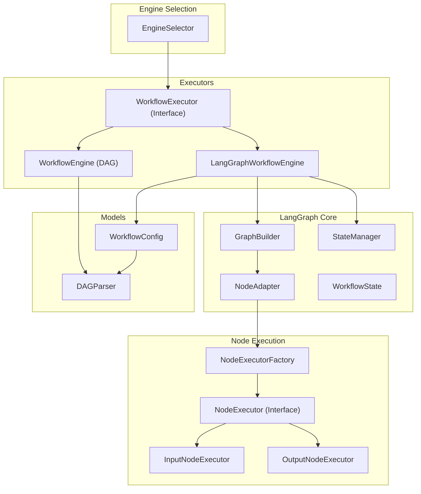
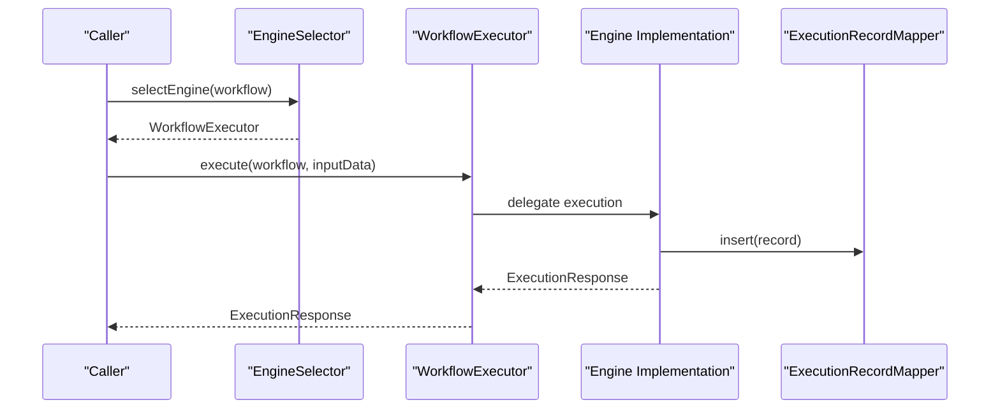
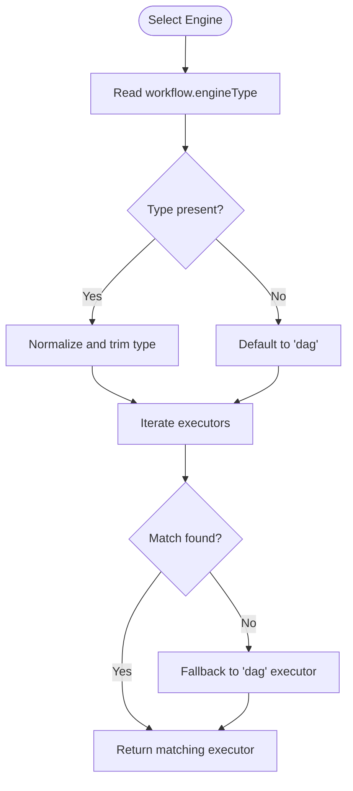
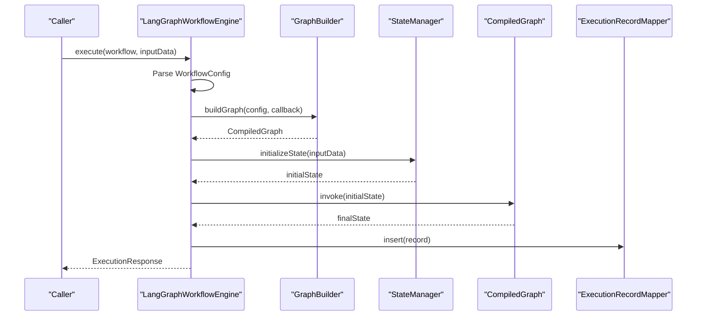
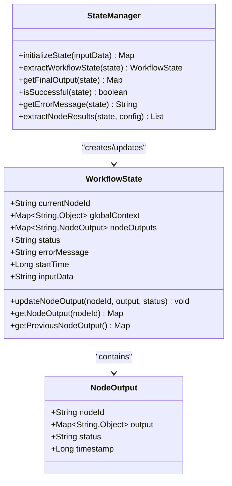
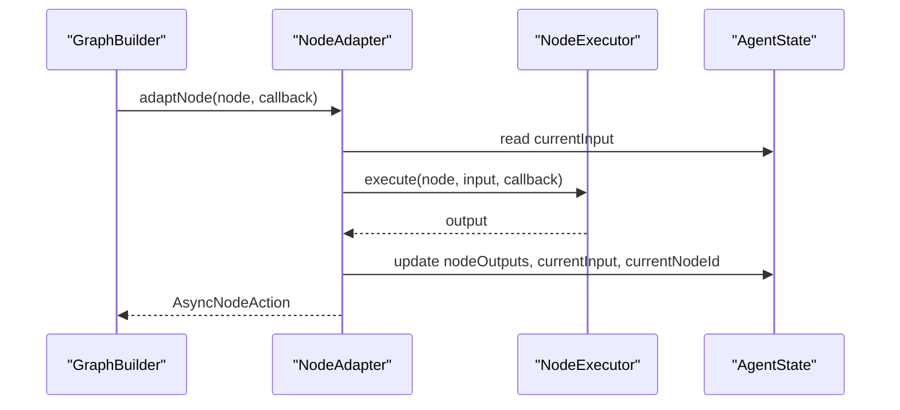
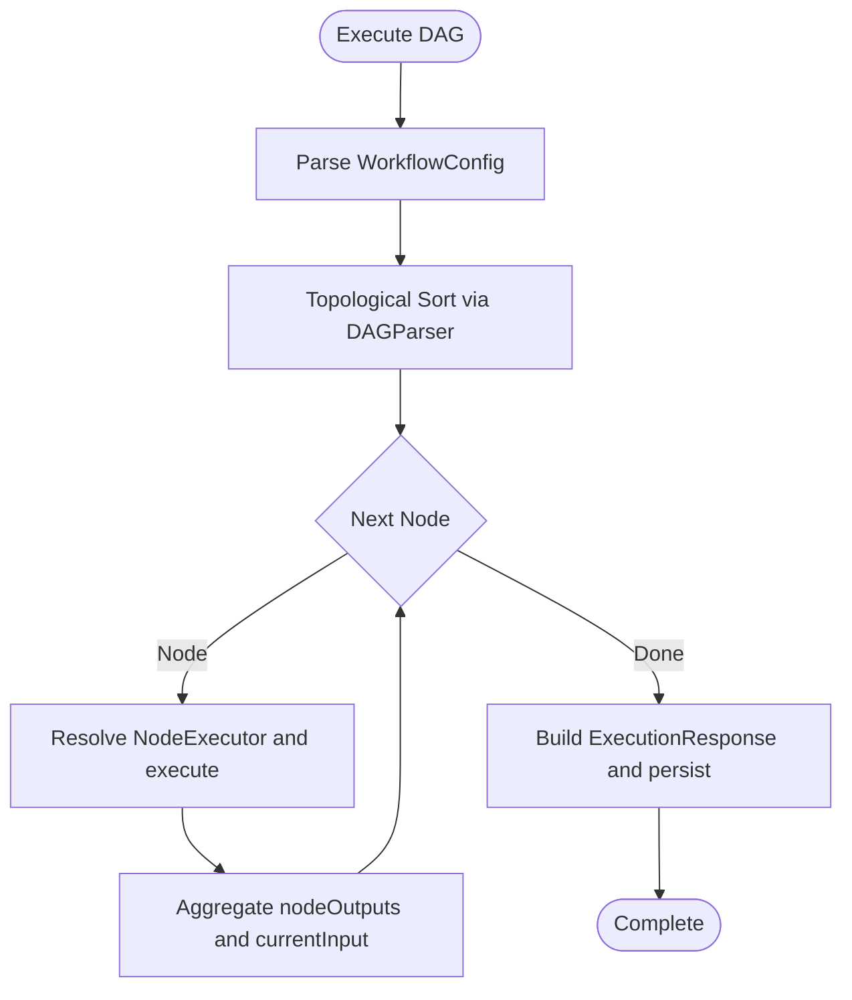
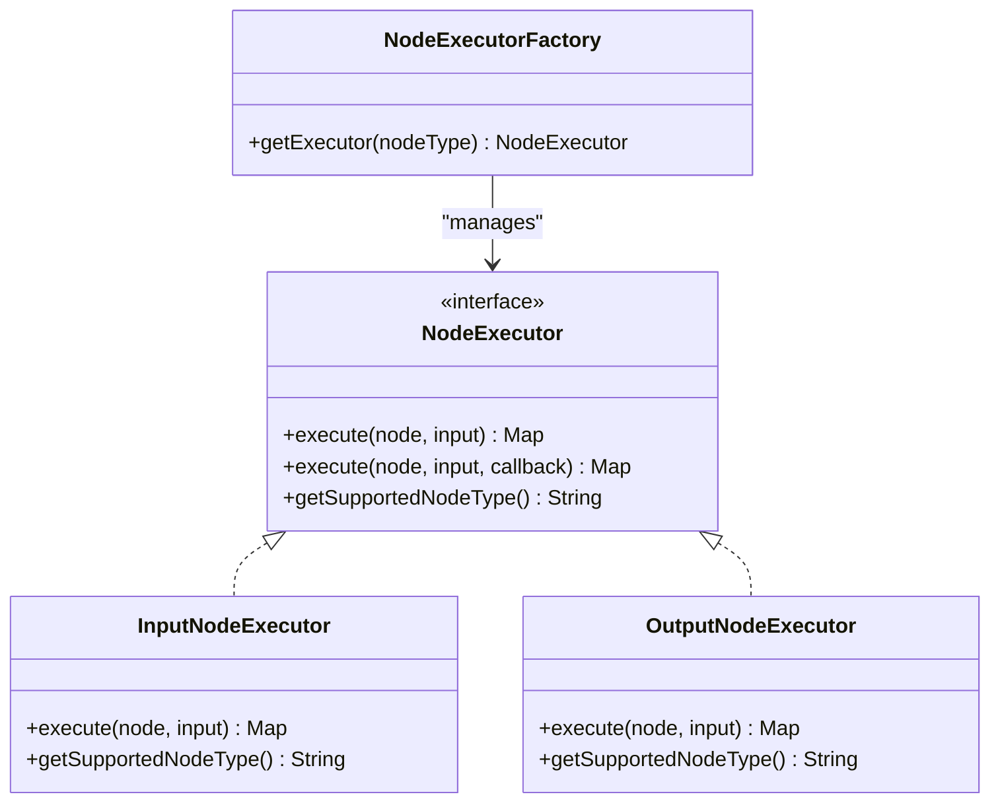
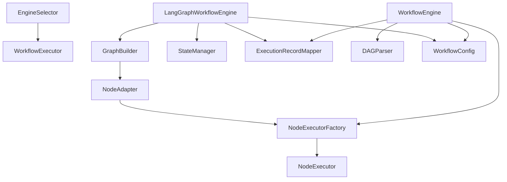

# Core Engine Architecture

<cite>
**Referenced Files in This Document**
- [EngineSelector.java](file://backend/src/main/java/com/paiagent/engine/EngineSelector.java)
- [WorkflowExecutor.java](file://backend/src/main/java/com/paiagent/engine/WorkflowExecutor.java)
- [WorkflowEngine.java](file://backend/src/main/java/com/paiagent/engine/WorkflowEngine.java)
- [LangGraphWorkflowEngine.java](file://backend/src/main/java/com/paiagent/engine/langgraph/LangGraphWorkflowEngine.java)
- [WorkflowState.java](file://backend/src/main/java/com/paiagent/engine/langgraph/WorkflowState.java)
- [StateManager.java](file://backend/src/main/java/com/paiagent/engine/langgraph/state/StateManager.java)
- [GraphBuilder.java](file://backend/src/main/java/com/paiagent/engine/langgraph/builder/GraphBuilder.java)
- [NodeAdapter.java](file://backend/src/main/java/com/paiagent/engine/langgraph/adapter/NodeAdapter.java)
- [NodeExecutorFactory.java](file://backend/src/main/java/com/paiagent/engine/executor/NodeExecutorFactory.java)
- [NodeExecutor.java](file://backend/src/main/java/com/paiagent/engine/executor/NodeExecutor.java)
- [DAGParser.java](file://backend/src/main/java/com/paiagent/engine/dag/DAGParser.java)
- [WorkflowConfig.java](file://backend/src/main/java/com/paiagent/engine/model/WorkflowConfig.java)
- [InputNodeExecutor.java](file://backend/src/main/java/com/paiagent/engine/executor/impl/InputNodeExecutor.java)
- [OutputNodeExecutor.java](file://backend/src/main/java/com/paiagent/engine/executor/impl/OutputNodeExecutor.java)
</cite>

## Table of Contents
1. [Introduction](#introduction)
2. [Project Structure](#project-structure)
3. [Core Components](#core-components)
4. [Architecture Overview](#architecture-overview)
5. [Detailed Component Analysis](#detailed-component-analysis)
6. [Dependency Analysis](#dependency-analysis)
7. [Performance Considerations](#performance-considerations)
8. [Troubleshooting Guide](#troubleshooting-guide)
9. [Conclusion](#conclusion)

## Introduction
This document explains the core workflow engine architecture of the system, focusing on the LangGraphWorkflowEngine as the primary execution engine and its integration with LangGraph4j for stateful workflow execution. It documents the engine selection strategy, interface implementations, and execution lifecycle management. The workflow execution flow is covered from initialization through completion, including error handling and state management. Practical examples of engine configuration, execution monitoring, and performance considerations are included, along with the relationship between different engine types and selection criteria.

## Project Structure
The workflow engine is organized around a shared interface and multiple implementations:
- Engine selection and orchestration via EngineSelector
- Unified execution interface via WorkflowExecutor
- Legacy DAG engine via WorkflowEngine
- Modern LangGraph engine via LangGraphWorkflowEngine
- State management and graph building for LangGraph
- Node execution abstraction via NodeExecutor and NodeExecutorFactory
- Model definitions for workflow configuration

**Diagram sources**
- [EngineSelector.java:29-49](file://backend/src/main/java/com/paiagent/engine/EngineSelector.java#L29-L49)
- [WorkflowExecutor.java:15-47](file://backend/src/main/java/com/paiagent/engine/WorkflowExecutor.java#L15-L47)
- [WorkflowEngine.java:26-164](file://backend/src/main/java/com/paiagent/engine/WorkflowEngine.java#L26-L164)
- [LangGraphWorkflowEngine.java:32-192](file://backend/src/main/java/com/paiagent/engine/langgraph/LangGraphWorkflowEngine.java#L32-L192)
- [GraphBuilder.java:39-63](file://backend/src/main/java/com/paiagent/engine/langgraph/builder/GraphBuilder.java#L39-L63)
- [NodeAdapter.java:39-112](file://backend/src/main/java/com/paiagent/engine/langgraph/adapter/NodeAdapter.java#L39-L112)
- [StateManager.java:18-164](file://backend/src/main/java/com/paiagent/engine/langgraph/state/StateManager.java#L18-L164)
- [WorkflowState.java:14-127](file://backend/src/main/java/com/paiagent/engine/langgraph/WorkflowState.java#L14-L127)
- [NodeExecutorFactory.java:14-36](file://backend/src/main/java/com/paiagent/engine/executor/NodeExecutorFactory.java#L14-L36)
- [NodeExecutor.java:9-18](file://backend/src/main/java/com/paiagent/engine/executor/NodeExecutor.java#L9-L18)
- [InputNodeExecutor.java:14-27](file://backend/src/main/java/com/paiagent/engine/executor/impl/InputNodeExecutor.java#L14-L27)
- [OutputNodeExecutor.java:19-123](file://backend/src/main/java/com/paiagent/engine/executor/impl/OutputNodeExecutor.java#L19-L123)
- [DAGParser.java:20-57](file://backend/src/main/java/com/paiagent/engine/dag/DAGParser.java#L20-L57)
- [WorkflowConfig.java:10-22](file://backend/src/main/java/com/paiagent/engine/model/WorkflowConfig.java#L10-L22)

**Section sources**
- [EngineSelector.java:18-69](file://backend/src/main/java/com/paiagent/engine/EngineSelector.java#L18-L69)
- [WorkflowExecutor.java:15-48](file://backend/src/main/java/com/paiagent/engine/WorkflowExecutor.java#L15-L48)
- [WorkflowEngine.java:26-164](file://backend/src/main/java/com/paiagent/engine/WorkflowEngine.java#L26-L164)
- [LangGraphWorkflowEngine.java:32-192](file://backend/src/main/java/com/paiagent/engine/langgraph/LangGraphWorkflowEngine.java#L32-L192)
- [GraphBuilder.java:26-156](file://backend/src/main/java/com/paiagent/engine/langgraph/builder/GraphBuilder.java#L26-L156)
- [NodeAdapter.java:27-134](file://backend/src/main/java/com/paiagent/engine/langgraph/adapter/NodeAdapter.java#L27-L134)
- [StateManager.java:18-164](file://backend/src/main/java/com/paiagent/engine/langgraph/state/StateManager.java#L18-L164)
- [WorkflowState.java:14-127](file://backend/src/main/java/com/paiagent/engine/langgraph/WorkflowState.java#L14-L127)
- [NodeExecutorFactory.java:14-36](file://backend/src/main/java/com/paiagent/engine/executor/NodeExecutorFactory.java#L14-L36)
- [NodeExecutor.java:9-18](file://backend/src/main/java/com/paiagent/engine/executor/NodeExecutor.java#L9-L18)
- [DAGParser.java:14-162](file://backend/src/main/java/com/paiagent/engine/dag/DAGParser.java#L14-L162)
- [WorkflowConfig.java:10-22](file://backend/src/main/java/com/paiagent/engine/model/WorkflowConfig.java#L10-L22)

## Core Components
- EngineSelector: Dynamically selects the appropriate WorkflowExecutor based on workflow metadata, defaulting to the DAG engine if unspecified or unsupported.
- WorkflowExecutor: Defines the unified contract for execution with optional event callbacks for streaming progress.
- WorkflowEngine (DAG): Legacy engine implementing linear execution with deterministic order via topological sorting.
- LangGraphWorkflowEngine: Modern engine leveraging LangGraph4j for stateful, graph-based execution with advanced control flow.
- GraphBuilder: Converts workflow configuration into a compiled LangGraph StateGraph with nodes, edges, and entry/exit semantics.
- NodeAdapter: Bridges existing NodeExecutor implementations to LangGraph’s AsyncNodeAction, managing state updates and events.
- StateManager: Manages initialization, extraction, and conversion of workflow state for LangGraph execution.
- NodeExecutorFactory and NodeExecutor: Provide pluggable node execution implementations mapped by node type.
- DAGParser: Validates and orders nodes for the legacy DAG engine using topological sort and cycle detection.

**Section sources**
- [EngineSelector.java:29-67](file://backend/src/main/java/com/paiagent/engine/EngineSelector.java#L29-L67)
- [WorkflowExecutor.java:15-47](file://backend/src/main/java/com/paiagent/engine/WorkflowExecutor.java#L15-L47)
- [WorkflowEngine.java:37-163](file://backend/src/main/java/com/paiagent/engine/WorkflowEngine.java#L37-L163)
- [LangGraphWorkflowEngine.java:43-190](file://backend/src/main/java/com/paiagent/engine/langgraph/LangGraphWorkflowEngine.java#L43-L190)
- [GraphBuilder.java:39-155](file://backend/src/main/java/com/paiagent/engine/langgraph/builder/GraphBuilder.java#L39-L155)
- [NodeAdapter.java:39-112](file://backend/src/main/java/com/paiagent/engine/langgraph/adapter/NodeAdapter.java#L39-L112)
- [StateManager.java:26-162](file://backend/src/main/java/com/paiagent/engine/langgraph/state/StateManager.java#L26-L162)
- [NodeExecutorFactory.java:18-34](file://backend/src/main/java/com/paiagent/engine/executor/NodeExecutorFactory.java#L18-L34)
- [NodeExecutor.java:9-18](file://backend/src/main/java/com/paiagent/engine/executor/NodeExecutor.java#L9-L18)
- [DAGParser.java:20-160](file://backend/src/main/java/com/paiagent/engine/dag/DAGParser.java#L20-L160)

## Architecture Overview
The system supports two execution engines:
- DAG Engine: Suitable for simple, linear workflows with deterministic ordering.
- LangGraph Engine: Designed for complex, stateful workflows with branching, looping, and dynamic control flow.

EngineSelector chooses the engine based on workflow metadata. Both engines implement WorkflowExecutor and share common patterns for event reporting and execution recording.

**Diagram sources**
- [EngineSelector.java:29-49](file://backend/src/main/java/com/paiagent/engine/EngineSelector.java#L29-L49)
- [WorkflowExecutor.java:24-38](file://backend/src/main/java/com/paiagent/engine/WorkflowExecutor.java#L24-L38)
- [WorkflowEngine.java:38-158](file://backend/src/main/java/com/paiagent/engine/WorkflowEngine.java#L38-L158)
- [LangGraphWorkflowEngine.java:44-185](file://backend/src/main/java/com/paiagent/engine/langgraph/LangGraphWorkflowEngine.java#L44-L185)

## Detailed Component Analysis

### Engine Selection Strategy
EngineSelector resolves the appropriate engine based on workflow metadata:
- Reads engine type from workflow definition
- Defaults to "dag" if unspecified or empty
- Iterates registered WorkflowExecutor beans to match type
- Falls back to DAG engine if requested type is unavailable

**Diagram sources**
- [EngineSelector.java:29-49](file://backend/src/main/java/com/paiagent/engine/EngineSelector.java#L29-L49)

**Section sources**
- [EngineSelector.java:29-67](file://backend/src/main/java/com/paiagent/engine/EngineSelector.java#L29-L67)

### LangGraphWorkflowEngine: Stateful Execution
LangGraphWorkflowEngine orchestrates stateful execution using LangGraph4j:
- Parses workflow configuration into a WorkflowConfig
- Builds a CompiledGraph via GraphBuilder
- Initializes state using StateManager
- Executes the graph and extracts final state
- Handles success/failure, builds ExecutionResponse, and persists records

**Diagram sources**
- [LangGraphWorkflowEngine.java:48-150](file://backend/src/main/java/com/paiagent/engine/langgraph/LangGraphWorkflowEngine.java#L48-L150)
- [GraphBuilder.java:39-63](file://backend/src/main/java/com/paiagent/engine/langgraph/builder/GraphBuilder.java#L39-L63)
- [StateManager.java:26-47](file://backend/src/main/java/com/paiagent/engine/langgraph/state/StateManager.java#L26-L47)

**Section sources**
- [LangGraphWorkflowEngine.java:43-190](file://backend/src/main/java/com/paiagent/engine/langgraph/LangGraphWorkflowEngine.java#L43-L190)

### State Management and Workflow State
StateManager encapsulates state initialization, extraction, and helpers:
- initializeState: Sets up initial keys including inputData, currentInput, nodeOutputs, status, and timestamps
- extractWorkflowState: Translates LangGraph state into WorkflowState for higher-level consumption
- getFinalOutput: Returns the last computed currentInput as final output
- isSuccessful/getErrorMessage: Inspects execution outcome
- extractNodeResults: Converts nodeOutputs into ExecutionResponse.NodeResult format

WorkflowState defines the in-graph state model:
- Tracks currentNodeId, globalContext, nodeOutputs, status, errorMessage, startTime, and inputData
- Provides helpers to update and retrieve node outputs and previous outputs

**Diagram sources**
- [StateManager.java:18-164](file://backend/src/main/java/com/paiagent/engine/langgraph/state/StateManager.java#L18-L164)
- [WorkflowState.java:14-127](file://backend/src/main/java/com/paiagent/engine/langgraph/WorkflowState.java#L14-L127)

**Section sources**
- [StateManager.java:26-162](file://backend/src/main/java/com/paiagent/engine/langgraph/state/StateManager.java#L26-L162)
- [WorkflowState.java:55-99](file://backend/src/main/java/com/paiagent/engine/langgraph/WorkflowState.java#L55-L99)

### Graph Building and Node Adaptation
GraphBuilder constructs a StateGraph from WorkflowConfig:
- Adds nodes via NodeAdapter.adaptNode
- Adds edges between nodes
- Determines entry/exit nodes and wires START/END
- Compiles to a CompiledGraph ready for invocation

NodeAdapter bridges NodeExecutor to LangGraph:
- Extracts currentInput from AgentState
- Injects __nodeOutputs__ for output nodes
- Executes NodeExecutor and updates state with nodeOutputs and currentInput
- Emits node-level events and handles failures by setting status/errorMessage

**Diagram sources**
- [GraphBuilder.java:68-91](file://backend/src/main/java/com/paiagent/engine/langgraph/builder/GraphBuilder.java#L68-L91)
- [NodeAdapter.java:41-112](file://backend/src/main/java/com/paiagent/engine/langgraph/adapter/NodeAdapter.java#L41-L112)
- [NodeExecutorFactory.java:28-34](file://backend/src/main/java/com/paiagent/engine/executor/NodeExecutorFactory.java#L28-L34)

**Section sources**
- [GraphBuilder.java:39-155](file://backend/src/main/java/com/paiagent/engine/langgraph/builder/GraphBuilder.java#L39-L155)
- [NodeAdapter.java:39-112](file://backend/src/main/java/com/paiagent/engine/langgraph/adapter/NodeAdapter.java#L39-L112)
- [NodeExecutorFactory.java:18-34](file://backend/src/main/java/com/paiagent/engine/executor/NodeExecutorFactory.java#L18-L34)

### Legacy DAG Engine Execution
WorkflowEngine executes workflows using topological ordering:
- Parses JSON flowData into WorkflowConfig
- Uses DAGParser to compute execution order
- Iterates nodes, invoking NodeExecutorFactory to resolve executors
- Streams node-level events and aggregates results
- Persists ExecutionRecord and returns ExecutionResponse

**Diagram sources**
- [WorkflowEngine.java:46-158](file://backend/src/main/java/com/paiagent/engine/WorkflowEngine.java#L46-L158)
- [DAGParser.java:20-57](file://backend/src/main/java/com/paiagent/engine/dag/DAGParser.java#L20-L57)

**Section sources**
- [WorkflowEngine.java:37-163](file://backend/src/main/java/com/paiagent/engine/WorkflowEngine.java#L37-L163)
- [DAGParser.java:20-160](file://backend/src/main/java/com/paiagent/engine/dag/DAGParser.java#L20-L160)

### Node Execution Abstractions
NodeExecutor defines the contract for node execution with optional progress callback support. NodeExecutorFactory registers and resolves implementations by node type. Example implementations:
- InputNodeExecutor: Returns input unchanged
- OutputNodeExecutor: Renders templated output using configured parameters and references to other node outputs

**Diagram sources**
- [NodeExecutor.java:9-18](file://backend/src/main/java/com/paiagent/engine/executor/NodeExecutor.java#L9-L18)
- [NodeExecutorFactory.java:14-36](file://backend/src/main/java/com/paiagent/engine/executor/NodeExecutorFactory.java#L14-L36)
- [InputNodeExecutor.java:14-27](file://backend/src/main/java/com/paiagent/engine/executor/impl/InputNodeExecutor.java#L14-L27)
- [OutputNodeExecutor.java:19-123](file://backend/src/main/java/com/paiagent/engine/executor/impl/OutputNodeExecutor.java#L19-L123)

**Section sources**
- [NodeExecutor.java:9-18](file://backend/src/main/java/com/paiagent/engine/executor/NodeExecutor.java#L9-L18)
- [NodeExecutorFactory.java:18-34](file://backend/src/main/java/com/paiagent/engine/executor/NodeExecutorFactory.java#L18-L34)
- [InputNodeExecutor.java:16-25](file://backend/src/main/java/com/paiagent/engine/executor/impl/InputNodeExecutor.java#L16-L25)
- [OutputNodeExecutor.java:21-121](file://backend/src/main/java/com/paiagent/engine/executor/impl/OutputNodeExecutor.java#L21-L121)

## Dependency Analysis
Key dependencies and relationships:
- EngineSelector depends on a collection of WorkflowExecutor beans to choose the right engine
- LangGraphWorkflowEngine depends on GraphBuilder, StateManager, and ExecutionRecordMapper
- GraphBuilder depends on NodeAdapter
- NodeAdapter depends on NodeExecutorFactory and NodeExecutor
- WorkflowEngine depends on DAGParser, NodeExecutorFactory, and ExecutionRecordMapper
- WorkflowConfig underpins both engines’ configuration parsing

**Diagram sources**
- [EngineSelector.java:21-45](file://backend/src/main/java/com/paiagent/engine/EngineSelector.java#L21-L45)
- [LangGraphWorkflowEngine.java:34-41](file://backend/src/main/java/com/paiagent/engine/langgraph/LangGraphWorkflowEngine.java#L34-L41)
- [GraphBuilder.java:29-62](file://backend/src/main/java/com/paiagent/engine/langgraph/builder/GraphBuilder.java#L29-L62)
- [NodeAdapter.java:29-112](file://backend/src/main/java/com/paiagent/engine/langgraph/adapter/NodeAdapter.java#L29-L112)
- [NodeExecutorFactory.java:19-34](file://backend/src/main/java/com/paiagent/engine/executor/NodeExecutorFactory.java#L19-L34)
- [WorkflowEngine.java:29-35](file://backend/src/main/java/com/paiagent/engine/WorkflowEngine.java#L29-L35)
- [DAGParser.java:20-57](file://backend/src/main/java/com/paiagent/engine/dag/DAGParser.java#L20-L57)
- [WorkflowConfig.java:10-22](file://backend/src/main/java/com/paiagent/engine/model/WorkflowConfig.java#L10-L22)

**Section sources**
- [EngineSelector.java:20-48](file://backend/src/main/java/com/paiagent/engine/EngineSelector.java#L20-L48)
- [LangGraphWorkflowEngine.java:34-41](file://backend/src/main/java/com/paiagent/engine/langgraph/LangGraphWorkflowEngine.java#L34-L41)
- [GraphBuilder.java:29-62](file://backend/src/main/java/com/paiagent/engine/langgraph/builder/GraphBuilder.java#L29-L62)
- [NodeAdapter.java:29-112](file://backend/src/main/java/com/paiagent/engine/langgraph/adapter/NodeAdapter.java#L29-L112)
- [NodeExecutorFactory.java:19-34](file://backend/src/main/java/com/paiagent/engine/executor/NodeExecutorFactory.java#L19-L34)
- [WorkflowEngine.java:29-35](file://backend/src/main/java/com/paiagent/engine/WorkflowEngine.java#L29-L35)
- [DAGParser.java:20-57](file://backend/src/main/java/com/paiagent/engine/dag/DAGParser.java#L20-L57)
- [WorkflowConfig.java:10-22](file://backend/src/main/java/com/paiagent/engine/model/WorkflowConfig.java#L10-L22)

## Performance Considerations
- Event Streaming Overhead: Using Consumer-based callbacks introduces overhead for event emission. Disable callbacks in production for maximum throughput.
- State Size: LangGraph maintains nodeOutputs and currentInput in state; avoid storing excessively large intermediate results.
- Graph Compilation: CompiledGraph instances are reusable; avoid rebuilding graphs per execution unnecessarily.
- NodeExecutor Efficiency: Ensure NodeExecutor implementations minimize I/O and perform work asynchronously where possible.
- DAG Ordering: Topological sort is O(V+E); keep workflows acyclic and reasonably sized to avoid heavy preprocessing costs.

## Troubleshooting Guide
Common issues and resolutions:
- Engine Type Not Found: Verify workflow.engineType matches a registered WorkflowExecutor. EngineSelector falls back to "dag" if missing.
- Unsupported Node Type: NodeExecutorFactory throws when a node type is not registered; ensure all node types have corresponding NodeExecutor implementations.
- Cycle Detection in DAG: DAGParser detects cycles and throws; review edges to remove loops.
- LangGraph Execution Failure: LangGraphWorkflowEngine captures exceptions, sets FAILED status, and persists error records. Check logs for node-specific errors.
- State Extraction Issues: Ensure StateManager keys exist before extraction; verify that nodeOutputs and currentInput are properly updated by NodeAdapter.

**Section sources**
- [EngineSelector.java:44-48](file://backend/src/main/java/com/paiagent/engine/EngineSelector.java#L44-L48)
- [NodeExecutorFactory.java:30-32](file://backend/src/main/java/com/paiagent/engine/executor/NodeExecutorFactory.java#L30-L32)
- [DAGParser.java:62-101](file://backend/src/main/java/com/paiagent/engine/dag/DAGParser.java#L62-L101)
- [LangGraphWorkflowEngine.java:151-184](file://backend/src/main/java/com/paiagent/engine/langgraph/LangGraphWorkflowEngine.java#L151-L184)
- [NodeAdapter.java:96-111](file://backend/src/main/java/com/paiagent/engine/langgraph/adapter/NodeAdapter.java#L96-L111)

## Conclusion
The core engine architecture provides a flexible, extensible foundation supporting both simple DAG-based workflows and advanced stateful workflows via LangGraph4j. EngineSelector enables seamless engine switching, while shared interfaces and abstractions promote maintainability and testability. Proper configuration, monitoring, and performance tuning ensure reliable execution across diverse use cases.