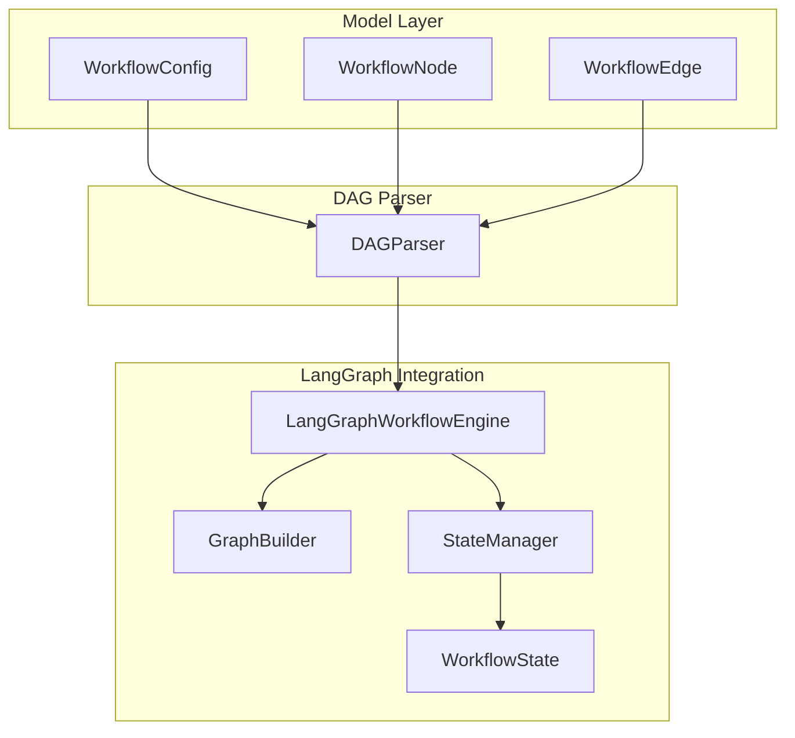
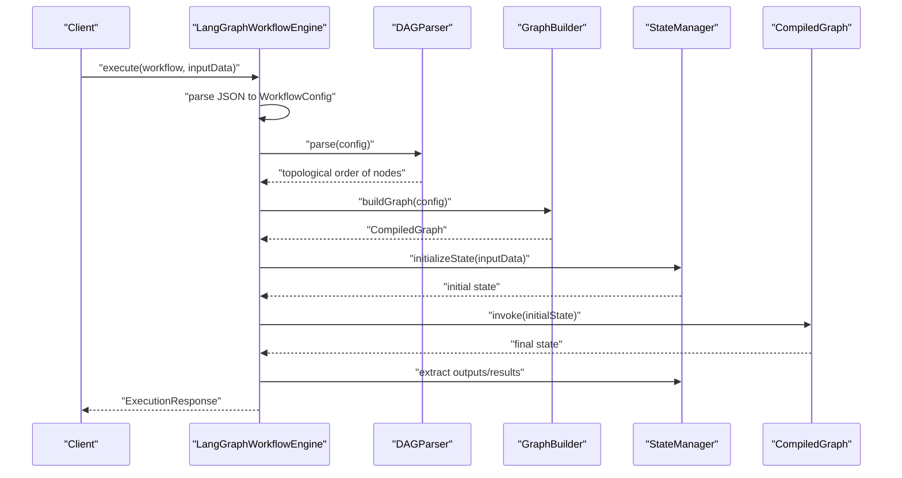
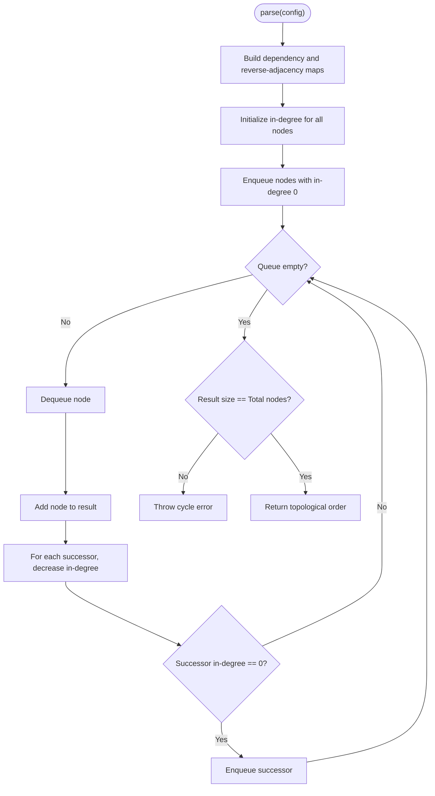
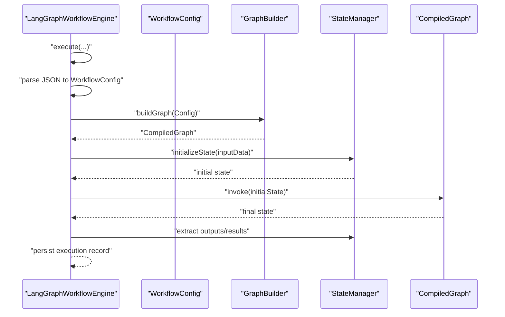
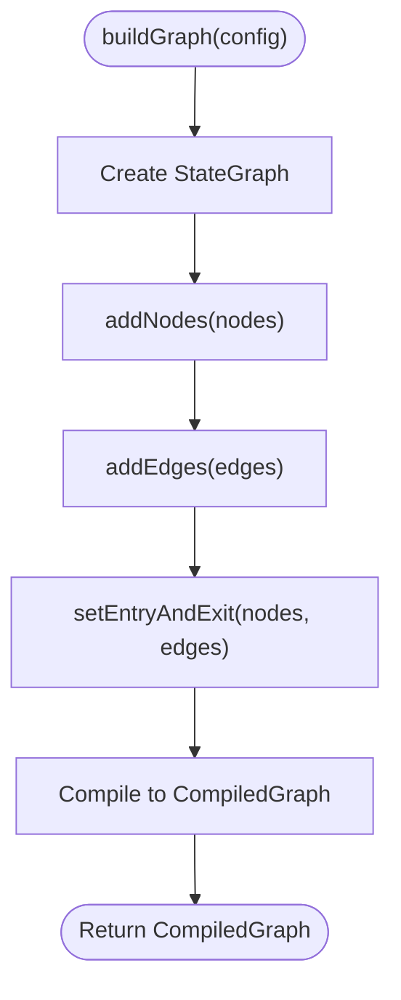
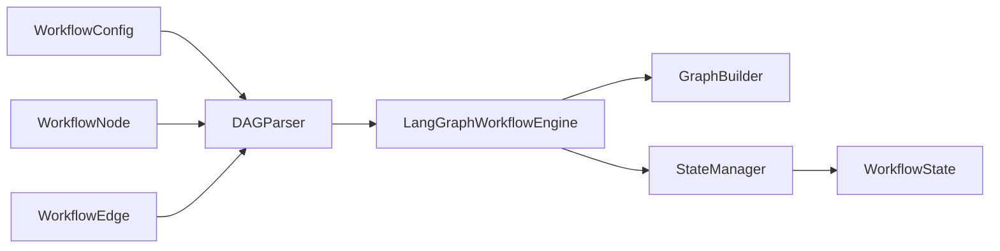

# DAG Parsing System

<cite>
**Referenced Files in This Document**
- [DAGParser.java](file://backend/src/main/java/com/paiagent/engine/dag/DAGParser.java)
- [WorkflowConfig.java](file://backend/src/main/java/com/paiagent/engine/model/WorkflowConfig.java)
- [WorkflowNode.java](file://backend/src/main/java/com/paiagent/engine/model/WorkflowNode.java)
- [WorkflowEdge.java](file://backend/src/main/java/com/paiagent/engine/model/WorkflowEdge.java)
- [LangGraphWorkflowEngine.java](file://backend/src/main/java/com/paiagent/engine/langgraph/LangGraphWorkflowEngine.java)
- [GraphBuilder.java](file://backend/src/main/java/com/paiagent/engine/langgraph/builder/GraphBuilder.java)
- [StateManager.java](file://backend/src/main/java/com/paiagent/engine/langgraph/state/StateManager.java)
- [WorkflowState.java](file://backend/src/main/java/com/paiagent/engine/langgraph/WorkflowState.java)
- [LangGraphWorkflowEngineTest.java](file://backend/src/test/java/com/paiagent/engine/langgraph/LangGraphWorkflowEngineTest.java)
- [LangGraphBasicTest.java](file://backend/src/test/java/com/paiagent/engine/langgraph/LangGraphBasicTest.java)
- [AGENTS.md](file://AGENTS.md)
</cite>

## Table of Contents
1. [Introduction](#introduction)
2. [Project Structure](#project-structure)
3. [Core Components](#core-components)
4. [Architecture Overview](#architecture-overview)
5. [Detailed Component Analysis](#detailed-component-analysis)
6. [Dependency Analysis](#dependency-analysis)
7. [Performance Considerations](#performance-considerations)
8. [Troubleshooting Guide](#troubleshooting-guide)
9. [Conclusion](#conclusion)

## Introduction
This document provides comprehensive documentation for the Directed Acyclic Graph (DAG) parsing system used in the workflow engine. It explains the topology sorting algorithms, cycle detection mechanisms, and dependency resolution processes. It also documents the parsing logic for workflow configurations, edge validation, node ordering, error handling, and performance optimization techniques. Finally, it clarifies how the parsed DAG structure relates to execution planning and runtime behavior.

## Project Structure
The DAG parsing system resides in the backend module under the engine package. The key components involved are:
- Model classes representing workflow configuration, nodes, and edges
- DAGParser implementing cycle detection and topological sorting
- LangGraphWorkflowEngine orchestrating execution and integrating with LangGraph4j
- GraphBuilder translating parsed configuration into a compiled StateGraph
- StateManager managing state transitions during execution
- WorkflowState modeling runtime state for nodes and outputs

**Diagram sources**
- [DAGParser.java:14-57](file://backend/src/main/java/com/paiagent/engine/dag/DAGParser.java#L14-L57)
- [WorkflowConfig.java:10-21](file://backend/src/main/java/com/paiagent/engine/model/WorkflowConfig.java#L10-L21)
- [WorkflowNode.java:10-36](file://backend/src/main/java/com/paiagent/engine/model/WorkflowNode.java#L10-L36)
- [WorkflowEdge.java:9-35](file://backend/src/main/java/com/paiagent/engine/model/WorkflowEdge.java#L9-L35)
- [LangGraphWorkflowEngine.java:44-72](file://backend/src/main/java/com/paiagent/engine/langgraph/LangGraphWorkflowEngine.java#L44-L72)
- [GraphBuilder.java:39-62](file://backend/src/main/java/com/paiagent/engine/langgraph/builder/GraphBuilder.java#L39-L62)
- [StateManager.java:26-47](file://backend/src/main/java/com/paiagent/engine/langgraph/state/StateManager.java#L26-L47)
- [WorkflowState.java:14-70](file://backend/src/main/java/com/paiagent/engine/langgraph/WorkflowState.java#L14-L70)

**Section sources**
- [DAGParser.java:14-57](file://backend/src/main/java/com/paiagent/engine/dag/DAGParser.java#L14-L57)
- [WorkflowConfig.java:10-21](file://backend/src/main/java/com/paiagent/engine/model/WorkflowConfig.java#L10-L21)
- [WorkflowNode.java:10-36](file://backend/src/main/java/com/paiagent/engine/model/WorkflowNode.java#L10-L36)
- [WorkflowEdge.java:9-35](file://backend/src/main/java/com/paiagent/engine/model/WorkflowEdge.java#L9-L35)

## Core Components
This section focuses on the DAG parsing core and its role in workflow execution planning.

- WorkflowConfig: Holds lists of nodes and edges that define the workflow structure.
- WorkflowNode: Represents individual processing units with identifiers, types, positions, and configuration data.
- WorkflowEdge: Defines directed connections between nodes via source and target identifiers.
- DAGParser: Parses the workflow configuration, validates edges, detects cycles, and produces a topologically sorted node order for execution planning.

Key responsibilities:
- Build dependency and reverse-dependency graphs from edges
- Detect cycles using depth-first search (DFS)
- Produce a topological order using Kahn's algorithm (BFS-based)
- Enforce that the number of processed nodes equals total nodes after sorting

**Section sources**
- [WorkflowConfig.java:10-21](file://backend/src/main/java/com/paiagent/engine/model/WorkflowConfig.java#L10-L21)
- [WorkflowNode.java:10-36](file://backend/src/main/java/com/paiagent/engine/model/WorkflowNode.java#L10-L36)
- [WorkflowEdge.java:9-35](file://backend/src/main/java/com/paiagent/engine/model/WorkflowEdge.java#L9-L35)
- [DAGParser.java:20-57](file://backend/src/main/java/com/paiagent/engine/dag/DAGParser.java#L20-L57)

## Architecture Overview
The DAG parsing system integrates with the LangGraph execution pipeline. The workflow configuration is parsed into a DAG, validated for acyclicity, and then transformed into a compiled StateGraph for execution. State transitions are managed throughout execution.

**Diagram sources**
- [LangGraphWorkflowEngine.java:44-149](file://backend/src/main/java/com/paiagent/engine/langgraph/LangGraphWorkflowEngine.java#L44-L149)
- [DAGParser.java:20-57](file://backend/src/main/java/com/paiagent/engine/dag/DAGParser.java#L20-L57)
- [GraphBuilder.java:39-62](file://backend/src/main/java/com/paiagent/engine/langgraph/builder/GraphBuilder.java#L39-L62)
- [StateManager.java:26-47](file://backend/src/main/java/com/paiagent/engine/langgraph/state/StateManager.java#L26-L47)

## Detailed Component Analysis

### DAGParser: Cycle Detection and Topological Sorting
The parser performs two critical tasks:
- Cycle detection using DFS with recursion stack tracking
- Topological sorting using Kahn's algorithm (BFS with in-degree counting)

Implementation highlights:
- Builds adjacency structures for dependencies and reverse dependencies
- Initializes in-degrees for all nodes
- Uses a queue to process nodes with zero in-degree
- Validates that all nodes are included in the final order

**Diagram sources**
- [DAGParser.java:106-160](file://backend/src/main/java/com/paiagent/engine/dag/DAGParser.java#L106-L160)

**Section sources**
- [DAGParser.java:20-160](file://backend/src/main/java/com/paiagent/engine/dag/DAGParser.java#L20-L160)

### Workflow Configuration Models
These models define the structure of the workflow:
- WorkflowConfig: Aggregates nodes and edges
- WorkflowNode: Identifiers, type, position, and data payload
- WorkflowEdge: Source-target connection with optional handle identifiers

Parsing logic relies on these structures to construct dependency graphs and validate edges.

**Section sources**
- [WorkflowConfig.java:10-21](file://backend/src/main/java/com/paiagent/engine/model/WorkflowConfig.java#L10-L21)
- [WorkflowNode.java:10-36](file://backend/src/main/java/com/paiagent/engine/model/WorkflowNode.java#L10-L36)
- [WorkflowEdge.java:9-35](file://backend/src/main/java/com/paiagent/engine/model/WorkflowEdge.java#L9-L35)

### LangGraphWorkflowEngine: Execution Orchestration
The engine coordinates parsing, graph building, state initialization, execution, and result extraction:
- Parses JSON workflow data into WorkflowConfig
- Builds a CompiledGraph via GraphBuilder
- Initializes state using StateManager
- Executes the graph and extracts outputs and node results
- Persists execution records and handles exceptions

**Diagram sources**
- [LangGraphWorkflowEngine.java:44-149](file://backend/src/main/java/com/paiagent/engine/langgraph/LangGraphWorkflowEngine.java#L44-L149)
- [GraphBuilder.java:39-62](file://backend/src/main/java/com/paiagent/engine/langgraph/builder/GraphBuilder.java#L39-L62)
- [StateManager.java:26-47](file://backend/src/main/java/com/paiagent/engine/langgraph/state/StateManager.java#L26-L47)

**Section sources**
- [LangGraphWorkflowEngine.java:44-184](file://backend/src/main/java/com/paiagent/engine/langgraph/LangGraphWorkflowEngine.java#L44-L184)

### GraphBuilder: Edge Addition and Entry/Exit Setup
GraphBuilder translates parsed configuration into a LangGraph StateGraph:
- Adds nodes with adapted actions
- Adds edges according to WorkflowEdge definitions
- Determines entry and exit nodes based on in/out degrees
- Compiles the graph for execution

**Diagram sources**
- [GraphBuilder.java:39-62](file://backend/src/main/java/com/paiagent/engine/langgraph/builder/GraphBuilder.java#L39-L62)

**Section sources**
- [GraphBuilder.java:39-154](file://backend/src/main/java/com/paiagent/engine/langgraph/builder/GraphBuilder.java#L39-L154)

### StateManager and WorkflowState: Runtime State Management
StateManager initializes and extracts state during execution:
- initializeState sets up initial input, current input wrapper, node outputs map, and status
- extractWorkflowState converts LangGraph state to WorkflowState
- extractNodeResults collects per-node outputs for reporting
- getFinalOutput retrieves the last computed output

WorkflowState encapsulates runtime data including node outputs, current node, global context, status, timestamps, and error messages.

**Section sources**
- [StateManager.java:26-162](file://backend/src/main/java/com/paiagent/engine/langgraph/state/StateManager.java#L26-L162)
- [WorkflowState.java:14-125](file://backend/src/main/java/com/paiagent/engine/langgraph/WorkflowState.java#L14-L125)

## Dependency Analysis
The DAG parsing system exhibits clear separation of concerns:
- DAGParser depends on model classes (WorkflowConfig, WorkflowNode, WorkflowEdge)
- LangGraphWorkflowEngine depends on DAGParser for ordering, GraphBuilder for graph construction, and StateManager for state handling
- GraphBuilder depends on NodeAdapter (not shown here) and uses LangGraph4j APIs
- StateManager and WorkflowState are used by the engine for runtime state management

**Diagram sources**
- [DAGParser.java:20-57](file://backend/src/main/java/com/paiagent/engine/dag/DAGParser.java#L20-L57)
- [WorkflowConfig.java:10-21](file://backend/src/main/java/com/paiagent/engine/model/WorkflowConfig.java#L10-L21)
- [WorkflowNode.java:10-36](file://backend/src/main/java/com/paiagent/engine/model/WorkflowNode.java#L10-L36)
- [WorkflowEdge.java:9-35](file://backend/src/main/java/com/paiagent/engine/model/WorkflowEdge.java#L9-L35)
- [LangGraphWorkflowEngine.java:44-72](file://backend/src/main/java/com/paiagent/engine/langgraph/LangGraphWorkflowEngine.java#L44-L72)
- [GraphBuilder.java:39-62](file://backend/src/main/java/com/paiagent/engine/langgraph/builder/GraphBuilder.java#L39-L62)
- [StateManager.java:26-47](file://backend/src/main/java/com/paiagent/engine/langgraph/state/StateManager.java#L26-L47)
- [WorkflowState.java:14-70](file://backend/src/main/java/com/paiagent/engine/langgraph/WorkflowState.java#L14-L70)

**Section sources**
- [DAGParser.java:20-57](file://backend/src/main/java/com/paiagent/engine/dag/DAGParser.java#L20-L57)
- [LangGraphWorkflowEngine.java:44-72](file://backend/src/main/java/com/paiagent/engine/langgraph/LangGraphWorkflowEngine.java#L44-L72)

## Performance Considerations
- Complexity:
  - Building adjacency structures: O(N + E) where N is nodes and E is edges
  - DFS cycle detection: O(N + E)
  - Kahn's algorithm: O(N + E)
- Memory:
  - Adjacency maps and queues scale linearly with nodes and edges
- Practical optimizations:
  - Validate early: Reject malformed edges (nonexistent node IDs) before heavy computation
  - Use efficient data structures: HashMap and LinkedList for adjacency and BFS queue
  - Short-circuit on cycle detection to avoid unnecessary work
  - Reuse compiled graphs when possible (outside the scope of this parser)

[No sources needed since this section provides general guidance]

## Troubleshooting Guide
Common issues and resolutions:
- Cycle detected:
  - Symptom: Exception indicating a cycle during parse
  - Cause: Circular dependency in edges
  - Resolution: Remove or rewire edges to form a DAG
- Incomplete topological order:
  - Symptom: Exception indicating fewer nodes processed than total
  - Cause: Disconnected components or missing nodes
  - Resolution: Ensure all nodes are present and connected properly
- Missing entry/exit nodes:
  - Behavior: GraphBuilder falls back to first/last node for START/END
  - Recommendation: Define explicit entry/exit nodes for clarity
- Execution failures:
  - The engine catches exceptions, marks status as FAILED, persists the record, and returns an error response

Validation and tests:
- Unit tests demonstrate successful execution of simple and multi-node workflows
- Basic LangGraph dependency validation ensures LangGraph4j is correctly loaded

**Section sources**
- [DAGParser.java:62-101](file://backend/src/main/java/com/paiagent/engine/dag/DAGParser.java#L62-L101)
- [DAGParser.java:154-157](file://backend/src/main/java/com/paiagent/engine/dag/DAGParser.java#L154-L157)
- [GraphBuilder.java:101-123](file://backend/src/main/java/com/paiagent/engine/langgraph/builder/GraphBuilder.java#L101-L123)
- [LangGraphWorkflowEngine.java:151-184](file://backend/src/main/java/com/paiagent/engine/langgraph/LangGraphWorkflowEngine.java#L151-L184)
- [LangGraphWorkflowEngineTest.java:34-71](file://backend/src/test/java/com/paiagent/engine/langgraph/LangGraphWorkflowEngineTest.java#L34-L71)
- [LangGraphBasicTest.java:64-86](file://backend/src/test/java/com/paiagent/engine/langgraph/LangGraphBasicTest.java#L64-L86)

## Conclusion
The DAG parsing system provides robust cycle detection and topological sorting to ensure valid, executable workflow graphs. It integrates seamlessly with the LangGraph execution pipeline, enabling reliable stateful execution and accurate result extraction. By validating edges, detecting cycles, and producing a deterministic execution order, the system supports predictable and maintainable workflow processing.