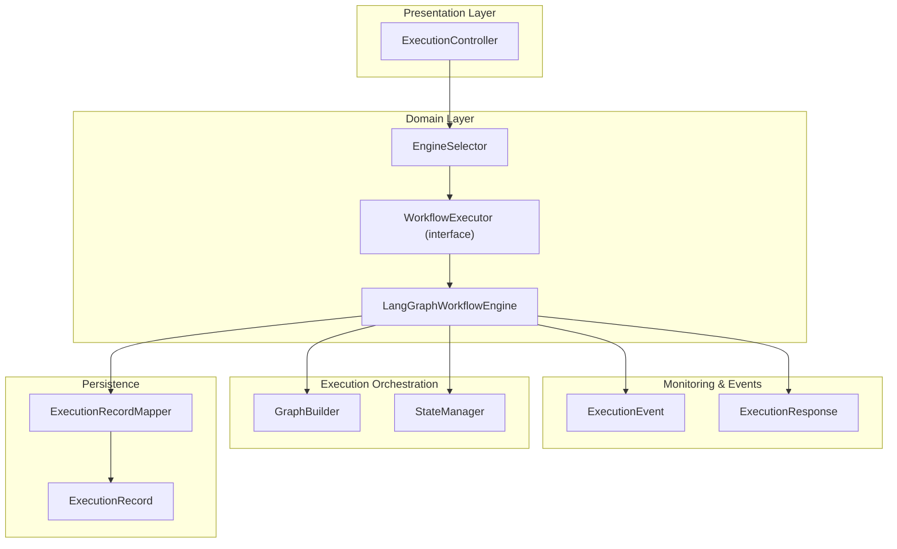
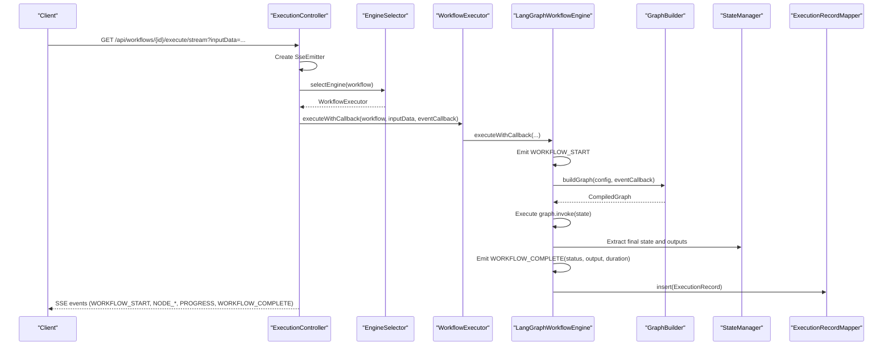
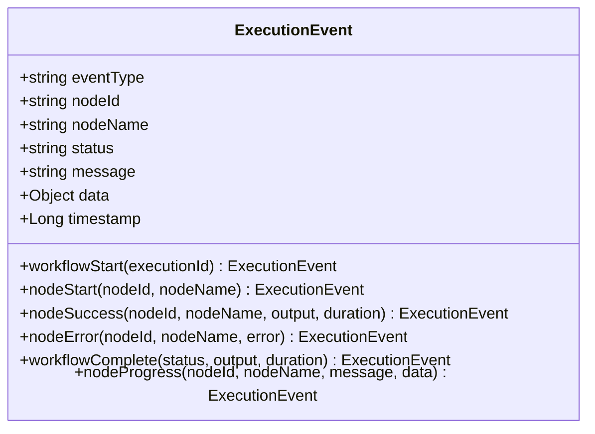
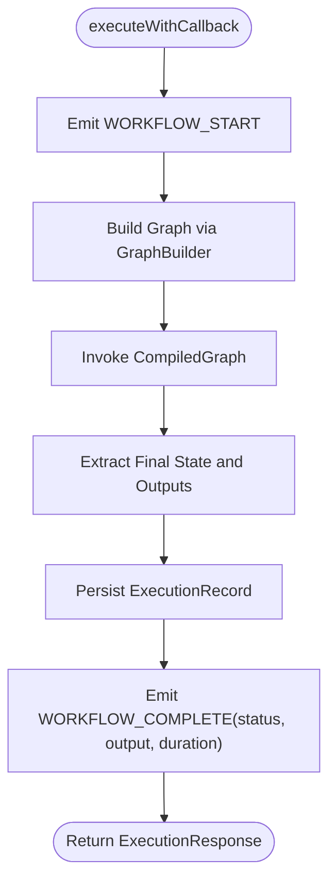
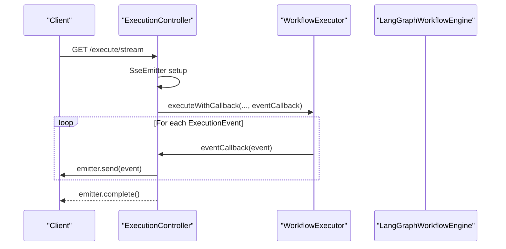
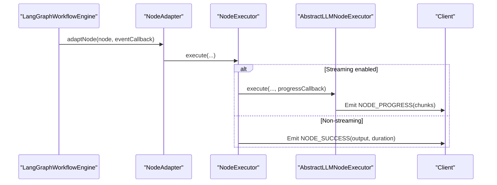
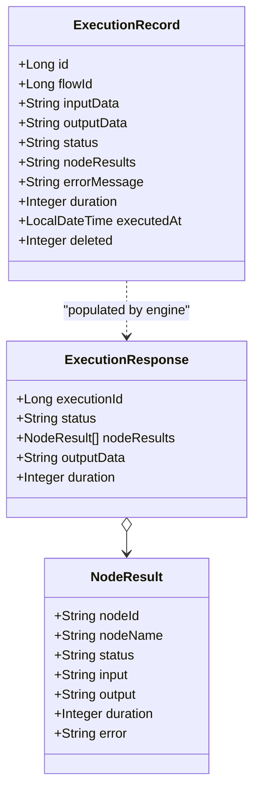
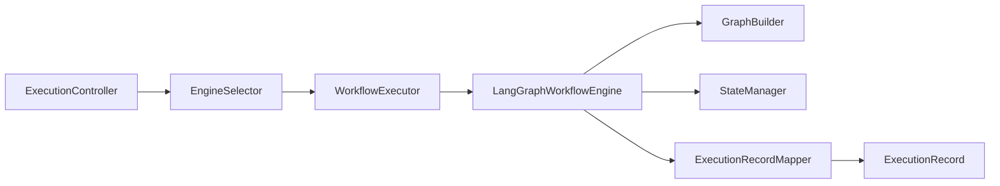

# Execution Monitoring

<cite>
**Referenced Files in This Document**
- [ExecutionEvent.java](file://backend/src/main/java/com/paiagent/dto/ExecutionEvent.java)
- [ExecutionResponse.java](file://backend/src/main/java/com/paiagent/dto/ExecutionResponse.java)
- [WorkflowExecutor.java](file://backend/src/main/java/com/paiagent/engine/WorkflowExecutor.java)
- [EngineSelector.java](file://backend/src/main/java/com/paiagent/engine/EngineSelector.java)
- [LangGraphWorkflowEngine.java](file://backend/src/main/java/com/paiagent/engine/langgraph/LangGraphWorkflowEngine.java)
- [GraphBuilder.java](file://backend/src/main/java/com/paiagent/engine/langgraph/builder/GraphBuilder.java)
- [StateManager.java](file://backend/src/main/java/com/paiagent/engine/langgraph/state/StateManager.java)
- [ExecutionController.java](file://backend/src/main/java/com/paiagent/controller/ExecutionController.java)
- [ExecutionRecord.java](file://backend/src/main/java/com/paiagent/entity/ExecutionRecord.java)
- [ExecutionRecordMapper.java](file://backend/src/main/java/com/paiagent/mapper/ExecutionRecordMapper.java)
- [NodeExecutor.java](file://backend/src/main/java/com/paiagent/engine/executor/NodeExecutor.java)
- [AbstractLLMNodeExecutor.java](file://backend/src/main/java/com/paiagent/engine/executor/impl/AbstractLLMNodeExecutor.java)
- [OpenAINodeExecutor.java](file://backend/src/main/java/com/paiagent/engine/executor/impl/OpenAINodeExecutor.java)
- [QwenNodeExecutor.java](file://backend/src/main/java/com/paiagent/engine/executor/impl/QwenNodeExecutor.java)
- [OutputNodeExecutor.java](file://backend/src/main/java/com/paiagent/engine/executor/impl/OutputNodeExecutor.java)
</cite>

## Table of Contents
1. [Introduction](#introduction)
2. [Project Structure](#project-structure)
3. [Core Components](#core-components)
4. [Architecture Overview](#architecture-overview)
5. [Detailed Component Analysis](#detailed-component-analysis)
6. [Dependency Analysis](#dependency-analysis)
7. [Performance Considerations](#performance-considerations)
8. [Troubleshooting Guide](#troubleshooting-guide)
9. [Conclusion](#conclusion)
10. [Appendices](#appendices)

## Introduction
This document explains the execution monitoring and event system used to track workflow execution in real time. It covers the event callback mechanism, the ExecutionEvent structure and event types, progress reporting, error notifications, and how monitoring integrates with workflow execution, node-level progress tracking, and performance metrics collection. It also provides practical guidance for implementing custom event handlers, debugging execution issues, and integrating with external monitoring systems.

## Project Structure
The execution monitoring system spans several layers:
- DTOs define the event and response structures.
- Controllers expose endpoints for synchronous and streaming execution.
- Engines implement execution logic and emit events via callbacks.
- Builders and state managers orchestrate graph execution and maintain execution state.
- Mappers persist execution records for historical monitoring.

**Diagram sources**
- [ExecutionController.java:1-109](file://backend/src/main/java/com/paiagent/controller/ExecutionController.java#L1-L109)
- [EngineSelector.java:1-69](file://backend/src/main/java/com/paiagent/engine/EngineSelector.java#L1-L69)
- [WorkflowExecutor.java:1-49](file://backend/src/main/java/com/paiagent/engine/WorkflowExecutor.java#L1-L49)
- [LangGraphWorkflowEngine.java:1-192](file://backend/src/main/java/com/paiagent/engine/langgraph/LangGraphWorkflowEngine.java#L1-L192)
- [GraphBuilder.java:1-156](file://backend/src/main/java/com/paiagent/engine/langgraph/builder/GraphBuilder.java#L1-L156)
- [StateManager.java:1-164](file://backend/src/main/java/com/paiagent/engine/langgraph/state/StateManager.java#L1-L164)
- [ExecutionEvent.java:1-79](file://backend/src/main/java/com/paiagent/dto/ExecutionEvent.java#L1-L79)
- [ExecutionResponse.java:1-29](file://backend/src/main/java/com/paiagent/dto/ExecutionResponse.java#L1-L29)
- [ExecutionRecord.java:1-67](file://backend/src/main/java/com/paiagent/entity/ExecutionRecord.java#L1-L67)
- [ExecutionRecordMapper.java:1-13](file://backend/src/main/java/com/paiagent/mapper/ExecutionRecordMapper.java#L1-L13)

**Section sources**
- [ExecutionController.java:1-109](file://backend/src/main/java/com/paiagent/controller/ExecutionController.java#L1-L109)
- [EngineSelector.java:1-69](file://backend/src/main/java/com/paiagent/engine/EngineSelector.java#L1-L69)
- [WorkflowExecutor.java:1-49](file://backend/src/main/java/com/paiagent/engine/WorkflowExecutor.java#L1-L49)
- [LangGraphWorkflowEngine.java:1-192](file://backend/src/main/java/com/paiagent/engine/langgraph/LangGraphWorkflowEngine.java#L1-L192)
- [GraphBuilder.java:1-156](file://backend/src/main/java/com/paiagent/engine/langgraph/builder/GraphBuilder.java#L1-L156)
- [StateManager.java:1-164](file://backend/src/main/java/com/paiagent/engine/langgraph/state/StateManager.java#L1-L164)
- [ExecutionEvent.java:1-79](file://backend/src/main/java/com/paiagent/dto/ExecutionEvent.java#L1-L79)
- [ExecutionResponse.java:1-29](file://backend/src/main/java/com/paiagent/dto/ExecutionResponse.java#L1-L29)
- [ExecutionRecord.java:1-67](file://backend/src/main/java/com/paiagent/entity/ExecutionRecord.java#L1-L67)
- [ExecutionRecordMapper.java:1-13](file://backend/src/main/java/com/paiagent/mapper/ExecutionRecordMapper.java#L1-L13)

## Core Components
- ExecutionEvent: Defines the event payload shape and factory methods for workflow/node events, progress, and completion.
- WorkflowExecutor: Declares synchronous and callback-enabled execution methods.
- LangGraphWorkflowEngine: Implements execution with event emission, state management, and persistence.
- ExecutionController: Exposes endpoints for execution and SSE streaming with event callbacks.
- ExecutionRecord and ExecutionRecordMapper: Persist execution outcomes and metrics for later analysis.

Key responsibilities:
- Real-time event delivery via Server-Sent Events (SSE) for streaming execution.
- Event-driven progress reporting for nodes (including streaming LLM chunks).
- Error propagation through standardized events and persisted records.
- Aggregated performance metrics (duration, node results) for monitoring dashboards.

**Section sources**
- [ExecutionEvent.java:1-79](file://backend/src/main/java/com/paiagent/dto/ExecutionEvent.java#L1-L79)
- [WorkflowExecutor.java:1-49](file://backend/src/main/java/com/paiagent/engine/WorkflowExecutor.java#L1-L49)
- [LangGraphWorkflowEngine.java:1-192](file://backend/src/main/java/com/paiagent/engine/langgraph/LangGraphWorkflowEngine.java#L1-L192)
- [ExecutionController.java:1-109](file://backend/src/main/java/com/paiagent/controller/ExecutionController.java#L1-L109)
- [ExecutionRecord.java:1-67](file://backend/src/main/java/com/paiagent/entity/ExecutionRecord.java#L1-L67)
- [ExecutionRecordMapper.java:1-13](file://backend/src/main/java/com/paiagent/mapper/ExecutionRecordMapper.java#L1-L13)

## Architecture Overview
The execution pipeline emits structured events that clients can subscribe to via SSE. The engine builds a LangGraph, executes it, and pushes lifecycle and progress events. Errors are normalized into events and persisted.

**Diagram sources**
- [ExecutionController.java:57-109](file://backend/src/main/java/com/paiagent/controller/ExecutionController.java#L57-L109)
- [EngineSelector.java:29-49](file://backend/src/main/java/com/paiagent/engine/EngineSelector.java#L29-L49)
- [WorkflowExecutor.java:34-38](file://backend/src/main/java/com/paiagent/engine/WorkflowExecutor.java#L34-L38)
- [LangGraphWorkflowEngine.java:48-126](file://backend/src/main/java/com/paiagent/engine/langgraph/LangGraphWorkflowEngine.java#L48-L126)
- [GraphBuilder.java:39-62](file://backend/src/main/java/com/paiagent/engine/langgraph/builder/GraphBuilder.java#L39-L62)
- [StateManager.java:88-107](file://backend/src/main/java/com/paiagent/engine/langgraph/state/StateManager.java#L88-L107)
- [ExecutionRecordMapper.java:1-13](file://backend/src/main/java/com/paiagent/mapper/ExecutionRecordMapper.java#L1-L13)

## Detailed Component Analysis

### ExecutionEvent: Event Schema and Types
ExecutionEvent defines the event payload and factory methods for lifecycle and progress events. It includes:
- Fields: eventType, nodeId, nodeName, status, message, data, timestamp.
- Factory methods:
  - workflowStart(executionId)
  - nodeStart(nodeId, nodeName)
  - nodeSuccess(nodeId, nodeName, output, durationMs)
  - nodeError(nodeId, nodeName, error)
  - workflowComplete(status, output, durationMs)
  - nodeProgress(nodeId, nodeName, message, data)

Event types emitted:
- WORKFLOW_START: Signals the beginning of workflow execution.
- NODE_START: Indicates a node is starting execution.
- NODE_PROGRESS: Provides incremental progress updates (e.g., streaming LLM chunks).
- NODE_SUCCESS: Marks successful completion of a node with output and timing.
- NODE_ERROR: Reports node-level failure with error details.
- WORKFLOW_COMPLETE: Finalizes execution with status, output, and total duration.

**Diagram sources**
- [ExecutionEvent.java:1-79](file://backend/src/main/java/com/paiagent/dto/ExecutionEvent.java#L1-L79)

**Section sources**
- [ExecutionEvent.java:1-79](file://backend/src/main/java/com/paiagent/dto/ExecutionEvent.java#L1-L79)

### WorkflowExecutor: Execution Contract and Callback Support
WorkflowExecutor defines:
- execute(workflow, inputData): synchronous execution returning ExecutionResponse.
- executeWithCallback(workflow, inputData, eventCallback): asynchronous execution emitting events via Consumer<ExecutionEvent>.
- getEngineType(): identifies engine subtype (e.g., "langgraph").

This contract enables pluggable engines and consistent event emission across implementations.

**Section sources**
- [WorkflowExecutor.java:1-49](file://backend/src/main/java/com/paiagent/engine/WorkflowExecutor.java#L1-L49)

### LangGraphWorkflowEngine: Event Emission and Persistence
LangGraphWorkflowEngine implements the execution contract and emits lifecycle events:
- Emits WORKFLOW_START before execution begins.
- Emits WORKFLOW_COMPLETE after execution completes or fails.
- Persists ExecutionRecord with status, output, nodeResults, error messages, and duration.
- Builds the graph via GraphBuilder and manages state via StateManager.

**Diagram sources**
- [LangGraphWorkflowEngine.java:48-126](file://backend/src/main/java/com/paiagent/engine/langgraph/LangGraphWorkflowEngine.java#L48-L126)
- [GraphBuilder.java:39-62](file://backend/src/main/java/com/paiagent/engine/langgraph/builder/GraphBuilder.java#L39-L62)
- [StateManager.java:88-107](file://backend/src/main/java/com/paiagent/engine/langgraph/state/StateManager.java#L88-L107)
- [ExecutionRecordMapper.java:1-13](file://backend/src/main/java/com/paiagent/mapper/ExecutionRecordMapper.java#L1-L13)

**Section sources**
- [LangGraphWorkflowEngine.java:48-126](file://backend/src/main/java/com/paiagent/engine/langgraph/LangGraphWorkflowEngine.java#L48-L126)
- [GraphBuilder.java:39-62](file://backend/src/main/java/com/paiagent/engine/langgraph/builder/GraphBuilder.java#L39-L62)
- [StateManager.java:88-107](file://backend/src/main/java/com/paiagent/engine/langgraph/state/StateManager.java#L88-L107)
- [ExecutionRecord.java:1-67](file://backend/src/main/java/com/paiagent/entity/ExecutionRecord.java#L1-L67)
- [ExecutionRecordMapper.java:1-13](file://backend/src/main/java/com/paiagent/mapper/ExecutionRecordMapper.java#L1-L13)

### ExecutionController: SSE Streaming and Event Delivery
ExecutionController exposes:
- POST /api/workflows/{id}/execute: synchronous execution.
- GET /api/workflows/{id}/execute/stream: SSE endpoint that streams ExecutionEvent instances.

It:
- Creates SseEmitter and registers completion/error hooks.
- Wraps eventCallback to send events with event names matching ExecutionEvent.eventType.
- Handles workflow-not-found and runtime errors by sending appropriate events and completing the stream.

**Diagram sources**
- [ExecutionController.java:57-109](file://backend/src/main/java/com/paiagent/controller/ExecutionController.java#L57-L109)
- [WorkflowExecutor.java:34-38](file://backend/src/main/java/com/paiagent/engine/WorkflowExecutor.java#L34-L38)
- [LangGraphWorkflowEngine.java:48-126](file://backend/src/main/java/com/paiagent/engine/langgraph/LangGraphWorkflowEngine.java#L48-L126)

**Section sources**
- [ExecutionController.java:57-109](file://backend/src/main/java/com/paiagent/controller/ExecutionController.java#L57-L109)

### Node-Level Progress Tracking and Streaming
Node-level progress is supported through:
- NodeExecutor.execute(node, input, progressCallback): optional progressCallback parameter.
- AbstractLLMNodeExecutor: when streaming is enabled and progressCallback is present, emits NODE_PROGRESS events with incremental chunks and accumulated content.

**Diagram sources**
- [GraphBuilder.java:76-78](file://backend/src/main/java/com/paiagent/engine/langgraph/builder/GraphBuilder.java#L76-L78)
- [NodeExecutor.java:13-15](file://backend/src/main/java/com/paiagent/engine/executor/NodeExecutor.java#L13-L15)
- [AbstractLLMNodeExecutor.java:71-88](file://backend/src/main/java/com/paiagent/engine/executor/impl/AbstractLLMNodeExecutor.java#L71-L88)
- [AbstractLLMNodeExecutor.java:143-168](file://backend/src/main/java/com/paiagent/engine/executor/impl/AbstractLLMNodeExecutor.java#L143-L168)

**Section sources**
- [NodeExecutor.java:1-18](file://backend/src/main/java/com/paiagent/engine/executor/NodeExecutor.java#L1-L18)
- [AbstractLLMNodeExecutor.java:71-88](file://backend/src/main/java/com/paiagent/engine/executor/impl/AbstractLLMNodeExecutor.java#L71-L88)
- [AbstractLLMNodeExecutor.java:143-168](file://backend/src/main/java/com/paiagent/engine/executor/impl/AbstractLLMNodeExecutor.java#L143-L168)

### ExecutionResponse and ExecutionRecord: Metrics and Results
ExecutionResponse carries executionId, status, nodeResults, outputData, and duration. NodeResult includes nodeId, nodeName, status, input, output, duration, and error.

ExecutionRecord persists execution outcomes for historical monitoring:
- flowId, inputData, outputData, status, nodeResults, errorMessage, duration, executedAt, deleted.

**Diagram sources**
- [ExecutionResponse.java:1-29](file://backend/src/main/java/com/paiagent/dto/ExecutionResponse.java#L1-L29)
- [ExecutionRecord.java:1-67](file://backend/src/main/java/com/paiagent/entity/ExecutionRecord.java#L1-L67)

**Section sources**
- [ExecutionResponse.java:1-29](file://backend/src/main/java/com/paiagent/dto/ExecutionResponse.java#L1-L29)
- [ExecutionRecord.java:1-67](file://backend/src/main/java/com/paiagent/entity/ExecutionRecord.java#L1-L67)
- [ExecutionRecordMapper.java:1-13](file://backend/src/main/java/com/paiagent/mapper/ExecutionRecordMapper.java#L1-L13)

## Dependency Analysis
The system exhibits clean separation of concerns:
- Presentation depends on domain services and mappers.
- Domain orchestrates engines and builders.
- Engines depend on builders and state managers.
- Persistence is decoupled via MyBatis mapper.

**Diagram sources**
- [ExecutionController.java:1-109](file://backend/src/main/java/com/paiagent/controller/ExecutionController.java#L1-L109)
- [EngineSelector.java:1-69](file://backend/src/main/java/com/paiagent/engine/EngineSelector.java#L1-L69)
- [WorkflowExecutor.java:1-49](file://backend/src/main/java/com/paiagent/engine/WorkflowExecutor.java#L1-L49)
- [LangGraphWorkflowEngine.java:1-192](file://backend/src/main/java/com/paiagent/engine/langgraph/LangGraphWorkflowEngine.java#L1-L192)
- [GraphBuilder.java:1-156](file://backend/src/main/java/com/paiagent/engine/langgraph/builder/GraphBuilder.java#L1-L156)
- [StateManager.java:1-164](file://backend/src/main/java/com/paiagent/engine/langgraph/state/StateManager.java#L1-L164)
- [ExecutionRecordMapper.java:1-13](file://backend/src/main/java/com/paiagent/mapper/ExecutionRecordMapper.java#L1-L13)
- [ExecutionRecord.java:1-67](file://backend/src/main/java/com/paiagent/entity/ExecutionRecord.java#L1-L67)

**Section sources**
- [EngineSelector.java:1-69](file://backend/src/main/java/com/paiagent/engine/EngineSelector.java#L1-L69)
- [LangGraphWorkflowEngine.java:1-192](file://backend/src/main/java/com/paiagent/engine/langgraph/LangGraphWorkflowEngine.java#L1-L192)
- [GraphBuilder.java:1-156](file://backend/src/main/java/com/paiagent/engine/langgraph/builder/GraphBuilder.java#L1-L156)
- [StateManager.java:1-164](file://backend/src/main/java/com/paiagent/engine/langgraph/state/StateManager.java#L1-L164)
- [ExecutionRecordMapper.java:1-13](file://backend/src/main/java/com/paiagent/mapper/ExecutionRecordMapper.java#L1-L13)

## Performance Considerations
- Event overhead: Emitting frequent NODE_PROGRESS events can increase network and CPU overhead. Tune streaming frequency and payload sizes.
- Persistence cost: Inserting ExecutionRecord occurs per execution. Batch writes or async persistence can reduce latency under load.
- Graph compilation: Building the graph is relatively expensive; reuse compiled graphs where feasible.
- Memory footprint: Accumulating streaming chunks increases memory usage. Consider chunk limits and periodic flushes.
- Concurrency: SSE connections are held open. Monitor connection counts and timeouts to avoid resource exhaustion.

[No sources needed since this section provides general guidance]

## Troubleshooting Guide
Common issues and resolutions:
- No events received:
  - Verify SSE endpoint path and parameters.
  - Confirm eventCallback is passed to executeWithCallback.
  - Check client-side event listeners for event names matching ExecutionEvent.eventType.
- Workflows fail silently:
  - Inspect WORKFLOW_COMPLETE events with FAILED status and errorMessage.
  - Review logs around engine execution and graph invocation.
- Node progress missing:
  - Ensure node supports streaming and progressCallback is provided.
  - For non-streaming nodes, expect NODE_SUCCESS instead of NODE_PROGRESS.
- Persistent records missing:
  - Check ExecutionRecordMapper insert calls and transaction boundaries.
  - Validate database connectivity and migrations.

**Section sources**
- [ExecutionController.java:68-104](file://backend/src/main/java/com/paiagent/controller/ExecutionController.java#L68-L104)
- [LangGraphWorkflowEngine.java:151-184](file://backend/src/main/java/com/paiagent/engine/langgraph/LangGraphWorkflowEngine.java#L151-L184)
- [ExecutionRecordMapper.java:1-13](file://backend/src/main/java/com/paiagent/mapper/ExecutionRecordMapper.java#L1-L13)

## Conclusion
The execution monitoring system provides robust, event-driven visibility into workflow execution. It supports real-time progress reporting, granular node-level updates, and comprehensive error handling, while persisting execution artifacts for retrospective analysis. By leveraging the provided interfaces and event types, teams can implement custom event handlers, integrate with external monitoring platforms, and build actionable dashboards.

[No sources needed since this section summarizes without analyzing specific files]

## Appendices

### Implementing Custom Event Handlers
- Client-side handler:
  - Subscribe to the SSE endpoint and listen for named events matching ExecutionEvent.eventType.
  - Update UI state based on NODE_START, NODE_PROGRESS, NODE_SUCCESS, NODE_ERROR, WORKFLOW_START, WORKFLOW_COMPLETE.
- Server-side handler:
  - Pass a Consumer<ExecutionEvent> to executeWithCallback to forward events to external systems (e.g., logging, analytics, alerting).
  - Use event.data to extract node-specific details (e.g., accumulated streaming content).

**Section sources**
- [ExecutionController.java:68-77](file://backend/src/main/java/com/paiagent/controller/ExecutionController.java#L68-L77)
- [WorkflowExecutor.java:34-38](file://backend/src/main/java/com/paiagent/engine/WorkflowExecutor.java#L34-L38)

### Integrating with External Monitoring Systems
- Metrics:
  - Duration and per-node durations are available in ExecutionResponse and ExecutionRecord.
  - Token usage (when applicable) is included in node outputs for LLM nodes.
- Tracing:
  - executionId can correlate logs, traces, and persisted records.
- Alerts:
  - Subscribe to NODE_ERROR and WORKFLOW_COMPLETE(FAILED) to trigger alerts.

**Section sources**
- [ExecutionResponse.java:1-29](file://backend/src/main/java/com/paiagent/dto/ExecutionResponse.java#L1-L29)
- [ExecutionRecord.java:1-67](file://backend/src/main/java/com/paiagent/entity/ExecutionRecord.java#L1-L67)
- [AbstractLLMNodeExecutor.java:210-217](file://backend/src/main/java/com/paiagent/engine/executor/impl/AbstractLLMNodeExecutor.java#L210-L217)

### Example Event Types and Payloads
- WORKFLOW_START: data contains executionId; message indicates workflow start.
- NODE_START: data empty; message indicates node start; status RUNNING.
- NODE_PROGRESS: data includes chunk and accumulated content; message indicates ongoing work; status RUNNING.
- NODE_SUCCESS: data contains node output; message includes duration; status SUCCESS.
- NODE_ERROR: data empty; message contains error; status FAILED.
- WORKFLOW_COMPLETE: data contains final output; message includes total duration; status SUCCESS or FAILED.

**Section sources**
- [ExecutionEvent.java:15-78](file://backend/src/main/java/com/paiagent/dto/ExecutionEvent.java#L15-L78)