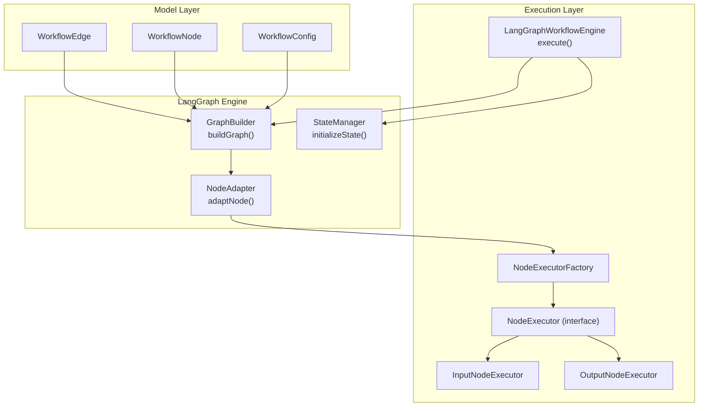
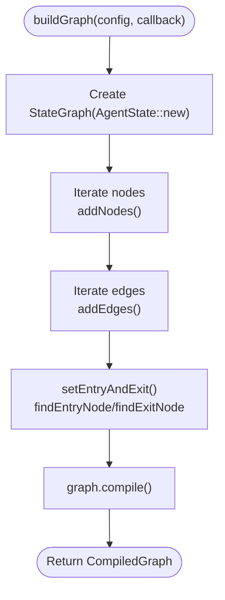
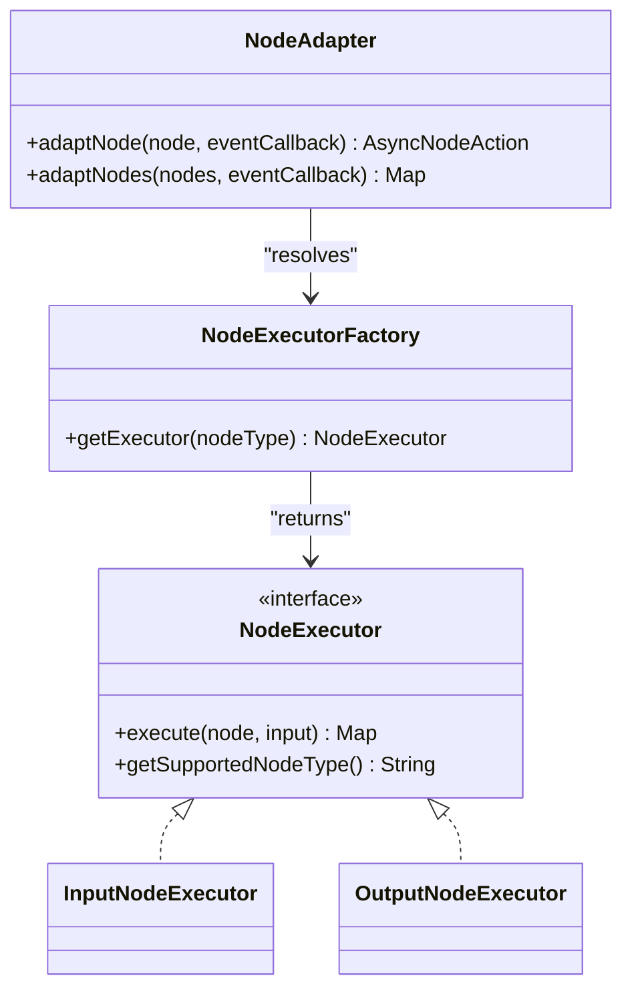
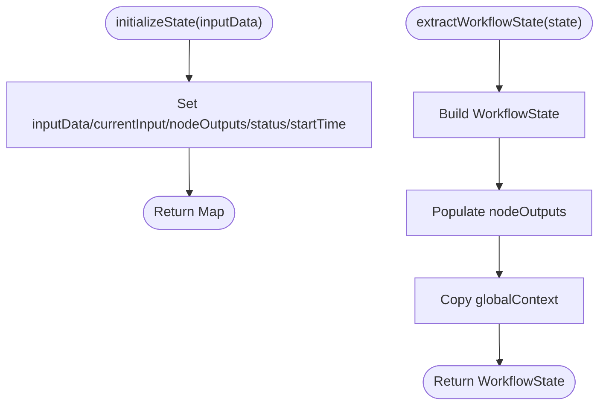
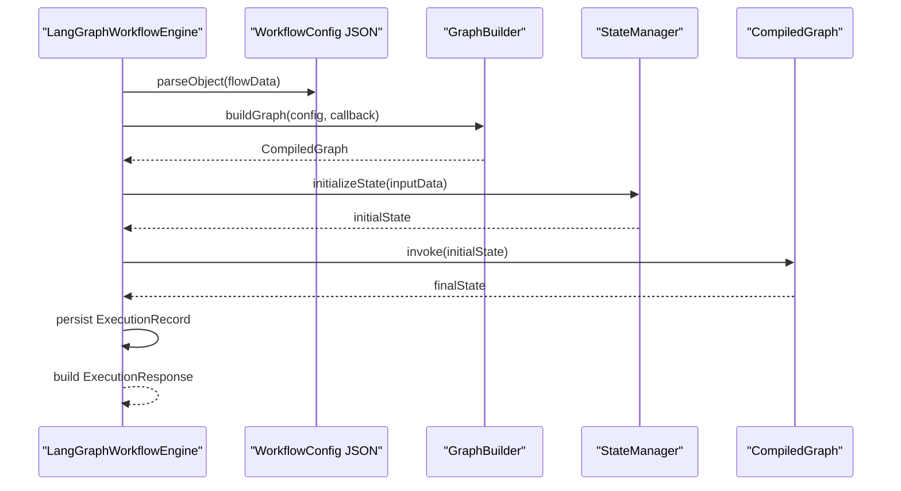
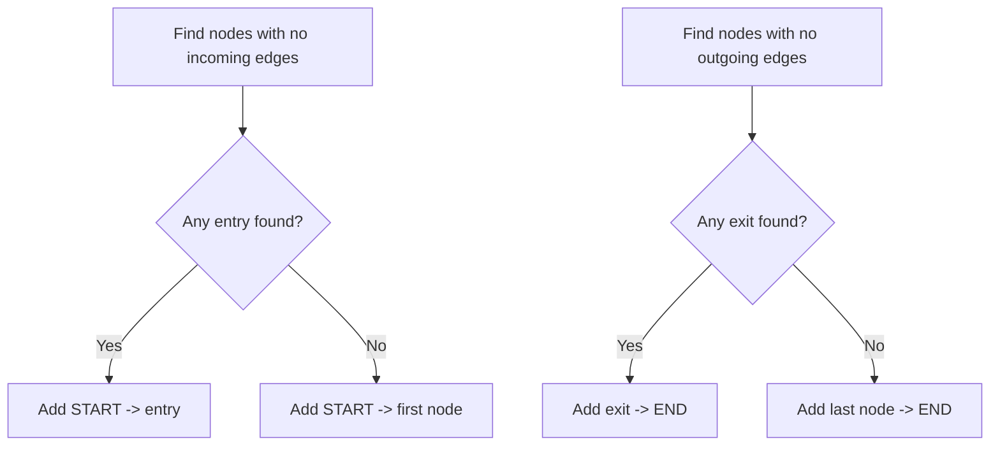
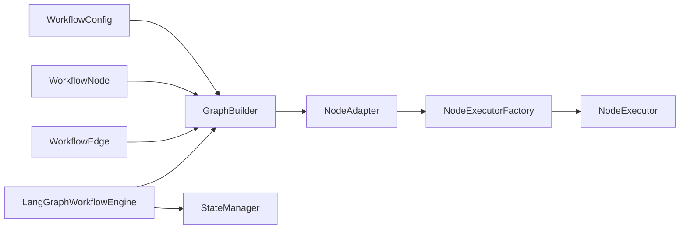

# Graph Builder

<cite>
**Referenced Files in This Document**
- [GraphBuilder.java](file://backend/src/main/java/com/paiagent/engine/langgraph/builder/GraphBuilder.java)
- [LangGraphWorkflowEngine.java](file://backend/src/main/java/com/paiagent/engine/langgraph/LangGraphWorkflowEngine.java)
- [NodeAdapter.java](file://backend/src/main/java/com/paiagent/engine/langgraph/adapter/NodeAdapter.java)
- [StateManager.java](file://backend/src/main/java/com/paiagent/engine/langgraph/state/StateManager.java)
- [WorkflowConfig.java](file://backend/src/main/java/com/paiagent/engine/model/WorkflowConfig.java)
- [WorkflowNode.java](file://backend/src/main/java/com/paiagent/engine/model/WorkflowNode.java)
- [WorkflowEdge.java](file://backend/src/main/java/com/paiagent/engine/model/WorkflowEdge.java)
- [DAGParser.java](file://backend/src/main/java/com/paiagent/engine/dag/DAGParser.java)
- [NodeExecutorFactory.java](file://backend/src/main/java/com/paiagent/engine/executor/NodeExecutorFactory.java)
- [NodeExecutor.java](file://backend/src/main/java/com/paiagent/engine/executor/NodeExecutor.java)
- [InputNodeExecutor.java](file://backend/src/main/java/com/paiagent/engine/executor/impl/InputNodeExecutor.java)
- [OutputNodeExecutor.java](file://backend/src/main/java/com/paiagent/engine/executor/impl/OutputNodeExecutor.java)
- [WorkflowExecutor.java](file://backend/src/main/java/com/paiagent/engine/WorkflowExecutor.java)
- [WorkflowState.java](file://backend/src/main/java/com/paiagent/engine/langgraph/WorkflowState.java)
</cite>

## Table of Contents
1. [Introduction](#introduction)
2. [Project Structure](#project-structure)
3. [Core Components](#core-components)
4. [Architecture Overview](#architecture-overview)
5. [Detailed Component Analysis](#detailed-component-analysis)
6. [Dependency Analysis](#dependency-analysis)
7. [Performance Considerations](#performance-considerations)
8. [Troubleshooting Guide](#troubleshooting-guide)
9. [Conclusion](#conclusion)

## Introduction
This document explains the graph building system that constructs LangGraph instances from workflow configurations. It covers how nodes and edges are registered, how entry and exit points are established, how the graph is compiled, and how runtime modifications can be applied. It also documents validation mechanisms, branching logic support, and performance considerations for large graphs.

## Project Structure
The graph building system resides in the backend module under the engine.langgraph package. It integrates with the broader workflow engine via a factory-based node executor system and a state manager that bridges the LangGraph state model with internal workflow state.

**Diagram sources**
- [GraphBuilder.java:39-63](file://backend/src/main/java/com/paiagent/engine/langgraph/builder/GraphBuilder.java#L39-L63)
- [NodeAdapter.java:39-112](file://backend/src/main/java/com/paiagent/engine/langgraph/adapter/NodeAdapter.java#L39-L112)
- [StateManager.java:26-47](file://backend/src/main/java/com/paiagent/engine/langgraph/state/StateManager.java#L26-L47)
- [WorkflowConfig.java:10-21](file://backend/src/main/java/com/paiagent/engine/model/WorkflowConfig.java#L10-L21)
- [WorkflowNode.java:10-37](file://backend/src/main/java/com/paiagent/engine/model/WorkflowNode.java#L10-L37)
- [WorkflowEdge.java:9-35](file://backend/src/main/java/com/paiagent/engine/model/WorkflowEdge.java#L9-L35)
- [LangGraphWorkflowEngine.java:44-150](file://backend/src/main/java/com/paiagent/engine/langgraph/LangGraphWorkflowEngine.java#L44-L150)
- [NodeExecutorFactory.java:14-35](file://backend/src/main/java/com/paiagent/engine/executor/NodeExecutorFactory.java#L14-L35)
- [NodeExecutor.java:9-18](file://backend/src/main/java/com/paiagent/engine/executor/NodeExecutor.java#L9-L18)
- [InputNodeExecutor.java:14-26](file://backend/src/main/java/com/paiagent/engine/executor/impl/InputNodeExecutor.java#L14-L26)
- [OutputNodeExecutor.java:19-122](file://backend/src/main/java/com/paiagent/engine/executor/impl/OutputNodeExecutor.java#L19-L122)

**Section sources**
- [GraphBuilder.java:24-63](file://backend/src/main/java/com/paiagent/engine/langgraph/builder/GraphBuilder.java#L24-L63)
- [LangGraphWorkflowEngine.java:32-150](file://backend/src/main/java/com/paiagent/engine/langgraph/LangGraphWorkflowEngine.java#L32-L150)

## Core Components
- GraphBuilder: Translates a workflow configuration into a LangGraph StateGraph, registers nodes, adds edges, sets entry/exit, and compiles the graph.
- NodeAdapter: Bridges existing NodeExecutors to LangGraph’s AsyncNodeAction, wiring execution events and state updates.
- StateManager: Initializes and extracts workflow state compatible with LangGraph’s AgentState.
- WorkflowConfig/WorkflowNode/WorkflowEdge: Data models representing the graph topology and metadata.
- LangGraphWorkflowEngine: Orchestrates parsing, graph building, state initialization, execution, and persistence.
- NodeExecutorFactory and NodeExecutor implementations: Provide pluggable node execution logic.

**Section sources**
- [GraphBuilder.java:39-154](file://backend/src/main/java/com/paiagent/engine/langgraph/builder/GraphBuilder.java#L39-L154)
- [NodeAdapter.java:39-132](file://backend/src/main/java/com/paiagent/engine/langgraph/adapter/NodeAdapter.java#L39-L132)
- [StateManager.java:26-162](file://backend/src/main/java/com/paiagent/engine/langgraph/state/StateManager.java#L26-L162)
- [WorkflowConfig.java:10-21](file://backend/src/main/java/com/paiagent/engine/model/WorkflowConfig.java#L10-L21)
- [WorkflowNode.java:10-37](file://backend/src/main/java/com/paiagent/engine/model/WorkflowNode.java#L10-L37)
- [WorkflowEdge.java:9-35](file://backend/src/main/java/com/paiagent/engine/model/WorkflowEdge.java#L9-L35)
- [LangGraphWorkflowEngine.java:44-150](file://backend/src/main/java/com/paiagent/engine/langgraph/LangGraphWorkflowEngine.java#L44-L150)
- [NodeExecutorFactory.java:14-35](file://backend/src/main/java/com/paiagent/engine/executor/NodeExecutorFactory.java#L14-L35)
- [NodeExecutor.java:9-18](file://backend/src/main/java/com/paiagent/engine/executor/NodeExecutor.java#L9-L18)

## Architecture Overview
The system builds a LangGraph from a workflow configuration, executes it against an initial state, and persists execution metrics. The flow integrates with a factory-based executor system and supports event-driven progress reporting.

```mermaid
sequenceDiagram
participant Caller as "Caller"
participant Engine as "LangGraphWorkflowEngine"
participant Builder as "GraphBuilder"
participant Graph as "CompiledGraph"
participant Adapter as "NodeAdapter"
participant Exec as "NodeExecutorFactory/NodeExecutor"
Caller->>Engine : execute(workflow, inputData)
Engine->>Engine : parse WorkflowConfig
Engine->>Builder : buildGraph(config, callback)
Builder->>Builder : addNodes()
Builder->>Adapter : adaptNode(node, callback)
Adapter->>Exec : getExecutor(type)
Builder->>Builder : addEdges()
Builder->>Builder : setEntryAndExit()
Builder->>Graph : compile()
Engine->>Engine : initializeState(inputData)
Engine->>Graph : invoke(initialState)
Graph->>Adapter : AsyncNodeAction per node
Adapter->>Exec : execute(node, input, callback)
Exec-->>Adapter : output
Adapter-->>Graph : updated state
Graph-->>Engine : final state
Engine->>Engine : persist execution record
Engine-->>Caller : ExecutionResponse
```

**Diagram sources**
- [LangGraphWorkflowEngine.java:44-150](file://backend/src/main/java/com/paiagent/engine/langgraph/LangGraphWorkflowEngine.java#L44-L150)
- [GraphBuilder.java:39-63](file://backend/src/main/java/com/paiagent/engine/langgraph/builder/GraphBuilder.java#L39-L63)
- [NodeAdapter.java:39-112](file://backend/src/main/java/com/paiagent/engine/langgraph/adapter/NodeAdapter.java#L39-L112)
- [NodeExecutorFactory.java:28-34](file://backend/src/main/java/com/paiagent/engine/executor/NodeExecutorFactory.java#L28-L34)
- [NodeExecutor.java:11-15](file://backend/src/main/java/com/paiagent/engine/executor/NodeExecutor.java#L11-L15)

## Detailed Component Analysis

### GraphBuilder: Construction and Compilation
- Responsibilities:
  - Create a StateGraph with an AgentState initializer.
  - Register nodes by adapting each WorkflowNode to an AsyncNodeAction via NodeAdapter.
  - Add directed edges from WorkflowEdge definitions.
  - Determine and set entry/exit points:
    - Entry: node with no incoming edges; otherwise defaults to START → first node.
    - Exit: node with no outgoing edges; otherwise defaults to last node → END.
  - Compile the graph for execution.

**Diagram sources**
- [GraphBuilder.java:39-63](file://backend/src/main/java/com/paiagent/engine/langgraph/builder/GraphBuilder.java#L39-L63)
- [GraphBuilder.java:68-124](file://backend/src/main/java/com/paiagent/engine/langgraph/builder/GraphBuilder.java#L68-L124)
- [GraphBuilder.java:129-154](file://backend/src/main/java/com/paiagent/engine/langgraph/builder/GraphBuilder.java#L129-L154)

**Section sources**
- [GraphBuilder.java:39-154](file://backend/src/main/java/com/paiagent/engine/langgraph/builder/GraphBuilder.java#L39-L154)

### NodeAdapter: Node Registration and Execution Bridge
- Converts a WorkflowNode into an AsyncNodeAction that:
  - Emits node lifecycle events (start, success, error).
  - Resolves a NodeExecutor via NodeExecutorFactory based on node.type.
  - Extracts currentInput from AgentState and passes it to the executor.
  - For output nodes, injects a nodeOutputs map for downstream templating.
  - Updates AgentState with nodeOutputs, currentInput, currentNodeId, and error handling.

**Diagram sources**
- [NodeAdapter.java:39-112](file://backend/src/main/java/com/paiagent/engine/langgraph/adapter/NodeAdapter.java#L39-L112)
- [NodeExecutorFactory.java:14-35](file://backend/src/main/java/com/paiagent/engine/executor/NodeExecutorFactory.java#L14-L35)
- [NodeExecutor.java:9-18](file://backend/src/main/java/com/paiagent/engine/executor/NodeExecutor.java#L9-L18)
- [InputNodeExecutor.java:14-26](file://backend/src/main/java/com/paiagent/engine/executor/impl/InputNodeExecutor.java#L14-L26)
- [OutputNodeExecutor.java:19-122](file://backend/src/main/java/com/paiagent/engine/executor/impl/OutputNodeExecutor.java#L19-L122)

**Section sources**
- [NodeAdapter.java:39-112](file://backend/src/main/java/com/paiagent/engine/langgraph/adapter/NodeAdapter.java#L39-L112)
- [NodeExecutorFactory.java:14-35](file://backend/src/main/java/com/paiagent/engine/executor/NodeExecutorFactory.java#L14-L35)
- [NodeExecutor.java:9-18](file://backend/src/main/java/com/paiagent/engine/executor/NodeExecutor.java#L9-L18)

### StateManager: State Initialization and Extraction
- Initializes AgentState-compatible state with:
  - inputData, currentInput, nodeOutputs, status, startTime.
- Extracts WorkflowState for higher-level reporting and persistence.
- Provides helpers to check success, retrieve final output, and collect node results.

**Diagram sources**
- [StateManager.java:26-81](file://backend/src/main/java/com/paiagent/engine/langgraph/state/StateManager.java#L26-L81)
- [StateManager.java:89-162](file://backend/src/main/java/com/paiagent/engine/langgraph/state/StateManager.java#L89-L162)

**Section sources**
- [StateManager.java:26-162](file://backend/src/main/java/com/paiagent/engine/langgraph/state/StateManager.java#L26-L162)

### LangGraphWorkflowEngine: Orchestration and Persistence
- Parses WorkflowConfig from stored workflow definition.
- Builds a CompiledGraph via GraphBuilder.
- Initializes AgentState via StateManager.
- Executes the graph and extracts final output and node results.
- Persists execution records and emits progress events.

**Diagram sources**
- [LangGraphWorkflowEngine.java:44-150](file://backend/src/main/java/com/paiagent/engine/langgraph/LangGraphWorkflowEngine.java#L44-L150)
- [GraphBuilder.java:39-63](file://backend/src/main/java/com/paiagent/engine/langgraph/builder/GraphBuilder.java#L39-L63)
- [StateManager.java:26-47](file://backend/src/main/java/com/paiagent/engine/langgraph/state/StateManager.java#L26-L47)

**Section sources**
- [LangGraphWorkflowEngine.java:44-150](file://backend/src/main/java/com/paiagent/engine/langgraph/LangGraphWorkflowEngine.java#L44-L150)

### Validation and Branching Logic
- Validation:
  - GraphBuilder enforces a single entry (START) and a single exit (END) by selecting appropriate nodes or falling back to defaults.
  - For DAG-style validation and cycle detection prior to LangGraph execution, the DAGParser component detects cycles and performs topological sorting.
- Branching and Conditional Routing:
  - The current GraphBuilder adds unconditioned edges. Conditional routing would require extending the edge model and adding conditional logic in NodeAdapter or a separate router action.
  - The WorkflowEdge model includes optional sourceHandle/targetHandle fields that could be leveraged to encode branch identifiers for future conditional routing.

**Diagram sources**
- [GraphBuilder.java:96-124](file://backend/src/main/java/com/paiagent/engine/langgraph/builder/GraphBuilder.java#L96-L124)
- [DAGParser.java:52-101](file://backend/src/main/java/com/paiagent/engine/dag/DAGParser.java#L52-L101)
- [DAGParser.java:106-160](file://backend/src/main/java/com/paiagent/engine/dag/DAGParser.java#L106-L160)

**Section sources**
- [GraphBuilder.java:96-124](file://backend/src/main/java/com/paiagent/engine/langgraph/builder/GraphBuilder.java#L96-L124)
- [DAGParser.java:52-101](file://backend/src/main/java/com/paiagent/engine/dag/DAGParser.java#L52-L101)
- [DAGParser.java:106-160](file://backend/src/main/java/com/paiagent/engine/dag/DAGParser.java#L106-L160)
- [WorkflowEdge.java:9-35](file://backend/src/main/java/com/paiagent/engine/model/WorkflowEdge.java#L9-L35)

### Runtime Graph Modification Capabilities
- The current implementation compiles the graph once and reuses the CompiledGraph for execution. There is no built-in mechanism to modify the graph after compilation.
- To enable runtime modifications:
  - Introduce a graph mutation API that reconstructs the graph from the current configuration and recompiles.
  - Maintain a registry of CompiledGraph instances keyed by workflow version or configuration hash.
  - Provide a method to invalidate or refresh the compiled graph when configuration changes.

[No sources needed since this section proposes extension points conceptually]

## Dependency Analysis
The graph building system exhibits low coupling and high cohesion:
- GraphBuilder depends on NodeAdapter and the LangGraph library.
- NodeAdapter depends on NodeExecutorFactory and NodeExecutor implementations.
- LangGraphWorkflowEngine depends on GraphBuilder, StateManager, and persistence components.
- Workflow models (WorkflowConfig, WorkflowNode, WorkflowEdge) are DTOs consumed by builders and engines.

**Diagram sources**
- [WorkflowConfig.java:10-21](file://backend/src/main/java/com/paiagent/engine/model/WorkflowConfig.java#L10-L21)
- [WorkflowNode.java:10-37](file://backend/src/main/java/com/paiagent/engine/model/WorkflowNode.java#L10-L37)
- [WorkflowEdge.java:9-35](file://backend/src/main/java/com/paiagent/engine/model/WorkflowEdge.java#L9-L35)
- [GraphBuilder.java:39-63](file://backend/src/main/java/com/paiagent/engine/langgraph/builder/GraphBuilder.java#L39-L63)
- [NodeAdapter.java:39-112](file://backend/src/main/java/com/paiagent/engine/langgraph/adapter/NodeAdapter.java#L39-L112)
- [NodeExecutorFactory.java:14-35](file://backend/src/main/java/com/paiagent/engine/executor/NodeExecutorFactory.java#L14-L35)
- [NodeExecutor.java:9-18](file://backend/src/main/java/com/paiagent/engine/executor/NodeExecutor.java#L9-L18)
- [LangGraphWorkflowEngine.java:44-150](file://backend/src/main/java/com/paiagent/engine/langgraph/LangGraphWorkflowEngine.java#L44-L150)
- [StateManager.java:26-47](file://backend/src/main/java/com/paiagent/engine/langgraph/state/StateManager.java#L26-L47)

**Section sources**
- [GraphBuilder.java:39-63](file://backend/src/main/java/com/paiagent/engine/langgraph/builder/GraphBuilder.java#L39-L63)
- [NodeAdapter.java:39-112](file://backend/src/main/java/com/paiagent/engine/langgraph/adapter/NodeAdapter.java#L39-L112)
- [NodeExecutorFactory.java:14-35](file://backend/src/main/java/com/paiagent/engine/executor/NodeExecutorFactory.java#L14-L35)
- [LangGraphWorkflowEngine.java:44-150](file://backend/src/main/java/com/paiagent/engine/langgraph/LangGraphWorkflowEngine.java#L44-L150)
- [StateManager.java:26-47](file://backend/src/main/java/com/paiagent/engine/langgraph/state/StateManager.java#L26-L47)

## Performance Considerations
- Graph compilation cost:
  - CompiledGraph creation is performed per execution. For repeated runs of identical configurations, cache CompiledGraph instances keyed by configuration signature to avoid recomputation.
- Memory optimization:
  - Limit nodeOutputs accumulation by pruning older outputs or enabling a bounded history mode.
  - Avoid retaining large intermediate artifacts in currentInput beyond immediate needs.
- Concurrency:
  - LangGraph executes nodes asynchronously; ensure NodeExecutor implementations are thread-safe.
- Large graphs:
  - Prefer iterative or streaming processing patterns in NodeExecutor implementations to reduce peak memory usage.
  - Use lazy evaluation for expensive computations and store only essential state in AgentState.

[No sources needed since this section provides general guidance]

## Troubleshooting Guide
- Missing entry/exit nodes:
  - Symptoms: Unexpected fallback behavior or empty execution paths.
  - Resolution: Ensure nodes have proper incoming/outgoing edges; rely on defaults only as a fallback.
- Unsupported node type:
  - Symptoms: Runtime exception indicating unsupported node type.
  - Resolution: Register a NodeExecutor implementation for the missing type or correct the node type in the workflow configuration.
- Execution failures:
  - Symptoms: Final status FAILED with errorMessage.
  - Resolution: Inspect node-specific errors emitted via event callbacks and review NodeExecutor logs.
- Persistence issues:
  - Symptoms: Missing execution records.
  - Resolution: Verify ExecutionRecordMapper insert logic and database connectivity.

**Section sources**
- [GraphBuilder.java:101-123](file://backend/src/main/java/com/paiagent/engine/langgraph/builder/GraphBuilder.java#L101-L123)
- [NodeExecutorFactory.java:28-34](file://backend/src/main/java/com/paiagent/engine/executor/NodeExecutorFactory.java#L28-L34)
- [NodeAdapter.java:96-110](file://backend/src/main/java/com/paiagent/engine/langgraph/adapter/NodeAdapter.java#L96-L110)
- [LangGraphWorkflowEngine.java:151-184](file://backend/src/main/java/com/paiagent/engine/langgraph/LangGraphWorkflowEngine.java#L151-L184)

## Conclusion
The graph building system cleanly translates workflow configurations into executable LangGraph instances. It leverages a factory-based executor model and a state manager to maintain compatibility with LangGraph’s state semantics. While the current implementation focuses on straightforward node and edge registration with deterministic entry/exit selection, the architecture supports future enhancements such as conditional routing and runtime graph mutations.