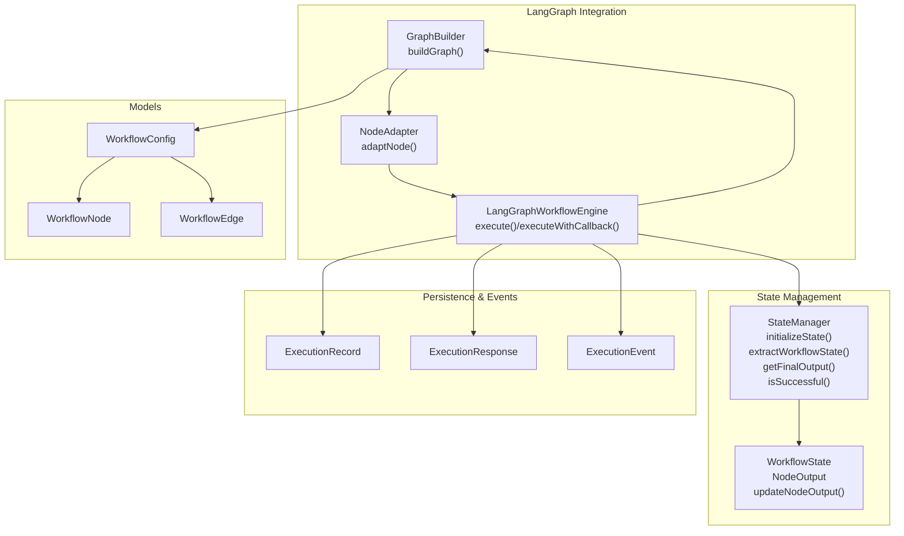
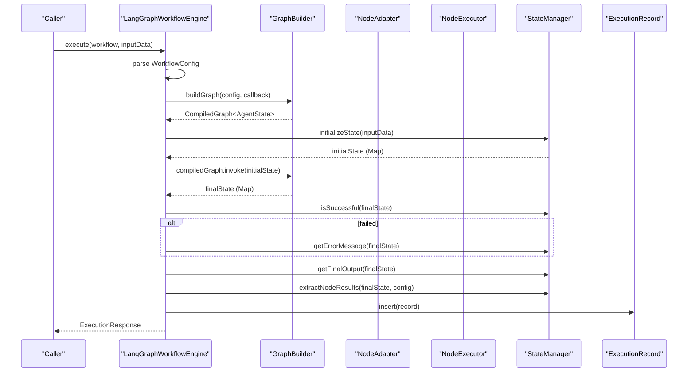
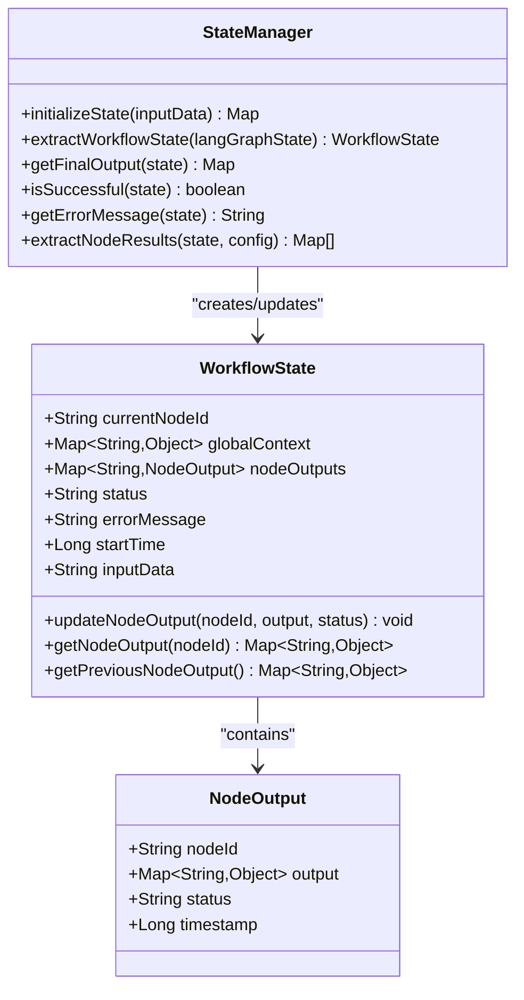
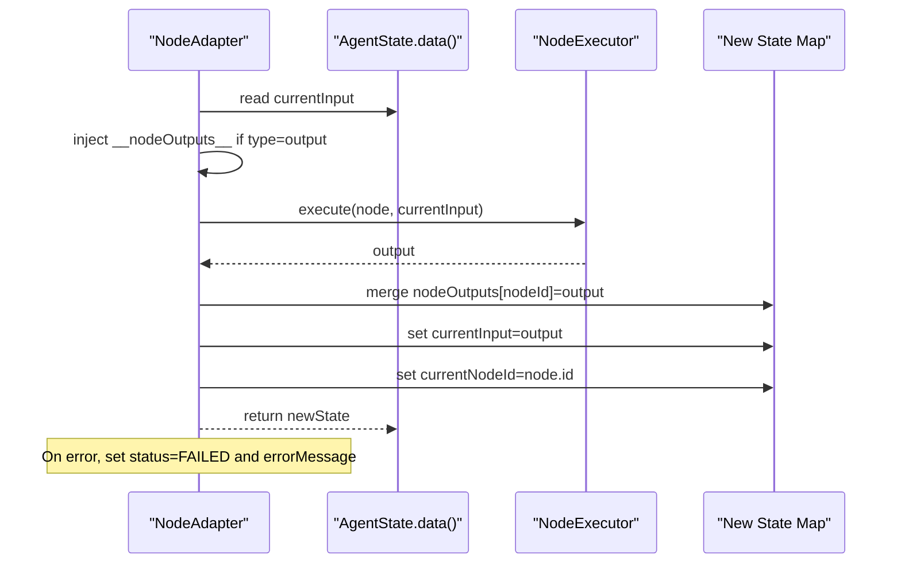
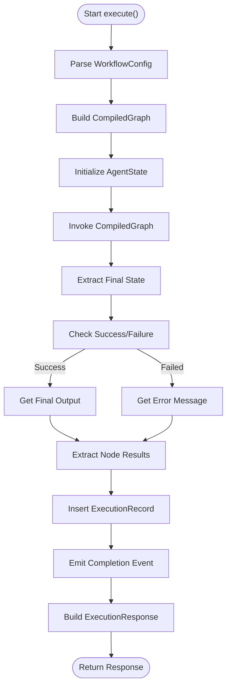
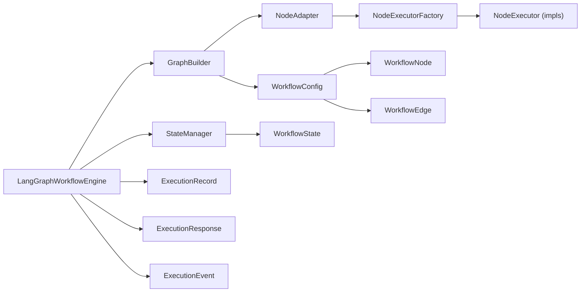

# State Management

<cite>
**Referenced Files in This Document**
- [StateManager.java](file://backend/src/main/java/com/paiagent/engine/langgraph/state/StateManager.java)
- [WorkflowState.java](file://backend/src/main/java/com/paiagent/engine/langgraph/WorkflowState.java)
- [LangGraphWorkflowEngine.java](file://backend/src/main/java/com/paiagent/engine/langgraph/LangGraphWorkflowEngine.java)
- [GraphBuilder.java](file://backend/src/main/java/com/paiagent/engine/langgraph/builder/GraphBuilder.java)
- [NodeAdapter.java](file://backend/src/main/java/com/paiagent/engine/langgraph/adapter/NodeAdapter.java)
- [WorkflowConfig.java](file://backend/src/main/java/com/paiagent/engine/model/WorkflowConfig.java)
- [WorkflowNode.java](file://backend/src/main/java/com/paiagent/engine/model/WorkflowNode.java)
- [WorkflowEdge.java](file://backend/src/main/java/com/paiagent/engine/model/WorkflowEdge.java)
- [ExecutionRecord.java](file://backend/src/main/java/com/paiagent/entity/ExecutionRecord.java)
- [ExecutionResponse.java](file://backend/src/main/java/com/paiagent/dto/ExecutionResponse.java)
- [ExecutionEvent.java](file://backend/src/main/java/com/paiagent/dto/ExecutionEvent.java)
- [NodeExecutorFactory.java](file://backend/src/main/java/com/paiagent/engine/executor/NodeExecutorFactory.java)
- [InputNodeExecutor.java](file://backend/src/main/java/com/paiagent/engine/executor/impl/InputNodeExecutor.java)
- [OutputNodeExecutor.java](file://backend/src/main/java/com/paiagent/engine/executor/impl/OutputNodeExecutor.java)
- [LangGraphWorkflowEngineTest.java](file://backend/src/test/java/com/paiagent/engine/langgraph/LangGraphWorkflowEngineTest.java)
- [LangGraphBasicTest.java](file://backend/src/test/java/com/paiagent/engine/langgraph/LangGraphBasicTest.java)
</cite>

## Table of Contents
1. [Introduction](#introduction)
2. [Project Structure](#project-structure)
3. [Core Components](#core-components)
4. [Architecture Overview](#architecture-overview)
5. [Detailed Component Analysis](#detailed-component-analysis)
6. [Dependency Analysis](#dependency-analysis)
7. [Performance Considerations](#performance-considerations)
8. [Troubleshooting Guide](#troubleshooting-guide)
9. [Conclusion](#conclusion)
10. [Appendices](#appendices)

## Introduction
This document explains the state management system in the workflow engine, focusing on how AgentState integrates with LangGraph4j, how state is initialized, transformed, validated, extracted, persisted, handled on errors, and cleaned up. It covers the end-to-end lifecycle from input to execution metadata, and provides practical examples, debugging tips, and performance optimization guidance.

## Project Structure
The state management system spans several packages:
- langgraph: orchestrates LangGraph4j integration, builds the graph, and executes workflows
- langgraph.state: manages the AgentState lifecycle and extraction to domain models
- model: defines workflow configuration and graph topology
- executor: executes nodes and updates state via the adapter
- entity and dto: persist execution results and expose responses/events

**Diagram sources**
- [LangGraphWorkflowEngine.java:44-184](file://backend/src/main/java/com/paiagent/engine/langgraph/LangGraphWorkflowEngine.java#L44-L184)
- [GraphBuilder.java:39-63](file://backend/src/main/java/com/paiagent/engine/langgraph/builder/GraphBuilder.java#L39-L63)
- [NodeAdapter.java:39-112](file://backend/src/main/java/com/paiagent/engine/langgraph/adapter/NodeAdapter.java#L39-L112)
- [StateManager.java:26-162](file://backend/src/main/java/com/paiagent/engine/langgraph/state/StateManager.java#L26-L162)
- [WorkflowState.java:14-125](file://backend/src/main/java/com/paiagent/engine/langgraph/WorkflowState.java#L14-L125)
- [WorkflowConfig.java:10-21](file://backend/src/main/java/com/paiagent/engine/model/WorkflowConfig.java#L10-L21)
- [WorkflowNode.java:10-37](file://backend/src/main/java/com/paiagent/engine/model/WorkflowNode.java#L10-L37)
- [WorkflowEdge.java:9-35](file://backend/src/main/java/com/paiagent/engine/model/WorkflowEdge.java#L9-L35)
- [ExecutionRecord.java:12-66](file://backend/src/main/java/com/paiagent/entity/ExecutionRecord.java#L12-L66)
- [ExecutionResponse.java:10-28](file://backend/src/main/java/com/paiagent/dto/ExecutionResponse.java#L10-L28)
- [ExecutionEvent.java:6-79](file://backend/src/main/java/com/paiagent/dto/ExecutionEvent.java#L6-L79)

**Section sources**
- [LangGraphWorkflowEngine.java:44-184](file://backend/src/main/java/com/paiagent/engine/langgraph/LangGraphWorkflowEngine.java#L44-L184)
- [GraphBuilder.java:39-63](file://backend/src/main/java/com/paiagent/engine/langgraph/builder/GraphBuilder.java#L39-L63)
- [NodeAdapter.java:39-112](file://backend/src/main/java/com/paiagent/engine/langgraph/adapter/NodeAdapter.java#L39-L112)
- [StateManager.java:26-162](file://backend/src/main/java/com/paiagent/engine/langgraph/state/StateManager.java#L26-L162)
- [WorkflowState.java:14-125](file://backend/src/main/java/com/paiagent/engine/langgraph/WorkflowState.java#L14-L125)
- [WorkflowConfig.java:10-21](file://backend/src/main/java/com/paiagent/engine/model/WorkflowConfig.java#L10-L21)
- [WorkflowNode.java:10-37](file://backend/src/main/java/com/paiagent/engine/model/WorkflowNode.java#L10-L37)
- [WorkflowEdge.java:9-35](file://backend/src/main/java/com/paiagent/engine/model/WorkflowEdge.java#L9-L35)
- [ExecutionRecord.java:12-66](file://backend/src/main/java/com/paiagent/entity/ExecutionRecord.java#L12-L66)
- [ExecutionResponse.java:10-28](file://backend/src/main/java/com/paiagent/dto/ExecutionResponse.java#L10-L28)
- [ExecutionEvent.java:6-79](file://backend/src/main/java/com/paiagent/dto/ExecutionEvent.java#L6-L79)

## Core Components
- StateManager: initializes AgentState, extracts WorkflowState, computes final output, checks success, retrieves error messages, and transforms node outputs for reporting.
- WorkflowState: the domain model representing execution state, node outputs, and metadata.
- LangGraphWorkflowEngine: orchestrates workflow execution, integrates with LangGraph4j, coordinates state transitions, and persists results.
- GraphBuilder: constructs the StateGraph from WorkflowConfig and wires nodes/edges.
- NodeAdapter: bridges NodeExecutor with LangGraph’s AgentState, updating state after each node execution and propagating errors.
- Models: WorkflowConfig, WorkflowNode, WorkflowEdge define the graph structure.
- Persistence and Events: ExecutionRecord, ExecutionResponse, ExecutionEvent capture execution outcomes and progress.

Key responsibilities:
- Initialization: StateManager.initializeState sets initial keys and timestamps.
- Transformation: NodeAdapter reads currentInput, executes NodeExecutor, writes nodeOutputs, and updates currentInput/currentNodeId.
- Extraction: StateManager.extractWorkflowState converts AgentState to WorkflowState; extractNodeResults serializes per-node outputs.
- Validation: isSuccessful inspects status; getErrorMessage surfaces error messages.
- Persistence: LangGraphWorkflowEngine saves ExecutionRecord and builds ExecutionResponse.
- Cleanup: StateManager does not explicitly clear state; cleanup occurs implicitly by replacing state maps per invocation.

**Section sources**
- [StateManager.java:26-162](file://backend/src/main/java/com/paiagent/engine/langgraph/state/StateManager.java#L26-L162)
- [WorkflowState.java:14-125](file://backend/src/main/java/com/paiagent/engine/langgraph/WorkflowState.java#L14-L125)
- [LangGraphWorkflowEngine.java:44-184](file://backend/src/main/java/com/paiagent/engine/langgraph/LangGraphWorkflowEngine.java#L44-L184)
- [GraphBuilder.java:39-63](file://backend/src/main/java/com/paiagent/engine/langgraph/builder/GraphBuilder.java#L39-L63)
- [NodeAdapter.java:39-112](file://backend/src/main/java/com/paiagent/engine/langgraph/adapter/NodeAdapter.java#L39-L112)
- [WorkflowConfig.java:10-21](file://backend/src/main/java/com/paiagent/engine/model/WorkflowConfig.java#L10-L21)
- [WorkflowNode.java:10-37](file://backend/src/main/java/com/paiagent/engine/model/WorkflowNode.java#L10-L37)
- [WorkflowEdge.java:9-35](file://backend/src/main/java/com/paiagent/engine/model/WorkflowEdge.java#L9-L35)
- [ExecutionRecord.java:12-66](file://backend/src/main/java/com/paiagent/entity/ExecutionRecord.java#L12-L66)
- [ExecutionResponse.java:10-28](file://backend/src/main/java/com/paiagent/dto/ExecutionResponse.java#L10-L28)
- [ExecutionEvent.java:6-79](file://backend/src/main/java/com/paiagent/dto/ExecutionEvent.java#L6-L79)

## Architecture Overview
The engine composes LangGraph4j with internal state management and persistence:

**Diagram sources**
- [LangGraphWorkflowEngine.java:44-184](file://backend/src/main/java/com/paiagent/engine/langgraph/LangGraphWorkflowEngine.java#L44-L184)
- [GraphBuilder.java:39-63](file://backend/src/main/java/com/paiagent/engine/langgraph/builder/GraphBuilder.java#L39-L63)
- [StateManager.java:26-162](file://backend/src/main/java/com/paiagent/engine/langgraph/state/StateManager.java#L26-L162)
- [ExecutionRecord.java:12-66](file://backend/src/main/java/com/paiagent/entity/ExecutionRecord.java#L12-L66)

## Detailed Component Analysis

### StateManager
Responsibilities:
- Initialize AgentState with input, currentInput, nodeOutputs, status, and timestamps
- Extract WorkflowState from AgentState, including node outputs and global context
- Compute final output from currentInput
- Determine success/failure and retrieve error messages
- Transform node outputs into a reportable list

**Diagram sources**
- [StateManager.java:26-162](file://backend/src/main/java/com/paiagent/engine/langgraph/state/StateManager.java#L26-L162)
- [WorkflowState.java:14-125](file://backend/src/main/java/com/paiagent/engine/langgraph/WorkflowState.java#L14-L125)

**Section sources**
- [StateManager.java:26-162](file://backend/src/main/java/com/paiagent/engine/langgraph/state/StateManager.java#L26-L162)
- [WorkflowState.java:14-125](file://backend/src/main/java/com/paiagent/engine/langgraph/WorkflowState.java#L14-L125)

### NodeAdapter and NodeExecutor Integration
Behavior:
- Reads currentInput from AgentState
- Injects __nodeOutputs__ into currentInput for output nodes
- Executes NodeExecutor and writes nodeOutputs keyed by nodeId
- Updates currentInput to node output and sets currentNodeId
- On failure, marks status FAILED and stores error message

**Diagram sources**
- [NodeAdapter.java:39-112](file://backend/src/main/java/com/paiagent/engine/langgraph/adapter/NodeAdapter.java#L39-L112)
- [NodeExecutorFactory.java:14-35](file://backend/src/main/java/com/paiagent/engine/executor/NodeExecutorFactory.java#L14-L35)
- [InputNodeExecutor.java:14-26](file://backend/src/main/java/com/paiagent/engine/executor/impl/InputNodeExecutor.java#L14-L26)
- [OutputNodeExecutor.java:19-122](file://backend/src/main/java/com/paiagent/engine/executor/impl/OutputNodeExecutor.java#L19-L122)

**Section sources**
- [NodeAdapter.java:39-112](file://backend/src/main/java/com/paiagent/engine/langgraph/adapter/NodeAdapter.java#L39-L112)
- [NodeExecutorFactory.java:14-35](file://backend/src/main/java/com/paiagent/engine/executor/NodeExecutorFactory.java#L14-L35)
- [InputNodeExecutor.java:14-26](file://backend/src/main/java/com/paiagent/engine/executor/impl/InputNodeExecutor.java#L14-L26)
- [OutputNodeExecutor.java:19-122](file://backend/src/main/java/com/paiagent/engine/executor/impl/OutputNodeExecutor.java#L19-L122)

### LangGraphWorkflowEngine Execution Flow
Highlights:
- Parses WorkflowConfig from workflow.getFlowData()
- Builds CompiledGraph via GraphBuilder
- Initializes AgentState with StateManager
- Invokes graph and captures final state
- Checks success and extracts outputs/results
- Persists ExecutionRecord and emits events
- Constructs ExecutionResponse

**Diagram sources**
- [LangGraphWorkflowEngine.java:44-184](file://backend/src/main/java/com/paiagent/engine/langgraph/LangGraphWorkflowEngine.java#L44-L184)
- [StateManager.java:26-162](file://backend/src/main/java/com/paiagent/engine/langgraph/state/StateManager.java#L26-L162)
- [ExecutionRecord.java:12-66](file://backend/src/main/java/com/paiagent/entity/ExecutionRecord.java#L12-L66)

**Section sources**
- [LangGraphWorkflowEngine.java:44-184](file://backend/src/main/java/com/paiagent/engine/langgraph/LangGraphWorkflowEngine.java#L44-L184)
- [StateManager.java:26-162](file://backend/src/main/java/com/paiagent/engine/langgraph/state/StateManager.java#L26-L162)
- [ExecutionRecord.java:12-66](file://backend/src/main/java/com/paiagent/entity/ExecutionRecord.java#L12-L66)

### State Extraction and Reporting
- Final output: StateManager.getFinalOutput returns currentInput
- Node results: StateManager.extractNodeResults maps nodeOutputs to a list of node results with nodeId, nodeName, status, and serialized output
- WorkflowState extraction: StateManager.extractWorkflowState populates WorkflowState with inputData, status, error, timestamps, current node, node outputs, and global context

**Section sources**
- [StateManager.java:89-162](file://backend/src/main/java/com/paiagent/engine/langgraph/state/StateManager.java#L89-L162)
- [WorkflowState.java:55-99](file://backend/src/main/java/com/paiagent/engine/langgraph/WorkflowState.java#L55-L99)

### Persistence and Metadata
- ExecutionRecord captures flowId, inputData, outputData, status, nodeResults, errorMessage, duration, and executedAt
- ExecutionResponse exposes executionId, status, nodeResults, outputData, and duration
- ExecutionEvent provides structured progress and completion notifications

**Section sources**
- [ExecutionRecord.java:12-66](file://backend/src/main/java/com/paiagent/entity/ExecutionRecord.java#L12-L66)
- [ExecutionResponse.java:10-28](file://backend/src/main/java/com/paiagent/dto/ExecutionResponse.java#L10-L28)
- [ExecutionEvent.java:6-79](file://backend/src/main/java/com/paiagent/dto/ExecutionEvent.java#L6-L79)

## Dependency Analysis
- LangGraphWorkflowEngine depends on GraphBuilder, StateManager, ExecutionRecordMapper, and implements WorkflowExecutor
- GraphBuilder depends on NodeAdapter and constructs StateGraph from WorkflowConfig
- NodeAdapter depends on NodeExecutorFactory and adapts NodeExecutor to AsyncNodeAction
- StateManager depends on WorkflowState and produces/consumes AgentState maps
- Models (WorkflowConfig, WorkflowNode, WorkflowEdge) define graph structure

**Diagram sources**
- [LangGraphWorkflowEngine.java:32-38](file://backend/src/main/java/com/paiagent/engine/langgraph/LangGraphWorkflowEngine.java#L32-L38)
- [GraphBuilder.java:26-29](file://backend/src/main/java/com/paiagent/engine/langgraph/builder/GraphBuilder.java#L26-L29)
- [NodeAdapter.java:27-30](file://backend/src/main/java/com/paiagent/engine/langgraph/adapter/NodeAdapter.java#L27-L30)
- [NodeExecutorFactory.java:14-35](file://backend/src/main/java/com/paiagent/engine/executor/NodeExecutorFactory.java#L14-L35)
- [StateManager.java:18](file://backend/src/main/java/com/paiagent/engine/langgraph/state/StateManager.java#L18)
- [WorkflowState.java:14](file://backend/src/main/java/com/paiagent/engine/langgraph/WorkflowState.java#L14)
- [ExecutionRecord.java:12-66](file://backend/src/main/java/com/paiagent/entity/ExecutionRecord.java#L12-L66)
- [ExecutionResponse.java:10-28](file://backend/src/main/java/com/paiagent/dto/ExecutionResponse.java#L10-L28)
- [ExecutionEvent.java:6-79](file://backend/src/main/java/com/paiagent/dto/ExecutionEvent.java#L6-L79)
- [WorkflowConfig.java:10-21](file://backend/src/main/java/com/paiagent/engine/model/WorkflowConfig.java#L10-L21)
- [WorkflowNode.java:10-37](file://backend/src/main/java/com/paiagent/engine/model/WorkflowNode.java#L10-L37)
- [WorkflowEdge.java:9-35](file://backend/src/main/java/com/paiagent/engine/model/WorkflowEdge.java#L9-L35)

**Section sources**
- [LangGraphWorkflowEngine.java:32-38](file://backend/src/main/java/com/paiagent/engine/langgraph/LangGraphWorkflowEngine.java#L32-L38)
- [GraphBuilder.java:26-29](file://backend/src/main/java/com/paiagent/engine/langgraph/builder/GraphBuilder.java#L26-L29)
- [NodeAdapter.java:27-30](file://backend/src/main/java/com/paiagent/engine/langgraph/adapter/NodeAdapter.java#L27-L30)
- [NodeExecutorFactory.java:14-35](file://backend/src/main/java/com/paiagent/engine/executor/NodeExecutorFactory.java#L14-L35)
- [StateManager.java:18](file://backend/src/main/java/com/paiagent/engine/langgraph/state/StateManager.java#L18)
- [WorkflowState.java:14](file://backend/src/main/java/com/paiagent/engine/langgraph/WorkflowState.java#L14)
- [ExecutionRecord.java:12-66](file://backend/src/main/java/com/paiagent/entity/ExecutionRecord.java#L12-L66)
- [ExecutionResponse.java:10-28](file://backend/src/main/java/com/paiagent/dto/ExecutionResponse.java#L10-L28)
- [ExecutionEvent.java:6-79](file://backend/src/main/java/com/paiagent/dto/ExecutionEvent.java#L6-L79)
- [WorkflowConfig.java:10-21](file://backend/src/main/java/com/paiagent/engine/model/WorkflowConfig.java#L10-L21)
- [WorkflowNode.java:10-37](file://backend/src/main/java/com/paiagent/engine/model/WorkflowNode.java#L10-L37)
- [WorkflowEdge.java:9-35](file://backend/src/main/java/com/paiagent/engine/model/WorkflowEdge.java#L9-L35)

## Performance Considerations
- Prefer compact node output structures to minimize memory footprint in nodeOutputs and currentInput.
- Avoid deep cloning of large maps; reuse maps where safe (as done in NodeAdapter when injecting __nodeOutputs__).
- Limit globalContext size; keep only essential shared data.
- Use streaming or chunked processing for large inputs/outputs when applicable.
- Cache frequently accessed node configurations (e.g., outputParams) to reduce repeated parsing overhead.
- Keep ExecutionRecord minimal; avoid storing redundant copies of input/output data if not required.

[No sources needed since this section provides general guidance]

## Troubleshooting Guide
Common issues and remedies:
- Empty final output: Verify currentInput is being updated by the last executed node; check NodeAdapter updates currentInput and currentNodeId.
- Missing node results: Ensure nodeOutputs is populated; confirm StateManager.extractNodeResults iterates over nodeOutputs and config nodes.
- Status stuck at RUNNING: Confirm status is updated on exceptions; NodeAdapter sets status=FAILED and errorMessage on failures.
- Error propagation: Use getErrorMessage to surface detailed error messages; inspect ExecutionRecord.errorMessage for persisted failures.
- Debugging state: Subscribe to ExecutionEvent callbacks to observe nodeStart/nodeSuccess/nodeError/workflowStart/workflowComplete events.
- Test assertions: Use provided tests to validate behavior for simple and multi-node workflows.

Practical examples:
- Validate engine type and basic execution: see [LangGraphWorkflowEngineTest.java:30-54](file://backend/src/test/java/com/paiagent/engine/langgraph/LangGraphWorkflowEngineTest.java#L30-L54)
- Multi-node workflow execution: see [LangGraphWorkflowEngineTest.java:57-71](file://backend/src/test/java/com/paiagent/engine/langgraph/LangGraphWorkflowEngineTest.java#L57-L71)
- Event callback verification: see [LangGraphWorkflowEngineTest.java:74-98](file://backend/src/test/java/com/paiagent/engine/langgraph/LangGraphWorkflowEngineTest.java#L74-L98)
- Basic state and LangGraph dependency checks: see [LangGraphBasicTest.java:21-86](file://backend/src/test/java/com/paiagent/engine/langgraph/LangGraphBasicTest.java#L21-L86)

**Section sources**
- [LangGraphWorkflowEngineTest.java:30-98](file://backend/src/test/java/com/paiagent/engine/langgraph/LangGraphWorkflowEngineTest.java#L30-L98)
- [LangGraphBasicTest.java:21-86](file://backend/src/test/java/com/paiagent/engine/langgraph/LangGraphBasicTest.java#L21-L86)
- [NodeAdapter.java:96-110](file://backend/src/main/java/com/paiagent/engine/langgraph/adapter/NodeAdapter.java#L96-L110)
- [ExecutionEvent.java:15-79](file://backend/src/main/java/com/paiagent/dto/ExecutionEvent.java#L15-L79)

## Conclusion
The state management system integrates LangGraph4j with internal models and persistence. StateManager handles initialization, extraction, and reporting; NodeAdapter mediates node execution and state updates; LangGraphWorkflowEngine orchestrates the end-to-end flow and persists results. Robust error handling and event emission enable effective debugging and monitoring.

[No sources needed since this section summarizes without analyzing specific files]

## Appendices

### Practical Examples Index
- Simple workflow execution and assertions: [LangGraphWorkflowEngineTest.java:35-54](file://backend/src/test/java/com/paiagent/engine/langgraph/LangGraphWorkflowEngineTest.java#L35-L54)
- Multi-node workflow execution: [LangGraphWorkflowEngineTest.java:57-71](file://backend/src/test/java/com/paiagent/engine/langgraph/LangGraphWorkflowEngineTest.java#L57-L71)
- Event callback collection: [LangGraphWorkflowEngineTest.java:74-98](file://backend/src/test/java/com/paiagent/engine/langgraph/LangGraphWorkflowEngineTest.java#L74-L98)
- Basic state and LangGraph dependency validation: [LangGraphBasicTest.java:21-86](file://backend/src/test/java/com/paiagent/engine/langgraph/LangGraphBasicTest.java#L21-L86)

### State Manipulation References
- Initialize state: [StateManager.java:26-47](file://backend/src/main/java/com/paiagent/engine/langgraph/state/StateManager.java#L26-L47)
- Update node output and current input: [NodeAdapter.java:70-83](file://backend/src/main/java/com/paiagent/engine/langgraph/adapter/NodeAdapter.java#L70-L83)
- Extract final output: [StateManager.java:89-96](file://backend/src/main/java/com/paiagent/engine/langgraph/state/StateManager.java#L89-L96)
- Extract node results: [StateManager.java:126-162](file://backend/src/main/java/com/paiagent/engine/langgraph/state/StateManager.java#L126-L162)
- Convert AgentState to WorkflowState: [StateManager.java:55-81](file://backend/src/main/java/com/paiagent/engine/langgraph/state/StateManager.java#L55-L81)